# Stock Exceptions composition and evidence improvement

## Latest reviewer note: semantic severity

### Capture timing correction discovered afterward

The concise-completion narrow filtered capture showed a blue-tinted border while the radio was unchecked. A direct browser read confirmed the component already used its neutral border class, but its finite CSS color transition was still running. Waiting for that transition produced `rgba(41, 41, 41, 0.08)`, exactly the selected checkout's `--color-border-subtle` value. This is a capture-timing defect, not evidence that the app selected a hidden record. Historical captures and scores remain unchanged; later settled captures must disclose this method correction rather than claim a UI improvement from the removed transient tint.

The [semantic-severity report](stock-exceptions-semantic-severity-234749774Z/README.md) scored 90/100. Its claim that the first narrow-list record omits its location is incorrect: `desktop-custom-700x900-0.png` visibly shows “Riverside” beneath “Free-range Eggs 12ct”. The original judgment and score are preserved, not edited or rerolled. This reviewer correction is separate evidence.

The measured severity-text contrast concern is real and comes from the existing shared `danger`/`warning` variants. No palette changes were made. The stale selection instruction in detail-only mode is a confirmed generated-copy defect.

Remaining dynamic callback, ReactNode, and branch observations remain unassessed under the current evaluator rules; public types alone do not prove runtime rendering or browser style ownership. A partial 100 adherence score must not be presented as complete coverage.

The evaluator/report changes landed through [PR #338](https://github.com/withAutograph/autograph-app-builder/pull/338) at `296452aec61bbfcd8e4f3ed7f70fc8770af0908b`. Both exact-head and resulting-main CI passed. The subsequent improvement work is a local candidate, not a production deployment or proof that generation always produces this result.

## Results

| Observation | Subjective design | Evidence notes |
| --- | --- | --- |
| [Saved baseline](stock-exceptions-adherence-v2-181423365Z/README.md) | 75/100 | Evaluator 2; initial states only |
| [First composition pass](stock-exceptions-composition-first-pass-185811538Z/README.md) | 65/100 | Supplier fixture used the wrong locator; vertical scrolling was not reported; retained rather than discarded |
| [Corrected composition](stock-exceptions-composition-corrected-190303519Z/README.md) | 80/100 | Evaluator 3; all nine selection/supplier, simulated-order, and filter checks passed across three desktop windows |
| [Tabbed detail](stock-exceptions-tabbed-detail-191819290Z/README.md) | 80/100 | Existing shared tabs keep each detail group and action visible; all nine interaction checks passed |

The judge model and rubric remain unchanged. Captured states and evaluator capabilities differ, so these are directional observations, not a controlled statistical benchmark or a guarantee of improvement. No judge result was rerolled unchanged to select a higher score. The corrected pass fixed actual copy and fixture defects before one new judgment. Original screenshots and reports remain unchanged. No palette adjustment or generated color override was introduced.

## What changed

- The table keeps product, severity, and cover; secondary values remain in the selected record. The unsupported `narrowLayout` option was removed.
- Selection persists across filters when still applicable; otherwise the first matching record becomes the current selection.
- The existing detail composition uses its scrollable body and persistent footer. Supplier fields use the existing disclosure, not a custom control.
- Simulation is explicit in the visible subtitle and action label, including the completed state. The record-count sentence handles singular and plural.
- These are manual composition changes to the saved generated source, rendered against the existing Vercel Sandbox checkout. A new model-driven walkthrough was not run. The report JSON includes the exact supplied source.
- Corresponding domain-neutral generation guidance is in the agent instructions and the existing Arrusted consumption plan; it does not mandate this layout for other products.

### Same initial state, 1440 × 900

Baseline:

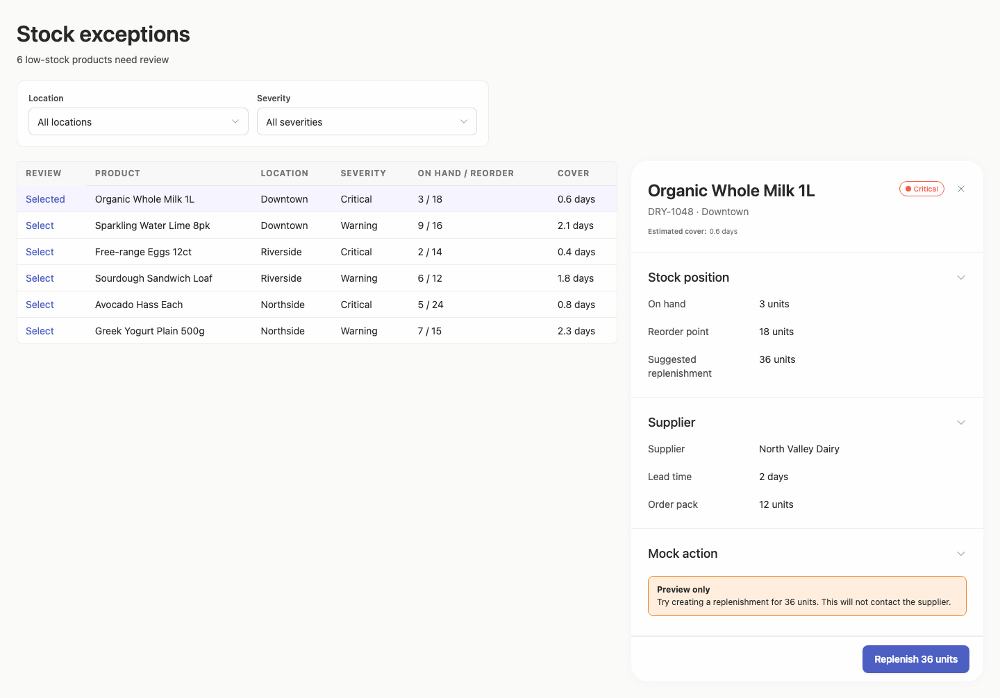

Corrected:

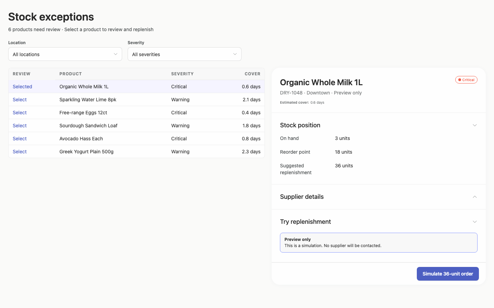

## Adherence confidence

The corrected report says **100/100 partial**, with **0.49% overall evidence coverage**. This is not whole-app adherence. Component evidence covers 8/9 observations; API evidence covers 7/30; generated styling evidence covers 6/4272. The large unassessed styling denominator comes chiefly from compiled inline CSS whose shared/generated origin is unresolved.

The evaluator now checks finite nested props using the selected checkout's real TypeScript APIs and reports actual diagnostic text. It detected an unsupported configuration in the earlier source that the old literal-only checker missed. Any/unknown, recursive, callback-shaped, and unresolved types stay unassessed. Rendered tag/class matches provide review candidates only: shared components can assemble identical classes dynamically, so those matches never earn score credit. Vertical scrolling is now explicitly reported as observed behavior rather than mistakenly omitted from the judge's evidence.

## Remaining work toward a genuine 100

1. Review the existing detail composition's compact field/disclosure capabilities to keep supplier, lead time, and pack size together in shorter desktop windows. Improve the shared API only if an actual missing capability is confirmed.
2. Check supported title/status and metadata arrangements; do not introduce bespoke generated controls or change Arrusted colors for a score.
3. Verify whether table density actually affects header typography before using the judge's suggestion. A model recommendation is not proof of an API.
4. Improve build-time stylesheet/source-map provenance if available. Keep unknown browser origins unassessed; do not manufacture confidence from token matches, unused imports, or class names. No runtime instrumentation or generation gate.
5. Re-evaluate only after meaningful implementation changes. The target remains advisory 100, not a release condition or an excuse for repeated score sampling.

No deployment, package release, provider reconfiguration, or Arrusted shared component publication is part of this comparison.

## Incremental update: tabbed detail

The newest pass reuses the existing `RecordDetailPanel` tabs, ordinary field rows, footer, and subtitle plus a public `StatusPill`. No shared component or palette was changed. Stock position and supplier information occupy separate views; the long product title no longer competes with the badge on the same row. Estimated cover is a normal readable field, and simulation remains explicit. The source and all twelve screenshots are in the new report; earlier runs remain unchanged.

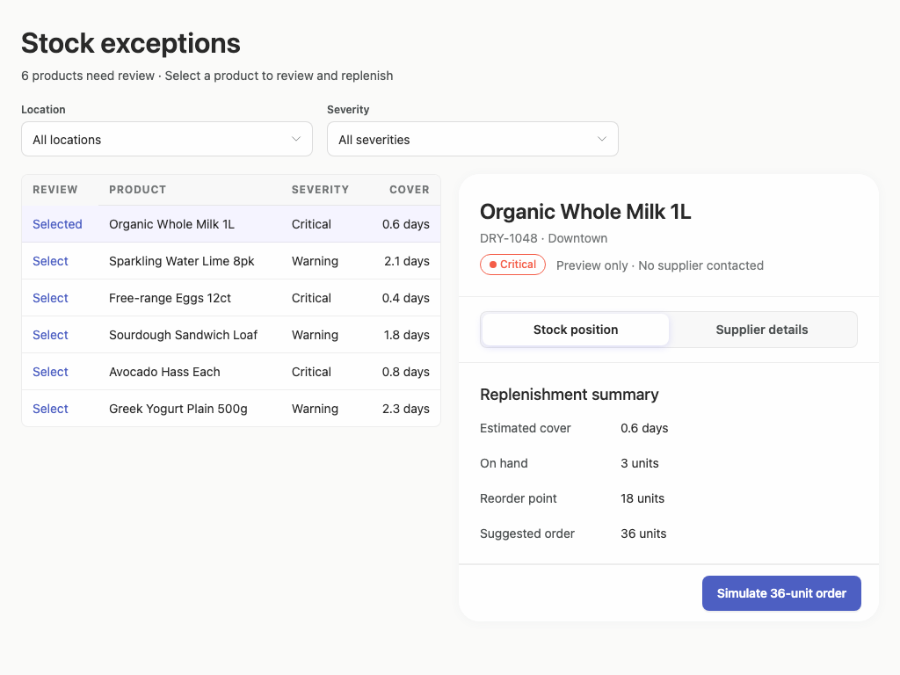

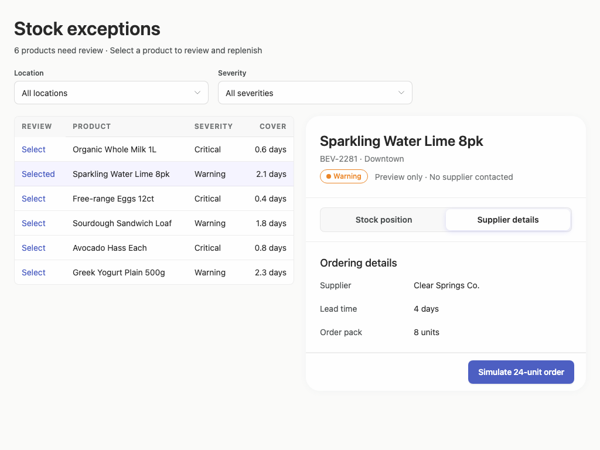

The unchanged model/rubric scored this pass **80/100**, not 100. It no longer identified the long scrolling detail body as a defect. It still identified the repetitive selection column, plain severity text, and small table headers. Its suggestions of a richer cell or typography variant are hypotheses: the inspected DataTable supports serializable cells and row density, not arbitrary cell rendering or a header typography variant. Do not invent those props or override colors to follow a model recommendation.

Component evidence now covers **9/10**, API evidence **13/33**, and generated styling **8/4277** observations. The TypeScript checker no longer mistakes independent sibling fields with the same type for recursion. True cycles, unresolved values, and callbacks remain unassessed. Composition changes also change the denominator, so this is not a controlled evaluator-only comparison.

The compiled preview contains one inline Tailwind stylesheet with no source map or preserved stylesheet URLs. Its matched rules cannot identify which source consumer supplied a utility. The **4269 unknown browser styling observations remain unknown**. A Tailwind class match or ordinary source map alone cannot prove that a utility came from Arrusted. Direct source stylesheet attribution would require separately preserved generated/shared CSS assets at build time; that renderer change has not been implemented or claimed by this PR.

PR #339's first CI attempt found missing TypeScript narrowing in the new class-evidence helper. The follow-up guards absent initializers and namespaced attributes and adds a focused regression. No check or scoring criterion was removed.

## Incremental update: shared selectable cards

[The next report](stock-exceptions-shared-cards-192715403Z/README.md) scored **90/100** with the same model and rubric. All nine scripted supplier, simulation, and filter checks passed. In the integrated Browser, clicking Milk and then pressing ArrowDown selected Avocado and updated its detail panel; that separate keyboard observation is not claimed as an automated report check.

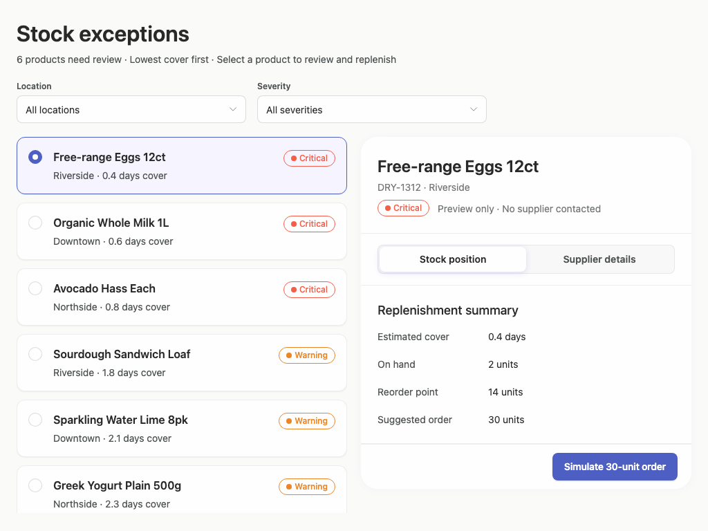

The saved source now uses the existing public `DecisionOptionCard` and `StatusPill`, sorted by lowest cover first. It removes the repeated Select column and small table headers while preserving selection and the shared detail tabs. This is a genuine composition alternative, not a new custom component or a change to Arrusted's palette. The tradeoff is more vertical space; the short desktop list scrolls within its panel. The table alternatives remain preserved.

The remaining findings are important: small shared colored status text has weak contrast, and the detail's post-action status replaces severity with a mock-order outcome. The latter is an actual semantic defect to repair by keeping severity and action outcome separate. The former must be addressed, if needed, through supported composition and readable redundant text—not palette overrides. The evaluator still cannot establish most compiled styling provenance. This report is not a claim of 100/100 quality or complete adherence confidence.

## Incremental update: stronger API evidence on unchanged source

The JSX checker now assesses reliable branches of recursive union types and checks raw string attributes against the selected component's TypeScript props. It does not assume that an unresolved type is valid, or that statically valid JSX rendered in the browser.

Reanalyzing the **same source files saved in the shared-card report**, without capturing screenshots again or rerunning the AI judge, changed these counts:

| Dimension | Before assessed / total | After assessed / total | Remaining unknown |
| --- | --- | --- | --- |
| Component usage | 10 / 11 | 10 / 11 | 1 |
| API usage | 14 / 37 | 25 / 37 | 12 |
| Styling | 9 / 4419 | 9 / 4419 | 4410 |

API evidence coverage rises from **37.84% to 67.57%**. All assessed observations conform, so the advisory adherence score remains **100, partial**. Combined coverage is only **0.99%**, because unknown browser styling dominates the denominator. The subjective design score remains **90/100**; this evidence improvement is not a new visual-quality result.

The archived report and its original screenshots remain unchanged. The source analysis is reproducible with `readReference`, `analyzeSource`, and `scoreAdherence`, using that report's `sourceFiles`, its existing browser observations, and the selected Arrusted checkout. Focused fixtures cover recursive unions, reliable full unions, unresolved members, and equivalent raw versus expression-wrapped JSX strings. No scoring formula or palette changed.

## Incremental update: readable status and honest action outcome

[The next report](stock-exceptions-readable-outcome-195532570Z/README.md) scored **85/100**, down from 90, using the unchanged model and rubric. All nine fixture checks passed and no layout measurement findings were reported. The invalid radio-group container was repaired; shared muted-text contrast observations remain informational.

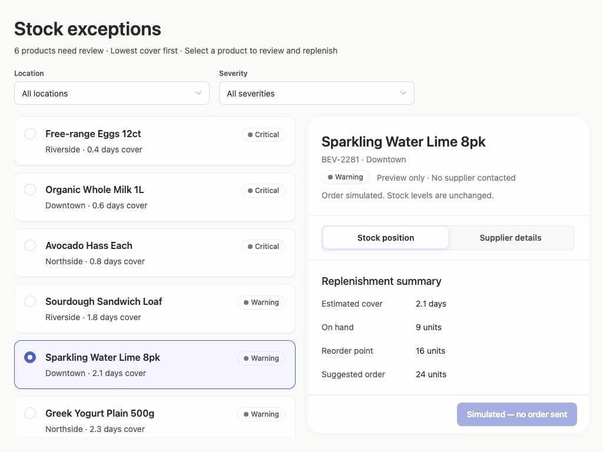

The simulation now retains the record's original severity and separately says that stock levels are unchanged. A narrower desktop window keeps both panes visible. Supported neutral status pills improve the readability of labels, but the reviewer found that the lost color distinction slows urgency scanning. It also found that the fixed-width filter row straddles the narrower list/detail boundary, and that the outcome message is too similar to muted metadata.

These are useful next changes, not a reason to reroll the judge. This report is preserved alongside the stronger 90-point variant. No palette values, scoring weights, or historical reports changed. The UI is still a manually refined generated example, not evidence that every new generation reaches this quality.

## Incremental update: grouped urgency and supported typography

[The grouped-outcome report](stock-exceptions-grouped-outcome-200226952Z/README.md) returns to **90/100** with the unchanged rubric: hierarchy 4, layout 3, typography 4, desktop responsiveness 3, and product clarity 4. All nine fixture interactions passed; the twelve captured states reported no axe violations or layout findings. This is not a claim of complete accessibility compliance.

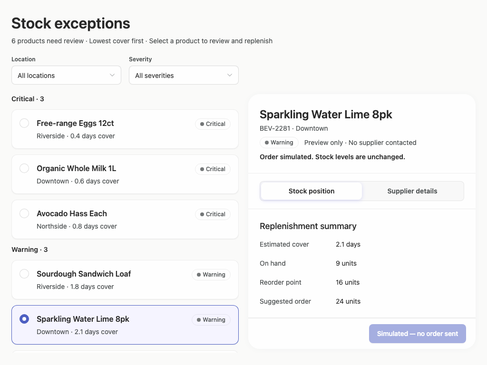

The filters now follow the same grid tracks as the list. Priority headings add structure without recoloring the shared pills. Existing `Typography` variants make supporting information readable and distinguish the action outcome; no palette values or component CSS were modified. The source and screenshots are included in the report, and the 85-point experiment remains unchanged.

Current source evidence assesses **14/17 component observations** and **32/44 API observations**. Styling assesses **11/4421** observations; combined coverage is **1.27%**. The advisory adherence score is still **100, partial**, not proof of complete browser provenance. The new composition changes denominators, so use the unchanged-source comparison above to isolate evaluator improvement.

Remaining subjective findings: the short-window list needs a clearer cue that more records can be scrolled into view, supplier details could offer more decision support from available data, and item-level urgency could be easier to scan. The reviewer has not seen narrower desktop windows. Do not invent supplier data, a nonexistent compact-card prop, or a minimum-width requirement in response. Further changes should improve the actual workflow, not merely fill whitespace or chase a score. No automatic evaluator or repair loop has been introduced.

## Incremental update: delivery context and wider evidence

[The delivery-context report](stock-exceptions-delivery-context-201919952Z/README.md) remains **90/100** with the same model and rubric. It adds a fourth, optional desktop capture at 900×900 and a delivery-within-cover scenario. All **16 fixture interactions passed**, and all **20 screenshots** are saved. The extra window is an observation, not a minimum-width policy; the three default windows are unchanged.

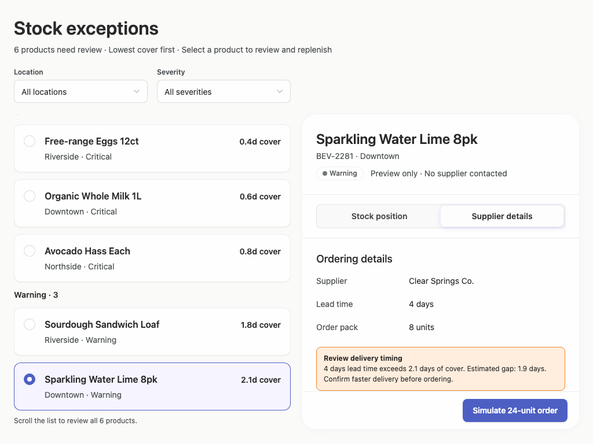

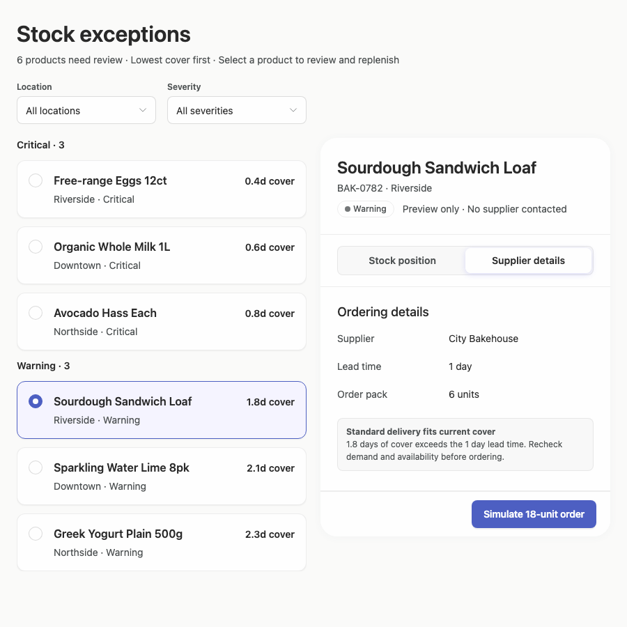

The example makes days of cover prominent, provides a scroll cue when the list actually overflows, and derives delivery guidance from the fixture's existing lead time and cover values. It does not invent supplier information. A supported detail-note item presents the guidance, and simulation remains separate from inventory state. These remain manual refinements of saved generated code, not a claim of improved model generation or a working supplier backend.

The larger evidence set exposed actual accessibility problems: supplier notes produce a nested complementary landmark, and the supplier body in the 1024×768 window scrolls without keyboard focus. No document-overflow or other layout measurement finding was reported, but that does not negate these axe findings. They remain in the report. The subjective reviewer also found lost list-heading context after selection, slight detail overflow, and dense advisory copy. These are the next concrete fixes—not reasons to reroll an unchanged screenshot set.

Adherence remains **100, partial**: component **15/19**, API **34/46**, and styling **12/5892** assessed observations. Combined evidence coverage is **1.02%**. It decreases because the extra browser window adds unknown styling observations; this is not evidence that code quality regressed. Static JSX and prop evidence still do not prove browser styling provenance. The 5880 unknown browser observations receive no positive credit. Previous reports remain unchanged.

The optional `--additional-desktop-size WIDTHxHEIGHT` evaluator flag and archive filename support are covered by eight focused tests. It does not change scoring, the palette, runtime generation, or any default capture size. Broad verification belongs to this increment's exact-head CI.

## Incremental update: compact advice and shared accessibility correction

[The compact-context report](stock-exceptions-compact-context-203050797Z/README.md) records **85/100**, not an improvement to 100. All **16 fixture interactions** passed across the same four windows, with **20 screenshots** preserved. The group headings now remain visible during list scrolling, and delivery advice states the estimated gap plus the next action instead of a dense paragraph.

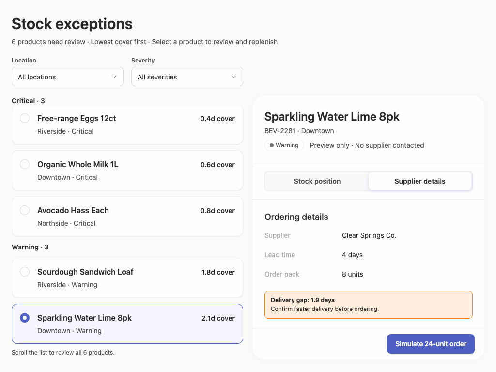

The shared component correction is [Arrusted PR #1309](https://github.com/withAutograph/arrusted-development/pull/1309), candidate `cfd940cad7f13549dec80a1f9d8c33c99e8251fd`. It changes contextual notes from complementary landmarks to ordinary content, and makes the actual scroll body focusable with the existing shared focus treatment. Its focused suite passed **28/28**. The existing Vercel Sandbox rendered that component alongside the saved example; no full regeneration or new backend was involved. The Browser also confirmed that Tab from Supplier details visibly focuses the detail body. That manual observation is separate from the scripted interactions.

The new measurements no longer report either nested complementary landmarks or keyboard-inaccessible scrolling. They do report **2.24:1** contrast for shared field labels. The current component uses `--color-text-disabled` for those labels. Its candidate diff changes no colors, and the selected reference's palette file matches the prior reference byte-for-byte. Previous rendered labels were stronger; earlier screenshots are not proof that every shared component byte matched the selected reference. Do not infer a color repair or complete shared-style provenance from those earlier adherence scores. The observations remain informational; this increment does not recolor the shared component.

The judge's remaining composition suggestions concern the filtered one-record state and visibility of list scrolling. These are subjective opportunities, not runtime requirements. Keep context stable when filtering; do not add a changing layout merely to fill unused space or sample the judge repeatedly.

Adherence remains **100, partial**, with component **15/19**, API **34/46**, and styling **13/5893** assessed observations; combined coverage is **1.04%**. This is still sparse evidence, not a whole-app fidelity claim. The prior 90-point report, source, and screenshots remain unchanged. The shared fix is submitted for review and is not claimed as merged by this report.

The shared PR's React analysis then identified the unnamed focusable container. Follow-up `a93ecef05e14da68f239eb74a48cd7f6942c2a63` names it as a region via the existing panel heading, preserving keyboard access without a rule suppression. The exact CI-pinned React Doctor 0.9.3 changed-scope scan reports zero issues, and the focused component suite remains 28/28. That semantic-only follow-up is not retroactively represented as the version captured above, and did not trigger another visual score run.

## Incremental update: finite prop evidence without another capture

The evaluator can now assess finite object and array literals inside otherwise recursive component prop types. It inspects only the supplied literal structure and then asks TypeScript for assignability. It does not approximate tuple length, required properties, index signatures, or discriminants with a parallel type system. A union must have an independently inspectable, assignable branch; an `any`-bearing alternative cannot rescue a mismatch into positive evidence. Unsupported dynamic expressions, callbacks, spreads, and unresolved types remain unknown. Eighteen focused source/reference tests cover these boundaries.

Reanalysis of the **unchanged saved source and browser observations** from both latest reports changes API evidence from **34/46 (73.91%)** to **37/46 (80.43%)**. Nine API observations remain unknown. Component and styling counts do not change. Combined coverage rises from 1.02% to **1.07%** for delivery-context and from 1.04% to **1.09%** for compact-context. Both adherence scores remain **100, partial**. Their subjective scores remain **90** and **85**; no screenshots were recaptured and no AI judge was rerun for this confidence improvement.

[The count comparison](finite-prop-evidence-reanalysis.json) records the inputs and before/after observations. It can be recomputed by passing each archived report's `sourceFiles`, its selected reference's token CSS and `readReference` result to `analyzeSource`, then passing those new static observations and the report's unchanged `captures[].styles.observations` to `scoreAdherence`. Historical report JSON and screenshots are unchanged. This improves static API confidence only; it does not claim that shared component bytes rendered or that compiled browser styles have known provenance.

## Incremental update: readable tables and natural page flow

[The natural-table report](stock-exceptions-natural-tables-205937286Z/README.md) preserves another **85/100** result under the same model and rubric. Layout improves to **4/4**; hierarchy, typography, and desktop responsiveness each score 3, and product clarity scores 4. This is a targeted improvement, not completion of the 100-point objective or a claim that the generator produces this result automatically.

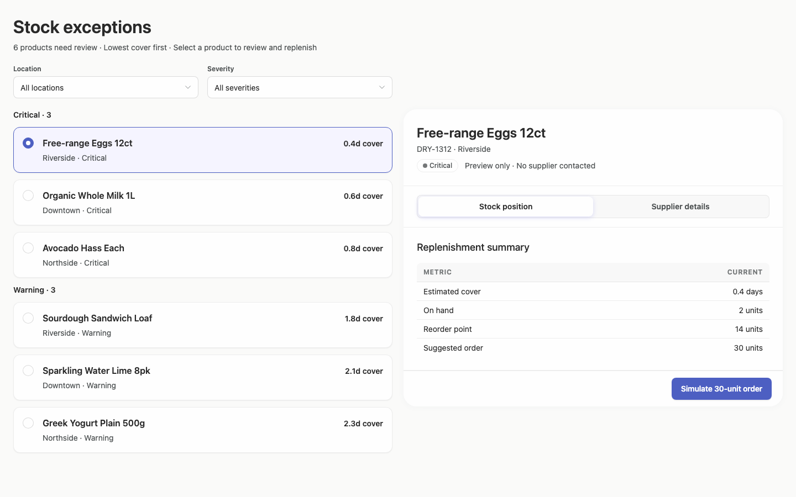

The existing `RecordDetailPanel` table item presents metric/value and supplier detail/value records through the shared `DataTableComposition`. No new visual component, color override, token replacement, or shared palette change was added. The panel and list no longer have generated viewport-height caps; the resize observer, scroll hint, and sticky group-heading wrappers were removed with them. Ordinary page scrolling avoids competing scroll regions and clipped detail rows. At 1024×768 the full page is 844px high, so some actions require a short scroll. This is disclosed as a tradeoff, not hidden by full-page screenshots.

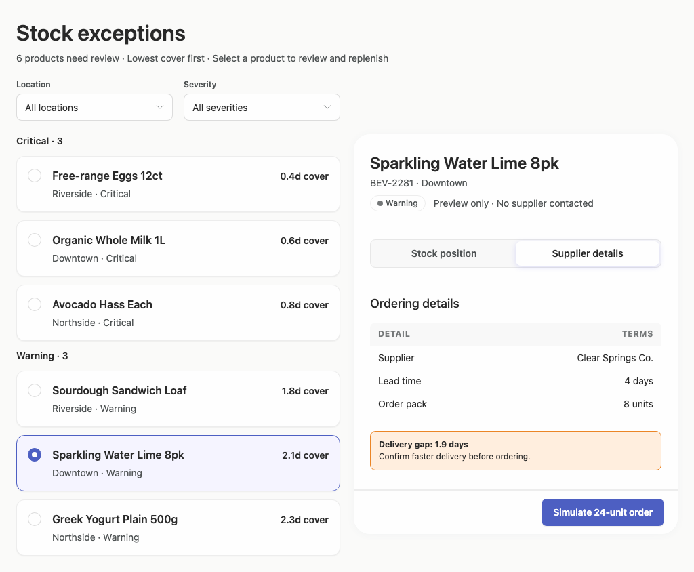

All **16 fixture interactions** pass across four desktop sizes, with **20 screenshots** archived. No layout findings or nested-landmark/scroll-focus violations were reported. The render consumes the shared accessibility candidate `a93ecef05e14da68f239eb74a48cd7f6942c2a63` from Arrusted PR #1309; that PR is not claimed merged. Its Vercel deployment status remains blocked independently of this local render.

The previous shared field-label observation was **2.24:1**. The table instead has a shared header contrast observation of **4.25:1**; it remains informational, not permission to change the Arrusted palette. The judge suggests stronger row-level urgency cues, more immediate short-window actions, and a clearer simulation outcome. Its proposed table-header variant is not an existing API; do not invent that prop or apply an override to satisfy the suggestion.

Adherence is **100, partial**, with **14/17** component, **34/43** API, and **12/5892** styling observations assessed. Combined coverage is **1.01%**. The denominator differs because the generated composition is simpler; it is not a loss of evaluator capability. All 5880 unattributed browser styling observations remain unknown. The source is retained in the report JSON, and all previous reports and screenshots remain unchanged.

## Incremental update: compact public primitives and visible actions

[The compact-primitives report](stock-exceptions-compact-primitives-211034840Z/README.md) remains **85/100**: hierarchy 3, layout 4, typography 3, desktop responsiveness 3, and product clarity 4. All **16 fixture interactions** pass and all **20 captures** have no reported axe violations or layout findings. This is not a claim of complete accessibility compliance or of reaching the 100-point goal.

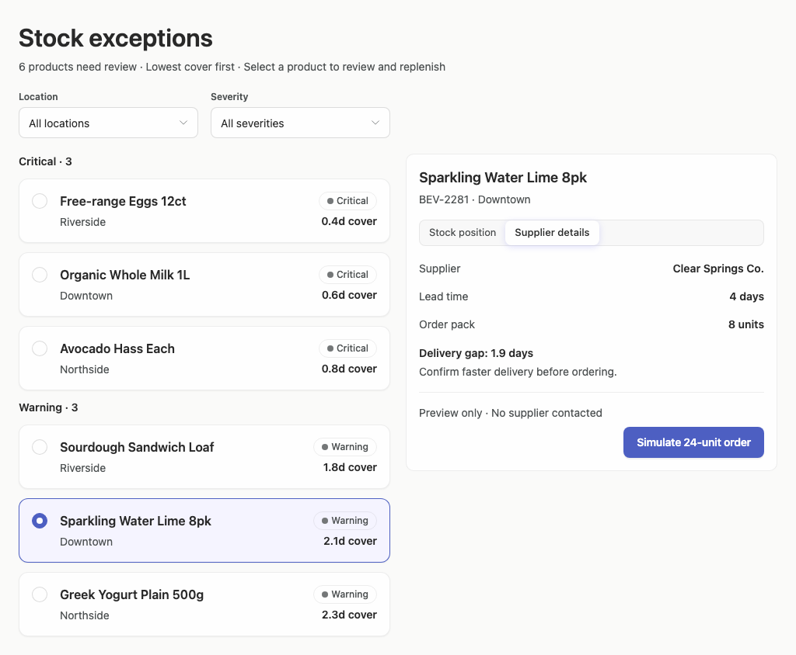

The small read-only detail now composes existing public `Card`, `Typography`, `SegmentedControl`, `Divider`, and `Button` instead of the larger editable `RecordDetailPanel`. Semantic definition-list markup supplies the label/value relationships; no new visual component, copied private CSS, palette override, or replacement token was added. Severity pills and cover values appear together on each selection card. The action outcome sits next to its button, rather than being separated from it by the detail body.

Across the supplied windows the supplier action is at **y=549.5–589.5**, compared with **y=736–776** in the preceding table report. Stock-view actions are at **y=525.5–565.5**. Shorter windows may still scroll the document to see the final list records; primary actions no longer require that scroll in these captures. The rendered HTML was 483,561 bytes versus 3,020,764 for the prior composition; this is an observed artifact size, not a browser performance benchmark.

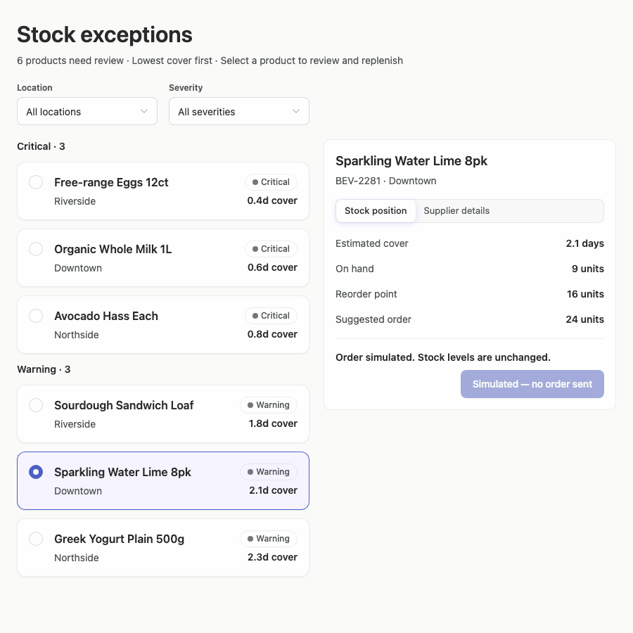

Adherence is **100, partial**, with component **24/28**, API **42/48** (87.5%), and styling **17/5833** assessed observations. Combined coverage is **1.40%**. The composition exposes more inspectable supported props, without changing the evaluator or awarding credit to unknown styling. The remaining **5816** browser styling observations are still unassessed. This is stronger static evidence, not proof of every rendered component's stylesheet origin.

The judge still finds neutral urgency pills visually similar, asks that selected severity/cover also appear in the detail header, and identifies the introductory “review and replenish” wording as less precise than the actual simulation. These are scoped product improvements; they do not authorize recoloring shared components, inventing unsupported props, or rerolling an unchanged judge input.

### Brief-scope correction for the next comparison

The saved source brief used for all comparisons above still said “Make it usable on phones as well as desktop.” That predates the explicit desktop-only direction. Although the evaluator rubric already specifies desktop-only review, this judge mentioned the obsolete phone request in its responsiveness reason and limitations. No score or historical brief has been rewritten, and this report was not rerun.

[The canonical desktop brief](../briefs/stock-exceptions-desktop.txt) now reflects the approved desktop-only scope for future evaluations. It retains the same inventory workflow, simulation, and plan request. Any future report using that brief must disclose the input correction rather than presenting a score change as solely a visual improvement. The scoring rubric and thresholds are unchanged.

## Incremental update: selected context and precise simulation language

[The selected-context report](stock-exceptions-selected-context-211854599Z/README.md) records **85/100**, with hierarchy and typography now **4/4**, and layout, desktop responsiveness, and product clarity **3/4**. All **16 fixture interactions** pass across **20 screenshots**, with no captured axe or layout findings. The overall score remains unchanged and the goal is not complete.

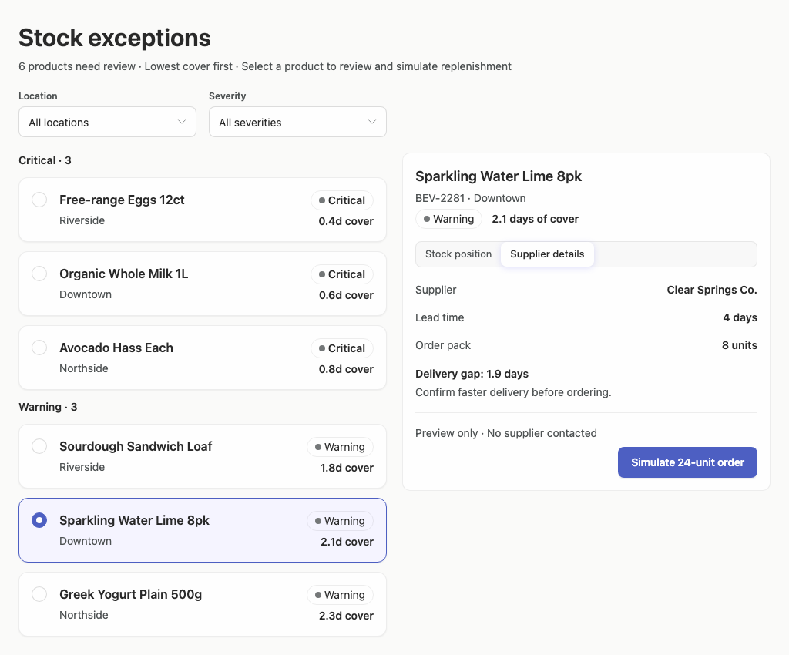

The selected detail header now retains urgency and current cover across both views. Critical pill labels use the public `Typography` body-strong variant, while warning labels use body. The `StatusPill` label slot supplies that shared component content without generated color CSS or palette changes. The opening copy now says “review and simulate replenishment.”

This is the first report using the corrected desktop-only brief linked above. The rubric and model remain unchanged. It must not be presented as a controlled visual-only comparison with earlier reports whose brief asked for phone support. The original reports and their judge findings remain unchanged.

Adherence is **100, partial**, with **28/32** component, **48/56** API, and **18/5826** styling observations assessed; combined coverage is **1.59%**. Eight dynamic API observations and 5808 browser styling observations remain unknown rather than being awarded positive evidence.

The judge identifies two actionable issues: standard selection cards consume substantial vertical space for six records, and the mock order's assumed delivery time is not stated beside the action. A reusable compact density option is being developed in Arrusted, rather than adding generated primitive overrides. Delivery assumptions are a product-copy change. Neither improvement is claimed as present in this archived screenshot set.

## Incremental update: shared compact choices and delivery assumptions

[The compact-delivery report](stock-exceptions-compact-delivery-213406461Z/README.md) records **85/100** with **20/20 fixture interactions** across **24 screenshots**. Layout and typography score 4/4; hierarchy, desktop responsiveness, and product clarity score 3/4. No captured axe violations or measured layout findings were reported. These observations are not a full accessibility or backend proof.

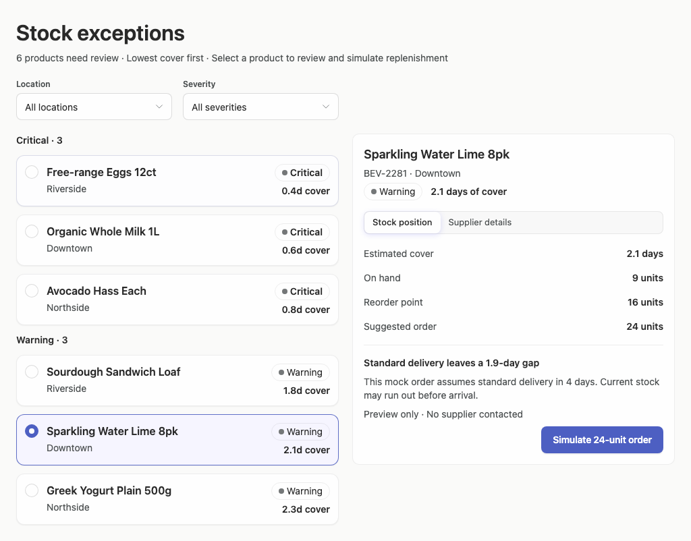

The fixture uses Arrusted's optional `DecisionOptionCard density="compact"` capability from [PR #1309](https://github.com/withAutograph/arrusted-development/pull/1309), which is still a candidate rather than a claimed landed dependency. Shared spacing tokens change; palette, typography, and selection semantics do not. The delivery assumption and its stock-cover consequence now appear beside the simulation action in both tabs. At 1024×768, the unfiltered document height is 802px rather than 850px in the selected-context capture. Ordinary vertical page scrolling remains acceptable; this comparison does not introduce a viewport-fit gate or a minimum-width requirement.

Adherence remains **100, partial**: 28/31 component, 49/57 API, and 17/5825 styling observations are assessed. Combined coverage is **1.59%** (94/5913). The 5808 browser styling observations still lack sufficient source attribution. They remain unknown; visual resemblance, matching values, or class names are not promoted to evidence of generated-versus-inherited ownership.

The judge's actionable product finding is that the Supplier details tab should retain a suggested-order summary near its action. It also suggests stronger non-color urgency hierarchy. These are future refinements, not completed fixes. The model, rubric, and desktop-only brief are unchanged from selected-context; one delivery-assumption scenario was added. Historical reports are preserved. This is a manually refined, component-backed fixture, not proof that every new generation now produces the same quality. The 100-point design goal is not met.

## Incremental update: persistent decision context

[The action-context report](stock-exceptions-action-context-214152809Z/README.md) records **90/100**, with hierarchy, typography, and product clarity at **4/4**; layout and desktop responsiveness remain **3/4**. All **20 fixture interactions** pass across **24 screenshots**, with no captured axe or layout findings.

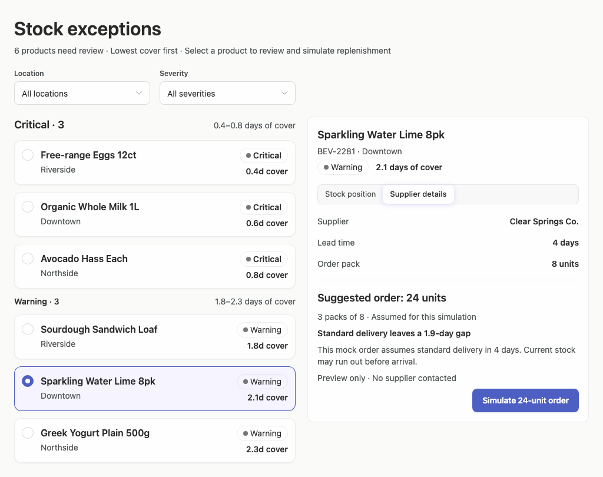

The suggested quantity and pack basis now remain beside the action in both detail views. Urgency groups show their cover range and use existing typography variants rather than palette changes. These are product-context refinements, not new scoring rules or required layouts for other products.

This capture replaces the optional 900px desktop sample with a **700px resized desktop window**, alongside the existing 1024px, 1440px, and 1920px captures. It is evidence of resizing, not phone/tablet acceptance or a minimum-width gate. The new state exposes a real navigation cost: the selected detail appears after the full list when the layout stacks. That remains an open improvement in this archived version. The changed capture set prevents a controlled score-only comparison; the same rubric, model, and desktop brief were used once.

Adherence is **100, partial**, with **31/34** component, **53/61** API, and **18/5793** styling observations assessed (**102/5888 = 1.73%** combined coverage). The denominator changed with the fixture and capture set; this is not evidence that the evaluator learned to attribute previously unknown browser styles.

A focused attribution review found no CSS source maps in the current bundled preview. Separate literal-over-token stylesheet and inline-style fixtures both remain unassessed rather than receiving semantic-token credit. Existing unknown classifications therefore remain intact. Exporting authored-CSS source maps could help future CSS-backed previews, but would not by itself prove ownership of Tailwind utilities assembled by shared components. No runtime instrumentation or scoring relaxation is added here.
