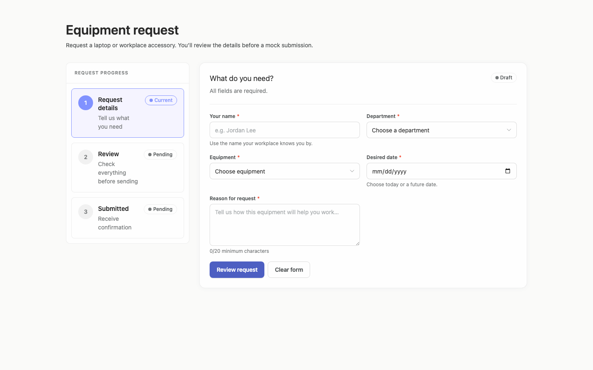
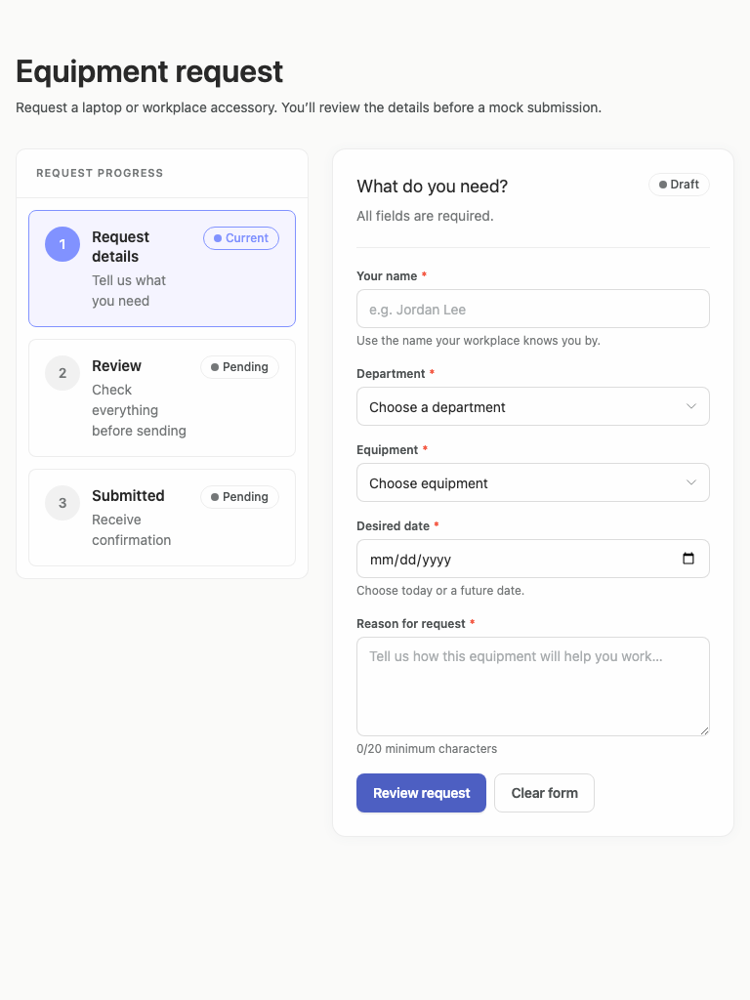
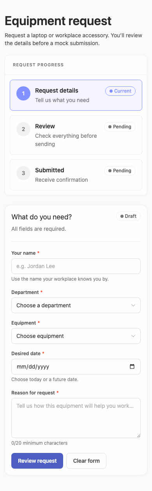

# equipment-request — 2026-09-08T15:56:46.883Z

[All reports](../../README.md) · [Interactive HTML report](index.html) · [Full measurements and scoring](report.json)

GitHub renders this summary and the screenshots. Download or clone this folder to open the HTML report locally; GitHub does not serve it as a website.

**Subjective design score:** 75/100. Model: openai/gpt-5.6-sol. Rubric: 1.

This is the saved component-backed preview, not a new generation or a built backend. Scores are advisory and not human-calibrated.

## Ratings

| Dimension      | Score | Reason                                                                                                                                                                                                                                                                                                                                                                                                                                        |
| -------------- | ----- | --------------------------------------------------------------------------------------------------------------------------------------------------------------------------------------------------------------------------------------------------------------------------------------------------------------------------------------------------------------------------------------------------------------------------------------------- |
| hierarchy      | 3/4   | The page title, progress indicator, form heading, required fields, and primary “Review request” action establish a clear sequence. The selected step and primary button are visually emphasized, though small low-contrast status and helper text weaken secondary-level scanning.                                                                                                                                                            |
| layout         | 3/4   | Desktop uses a balanced sidebar-and-form composition with consistent field alignment and spacing; tablet adapts to a narrower single-column form beside the progress panel. On mobile, controls fit without horizontal overflow, but the expanded progress panel occupies roughly the first 500 px and delays access to the main task.                                                                                                        |
| typography     | 3/4   | Headings, labels, inputs, and actions are visually consistent and generally readable. Several muted captions, helper lines, and status labels are only 11–14 px and use gray or pale blue with measured contrast ratios just below—or substantially below—accessible thresholds.                                                                                                                                                              |
| responsive     | 3/4   | The form changes from a two-column desktop grid to one column on tablet and mobile, with fields remaining 332 px wide in the 390 px mobile viewport and no measured horizontal overflow. Mobile retains a long desktop-style progress treatment and 40 px-high actions, making the composition less efficient and touch-friendly than it could be.                                                                                            |
| productClarity | 3/4   | The purpose is immediately understandable, all requested inputs are represented, required fields are marked, the date constraint and reason minimum are explained, and the three-step Request/Review/Submitted model communicates the expected flow. Only initial screens were supplied and interaction testing was not run, so the requested review summary, field-error behavior, mock submission, and success feedback cannot be verified. |

## Strengths

- The title and introductory sentence clearly explain that this is an equipment request followed by review and mock submission.
- All briefed data points are present: name, department, equipment, desired date, and reason.
- Primary and secondary actions are clearly differentiated, with “Review request” receiving appropriate emphasis.
- Field widths, labels, required markers, helper text, and vertical rhythm are consistent across viewports.
- Responsive layouts avoid measured horizontal overflow and preserve comfortable side margins on mobile.
- The progress component gives users a clear mental model of request, review, and confirmation stages.

## Improvements

- **medium — mobile-0:** The full three-card progress panel consumes a large portion of the initial mobile view, pushing the first form control to approximately y=658. Users must scroll substantially before they can begin the primary task. Use a compact mobile stepper, such as “Step 1 of 3 — Request details” with a short progress bar, while retaining the expanded step descriptions on wider screens.
- **medium — mobile-0:** Both bottom actions are only 40 px high. They remain legible, but offer smaller touch targets than is comfortable for frequent phone use, especially with two actions placed closely together. Increase mobile action height to at least 44–48 px and consider full-width stacking, keeping the primary action first and the destructive/reset-style action visually secondary.
- **medium — desktop-0:** The current-step description and pale-blue status treatment have weak contrast; supplied measurements report ratios of 4.14:1 for selected descriptive text and 2.57:1 for pale-blue status text. This reduces readability and makes the step state less robust. Darken muted text and the blue status foreground, or use a stronger selected-state background/border combination that reaches at least 4.5:1 for normal-sized text.
- **low — tablet-0:** Multiple helper lines and captions use small, light-gray text. Measurements identify several 12–14 px text elements near 4.47:1, narrowly below the expected contrast threshold, making supporting guidance less comfortable to read. Adopt a darker muted-text color with clear contrast headroom rather than targeting the threshold exactly; preserve the visual hierarchy through size and spacing instead of very light color.
- **low — mobile-0:** The reason field says “0/20 minimum characters,” which conveys the rule but reads like a counter and requirement combined, making the changing state slightly ambiguous. Separate the messages: show “Minimum 20 characters” as persistent guidance and place a live “0/20” counter at the opposite edge, changing to a standard character count after the minimum is met.

## Token evidence

Percentages cover only assessed properties. Missing provenance and ambiguous CSS remain unassessed; matching literals are not proof of token usage.

| Viewport  | Category   | Token references / assessed | Coverage      |
| --------- | ---------- | --------------------------- | ------------- |
| desktop-0 | color      | 79/81                       | 45% (81/179)  |
| desktop-0 | typography | 83/159                      | 36% (159/444) |
| desktop-0 | spacing    | 0/52                        | 24% (52/215)  |
| desktop-0 | radius     | 0/16                        | 17% (16/92)   |
| desktop-0 | border     | 0/75                        | 69% (75/108)  |
| desktop-0 | shadow     | 1/1                         | 1% (1/92)     |
| tablet-0  | color      | 79/81                       | 45% (81/179)  |
| tablet-0  | typography | 83/159                      | 36% (159/444) |
| tablet-0  | spacing    | 0/52                        | 24% (52/215)  |
| tablet-0  | radius     | 0/16                        | 17% (16/92)   |
| tablet-0  | border     | 0/75                        | 69% (75/108)  |
| tablet-0  | shadow     | 1/1                         | 1% (1/92)     |
| mobile-0  | color      | 79/81                       | 45% (81/179)  |
| mobile-0  | typography | 83/159                      | 36% (159/444) |
| mobile-0  | spacing    | 0/52                        | 24% (52/215)  |
| mobile-0  | radius     | 0/16                        | 17% (16/92)   |
| mobile-0  | border     | 0/75                        | 69% (75/108)  |
| mobile-0  | shadow     | 1/1                         | 1% (1/92)     |

## Latest-run screenshots

### desktop-0 — initial

Interaction: not-run.

### tablet-0 — initial

Interaction: not-run.

### mobile-0 — initial

Interaction: not-run.

## Limitations

- Only initial-state screenshots were provided; review, validation-error, submission, and success states were not visible.
- Interaction status is reported as not run, so no working behavior, focus handling, date restrictions, clearing behavior, or feedback timing can be assessed.
- The requested implementation plan is not visible in the supplied evidence and therefore cannot be evaluated.
- The screenshots do not show dropdown-open, date-picker, keyboard, loading, or unusually long-content states.
- Accessibility measurements are useful evidence for visual readability, but a complete manual accessibility review was not supplied.
