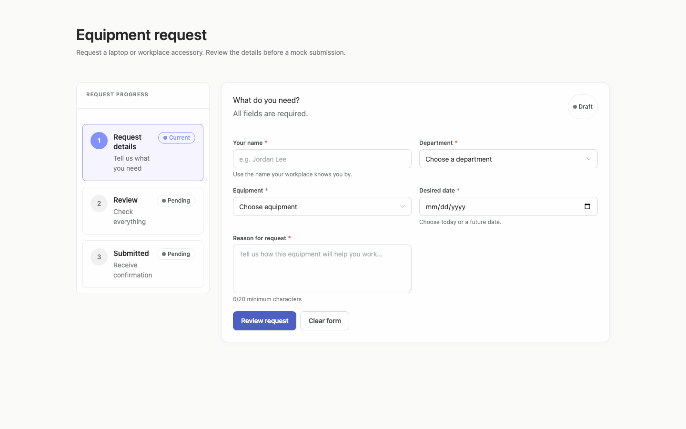
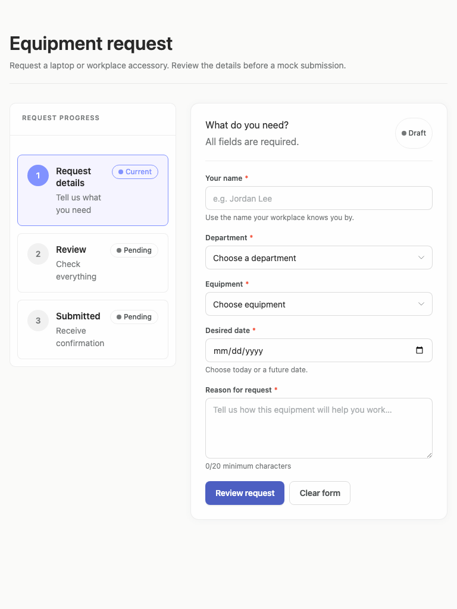
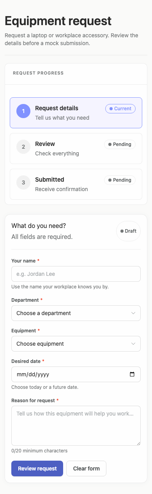

# equipment-request — 2026-09-08T16:00:06.674Z

[All reports](../../README.md) · [Interactive HTML report](index.html) · [Full measurements and scoring](report.json)

GitHub renders this summary and the screenshots. Download or clone this folder to open the HTML report locally; GitHub does not serve it as a website.

**Subjective design score:** 75/100. Model: openai/gpt-5.6-sol. Rubric: 1.

This is the saved component-backed preview, not a new generation or a built backend. Scores are advisory and not human-calibrated.

## Ratings

| Dimension | Score | Reason |
| --- | --- | --- |
| hierarchy | 3/4 | The page title, three-step progress indicator, form heading, required fields, and primary “Review request” action establish a clear sequence. On mobile, however, the large progress card pushes the actual request task well down the page, weakening first-screen priority. |
| layout | 3/4 | Desktop uses a balanced sidebar-and-form composition with aligned 375px field columns, while tablet and mobile collapse fields cleanly without horizontal overflow. Spacing is consistent, though the progress panel consumes disproportionate vertical space on mobile and the tablet composition leaves substantial unused space beneath the sidebar. |
| typography | 3/4 | Heading sizes, labels, helper text, and button text are visually consistent and generally readable. Several muted gray and light-purple text treatments are borderline or below minimum contrast according to the supplied measurements, especially helper/status copy. |
| responsive | 3/4 | The composition adapts from a two-column desktop form to a single-column form at tablet width and a stacked layout at 390px, with 29px mobile margins and 332px-wide fields. Mobile controls fit without clipping, but 40px-high actions are slightly small for comfortable touch use and the full progress panel delays access to the form. |
| productClarity | 3/4 | The initial state clearly communicates that employees should enter identity, department, equipment, date, and justification before reviewing a mock submission. Required markers, date guidance, minimum-character feedback, progress states, and distinct review/clear actions are understandable; review, validation-error, submission-success, and implementation-plan states are not evidenced here. |

## Strengths

- The three-step progress model makes the intended request, review, and confirmation flow easy to understand.
- All fields named in the brief are present, with useful examples and contextual guidance rather than relying only on terse labels.
- The primary and secondary actions are clearly distinguished, and “Review request” accurately describes the next step rather than implying immediate submission.
- Desktop fields align to a consistent two-column grid, while tablet and mobile use an uncomplicated single-column sequence.
- Required-field markers, the future-date note, and the reason character requirement set expectations before interaction.
- Cards, restrained borders, and consistent spacing produce a calm workplace-tool aesthetic across all three sizes.

## Improvements

- **medium — mobile-0:** The expanded progress card occupies roughly the first 360px after the introduction. In the measured 844px viewport, the form does not begin until about y=547, so progress information receives nearly as much first-screen attention as the task itself. Use a compact horizontal stepper, a short “Step 1 of 3” treatment, or collapsed future steps on phones; keep the complete progress panel at wider breakpoints.
- **medium — mobile-0:** Both mobile actions are only 40px high, which is usable but less comfortable for touch than the commonly targeted 44–48px range requested by the phone-comfort brief. Increase mobile button height to at least 44px, preserve clear spacing between actions, and consider full-width or evenly divided buttons if labels grow.
- **medium — desktop-0:** The light-purple “Current” status text has weak contrast against its selected background; the supplied audit reports a 2.57:1 treatment in this selected progress area. This makes an important state harder to perceive for low-vision users. Use a substantially darker purple for status text and icon, or adjust the badge background, targeting at least 4.5:1 for text while retaining the selected-state distinction.
- **low — desktop-0:** The introductory gray text is visually subdued and the supplied audit reports a 4.32:1 contrast ratio for a 14px muted-text treatment, narrowly below the 4.5:1 target. Darken the shared muted text color slightly so introductory and helper copy consistently reaches at least 4.5:1 on the page and card backgrounds.

## Token evidence

Percentages cover only assessed properties. Missing provenance and ambiguous CSS remain unassessed; matching literals are not proof of token usage.

| Viewport  | Category   | Token references / assessed | Coverage      |
| --------- | ---------- | --------------------------- | ------------- |
| desktop-0 | color      | 78/80                       | 45% (80/179)  |
| desktop-0 | typography | 80/158                      | 36% (158/443) |
| desktop-0 | spacing    | 0/52                        | 24% (52/220)  |
| desktop-0 | radius     | 0/16                        | 17% (16/92)   |
| desktop-0 | border     | 0/75                        | 69% (75/108)  |
| desktop-0 | shadow     | 1/1                         | 1% (1/92)     |
| tablet-0  | color      | 78/80                       | 45% (80/179)  |
| tablet-0  | typography | 80/158                      | 36% (158/443) |
| tablet-0  | spacing    | 0/52                        | 24% (52/220)  |
| tablet-0  | radius     | 0/16                        | 17% (16/92)   |
| tablet-0  | border     | 0/75                        | 69% (75/108)  |
| tablet-0  | shadow     | 1/1                         | 1% (1/92)     |
| mobile-0  | color      | 78/80                       | 45% (80/179)  |
| mobile-0  | typography | 80/158                      | 36% (158/443) |
| mobile-0  | spacing    | 0/52                        | 24% (52/220)  |
| mobile-0  | radius     | 0/16                        | 17% (16/92)   |
| mobile-0  | border     | 0/75                        | 69% (75/108)  |
| mobile-0  | shadow     | 1/1                         | 1% (1/92)     |

## Latest-run screenshots

### desktop-0 — initial

Interaction: not-run.

### tablet-0 — initial

Interaction: not-run.

### mobile-0 — initial

Interaction: not-run.

## Limitations

- Only initial states are provided; the review summary, field-error presentation, mock-submit behavior, and success feedback could not be evaluated.
- Interaction testing is marked not run, so control behavior, validation timing, focus handling, date restrictions, clearing behavior, and submission transitions are unknown.
- No implementation-plan artifact is visible in the supplied screenshots, so that deliverable from the brief cannot be assessed.
- The screenshots do not show keyboard, focus, expanded-select, date-picker, loading, or long-content states.
- Responsive assessment is limited to the provided 1440px, 768px, and 390px widths.
