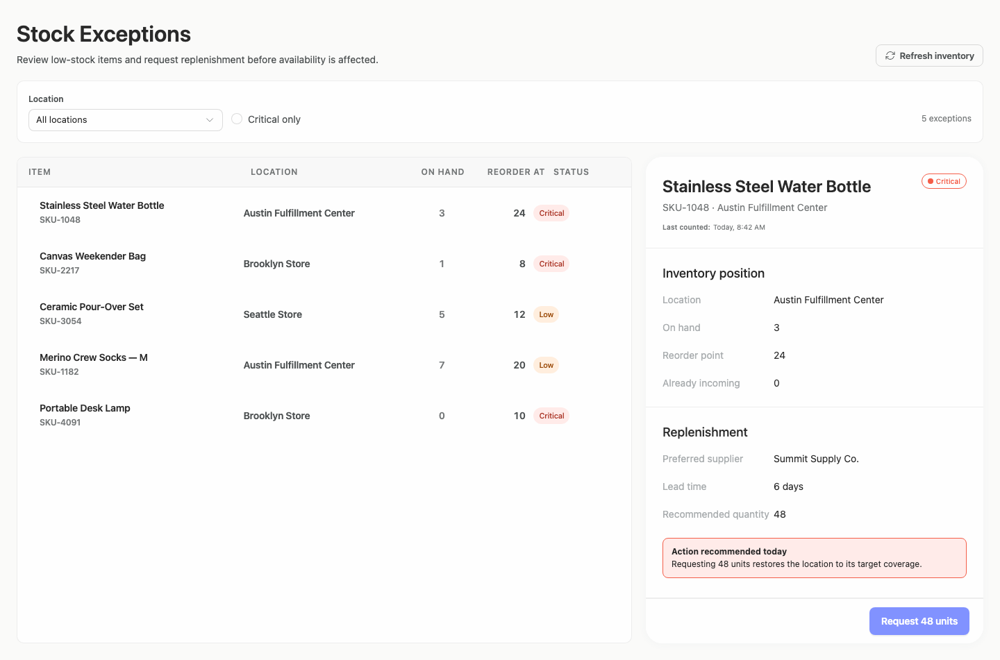
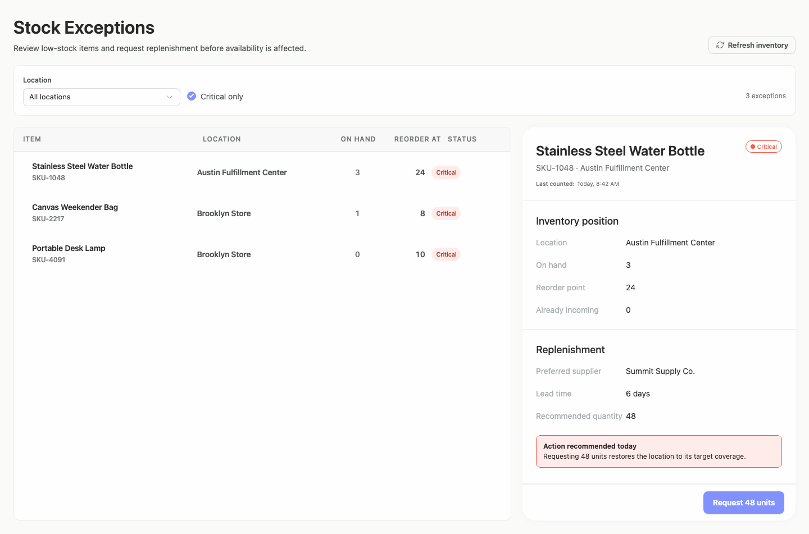
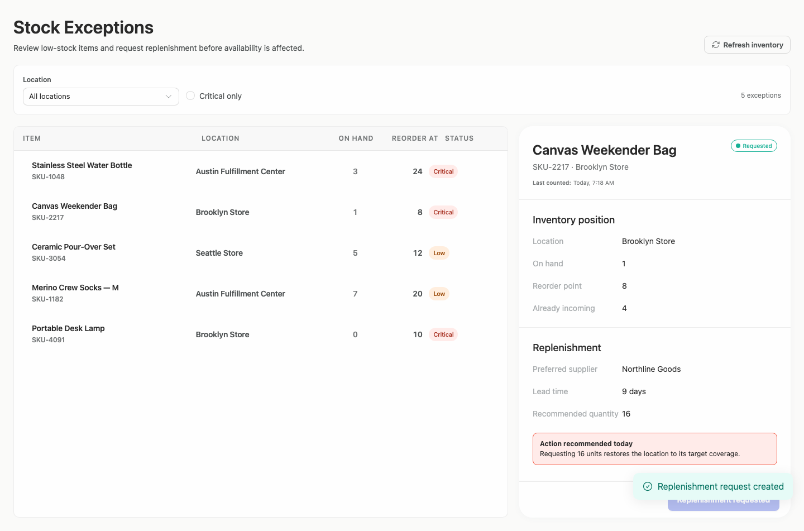
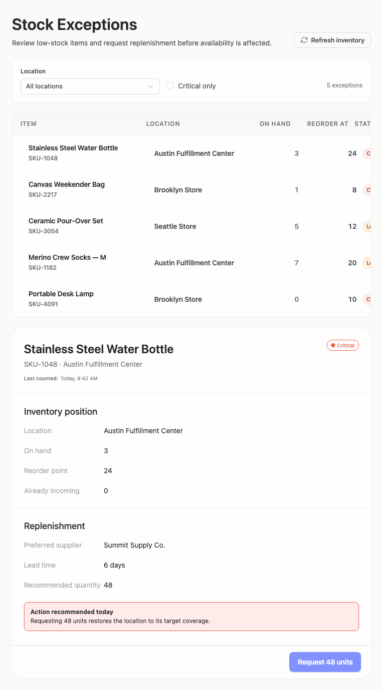
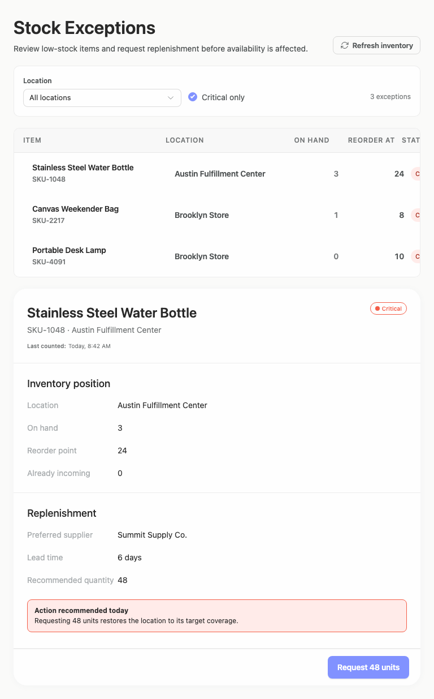
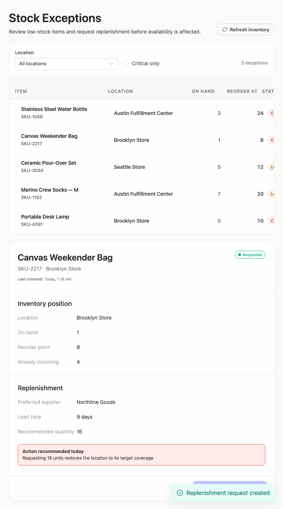
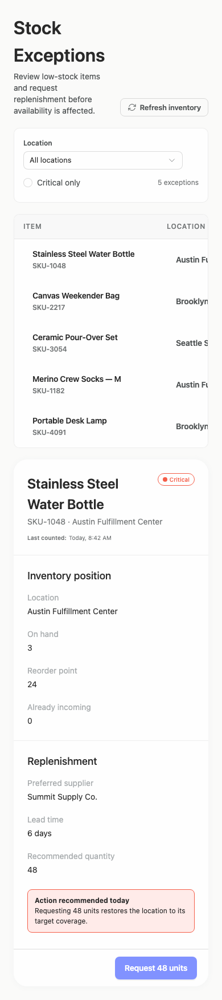
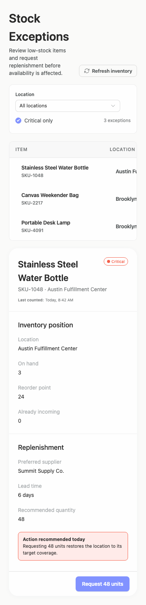
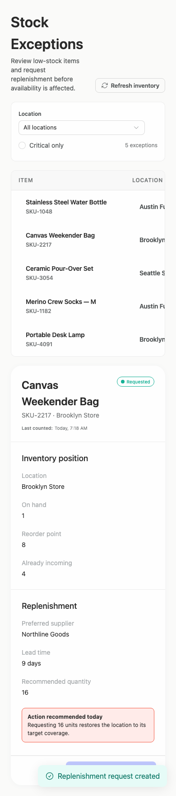

# stock-exceptions — 2026-09-08T11:39:04.457Z

[All reports](../../README.md) · [Interactive HTML report](index.html) · [Full measurements and scoring](report.json)

GitHub renders this summary and the screenshots. Download or clone this folder to open the HTML report locally; GitHub does not serve it as a website.

**Subjective design score:** 60/100. Model: openai/gpt-5.6-sol. Rubric: 1.

This is the saved component-backed preview, not a new generation or a built backend. Scores are advisory and not human-calibrated.

## Ratings

| Dimension      | Score | Reason                                                                                                                                                                                                                                                                                                                                                          |
| -------------- | ----- | --------------------------------------------------------------------------------------------------------------------------------------------------------------------------------------------------------------------------------------------------------------------------------------------------------------------------------------------------------------- |
| hierarchy      | 3/4   | The page establishes a clear sequence from title and filters to the exception queue, selected-item details, recommendation, and replenishment action. Critical/requested badges and exception counts aid scanning, though the mobile action sits far below the queue and the selected queue row is not visually prominent.                                      |
| layout         | 2/4   | Desktop uses a clean two-column composition with aligned item, location, quantity, reorder, and status columns. At tablet and mobile widths the queue retains an approximately 760px row width inside narrower containers, clipping columns and location values and requiring horizontal navigation.                                                            |
| typography     | 2/4   | Headings, item names, values, and section titles are consistently styled and generally readable. However, detail labels use very light gray text with reported contrast around 2.24:1, several captions are only 10–12px, and the primary button reports only 2.78:1 contrast between white text and its background.                                            |
| responsive     | 2/4   | Filters and detail content stack into a usable single-column flow, and primary controls remain within the viewport. The queue itself does not recompose: measured 760px-wide row controls overflow 720px tablet and 342px mobile containers, leaving status and portions of locations off-screen; the mobile document also extends to 1752px before the action. |
| productClarity | 3/4   | The interface clearly communicates a low-stock review task, exposes location and Critical-only filters, shows inventory and supplier context, recommends an exact quantity, and provides explicit requested-state feedback. Selection is inferable from the matching detail title but lacks a strong visible marker in the queue.                               |

## Strengths

- Desktop columns are consistently aligned, with numeric inventory fields right-aligned for quick comparison.
- Locations are shown both in queue rows and selected-item details, supporting operational context.
- The Critical-only state updates the visible count from five to three exceptions in the supplied states.
- The replenishment action names the exact quantity, and the requested state provides both a status badge and confirmation message.
- Tablet and mobile layouts stack the detail panel beneath the queue rather than compressing the full desktop split view.

## Improvements

- **high — mobile-0:** The mobile queue viewport is 342px wide while each row is measured at 760px. Only the item and part of the location column are visible, with location names visibly truncated and inventory, reorder, and status information off-screen. Horizontal scrolling may be intentional, but it conflicts with the brief's responsive and clear-location goals. Replace the desktop row grid with mobile cards or stacked rows that show item, full location, on-hand/reorder values, and status without horizontal scrolling. If horizontal scrolling must remain, add a clear scroll affordance and keep the item column sticky.
- **medium — tablet-0:** The tablet queue still uses rows wider than the viewport; the status header and badges are visibly cut at the right edge. This weakens scanability despite the otherwise well-aligned desktop columns. Introduce a tablet-specific grid with narrower item/location columns, or move status beneath the item name so all operational fields fit within the 720px container.
- **medium — desktop-0:** Inventory and replenishment field labels are rendered in very pale gray. Reported contrast is approximately 2.24:1, making important labels such as Location, On hand, and Recommended quantity difficult to read. Use a darker muted-text color that reaches at least 4.5:1 against the panel background, and avoid disabled styling for active informational labels.
- **medium — desktop-0:** The main replenishment button is the primary task affordance, but its white text on the light blue background reports only 2.78:1 contrast, reducing legibility and visual confidence. Darken the primary button background or use darker text while preserving clear prominence and meeting at least 4.5:1 text contrast.
- **medium — desktop-2:** Canvas Weekender Bag is the item shown in the details panel, but its queue row has little or no visible distinction from neighboring rows. Users must compare text to confirm which item is selected. Add a persistent selected-row treatment such as a tinted background, stronger inset border, or left selection indicator with sufficient contrast.
- **low — mobile-0:** The narrow detail layout places labels and values on separate lines with generous vertical spacing, producing a long path from the selected-item heading to the replenishment action. Reduce vertical gaps and use compact two-column label/value pairs where values fit, while allowing long locations or supplier names to wrap.

## Token evidence

Percentages cover only assessed properties. Missing provenance and ambiguous CSS remain unassessed; matching literals are not proof of token usage.

| Viewport  | Category   | Token references / assessed | Coverage      |
| --------- | ---------- | --------------------------- | ------------- |
| desktop-0 | color      | 86/86                       | 37% (86/233)  |
| desktop-0 | typography | 72/113                      | 19% (113/592) |
| desktop-0 | spacing    | 2/54                        | 20% (54/268)  |
| desktop-0 | radius     | 0/11                        | 9% (11/120)   |
| desktop-0 | border     | 0/106                       | 81% (106/131) |
| desktop-0 | shadow     | 0/0                         | 0% (0/120)    |
| tablet-0  | color      | 86/86                       | 37% (86/233)  |
| tablet-0  | typography | 72/113                      | 19% (113/592) |
| tablet-0  | spacing    | 2/54                        | 20% (54/268)  |
| tablet-0  | radius     | 0/11                        | 9% (11/120)   |
| tablet-0  | border     | 0/106                       | 81% (106/131) |
| tablet-0  | shadow     | 0/0                         | 0% (0/120)    |
| mobile-0  | color      | 86/86                       | 37% (86/233)  |
| mobile-0  | typography | 72/113                      | 19% (113/592) |
| mobile-0  | spacing    | 2/54                        | 20% (54/268)  |
| mobile-0  | radius     | 0/11                        | 9% (11/120)   |
| mobile-0  | border     | 0/106                       | 81% (106/131) |
| mobile-0  | shadow     | 0/0                         | 0% (0/120)    |

## Latest-run screenshots

### desktop-0 — initial

Interaction: not-run.

### desktop-1 — critical filter

Interaction: passed.

### desktop-2 — replenishment

Interaction: passed.

### tablet-0 — initial

Interaction: not-run.

### tablet-1 — critical filter

Interaction: passed.

### tablet-2 — replenishment

Interaction: passed.

### mobile-0 — initial

Interaction: not-run.

### mobile-1 — critical filter

Interaction: passed.

### mobile-2 — replenishment

Interaction: passed.

## Limitations

- No screenshots were provided for a changed location, empty queue, loading, error, hover, focus, or keyboard-navigation states.
- Initial-state interactions were not run; supplied filter and replenishment states only demonstrate the fixture transitions shown.
- The queue is identified as an intentional scroll container, so the usability impact of horizontal scrolling is judged from static composition rather than observed gestures.
- Screenshots cannot verify backend behavior or whether actions are restricted to fixtures only.
