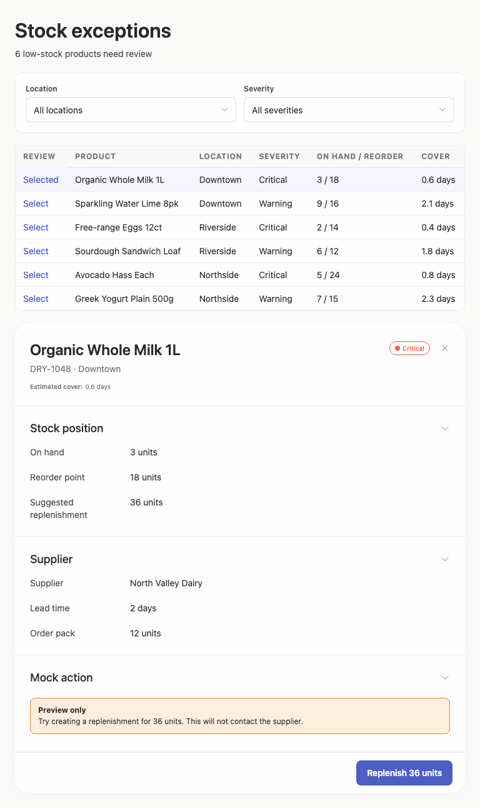
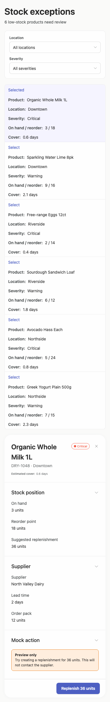

# stock-exceptions — 2026-09-08T15:50:03.870Z

[All reports](../../README.md) · [Interactive HTML report](index.html) · [Full measurements and scoring](report.json)

GitHub renders this summary and the screenshots. Download or clone this folder to open the HTML report locally; GitHub does not serve it as a website.

**Subjective design score:** 75/100. Model: openai/gpt-5.6-sol. Rubric: 1.

This is the saved component-backed preview, not a new generation or a built backend. Scores are advisory and not human-calibrated.

## Ratings

| Dimension | Score | Reason |
| --- | --- | --- |
| hierarchy | 3/4 | The page title, exception count, filters, selected row, and review panel form a clear task sequence. The highlighted selection and prominent replenishment button establish priorities well, though the mobile detail view begins only after the entire exception list, weakening continuity between selection and review. |
| layout | 3/4 | Desktop uses a balanced list-and-detail composition, while tablet stacks the same content with consistent margins and section spacing. Mobile avoids horizontal overflow, but each exception consumes roughly 200 px vertically, producing an unnecessarily long page and placing selected-item details far from the selection control. |
| typography | 3/4 | Headings, field labels, values, and action text are visually consistent and generally readable. However, measured table-header contrast is 4.25:1 against the required 4.5:1, and several 10–14 px secondary/detail texts also narrowly or materially fail contrast thresholds. |
| responsive | 2/4 | The interface genuinely adapts: filters stack on mobile, table records become labeled cards, and the desktop side panel becomes a full-width section. Nevertheless, the mobile composition is 2478 px tall, selected-item details start around y=1537, the primary action is near y=2410, and review controls remain only 21 px high, making the phone workflow cumbersome. |
| productClarity | 4/4 | The task is immediately understandable: filter low-stock exceptions, select a product, inspect stock and supplier data, and preview replenishment. The selected state, suggested quantity, explicit “Preview only” notice, and quantity-specific action label clearly communicate that the action is a safe mock and will not contact the supplier. |

## Strengths

- Clear exception count and filter labels provide immediate context.
- Selected-row highlighting connects the list to the corresponding product details.
- Stock position and supplier information are grouped into understandable, well-labeled sections.
- The mock-action notice explicitly explains the consequence and prevents confusion about contacting a supplier.
- Responsive transformations avoid horizontal overflow and preserve all core information on mobile.
- Desktop and tablet maintain consistent alignment, spacing, and section structure.

## Improvements

- **medium — mobile-0:** The six exceptions are expanded into tall records of about 200 px each. As a result, the selected product’s review details do not begin until approximately y=1537, despite selection occurring near the top of the list. On phones, open the selected item in an immediate full-screen sheet or place a compact/collapsible detail view directly after the selected record. Reduce record height with a denser two-column label/value grid while retaining readable spacing.
- **medium — mobile-0:** The primary “Selected/Select” row affordance is only about 21 px high; the other review links use similarly small dimensions. This is difficult to tap reliably on a phone. Make the entire exception card or a clearly bounded control tappable, with a target of at least 44×44 px and visible pressed/focus states.
- **low — desktop-0:** The uppercase table headers use small gray text whose measured contrast is 4.25:1, just below the 4.5:1 minimum. Their small size and tracking further reduce quick readability. Darken the header text or increase its size/weight while retaining distinction from row values; verify at least 4.5:1 contrast.
- **low — mobile-0:** The selected product title wraps to two lines while the severity badge and close icon compete for the same narrow header row, leaving the title with limited width and a slightly fragmented hierarchy. Give the title its own full-width row and place the severity badge beneath it, or move badge and close control into a separate compact metadata row.
- **medium — desktop-0:** The critical-status treatment uses very small orange-red text; measured contrast for this status text is approximately 3.2:1 on white, which reduces legibility for an important severity signal. Use a darker critical text color, stronger tinted background, and/or larger semibold type that reaches at least 4.5:1 contrast without relying on color alone.

## Token evidence

Percentages cover only assessed properties. Missing provenance and ambiguous CSS remain unassessed; matching literals are not proof of token usage.

| Viewport  | Category   | Token references / assessed | Coverage      |
| --------- | ---------- | --------------------------- | ------------- |
| desktop-0 | color      | 110/110                     | 47% (110/233) |
| desktop-0 | typography | 103/211                     | 37% (211/564) |
| desktop-0 | spacing    | 0/18                        | 7% (18/255)   |
| desktop-0 | radius     | 0/4                         | 3% (4/120)    |
| desktop-0 | border     | 0/102                       | 82% (102/125) |
| desktop-0 | shadow     | 0/0                         | 0% (0/120)    |
| tablet-0  | color      | 110/110                     | 47% (110/233) |
| tablet-0  | typography | 103/211                     | 37% (211/564) |
| tablet-0  | spacing    | 0/18                        | 7% (18/255)   |
| tablet-0  | radius     | 0/4                         | 3% (4/120)    |
| tablet-0  | border     | 0/102                       | 82% (102/125) |
| tablet-0  | shadow     | 0/0                         | 0% (0/120)    |
| mobile-0  | color      | 114/114                     | 49% (114/234) |
| mobile-0  | typography | 123/233                     | 41% (233/564) |
| mobile-0  | spacing    | 0/12                        | 5% (12/251)   |
| mobile-0  | radius     | 0/2                         | 2% (2/120)    |
| mobile-0  | border     | 0/109                       | 88% (109/124) |
| mobile-0  | shadow     | 0/0                         | 0% (0/120)    |

## Latest-run screenshots

### desktop-0 — initial

Interaction: not-run.

### tablet-0 — initial

Interaction: not-run.

### mobile-0 — initial

Interaction: not-run.

## Limitations

- Only initial screenshots were provided; filter changes, item switching, accordion behavior, close behavior, and replenishment confirmation were not interaction-tested.
- The screenshots do not show the requested implementation plan, so its completeness and quality cannot be assessed.
- No success, error, empty, loading, or confirmation states are visible.
- The reported mobile column-misalignment checks have zero-area regions and appear related to the responsive table-to-card transformation; they cannot be visually confirmed as defects from that evidence alone.
