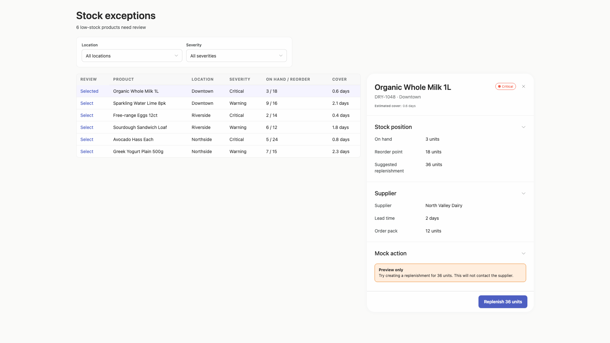
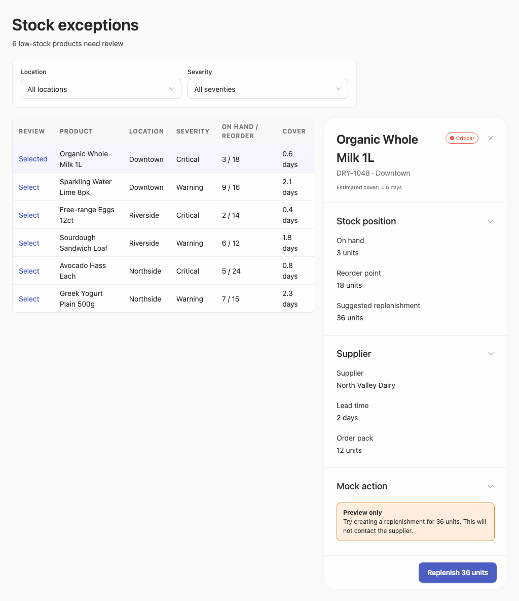

# stock-exceptions-adherence-v2 — 2026-09-08T18:14:23.365Z

[All reports](../../README.md) · [Interactive HTML report](index.html) · [Full measurements and scoring](report.json)

GitHub renders this summary and the screenshots. Download or clone this folder to open the HTML report locally; GitHub does not serve it as a website.

**Subjective design score:** 75/100. Model: openai/gpt-5.6-sol. Rubric: 2.

**Arrusted adherence:** 100/100 (partial); evidence coverage 1%. Evaluator 2.

| Dimension | Conforming | Nonconforming | Unassessed | Adherence    |
| --------- | ---------- | ------------- | ---------- | ------------ |
| component | 7          | 0             | 1          | 100% (7/7)   |
| api       | 5          | 0             | 22         | 100% (5/5)   |
| styling   | 17         | 0             | 4226       | 100% (17/17) |

Scores from different evaluator versions or captured states are not directly comparable.

This is the saved component-backed preview, not a new generation or a built backend. Scores are advisory and not human-calibrated.

## Ratings

| Dimension      | Score | Reason                                                                                                                                                                                                                                                                                                                                                                                                                           |
| -------------- | ----- | -------------------------------------------------------------------------------------------------------------------------------------------------------------------------------------------------------------------------------------------------------------------------------------------------------------------------------------------------------------------------------------------------------------------------------- |
| hierarchy      | 3/4   | The page title, exception count, filters, selected row, and detail panel form a clear review sequence. Selection highlighting and the prominent replenishment action establish priority well, though severity is plain text in the list and therefore less scannable than it is in the detail status pill.                                                                                                                       |
| layout         | 3/4   | Desktop views use consistent alignment, restrained spacing, and an effective list-detail composition. The 1920px view remains comfortably centered, but the 1024px view becomes substantially taller as table cells and detail fields wrap, reducing information density and pushing the action well below the initial viewport.                                                                                                 |
| typography     | 3/4   | Heading levels, field labels, values, and table text are visually consistent and generally readable. At 1024px, product names, cover values, and detail metadata break across several lines, while the small table headers and estimated-cover metadata have relatively weak emphasis.                                                                                                                                           |
| responsive     | 2/4   | Across the supplied desktop widths, controls remain usable and there is no visible horizontal clipping. However, at the 1024×768 measured viewport the document reaches 1184px and the replenishment action begins around y=1108, requiring significant page scrolling; the table and detail panel also lose considerable density. No narrower desktop-panel evidence was supplied.                                              |
| productClarity | 4/4   | The interface clearly communicates that six low-stock products need review, provides the requested location and severity filters, exposes stock and supplier evidence for the selected product, and explicitly labels the replenishment as a preview that will not contact the supplier. Row-selection controls and the quantity-specific action label are understandable, although the mock action result was not demonstrated. |

## Strengths

- The selected table row and adjacent product detail make the current review context immediately apparent.
- Location and severity filters are grouped and labeled clearly above the exception list.
- Stock position and supplier information are separated into concise, task-relevant sections.
- The warning message clearly explains the non-production nature and consequence of the mock replenishment.
- The action label includes the proposed quantity, reducing ambiguity before activation.
- The composition remains free of visible horizontal overflow in all supplied desktop captures.

## Improvements

- **medium — desktop-window-0:** At 1024px, product names and cover values wrap onto multiple lines, making rows taller and reducing side-by-side scanability across product, location, severity, stock, and cover. Use the supported compact table density and rebalance column widths at narrower desktop windows; consider shortening the review column label or letting product receive more width while retaining all inventory fields.
- **medium — desktop-window-0:** The narrow detail panel stacks most labels above their values and extends the primary action to roughly y=1108, below the measured 768px viewport. Reviewing evidence and then acting therefore requires a long page scroll. Use the panel-scroll variant or a compact detail composition with a persistent action footer, and keep short label-value pairs in a denser two-column arrangement where space permits.
- **medium — desktop-0:** Critical and Warning severities appear as uniform plain text in the main list, so urgency is less visually distinguishable during rapid triage than in the selected record's status pill. Render severity using the existing supported StatusPill or Tag variants in the table while preserving the authoritative Arrusted palette.
- **low — desktop-0:** The small uppercase table headers have subdued emphasis; the supplied accessibility evidence also flags their contrast as slightly below the automated threshold, which may make rapid column scanning harder. Choose a supported table typography or density variant with stronger header emphasis, rather than changing or overriding the Arrusted palette.

## Token evidence

Percentages cover only assessed properties. Missing provenance and ambiguous CSS remain unassessed; matching literals are not proof of token usage.

| Viewport         | Category   | Token references / assessed | Coverage   |
| ---------------- | ---------- | --------------------------- | ---------- |
| desktop-0        | color      | 0/0                         | 0% (0/232) |
| desktop-0        | typography | 0/0                         | 0% (0/556) |
| desktop-0        | spacing    | 0/0                         | 0% (0/255) |
| desktop-0        | radius     | 0/0                         | 0% (0/120) |
| desktop-0        | border     | 0/0                         | 0% (0/126) |
| desktop-0        | shadow     | 0/0                         | 0% (0/120) |
| desktop-wide-0   | color      | 0/0                         | 0% (0/232) |
| desktop-wide-0   | typography | 0/0                         | 0% (0/556) |
| desktop-wide-0   | spacing    | 0/0                         | 0% (0/255) |
| desktop-wide-0   | radius     | 0/0                         | 0% (0/120) |
| desktop-wide-0   | border     | 0/0                         | 0% (0/126) |
| desktop-wide-0   | shadow     | 0/0                         | 0% (0/120) |
| desktop-window-0 | color      | 0/0                         | 0% (0/232) |
| desktop-window-0 | typography | 0/0                         | 0% (0/553) |
| desktop-window-0 | spacing    | 0/0                         | 0% (0/255) |
| desktop-window-0 | radius     | 0/0                         | 0% (0/120) |
| desktop-window-0 | border     | 0/0                         | 0% (0/128) |
| desktop-window-0 | shadow     | 0/0                         | 0% (0/120) |

## Latest-run screenshots

### desktop-0 — initial

Interaction: not-run.

### desktop-wide-0 — initial

Interaction: not-run.

### desktop-window-0 — initial

Interaction: not-run.

## Limitations

- Only initial-state desktop screenshots were supplied; no phone or tablet assessment is made because this evaluation targets desktop windows and panels.
- Interaction testing was not run, so filtering, row selection, panel closing, collapsible sections, and the mock replenishment outcome cannot be verified.
- The screenshots do not expose a separate implementation-plan artifact, so its completeness cannot be evaluated visually.
- The full screenshot for desktop-window-0 is 1024×1184 while its measured viewport is 1024×768; observations about below-fold placement use the provided control coordinates and document height.
- Static source and adherence evidence do not establish that every conditional component or callback rendered or functioned.
- Exact saved Stock Exceptions HTML and corresponding record_ui_preview source; no regeneration or Sandbox restart.
- Browser screenshots and AI review captured once. Source counts finalized with primitive-prop assessment using those same source bytes.
- Compiled CSS has no generated/shared source map; most browser styling is unassessed. A partial 100 is not full-app conformity.
- The subjective reviewer may propose an already-used or unavailable variant; confirm suggestions against the public APIs before changing code.
