# stock-exceptions-compact-footer — 2026-09-08T23:58:54.478Z

[All reports](../../README.md) · [Interactive HTML report](index.html) · [Full measurements and scoring](report.json)

GitHub renders this summary and the screenshots. Download or clone this folder to open the HTML report locally; GitHub does not serve it as a website.

**Subjective design score:** 90/100. Model: openai/gpt-5.6-sol. Rubric: 2.

**Arrusted adherence:** 100/100 (partial); evidence coverage 1.72%. Evaluator 3.

| Dimension | Conforming | Nonconforming | Unassessed | Adherence    |
| --------- | ---------- | ------------- | ---------- | ------------ |
| component | 30         | 0             | 3          | 100% (30/30) |
| api       | 52         | 0             | 7          | 100% (52/52) |
| styling   | 17         | 0             | 5637       | 100% (17/17) |

Scores from different evaluator versions or captured states are not directly comparable.

This is the saved component-backed preview, not a new generation or a built backend. Scores are advisory and not human-calibrated.

## Ratings

| Dimension      | Score | Reason                                                                                                                                                                                                                                                                                                                                                         |
| -------------- | ----- | -------------------------------------------------------------------------------------------------------------------------------------------------------------------------------------------------------------------------------------------------------------------------------------------------------------------------------------------------------------- |
| hierarchy      | 4/4   | The page establishes a clear sequence from title and review count to filters, severity-grouped exceptions, selected product details, and the replenishment action. Selected rows, severity pills, cover values, section headings, and the suggested-order heading make priorities immediately scannable.                                                       |
| layout         | 3/4   | The master-detail composition is consistently aligned and appropriately dense at 1440px and 1920px, while cards and detail rows use regular spacing. The main weakness is the simulated state at 1024px, where the confirmation and disabled action wrap into an inconsistent footer arrangement.                                                              |
| typography     | 4/4   | Product names, section headings, labels, values, and explanatory copy have a consistent and readable scale. Bold treatment is used selectively for cover, stock, supplier, delivery-risk, and order information without making the interface visually noisy.                                                                                                   |
| responsive     | 3/4   | The design adapts effectively across the supplied desktop widths: it retains master-detail at 1920px, 1440px, and 1024px, then switches to a focused list/detail flow with a clear Back to exceptions control at 700px. The 1024px simulated footer shows a wrapping instability, and the 768px viewport can require a small amount of document scrolling.     |
| productClarity | 4/4   | The task is explicit in the header copy, filters clearly cover location and severity, records expose location, severity, and days of cover, and the detail panel separates stock from supplier information. The action is unambiguously a simulation through Preview only, No supplier contacted, and the post-action message that stock levels are unchanged. |

## Strengths

- Severity grouping and ascending cover values support rapid triage without requiring users to inspect every record.
- The selected record is strongly connected to its detail panel through the highlighted row and repeated product, location, severity, and cover information.
- Stock position and supplier details are separated into compact tabs while the suggested replenishment remains visible in either context.
- The mock action communicates both the proposed quantity and its pack calculation, delivery assumption, and potential stockout gap.
- Filtering visibly updates the result count, group count, cover range, and remaining record.
- The 700px desktop-panel treatment avoids compressing two columns and provides an explicit route back to the exception list.
- The supplied palette is used consistently for selection, primary action, severity indicators, borders, and neutral surfaces.
- Observed interaction captures passed for filtering, supplier inspection, delivery assumptions, and simulated replenishment.

## Improvements

- **medium — desktop-window-2:** After simulation at the 1024px window size, the confirmation copy occupies one row while the disabled action drops to a new row and aligns left. This differs from the right-aligned action footer in the surrounding states and makes the completion state feel structurally unstable. Use a stable footer composition that keeps the status at the start and the action pinned to the end. Allow the status text to wrap within its own flexible column before moving the action; if stacking is necessary, preserve consistent end alignment and spacing.

## Token evidence

Percentages cover only assessed properties. Missing provenance and ambiguous CSS remain unassessed; matching literals are not proof of token usage.

| Viewport                 | Category   | Token references / assessed | Coverage   |
| ------------------------ | ---------- | --------------------------- | ---------- |
| desktop-0                | color      | 0/0                         | 0% (0/227) |
| desktop-0                | typography | 0/0                         | 0% (0/557) |
| desktop-0                | spacing    | 0/0                         | 0% (0/299) |
| desktop-0                | radius     | 0/0                         | 0% (0/114) |
| desktop-0                | border     | 0/0                         | 0% (0/137) |
| desktop-0                | shadow     | 0/0                         | 0% (0/120) |
| desktop-wide-0           | color      | 0/0                         | 0% (0/227) |
| desktop-wide-0           | typography | 0/0                         | 0% (0/557) |
| desktop-wide-0           | spacing    | 0/0                         | 0% (0/299) |
| desktop-wide-0           | radius     | 0/0                         | 0% (0/114) |
| desktop-wide-0           | border     | 0/0                         | 0% (0/137) |
| desktop-wide-0           | shadow     | 0/0                         | 0% (0/120) |
| desktop-window-0         | color      | 0/0                         | 0% (0/227) |
| desktop-window-0         | typography | 0/0                         | 0% (0/557) |
| desktop-window-0         | spacing    | 0/0                         | 0% (0/299) |
| desktop-window-0         | radius     | 0/0                         | 0% (0/114) |
| desktop-window-0         | border     | 0/0                         | 0% (0/137) |
| desktop-window-0         | shadow     | 0/0                         | 0% (0/120) |
| desktop-custom-700x900-0 | color      | 0/0                         | 0% (0/198) |
| desktop-custom-700x900-0 | typography | 0/0                         | 0% (0/489) |
| desktop-custom-700x900-0 | spacing    | 0/0                         | 0% (0/265) |
| desktop-custom-700x900-0 | radius     | 0/0                         | 0% (0/99)  |
| desktop-custom-700x900-0 | border     | 0/0                         | 0% (0/119) |
| desktop-custom-700x900-0 | shadow     | 0/0                         | 0% (0/105) |

## Latest-run screenshots

### desktop-0 — initial

Interaction: not-run.

### desktop-1 — Select and inspect supplier

Interaction: passed.

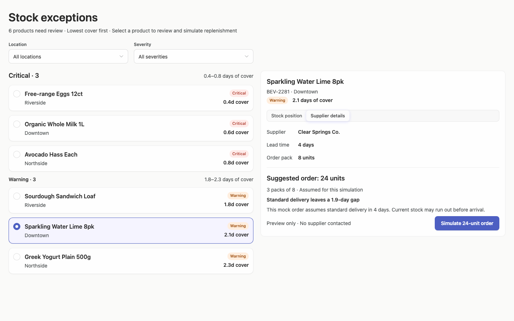

### desktop-2 — Simulate replenishment

Interaction: passed.

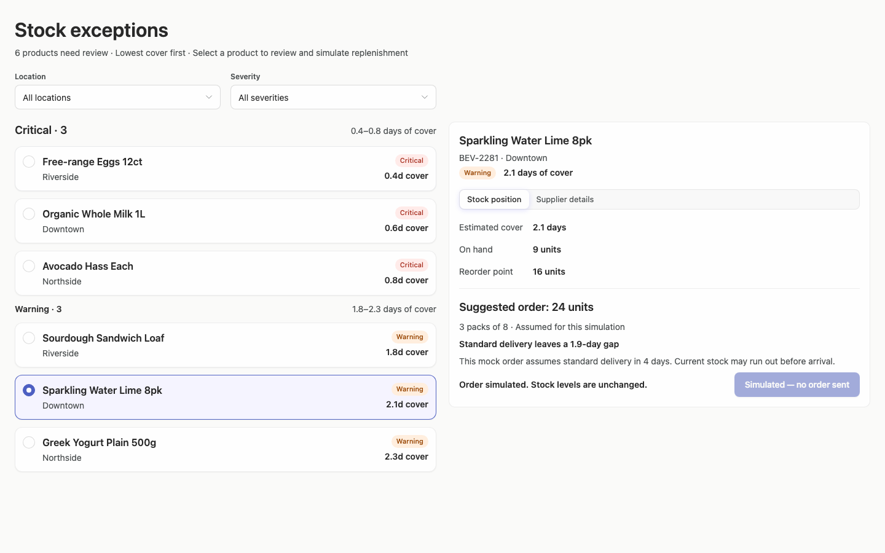

### desktop-3 — Filter records

Interaction: passed.

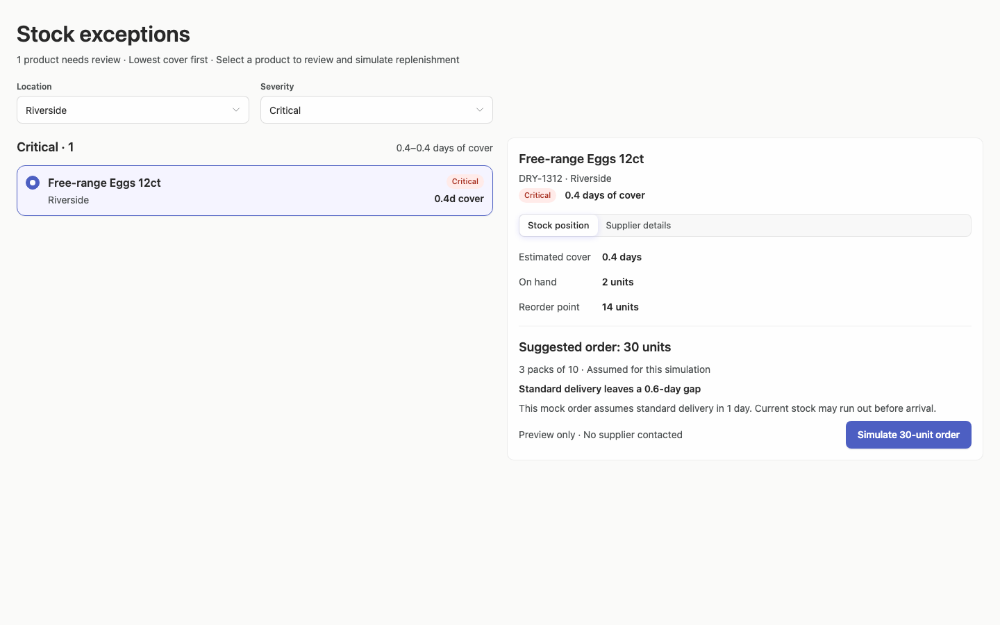

### desktop-4 — Review delivery within cover

Interaction: passed.

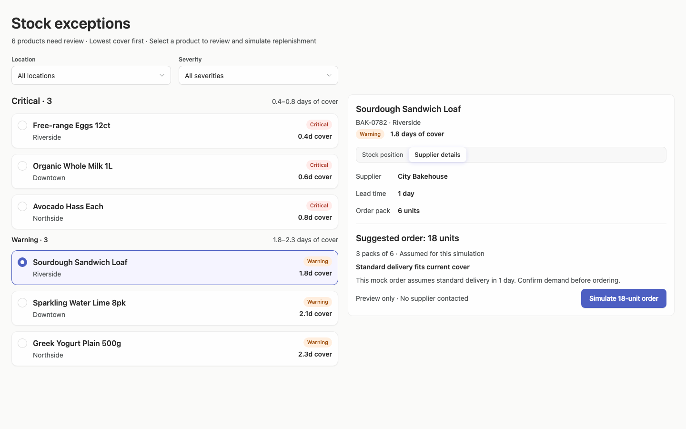

### desktop-5 — Read the stock-view delivery assumption

Interaction: passed.

### desktop-wide-0 — initial

Interaction: not-run.

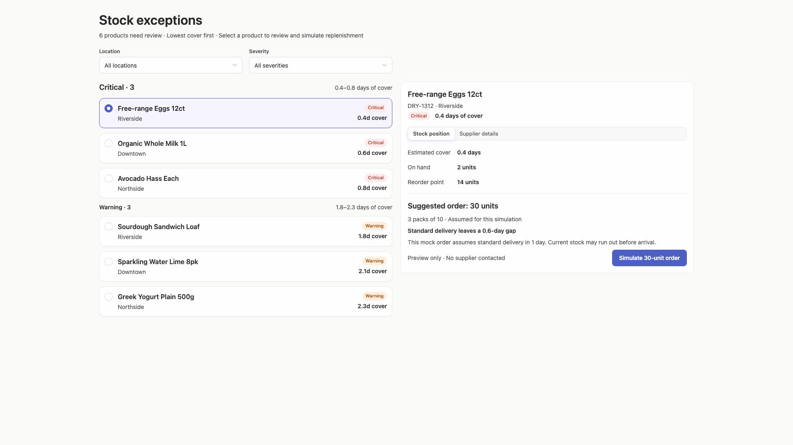

### desktop-wide-1 — Select and inspect supplier

Interaction: passed.

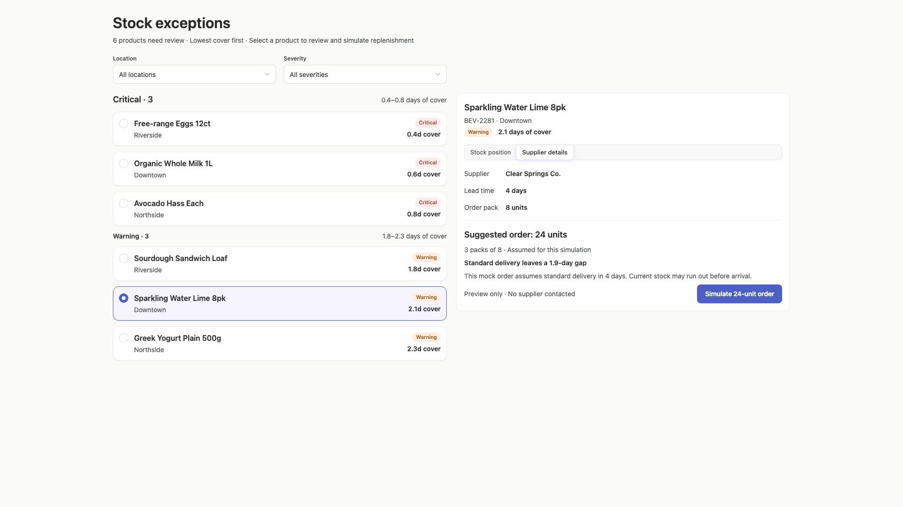

### desktop-wide-2 — Simulate replenishment

Interaction: passed.

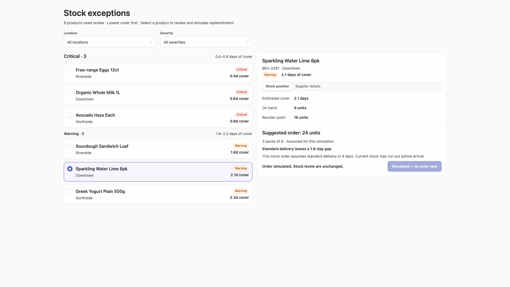

### desktop-wide-3 — Filter records

Interaction: passed.

### desktop-wide-4 — Review delivery within cover

Interaction: passed.

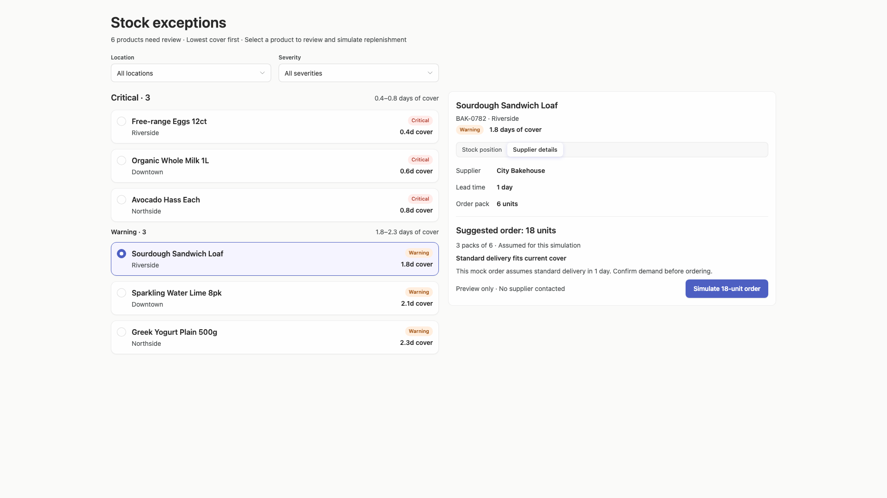

### desktop-wide-5 — Read the stock-view delivery assumption

Interaction: passed.

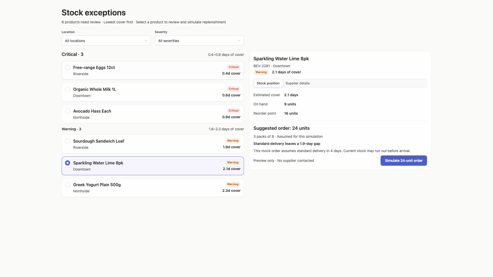

### desktop-window-0 — initial

Interaction: not-run.

### desktop-window-1 — Select and inspect supplier

Interaction: passed.

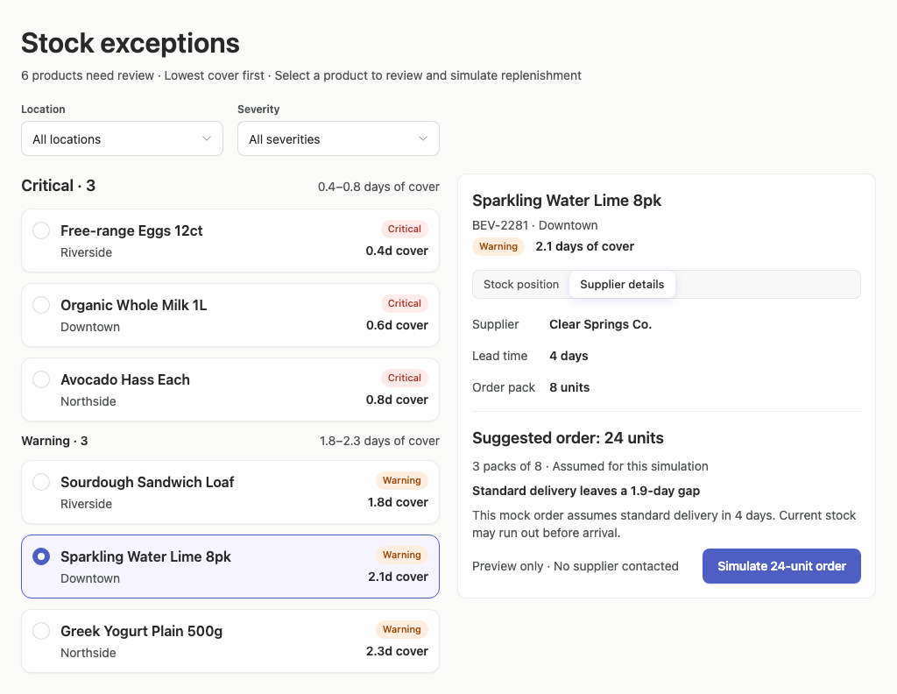

### desktop-window-2 — Simulate replenishment

Interaction: passed.

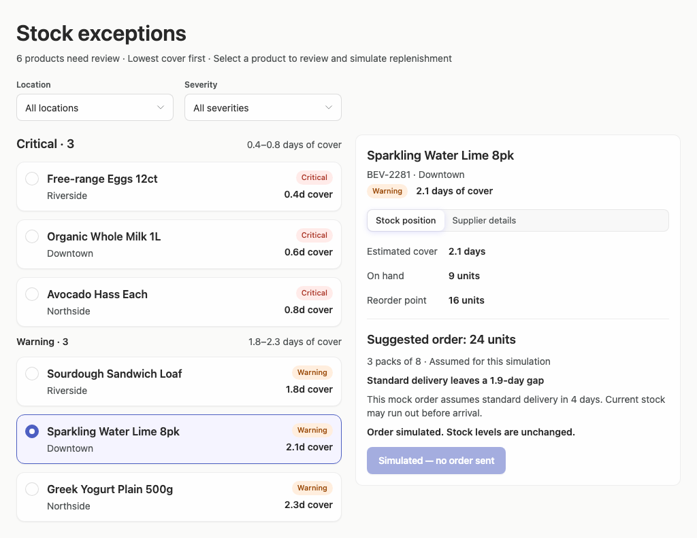

### desktop-window-3 — Filter records

Interaction: passed.

### desktop-window-4 — Review delivery within cover

Interaction: passed.

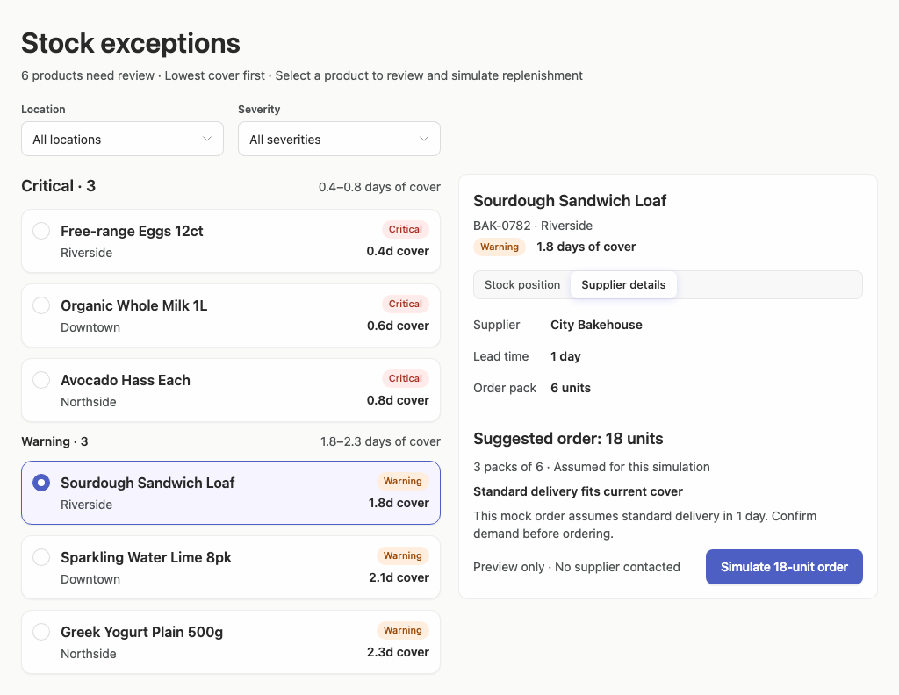

### desktop-window-5 — Read the stock-view delivery assumption

Interaction: passed.

### desktop-custom-700x900-0 — initial

Interaction: not-run.

### desktop-custom-700x900-1 — Select and inspect supplier

Interaction: passed.

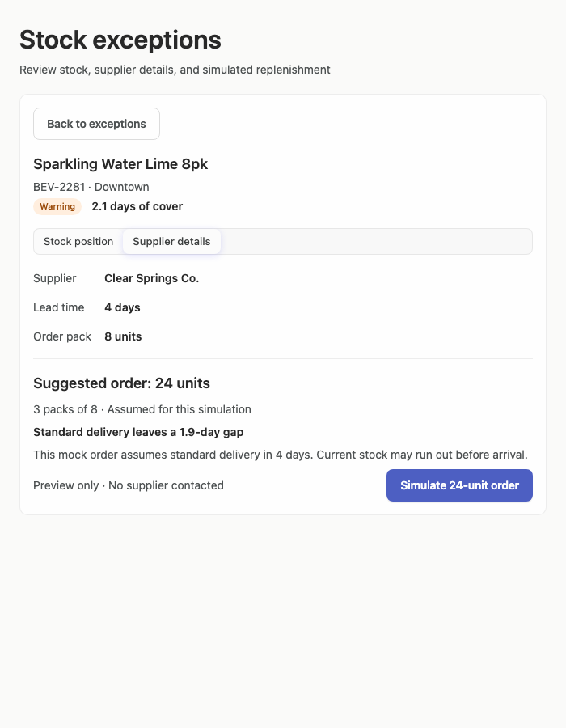

### desktop-custom-700x900-2 — Simulate replenishment

Interaction: passed.

### desktop-custom-700x900-3 — Filter records

Interaction: passed.

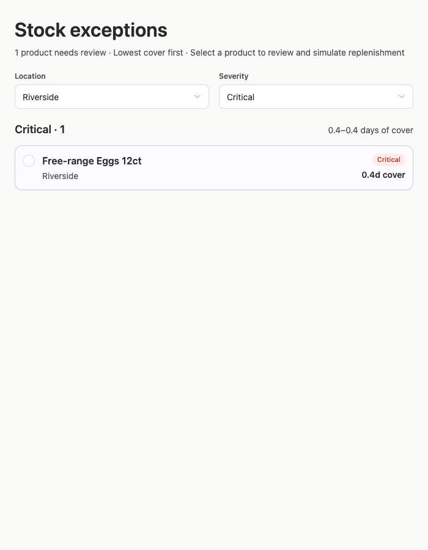

### desktop-custom-700x900-4 — Review delivery within cover

Interaction: passed.

### desktop-custom-700x900-5 — Read the stock-view delivery assumption

Interaction: passed.

## Limitations

- No implementation-plan artifact was provided, so its quality and whether the project stopped before building or publication cannot be assessed from these screenshots.
- Interaction evidence covers named scenarios but not every control combination, empty result, loading, error, keyboard, or long-content state.
- The narrowest supplied desktop panel is 700px; behavior at other resized panel widths is unknown.
- The 1024px measurements show document height reaching 792px for several 768px viewport captures, indicating minor scrolling, but the complete scrolling experience was not shown.
- Static source and adherence evidence do not prove runtime component provenance. Styling assessment coverage is especially limited, so Arrusted token adherence is not inferred beyond the visible palette and supplied evidence.
