# stock-exceptions-composition-corrected — 2026-09-08T19:03:03.519Z

[All reports](../../README.md) · [Interactive HTML report](index.html) · [Full measurements and scoring](report.json)

GitHub renders this summary and the screenshots. Download or clone this folder to open the HTML report locally; GitHub does not serve it as a website.

**Subjective design score:** 80/100. Model: openai/gpt-5.6-sol. Rubric: 2.

**Arrusted adherence:** 100/100 (partial); evidence coverage 0.49%. Evaluator 3.

| Dimension | Conforming | Nonconforming | Unassessed | Adherence  |
| --------- | ---------- | ------------- | ---------- | ---------- |
| component | 8          | 0             | 1          | 100% (8/8) |
| api       | 7          | 0             | 23         | 100% (7/7) |
| styling   | 6          | 0             | 4266       | 100% (6/6) |

Scores from different evaluator versions or captured states are not directly comparable.

This is the saved component-backed preview, not a new generation or a built backend. Scores are advisory and not human-calibrated.

## Ratings

| Dimension | Score | Reason |
| --- | --- | --- |
| hierarchy | 3/4 | The page establishes a clear title-to-filter-to-list/detail sequence, and the highlighted row connects well to the prominent product title and severity status. Stock, supplier, and replenishment sections are easy to scan, though very small secondary metadata and the persistent action footer reduce the prominence of supporting evidence. |
| layout | 3/4 | The two-column review composition is consistently aligned at 1024, 1440, and 1920 pixels, with sensible centering and balanced list/detail widths. At shorter desktop windows, however, the fixed action footer and internal panel scrolling obscure portions of the replenishment or supplier content. |
| typography | 3/4 | Product titles, section headings, values, and action labels are visually consistent and readable. Table headers and estimated-cover metadata are notably smaller and lighter than the primary content, making those useful inventory signals less immediate. |
| responsive | 3/4 | Across the supplied desktop widths, controls remain usable, columns do not overlap, and no horizontal document overflow is reported. The 1024×768 composition becomes constrained: the detail title wraps around its badge and important detail sections require substantial internal scrolling, but the primary action remains available. |
| productClarity | 4/4 | The interface clearly supports location and severity filtering, item selection, stock and supplier review, and a mock replenishment action. Repeated “Preview only,” “No order was sent,” and completed-state messaging make the non-production nature of the action exceptionally clear. |

## Strengths

- The selected table row and matching detail title create a strong master-detail relationship.
- Location and severity filters are labeled plainly, and the result count updates in the filtered state.
- Stock position presents on-hand quantity, reorder point, suggested replenishment, and estimated cover in a compact review flow.
- Supplier information is integrated into the same detail context rather than forcing a separate navigation step.
- The mock action has clear quantity-specific labeling and unambiguous post-action feedback.
- The centered maximum-width layout uses wide desktop space without stretching the working area excessively.

## Improvements

- **medium — desktop-1:** The opened “Try replenishment” content is partially hidden behind the persistent action footer, so its preview explanation cannot be read without scrolling even at 1440×900. Reserve footer-height space at the bottom of the panel’s scroll area or automatically bring the complete opened section into view while retaining the persistent action.
- **medium — desktop-window-1:** At 1024×768, the expanded supplier section shows the supplier and lead time but pushes the order-pack value below the visible area. This separates a key purchasing constraint from the replenishment action. Use the compact metadata arrangement supported by the detail composition, or collapse the preceding stock section when supplier details are opened, so supplier, lead time, and order pack can be reviewed together.
- **low — desktop-window-2:** The status pill shares the title row and forces “Sparkling Water Lime 8pk” onto an awkward two-line break, unlike the same record at wider widths. At constrained desktop widths, place the status pill on the subtitle or metadata row so the product title receives the full panel width.
- **low — desktop-0:** The small uppercase table headers have limited visual prominence relative to the row content, making column identification slightly slower. Automated evidence also flags their contrast as marginal, although the existing palette remains authoritative. Use a supported regular-density table or stronger standard label typography while preserving the existing semantic palette and component colors.
- **low — desktop-0:** “Estimated cover: 0.6 days” is very small despite being an important low-stock urgency signal, and it is visually separated from the larger stock values below. Present estimated cover using a standard metadata row or supported KPI/status treatment near the severity indicator, without changing the palette.

## Token evidence

Percentages cover only assessed properties. Missing provenance and ambiguous CSS remain unassessed; matching literals are not proof of token usage.

| Viewport         | Category   | Token references / assessed | Coverage   |
| ---------------- | ---------- | --------------------------- | ---------- |
| desktop-0        | color      | 0/0                         | 0% (0/233) |
| desktop-0        | typography | 0/0                         | 0% (0/564) |
| desktop-0        | spacing    | 0/0                         | 0% (0/260) |
| desktop-0        | radius     | 0/0                         | 0% (0/120) |
| desktop-0        | border     | 0/0                         | 0% (0/125) |
| desktop-0        | shadow     | 0/0                         | 0% (0/120) |
| desktop-wide-0   | color      | 0/0                         | 0% (0/233) |
| desktop-wide-0   | typography | 0/0                         | 0% (0/564) |
| desktop-wide-0   | spacing    | 0/0                         | 0% (0/260) |
| desktop-wide-0   | radius     | 0/0                         | 0% (0/120) |
| desktop-wide-0   | border     | 0/0                         | 0% (0/125) |
| desktop-wide-0   | shadow     | 0/0                         | 0% (0/120) |
| desktop-window-0 | color      | 0/0                         | 0% (0/233) |
| desktop-window-0 | typography | 0/0                         | 0% (0/564) |
| desktop-window-0 | spacing    | 0/0                         | 0% (0/260) |
| desktop-window-0 | radius     | 0/0                         | 0% (0/120) |
| desktop-window-0 | border     | 0/0                         | 0% (0/125) |
| desktop-window-0 | shadow     | 0/0                         | 0% (0/120) |

## Latest-run screenshots

### desktop-0 — initial

Interaction: not-run.

### desktop-1 — Select and inspect supplier

Interaction: passed.

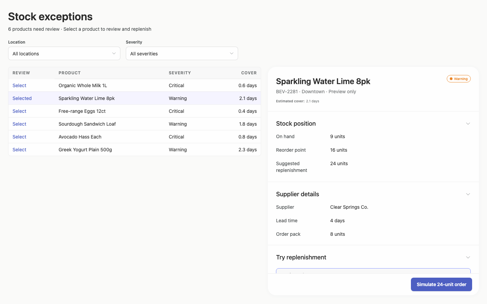

### desktop-2 — Simulate replenishment

Interaction: passed.

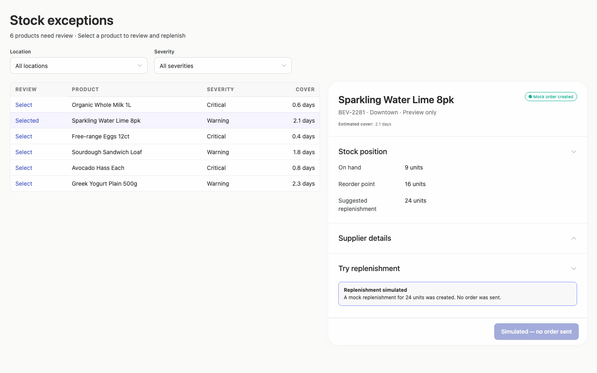

### desktop-3 — Filter records

Interaction: passed.

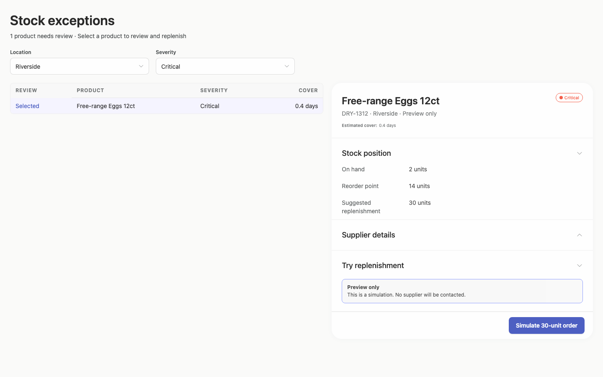

### desktop-wide-0 — initial

Interaction: not-run.

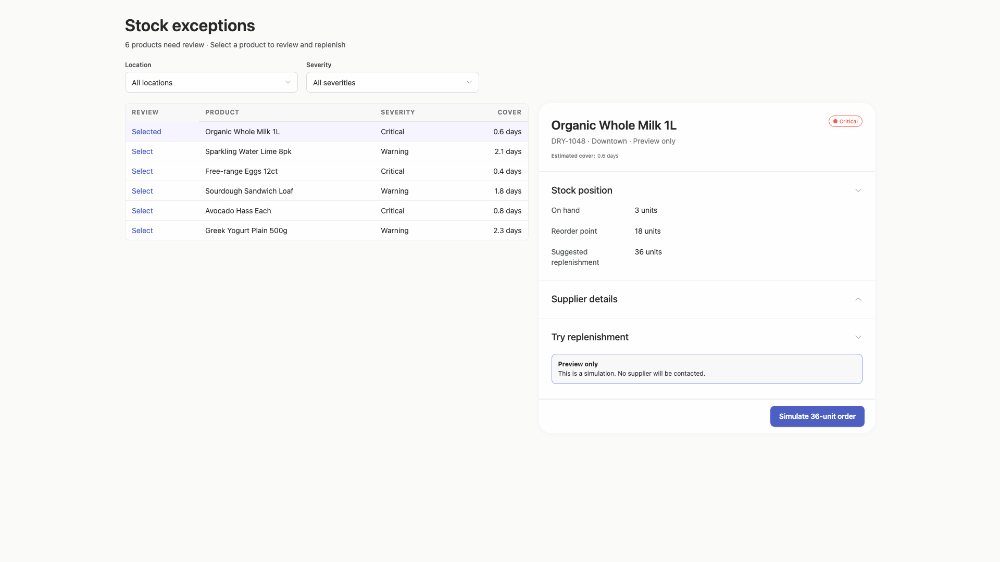

### desktop-wide-1 — Select and inspect supplier

Interaction: passed.

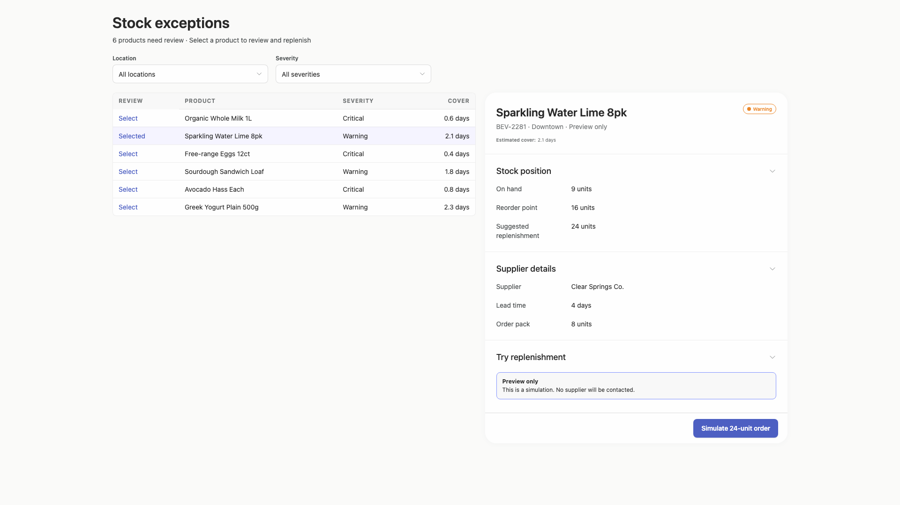

### desktop-wide-2 — Simulate replenishment

Interaction: passed.

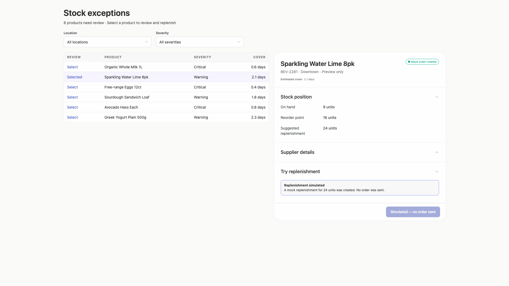

### desktop-wide-3 — Filter records

Interaction: passed.

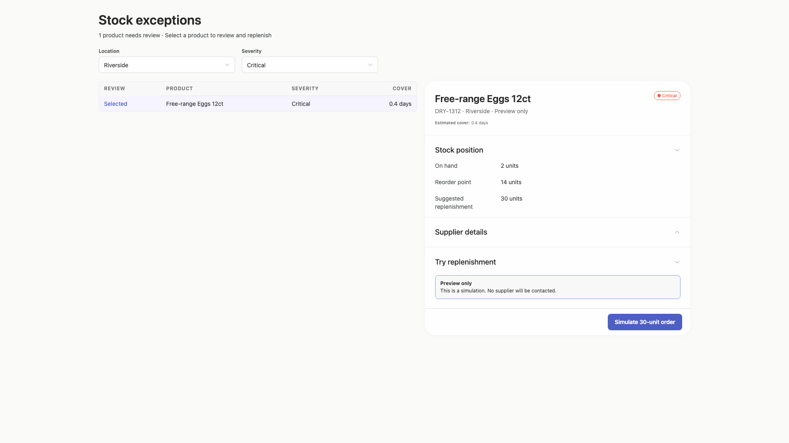

### desktop-window-0 — initial

Interaction: not-run.

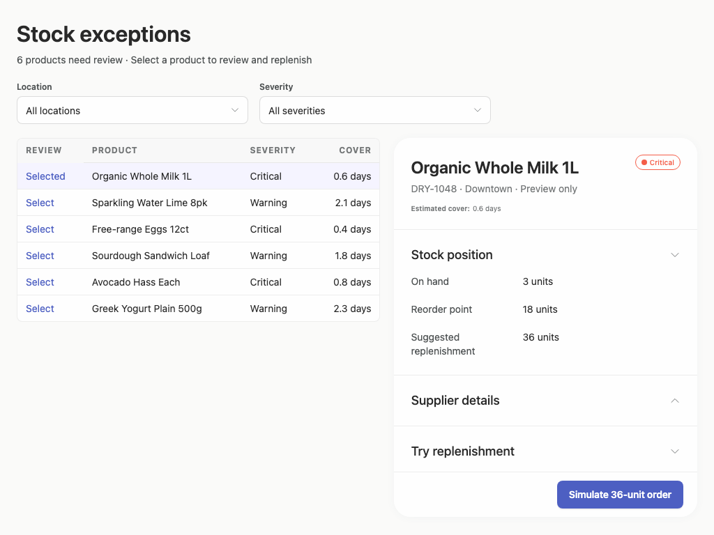

### desktop-window-1 — Select and inspect supplier

Interaction: passed.

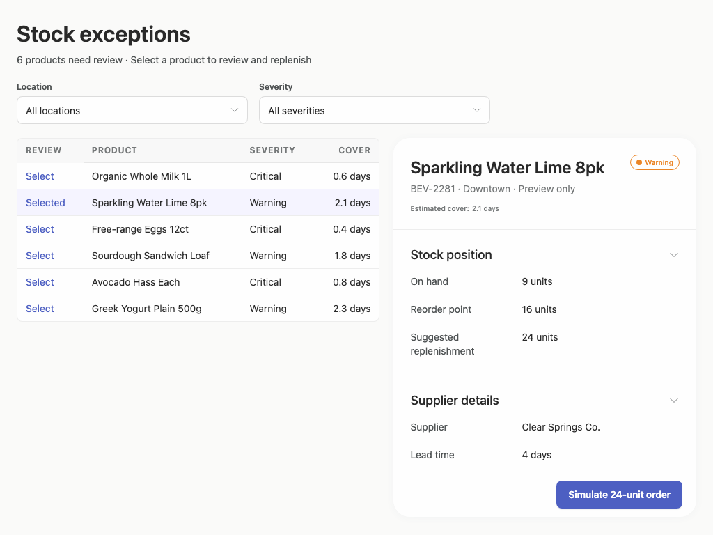

### desktop-window-2 — Simulate replenishment

Interaction: passed.

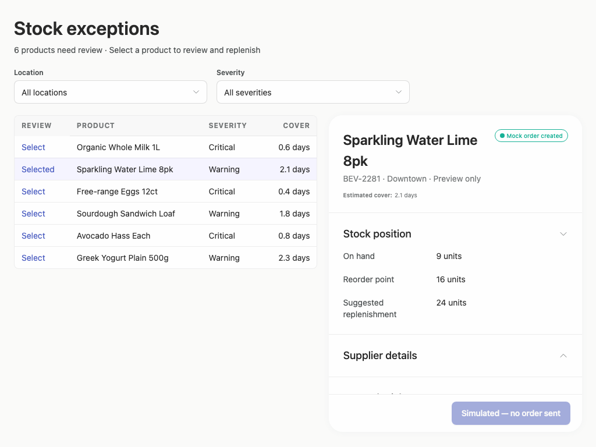

### desktop-window-3 — Filter records

Interaction: passed.

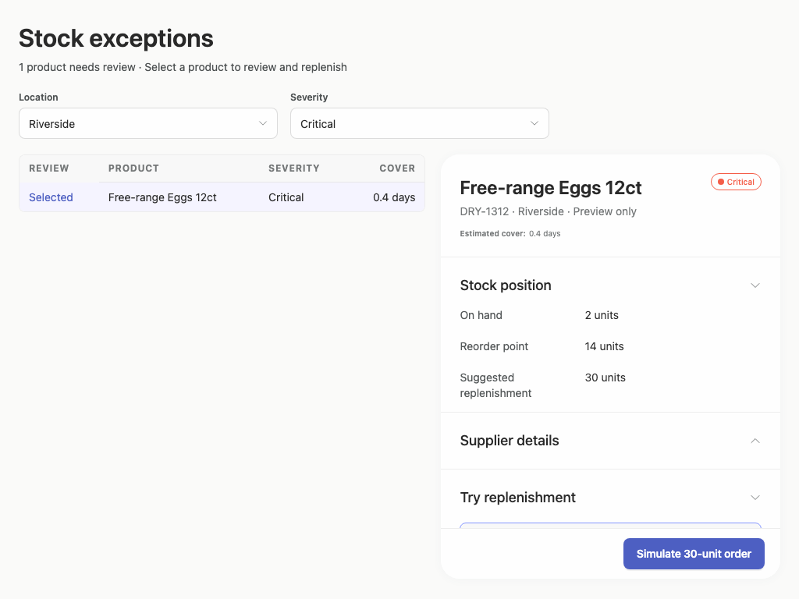

## Limitations

- Only desktop captures from 1024 to 1920 pixels were provided; no narrower or phone rendering was available to assess.
- The screenshots do not show an implementation-plan artifact or publication controls, so those deliverables and the requested stop-before-publication boundary cannot be verified visually.
- Only the recorded selection, filtering, and simulation interactions were exercised; empty results, loading, error, keyboard, and reset states were not shown.
- Static screenshots and limited interaction checks do not establish persistence, supplier integration, authorization, or other backend behavior.
- Arrusted styling evidence has extremely limited assessed coverage, so full token adherence cannot be concluded from the supplied report.
