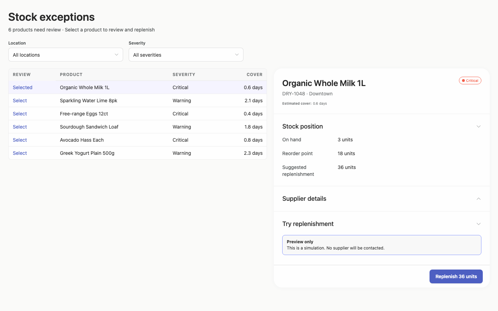
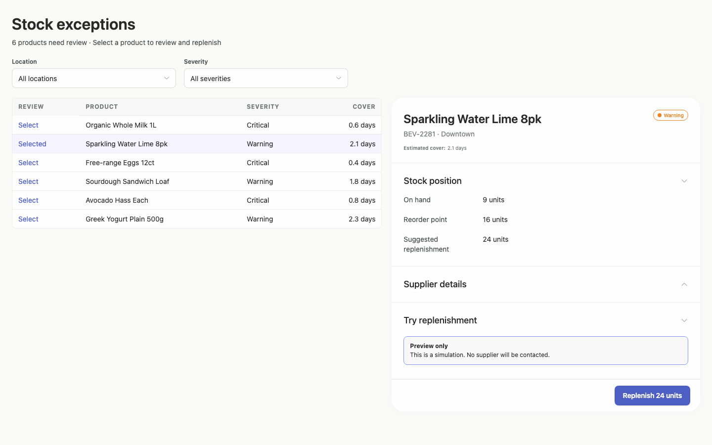
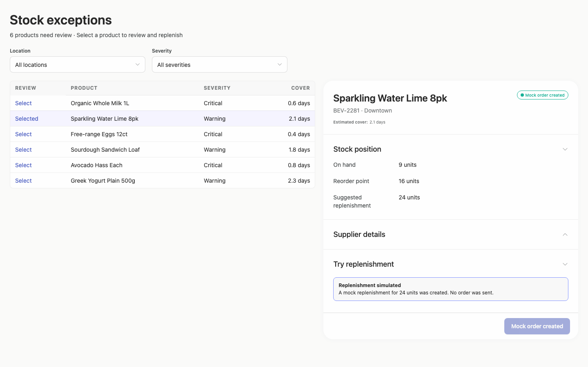
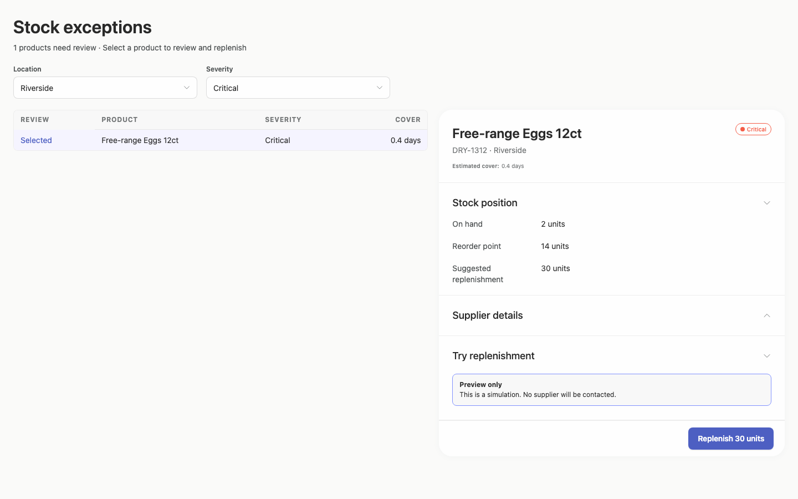
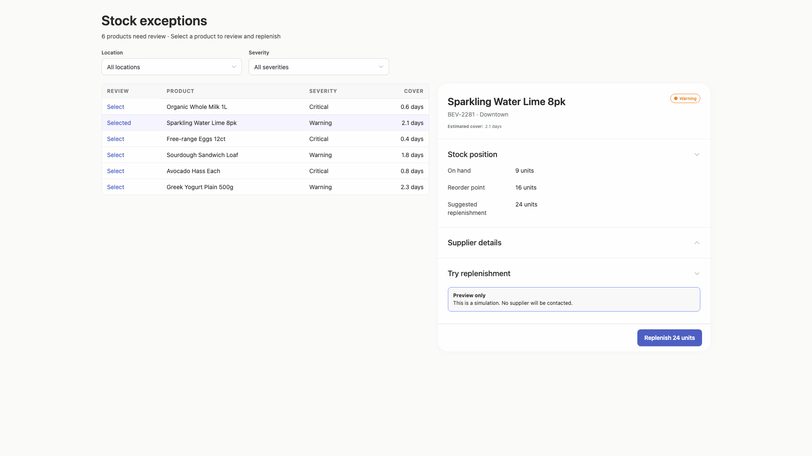
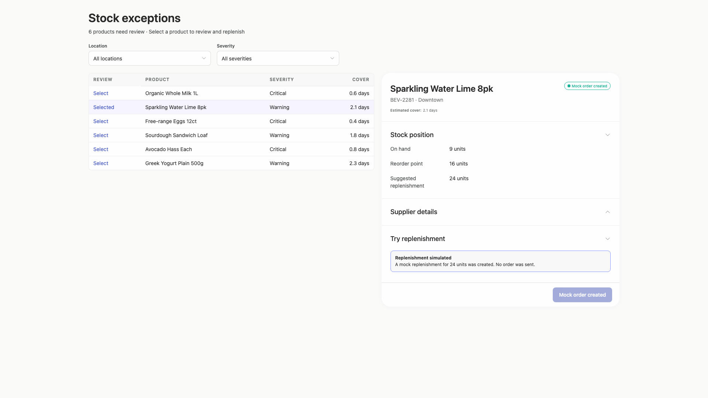
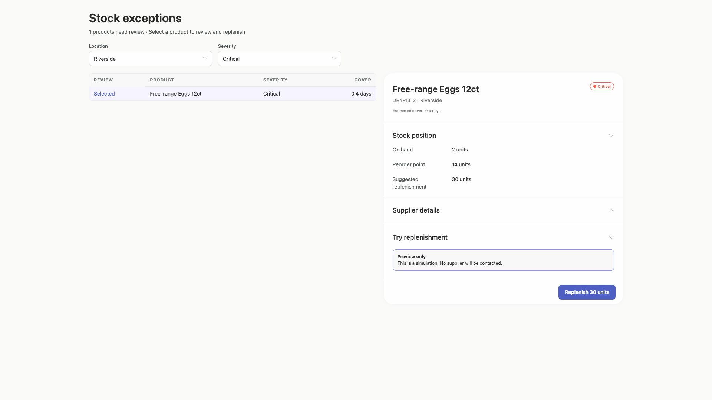
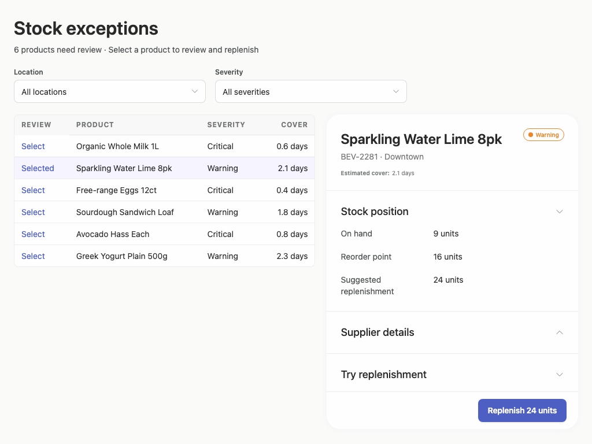
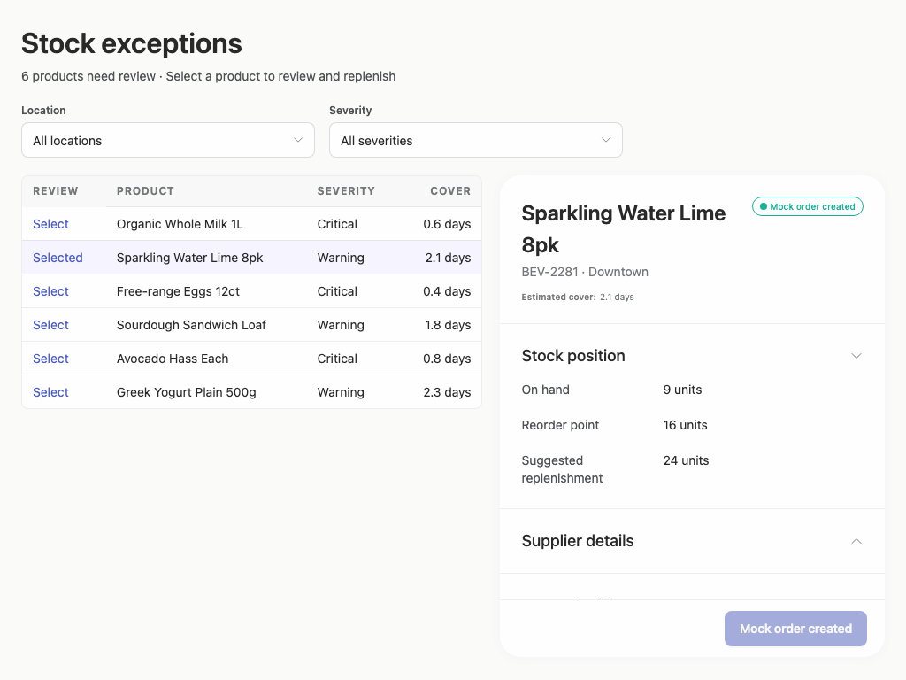
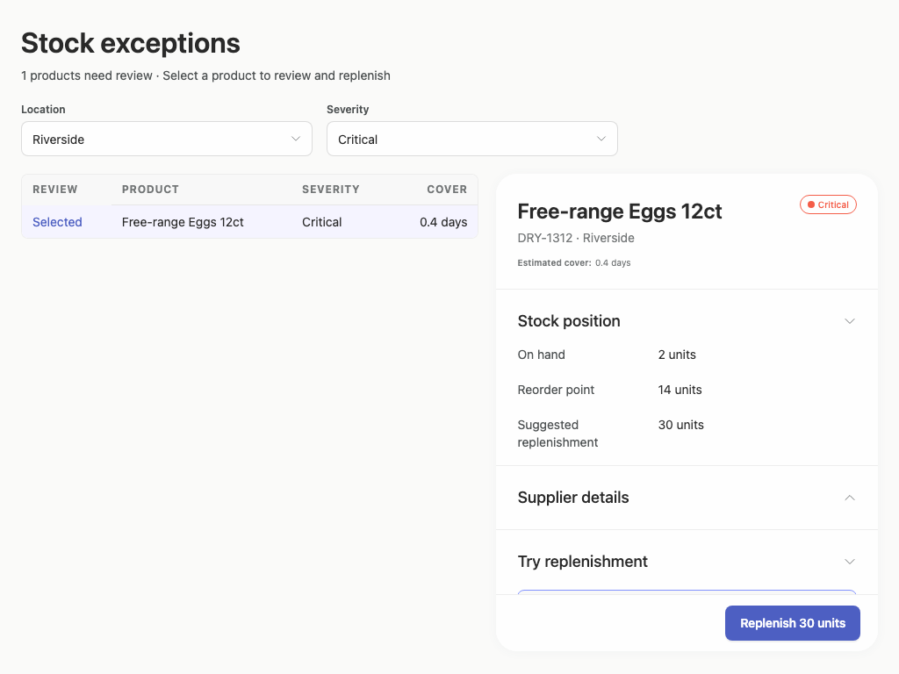

# stock-exceptions-composition-first-pass — 2026-09-08T18:58:11.538Z

[All reports](../../README.md) · [Interactive HTML report](index.html) · [Full measurements and scoring](report.json)

GitHub renders this summary and the screenshots. Download or clone this folder to open the HTML report locally; GitHub does not serve it as a website.

**Subjective design score:** 65/100. Model: openai/gpt-5.6-sol. Rubric: 2.

**Arrusted adherence:** 100/100 (partial); evidence coverage 0%. Evaluator 3.

| Dimension | Conforming | Nonconforming | Unassessed | Adherence  |
| --------- | ---------- | ------------- | ---------- | ---------- |
| component | 8          | 0             | 1          | 100% (8/8) |
| api       | 7          | 0             | 23         | 100% (7/7) |
| styling   | 6          | 0             | 4266       | 100% (6/6) |

Scores from different evaluator versions or captured states are not directly comparable.

This is the saved component-backed preview, not a new generation or a built backend. Scores are advisory and not human-calibrated.

## Ratings

| Dimension | Score | Reason |
| --- | --- | --- |
| hierarchy | 3/4 | The page title, filters, exception list, selected-product detail, and replenishment action form a clear review sequence. Selected-row highlighting and severity pills support scanning, though supplier information has no visible content and very small metadata such as “Estimated cover” is easy to overlook. |
| layout | 3/4 | The two-column master-detail composition is aligned and comfortably spaced at 1440px and 1920px, with a sensible centered maximum width on wide screens. At 1024px the columns remain usable without horizontal overflow, but the detail panel’s lower content is clipped in some states and wide captures leave substantial unused space below the short list. |
| typography | 3/4 | Titles, section headings, field labels, and table values use a consistent typographic hierarchy with readable product names and quantities. Table headers, severity/status pills, and detail metadata are quite small; the supplied audit also flags marginal or insufficient contrast for these text treatments, so they may be difficult to scan despite overall consistency. |
| responsive | 2/4 | The interface remains a coherent two-column desktop layout from 1920px down to 1024px, and filters and primary actions remain visible. However, at 1024×768 the replenishment explanation disappears in the initial state and the simulated-result content is visibly cut off, with no documented scroll container, making the lower workflow unreliable in a smaller desktop window. |
| productClarity | 2/4 | Location and severity filters are explicit, selection is confirmed in both the table and detail title, stock quantities are plainly labeled, and the simulation is clearly described as not contacting a supplier. The core supplier-review requirement is not demonstrated—the “Supplier details” section shows no supplier values and the corresponding interaction check failed—while the post-action state is clipped at 1024px and the filtered count reads “1 products.” |

## Strengths

- Clear master-detail relationship between the exception list and selected product.
- Location and severity filters are prominent, labeled, and shown updating both the result count and selected record.
- Severity, cover, on-hand stock, reorder point, and suggested replenishment provide relevant decision context without excessive dashboard content.
- The mock action is explicitly framed as a simulation, and the successful state changes both the status pill and action label.
- The composition remains aligned and free of horizontal document overflow across the supplied 1024px, 1440px, and 1920px desktop captures.

## Improvements

- **high — desktop-1:** “Supplier details” presents an upward chevron suggesting an expanded section, but no supplier name, lead time, terms, or other content is visible. The associated interaction check also failed to find the expected supplier name, leaving a required review task unsupported in the demonstrated state. Show the supplier fields directly beneath this heading when expanded, including at least supplier name, lead time, ordering unit or minimum, and contact/status. If it is intentionally collapsed, use the composition’s unambiguous collapsed state and demonstrate the expanded state in a capture.
- **high — desktop-window-2:** In the 1024×768 post-action state, the lower replenishment section is cut off: only a fragment of its heading/content appears while the disabled “Mock order created” button remains visible. This obscures the confirmation details at a common desktop-window size. Let the detail panel body scroll independently above a persistent action footer, or collapse less important sections after completion so the full simulated-result message and action state remain reachable.
- **medium — desktop-window-0:** The initial 1024px view exposes the replenishment button but omits the “Preview only” explanation visible in larger captures. Users can therefore act without seeing the strongest nearby indication that no supplier will be contacted. Keep the simulation notice visible immediately above the action at smaller desktop heights, using a compact supported detail-section arrangement or a scrollable panel body rather than removing it from the visible action context.
- **low — desktop-3:** The filtered summary reads “1 products need review,” which weakens polish and makes the status sentence feel mechanically generated. Use singular-aware copy: “1 product needs review,” while retaining the plural form for other counts.
- **low — desktop-0:** The uppercase table headers are only about 12px and the supplied audit reports their text treatment as marginally below its contrast threshold. They remain legible in the capture but are less prominent than useful for rapid inventory scanning. Use the table composition’s regular-density or stronger label typography variant to increase header legibility without changing the authoritative palette.

## Token evidence

Percentages cover only assessed properties. Missing provenance and ambiguous CSS remain unassessed; matching literals are not proof of token usage.

| Viewport         | Category   | Token references / assessed | Coverage   |
| ---------------- | ---------- | --------------------------- | ---------- |
| desktop-0        | color      | 0/0                         | 0% (0/233) |
| desktop-0        | typography | 0/0                         | 0% (0/564) |
| desktop-0        | spacing    | 0/0                         | 0% (0/260) |
| desktop-0        | radius     | 0/0                         | 0% (0/120) |
| desktop-0        | border     | 0/0                         | 0% (0/125) |
| desktop-0        | shadow     | 0/0                         | 0% (0/120) |
| desktop-wide-0   | color      | 0/0                         | 0% (0/233) |
| desktop-wide-0   | typography | 0/0                         | 0% (0/564) |
| desktop-wide-0   | spacing    | 0/0                         | 0% (0/260) |
| desktop-wide-0   | radius     | 0/0                         | 0% (0/120) |
| desktop-wide-0   | border     | 0/0                         | 0% (0/125) |
| desktop-wide-0   | shadow     | 0/0                         | 0% (0/120) |
| desktop-window-0 | color      | 0/0                         | 0% (0/233) |
| desktop-window-0 | typography | 0/0                         | 0% (0/564) |
| desktop-window-0 | spacing    | 0/0                         | 0% (0/260) |
| desktop-window-0 | radius     | 0/0                         | 0% (0/120) |
| desktop-window-0 | border     | 0/0                         | 0% (0/125) |
| desktop-window-0 | shadow     | 0/0                         | 0% (0/120) |

## Latest-run screenshots

### desktop-0 — initial

Interaction: not-run.

### desktop-1 — Select and inspect supplier

Interaction: failed.

### desktop-2 — Simulate replenishment

Interaction: passed.

### desktop-3 — Filter records

Interaction: passed.

### desktop-wide-0 — initial

Interaction: not-run.

### desktop-wide-1 — Select and inspect supplier

Interaction: failed.

### desktop-wide-2 — Simulate replenishment

Interaction: passed.

### desktop-wide-3 — Filter records

Interaction: passed.

### desktop-window-0 — initial

Interaction: not-run.

### desktop-window-1 — Select and inspect supplier

Interaction: failed.

### desktop-window-2 — Simulate replenishment

Interaction: passed.

### desktop-window-3 — Filter records

Interaction: passed.

## Limitations

- No captures narrower than 1024px were supplied, so behavior in narrower desktop panels was not observed.
- No screenshot demonstrates visible supplier values; it is uncertain whether the section is empty, incorrectly expanded, or merely not captured in the intended state.
- The supplier-inspection interaction failed in every supplied desktop size, while filter and replenishment checks passed; screenshots alone do not establish the underlying cause.
- The brief requests an implementation plan, but no plan artifact was supplied, so its quality and the requested stop-before-build boundary cannot be assessed.
- Static captures cannot establish persistence, keyboard behavior, loading and empty states, or actual supplier/order side effects.
- Arrusted styling evidence has very low browser coverage and is explicitly conservative; it does not support a complete token-adherence conclusion.
