# stock-exceptions-focused-detail — 2026-09-08T23:42:38.518Z

[All reports](../../README.md) · [Interactive HTML report](index.html) · [Full measurements and scoring](report.json)

GitHub renders this summary and the screenshots. Download or clone this folder to open the HTML report locally; GitHub does not serve it as a website.

**Subjective design score:** 90/100. Model: openai/gpt-5.6-sol. Rubric: 2.

**Arrusted adherence:** 100/100 (partial); evidence coverage 1.73%. Evaluator 3.

| Dimension | Conforming | Nonconforming | Unassessed | Adherence    |
| --------- | ---------- | ------------- | ---------- | ------------ |
| component | 32         | 0             | 3          | 100% (32/32) |
| api       | 54         | 0             | 9          | 100% (54/54) |
| styling   | 16         | 0             | 5790       | 100% (16/16) |

Scores from different evaluator versions or captured states are not directly comparable.

This is the saved component-backed preview, not a new generation or a built backend. Scores are advisory and not human-calibrated.

## Ratings

| Dimension | Score | Reason |
| --- | --- | --- |
| hierarchy | 4/4 | The page establishes a clear sequence from title and filters to severity-grouped exceptions, selected record details, suggested order, and the primary simulation action. Selected rows, section counts, cover ranges, and the prominent order heading make urgent information highly scannable. |
| layout | 3/4 | The master-detail composition is consistently aligned, with balanced card padding and compact data rows across 1440px and 1920px views. At the shorter 1024px window, the list extends below the viewport and introduces a small amount of page scrolling, while filtered results can leave substantial unused space. |
| typography | 4/4 | Product names, section headings, values, explanatory copy, and control labels use a restrained and consistent hierarchy. Bold numeric values and delivery-risk statements are especially easy to scan, and no clipping or problematic wrapping is visible in the supplied states. |
| responsive | 3/4 | The composition adapts effectively from a two-pane desktop view to separate list and detail views at 700px, with a clear Back to exceptions control and usable full-width filters. The 1024x768 captures have a 810px document height, so the final list item requires minor page scrolling rather than keeping both panes independently contained. |
| productClarity | 4/4 | The workflow directly supports location and severity filtering, item selection, stock and supplier review, and replenishment simulation. Suggested quantities, pack assumptions, delivery gaps, preview-only language, and the post-action message explicitly communicate that no real order is sent. |

## Strengths

- Severity grouping, item counts, cover ranges, and lowest-cover ordering provide strong inventory triage cues.
- The selected record is reinforced through its outlined row, selection indicator, repeated product identity, severity, and cover value in the detail panel.
- Stock position and supplier details are separated without obscuring the suggested replenishment information.
- Simulation safety is unusually clear: the interface says Preview only, No supplier contacted, and Simulated — no order sent, with an additional unchanged-stock confirmation.
- The 700px desktop-panel treatment avoids compressing the master-detail layout and provides a direct route back to the exception list.
- The interface remains visually consistent across all supplied widths and uses the established restrained Arrusted palette.

## Improvements

- **low — desktop-window-0:** At the 1024x768 viewport, the document grows to 810px and the final warning item falls below the initial fold. This is usable, but page-level scrolling can move the detail panel while a user is navigating the list. For short desktop windows, consider a contained scrolling region for the exception list or a slightly denser supported list composition so the detail action remains stationary while reviewing records.
- **low — desktop-0:** Critical and Warning pills use nearly identical neutral dot-and-outline treatments. The section grouping and written labels preserve understanding, but individual severity is slower to distinguish when scanning rows out of context. Use the appropriate supported StatusPill or Tag variants from the existing Arrusted palette to strengthen the distinction between severity states without introducing new colors or overriding component styling.

## Token evidence

Percentages cover only assessed properties. Missing provenance and ambiguous CSS remain unassessed; matching literals are not proof of token usage.

| Viewport | Category | Token references / assessed | Coverage |
| --- | --- | --- | --- |
| desktop-0 | color | 0/0 | 0% (0/222) |
| desktop-0 | typography | 0/0 | 0% (0/557) |
| desktop-0 | spacing | 0/0 | 0% (0/293) |
| desktop-0 | radius | 0/0 | 0% (0/114) |
| desktop-0 | border | 0/0 | 0% (0/139) |
| desktop-0 | shadow | 0/0 | 0% (0/120) |
| desktop-wide-0 | color | 0/0 | 0% (0/222) |
| desktop-wide-0 | typography | 0/0 | 0% (0/557) |
| desktop-wide-0 | spacing | 0/0 | 0% (0/293) |
| desktop-wide-0 | radius | 0/0 | 0% (0/114) |
| desktop-wide-0 | border | 0/0 | 0% (0/139) |
| desktop-wide-0 | shadow | 0/0 | 0% (0/120) |
| desktop-window-0 | color | 0/0 | 0% (0/222) |
| desktop-window-0 | typography | 0/0 | 0% (0/557) |
| desktop-window-0 | spacing | 0/0 | 0% (0/293) |
| desktop-window-0 | radius | 0/0 | 0% (0/114) |
| desktop-window-0 | border | 0/0 | 0% (0/139) |
| desktop-window-0 | shadow | 0/0 | 0% (0/120) |
| desktop-custom-700x900-0 | color | 0/0 | 0% (0/222) |
| desktop-custom-700x900-0 | typography | 0/0 | 0% (0/564) |
| desktop-custom-700x900-0 | spacing | 0/0 | 0% (0/295) |
| desktop-custom-700x900-0 | radius | 0/0 | 0% (0/114) |
| desktop-custom-700x900-0 | border | 0/0 | 0% (0/140) |
| desktop-custom-700x900-0 | shadow | 0/0 | 0% (0/120) |

## Latest-run screenshots

### desktop-0 — initial

Interaction: not-run.

### desktop-1 — Select and inspect supplier

Interaction: passed.

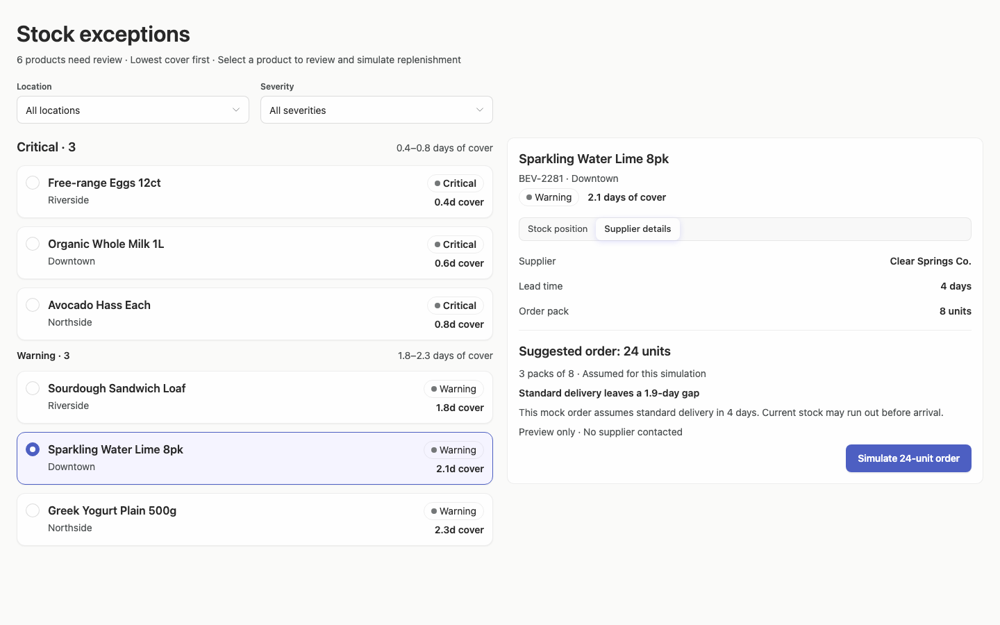

### desktop-2 — Simulate replenishment

Interaction: passed.

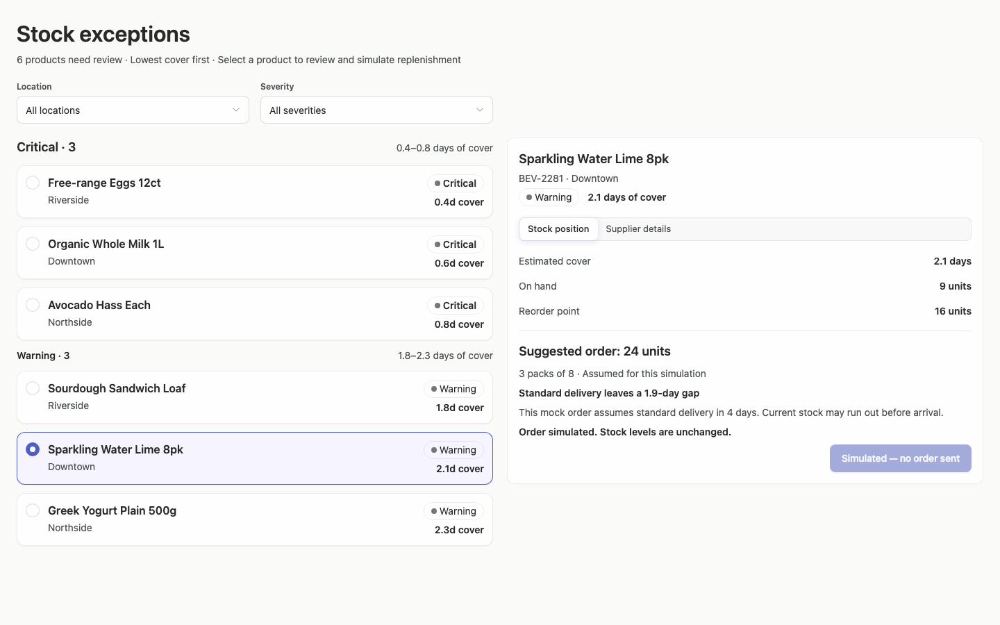

### desktop-3 — Filter records

Interaction: passed.

### desktop-4 — Review delivery within cover

Interaction: passed.

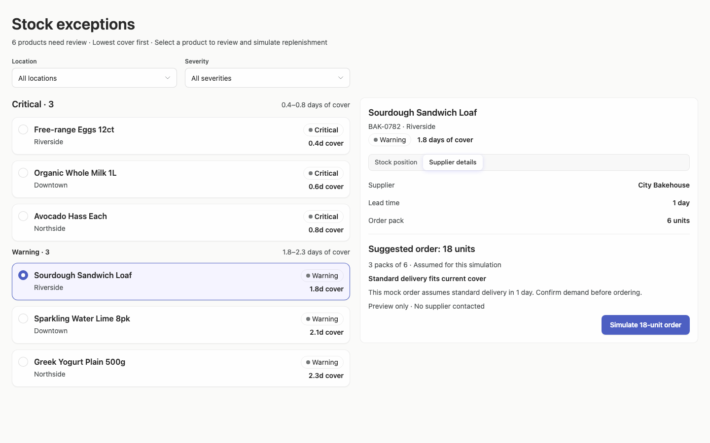

### desktop-5 — Read the stock-view delivery assumption

Interaction: passed.

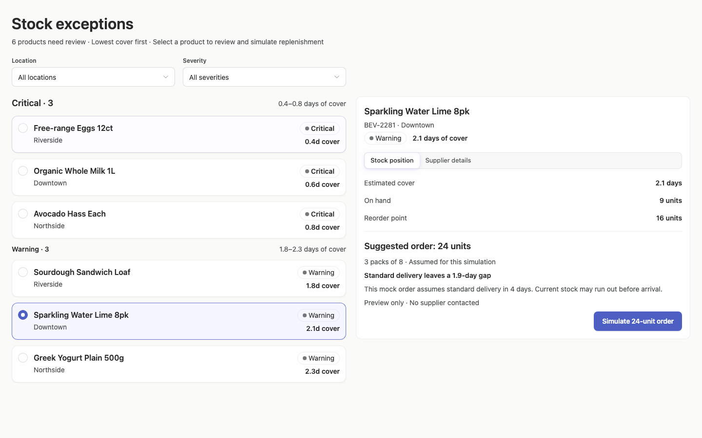

### desktop-wide-0 — initial

Interaction: not-run.

### desktop-wide-1 — Select and inspect supplier

Interaction: passed.

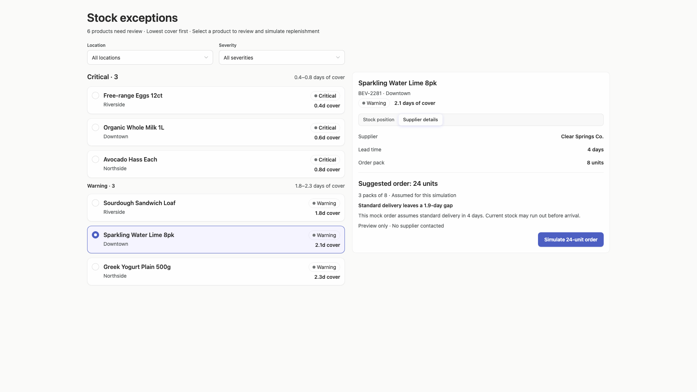

### desktop-wide-2 — Simulate replenishment

Interaction: passed.

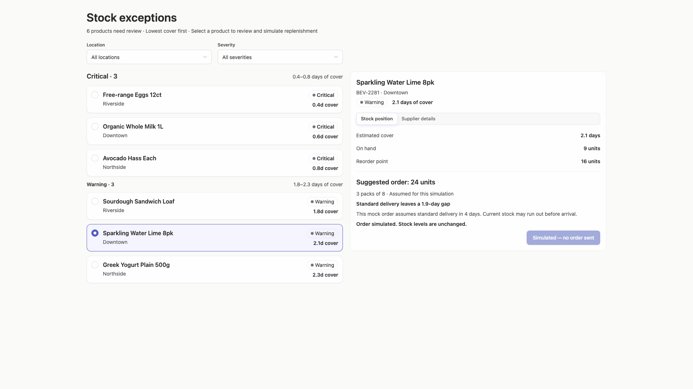

### desktop-wide-3 — Filter records

Interaction: passed.

### desktop-wide-4 — Review delivery within cover

Interaction: passed.

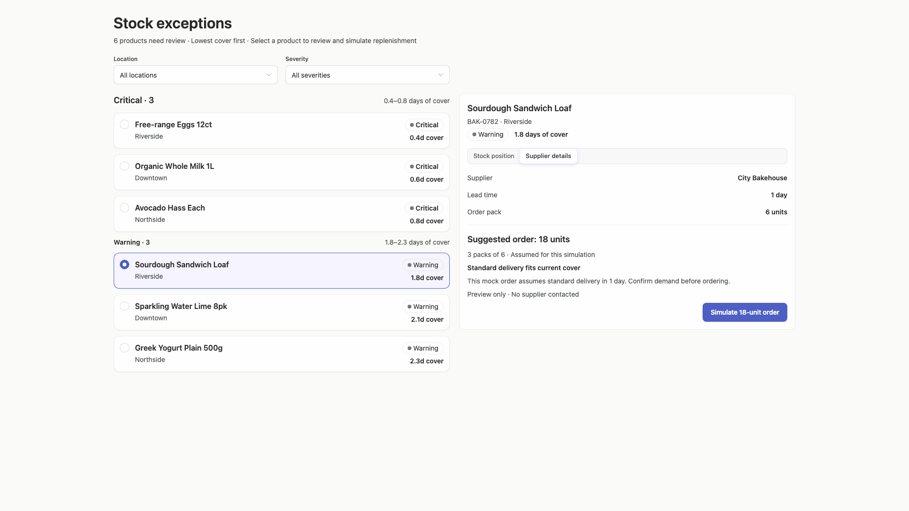

### desktop-wide-5 — Read the stock-view delivery assumption

Interaction: passed.

### desktop-window-0 — initial

Interaction: not-run.

### desktop-window-1 — Select and inspect supplier

Interaction: passed.

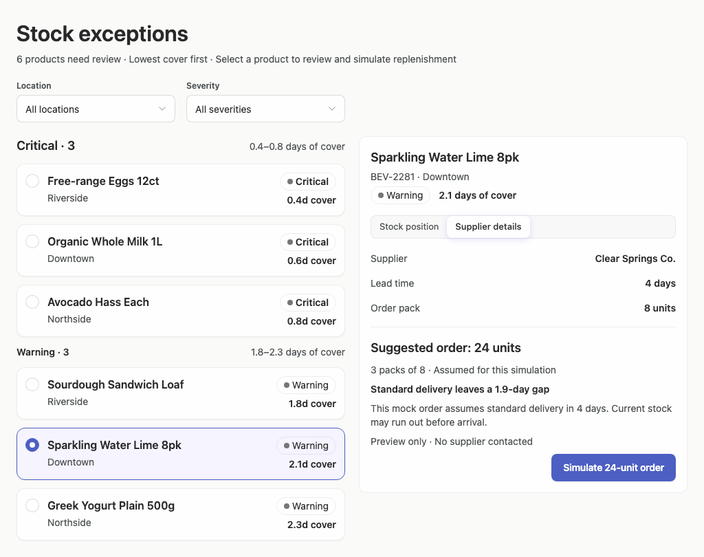

### desktop-window-2 — Simulate replenishment

Interaction: passed.

### desktop-window-3 — Filter records

Interaction: passed.

### desktop-window-4 — Review delivery within cover

Interaction: passed.

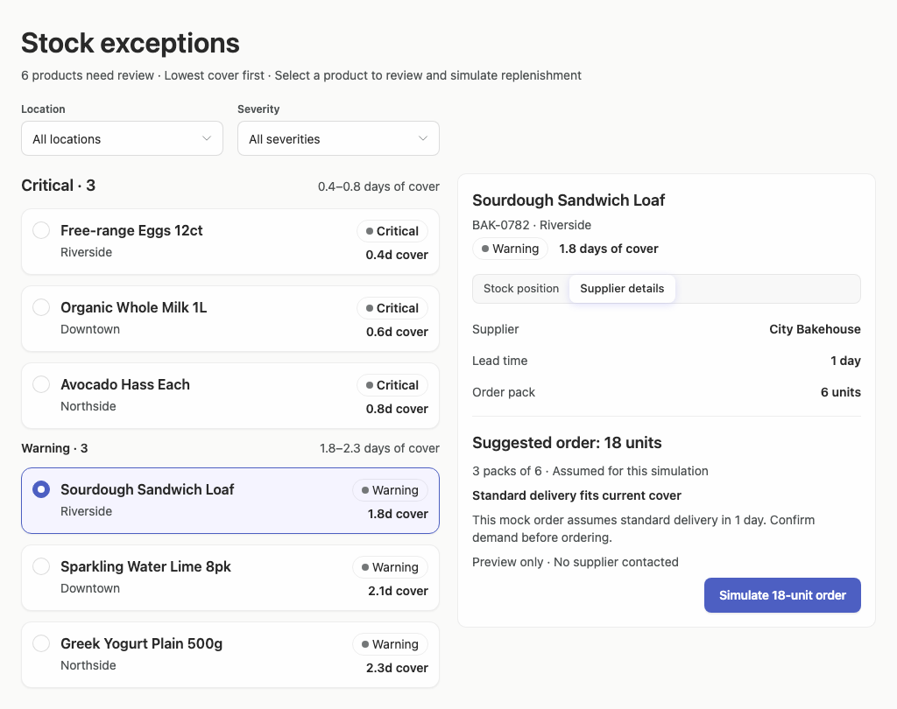

### desktop-window-5 — Read the stock-view delivery assumption

Interaction: passed.

### desktop-custom-700x900-0 — initial

Interaction: not-run.

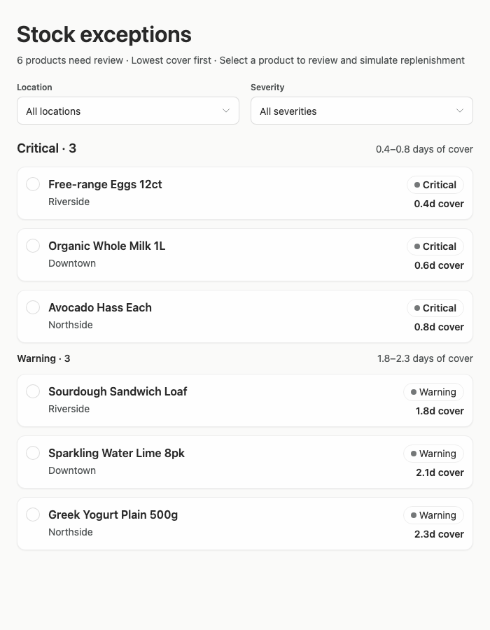

### desktop-custom-700x900-1 — Select and inspect supplier

Interaction: passed.

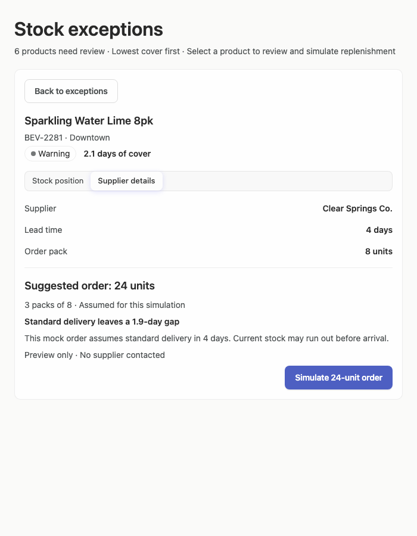

### desktop-custom-700x900-2 — Simulate replenishment

Interaction: passed.

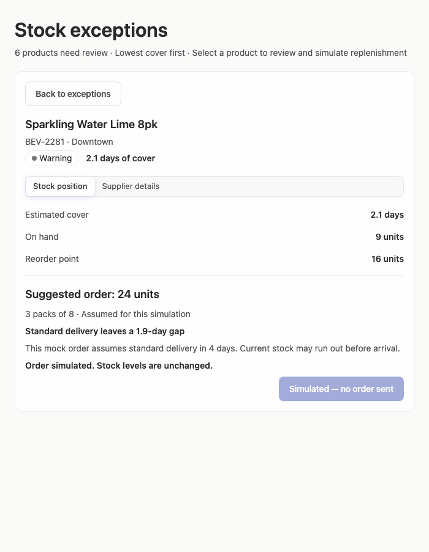

### desktop-custom-700x900-3 — Filter records

Interaction: passed.

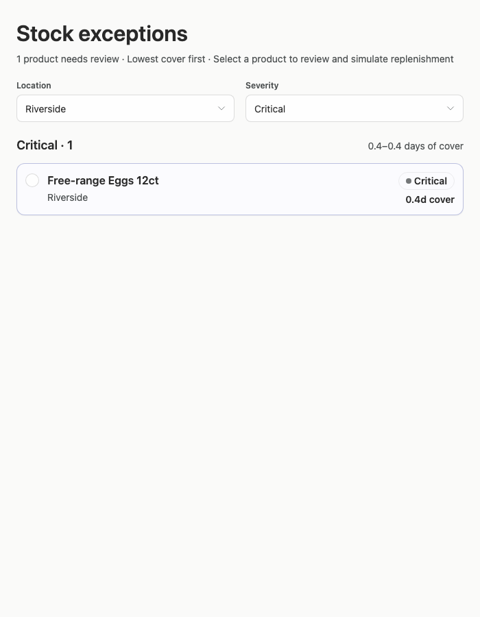

### desktop-custom-700x900-4 — Review delivery within cover

Interaction: passed.

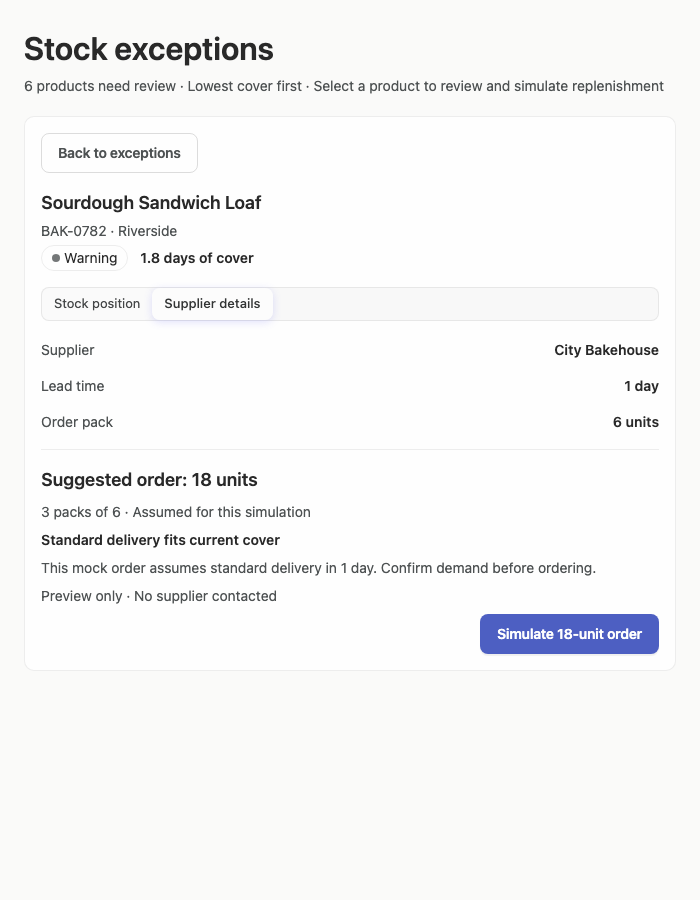

### desktop-custom-700x900-5 — Read the stock-view delivery assumption

Interaction: passed.

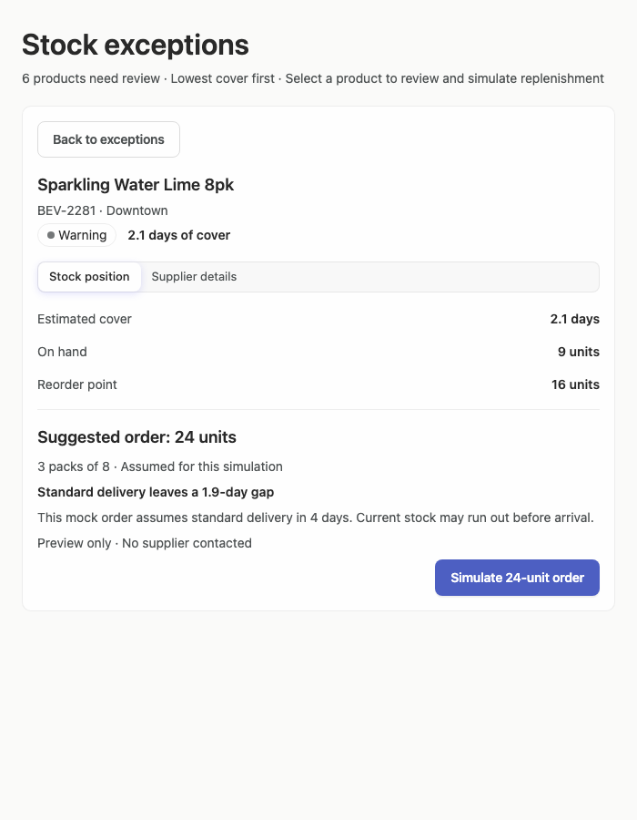

## Limitations

- The supplied evidence does not include open select menus, keyboard focus, hover states, empty results, or unusually long product and supplier names.
- Interaction evidence confirms several expected text changes, but screenshots cannot establish backend behavior or whether any order operation exists.
- The implementation plan requested by the brief is not visible in the supplied screenshots, so its quality and completeness cannot be assessed.
- Token and public-component provenance cannot be established visually; the supplied adherence evidence is conservative and has especially limited styling coverage.
- The narrow-width detail states are shown after selection, but the exact transition animation and state preservation when returning to the list were not observed.
