# stock-exceptions-grouped-outcome — 2026-09-08T20:02:26.952Z

[All reports](../../README.md) · [Interactive HTML report](index.html) · [Full measurements and scoring](report.json)

GitHub renders this summary and the screenshots. Download or clone this folder to open the HTML report locally; GitHub does not serve it as a website.

**Subjective design score:** 90/100. Model: openai/gpt-5.6-sol. Rubric: 2.

**Arrusted adherence:** 100/100 (partial); evidence coverage 1.27%. Evaluator 3.

| Dimension | Conforming | Nonconforming | Unassessed | Adherence    |
| --------- | ---------- | ------------- | ---------- | ------------ |
| component | 14         | 0             | 3          | 100% (14/14) |
| api       | 32         | 0             | 12         | 100% (32/32) |
| styling   | 11         | 0             | 4410       | 100% (11/11) |

Scores from different evaluator versions or captured states are not directly comparable.

This is the saved component-backed preview, not a new generation or a built backend. Scores are advisory and not human-calibrated.

## Ratings

| Dimension      | Score | Reason                                                                                                                                                                                                                                                                                                                                                                  |
| -------------- | ----- | ----------------------------------------------------------------------------------------------------------------------------------------------------------------------------------------------------------------------------------------------------------------------------------------------------------------------------------------------------------------------- |
| hierarchy      | 4/4   | The page establishes a clear progression from title and review count to filters, severity-grouped records, selected-item detail, and the replenishment action. Selected rows have an unmistakable outline and fill, while detail tabs and section headings make stock versus supplier information easy to scan.                                                         |
| layout         | 3/4   | The master-detail composition is consistently aligned across 1024, 1440, and 1920 px captures, with balanced gutters, regular record spacing, and a stable action footer. The supplier view is somewhat underfilled, and at 1024 px the independently scrolling product list ends with the final record almost entirely below the visible boundary.                     |
| typography     | 4/4   | Heading levels, field labels, product names, metadata, and values are consistently styled and readable. Bold product names and section headings contrast appropriately with secondary SKU, location, and cover information without introducing unnecessary type treatments.                                                                                             |
| responsive     | 3/4   | The two-column workflow remains usable from 1024 to 1920 px, controls resize cleanly, the detail action remains visible, and the product list receives contained vertical scrolling at the smaller desktop window. No narrower desktop or panel captures are provided, so behavior below 1024 px cannot be assessed.                                                    |
| productClarity | 4/4   | The task is explicit in the subtitle, filters update the review count, severity and days-of-cover are visible in each record, and selection exposes relevant stock and supplier tabs. The mock nature of replenishment is especially clear through “Preview only,” the post-action message that stock is unchanged, and the disabled “Simulated — no order sent” state. |

## Strengths

- Strong master-detail workflow keeps exception selection and evidence visible together.
- Location and severity filters are plainly labeled, with the result count updating in the filtered state.
- Severity grouping and lowest-cover ordering support rapid prioritization.
- Selected-record styling is consistent and easy to locate in both columns.
- Stock and supplier tabs avoid overcrowding the detail panel.
- The replenishment simulation communicates both quantity and its non-production nature before and after activation.
- The composition remains stable across all supplied desktop sizes, with no visible horizontal overflow or control collisions.

## Improvements

- **low — desktop-window-0:** The contained list is appropriate for the smaller window, but the sixth record is represented only by a sliver at the bottom and no persistent scroll cue is visible. Some users may initially assume that the five visible records are the full set despite the six-product count. Use the supported compact list density at shorter desktop heights, or preserve a visible scrollbar/stronger clipped-content cue so the additional record is discoverable without changing the overall master-detail composition.
- **low — desktop-wide-1:** The supplier tab contains only supplier, lead time, and order-pack values, leaving a large, visually sparse section and offering limited evidence for an inventory reviewer evaluating replenishment. Add available decision-supporting supplier fields such as supplier reference, minimum order, next delivery window, or contact status using the existing record-detail field composition; omit fields that are not part of the prototype data rather than inventing values.
- **low — desktop-0:** Critical and Warning records use nearly identical neutral pills, so priority depends mainly on reading labels and section headings. The grouping makes the list usable, but item-level severity is less immediate when scanning across rows. Keep the authoritative palette and supported status variants, but strengthen composition-level differentiation with an explicit severity text column, urgency icon, or inclusion of the numeric days-of-cover value in the primary scan line.

## Token evidence

Percentages cover only assessed properties. Missing provenance and ambiguous CSS remain unassessed; matching literals are not proof of token usage.

| Viewport         | Category   | Token references / assessed | Coverage   |
| ---------------- | ---------- | --------------------------- | ---------- |
| desktop-0        | color      | 0/0                         | 0% (0/220) |
| desktop-0        | typography | 0/0                         | 0% (0/560) |
| desktop-0        | spacing    | 0/0                         | 0% (0/313) |
| desktop-0        | radius     | 0/0                         | 0% (0/114) |
| desktop-0        | border     | 0/0                         | 0% (0/143) |
| desktop-0        | shadow     | 0/0                         | 0% (0/120) |
| desktop-wide-0   | color      | 0/0                         | 0% (0/220) |
| desktop-wide-0   | typography | 0/0                         | 0% (0/560) |
| desktop-wide-0   | spacing    | 0/0                         | 0% (0/313) |
| desktop-wide-0   | radius     | 0/0                         | 0% (0/114) |
| desktop-wide-0   | border     | 0/0                         | 0% (0/143) |
| desktop-wide-0   | shadow     | 0/0                         | 0% (0/120) |
| desktop-window-0 | color      | 0/0                         | 0% (0/220) |
| desktop-window-0 | typography | 0/0                         | 0% (0/560) |
| desktop-window-0 | spacing    | 0/0                         | 0% (0/313) |
| desktop-window-0 | radius     | 0/0                         | 0% (0/114) |
| desktop-window-0 | border     | 0/0                         | 0% (0/143) |
| desktop-window-0 | shadow     | 0/0                         | 0% (0/120) |

## Latest-run screenshots

### desktop-0 — initial

Interaction: not-run.

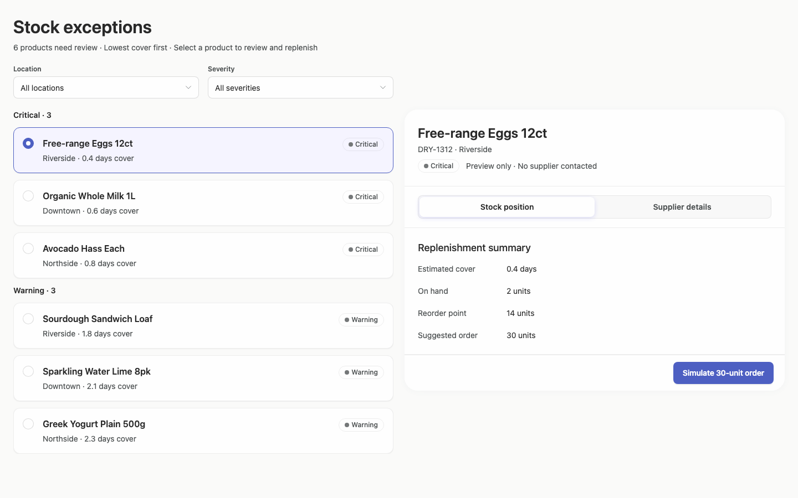

### desktop-1 — Select and inspect supplier

Interaction: passed.

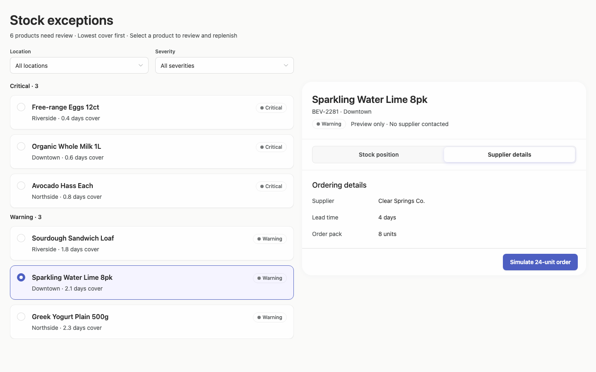

### desktop-2 — Simulate replenishment

Interaction: passed.

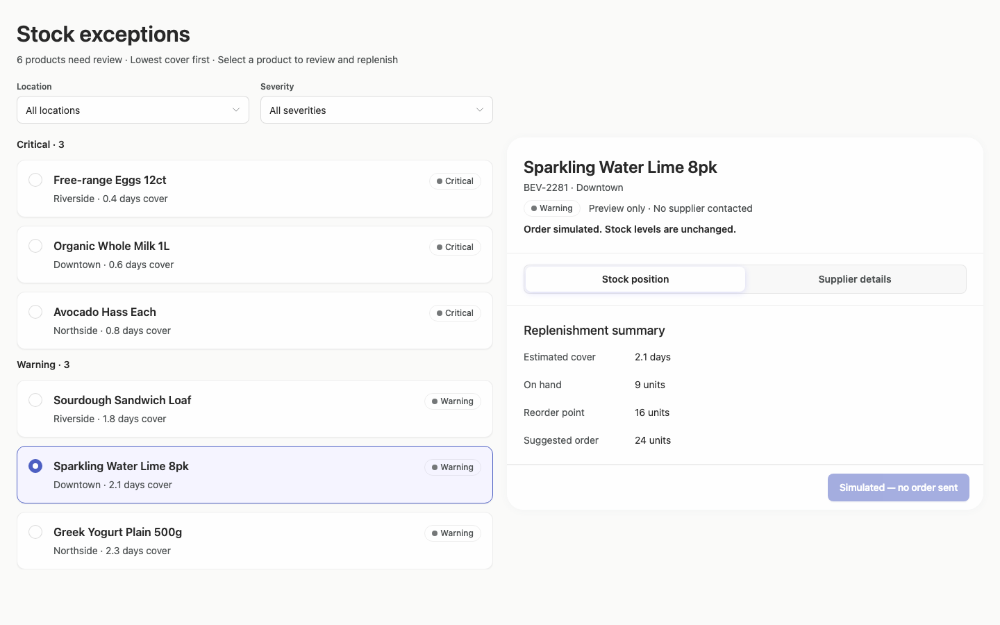

### desktop-3 — Filter records

Interaction: passed.

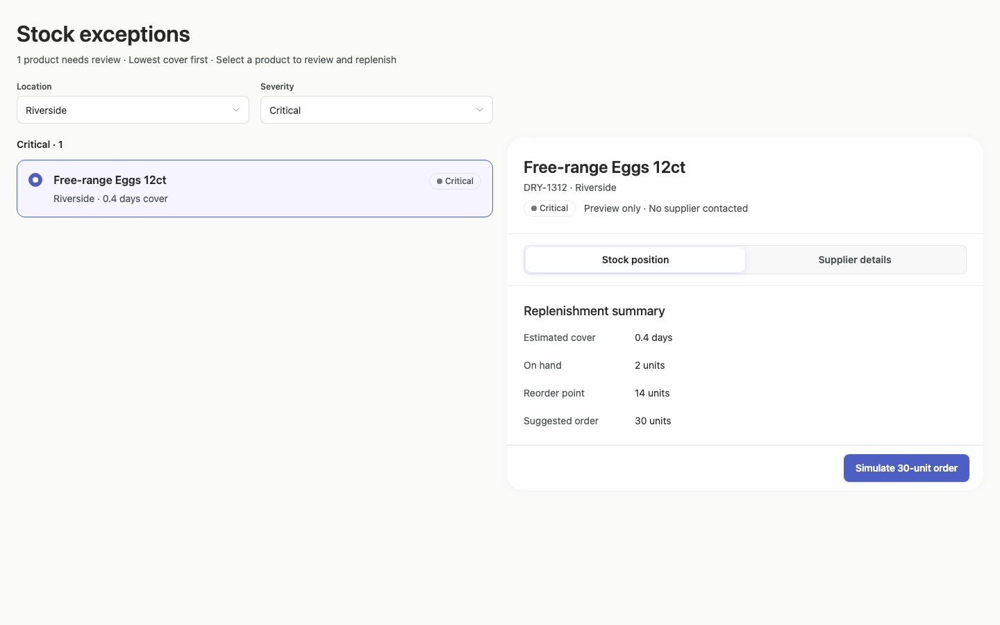

### desktop-wide-0 — initial

Interaction: not-run.

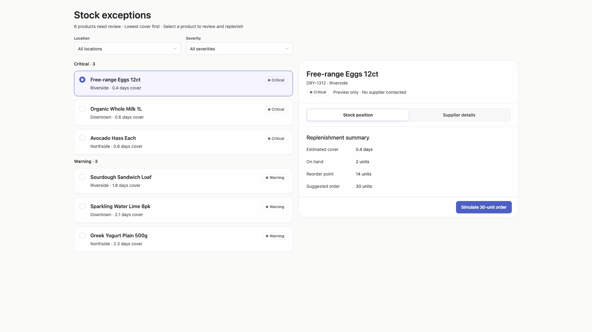

### desktop-wide-1 — Select and inspect supplier

Interaction: passed.

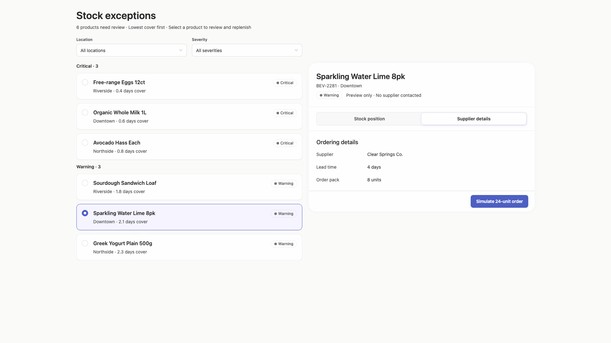

### desktop-wide-2 — Simulate replenishment

Interaction: passed.

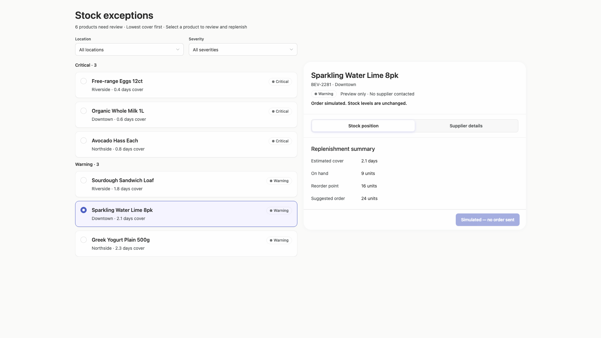

### desktop-wide-3 — Filter records

Interaction: passed.

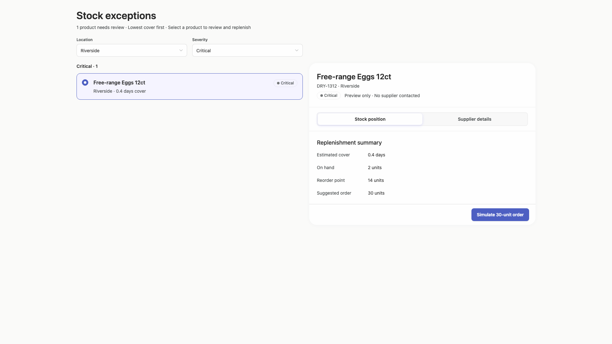

### desktop-window-0 — initial

Interaction: not-run.

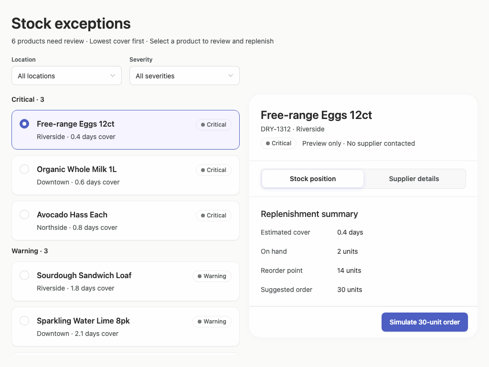

### desktop-window-1 — Select and inspect supplier

Interaction: passed.

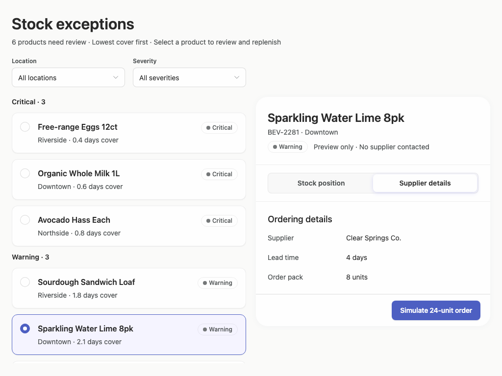

### desktop-window-2 — Simulate replenishment

Interaction: passed.

### desktop-window-3 — Filter records

Interaction: passed.

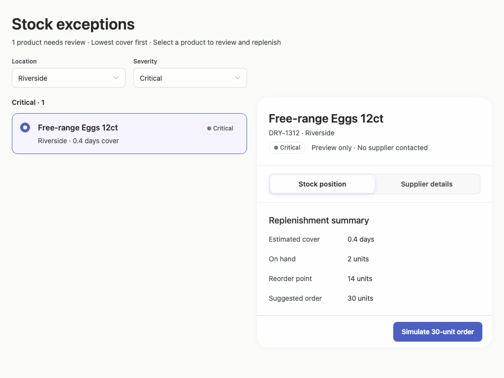

## Limitations

- Only desktop captures from 1024 to 1920 px were supplied; narrower desktop panels and window widths were not observed.
- Most interaction evidence is limited to expected-text checks. Open select menus, empty filter results, loading states, and disabled-action transitions beyond the shown simulation state were not visually assessed.
- The screenshots demonstrate a prototype but do not provide an implementation-plan artifact, so the requested plan deliverable cannot be evaluated.
- Static screenshots cannot establish persistence, authorization, supplier communication, or real replenishment behavior.
- The supplied style-adherence evidence has extremely low browser coverage, so no broad token-adherence conclusion is drawn from it.
