# stock-exceptions-readable-outcome — 2026-09-08T19:55:32.570Z

[All reports](../../README.md) · [Interactive HTML report](index.html) · [Full measurements and scoring](report.json)

GitHub renders this summary and the screenshots. Download or clone this folder to open the HTML report locally; GitHub does not serve it as a website.

**Subjective design score:** 85/100. Model: openai/gpt-5.6-sol. Rubric: 2.

**Arrusted adherence:** 100/100 (partial); evidence coverage 0.98%. Evaluator 3.

| Dimension | Conforming | Nonconforming | Unassessed | Adherence    |
| --------- | ---------- | ------------- | ---------- | ------------ |
| component | 10         | 0             | 2          | 100% (10/10) |
| api       | 25         | 0             | 12         | 100% (25/25) |
| styling   | 9          | 0             | 4410       | 100% (9/9)   |

Scores from different evaluator versions or captured states are not directly comparable.

This is the saved component-backed preview, not a new generation or a built backend. Scores are advisory and not human-calibrated.

## Ratings

| Dimension | Score | Reason |
| --- | --- | --- |
| hierarchy | 4/4 | The page establishes a clear sequence from title and review count to filters, selectable exceptions, record detail, and the replenishment action. Selected-row outlines, detail headings, tabs, and the isolated primary action make priorities immediately scannable. |
| layout | 3/4 | The two-pane master-detail composition is balanced and consistently spaced at 1440px and 1920px, with a sensible centered maximum width on wide screens. At 1024px, however, the fixed-width filter row extends across the left-list boundary and weakens alignment with the panes. |
| typography | 3/4 | Product names, section headings, labels, quantities, and units use a consistent and readable type hierarchy. Some muted 14px metadata and simulation feedback were measured at 4.47:1 against the background, making secondary information slightly less robust despite otherwise strong readability. |
| responsive | 3/4 | The composition remains usable from 1024px through 1920px: both panes stay visible, controls remain intact, the action stays accessible, and the list gains intentional vertical scrolling at the shorter window. The filter widths do not adapt cleanly to the narrower pane, and no smaller desktop window evidence was supplied. |
| productClarity | 4/4 | The task is highly understandable: users can filter by location and severity, select a clearly highlighted product, inspect stock or supplier information, and simulate a quantity-specific order. “Preview only,” “No supplier contacted,” and the post-action “no order sent” feedback clearly communicate the mock nature of the action. |

## Strengths

- The review count and “Lowest cover first” explanation provide immediate operational context.
- Each exception exposes the key comparison data—product, location, days of cover, and severity—without unnecessary detail.
- Selection is unmistakable and remains synchronized with the detail record across the supplied states.
- Stock and supplier information are separated into clearly labeled tabs while the action remains available in either view.
- The simulated replenishment state explicitly states that stock levels are unchanged and that no order was sent.
- The centered wide-screen composition avoids excessive line lengths while the 1024px version preserves both list and detail context.

## Improvements

- **medium — desktop-window-0:** At 1024px, the two 332px filters retain their wider-screen sizing even though the list pane below is only about 478px wide. The severity filter consequently straddles the list/detail column boundary, weakening the alignment of controls with the content they affect. At narrower desktop windows, fit both filters within the list column using two flexible equal-width fields, or make the filter row span and align deliberately to the full two-pane workspace.
- **medium — desktop-0:** Critical and Warning use nearly identical neutral pills and dots, so users must repeatedly read the text rather than distinguish urgency through structure. This slows severity scanning in a list intended for exception prioritization. Use supported status variants where available and reinforce severity structurally, such as grouping records under Critical and Warning headings or adding a severity icon while preserving the existing palette.
- **low — desktop-2:** The important post-action message “Order simulated. Stock levels are unchanged.” is styled like muted metadata. Automated evidence also reports the muted text at 4.47:1, narrowly below the cited threshold, so the confirmation can be easy to overlook. Present the confirmation using a supported regular body or status emphasis treatment and place it in a dedicated feedback row, without changing the authoritative palette.

## Token evidence

Percentages cover only assessed properties. Missing provenance and ambiguous CSS remain unassessed; matching literals are not proof of token usage.

| Viewport         | Category   | Token references / assessed | Coverage   |
| ---------------- | ---------- | --------------------------- | ---------- |
| desktop-0        | color      | 0/0                         | 0% (0/220) |
| desktop-0        | typography | 0/0                         | 0% (0/560) |
| desktop-0        | spacing    | 0/0                         | 0% (0/313) |
| desktop-0        | radius     | 0/0                         | 0% (0/114) |
| desktop-0        | border     | 0/0                         | 0% (0/143) |
| desktop-0        | shadow     | 0/0                         | 0% (0/120) |
| desktop-wide-0   | color      | 0/0                         | 0% (0/220) |
| desktop-wide-0   | typography | 0/0                         | 0% (0/560) |
| desktop-wide-0   | spacing    | 0/0                         | 0% (0/313) |
| desktop-wide-0   | radius     | 0/0                         | 0% (0/114) |
| desktop-wide-0   | border     | 0/0                         | 0% (0/143) |
| desktop-wide-0   | shadow     | 0/0                         | 0% (0/120) |
| desktop-window-0 | color      | 0/0                         | 0% (0/220) |
| desktop-window-0 | typography | 0/0                         | 0% (0/560) |
| desktop-window-0 | spacing    | 0/0                         | 0% (0/313) |
| desktop-window-0 | radius     | 0/0                         | 0% (0/114) |
| desktop-window-0 | border     | 0/0                         | 0% (0/143) |
| desktop-window-0 | shadow     | 0/0                         | 0% (0/120) |

## Latest-run screenshots

### desktop-0 — initial

Interaction: not-run.

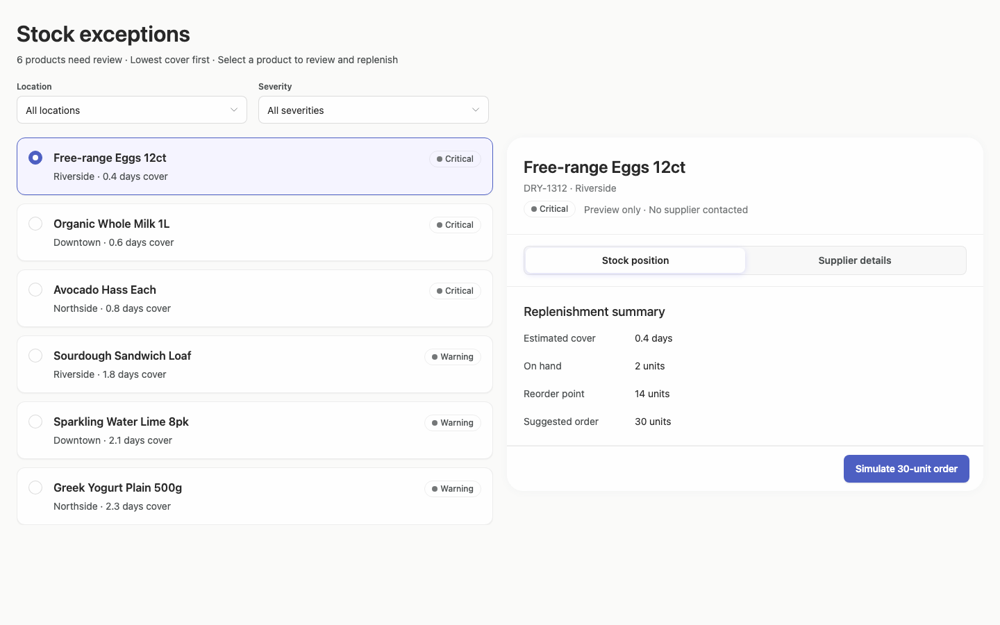

### desktop-1 — Select and inspect supplier

Interaction: passed.

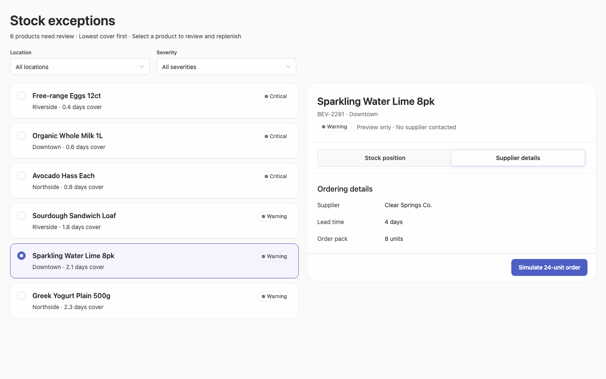

### desktop-2 — Simulate replenishment

Interaction: passed.

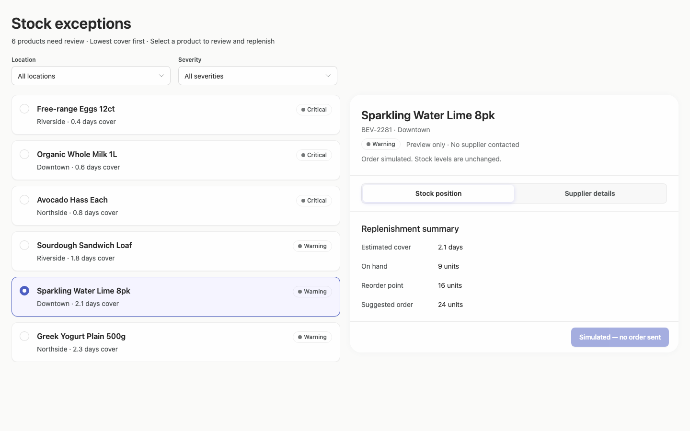

### desktop-3 — Filter records

Interaction: passed.

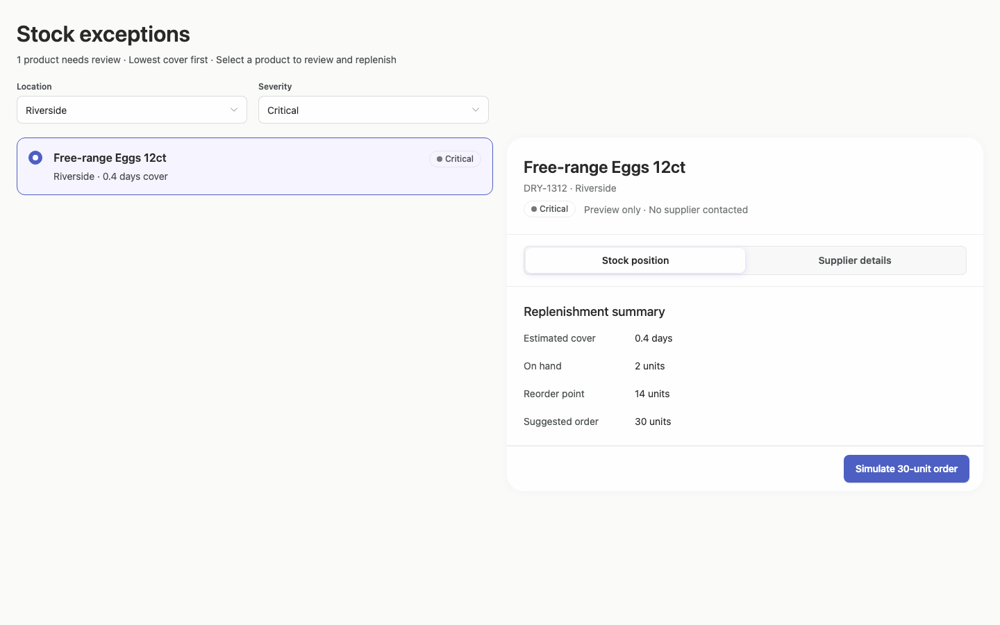

### desktop-wide-0 — initial

Interaction: not-run.

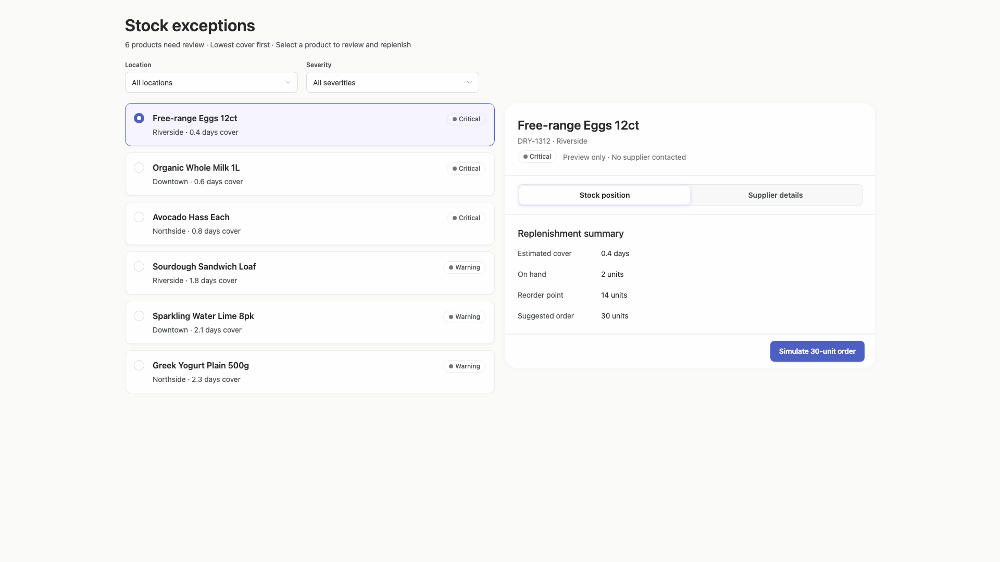

### desktop-wide-1 — Select and inspect supplier

Interaction: passed.

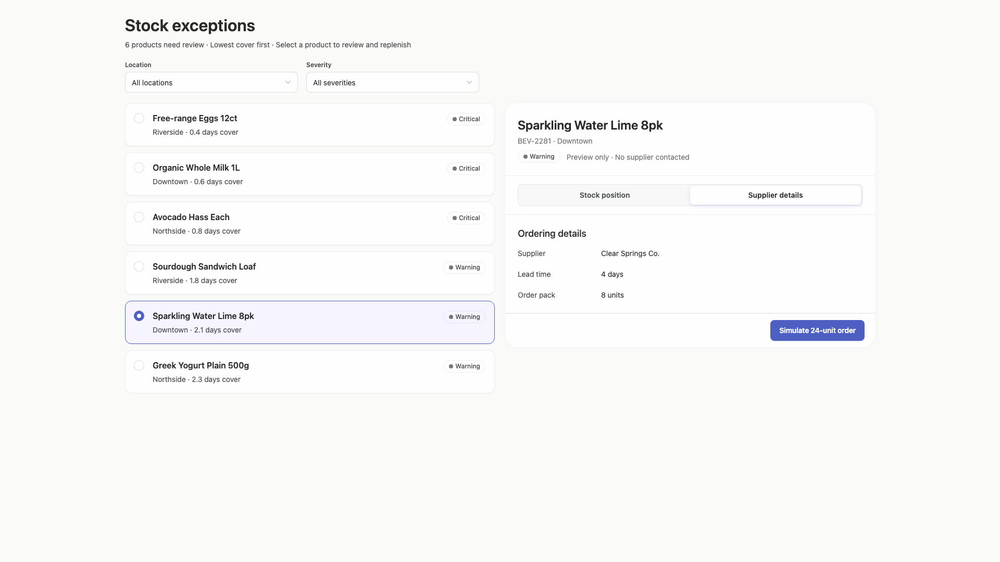

### desktop-wide-2 — Simulate replenishment

Interaction: passed.

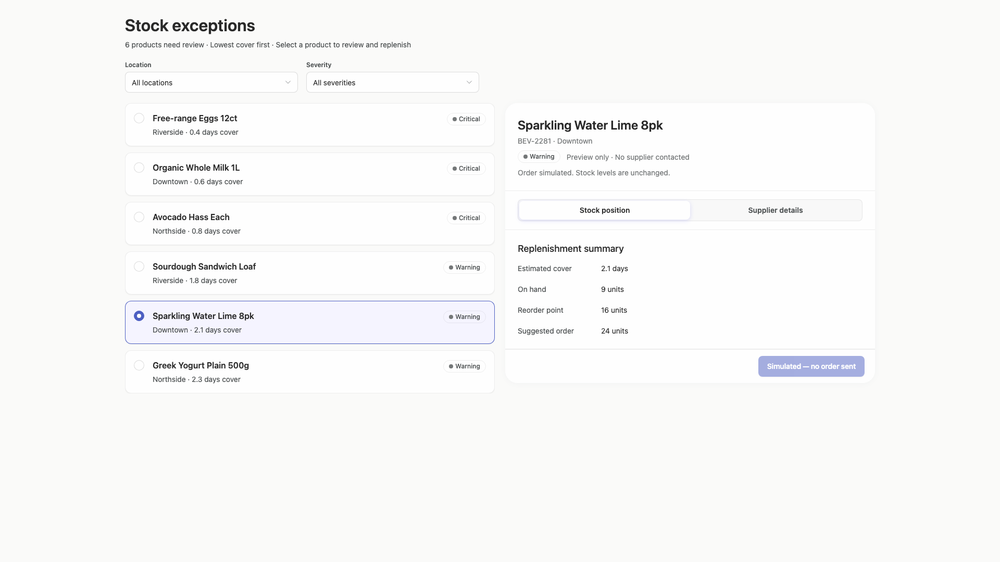

### desktop-wide-3 — Filter records

Interaction: passed.

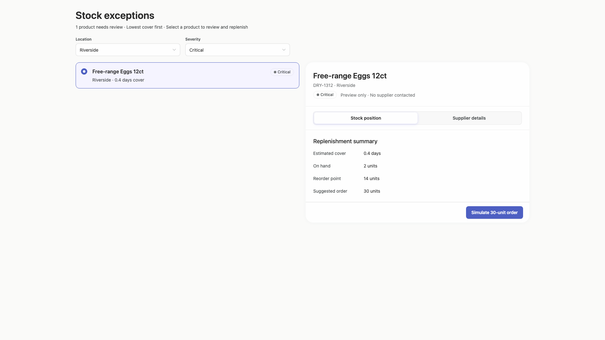

### desktop-window-0 — initial

Interaction: not-run.

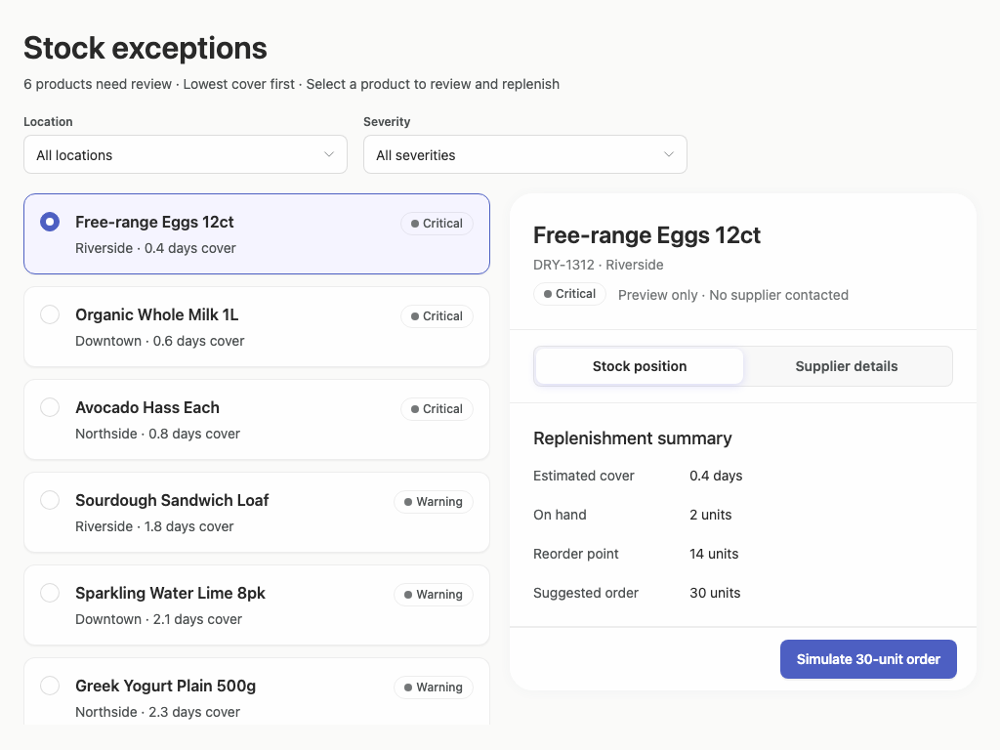

### desktop-window-1 — Select and inspect supplier

Interaction: passed.

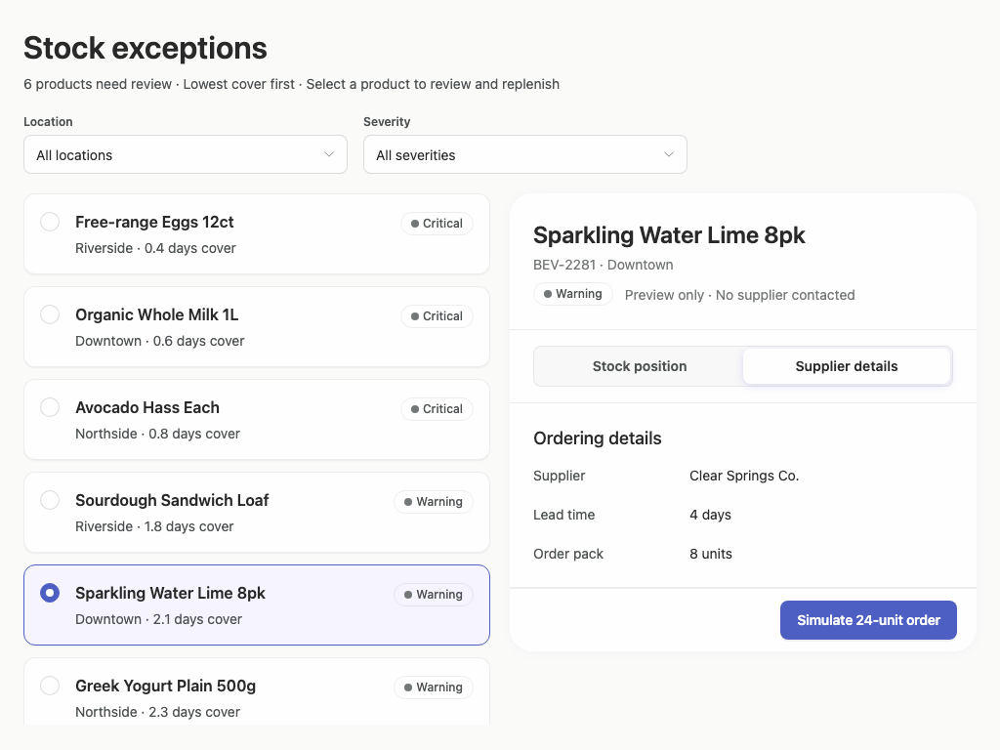

### desktop-window-2 — Simulate replenishment

Interaction: passed.

### desktop-window-3 — Filter records

Interaction: passed.

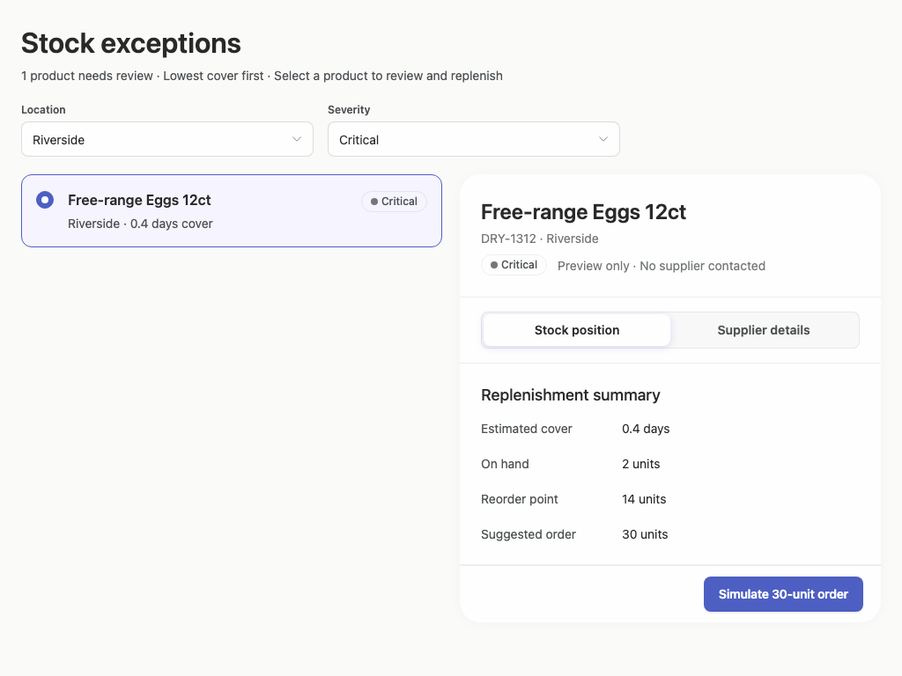

## Limitations

- Only rendered desktop windows from 1024px to 1920px were provided; no smaller desktop-panel state was observed.
- The captures show the visual prototype but no implementation-plan artifact, so the requested planning deliverable cannot be evaluated.
- Interactions passed for selection, filtering, supplier inspection, and simulation in supplied states, but screenshots do not prove persistence, backend behavior, keyboard flow, or unshown empty/error/loading states.
- Static adherence evidence has very low styling coverage and does not establish complete component provenance or rendered behavior.
