# stock-exceptions-shared-cards — 2026-09-08T19:27:15.403Z

[All reports](../../README.md) · [Interactive HTML report](index.html) · [Full measurements and scoring](report.json)

GitHub renders this summary and the screenshots. Download or clone this folder to open the HTML report locally; GitHub does not serve it as a website.

**Subjective design score:** 90/100. Model: openai/gpt-5.6-sol. Rubric: 2.

**Arrusted adherence:** 100/100 (partial); evidence coverage 0.74%. Evaluator 3.

| Dimension | Conforming | Nonconforming | Unassessed | Adherence    |
| --------- | ---------- | ------------- | ---------- | ------------ |
| component | 10         | 0             | 1          | 100% (10/10) |
| api       | 14         | 0             | 23         | 100% (14/14) |
| styling   | 9          | 0             | 4410       | 100% (9/9)   |

Scores from different evaluator versions or captured states are not directly comparable.

This is the saved component-backed preview, not a new generation or a built backend. Scores are advisory and not human-calibrated.

## Ratings

| Dimension      | Score | Reason                                                                                                                                                                                                                                                                                                                                                                                                      |
| -------------- | ----- | ----------------------------------------------------------------------------------------------------------------------------------------------------------------------------------------------------------------------------------------------------------------------------------------------------------------------------------------------------------------------------------------------------------- |
| hierarchy      | 4/4   | The page establishes a clear sequence from title and review count to filters, selectable exceptions, record details, and the replenishment action. Selected-row treatment, section headings, tabs, and the consistently bottom-right primary action make priorities immediately scannable across all shown states.                                                                                          |
| layout         | 4/4   | The master-detail composition is consistently aligned, with filters matching the list width, regular row spacing, and clearly grouped detail sections. At 1024px the balanced two-column layout remains usable, while the 1920px view uses a centered content boundary rather than stretching records excessively.                                                                                          |
| typography     | 3/4   | Product names, headings, field labels, and values use a consistent and readable typographic hierarchy. However, the small colored Critical, Warning, and mock-status pill text is visually faint; supplied checks repeatedly report contrast around 2.5–3.2:1 for these labels.                                                                                                                             |
| responsive     | 3/4   | Across the provided desktop widths of 1024, 1440, and 1920px, controls remain visible without horizontal overflow, the split view stays coherent, and the 1024px exception list uses contained vertical scrolling. Evidence does not cover narrower desktop panels, so behavior beyond the tested range is uncertain.                                                                                       |
| productClarity | 4/4   | The interface clearly communicates the inventory-review task through location and severity filters, days-of-cover summaries, explicit selection, stock and supplier tabs, suggested quantities, and action labels such as “Simulate 24-unit order.” Preview-only messaging and the post-action “Mock order created”/“no order sent” feedback make the non-production nature of the action especially clear. |

## Strengths

- The selected exception is unmistakable through the radio indicator, outlined selected surface, and synchronized detail title.
- Location, severity, days of cover, SKU, on-hand quantity, reorder point, suggested order, supplier, lead time, and pack size provide relevant review context without excessive density.
- Filtering updates both the result count and visible records while retaining a coherent selected detail state.
- Supplier inspection and replenishment simulation are represented in the captured interaction states, and the reported interaction checks passed.
- The mock action uses explicit safety language before and after activation, reducing the chance it will be mistaken for a real supplier order.
- The centered maximum-width composition makes the 1920px version readable, while the 1024px version preserves both list and detail context.

## Improvements

- **medium — desktop-0:** The Critical and Warning labels use small colored text on light surfaces. Their repeated visual prominence is weakened, and the supplied accessibility checks identify insufficient contrast for these status labels. Keep the authoritative palette, but use a supported status-pill variant with stronger text emphasis or place the severity word in adjacent standard text while retaining the colored pill as a redundant status cue.
- **medium — desktop-2:** After simulation, the detail header replaces the selected product’s Warning badge with “Mock order created,” while the list continues to label the same item Warning. This mixes exception severity and action outcome in one status position and makes the detail header less consistent with the source record. Retain the Warning severity pill in the header and add “Mock order created” as a separate outcome pill or activity message, so inventory severity and simulation state remain simultaneously visible.

## Token evidence

Percentages cover only assessed properties. Missing provenance and ambiguous CSS remain unassessed; matching literals are not proof of token usage.

| Viewport         | Category   | Token references / assessed | Coverage   |
| ---------------- | ---------- | --------------------------- | ---------- |
| desktop-0        | color      | 0/0                         | 0% (0/220) |
| desktop-0        | typography | 0/0                         | 0% (0/560) |
| desktop-0        | spacing    | 0/0                         | 0% (0/313) |
| desktop-0        | radius     | 0/0                         | 0% (0/114) |
| desktop-0        | border     | 0/0                         | 0% (0/143) |
| desktop-0        | shadow     | 0/0                         | 0% (0/120) |
| desktop-wide-0   | color      | 0/0                         | 0% (0/220) |
| desktop-wide-0   | typography | 0/0                         | 0% (0/560) |
| desktop-wide-0   | spacing    | 0/0                         | 0% (0/313) |
| desktop-wide-0   | radius     | 0/0                         | 0% (0/114) |
| desktop-wide-0   | border     | 0/0                         | 0% (0/143) |
| desktop-wide-0   | shadow     | 0/0                         | 0% (0/120) |
| desktop-window-0 | color      | 0/0                         | 0% (0/220) |
| desktop-window-0 | typography | 0/0                         | 0% (0/560) |
| desktop-window-0 | spacing    | 0/0                         | 0% (0/313) |
| desktop-window-0 | radius     | 0/0                         | 0% (0/114) |
| desktop-window-0 | border     | 0/0                         | 0% (0/143) |
| desktop-window-0 | shadow     | 0/0                         | 0% (0/120) |

## Latest-run screenshots

### desktop-0 — initial

Interaction: not-run.

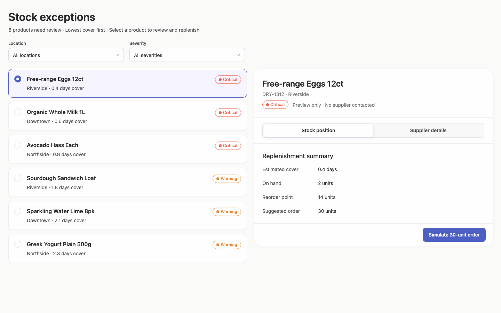

### desktop-1 — Select and inspect supplier

Interaction: passed.

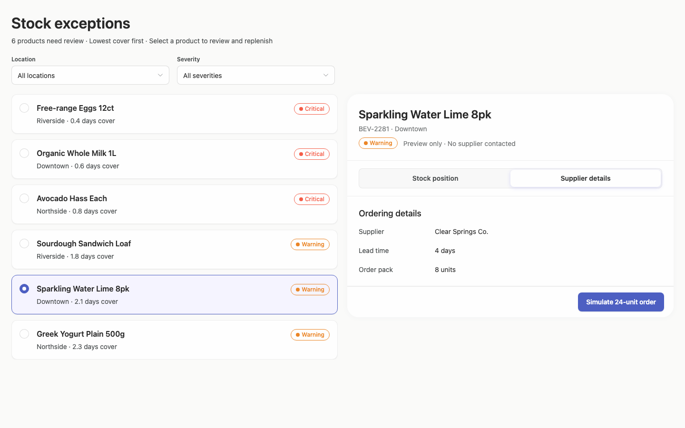

### desktop-2 — Simulate replenishment

Interaction: passed.

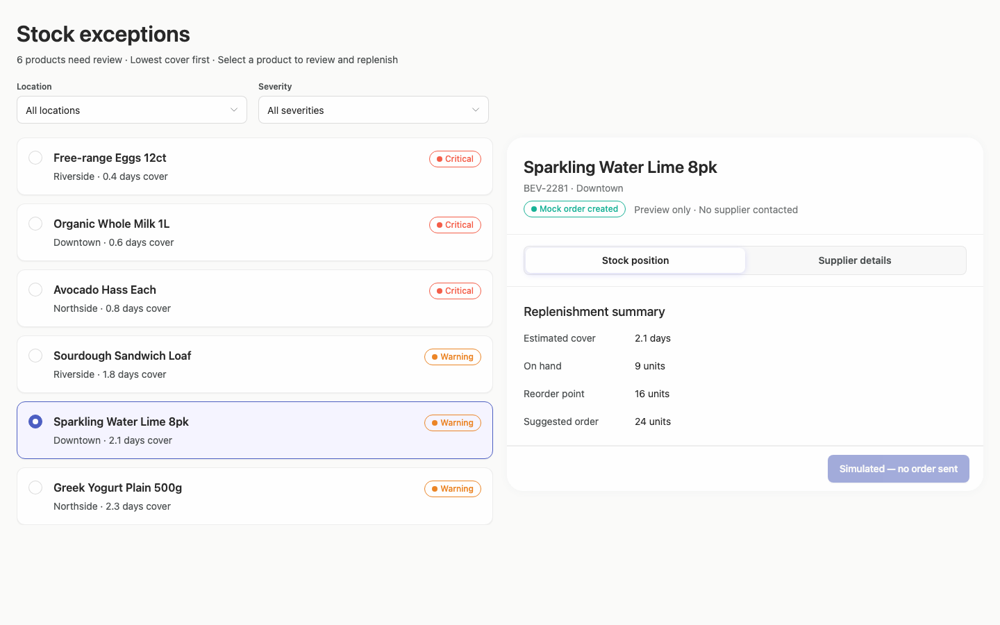

### desktop-3 — Filter records

Interaction: passed.

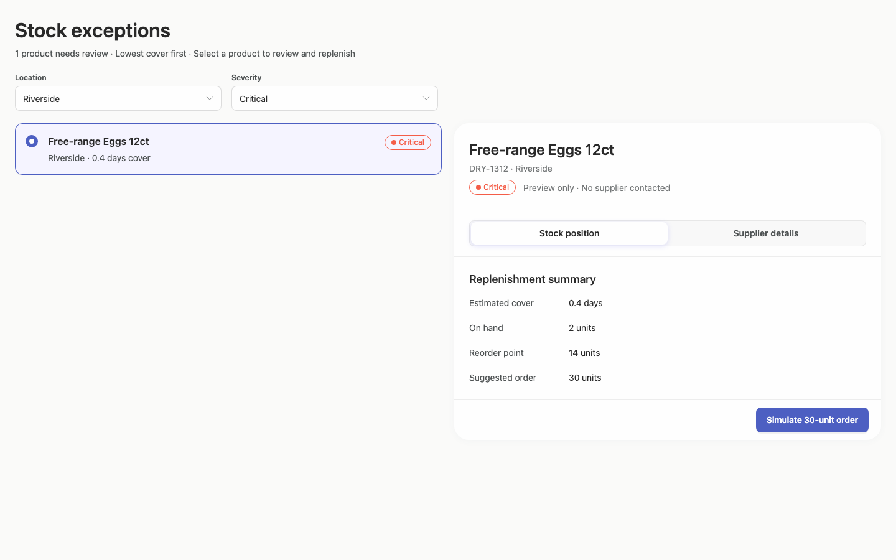

### desktop-wide-0 — initial

Interaction: not-run.

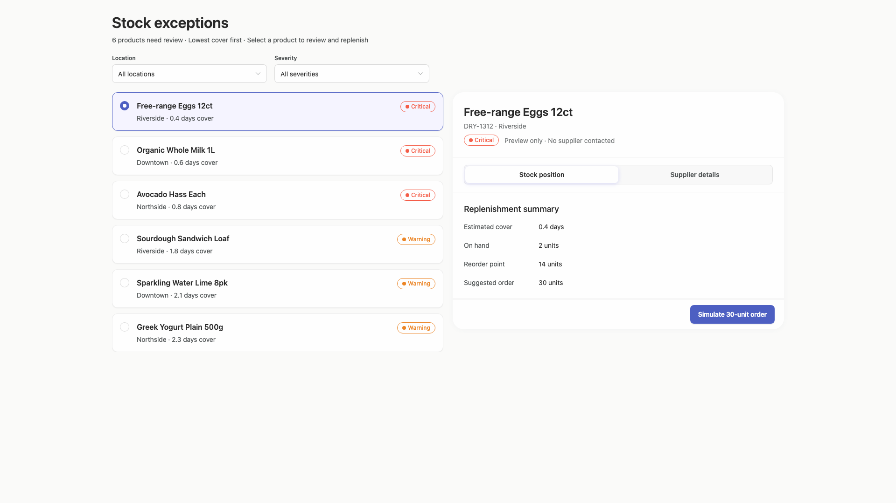

### desktop-wide-1 — Select and inspect supplier

Interaction: passed.

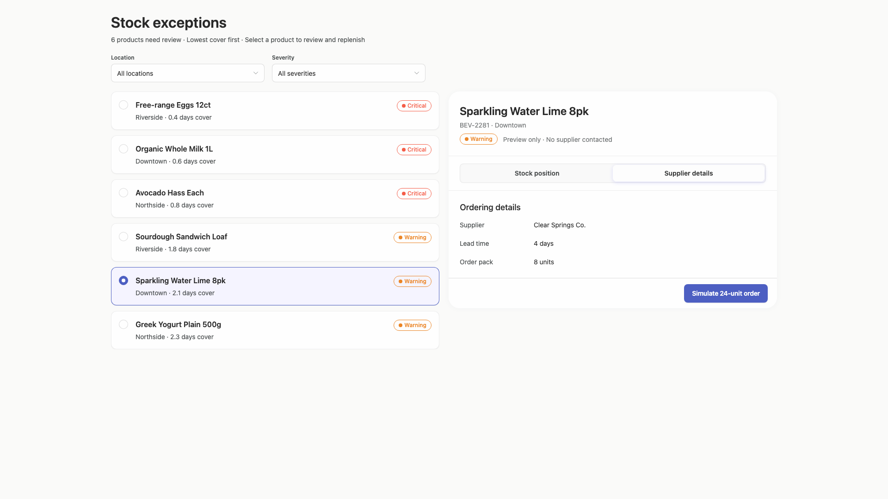

### desktop-wide-2 — Simulate replenishment

Interaction: passed.

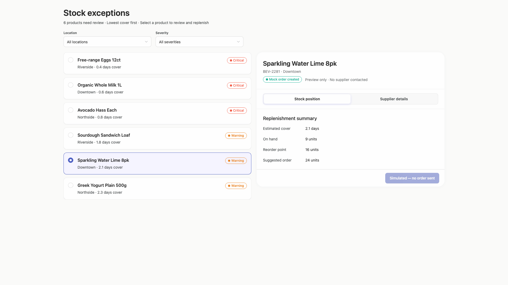

### desktop-wide-3 — Filter records

Interaction: passed.

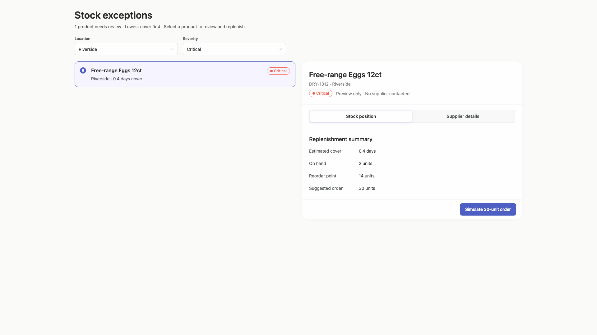

### desktop-window-0 — initial

Interaction: not-run.

### desktop-window-1 — Select and inspect supplier

Interaction: passed.

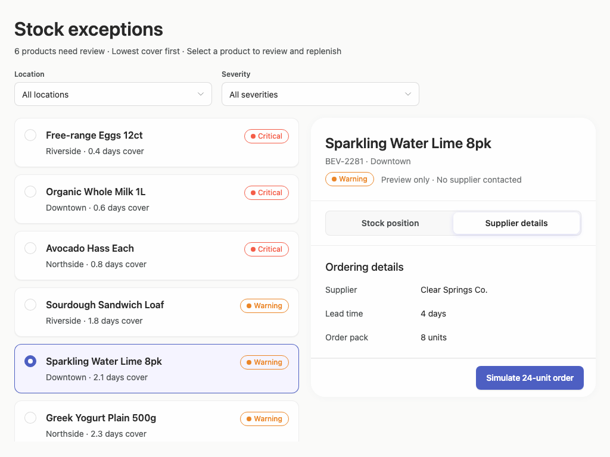

### desktop-window-2 — Simulate replenishment

Interaction: passed.

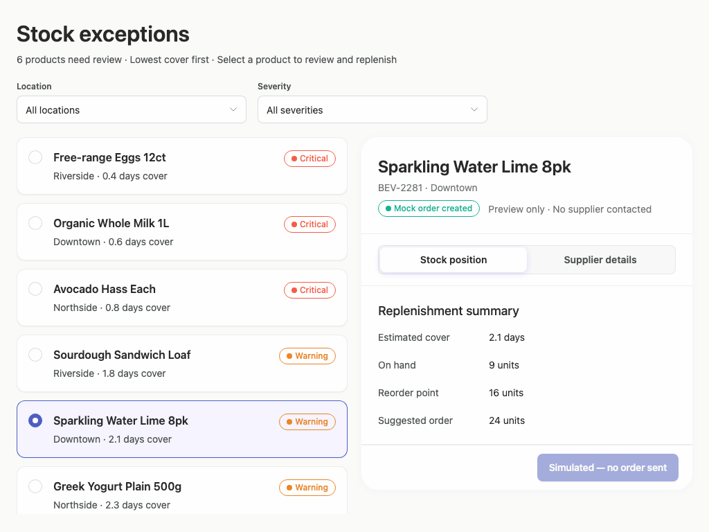

### desktop-window-3 — Filter records

Interaction: passed.

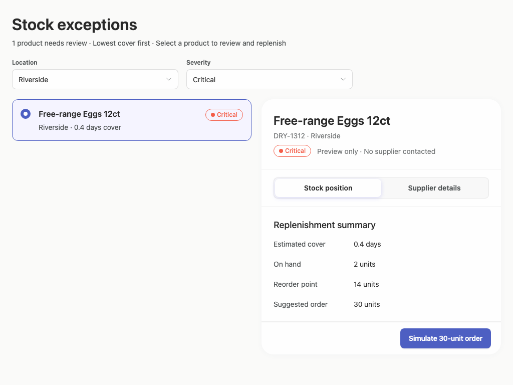

## Limitations

- Only desktop windows from 1024px to 1920px are shown; narrower desktop panels and alternate panel arrangements were not tested.
- Initial-state interactions were not run, although the supplier, filter, and simulation flows report passing interaction checks.
- Screenshots cannot verify keyboard behavior, focus progression, loading, empty results, error handling, or persistence.
- No implementation-plan artifact is included in the visual evidence, so its quality or completeness cannot be assessed.
- Token and component adherence evidence is conservative and incomplete, particularly for rendered styling; it is not used as a visual-quality percentage.
