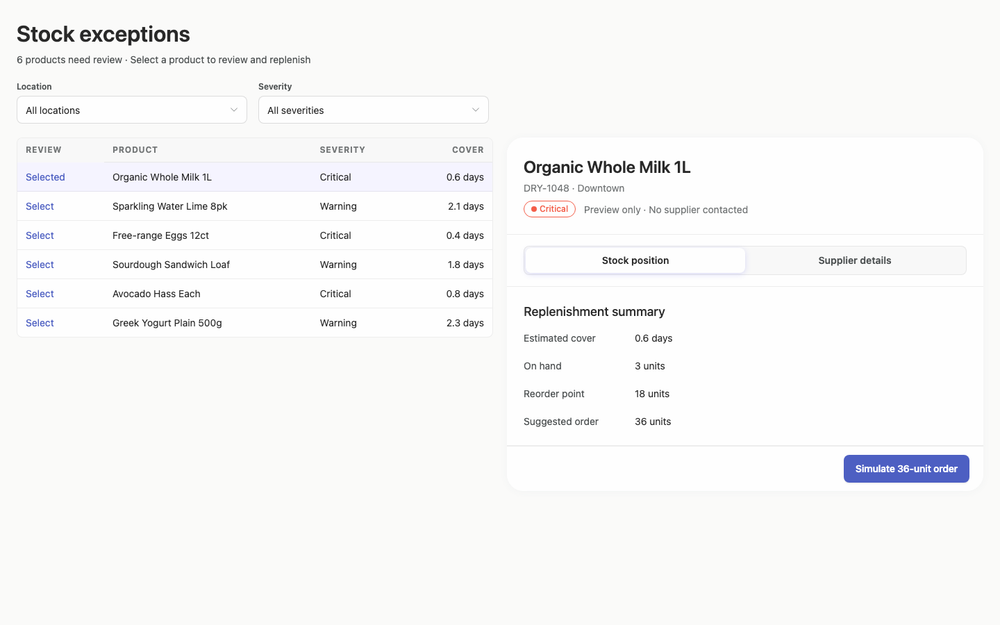
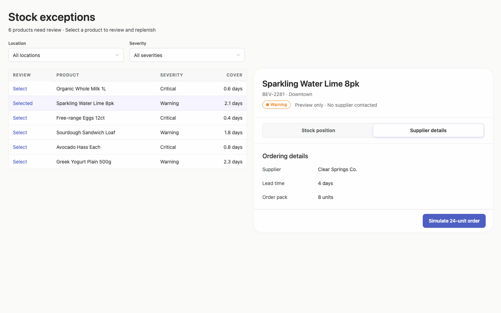
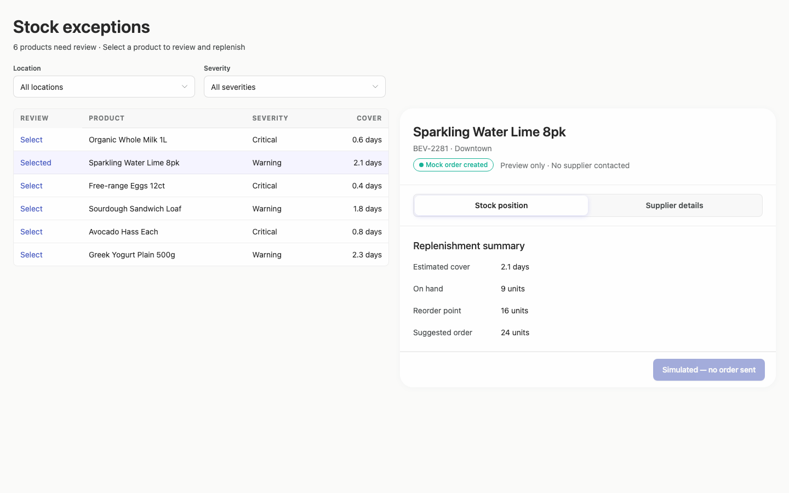
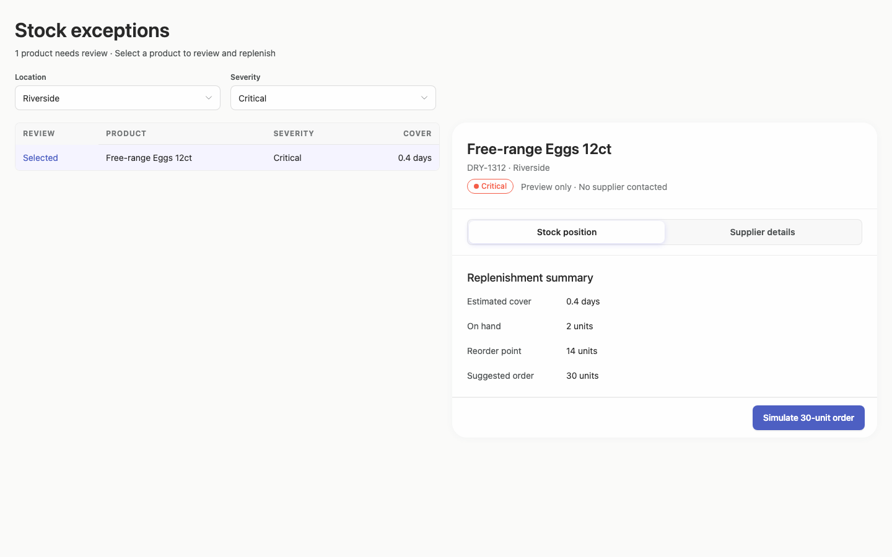
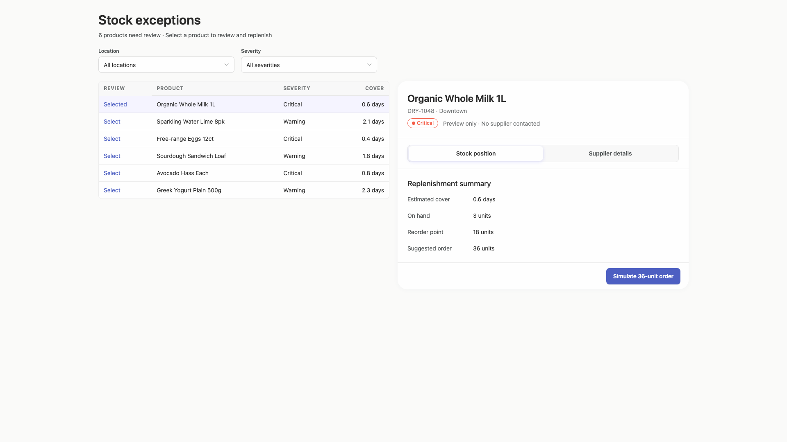
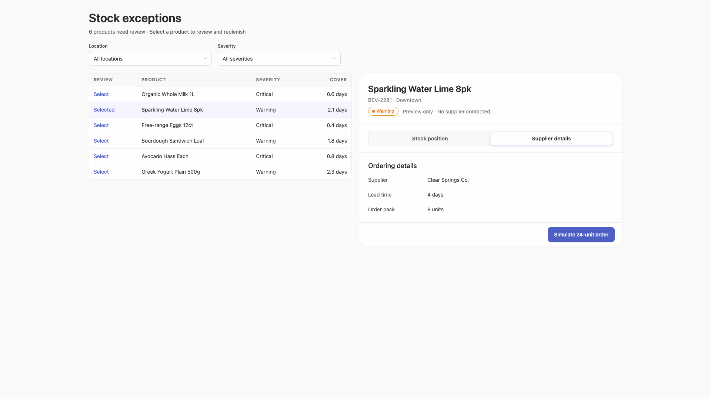
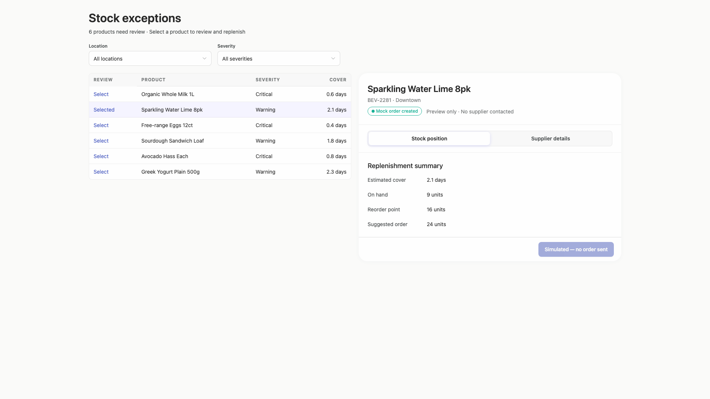
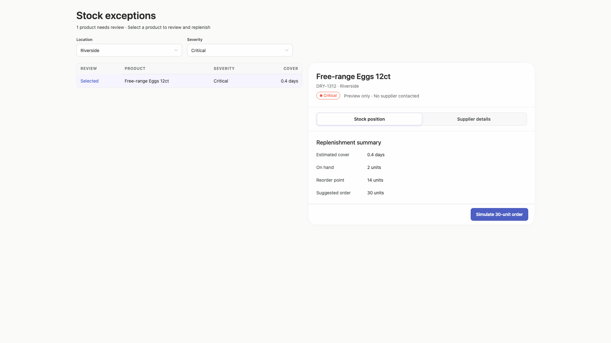
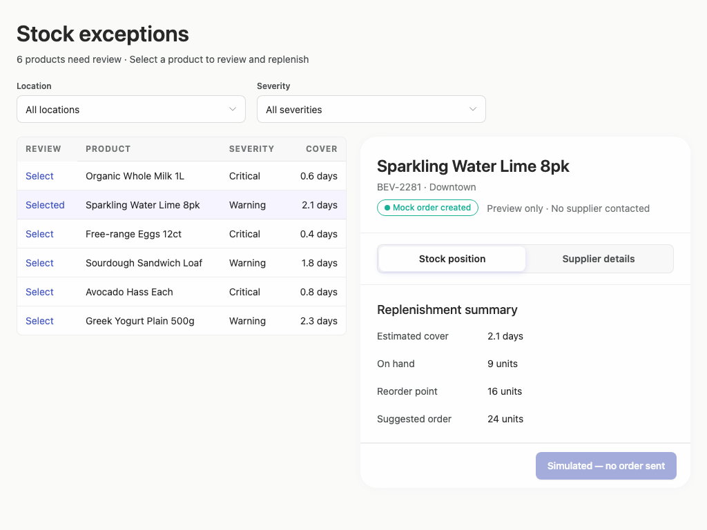
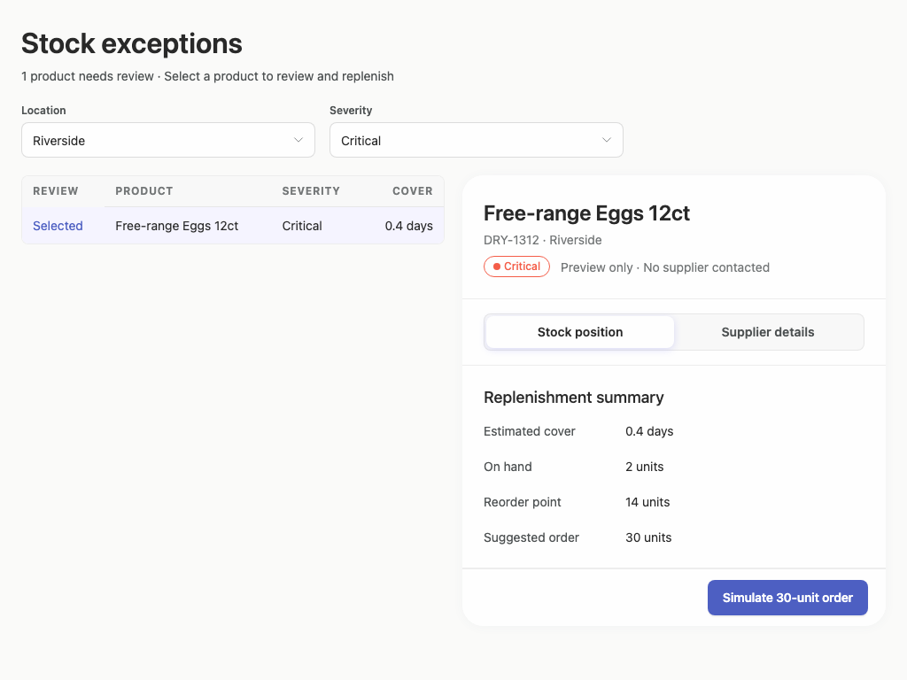

# stock-exceptions-tabbed-detail — 2026-09-08T19:18:19.290Z

[All reports](../../README.md) · [Interactive HTML report](index.html) · [Full measurements and scoring](report.json)

GitHub renders this summary and the screenshots. Download or clone this folder to open the HTML report locally; GitHub does not serve it as a website.

**Subjective design score:** 80/100. Model: openai/gpt-5.6-sol. Rubric: 2.

**Arrusted adherence:** 100/100 (partial); evidence coverage 0.69%. Evaluator 3.

| Dimension | Conforming | Nonconforming | Unassessed | Adherence    |
| --------- | ---------- | ------------- | ---------- | ------------ |
| component | 9          | 0             | 1          | 100% (9/9)   |
| api       | 13         | 0             | 20         | 100% (13/13) |
| styling   | 8          | 0             | 4269       | 100% (8/8)   |

Scores from different evaluator versions or captured states are not directly comparable.

This is the saved component-backed preview, not a new generation or a built backend. Scores are advisory and not human-calibrated.

## Ratings

| Dimension | Score | Reason |
| --- | --- | --- |
| hierarchy | 3/4 | The page establishes a clear title, filter, exception-list, and selected-detail sequence. Row tint, the detail heading, tabs, and the primary mock action make the current focus easy to follow, although critical items are not strongly prioritized within the list because severity is presented as ordinary body text. |
| layout | 3/4 | The two-column master-detail composition is consistently aligned and comfortably spaced at 1920, 1440, and 1024 pixels. Filters align with the list and the action remains visible, but the dedicated Review column uses valuable list width for repetitive Select labels rather than inventory evidence. |
| typography | 3/4 | Heading levels, field labels, table text, and detail values are visually consistent and readable. The 12px uppercase table headers and compact status labels are comparatively faint; supplied checks also flag marginal header and status-text contrast, so these elements have less legibility than the main content. |
| responsive | 3/4 | The composition remains usable without documented overflow at all supplied desktop widths, including the 1024px window where the table, tabs, details, and action remain visible. The narrower view becomes dense, and no capture below 1024px or constrained desktop panel state was supplied, so further adaptation cannot be confirmed. |
| productClarity | 4/4 | The task is immediately understandable: filter exceptions, select a product, inspect stock or supplier data, and run a clearly labeled simulation. Product identity, location, severity, order quantity, preview-only context, and the post-action 'no order sent' state make the prototype's non-production behavior explicit. |

## Strengths

- The location and severity filters are prominent, plainly labeled, and update the visible result count.
- Selection is carried consistently from the highlighted list row into the product title, metadata, status, and suggested order.
- Stock position and supplier details are separated into two concise tabs rather than being mixed into one dense panel.
- The mock replenishment action includes the recommended quantity and gives persistent confirmation that no real order was sent.
- The centered maximum-width layout remains orderly on wide displays while preserving a useful side-by-side workflow at 1024px.

## Improvements

- **medium — desktop-0:** A dedicated Review column repeats Select or Selected in every row, making users scan an action label before the more meaningful product identity and consuming scarce width in the 1024px composition. Use the supported table selection treatment to make the row or product cell the primary selection affordance while retaining the selected-row tint. If the column must remain, rename it Action so its purpose is explicit.
- **medium — desktop-0:** Critical and Warning values use the same ordinary text treatment, so severity—the main triage signal—is less scannable than the detail-panel status pill. Use the existing supported StatusPill or Tag variant in the severity cells, preserving the Arrusted palette, so critical exceptions can be distinguished during rapid list scanning.
- **low — desktop-0:** The compact uppercase table headers are visually faint. Supplied accessibility evidence reports approximately 4.25:1 contrast for these 12px labels, just below the cited threshold, which may reduce readability despite the otherwise clear typography. Use a supported regular-density table or stronger header typography variant, such as increased size or weight, without overriding the authoritative Arrusted colors.

## Token evidence

Percentages cover only assessed properties. Missing provenance and ambiguous CSS remain unassessed; matching literals are not proof of token usage.

| Viewport         | Category   | Token references / assessed | Coverage   |
| ---------------- | ---------- | --------------------------- | ---------- |
| desktop-0        | color      | 0/0                         | 0% (0/233) |
| desktop-0        | typography | 0/0                         | 0% (0/560) |
| desktop-0        | spacing    | 0/0                         | 0% (0/265) |
| desktop-0        | radius     | 0/0                         | 0% (0/120) |
| desktop-0        | border     | 0/0                         | 0% (0/125) |
| desktop-0        | shadow     | 0/0                         | 0% (0/120) |
| desktop-wide-0   | color      | 0/0                         | 0% (0/233) |
| desktop-wide-0   | typography | 0/0                         | 0% (0/560) |
| desktop-wide-0   | spacing    | 0/0                         | 0% (0/265) |
| desktop-wide-0   | radius     | 0/0                         | 0% (0/120) |
| desktop-wide-0   | border     | 0/0                         | 0% (0/125) |
| desktop-wide-0   | shadow     | 0/0                         | 0% (0/120) |
| desktop-window-0 | color      | 0/0                         | 0% (0/233) |
| desktop-window-0 | typography | 0/0                         | 0% (0/560) |
| desktop-window-0 | spacing    | 0/0                         | 0% (0/265) |
| desktop-window-0 | radius     | 0/0                         | 0% (0/120) |
| desktop-window-0 | border     | 0/0                         | 0% (0/125) |
| desktop-window-0 | shadow     | 0/0                         | 0% (0/120) |

## Latest-run screenshots

### desktop-0 — initial

Interaction: not-run.

### desktop-1 — Select and inspect supplier

Interaction: passed.

### desktop-2 — Simulate replenishment

Interaction: passed.

### desktop-3 — Filter records

Interaction: passed.

### desktop-wide-0 — initial

Interaction: not-run.

### desktop-wide-1 — Select and inspect supplier

Interaction: passed.

### desktop-wide-2 — Simulate replenishment

Interaction: passed.

### desktop-wide-3 — Filter records

Interaction: passed.

### desktop-window-0 — initial

Interaction: not-run.

### desktop-window-1 — Select and inspect supplier

Interaction: passed.

### desktop-window-2 — Simulate replenishment

Interaction: passed.

### desktop-window-3 — Filter records

Interaction: passed.

## Limitations

- Only static screenshots at 1024px, 1440px, and 1920px were supplied; narrower desktop windows, constrained panels, scrolling, empty results, loading, and long-content behavior were not shown.
- The brief requests an implementation plan, but no plan artifact is visible in the evidence, so its completeness cannot be evaluated.
- Passed scripted states demonstrate visible supplier, filtering, and simulation outcomes only; they do not establish backend behavior, persistence, authorization, or publication status.
- Static source and adherence evidence is incomplete and does not prove every referenced component or dynamic branch rendered.
