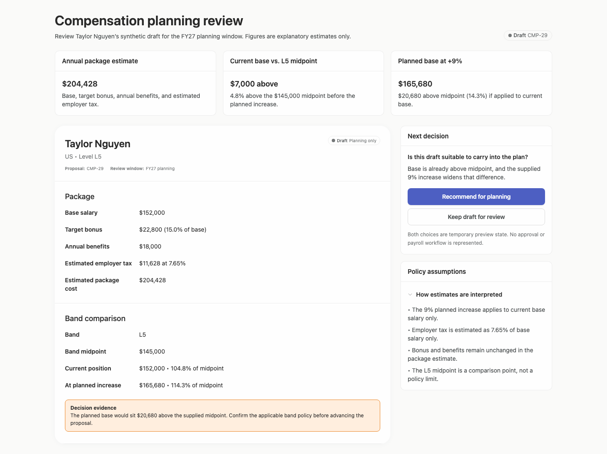
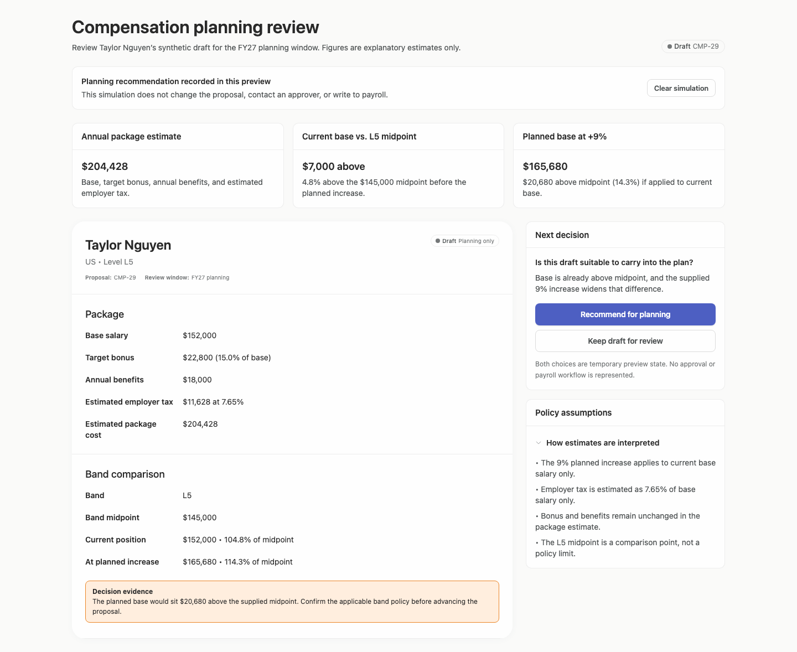
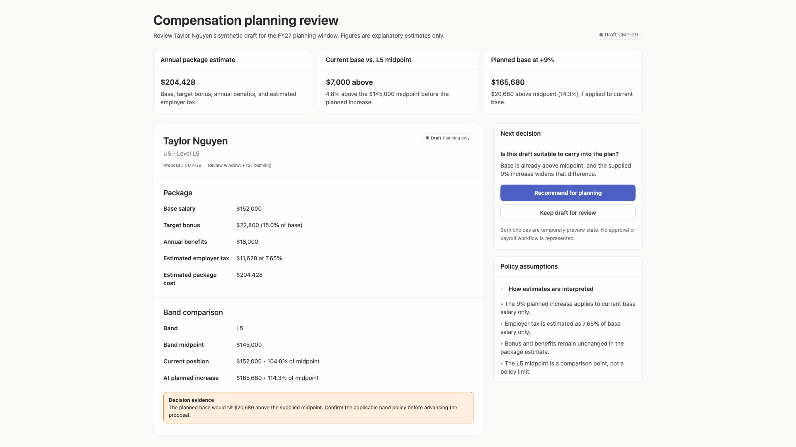
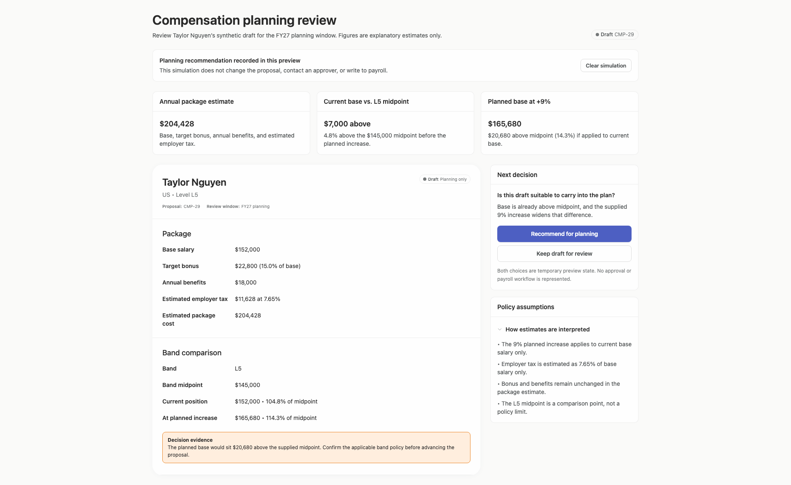
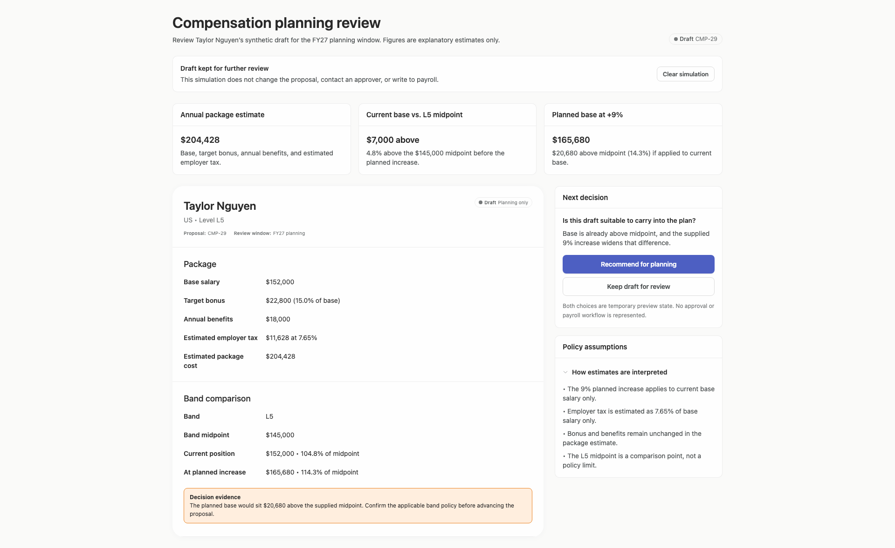
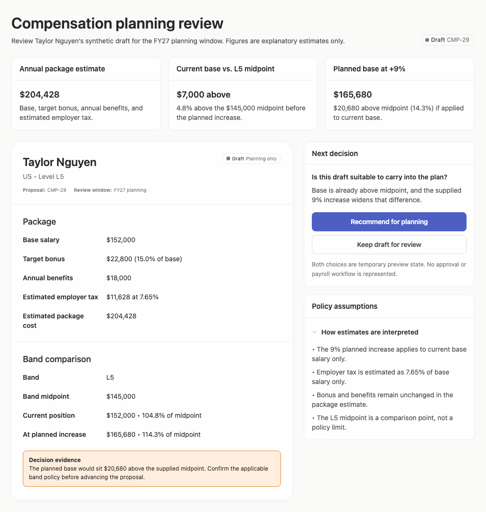
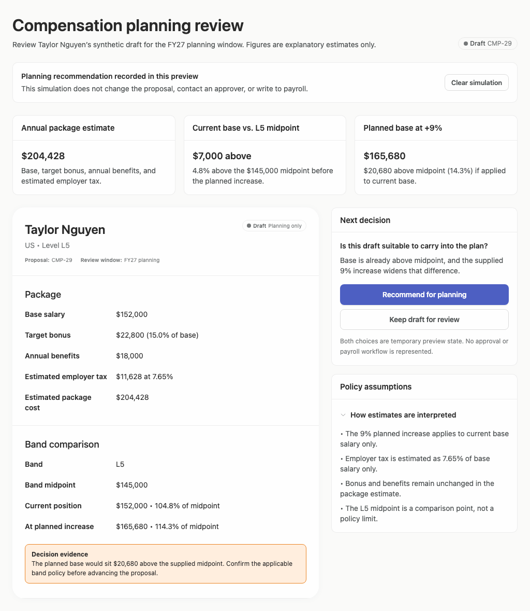
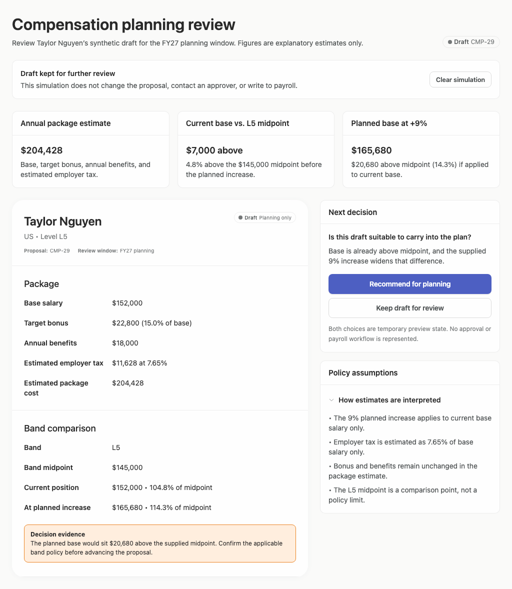

# compensation-planning — 2026-09-09T13:13:05.302Z

[All reports](../../README.md) · [Interactive HTML report](index.html) · [Full measurements and scoring](report.json)

GitHub renders this summary and the screenshots. Download or clone this folder to open the HTML report locally; GitHub does not serve it as a website.

**Subjective design score:** 75/100. Model: openai/gpt-5.6-sol. Rubric: 2.

**Arrusted adherence:** 100/100 (partial); evidence coverage 2.22%. Evaluator 3.

| Dimension | Conforming | Nonconforming | Unassessed | Adherence    |
| --------- | ---------- | ------------- | ---------- | ------------ |
| component | 29         | 0             | 1          | 100% (29/29) |
| api       | 55         | 0             | 5          | 100% (55/55) |
| styling   | 18         | 0             | 4482       | 100% (18/18) |

Scores from different evaluator versions or captured states are not directly comparable.

This report evaluates the captured preview; evaluation itself does not regenerate the app or prove a built backend. Scores are advisory and not human-calibrated.

## Ratings

| Dimension | Score | Reason |
| --- | --- | --- |
| hierarchy | 3/4 | The title, three summary cards, employee record, decision panel, and assumptions form a clear scan path, with the planned-base comparison receiving useful prominence. However, the most explicit warning to confirm band policy sits near the bottom of the record while the decision controls appear much earlier, and a completed hold simulation leaves the opposite recommendation action visually dominant. |
| layout | 3/4 | Alignment and spacing are consistent across the KPI row, main record, and sidebar, and the centered maximum-width composition remains orderly at 1024, 1440, and 1920 pixels. The wide record uses considerable horizontal and vertical space for short label-value lists, but this does not prevent use or comprehension. |
| typography | 3/4 | Headings, monetary values, labels, and explanatory copy are visually consistent and generally easy to read. Very small proposal metadata, status text, and supporting captions are comparatively faint and harder to scan; automated evidence also flags several muted 10–14 px text instances as marginal contrast, so increasing supported type size or emphasis would help without changing the authoritative palette. |
| responsive | 4/4 | Across the supplied 1024, 1440, and 1920 desktop captures, the three summaries and two-column review composition remain aligned, text wraps cleanly, buttons remain fully usable, and no clipping or horizontal overflow is reported. The longer simulated states add normal document scrolling rather than introducing an unusable internal scroll area. |
| productClarity | 2/4 | The interface clearly identifies the content as a synthetic draft, exposes base, bonus, benefits, employer tax, band midpoint, assumptions, and a non-approval planning choice. A notable ambiguity remains: the $204,428 annual package appears based on the current $152,000 base, while the proposed +9% base is shown separately without a corresponding planned employer-tax or total-package estimate, making the complete proposed package difficult to assess. Completed simulations are explained, but the local decision controls do not show which choice is currently recorded. |

## Strengths

- Repeated language such as “synthetic draft,” “explanatory estimates,” “planning only,” and “no approval or payroll workflow” appropriately avoids presenting the proposal as payroll truth.
- The package section includes base salary, target bonus with percentage context, annual benefits, employer tax with rate, and an estimated total.
- Band comparison shows both dollars and percentage of midpoint for current and planned positions, making the central compensation concern readily understandable.
- Policy assumptions explicitly state what changes, what remains unchanged, how employer tax is estimated, and that midpoint is a comparison point rather than a policy limit.
- Simulation banners provide immediate feedback and explicitly state that the interaction does not contact an approver or write to payroll.

## Improvements

- **high — desktop-0:** The KPI row juxtaposes an “Annual package estimate” of $204,428 with a planned base of $165,680, but does not identify the package estimate as current or provide the planned employer-tax and total-package context. Because $204,428 matches the current base breakdown, a reviewer could mistake it for the proposed package total. Label the existing figure explicitly as “Current annual package estimate” and add a clearly qualified planned-package estimate or breakdown showing planned base, unchanged bonus and benefits, revised estimated employer tax, and resulting estimated total. Continue labeling all figures as planning estimates rather than payroll calculations.
- **medium — desktop-2:** After “Draft kept for further review” is recorded, the decision panel still gives “Recommend for planning” the strongest visual emphasis and provides no local selected-state indication. The banner resolves the state only if the reviewer looks back to the top, while the action area visually suggests the opposite outcome. Reflect the simulated choice inside the decision panel using a selected decision option, status label, or disabled/relabelled controls. Ensure the recorded hold choice—not the opposite recommendation—has the clearest local state until the simulation is cleared.
- **medium — desktop-window-0:** The strongest instruction—confirm the applicable band policy before advancing—is placed near the bottom of the document, below decision controls that begin around y=298 and outside the 768 px initial viewport. A reviewer can reach the decision before encountering this explicit qualification. Move or summarize this critical decision evidence next to the planned-base summary or within the “Next decision” card. The detailed evidence can remain in the record, but the policy-confirmation requirement should precede the actions in the primary scan path.
- **low — desktop-window-0:** Proposal and review-window metadata are rendered at a very small size relative to nearby body text, making useful record context easy to overlook. Similar small muted captions are also flagged by the supplied accessibility evidence as marginally readable. Use a supported larger caption or compact body treatment, with clearer label-value grouping or weight, while retaining the existing semantic palette.

## Token evidence

Percentages cover only assessed properties. Missing provenance and ambiguous CSS remain unassessed; matching literals are not proof of token usage.

| Viewport         | Category   | Token references / assessed | Coverage   |
| ---------------- | ---------- | --------------------------- | ---------- |
| desktop-0        | color      | 0/0                         | 0% (0/237) |
| desktop-0        | typography | 0/0                         | 0% (0/600) |
| desktop-0        | spacing    | 0/0                         | 0% (0/287) |
| desktop-0        | radius     | 0/0                         | 0% (0/120) |
| desktop-0        | border     | 0/0                         | 0% (0/130) |
| desktop-0        | shadow     | 0/0                         | 0% (0/120) |
| desktop-wide-0   | color      | 0/0                         | 0% (0/237) |
| desktop-wide-0   | typography | 0/0                         | 0% (0/600) |
| desktop-wide-0   | spacing    | 0/0                         | 0% (0/287) |
| desktop-wide-0   | radius     | 0/0                         | 0% (0/120) |
| desktop-wide-0   | border     | 0/0                         | 0% (0/130) |
| desktop-wide-0   | shadow     | 0/0                         | 0% (0/120) |
| desktop-window-0 | color      | 0/0                         | 0% (0/237) |
| desktop-window-0 | typography | 0/0                         | 0% (0/600) |
| desktop-window-0 | spacing    | 0/0                         | 0% (0/287) |
| desktop-window-0 | radius     | 0/0                         | 0% (0/120) |
| desktop-window-0 | border     | 0/0                         | 0% (0/130) |
| desktop-window-0 | shadow     | 0/0                         | 0% (0/120) |

## Latest-run screenshots

### desktop-0 — initial

Interaction: not-run.

### desktop-1 — recommend the draft for planning

Interaction: passed.

### desktop-2 — hold the draft for further review

Interaction: passed.

### desktop-wide-0 — initial

Interaction: not-run.

### desktop-wide-1 — recommend the draft for planning

Interaction: passed.

### desktop-wide-2 — hold the draft for further review

Interaction: passed.

### desktop-window-0 — initial

Interaction: not-run.

### desktop-window-1 — recommend the draft for planning

Interaction: passed.

### desktop-window-2 — hold the draft for further review

Interaction: passed.

## Limitations

- Evaluation is based on static desktop captures at 1024, 1440, and 1920 pixels; narrower desktop panels and intermediate widths were not shown.
- The screenshots demonstrate visual confirmation states, but they do not establish persistence, authorization, payroll calculation, approval behavior, keyboard behavior, or backend effects.
- Collapsed policy-assumption behavior was not shown, and the supplied interaction evidence only confirms expected response text for the two simulation actions.
- Styling provenance is largely unassessed in the supplied adherence evidence; this review therefore does not claim comprehensive Arrusted token adherence.
