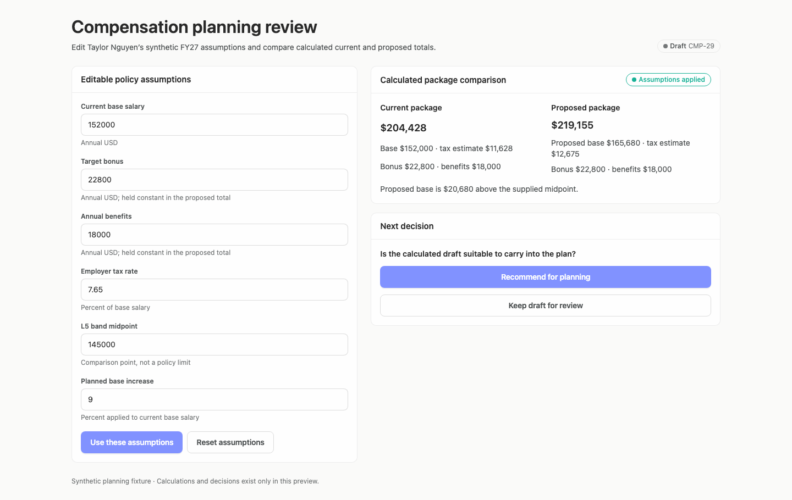
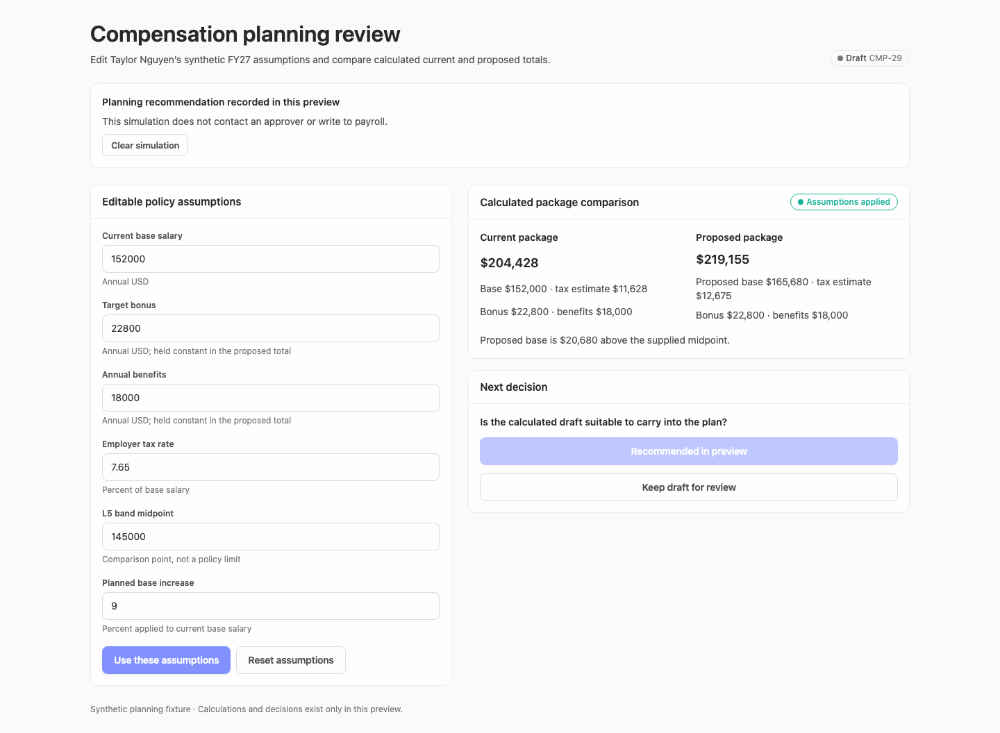
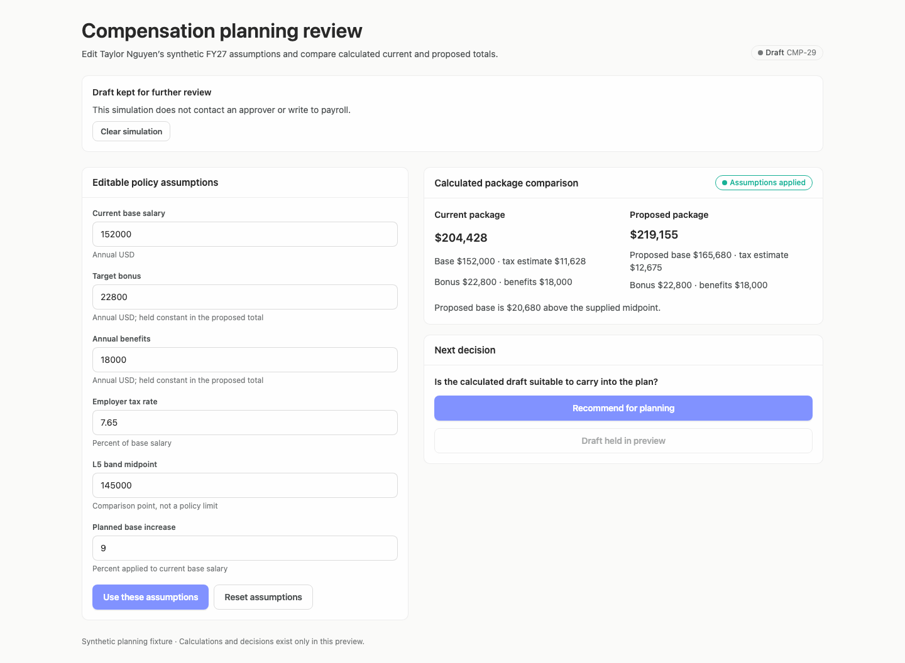
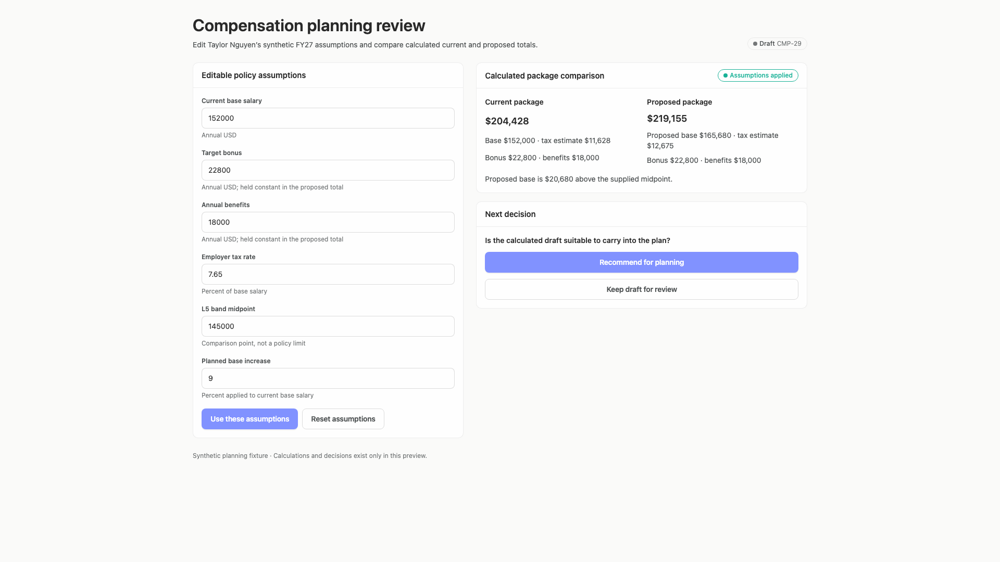
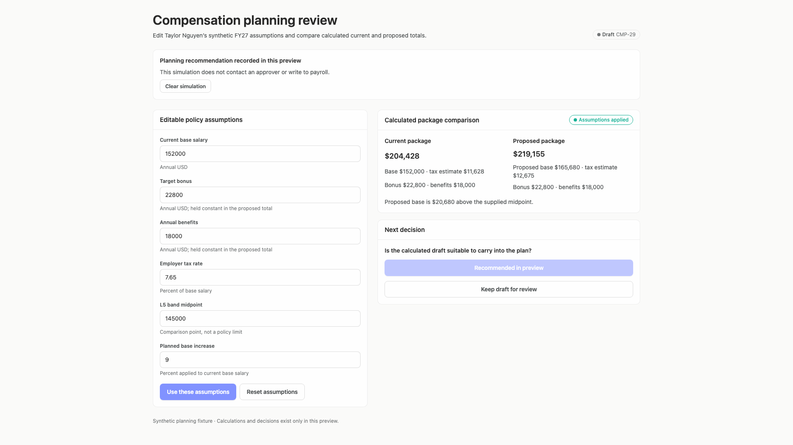
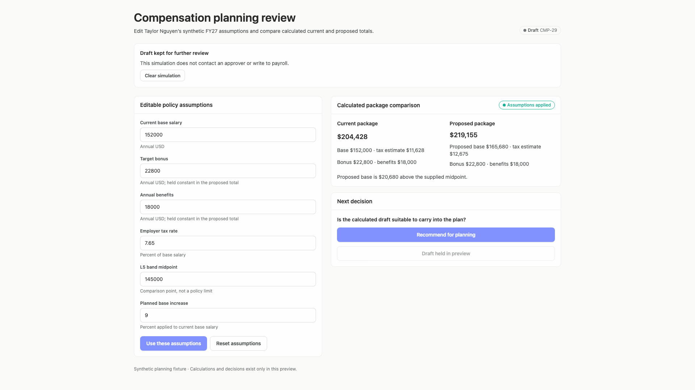
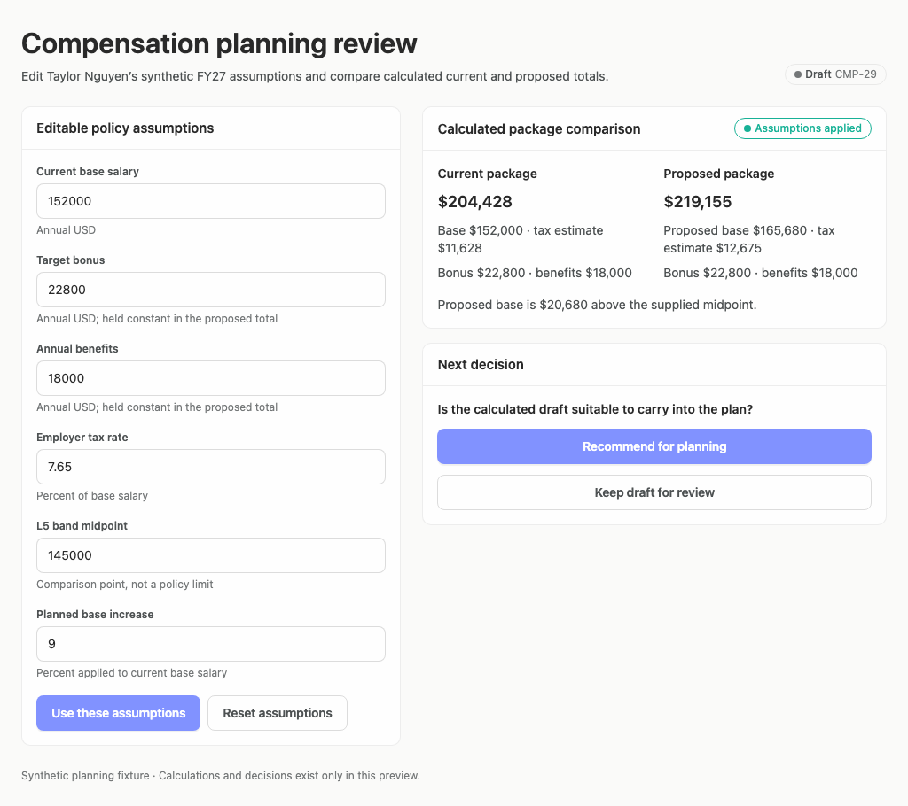
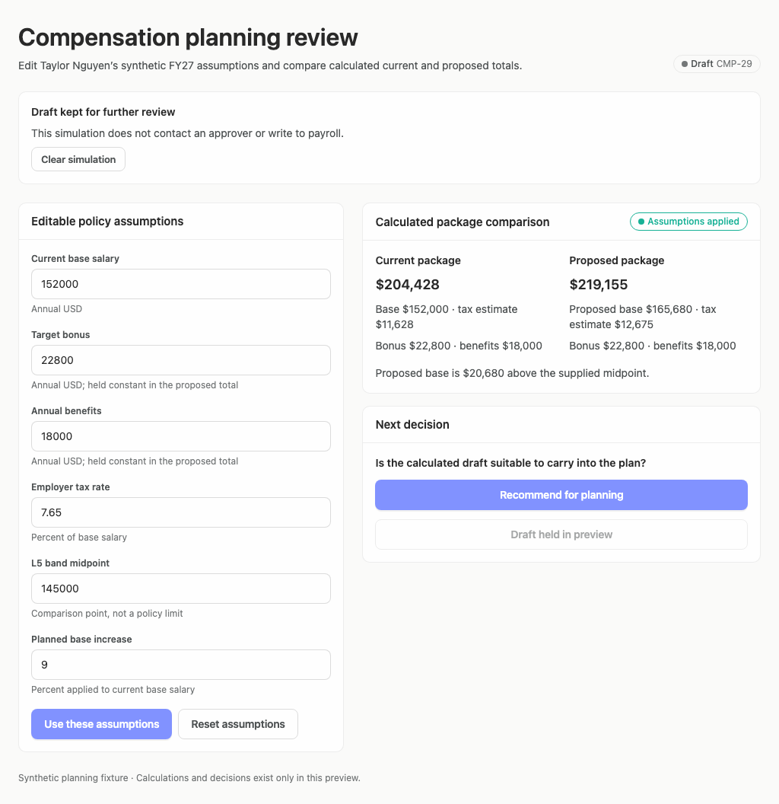

# compensation-planning-merged-refresh — 2026-09-09T15:09:34.530Z

[All reports](../../README.md) · [Interactive HTML report](index.html) · [Full measurements and scoring](report.json)

GitHub renders this summary and the screenshots. Download or clone this folder to open the HTML report locally; GitHub does not serve it as a website.

**Subjective design score:** 75/100. Model: openai/gpt-5.6-sol. Rubric: 2.

**Arrusted adherence:** 100/100 (partial); evidence coverage 1.67%. Evaluator 3.

| Dimension | Conforming | Nonconforming | Unassessed | Adherence    |
| --------- | ---------- | ------------- | ---------- | ------------ |
| component | 26         | 0             | 4          | 100% (26/26) |
| api       | 33         | 0             | 7          | 100% (33/33) |
| styling   | 12         | 0             | 4172       | 100% (12/12) |

Scores from different evaluator versions or captured states are not directly comparable.

This report evaluates the captured preview; evaluation itself does not regenerate the app or prove a built backend. Scores are advisory and not human-calibrated.

## Ratings

| Dimension      | Score | Reason                                                                                                                                                                                                                                                                                                                                                                                                                         |
| -------------- | ----- | ------------------------------------------------------------------------------------------------------------------------------------------------------------------------------------------------------------------------------------------------------------------------------------------------------------------------------------------------------------------------------------------------------------------------------ |
| hierarchy      | 3/4   | The page title, editable assumptions, package comparison, and next decision form a clear review sequence. Current and proposed totals are visually prominent, and recorded decision states add a clear banner. Hierarchy is weakened by giving “Recommend for planning” much stronger emphasis than the alternative before the reviewer has made a choice.                                                                     |
| layout         | 3/4   | The two-column composition is aligned and well balanced at 1024, 1440, and 1920 pixels, with consistent card boundaries and field spacing. The long assumptions form leaves substantial unused space beneath the right column, while the post-decision banner increases document height from 910 to 1056 pixels, but neither issue prevents use.                                                                               |
| typography     | 3/4   | Headings, labels, totals, and supporting copy use a consistent typographic system, and the bold package totals are easy to compare. Raw values such as “152000” and “7.65” are less scannable than formatted financial values, while several 12-pixel labels and captions were flagged as having marginal contrast in every capture.                                                                                           |
| responsive     | 3/4   | The desktop composition remains intact without clipping from 1024 through 1920 pixels; inputs contract from about 486 to 394 pixels and comparison content wraps cleanly. At the 1024×768 window the assumptions actions fall below the viewport and recorded states require a 1056-pixel document, but ordinary page scrolling remains usable and the comparison and decision stay visible.                                   |
| productClarity | 3/4   | The interface clearly identifies a synthetic draft, exposes base, bonus, benefits, employer-tax estimate, current versus proposed totals, and explicitly says decisions do not contact an approver or payroll. However, it does not clearly name the totals as illustrative employer cost or expose their formula, and band context is limited to a midpoint and dollar difference rather than a meaningful range or position. |

## Strengths

- The current and proposed packages are presented side by side with base, bonus, benefits, and employer-tax context.
- Helper text makes several assumptions explicit, including bonus and benefits being held constant and the midpoint not being a policy limit.
- “Draft,” “synthetic planning fixture,” “tax estimate,” and “calculations and decisions exist only in this preview” appropriately communicate uncertainty and avoid presenting the screen as payroll truth.
- Recorded recommendation and hold states explicitly say the simulation does not contact an approver or write to payroll.
- The layout remains stable and unclipped across the supplied 1024-, 1440-, and 1920-pixel desktop captures.

## Improvements

- **high — desktop-0:** The band comparison only states that proposed base is $20,680 above a supplied midpoint. Without a band minimum, maximum, range penetration, or an explicit statement that those values are unavailable, the reviewer cannot meaningfully assess placement against the band. Add a compact band-context row beneath the package comparison showing minimum, midpoint, maximum, and proposed-base position. If only the midpoint is available, explicitly label the comparison “midpoint-only context” and state that full band compliance cannot be assessed.
- **medium — desktop-0:** The large values $204,428 and $219,155 are labeled only as package totals. Although their component lines can be added manually, the screen does not directly identify them as illustrative annual employer-cost estimates or show the formula, which can make a draft calculation appear more authoritative than intended. Label each value “Illustrative annual employer cost” and add a concise formula such as “base + target bonus + benefits + estimated employer tax.” Keep the existing preview disclaimer adjacent to this comparison or expose methodology in a disclosure.
- **medium — desktop-0:** The recommendation option is a full-width emphasized primary action while “Keep draft for review” is secondary, visually steering a compensation judgment before a choice has been established. Present the two outcomes first as neutral selectable decision options, then provide one separate confirm/simulate action. A compact DecisionOptionCard composition would preserve clear selection without changing the supported Button styling.
- **medium — desktop-0:** Financial inputs use unformatted raw numbers such as 152000, 22800, and 145000, while units appear only in smaller helper text below each field. This slows comparison and makes entry mistakes harder to spot. Place supported currency or percent units next to the field label or value and show formatted readback such as “$152,000 USD,” “$22,800 USD,” and “7.65%.” Preserve an editable numeric value if needed, but make the interpreted assumption immediately visible.
- **low — desktop-window-0:** Field labels and helper lines are small and visually subdued; automated review repeatedly flagged these 12-pixel muted texts as marginally below contrast thresholds. The issue is more noticeable in the narrower column where supporting text wraps. Use a supported Typography variant with body-sized text or stronger label emphasis for essential units and policy qualifications, rather than changing the authoritative palette.
- **low — desktop-2:** The recorded-state banner clearly explains the simulation, but it occupies a full-width card and pushes the assumptions and comparison down by roughly 146 pixels, increasing the document height to 1056 pixels for a short status message. Compose the recorded status as a more compact summary near the draft identifier or decision card, while retaining the explicit no-approval/no-payroll disclaimer and clear-simulation action.

## Token evidence

Percentages cover only assessed properties. Missing provenance and ambiguous CSS remain unassessed; matching literals are not proof of token usage.

| Viewport                  | Category   | Token references / assessed | Coverage   |
| ------------------------- | ---------- | --------------------------- | ---------- |
| desktop-0                 | color      | 0/0                         | 0% (0/168) |
| desktop-0                 | typography | 0/0                         | 0% (0/412) |
| desktop-0                 | spacing    | 0/0                         | 0% (0/190) |
| desktop-0                 | radius     | 0/0                         | 0% (0/86)  |
| desktop-0                 | border     | 0/0                         | 0% (0/101) |
| desktop-0                 | shadow     | 0/0                         | 0% (0/86)  |
| desktop-wide-0            | color      | 0/0                         | 0% (0/168) |
| desktop-wide-0            | typography | 0/0                         | 0% (0/412) |
| desktop-wide-0            | spacing    | 0/0                         | 0% (0/190) |
| desktop-wide-0            | radius     | 0/0                         | 0% (0/86)  |
| desktop-wide-0            | border     | 0/0                         | 0% (0/101) |
| desktop-wide-0            | shadow     | 0/0                         | 0% (0/86)  |
| desktop-window-0          | color      | 0/0                         | 0% (0/168) |
| desktop-window-0          | typography | 0/0                         | 0% (0/412) |
| desktop-window-0          | spacing    | 0/0                         | 0% (0/190) |
| desktop-window-0          | radius     | 0/0                         | 0% (0/86)  |
| desktop-window-0          | border     | 0/0                         | 0% (0/101) |
| desktop-window-0          | shadow     | 0/0                         | 0% (0/86)  |
| desktop-custom-1024x900-0 | color      | 0/0                         | 0% (0/168) |
| desktop-custom-1024x900-0 | typography | 0/0                         | 0% (0/412) |
| desktop-custom-1024x900-0 | spacing    | 0/0                         | 0% (0/190) |
| desktop-custom-1024x900-0 | radius     | 0/0                         | 0% (0/86)  |
| desktop-custom-1024x900-0 | border     | 0/0                         | 0% (0/101) |
| desktop-custom-1024x900-0 | shadow     | 0/0                         | 0% (0/86)  |

## Latest-run screenshots

### desktop-0 — initial

Interaction: not-run.

### desktop-1 — edit assumptions and recalculate the proposal

Interaction: failed.

### desktop-2 — recommend the draft for planning

Interaction: passed.

### desktop-3 — hold the draft for further review

Interaction: passed.

### desktop-wide-0 — initial

Interaction: not-run.

### desktop-wide-1 — edit assumptions and recalculate the proposal

Interaction: failed.

### desktop-wide-2 — recommend the draft for planning

Interaction: passed.

### desktop-wide-3 — hold the draft for further review

Interaction: passed.

### desktop-window-0 — initial

Interaction: not-run.

### desktop-window-1 — edit assumptions and recalculate the proposal

Interaction: failed.

### desktop-window-2 — recommend the draft for planning

Interaction: passed.

### desktop-window-3 — hold the draft for further review

Interaction: passed.

### desktop-custom-1024x900-0 — initial

Interaction: not-run.

### desktop-custom-1024x900-1 — edit assumptions and recalculate the proposal

Interaction: failed.

### desktop-custom-1024x900-2 — recommend the draft for planning

Interaction: passed.

### desktop-custom-1024x900-3 — hold the draft for further review

Interaction: passed.

## Limitations

- Only static captures at 1024, 1440, and 1920 pixel widths were supplied; intermediate desktop panel widths, zoom behavior, focus states, validation, and error states were not observed.
- The edit-and-recalculate interaction expected a changed total but failed in every tested width, and the corresponding screenshots are visually identical to the initial state. This creates uncertainty about update feedback, but no backend or calculation behavior is inferred from it.
- Recommendation and hold states were captured, but keyboard interaction, confirmation behavior, and persistence were not tested.
- Contrast observations are advisory; the existing Arrusted palette is authoritative, and the evidence does not justify palette or primary Button restyling.
- Static source evidence and adherence measurements do not prove that every dynamic branch or callback rendered or operated.
