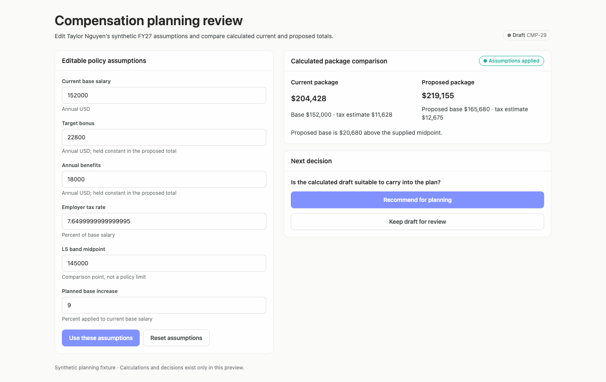
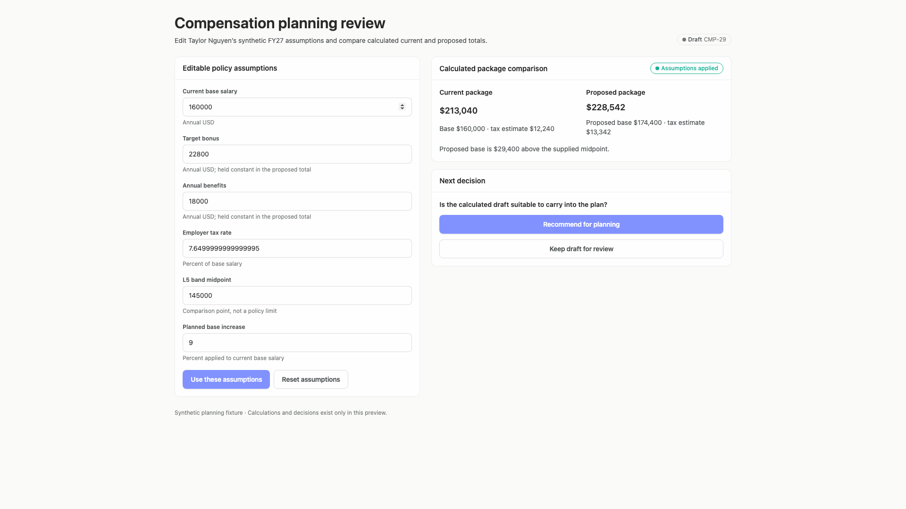
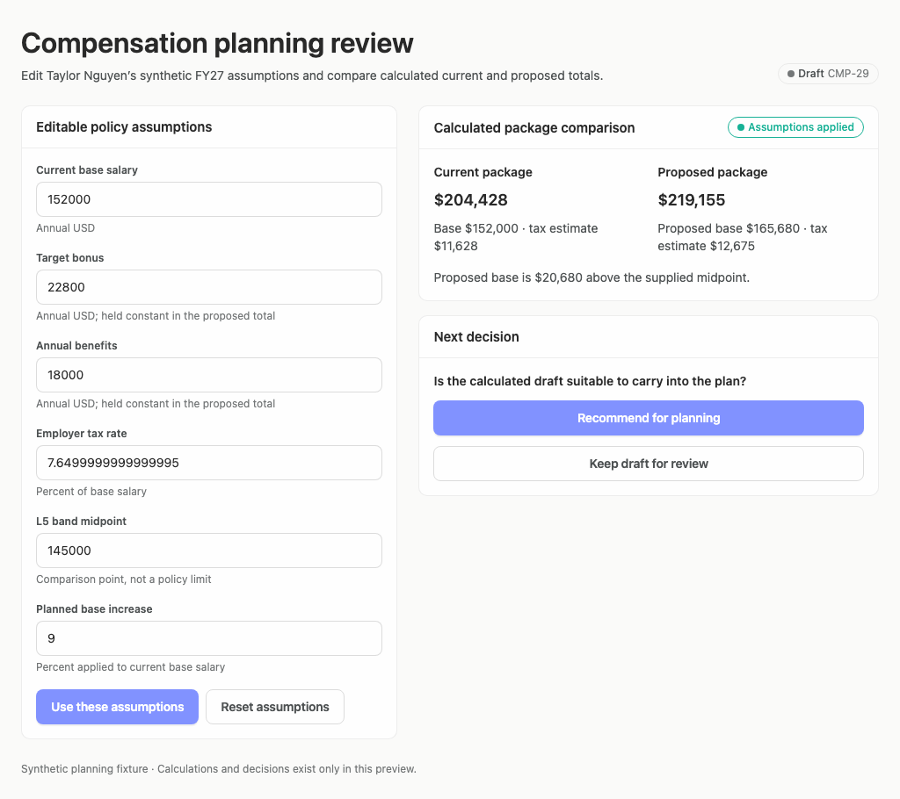
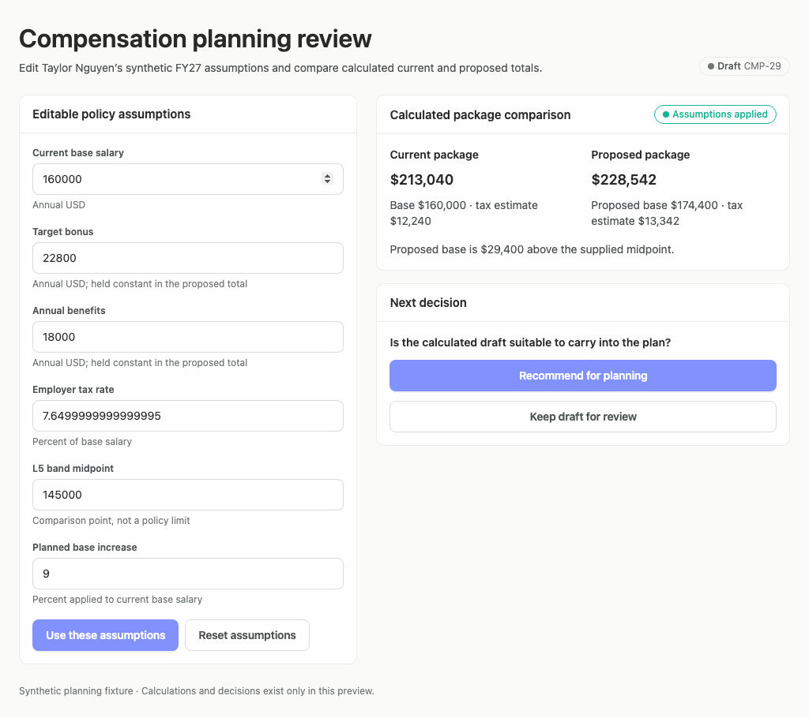

# compensation-planning-recurring-reference — 2026-09-09T14:25:34.641Z

[All reports](../../README.md) · [Interactive HTML report](index.html) · [Full measurements and scoring](report.json)

GitHub renders this summary and the screenshots. Download or clone this folder to open the HTML report locally; GitHub does not serve it as a website.

**Subjective design score:** 75/100. Model: openai/gpt-5.6-sol. Rubric: 2.

**Arrusted adherence:** 93/100 (partial); evidence coverage 1.91%. Evaluator 3.

| Dimension | Conforming | Nonconforming | Unassessed | Adherence    |
| --------- | ---------- | ------------- | ---------- | ------------ |
| component | 24         | 0             | 4          | 100% (24/24) |
| api       | 19         | 5             | 14         | 79% (19/24)  |
| styling   | 12         | 0             | 3057       | 100% (12/12) |

Scores from different evaluator versions or captured states are not directly comparable.

This report evaluates the captured preview; evaluation itself does not regenerate the app or prove a built backend. Scores are advisory and not human-calibrated.

## Ratings

| Dimension | Score | Reason |
| --- | --- | --- |
| hierarchy | 3/4 | The page title, editable assumptions, package comparison, and next decision form a clear review sequence. Current and proposed totals are prominent, and draft/applied statuses are visible, though the detailed compensation components are not given comparable visual priority. |
| layout | 3/4 | The two-column composition is aligned and comfortably spaced at 1024, 1440, and 1920 widths, with consistent card boundaries and field rhythm. The wide view leaves substantial unused space, but the bounded content width remains coherent; the 768px-tall capture requires modest page scrolling to reach the assumption actions. |
| typography | 3/4 | Headings, labels, totals, and supporting copy use a consistent, readable hierarchy. Readability is weakened by the employer-tax input displaying 7.6499999999999995 and by several small muted captions that automated evidence flags as marginal or insufficient contrast. |
| responsive | 3/4 | The two-column review remains usable without clipping at the tested 1024, 1440, and 1920 desktop widths, and controls resize sensibly. At the 1024×768 viewport, the apply/reset controls begin below the visible viewport while the resulting comparison and decision remain visible, creating some separation between editing and applying assumptions. |
| productClarity | 3/4 | The interface repeatedly identifies the case as synthetic, assumption-based, and a draft; the footer explicitly says calculations and decisions exist only in the preview, avoiding a payroll or approval claim. Base and employer-tax figures are visible, but bonus and benefits are only represented as editable inputs and are not itemized in the current/proposed comparison, while band context is reduced to a midpoint delta. |

## Strengths

- Clear separation between editable policy assumptions, calculated comparison, and the reviewer’s next decision.
- Current and proposed totals are easy to compare, with base and employer-tax context shown directly beneath each total.
- Labels such as “Draft,” “synthetic,” “calculated draft,” and “Keep draft for review” appropriately frame the proposal as planning material rather than payroll truth.
- Helper text explains which values are held constant and clarifies that the band midpoint is a comparison point rather than a policy limit.
- The tested edit/apply interaction updates the displayed synthetic total consistently across the supplied desktop sizes.
- The composition remains unclipped and legible across all three tested desktop widths.

## Improvements

- **high — desktop-0:** The comparison emphasizes aggregate totals but itemizes only base and estimated employer tax. Target bonus and annual benefits are absent from both package breakdowns, so a reviewer cannot directly reconcile all requested compensation components. Add a compact, aligned breakdown under each package for base, target bonus, benefits, employer-tax estimate, and total. Mark held-constant items explicitly and distinguish estimates from entered amounts.
- **medium — desktop-0:** Band comparison is limited to “$20,680 above the supplied midpoint.” This identifies direction and distance but gives no range, position, or explanation of how the midpoint should inform the decision. Present the supplied band information in a dedicated comparison row and state what is known versus unavailable—for example, proposed base, midpoint, dollar/percent variance, and “band limits not supplied” if no range exists.
- **medium — desktop-1:** The employer-tax assumption is displayed as 7.6499999999999995, which looks like calculation leakage rather than an intentional policy assumption and makes an estimate appear falsely precise. Format the displayed assumption to an appropriate planning precision such as 7.65%, while preserving any internal numeric precision separately.
- **low — desktop-0:** The draft badge communicates status, but “CMP-29” is unexplained and the badge does not indicate whether inputs are sourced, provisional, or reviewer-entered. Pair the draft identifier with concise provenance or timing information, such as “Draft CMP-29 · reviewer assumptions,” if that information is available.
- **medium — desktop-0:** The strongest disclaimer—that calculations and decisions exist only in this preview—is visually remote from the calculated totals and decision controls. Reviewers may act before encountering it, especially in shorter desktop windows. Repeat a concise preview/estimate notice inside the comparison or next-decision card, while retaining the footer disclosure.
- **low — desktop-window-0:** At the measured 1024×768 desktop viewport, the final assumption field and apply/reset controls extend below the initial viewport, while comparison and decision controls remain visible to the right. This weakens the perceived sequence from edit to apply to decide. At shorter desktop windows, reduce vertical field spacing or use a denser supported form composition so the apply controls remain closer to the assumptions and comparison; scrolling can remain available.
- **medium — desktop-0:** The two decision options are understandable, but neither summarizes the consequences. “Recommend for planning” may be mistaken for an approval-like action despite the broader draft language. Add short consequence text near the controls, such as “Records a recommendation in this preview; does not approve or send to payroll,” and clarify what retaining the draft means.

## Token evidence

Percentages cover only assessed properties. Missing provenance and ambiguous CSS remain unassessed; matching literals are not proof of token usage.

| Viewport         | Category   | Token references / assessed | Coverage   |
| ---------------- | ---------- | --------------------------- | ---------- |
| desktop-0        | color      | 0/0                         | 0% (0/164) |
| desktop-0        | typography | 0/0                         | 0% (0/402) |
| desktop-0        | spacing    | 0/0                         | 0% (0/186) |
| desktop-0        | radius     | 0/0                         | 0% (0/84)  |
| desktop-0        | border     | 0/0                         | 0% (0/99)  |
| desktop-0        | shadow     | 0/0                         | 0% (0/84)  |
| desktop-wide-0   | color      | 0/0                         | 0% (0/164) |
| desktop-wide-0   | typography | 0/0                         | 0% (0/402) |
| desktop-wide-0   | spacing    | 0/0                         | 0% (0/186) |
| desktop-wide-0   | radius     | 0/0                         | 0% (0/84)  |
| desktop-wide-0   | border     | 0/0                         | 0% (0/99)  |
| desktop-wide-0   | shadow     | 0/0                         | 0% (0/84)  |
| desktop-window-0 | color      | 0/0                         | 0% (0/164) |
| desktop-window-0 | typography | 0/0                         | 0% (0/402) |
| desktop-window-0 | spacing    | 0/0                         | 0% (0/186) |
| desktop-window-0 | radius     | 0/0                         | 0% (0/84)  |
| desktop-window-0 | border     | 0/0                         | 0% (0/99)  |
| desktop-window-0 | shadow     | 0/0                         | 0% (0/84)  |

## Latest-run screenshots

### desktop-0 — initial

Interaction: not-run.

### desktop-1 — edit, apply, hold, and clear synthetic compensation assumptions

Interaction: passed.

### desktop-wide-0 — initial

Interaction: not-run.

### desktop-wide-1 — edit, apply, hold, and clear synthetic compensation assumptions

Interaction: passed.

### desktop-window-0 — initial

Interaction: not-run.

### desktop-window-1 — edit, apply, hold, and clear synthetic compensation assumptions

Interaction: passed.

## Limitations

- Only static captures at 1024, 1440, and 1920 desktop widths were provided; narrower desktop panels, zoomed layouts, focus states, errors, and long localized content were not observed.
- The passed interaction evidence confirms a displayed synthetic total changed to $228,542, but it does not establish calculation correctness, persistence, payroll behavior, or an approval workflow.
- Exact source provenance, policy provenance, and whether compensation band limits exist were not supplied.
- Contrast observations rely on the supplied automated evidence and are advisory; the existing Arrusted palette is treated as authoritative.
- Static JSX and source measurements do not prove that every dynamic state or component branch rendered.
