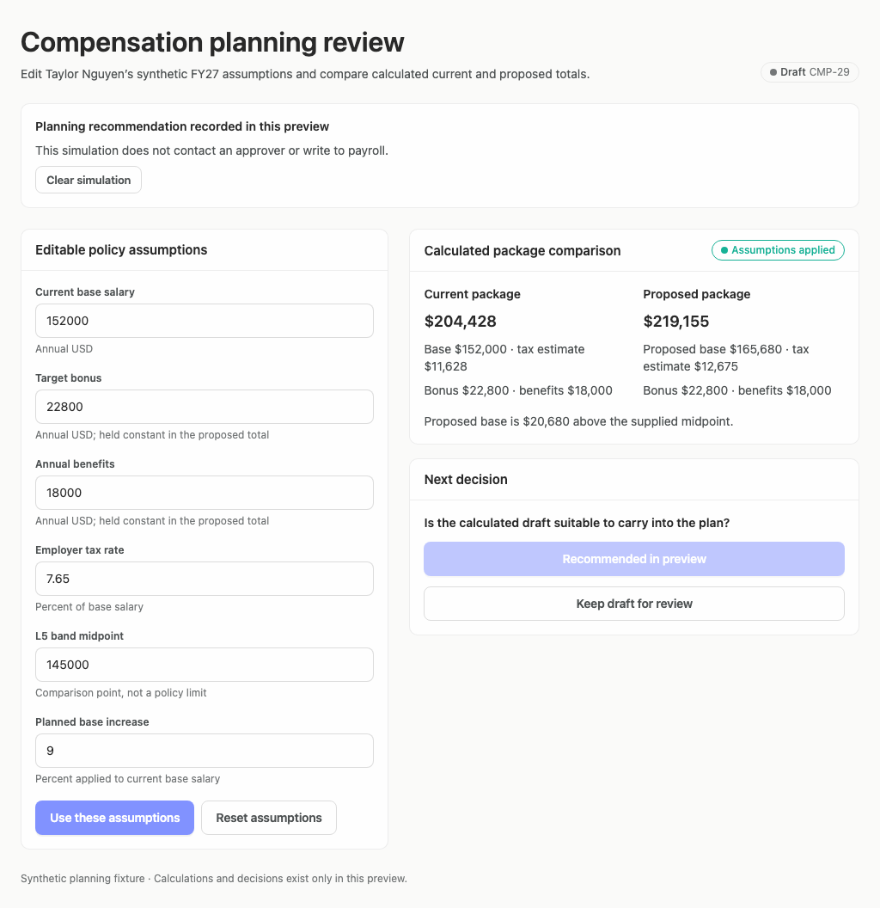

# Merged reference examples: refreshed evaluation

Evaluated Builder `36dfe0332d8a7e944957005875e1bb6387514442` after PR #366, rendering the existing examples against verified GitHub Arrusted main `7e44acbd14b4871fe285664a06e85d028eb5f301` in the existing Vercel Sandbox. No app regeneration, palette changes, deployment, or live business writes.

## Results

| Reference | Earlier subjective score | Fresh subjective score | Assessed adherence | Evidence coverage | Scenario results |
| --- | --: | --: | --: | --: | --- |
| [Spend import](spend-import-review-merged-refresh-150731341Z/index.html) | 65 | 70 | 100, partial | 2.67% | 16/16 passed |
| [Compensation](compensation-planning-merged-refresh-150934530Z/index.html) | 75 | 75 | 100, partial | 1.67% | 8/12 passed |

These are advisory single-model judgments, not objective progress percentages. The reference checkout and captured states differ from the earlier reports, so the five-point change is not a controlled measurement of generation quality. Both examples are hand-authored references, not fresh agent generations.

The evaluator captured initial and scenario states at 1440, 1920, and 1024 desktop widths. An additional explicit 1024 capture duplicates the built-in desktop-window size; the counts above include that duplicate, not a fourth independent size. This archive contains 36 new screenshots. Historical reports and screenshots remain unchanged.

## Flow assessment

1. **Import mapping and save — working.** Mapping changes alter the derived preview, and saving states the imported and unresolved counts.
2. **Exception resolution and deferral — working.** Resolving a match updates the table, badge, summary, and remaining count to 39 ready / 3 needing review. Deferral remains explicit rather than pretending a match was resolved.
3. **Compensation assumption edit — failed scenario.** The requested 10% increase did not produce the expected $220,791. Captures still show 9% and
   $219,155. Diagnose the numeric input/event path before calling this example fully functional; the run does not establish the root cause or justify changing the expected result to make it pass.
4. **Compensation recommendation and hold — working in simulation.** Both outcomes display confirmation without contacting an approver or payroll.

## Highest-value improvements

- First fix the compensation edit failure with one targeted interaction check, without rerunning the whole design suite.
- Import: distinguish original transaction evidence from proposed matches; reduce the prominence of completed mapping during exception review. At a narrow desktop width, prioritize decision context or use the existing Arrusted list/detail composition. Horizontal scrolling itself is not a defect, but essential information and keyboard access must remain discoverable.
- Compensation: label totals as illustrative annual employer cost, state the formula, and make currency/percentage interpretation easy to scan. Explicitly call the supplied midpoint midpoint-only context; do not invent missing bands.
- Consider neutral outcome selection followed by confirmation for judgment tasks where primary-button emphasis would bias the choice. This is guidance for that decision type, not a rule prescribing one layout for every app.
- Keep recorded-state feedback close to the decision and concise. Prefer supported Arrusted typography/variants; do not change the shared palette.

## Adherence confidence

Both reports found no violations among assessed observations. That is **not** proof of full Arrusted conformity. Import assessed 26 component, 40 API, and 12 styling observations; compensation assessed 26, 33, and 12 respectively. Thousands of browser styling observations retain unknown provenance. Component coverage is 86.7%; API coverage is 76.9% / 82.5%; styling coverage is under 0.5%. Static JSX does not prove rendered component identity. Keep the partial label and raw denominators; do not turn unknown evidence into positive credit.

## Fresh screenshots

### Import: resolved match at narrow desktop width

### Compensation: recorded recommendation

### Compensation: failed edit scenario

Screenshots were visually inspected. Automated accessibility findings remain review evidence, not a full accessibility certification. The reports contain the complete captured states, measurements, model findings, and limitations.
