# position-request — 2026-09-09T13:12:50.013Z

[All reports](../../README.md) · [Interactive HTML report](index.html) · [Full measurements and scoring](report.json)

GitHub renders this summary and the screenshots. Download or clone this folder to open the HTML report locally; GitHub does not serve it as a website.

**Subjective design score:** 85/100. Model: openai/gpt-5.6-sol. Rubric: 2.

**Arrusted adherence:** 100/100 (partial); evidence coverage 1.77%. Evaluator 3.

| Dimension | Conforming | Nonconforming | Unassessed | Adherence    |
| --------- | ---------- | ------------- | ---------- | ------------ |
| component | 14         | 0             | 5          | 100% (14/14) |
| api       | 20         | 0             | 7          | 100% (20/20) |
| styling   | 13         | 0             | 2598       | 100% (13/13) |

Scores from different evaluator versions or captured states are not directly comparable.

This report evaluates the captured preview; evaluation itself does not regenerate the app or prove a built backend. Scores are advisory and not human-calibrated.

## Ratings

| Dimension | Score | Reason |
| --- | --- | --- |
| hierarchy | 4/4 | The page title, status pill, bordered form section, field labels, inline errors, and primary action create a clear scan path in desktop-0 through desktop-window-4. The confirmation state gives “Draft saved in this preview” strong prominence and follows it with saved values and edit actions. |
| layout | 3/4 | The three-column form is consistently aligned, comfortably spaced, and remains unclipped at 1024, 1440, and 1920 pixels. The main weakness is in desktop-3, where the Draft status pill sits directly beneath salary, making status appear subordinate to that value rather than a separate saved field. |
| typography | 3/4 | Headings, labels, values, helpers, and errors use a consistent typographic hierarchy, and the confirmation values are easy to compare. However, automated evidence repeatedly identifies low contrast in small muted labels, error messages, and status text; these compact styles are especially important in desktop-1 and desktop-3. |
| responsive | 4/4 | Across the provided 1024, 1440, and 1920 desktop captures, the form and confirmation remain centered, fully visible, aligned, and free of horizontal or document overflow. Controls remain usable at every tested desktop width, although narrower panels were not supplied. |
| productClarity | 3/4 | Required fields are explicitly summarized and marked, salary is identified as annual USD, date purpose is explained, and field-specific salary/date errors preserve the other entered values. The confirmation clearly says no external system was updated and presents the saved fixture values, but the header’s claim that the details are for “People Operations” conflicts with a department selector that supports several departments. |

## Strengths

- The required-field summary and per-label asterisks make completion expectations easy to understand.
- Salary validation is specific (“greater than $0”), while the other populated values remain visible for correction in desktop-2.
- Date-order validation is attached to the end date and explains the required relationship without clearing the form.
- The confirmation shows title, department, formatted salary, status, and a human-readable date range.
- “Draft saved in this preview” and “No external system was updated” clearly distinguish fixture persistence from a real submission.
- Edit draft and Start another request provide distinct next steps after confirmation.
- The composition remains stable and unclipped across all three supplied desktop widths.

## Improvements

- **medium — desktop-0:** The introductory sentence says the request captures details “People Operations needs,” even though Department is an editable choice with Finance, Engineering, Sales, and other options. This can make the workflow appear department-specific or make a manager question whether changing the department is appropriate. Use department-neutral introductory copy, such as “Capture the core hiring details needed for this position request.”
- **medium — desktop-3:** Draft status is shown as an unlabeled pill immediately below Annual base salary. Although all fixture values are present, this placement visually associates status with salary and makes one required model field harder to verify independently. Present Status as its own labeled confirmation field alongside Position title, Department, Annual base salary, and Position term; keep the pill as the field value if desired.
- **medium — desktop-1:** The salary error is specific and correctly placed, but automated evidence reports insufficient contrast for the small danger-colored error text. Similar small error text appears across the required fields, which can weaken correction guidance. Retain the authoritative palette but use a supported error presentation with an error icon and/or regular body-sized text so the message is not conveyed by compact color treatment alone.
- **low — desktop-0:** The label and helper establish annual USD, but the editable value is shown as an ungrouped “115000.” It is understandable, yet less immediately scannable than the formatted “$120,000” used in confirmation. Add a concise input example or supported currency affordance while preserving numeric editing, and continue formatting the saved value with a dollar sign and separators in confirmation.

## Token evidence

Percentages cover only assessed properties. Missing provenance and ambiguous CSS remain unassessed; matching literals are not proof of token usage.

| Viewport         | Category   | Token references / assessed | Coverage   |
| ---------------- | ---------- | --------------------------- | ---------- |
| desktop-0        | color      | 0/0                         | 0% (0/140) |
| desktop-0        | typography | 0/0                         | 0% (0/337) |
| desktop-0        | spacing    | 0/0                         | 0% (0/166) |
| desktop-0        | radius     | 0/0                         | 0% (0/71)  |
| desktop-0        | border     | 0/0                         | 0% (0/81)  |
| desktop-0        | shadow     | 0/0                         | 0% (0/71)  |
| desktop-wide-0   | color      | 0/0                         | 0% (0/140) |
| desktop-wide-0   | typography | 0/0                         | 0% (0/337) |
| desktop-wide-0   | spacing    | 0/0                         | 0% (0/166) |
| desktop-wide-0   | radius     | 0/0                         | 0% (0/71)  |
| desktop-wide-0   | border     | 0/0                         | 0% (0/81)  |
| desktop-wide-0   | shadow     | 0/0                         | 0% (0/71)  |
| desktop-window-0 | color      | 0/0                         | 0% (0/140) |
| desktop-window-0 | typography | 0/0                         | 0% (0/337) |
| desktop-window-0 | spacing    | 0/0                         | 0% (0/166) |
| desktop-window-0 | radius     | 0/0                         | 0% (0/71)  |
| desktop-window-0 | border     | 0/0                         | 0% (0/81)  |
| desktop-window-0 | shadow     | 0/0                         | 0% (0/71)  |

## Latest-run screenshots

### desktop-0 — initial

Interaction: not-run.

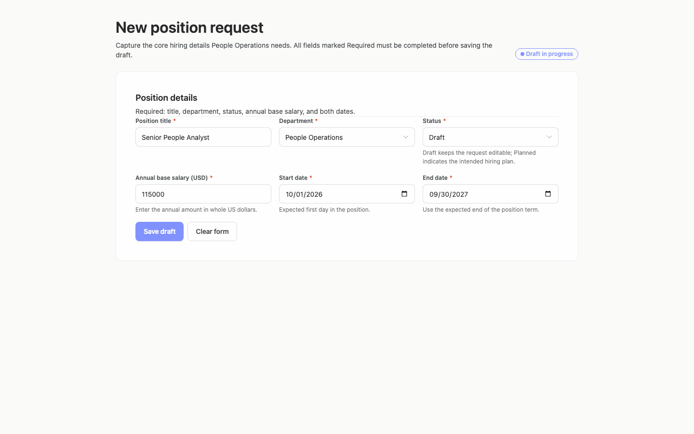

### desktop-1 — empty form explains required fields

Interaction: passed.

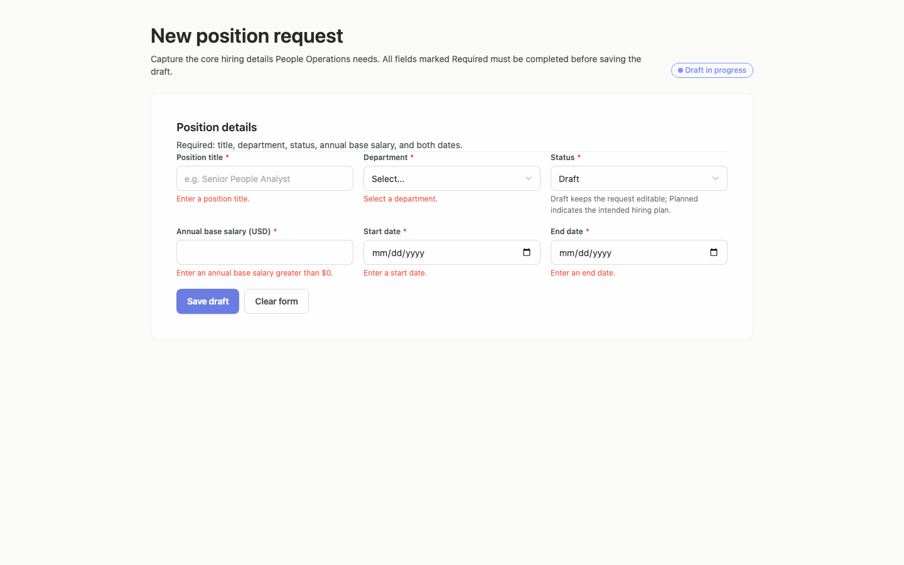

### desktop-2 — invalid salary is explained

Interaction: passed.

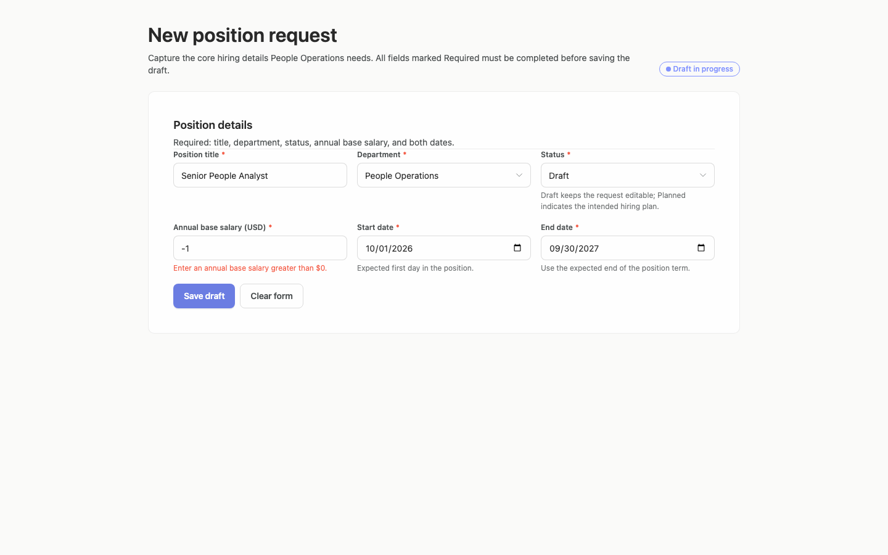

### desktop-3 — correct salary and confirm draft

Interaction: passed.

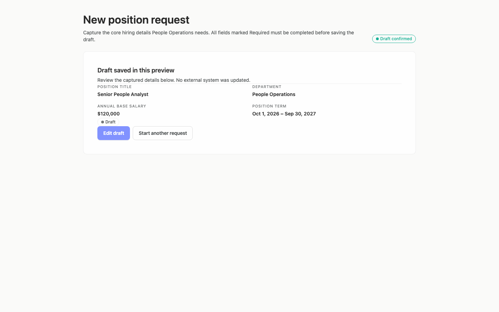

### desktop-4 — date order is explained

Interaction: passed.

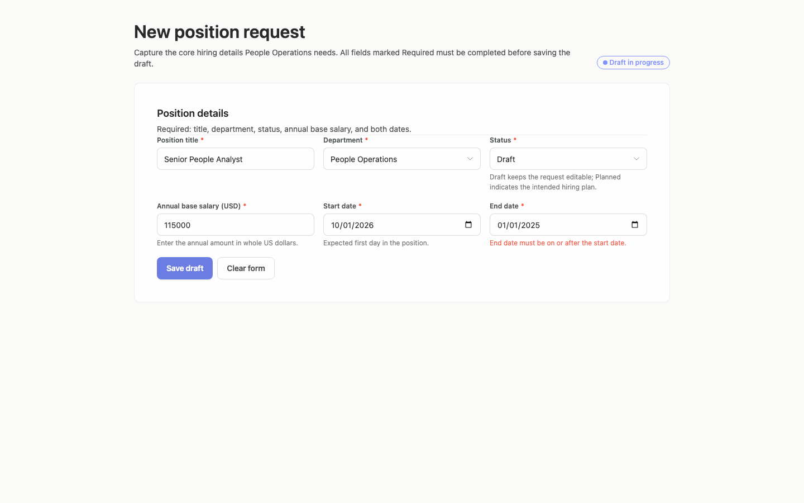

### desktop-wide-0 — initial

Interaction: not-run.

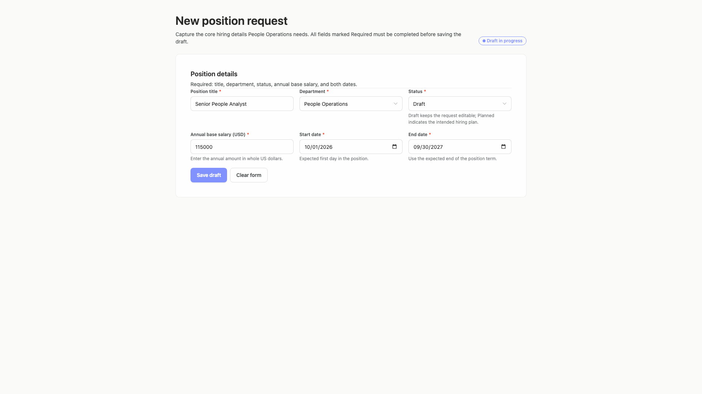

### desktop-wide-1 — empty form explains required fields

Interaction: passed.

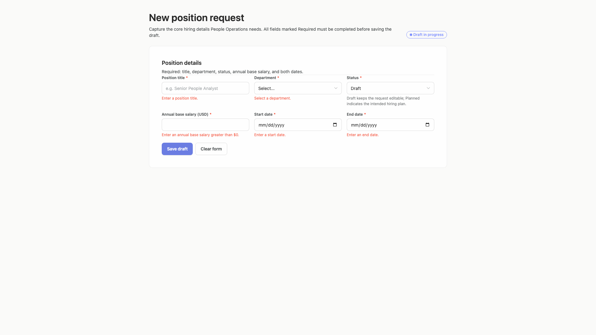

### desktop-wide-2 — invalid salary is explained

Interaction: passed.

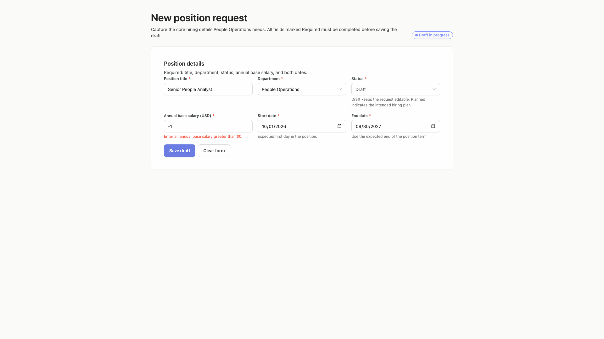

### desktop-wide-3 — correct salary and confirm draft

Interaction: passed.

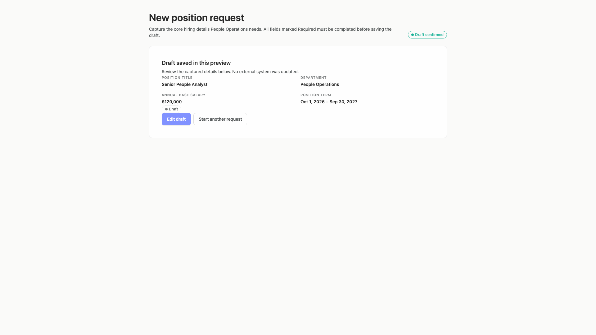

### desktop-wide-4 — date order is explained

Interaction: passed.

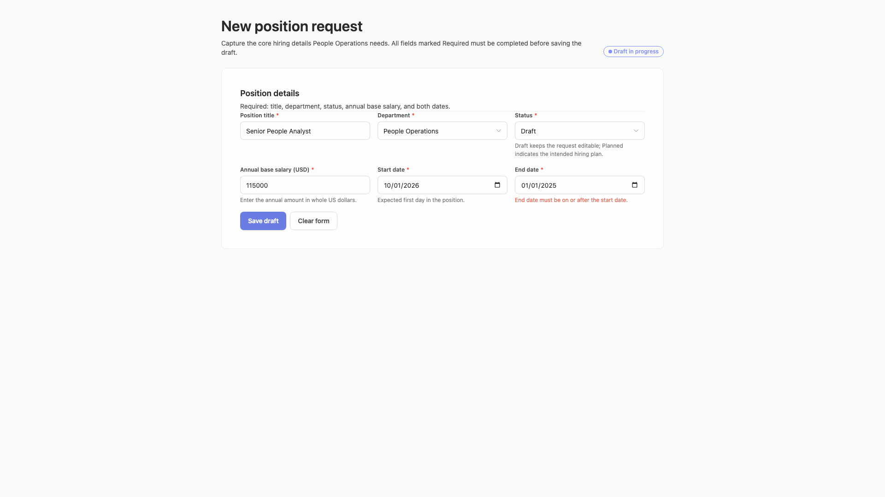

### desktop-window-0 — initial

Interaction: not-run.

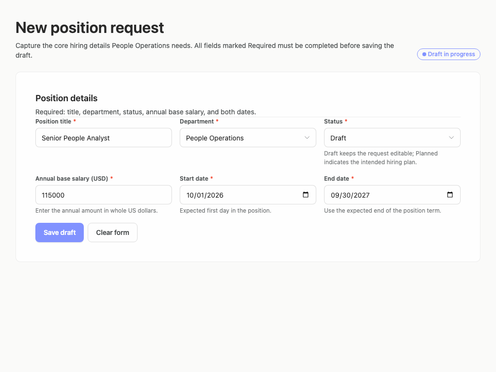

### desktop-window-1 — empty form explains required fields

Interaction: passed.

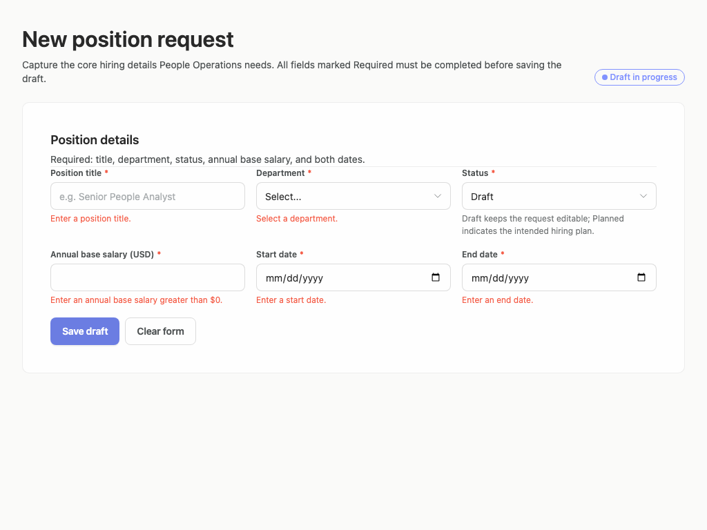

### desktop-window-2 — invalid salary is explained

Interaction: passed.

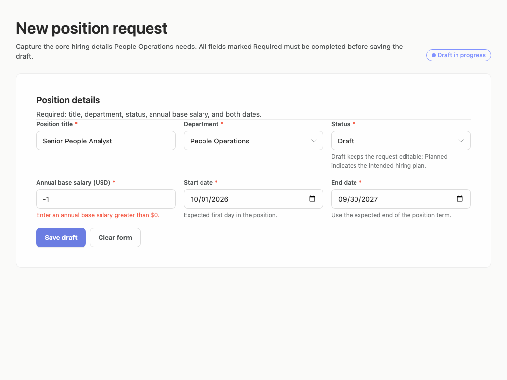

### desktop-window-3 — correct salary and confirm draft

Interaction: passed.

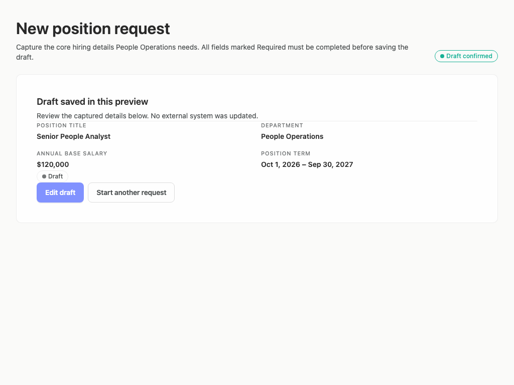

### desktop-window-4 — date order is explained

Interaction: passed.

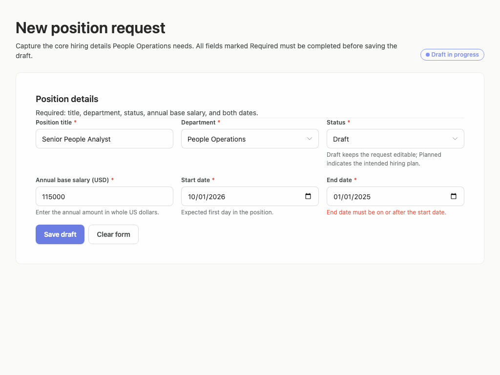

## Limitations

- Only static screenshots and reported interaction outcomes were provided; keyboard behavior, focus treatment, select menus, and native date-picker overlays were not observed.
- No desktop panel narrower than 1024 pixels was supplied, so behavior in tighter desktop panes is uncertain.
- The Edit draft return state was not shown, so preservation of confirmed values after selecting that action could not be visually verified.
- Automated contrast results are advisory design evidence; the existing Arrusted palette remains authoritative and no palette changes are recommended.
- The first capture attempt used an expired URL and returned 404; it is not a design result.
- The initial judge received a tightened brief requiring a specific job title, budget and approval context absent from the generation request. Its 60/100 result is preserved separately as superseded-brief-report.json and is not comparable. This review corrects that input to the actual manager drafting task without regenerating, recapturing, or changing the rubric.
