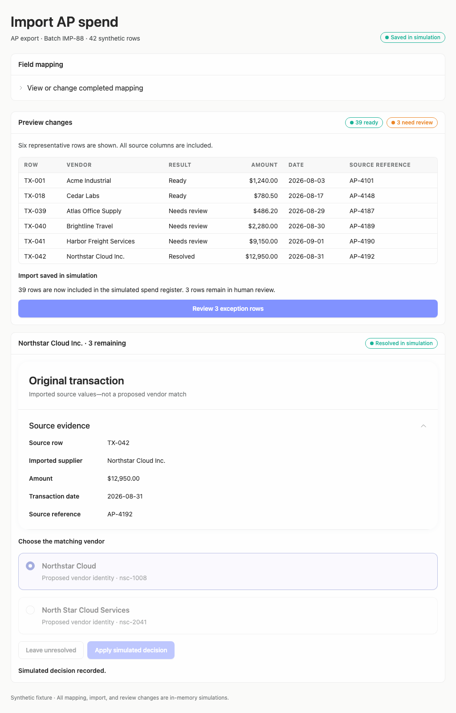
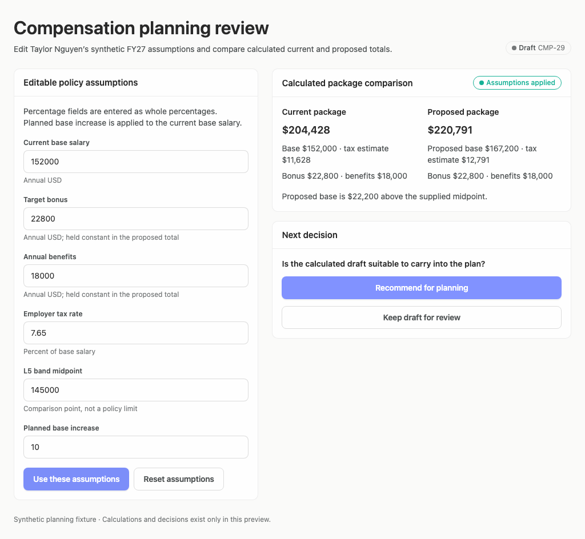

# Targeted reference fixes

Follow-up to [the merged-reference evaluation](../merged-reference-assessment.md).
These screenshots show fixes after that evaluation; they have not been AI
rescored. Earlier reports remain unchanged.

## What changed

- Compensation: moved percentage guidance outside the planned-increase label.
  The prior exact-name scenario could not target the field because helper text
  was part of its accessible name. This was not an arithmetic failure. Entering
  10 now reaches the field and produces the unchanged expected $220,791.
- Import: completed mapping collapses using Arrusted Disclosure; review uses
  the available width instead of retaining an unnecessary mapping side panel.
  Narrow desktop setup stacks the panels.
- Original transaction ID, imported supplier, amount, date, and reference are
  grouped in Arrusted RecordDetailPanel, separate from proposed vendor choices.
- The resolved row now agrees with the outcome and aggregate counts, rather
  than continuing to display “Needs review.”

## Focused verification

Six example unit tests passed. Four targeted browser checks passed at 1024 and
1440 desktop widths, against the existing Vercel Sandbox-rendered previews:

1. Preview/save/review import, confirm mapping collapsed and original evidence
   visible, select Northstar Cloud, apply the simulated decision, and check the
   TX-042 row says Resolved with 39 ready.
2. Fill the exact-named Planned base increase spinbutton with 10, apply
   assumptions, and confirm $220,791.

[Results](results.json). All effects were synthetic. No broad walkthrough,
automatic score loop, provider write, palette change, or new shared component.
The general lessons are concise accessible control names, reversible completed
setup, distinct original evidence versus proposed changes, and consistent
outcomes across every displayed representation—not a prescribed layout for all apps.

[Wide import](import-1440.png) · [Wide compensation](compensation-1440.png)
