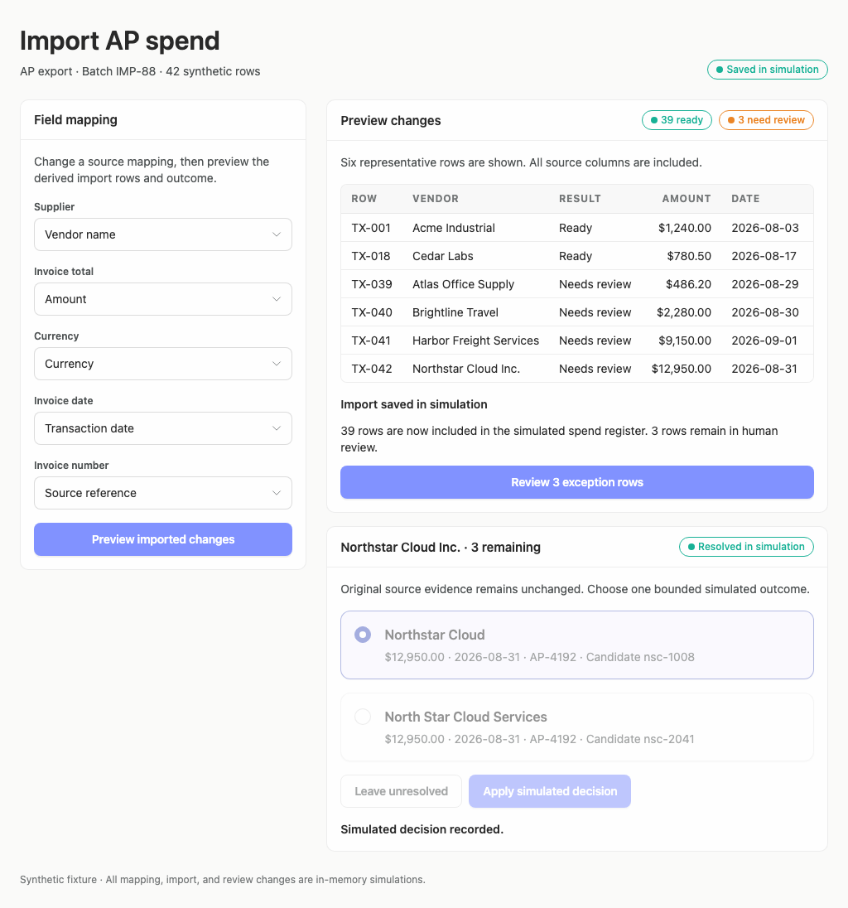
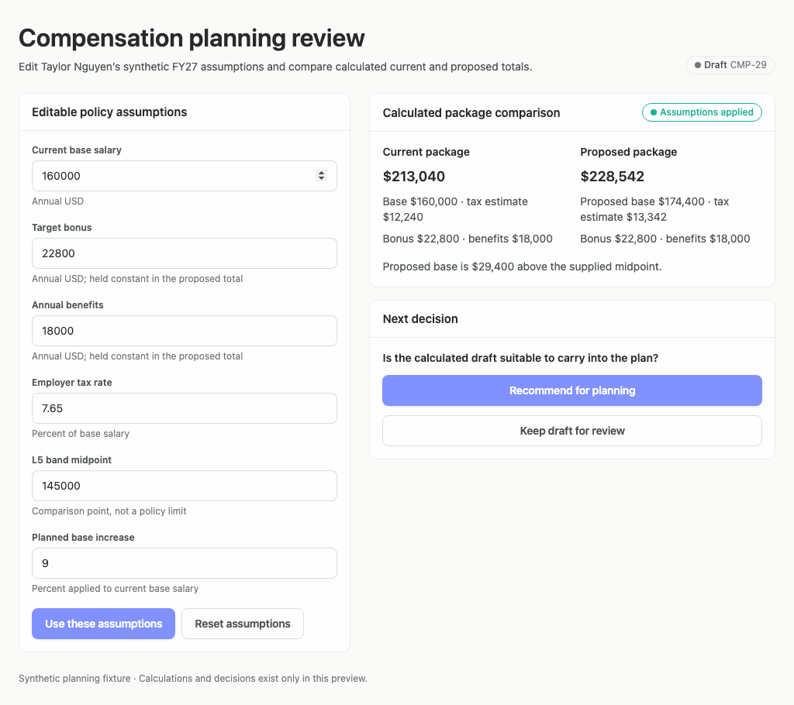

# Recurring improvements: reference examples and remaining gaps

[Original six-case batch](arrusted-ag2-batch.md) · [Case library](../../../design-quality-cases/README.md)

This change improves the Builder's shared authoring guidance and adds two runnable, hand-authored reference examples. It is **not a fresh generation benchmark** and does not establish that all generated apps now behave better. Existing historical reports and screenshots are unchanged.

## Implemented

- Guidance for synchronizing selected choices, available actions, recorded outcomes, and status language across every product domain.
- Guidance for meaningful units, periods, denominators, assumptions and current/proposed comparisons near the decision they inform.
- Guidance for readable decision-critical desktop detail through existing Arrusted components, not generated visual replacements or palette overrides.
- Synthetic import mapping that changes preview rows and derived counts; resolving a match updates the recorded result and remaining review count.
- Editable compensation assumptions that recalculate both packages, preserve edits when a decision is cleared, and expose invalid input as field errors.

The evaluated reference used local Arrusted checkout `5d868b64bad9c0c83f4faa314aa0fb2368c88176`, initially misidentified as GitHub main because its remote pointed to another local checkout. GitHub main `7e44acbd14b4871fe285664a06e85d028eb5f301` already exports selectable tables, record list/detail navigation, and the richer detail/KPI APIs. The earlier missing-capability finding was incorrect. No Arrusted component was changed. The historical report bytes and screenshots retain their actual reference; they have not been rerun against the corrected GitHub revision. See the [corrected capability notes](../../../design-quality-cases/arrusted-composition-capabilities.md).

## One advisory review, then targeted corrections

Both examples rendered through the existing Vercel Sandbox renderer with the local Arrusted checkout above. Each was scored once at the existing three desktop sizes.

| Reference | Subjective score | Assessed adherence | Coverage | Fixture flow |
| --- | --: | --: | --: | --- |
| [Spend import](spend-import-review-recurring-reference-142530877Z/README.md) | 65 | 88 | 3.12% | 3/3 desktop runs passed |
| [Compensation](compensation-planning-recurring-reference-142534641Z/README.md) | 75 | 93 | 1.91% | 3/3 desktop runs passed |

These partial adherence scores are not full conformity percentages. The lower import score remains visible. Different source, composition and captured states mean this is not an apples-to-apples regression or improvement measurement against the original 75-point examples. Neither rubric nor palette was changed.

Screenshot review found real defects despite passing scenario expectations: stale aggregate/status badges after import resolution and floating-point noise in the tax input. We fixed those and brought the result column, transaction context and full package breakdown closer to their decisions. Only the affected flows and screenshots were recaptured; **the corrected revision has no new AI score**. Do not attribute the earlier scores to these final screenshots.

[Targeted results](recurring-corrections/results.json): all six checks passed. Import now shows 39 ready and 3 needing review, with the selected match resolved. Compensation displays 7.65% rather than floating-point noise, and the edited proposed package remains $228,542 after clearing the decision.

### Corrected desktop-window examples

Other sizes: [Import 1440](recurring-corrections/spend-import-review-1440.png), [Import 1920](recurring-corrections/spend-import-review-1920.png), [Compensation 1440](recurring-corrections/compensation-planning-1440.png), [Compensation 1920](recurring-corrections/compensation-planning-1920.png).

## Remaining work, not new generation gates

- A future ordinary generation run should show whether the general guidance transfers beyond these references. No automatic scoring or repair loop was added.
- Use the existing Arrusted selectable-table and list/detail APIs for future examples that need record navigation; no new shared capability is required.
- The report only captures initial and final states of these combined scenarios; it does not visually establish every intermediate mapping/save or hold state. Focused state tests cover transitions, but do not constitute backend proof.
- The compensation midpoint is explanatory, not a supplied policy range. Do not invent a band or approval rule merely to satisfy a reviewer suggestion.
- Broader readability, action-consequence wording, and intermediate-state presentation remain advisory follow-ups. Scores do not block generation.

All fixture changes are in-memory. No production backend, deployment, package release, or live financial/provider write was exercised. The archive command also received a focused fix so screenshot-only supplements no longer break its index; malformed actual report JSON is still surfaced.
