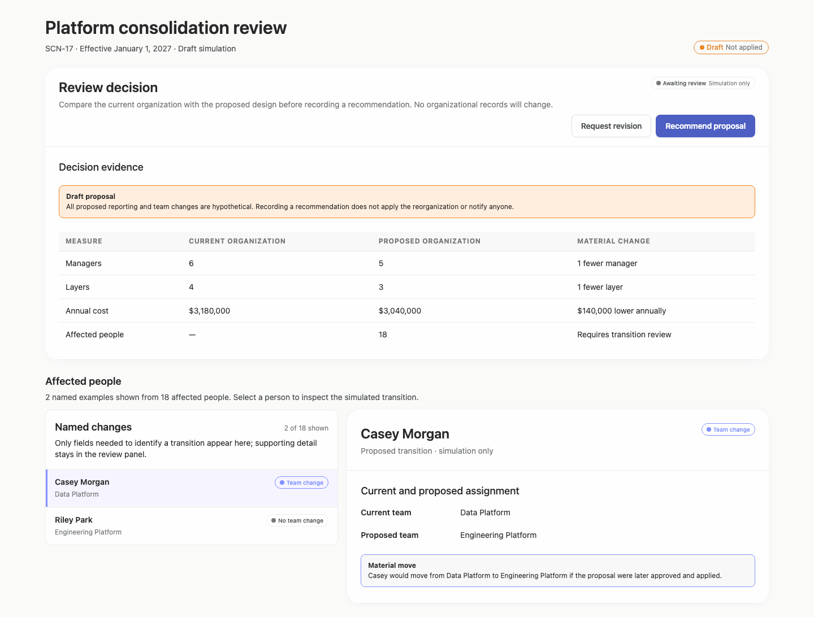
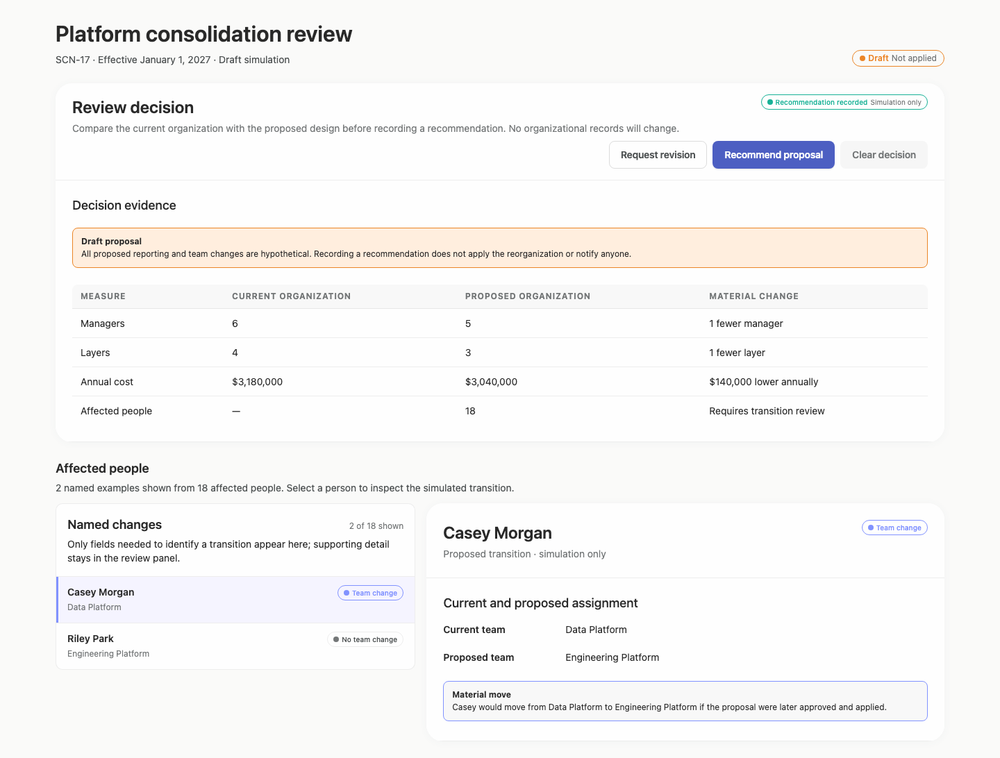
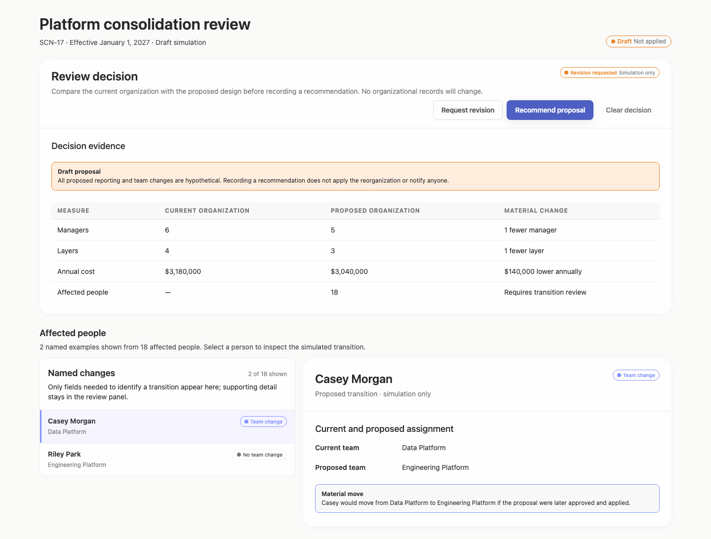
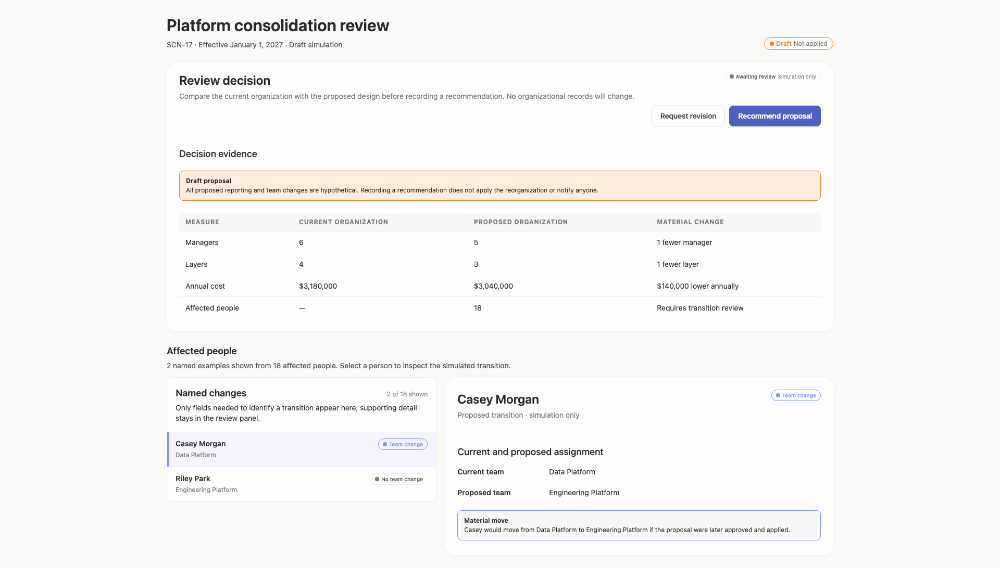
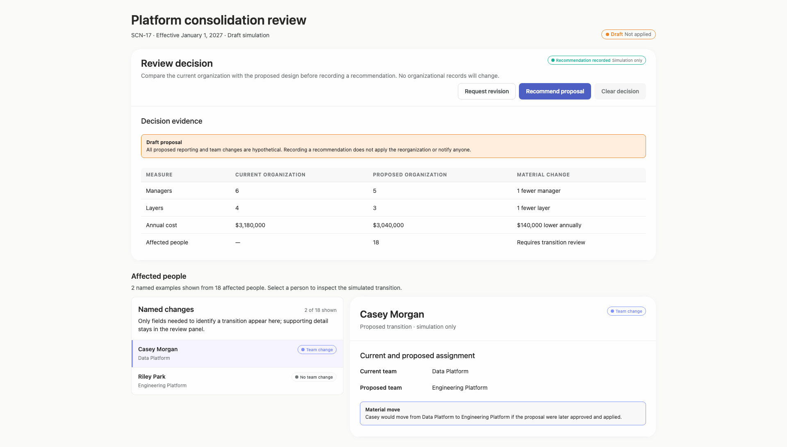
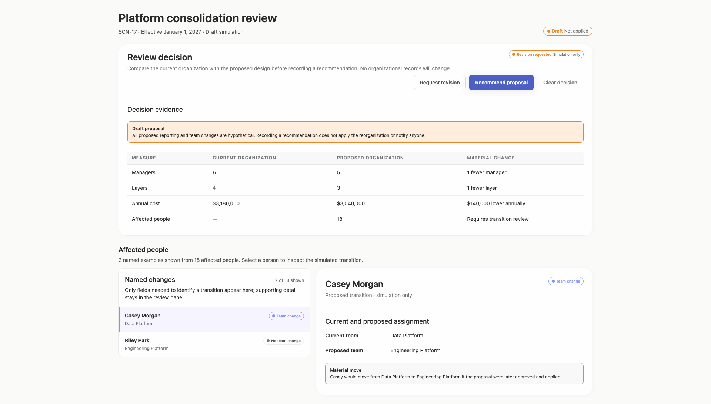
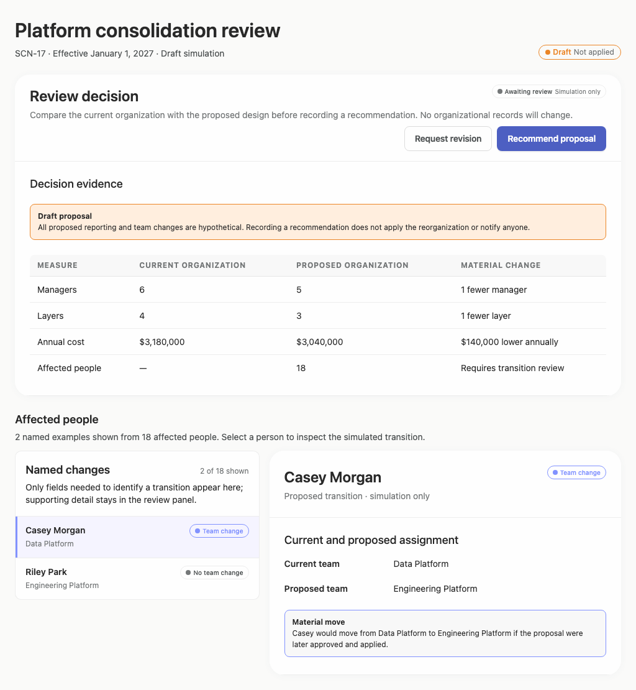
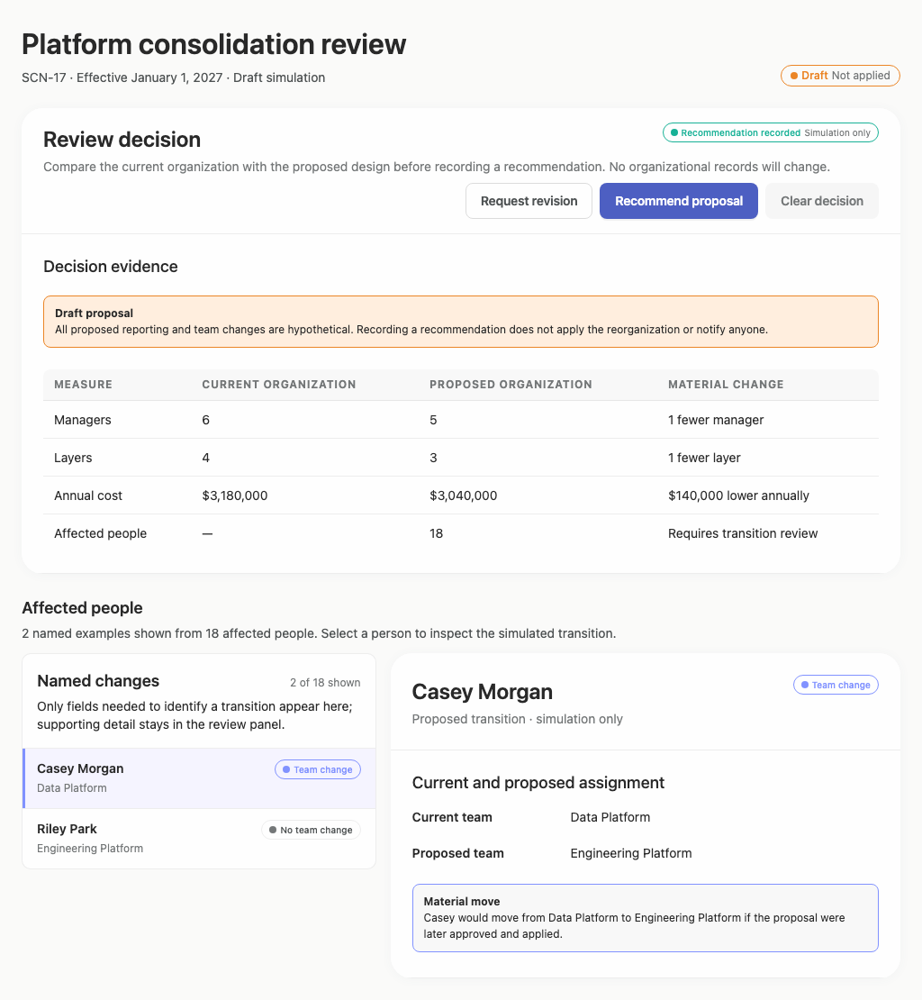
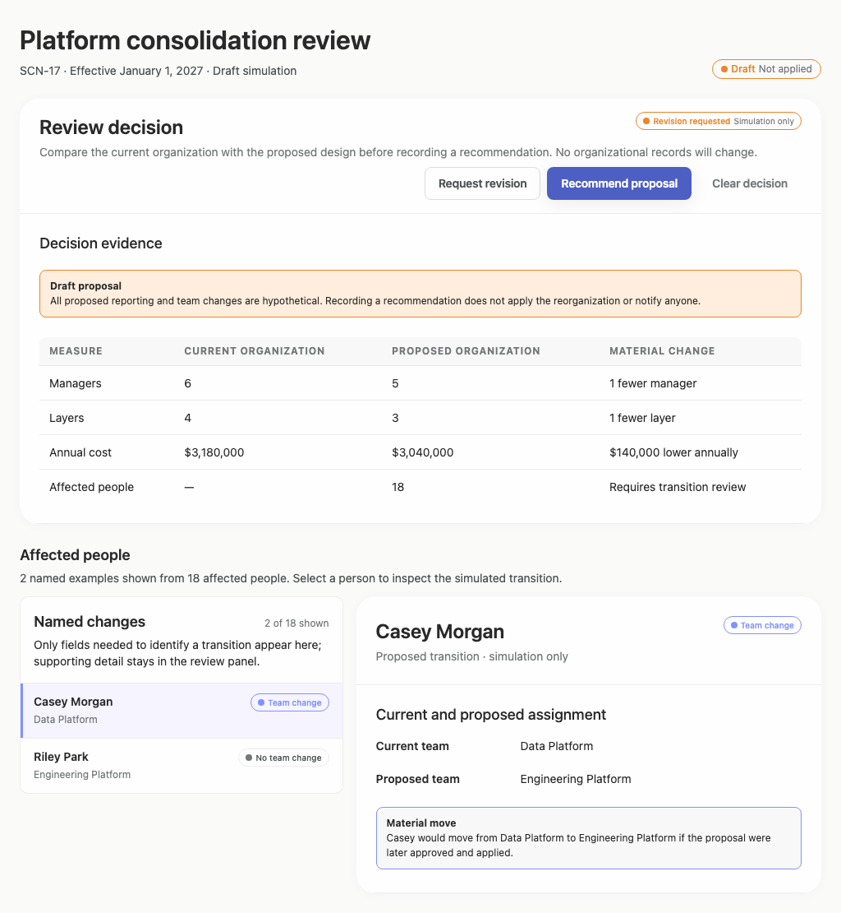

# reorganization-scenario — 2026-09-09T13:14:30.037Z

[All reports](../../README.md) · [Interactive HTML report](index.html) · [Full measurements and scoring](report.json)

GitHub renders this summary and the screenshots. Download or clone this folder to open the HTML report locally; GitHub does not serve it as a website.

**Subjective design score:** 90/100. Model: openai/gpt-5.6-sol. Rubric: 2.

**Arrusted adherence:** 99/100 (partial); evidence coverage 1.05%. Evaluator 3.

| Dimension | Conforming | Nonconforming | Unassessed | Adherence   |
| --------- | ---------- | ------------- | ---------- | ----------- |
| component | 9          | 0             | 0          | 100% (9/9)  |
| api       | 30         | 1             | 11         | 97% (30/31) |
| styling   | 6          | 0             | 4326       | 100% (6/6)  |

Scores from different evaluator versions or captured states are not directly comparable.

This report evaluates the captured preview; evaluation itself does not regenerate the app or prove a built backend. Scores are advisory and not human-calibrated.

## Ratings

| Dimension      | Score | Reason                                                                                                                                                                                                                                                                                                                                                                                                                 |
| -------------- | ----- | ---------------------------------------------------------------------------------------------------------------------------------------------------------------------------------------------------------------------------------------------------------------------------------------------------------------------------------------------------------------------------------------------------------------------- |
| hierarchy      | 4/4   | The page establishes a clear sequence from case identity and draft status to review decision, decision evidence, affected people, and individual detail. Current versus proposed values and the material-change column are especially easy to scan.                                                                                                                                                                    |
| layout         | 4/4   | Cards, table columns, action groups, and the list-detail region are consistently aligned with balanced spacing. The centered maximum width works well at 1920px, while the 1024px view remains compact and usable without horizontal clipping.                                                                                                                                                                         |
| typography     | 3/4   | Headings, body copy, labels, and numeric values are visually consistent and readable overall. Some 10–12px status tags and muted supporting text are very small, and the supplied audit reports marginal or insufficient contrast for several of these elements.                                                                                                                                                       |
| responsive     | 4/4   | The composition remains coherent across the supplied 1024px, 1440px, and 1920px desktop widths. Actions stay visible, the comparison table retains all columns, and the affected-person list and detail panel resize without overlap; ordinary document scrolling accommodates the shorter 768px viewport.                                                                                                             |
| productClarity | 3/4   | Repeated labels such as “Draft simulation,” “Draft — Not applied,” “hypothetical,” and “Simulation only” strongly prevent the proposal from appearing applied. Cost, manager, layer, and affected-person exposure are directly comparable, but only 2 of 18 affected people are exposed and the visible person detail compares teams rather than reporting lines, leaving a key review question incompletely answered. |

## Strengths

- The draft is unmistakably separated from organizational truth through redundant but useful status and explanatory language.
- The evidence table provides a concise side-by-side comparison of current organization, proposed organization, and material change, including annual cost exposure.
- Decision actions are explicit, and recorded recommendation or revision states remain labeled as simulation-only.
- The affected-person list-detail composition connects a selected individual to current and proposed assignments without implying that the move has occurred.
- The desktop layout scales cleanly from 1024px to 1920px while preserving alignment and control visibility.

## Improvements

- **high — desktop-0:** The page states that 18 people are affected but exposes only two named examples, and the selected detail shows current and proposed teams without current and proposed manager or reporting-line information. A leader therefore cannot fully inspect who is affected or compare the proposed reporting changes requested by the brief. Provide a reviewable path to all 18 affected people and include explicit current manager/reporting line and proposed manager/reporting line fields in each person’s detail, alongside the team change and material impact.
- **medium — desktop-2:** After “Revision requested” is recorded, “Recommend proposal” remains the strongest visible action while “Request revision” has no persistent selected treatment. The status pill communicates the outcome, but the action group can still read as though recommendation is the active or preferred state. Make the recorded outcome evident within the action composition using supported selected or disabled states, or relabel the available actions as changes to the existing decision while keeping the status summary adjacent.
- **low — desktop-window-0:** The compact “Team change” and “No team change” tags use very small text; the supplied accessibility evidence also flags these status treatments as low contrast. Their meaning is recoverable from surrounding content, but quick scanning is weaker in the narrower desktop panel. Use the supported medium Tag size or repeat the status as regular supporting text in the row, preserving the existing Arrusted palette and component variants.

## Token evidence

Percentages cover only assessed properties. Missing provenance and ambiguous CSS remain unassessed; matching literals are not proof of token usage.

| Viewport         | Category   | Token references / assessed | Coverage   |
| ---------------- | ---------- | --------------------------- | ---------- |
| desktop-0        | color      | 0/0                         | 0% (0/231) |
| desktop-0        | typography | 0/0                         | 0% (0/566) |
| desktop-0        | spacing    | 0/0                         | 0% (0/278) |
| desktop-0        | radius     | 0/0                         | 0% (0/118) |
| desktop-0        | border     | 0/0                         | 0% (0/129) |
| desktop-0        | shadow     | 0/0                         | 0% (0/120) |
| desktop-wide-0   | color      | 0/0                         | 0% (0/231) |
| desktop-wide-0   | typography | 0/0                         | 0% (0/566) |
| desktop-wide-0   | spacing    | 0/0                         | 0% (0/278) |
| desktop-wide-0   | radius     | 0/0                         | 0% (0/118) |
| desktop-wide-0   | border     | 0/0                         | 0% (0/129) |
| desktop-wide-0   | shadow     | 0/0                         | 0% (0/120) |
| desktop-window-0 | color      | 0/0                         | 0% (0/231) |
| desktop-window-0 | typography | 0/0                         | 0% (0/566) |
| desktop-window-0 | spacing    | 0/0                         | 0% (0/278) |
| desktop-window-0 | radius     | 0/0                         | 0% (0/118) |
| desktop-window-0 | border     | 0/0                         | 0% (0/129) |
| desktop-window-0 | shadow     | 0/0                         | 0% (0/120) |

## Latest-run screenshots

### desktop-0 — initial

Interaction: not-run.

### desktop-1 — recommend the consolidation proposal

Interaction: passed.

### desktop-2 — request a revision to the proposal

Interaction: passed.

### desktop-wide-0 — initial

Interaction: not-run.

### desktop-wide-1 — recommend the consolidation proposal

Interaction: passed.

### desktop-wide-2 — request a revision to the proposal

Interaction: passed.

### desktop-window-0 — initial

Interaction: not-run.

### desktop-window-1 — recommend the consolidation proposal

Interaction: passed.

### desktop-window-2 — request a revision to the proposal

Interaction: passed.

## Limitations

- Only Casey Morgan’s detail is visible; Riley Park’s selected detail and any additional affected-person states were not provided.
- The narrowest supplied desktop capture is 1024px, so behavior in smaller desktop windows or embedded panels is unknown.
- Screenshots and passed interaction text do not establish persistence, authorization, notifications, or whether organizational records remain unchanged in a backend.
- The contrast observations come from supplied automated evidence; no independent visual or assistive-technology testing was performed.
