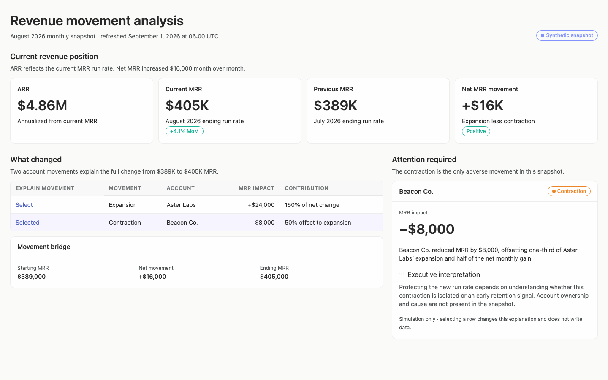
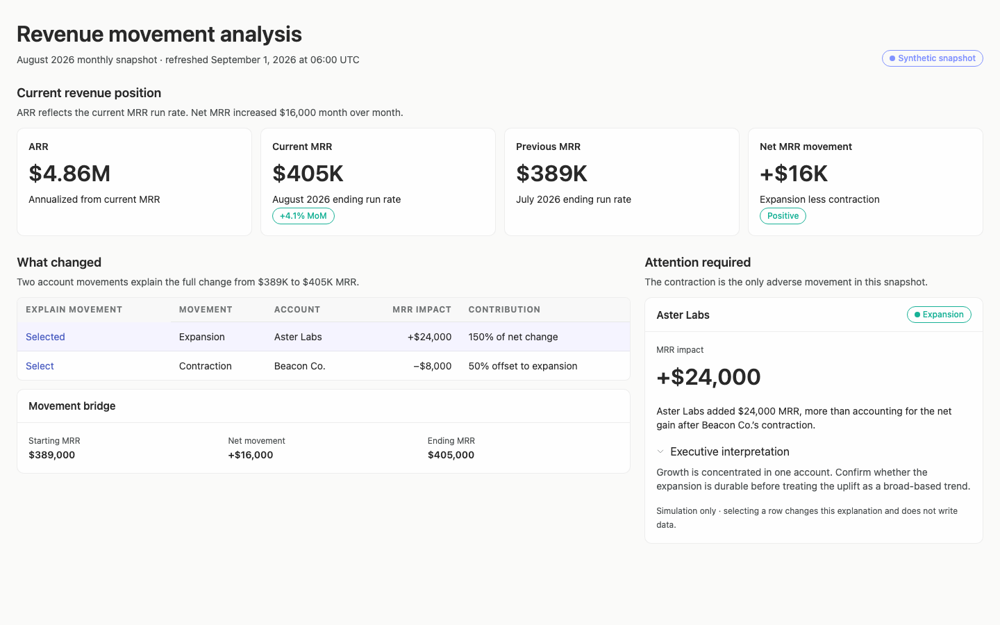
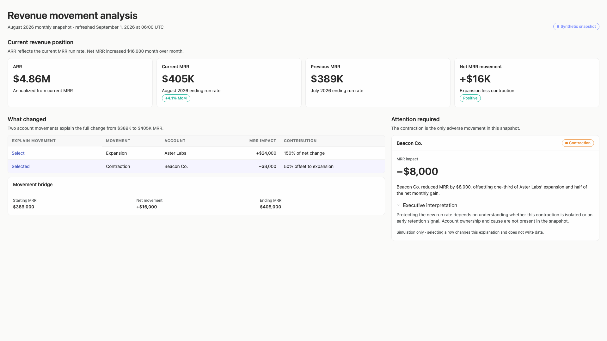
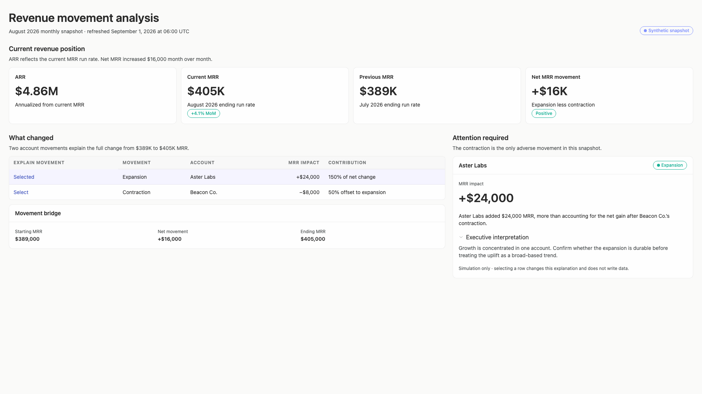
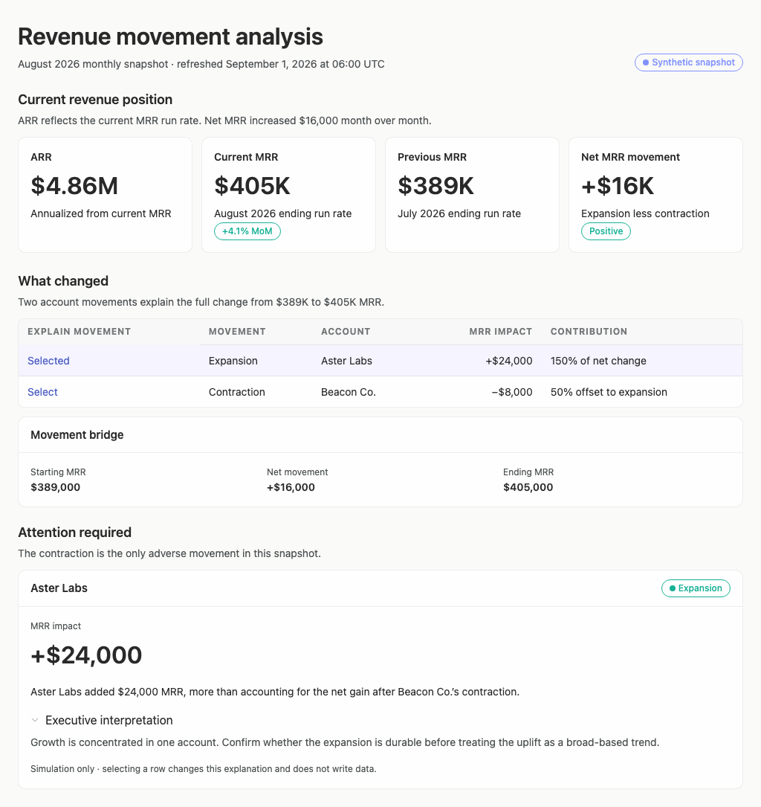
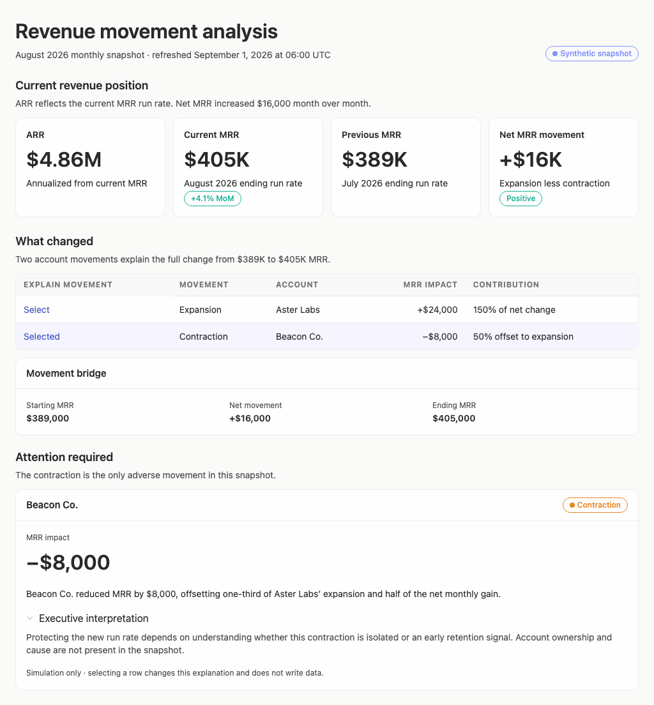

# revenue-analysis — 2026-09-09T13:19:50.277Z

[All reports](../../README.md) · [Interactive HTML report](index.html) · [Full measurements and scoring](report.json)

GitHub renders this summary and the screenshots. Download or clone this folder to open the HTML report locally; GitHub does not serve it as a website.

**Subjective design score:** 80/100. Model: openai/gpt-5.6-sol. Rubric: 2.

**Arrusted adherence:** 98/100 (partial); evidence coverage 2.29%. Evaluator 3.

| Dimension | Conforming | Nonconforming | Unassessed | Adherence    |
| --------- | ---------- | ------------- | ---------- | ------------ |
| component | 25         | 0             | 0          | 100% (25/25) |
| api       | 46         | 3             | 7          | 94% (46/49)  |
| styling   | 13         | 0             | 3712       | 100% (13/13) |

Scores from different evaluator versions or captured states are not directly comparable.

This report evaluates the captured preview; evaluation itself does not regenerate the app or prove a built backend. Scores are advisory and not human-calibrated.

## Ratings

| Dimension | Score | Reason |
| --- | --- | --- |
| hierarchy | 3/4 | The title, period/freshness line, current-position KPIs, movement explanation, and exception detail form a clear top-to-bottom executive narrative. Large monetary values and the selected-row treatment scan well, though the four equally weighted KPI cards do not strongly distinguish the primary current outcome from comparison and explanatory measures. |
| layout | 3/4 | Cards, table columns, section edges, and the two-column analysis area are consistently aligned with comfortable density. The 1024px composition sensibly stacks the attention panel, but the 1920px version stretches content across nearly the entire window, producing long lines and more horizontal scanning than necessary. |
| typography | 3/4 | Heading levels, monetary figures, labels, and explanatory prose are visually consistent and readable. Some 12px metadata, table headers, and outlined pill text are comparatively delicate; automated evidence also flags advisory contrast concerns for these small elements, although the palette itself remains authoritative. |
| responsive | 4/4 | The composition remains usable at the supplied 1024px, 1440px, and 1920px desktop widths without horizontal overflow or clipped controls. At 1024px the secondary panel moves below the movement content in a logical reading order; the resulting vertical document scroll is reasonable for a desktop window. |
| productClarity | 3/4 | Current ARR/MRR, previous MRR, net movement, period, refresh time, synthetic source status, and the two account-level causes are explicit. Row selection demonstrably updates the detail explanation, but selecting Expansion leaves the surrounding copy saying the contraction is the only item requiring attention, creating a mismatch between section purpose and displayed detail. |

## Strengths

- The current snapshot is immediately understandable: ARR, current MRR, previous MRR, and net change are presented together with concise definitions.
- The movement table reconciles the full $16,000 net increase through a +$24,000 expansion and −$8,000 contraction, including contribution context.
- Period and freshness are unusually clear for an executive snapshot: August 2026 and the September 1, 2026 06:00 UTC refresh time appear directly under the title.
- The selected account detail adds decision-oriented interpretation rather than merely repeating the table value.
- The synthetic nature of the data and the non-writing simulation behavior are disclosed.

## Improvements

- **high — desktop-1:** After Expansion is selected, the section still reads “Attention required” and “The contraction is the only adverse movement,” while the card displays Aster Labs’ positive expansion. The selected content therefore conflicts with the section’s stated purpose and can mislead an executive about which exception currently requires follow-up. Either keep the adverse contraction pinned in this section and show selected movement details elsewhere, or make the section heading and supporting sentence dynamic—for example, “Selected movement” for Expansion and “Attention required” for Contraction.
- **medium — desktop-0:** ARR, Current MRR, Previous MRR, and Net MRR movement receive identical card size and visual weight. The executive can read them, but the primary current position is not as decisively separated from comparison and explanatory measures as the brief’s central question suggests. Give Current MRR or the paired ARR/current-MRR outcome greater compositional emphasis, then treat Previous MRR and Net movement as supporting context through grouping, ordering, or a smaller secondary row.
- **low — desktop-wide-0:** At 1920px the interface expands almost edge to edge. Wide KPI cards, a very broad movement table, and long detail lines increase eye travel without adding information density. Use a centered content measure or cap the width of the analytical region while preserving the existing two-column relationship; distribute any remaining space around the composition rather than inside every card and text line.
- **low — desktop-0:** The small outlined “Synthetic snapshot” pill is important source context but is visually subtle, and automated evidence reports weak contrast for its 12px text. This makes source status easier to overlook than the adjacent period and freshness text. Use the supported larger Tag size where available, or repeat “synthetic snapshot” in the nearby plain-language metadata line while retaining the authoritative palette.

## Token evidence

Percentages cover only assessed properties. Missing provenance and ambiguous CSS remain unassessed; matching literals are not proof of token usage.

| Viewport         | Category   | Token references / assessed | Coverage   |
| ---------------- | ---------- | --------------------------- | ---------- |
| desktop-0        | color      | 0/0                         | 0% (0/194) |
| desktop-0        | typography | 0/0                         | 0% (0/490) |
| desktop-0        | spacing    | 0/0                         | 0% (0/242) |
| desktop-0        | radius     | 0/0                         | 0% (0/100) |
| desktop-0        | border     | 0/0                         | 0% (0/111) |
| desktop-0        | shadow     | 0/0                         | 0% (0/100) |
| desktop-wide-0   | color      | 0/0                         | 0% (0/194) |
| desktop-wide-0   | typography | 0/0                         | 0% (0/490) |
| desktop-wide-0   | spacing    | 0/0                         | 0% (0/242) |
| desktop-wide-0   | radius     | 0/0                         | 0% (0/100) |
| desktop-wide-0   | border     | 0/0                         | 0% (0/111) |
| desktop-wide-0   | shadow     | 0/0                         | 0% (0/100) |
| desktop-window-0 | color      | 0/0                         | 0% (0/194) |
| desktop-window-0 | typography | 0/0                         | 0% (0/490) |
| desktop-window-0 | spacing    | 0/0                         | 0% (0/242) |
| desktop-window-0 | radius     | 0/0                         | 0% (0/100) |
| desktop-window-0 | border     | 0/0                         | 0% (0/111) |
| desktop-window-0 | shadow     | 0/0                         | 0% (0/100) |

## Latest-run screenshots

### desktop-0 — initial

Interaction: not-run.

### desktop-1 — selecting expansion updates the attention explanation

Interaction: passed.

### desktop-2 — switching back to contraction restores its explanation

Interaction: passed.

### desktop-wide-0 — initial

Interaction: not-run.

### desktop-wide-1 — selecting expansion updates the attention explanation

Interaction: passed.

### desktop-wide-2 — switching back to contraction restores its explanation

Interaction: passed.

### desktop-window-0 — initial

Interaction: not-run.

### desktop-window-1 — selecting expansion updates the attention explanation

Interaction: passed.

### desktop-window-2 — switching back to contraction restores its explanation

Interaction: passed.

## Limitations

- Only the supplied initial and row-selection screenshots were evaluated; disclosure collapse behavior and other interaction states were not tested.
- Desktop widths of 1024px, 1440px, and 1920px were shown, but intermediate or narrower desktop panels were not provided.
- The 1024px captures represent the full scrolled document rather than a single 768px viewport, so below-the-fold sequencing is visible but exact in-viewport prominence cannot be fully judged.
- Screenshots cannot establish live data freshness, backend behavior, or persistence; freshness and source were assessed only from displayed labels.
- Contrast observations are advisory and do not imply that the authoritative Arrusted palette should be replaced or overridden.
