# spend-import-review — 2026-09-09T13:22:44.628Z

[All reports](../../README.md) · [Interactive HTML report](index.html) · [Full measurements and scoring](report.json)

GitHub renders this summary and the screenshots. Download or clone this folder to open the HTML report locally; GitHub does not serve it as a website.

**Subjective design score:** 75/100. Model: openai/gpt-5.6-sol. Rubric: 2.

**Arrusted adherence:** 96/100 (partial); evidence coverage 2.76%. Evaluator 3.

| Dimension | Conforming | Nonconforming | Unassessed | Adherence    |
| --------- | ---------- | ------------- | ---------- | ------------ |
| component | 30         | 0             | 7          | 100% (30/30) |
| api       | 47         | 7             | 20         | 87% (47/54)  |
| styling   | 28         | 0             | 3918       | 100% (28/28) |

Scores from different evaluator versions or captured states are not directly comparable.

This report evaluates the captured preview; evaluation itself does not regenerate the app or prove a built backend. Scores are advisory and not human-calibrated.

## Ratings

| Dimension | Score | Reason |
| --- | --- | --- |
| hierarchy | 3/4 | The three-step rail, page title, current-state treatments, preview counts, and exception-detail sections establish clear priorities. The source evidence, exception reason, and bounded next action are especially easy to scan, though narrow-window summary pills wrap awkwardly and some small status labels lose emphasis. |
| layout | 3/4 | Mapping rows align source samples directly with destination fields, the preview table is compact, and the wide exception view keeps the queue beside the selected record. Spacing is consistent, but the 1024px preview clips the import-result column and the review action area sits far down a long document. |
| typography | 3/4 | Titles, section headings, field labels, and values use a consistent, readable hierarchy. Secondary metadata and several 10–12px status or caption labels are comparatively faint and small; automated evidence also flags recurring advisory contrast concerns for these labels. |
| responsive | 3/4 | The composition works at 1024, 1440, and 1920px: mapping controls contract, the wide list-detail review becomes a focused detail view with a Back control, and primary actions remain usable. The 1024px preview relies on horizontal scrolling and visibly truncates the rightmost result content, preventing an excellent score. |
| productClarity | 3/4 | Reviewers can verify mappings, inspect representative changes before saving, see the 38-ready/4-review split, and receive an explicit saved outcome. Exception detail keeps immutable raw values, provenance, the ambiguity explanation, two bounded vendor choices, and a defer option together. However, Apply appears available without a visible selection, and the tested chosen-match path produced no visible confirmation. |

## Strengths

- The workflow directly answers the brief with mapping, preview, save outcome, and exception-review stages.
- Sample source values remain beside each mapping, making field verification concrete rather than abstract.
- The preview clearly distinguishes 38 ready rows from 4 rows needing review and offers a route back to mapping before saving.
- The saved state explicitly states that 38 rows were imported and 4 remain in human review rather than implying full reconciliation.
- Exception detail clearly labels the original source row as preserved evidence and shows batch, source, raw vendor, amount, date, and source reference.
- The ambiguity is explicit: two candidate identities are described with differentiating evidence, while Leave unresolved provides a bounded alternative.
- Wide and constrained desktop layouts adapt thoughtfully; the constrained review preserves a focused detail experience with a clear route back to exception rows.

## Improvements

- **medium — desktop-window-1:** At the 1024px desktop window, the preview table’s rightmost Import result column is visibly cut off and requires horizontal scrolling. This hides the most decision-relevant result for several rows during pre-save review. Use the compact table density and rebalance column widths, or move lower-priority source metadata into a secondary line so Import result remains visible. If horizontal scrolling is retained, provide a clear, keyboard-accessible scroll affordance.
- **low — desktop-window-1:** The 38 ready and 4 need review summaries wrap into tall, nearly circular pills at this width, making the counts less immediately scannable than in the wider captures. Place the status summary in a wrapping row beneath the preview heading or allocate it a wider column, preserving the existing supported pill variants and palette.
- **high — desktop-3:** Neither vendor option has a visible selected state, yet Apply simulated decision appears available. The supplied interaction for recording a chosen match also failed to produce the expected confirmation, leaving the reviewer uncertain whether a correction was recorded. Keep Apply disabled until one candidate is visibly selected. After applying, show persistent inline confirmation, update the selected row’s status and remaining count, and retain the original source section unchanged.
- **medium — desktop-4:** After the row is marked Deferred and an inline follow-up message appears, Leave unresolved and Apply simulated decision remain presented with the same prominence. This makes it unclear whether the defer action can be repeated or whether a new candidate choice is required to change the decision. Treat Deferred as a recorded decision state: disable or relabel the repeated defer action, and only enable Apply after a candidate is selected to replace that decision.
- **low — desktop-3:** Exception-row provenance is useful, but dates, references, and Needs review badges are rendered in very small secondary text. The automated evidence repeatedly flags these captions and badges as difficult to read against their surfaces. Use the supported medium Tag size or a primary-emphasis label treatment for decision-critical status text, and reduce reliance on tiny captions without changing the authoritative palette.

## Token evidence

Percentages cover only assessed properties. Missing provenance and ambiguous CSS remain unassessed; matching literals are not proof of token usage.

| Viewport         | Category   | Token references / assessed | Coverage   |
| ---------------- | ---------- | --------------------------- | ---------- |
| desktop-0        | color      | 0/0                         | 0% (0/209) |
| desktop-0        | typography | 0/0                         | 0% (0/520) |
| desktop-0        | spacing    | 0/0                         | 0% (0/241) |
| desktop-0        | radius     | 0/0                         | 0% (0/107) |
| desktop-0        | border     | 0/0                         | 0% (0/122) |
| desktop-0        | shadow     | 0/0                         | 0% (0/107) |
| desktop-wide-0   | color      | 0/0                         | 0% (0/209) |
| desktop-wide-0   | typography | 0/0                         | 0% (0/520) |
| desktop-wide-0   | spacing    | 0/0                         | 0% (0/241) |
| desktop-wide-0   | radius     | 0/0                         | 0% (0/107) |
| desktop-wide-0   | border     | 0/0                         | 0% (0/122) |
| desktop-wide-0   | shadow     | 0/0                         | 0% (0/107) |
| desktop-window-0 | color      | 0/0                         | 0% (0/209) |
| desktop-window-0 | typography | 0/0                         | 0% (0/520) |
| desktop-window-0 | spacing    | 0/0                         | 0% (0/241) |
| desktop-window-0 | radius     | 0/0                         | 0% (0/107) |
| desktop-window-0 | border     | 0/0                         | 0% (0/122) |
| desktop-window-0 | shadow     | 0/0                         | 0% (0/107) |

## Latest-run screenshots

### desktop-0 — initial

Interaction: not-run.

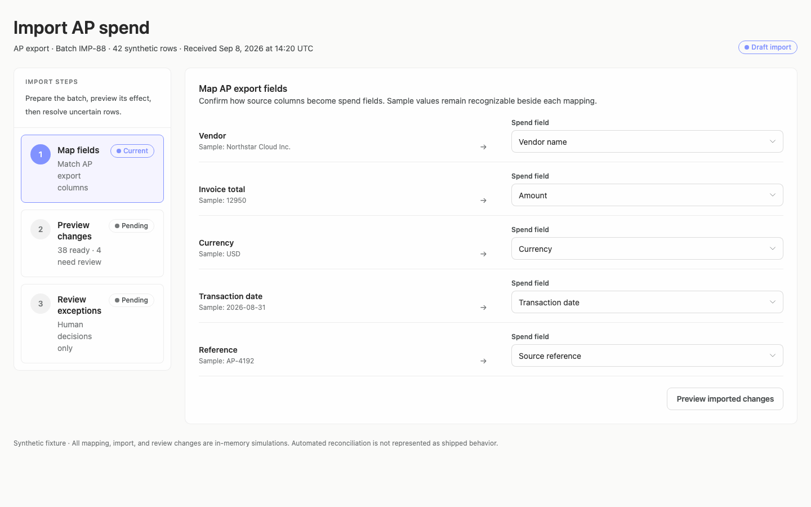

### desktop-1 — inspect mapped import preview

Interaction: passed.

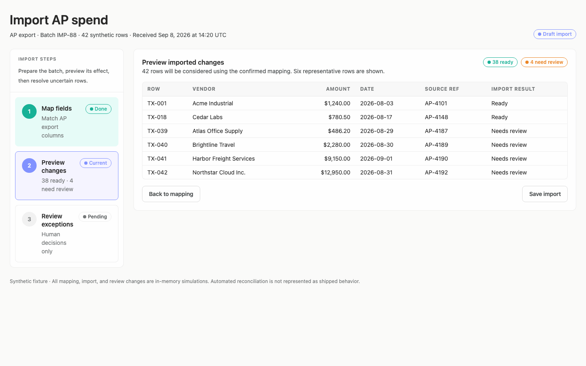

### desktop-2 — save identifies imported and unresolved counts

Interaction: passed.

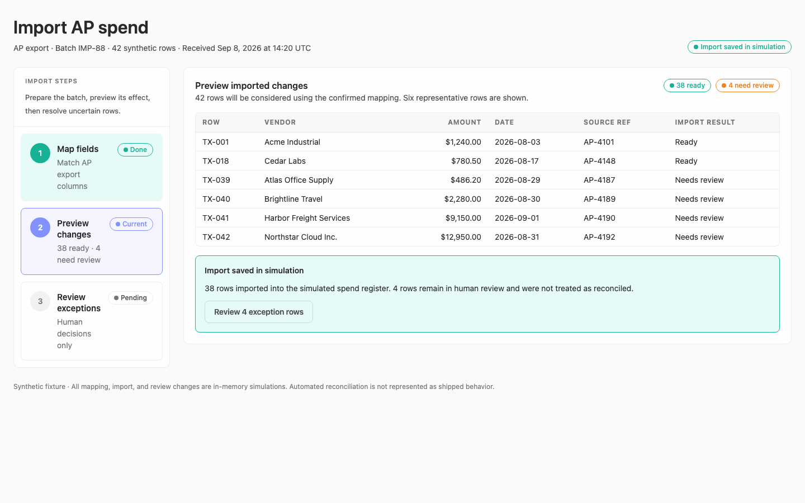

### desktop-3 — record a chosen vendor match

Interaction: failed.

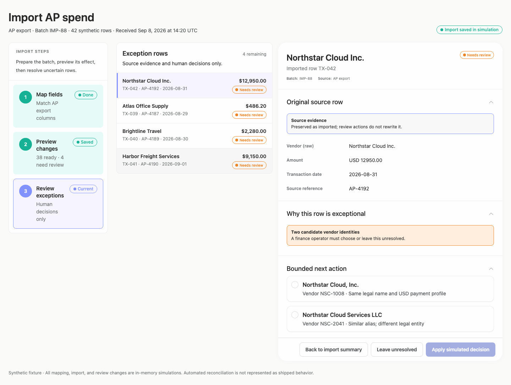

### desktop-4 — retain uncertain match for follow-up

Interaction: passed.

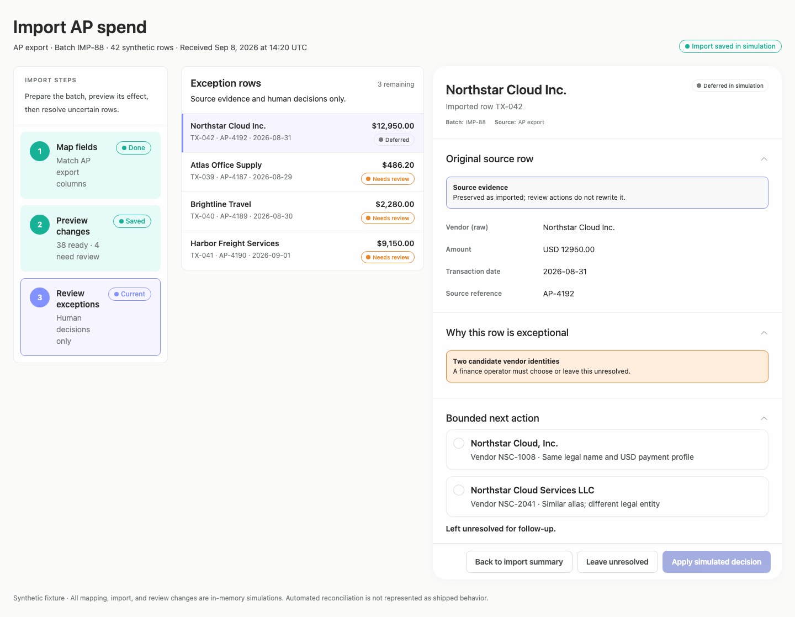

### desktop-wide-0 — initial

Interaction: not-run.

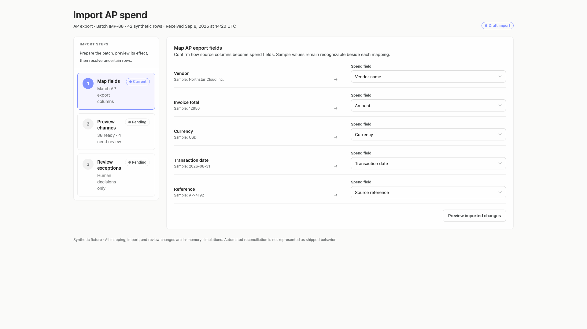

### desktop-wide-1 — inspect mapped import preview

Interaction: passed.

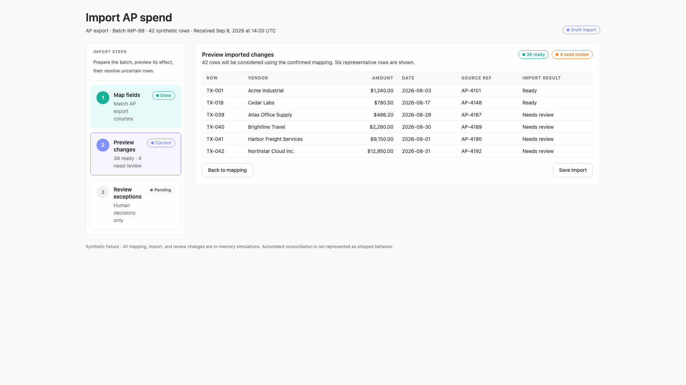

### desktop-wide-2 — save identifies imported and unresolved counts

Interaction: passed.

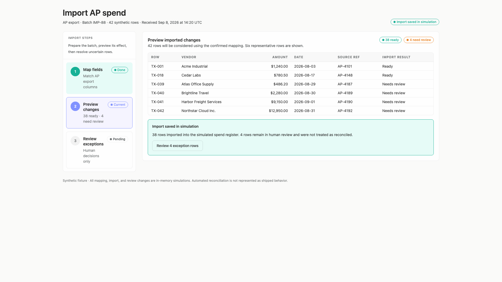

### desktop-wide-3 — record a chosen vendor match

Interaction: failed.

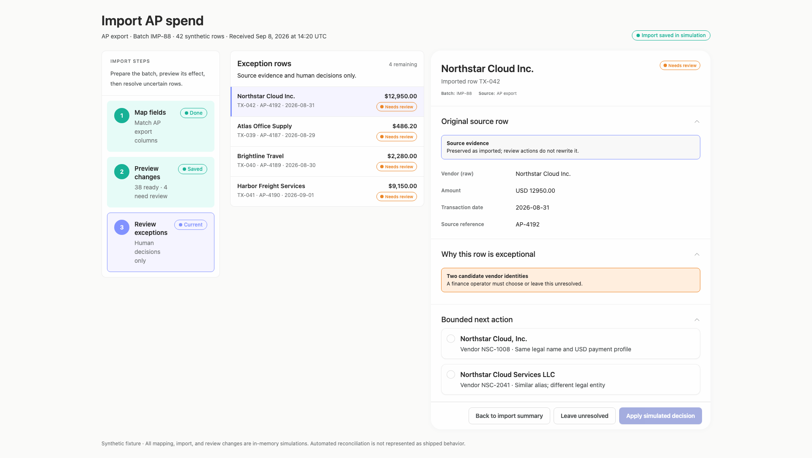

### desktop-wide-4 — retain uncertain match for follow-up

Interaction: passed.

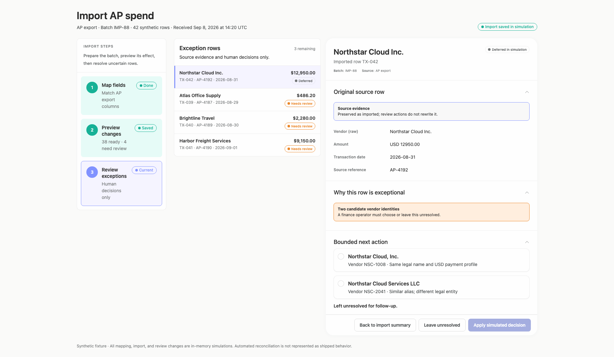

### desktop-window-0 — initial

Interaction: not-run.

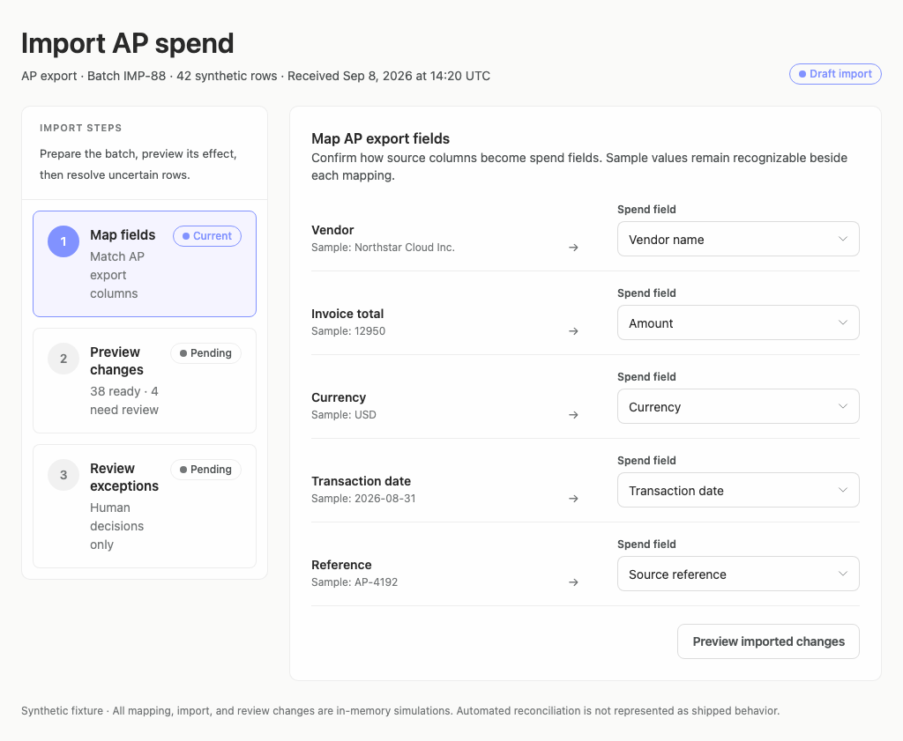

### desktop-window-1 — inspect mapped import preview

Interaction: passed.

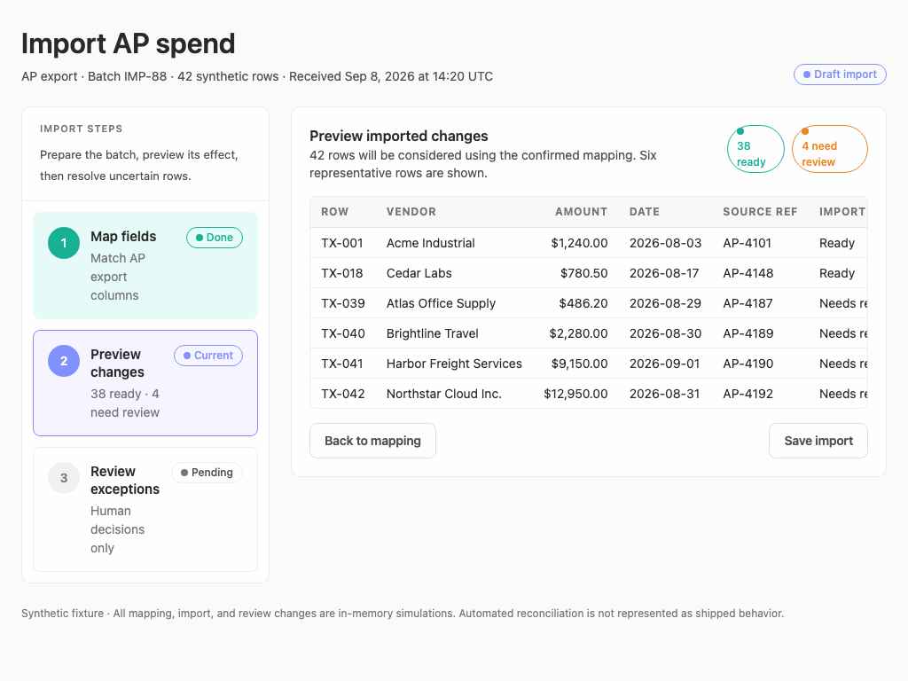

### desktop-window-2 — save identifies imported and unresolved counts

Interaction: passed.

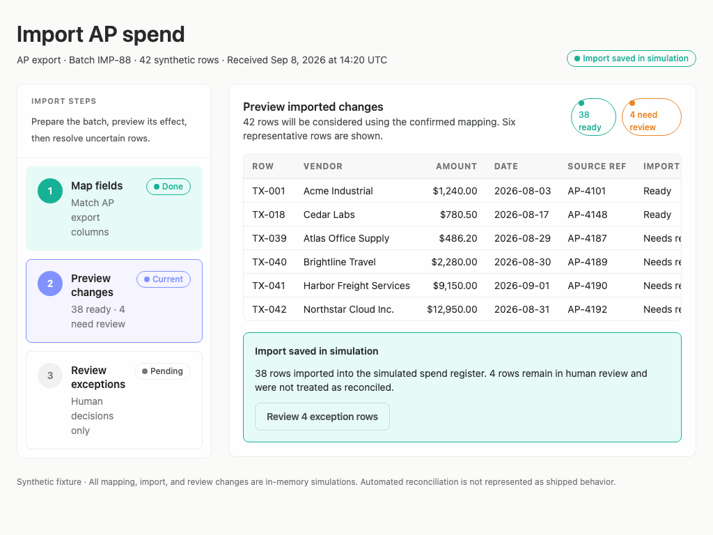

### desktop-window-3 — record a chosen vendor match

Interaction: failed.

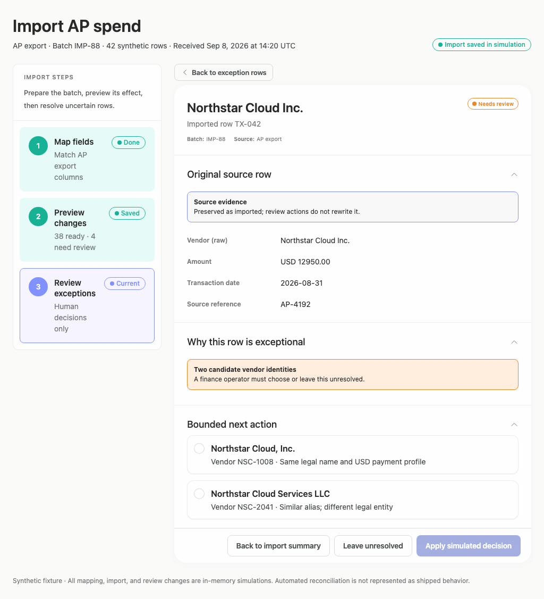

### desktop-window-4 — retain uncertain match for follow-up

Interaction: passed.

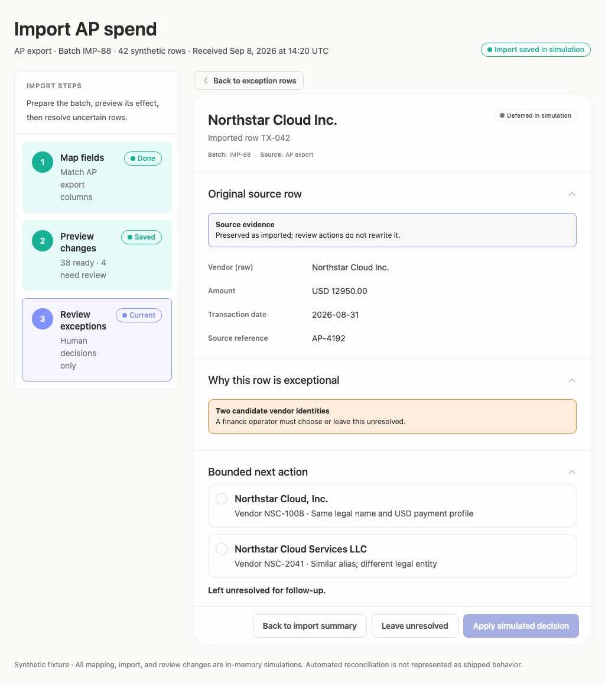

## Limitations

- No capture demonstrates a successfully recorded vendor match; the supplied interaction for that state failed, so the post-apply visual design cannot be verified.
- Only 1024px, 1440px, and 1920px desktop windows were supplied; behavior in other desktop panels is untested.
- Screenshots and interaction text do not prove persistence, authorization, or backend behavior.
- The captures show a synthetic simulation, so production-specific error, loading, empty, and save-failure states were not assessed.
- Static source diagnostics and adherence measurements were treated separately from the product-design judgment and do not prove which dynamic branches rendered.
