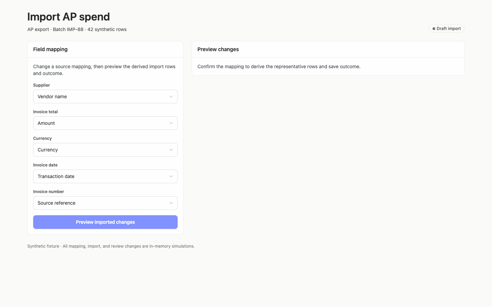
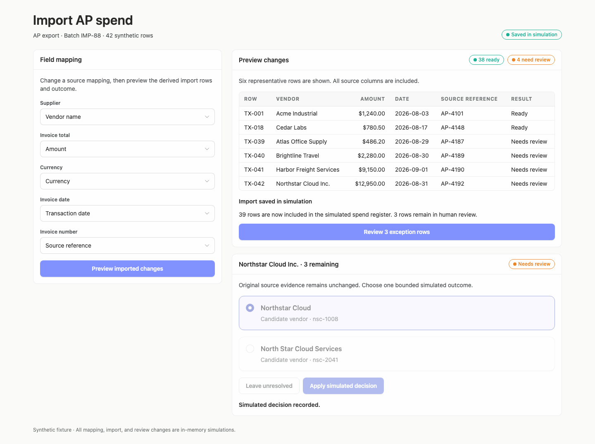
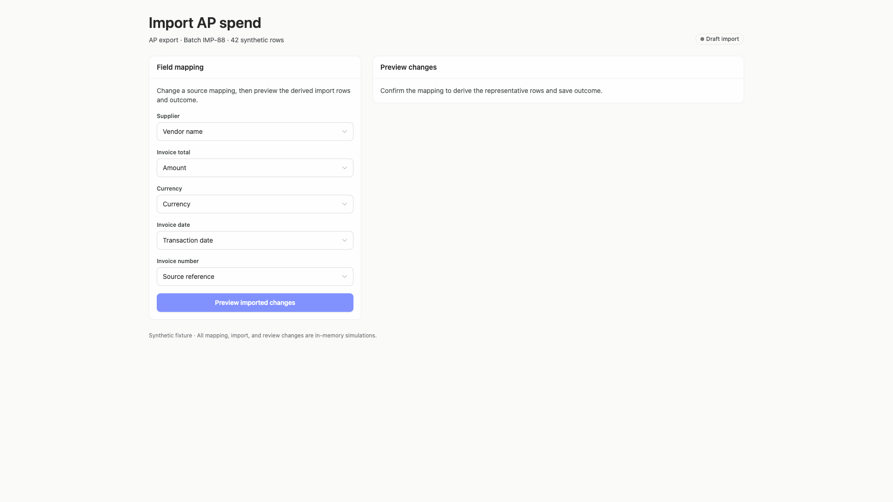
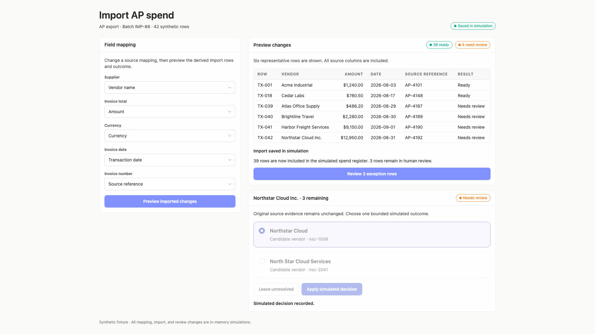
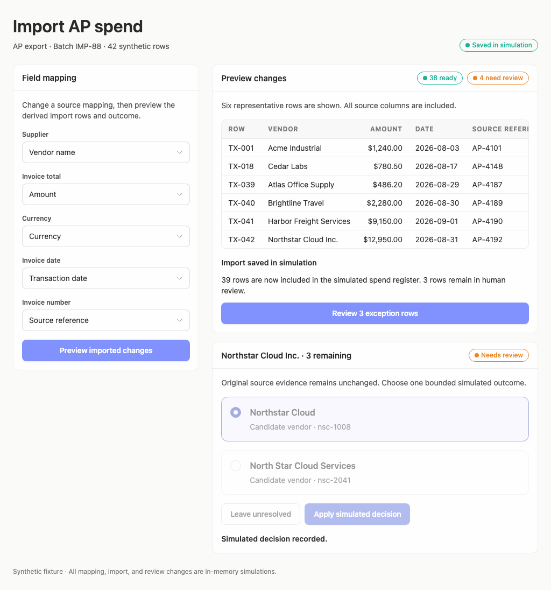

# spend-import-review-recurring-reference — 2026-09-09T14:25:30.877Z

[All reports](../../README.md) · [Interactive HTML report](index.html) · [Full measurements and scoring](report.json)

GitHub renders this summary and the screenshots. Download or clone this folder to open the HTML report locally; GitHub does not serve it as a website.

**Subjective design score:** 65/100. Model: openai/gpt-5.6-sol. Rubric: 2.

**Arrusted adherence:** 88/100 (partial); evidence coverage 3.12%. Evaluator 3.

| Dimension | Conforming | Nonconforming | Unassessed | Adherence    |
| --------- | ---------- | ------------- | ---------- | ------------ |
| component | 26         | 0             | 4          | 100% (26/26) |
| api       | 20         | 11            | 21         | 65% (20/31)  |
| styling   | 12         | 0             | 2121       | 100% (12/12) |

Scores from different evaluator versions or captured states are not directly comparable.

This report evaluates the captured preview; evaluation itself does not regenerate the app or prove a built backend. Scores are advisory and not human-calibrated.

## Ratings

| Dimension      | Score | Reason                                                                                                                                                                                                                                                                                                                                                               |
| -------------- | ----- | -------------------------------------------------------------------------------------------------------------------------------------------------------------------------------------------------------------------------------------------------------------------------------------------------------------------------------------------------------------------- |
| hierarchy      | 3/4   | The page title, batch context, field-mapping panel, preview panel, and exception card establish a clear task sequence, while ready/review badges make status scannable. Hierarchy weakens after a decision because “Needs review” and “Simulated decision recorded” remain visible together.                                                                         |
| layout         | 3/4   | Cards, form controls, headings, and actions use consistent alignment and spacing at 1440px and 1920px. The initial view is somewhat left-heavy, and at 1024px the two-column composition leaves the preview table narrow enough to require horizontal scrolling.                                                                                                     |
| typography     | 3/4   | The large page heading, medium-weight section titles, labels, and tabular values are visually consistent and generally readable. Several 12px captions, table headers, and status labels are comparatively faint or compact, as reflected in the reported contrast advisories.                                                                                       |
| responsive     | 2/4   | The centered composition and form controls remain usable across the provided 1024px, 1440px, and 1920px desktop windows. At 1024px, however, the preview remains beside the mapping form, producing a 572px-wide horizontally scrolling table whose Result column is initially offscreen; the completed state also extends to a 1096px document height.              |
| productClarity | 2/4   | Mapping labels, representative rows, ready/review counts, the import outcome, and bounded vendor choices are understandable. Two brief-critical gaps remain: the only initial action is labeled as a preview but the next supplied state is already saved, and the exception card does not repeat the immutable source row details alongside the correction choices. |

## Strengths

- Field mappings are presented as a concise, clearly labeled set of source-to-spend selections.
- The preview includes representative transaction rows, source references, results, and aggregate ready/review counts.
- The save outcome explicitly states that 39 rows were included and 3 remain in human review.
- Vendor correction is bounded to candidate selection, leaving the item unresolved, or applying the selected decision.
- The interface explicitly states that original source evidence remains unchanged and uses consistent cards and status badges across desktop widths.

## Improvements

- **high — desktop-0:** “Preview imported changes” is the only visible progression action, yet the next supplied state says the import has already been saved. The presented sequence therefore does not visibly let the reviewer inspect a populated preview and then make a separate save decision. Keep this action limited to generating the preview. Once rows are shown, place a distinct “Save import” action in the preview panel, with an appropriate supported disabled state until a valid preview exists.
- **high — desktop-1:** The uncertain-match card provides candidate vendors and bounded actions, but the source transaction is represented only by the vendor name in its heading. Amount, date, row identifier, and source reference remain in the table above rather than being available together with the decision. Add a compact, read-only “Original source row” summary inside the exception card showing row ID, source vendor text, amount, date, and source reference above the candidate choices. Visually distinguish this evidence from the editable decision without altering it.
- **medium — desktop-wide-1:** The card simultaneously shows a “Needs review” badge and “Simulated decision recorded.” Although the aggregate count changes to three remaining, the current item’s final status is ambiguous. After applying a decision, either mark the displayed item as resolved/recorded with its choice shown read-only, or advance to the next unresolved item. Provide a clear next-exception action if the current record remains on screen.
- **medium — desktop-window-1:** At the 1024px desktop window, the preview table horizontally overflows and the Result column is initially outside the visible region. This separates exception status from the source row during scanning. At this desktop width, stack mapping above preview or use a more compact row composition that keeps row ID, vendor, source reference, and result visible together. If horizontal scrolling remains intentional, add an obvious scroll cue and preserve key status information outside the scrolling edge.

## Token evidence

Percentages cover only assessed properties. Missing provenance and ambiguous CSS remain unassessed; matching literals are not proof of token usage.

| Viewport         | Category   | Token references / assessed | Coverage   |
| ---------------- | ---------- | --------------------------- | ---------- |
| desktop-0        | color      | 0/0                         | 0% (0/115) |
| desktop-0        | typography | 0/0                         | 0% (0/275) |
| desktop-0        | spacing    | 0/0                         | 0% (0/134) |
| desktop-0        | radius     | 0/0                         | 0% (0/58)  |
| desktop-0        | border     | 0/0                         | 0% (0/67)  |
| desktop-0        | shadow     | 0/0                         | 0% (0/58)  |
| desktop-wide-0   | color      | 0/0                         | 0% (0/115) |
| desktop-wide-0   | typography | 0/0                         | 0% (0/275) |
| desktop-wide-0   | spacing    | 0/0                         | 0% (0/134) |
| desktop-wide-0   | radius     | 0/0                         | 0% (0/58)  |
| desktop-wide-0   | border     | 0/0                         | 0% (0/67)  |
| desktop-wide-0   | shadow     | 0/0                         | 0% (0/58)  |
| desktop-window-0 | color      | 0/0                         | 0% (0/115) |
| desktop-window-0 | typography | 0/0                         | 0% (0/275) |
| desktop-window-0 | spacing    | 0/0                         | 0% (0/134) |
| desktop-window-0 | radius     | 0/0                         | 0% (0/58)  |
| desktop-window-0 | border     | 0/0                         | 0% (0/67)  |
| desktop-window-0 | shadow     | 0/0                         | 0% (0/58)  |

## Latest-run screenshots

### desktop-0 — initial

Interaction: not-run.

### desktop-1 — map, save, and resolve a synthetic vendor match

Interaction: passed.

### desktop-wide-0 — initial

Interaction: not-run.

### desktop-wide-1 — map, save, and resolve a synthetic vendor match

Interaction: passed.

### desktop-window-0 — initial

Interaction: not-run.

### desktop-window-1 — map, save, and resolve a synthetic vendor match

Interaction: passed.

## Limitations

- Only the supplied initial and post-interaction screenshots were evaluated; no intermediate preview-before-save state was provided.
- The screenshots do not demonstrate dropdown menus, alternate mapping values, the unresolved path, or navigation across all exception rows.
- The interaction evidence is explicitly synthetic and does not establish production backend behavior or persistence.
- The reported accessibility checks and source measurements are supporting evidence; this review scores product-interface composition rather than implementation or Arrusted API compliance.
