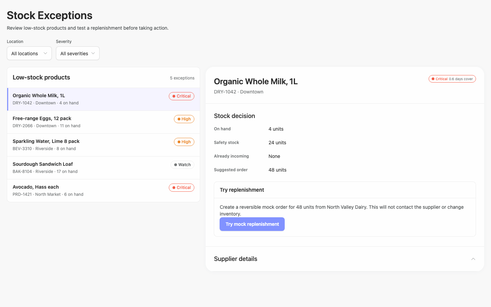
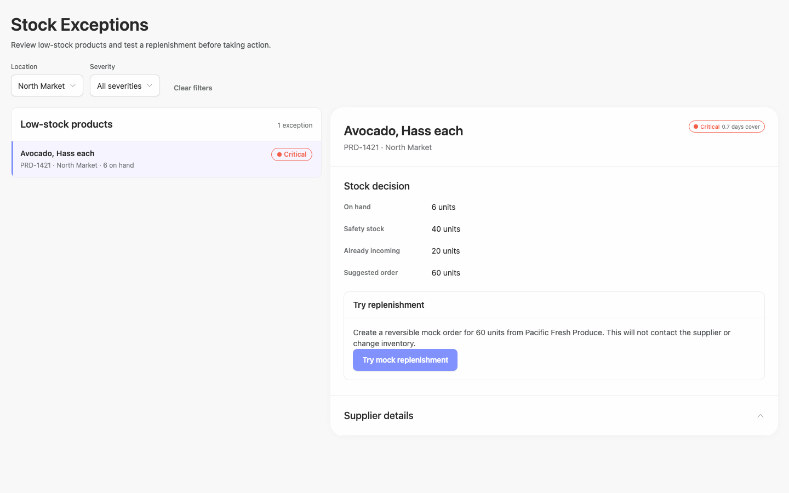
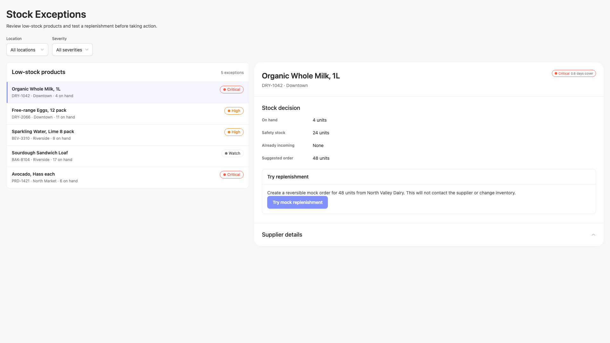
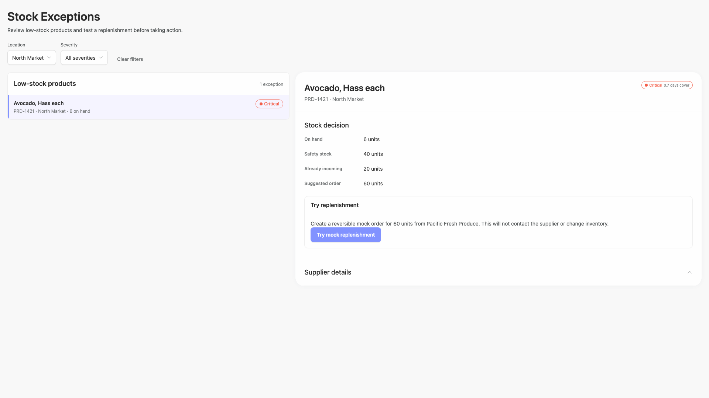
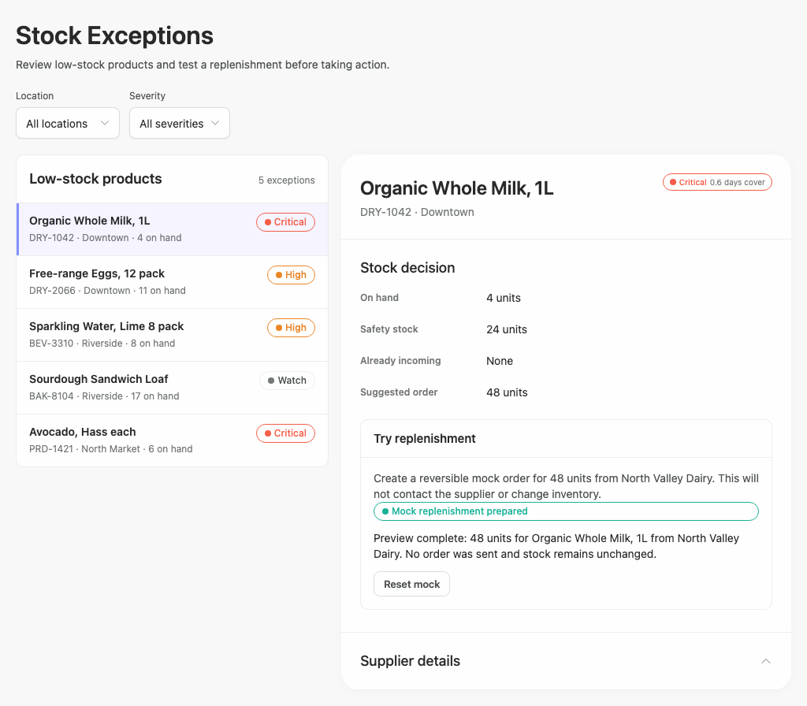
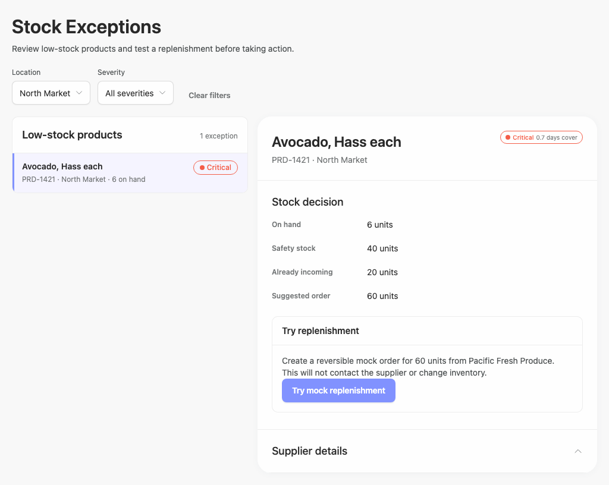
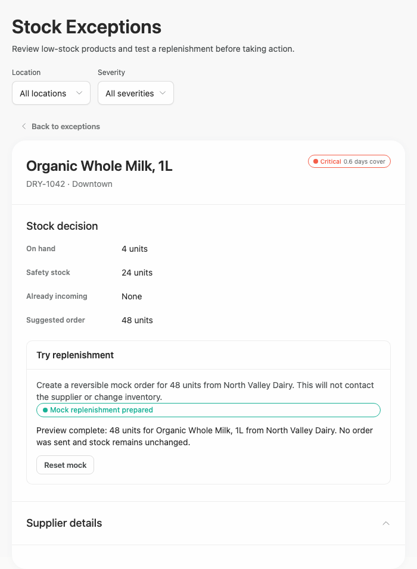
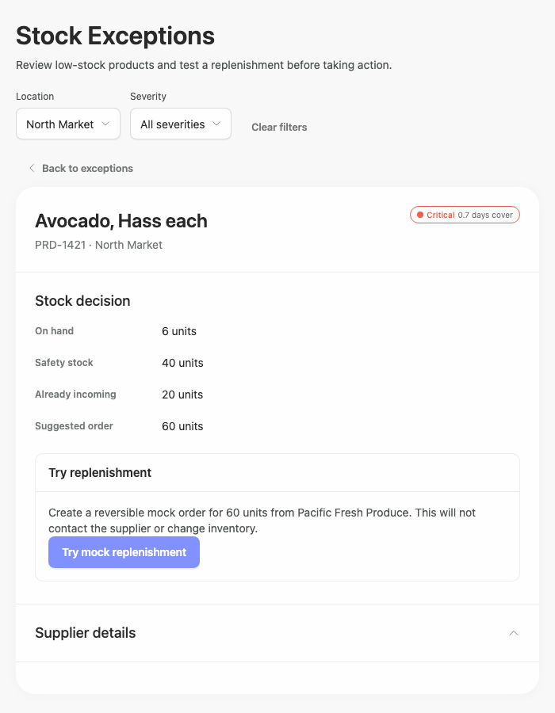

# stock-exceptions-actions-scenario-error — 2026-09-09T04:32:41.537Z

[All reports](../../README.md) · [Interactive HTML report](index.html) · [Full measurements and scoring](report.json)

GitHub renders this summary and the screenshots. Download or clone this folder to open the HTML report locally; GitHub does not serve it as a website.

**Subjective design score:** 75/100. Model: openai/gpt-5.6-sol. Rubric: 2.

**Arrusted adherence:** 100/100 (partial); evidence coverage 1.55%. Evaluator 3.

| Dimension | Conforming | Nonconforming | Unassessed | Adherence    |
| --------- | ---------- | ------------- | ---------- | ------------ |
| component | 21         | 0             | 4          | 100% (21/21) |
| api       | 52         | 0             | 13         | 100% (52/52) |
| styling   | 10         | 0             | 5247       | 100% (10/10) |

Scores from different evaluator versions or captured states are not directly comparable.

This report evaluates the captured preview; evaluation itself does not regenerate the app or prove a built backend. Scores are advisory and not human-calibrated.

## Ratings

| Dimension      | Score | Reason                                                                                                                                                                                                                                                                                                                                                                                       |
| -------------- | ----- | -------------------------------------------------------------------------------------------------------------------------------------------------------------------------------------------------------------------------------------------------------------------------------------------------------------------------------------------------------------------------------------------- |
| hierarchy      | 3/4   | The page title, filters, exception list, selected-product heading, stock facts, and replenishment action form a clear review sequence. Selected rows and severity labels are easy to locate, though supplier information is visually deferred to a collapsed section and therefore reads as secondary despite being part of the review task.                                                 |
| layout         | 3/4   | The 1440px and 1024px captures show consistent alignment, compact list rows, and a practical list-detail split. At 1920px the composition expands nearly edge to edge, creating very long panels and substantial unused space inside the detail area; a more constrained content measure would improve density.                                                                              |
| typography     | 3/4   | Headings, labels, values, descriptions, and actions use a consistent and readable hierarchy. Some 10–12px muted metadata and colored status text are visually faint, as reflected by repeated contrast warnings; supported larger or stronger text treatments would improve readability without changing the Arrusted palette.                                                               |
| responsive     | 3/4   | The composition remains usable at 1920, 1440, 1024, and 700px. It appropriately changes from split view to a detail view with a Back action at 700px, with no horizontal overflow shown. However, filters remain above the detail-only view, where their effect is less apparent because the filtered list is hidden.                                                                        |
| productClarity | 3/4   | The interface clearly communicates low-stock review, location and severity filtering, selected inventory facts, supplier identity in the replenishment explanation, and a reversible mock action. Success and reset states are explicit. The supplied captures do not demonstrate an actual empty-filter result, and detailed supplier information remains collapsed in every visible state. |

## Strengths

- Clear master-detail relationship with a distinct selected-row treatment and synchronized product heading in the visible filtered captures.
- Location and severity filters are prominent, consistently placed, and supplemented by a contextual Clear filters action.
- Exception rows combine product identity, location, on-hand quantity, and severity in a compact, scan-friendly format.
- The stock decision section surfaces the four most relevant replenishment facts with stable label-value alignment.
- Mock replenishment copy explicitly states that the action is reversible and will not contact the supplier or change inventory.
- The completed mock state provides both a success message and explanatory confirmation, followed by a clear reset action.
- The constrained 700px desktop layout replaces the split view with a focused detail panel and Back to exceptions control rather than compressing both panels.

## Improvements

- **medium — desktop-4:** The capture identified as the empty filtered state still displays one exception and a populated detail panel. Consequently, the provided visual evidence does not show how users understand or recover from zero matching results. Add and capture a genuine empty-list composition with a concise “No exceptions match these filters” message, retain the active filter summary, and provide Clear filters as the recovery action; clear or replace the stale detail panel when no record remains.
- **medium — desktop-0:** Supplier details are collapsed in the initial review state, and every supplied state shows only the section heading. This makes the supplier-review portion of the brief less immediate than the stock facts and action. Default the Supplier details Disclosure to expanded for the selected exception, or surface essential supplier fields such as supplier name and lead time directly above the mock action while leaving secondary fields collapsible.
- **low — desktop-wide-0:** At 1920px both columns stretch across almost the full window. The detail panel becomes approximately 1100px wide while most content occupies its left edge, producing long measures and a large amount of inactive interior space. Constrain the overall review composition or cap the list column and inner detail-content measure, allowing remaining desktop space to act as outer margin rather than stretching every panel.
- **low — desktop-custom-700x900-3:** In the constrained detail-only composition, filters remain visible while the filtered exception list is behind the Back action. A user can change list-level criteria without seeing the resulting set, making the relationship between filtering and the current detail less obvious. Show filters primarily on the constrained list view, or automatically return to the list after a filter changes. If they remain in detail view, add a compact result summary near Back to exceptions.
- **low — desktop-window-0:** Row metadata and severity pills rely on small muted or colored text. Automated evidence repeatedly flags these treatments as marginal or insufficient in contrast, which can reduce quick scanning even though each status also has a text label. Use supported typography or density variants that give metadata and status wording slightly more size or weight, and preserve redundant textual labels and status dots; do not replace the established Arrusted colors.

## Token evidence

Percentages cover only assessed properties. Missing provenance and ambiguous CSS remain unassessed; matching literals are not proof of token usage.

| Viewport                 | Category   | Token references / assessed | Coverage   |
| ------------------------ | ---------- | --------------------------- | ---------- |
| desktop-0                | color      | 0/0                         | 0% (0/223) |
| desktop-0                | typography | 0/0                         | 0% (0/507) |
| desktop-0                | spacing    | 0/0                         | 0% (0/280) |
| desktop-0                | radius     | 0/0                         | 0% (0/115) |
| desktop-0                | border     | 0/0                         | 0% (0/131) |
| desktop-0                | shadow     | 0/0                         | 0% (0/120) |
| desktop-wide-0           | color      | 0/0                         | 0% (0/223) |
| desktop-wide-0           | typography | 0/0                         | 0% (0/507) |
| desktop-wide-0           | spacing    | 0/0                         | 0% (0/280) |
| desktop-wide-0           | radius     | 0/0                         | 0% (0/115) |
| desktop-wide-0           | border     | 0/0                         | 0% (0/131) |
| desktop-wide-0           | shadow     | 0/0                         | 0% (0/120) |
| desktop-window-0         | color      | 0/0                         | 0% (0/223) |
| desktop-window-0         | typography | 0/0                         | 0% (0/507) |
| desktop-window-0         | spacing    | 0/0                         | 0% (0/280) |
| desktop-window-0         | radius     | 0/0                         | 0% (0/115) |
| desktop-window-0         | border     | 0/0                         | 0% (0/131) |
| desktop-window-0         | shadow     | 0/0                         | 0% (0/120) |
| desktop-custom-700x900-0 | color      | 0/0                         | 0% (0/178) |
| desktop-custom-700x900-0 | typography | 0/0                         | 0% (0/447) |
| desktop-custom-700x900-0 | spacing    | 0/0                         | 0% (0/215) |
| desktop-custom-700x900-0 | radius     | 0/0                         | 0% (0/91)  |
| desktop-custom-700x900-0 | border     | 0/0                         | 0% (0/97)  |
| desktop-custom-700x900-0 | shadow     | 0/0                         | 0% (0/91)  |

## Latest-run screenshots

### desktop-0 — initial

Interaction: not-run.

### desktop-1 — Mock replenishment result

Interaction: passed.

### desktop-2 — Reset mock result

Interaction: passed.

### desktop-3 — Filter and synchronize selection

Interaction: failed.

### desktop-4 — Empty filtered state

Interaction: failed.

### desktop-wide-0 — initial

Interaction: not-run.

### desktop-wide-1 — Mock replenishment result

Interaction: passed.

### desktop-wide-2 — Reset mock result

Interaction: passed.

### desktop-wide-3 — Filter and synchronize selection

Interaction: failed.

### desktop-wide-4 — Empty filtered state

Interaction: failed.

### desktop-window-0 — initial

Interaction: not-run.

### desktop-window-1 — Mock replenishment result

Interaction: passed.

### desktop-window-2 — Reset mock result

Interaction: passed.

### desktop-window-3 — Filter and synchronize selection

Interaction: failed.

### desktop-window-4 — Empty filtered state

Interaction: failed.

### desktop-custom-700x900-0 — initial

Interaction: not-run.

### desktop-custom-700x900-1 — Mock replenishment result

Interaction: passed.

### desktop-custom-700x900-2 — Reset mock result

Interaction: passed.

### desktop-custom-700x900-3 — Filter and synchronize selection

Interaction: failed.

### desktop-custom-700x900-4 — Empty filtered state

Interaction: failed.

## Limitations

- Only rendered static captures were available; open supplier details, select menus, keyboard states, and other unseen interactions were not evaluated.
- The interaction report marks supplier synchronization as failed, but the corresponding screenshots visibly show the selected Avocado record and “Pacific Fresh Produce”; this contradictory evidence prevents a definitive synchronization defect finding.
- The captures labelled as empty filtered states do not visually reach an empty result, so the existence or quality of a separate empty-state branch cannot be confirmed.
- The 700px captures begin in a selected detail state; the constrained list view after using Back to exceptions was not supplied.
- The brief also requests an implementation plan and stopping before build/publication, but no plan or publication-state evidence was provided for design review.
- Static adherence evidence does not prove that all referenced public components rendered, and styling provenance coverage is extremely limited; palette or token compliance was therefore kept separate from the visual scores.
