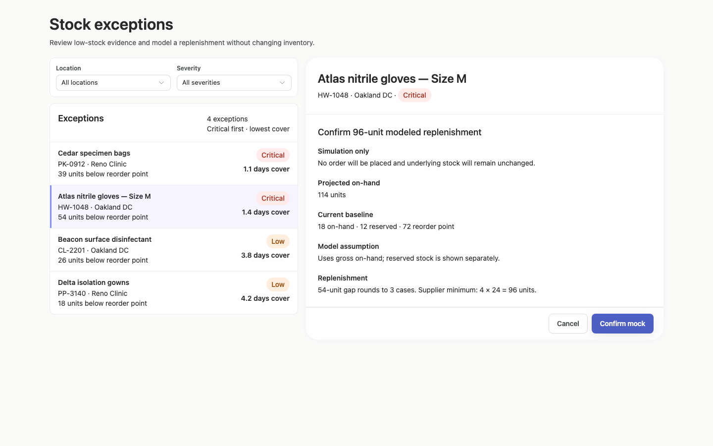
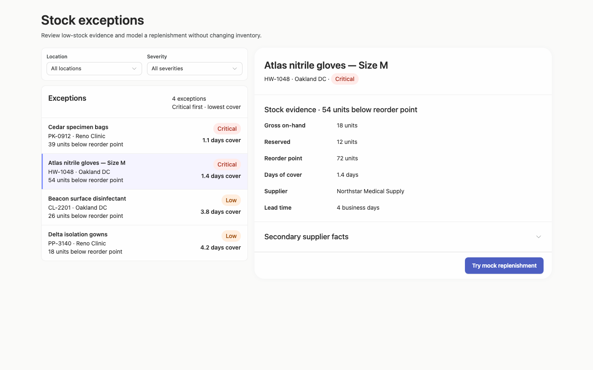
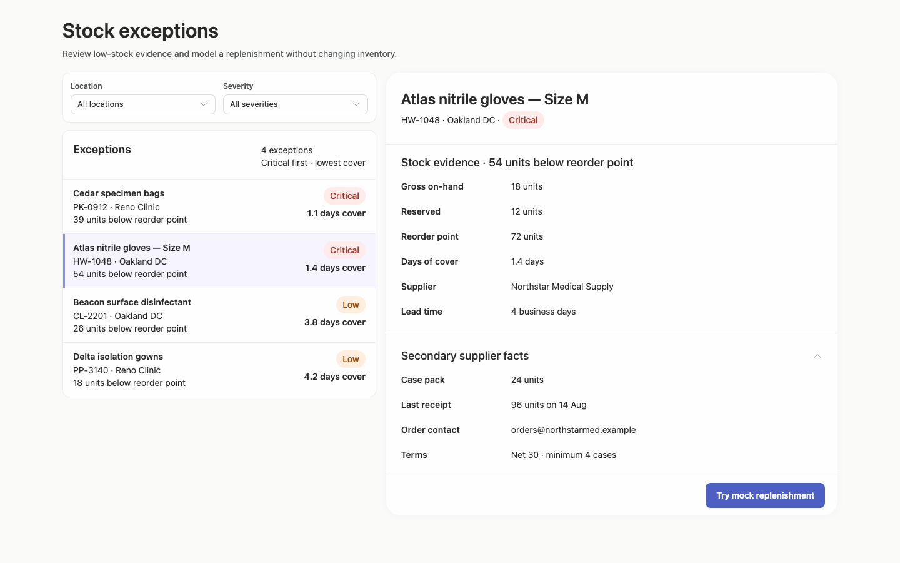
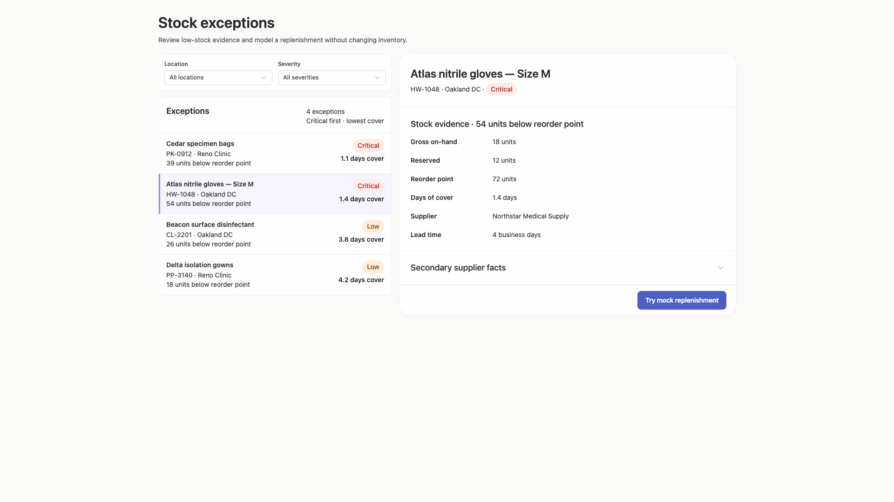
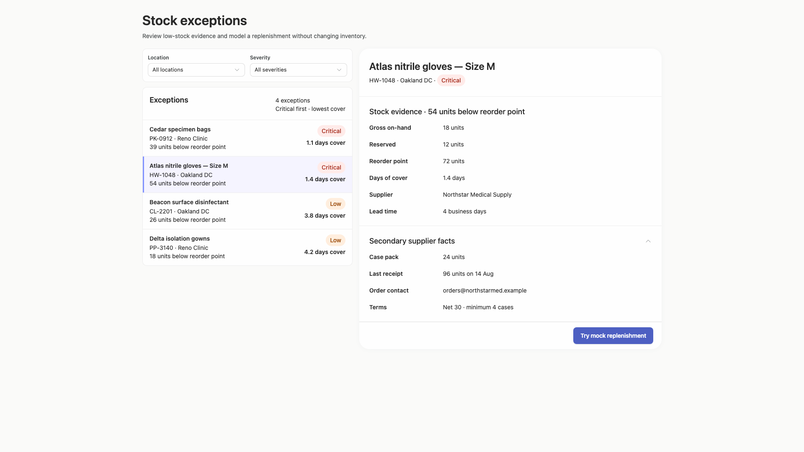
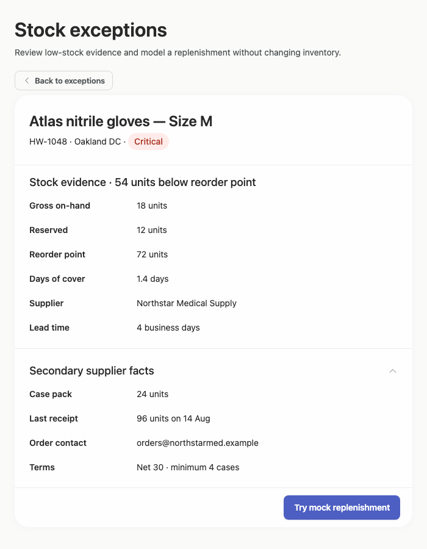

# stock-exceptions-aligned-header — 2026-09-09T08:28:16.955Z

[All reports](../../README.md) · [Interactive HTML report](index.html) · [Full measurements and scoring](report.json)

GitHub renders this summary and the screenshots. Download or clone this folder to open the HTML report locally; GitHub does not serve it as a website.

**Subjective design score:** 90/100. Model: openai/gpt-5.6-sol. Rubric: 2.

**Arrusted adherence:** 100/100 (partial); evidence coverage 1.63%. Evaluator 3.

| Dimension | Conforming | Nonconforming | Unassessed | Adherence    |
| --------- | ---------- | ------------- | ---------- | ------------ |
| component | 20         | 0             | 2          | 100% (20/20) |
| api       | 53         | 0             | 10         | 100% (53/53) |
| styling   | 13         | 0             | 5169       | 100% (13/13) |

Scores from different evaluator versions or captured states are not directly comparable.

This report evaluates the captured preview; evaluation itself does not regenerate the app or prove a built backend. Scores are advisory and not human-calibrated.

## Ratings

| Dimension      | Score | Reason                                                                                                                                                                                                                                                                                                                                                                                         |
| -------------- | ----- | ---------------------------------------------------------------------------------------------------------------------------------------------------------------------------------------------------------------------------------------------------------------------------------------------------------------------------------------------------------------------------------------------- |
| hierarchy      | 4/4   | The page title and task description establish purpose immediately, while the two-pane composition creates a clear exceptions-to-detail progression. Selected-row treatment, severity pills, section headings, and emphasized mock action make priorities highly scannable across review, confirmation, and result states.                                                                      |
| layout         | 3/4   | Alignment is disciplined: filters share a row, exception metadata follows a repeatable grid, and detail labels and values remain consistently aligned. The centered composition scales cleanly at 1440 and 1920 pixels, though the wide capture leaves substantial unused canvas and the independently scrolling detail panel can temporarily hide important context when sections expand.     |
| typography     | 4/4   | Heading levels, field labels, values, supporting copy, and button text are visually consistent and readable. Product names and quantities receive appropriate emphasis without excessive type variation, and dense inventory evidence remains legible at the 1024-pixel window.                                                                                                                |
| responsive     | 3/4   | The interface remains usable at 1920, 1440, 1024, and 700-pixel desktop widths. It appropriately changes from simultaneous list-detail to constrained detail with a Back action at 700 pixels, and action footers remain visible. Minor nested scrolling appears at shorter widths, and the narrow initial capture requires leaving detail before filters or other exceptions can be accessed. |
| productClarity | 4/4   | The task is explicit: filter exceptions, select a product, inspect stock and supplier evidence, and simulate replenishment. Confirmation explains the 96-unit calculation before acting, and the result clearly states that no order was placed and inventory is unchanged. Reset and cancel affordances make the mock workflow reversible and understandable.                                 |

## Strengths

- Clear master-detail relationship with an unmistakable selected exception.
- Location and severity filters are grouped and labeled directly above the exception list.
- Rows expose decision-relevant evidence—location, shortage, severity, and days of cover—without requiring selection.
- Stock and supplier facts are organized into readable sections with optional secondary evidence.
- The confirmation state explains case rounding, supplier minimum, baseline stock, and projected on-hand before the mock action.
- The result state prominently distinguishes simulation from a real order and offers a clear reset action.
- The constrained 700-pixel composition uses an explicit Back to exceptions control instead of compressing both panels into an unusable layout.
- The supplied captures report no accessibility violations, although this does not replace broader manual testing.

## Improvements

- **medium — desktop-window-5:** After secondary supplier facts are expanded in the 1024-pixel window, the detail panel is scrolled so the Stock evidence heading, gross on-hand, and reserved values are no longer visible. This weakens context while comparing supplier terms with current stock. When opening the supplier disclosure, bring its heading into view without pushing the stock section heading out of context, or keep a concise stock summary visible above the disclosures. Preserve the existing independent panel scrolling and supported disclosure composition.
- **low — desktop-custom-700x900-0:** The constrained initial capture opens directly on the selected detail, so changing location, severity, or product requires returning through the single Back to exceptions action. The pattern is usable but adds navigation cost for repeated exception review. Retain the constrained list-detail pattern, but consider adding a compact filter-state summary near the Back action or another supported route back to the filtered exception list. Ensure selection and filter state are preserved when returning; that behavior is not demonstrated here.
- **low — desktop-custom-700x900-2:** The result panel creates a nested vertical scroll area for only a few additional pixels at 700×900. This introduces a subtle scroll boundary even though the content nearly fits naturally. At this desktop panel size, slightly reduce nonessential vertical spacing or allow the detail card to grow with page scrolling so a negligible nested overflow is avoided, while retaining the fixed action placement where it remains useful.

## Token evidence

Percentages cover only assessed properties. Missing provenance and ambiguous CSS remain unassessed; matching literals are not proof of token usage.

| Viewport                 | Category   | Token references / assessed | Coverage   |
| ------------------------ | ---------- | --------------------------- | ---------- |
| desktop-0                | color      | 0/0                         | 0% (0/233) |
| desktop-0                | typography | 0/0                         | 0% (0/522) |
| desktop-0                | spacing    | 0/0                         | 0% (0/275) |
| desktop-0                | radius     | 0/0                         | 0% (0/116) |
| desktop-0                | border     | 0/0                         | 0% (0/125) |
| desktop-0                | shadow     | 0/0                         | 0% (0/120) |
| desktop-wide-0           | color      | 0/0                         | 0% (0/233) |
| desktop-wide-0           | typography | 0/0                         | 0% (0/522) |
| desktop-wide-0           | spacing    | 0/0                         | 0% (0/275) |
| desktop-wide-0           | radius     | 0/0                         | 0% (0/116) |
| desktop-wide-0           | border     | 0/0                         | 0% (0/125) |
| desktop-wide-0           | shadow     | 0/0                         | 0% (0/120) |
| desktop-window-0         | color      | 0/0                         | 0% (0/233) |
| desktop-window-0         | typography | 0/0                         | 0% (0/522) |
| desktop-window-0         | spacing    | 0/0                         | 0% (0/275) |
| desktop-window-0         | radius     | 0/0                         | 0% (0/116) |
| desktop-window-0         | border     | 0/0                         | 0% (0/125) |
| desktop-window-0         | shadow     | 0/0                         | 0% (0/120) |
| desktop-custom-700x900-0 | color      | 0/0                         | 0% (0/161) |
| desktop-custom-700x900-0 | typography | 0/0                         | 0% (0/405) |
| desktop-custom-700x900-0 | spacing    | 0/0                         | 0% (0/184) |
| desktop-custom-700x900-0 | radius     | 0/0                         | 0% (0/81)  |
| desktop-custom-700x900-0 | border     | 0/0                         | 0% (0/84)  |
| desktop-custom-700x900-0 | shadow     | 0/0                         | 0% (0/81)  |

## Latest-run screenshots

### desktop-0 — initial

Interaction: not-run.

### desktop-1 — Review modeled quantity before confirming

Interaction: passed.

### desktop-2 — Mock replenishment result

Interaction: passed.

### desktop-3 — Result evidence at scroll boundary

Interaction: passed.

### desktop-4 — Reset from result footer

Interaction: passed.

### desktop-5 — Expanded supplier facts

Interaction: passed.

### desktop-wide-0 — initial

Interaction: not-run.

### desktop-wide-1 — Review modeled quantity before confirming

Interaction: passed.

### desktop-wide-2 — Mock replenishment result

Interaction: passed.

### desktop-wide-3 — Result evidence at scroll boundary

Interaction: passed.

### desktop-wide-4 — Reset from result footer

Interaction: passed.

### desktop-wide-5 — Expanded supplier facts

Interaction: passed.

### desktop-window-0 — initial

Interaction: not-run.

### desktop-window-1 — Review modeled quantity before confirming

Interaction: passed.

### desktop-window-2 — Mock replenishment result

Interaction: passed.

### desktop-window-3 — Result evidence at scroll boundary

Interaction: passed.

### desktop-window-4 — Reset from result footer

Interaction: passed.

### desktop-window-5 — Expanded supplier facts

Interaction: passed.

### desktop-custom-700x900-0 — initial

Interaction: not-run.

### desktop-custom-700x900-1 — Review modeled quantity before confirming

Interaction: passed.

### desktop-custom-700x900-2 — Mock replenishment result

Interaction: passed.

### desktop-custom-700x900-3 — Result evidence at scroll boundary

Interaction: passed.

### desktop-custom-700x900-4 — Reset from result footer

Interaction: passed.

### desktop-custom-700x900-5 — Expanded supplier facts

Interaction: passed.

## Limitations

- The screenshots demonstrate visual prototype states but do not include the requested implementation plan, so that deliverable cannot be evaluated.
- Filtering interactions, changing the selected record, empty filter results, and the destination of Back to exceptions were not demonstrated.
- The captures show mock-action transitions, but no real backend behavior, persistence, authorization, or order placement can be inferred.
- Static source evidence leaves several callbacks, composition props, and dynamically reachable branches unassessed; it does not prove all shown behavior is implemented through those branches.
- Palette and component evidence is broadly positive, but styling provenance coverage is very limited and is not sufficient for a comprehensive token-adherence conclusion.
