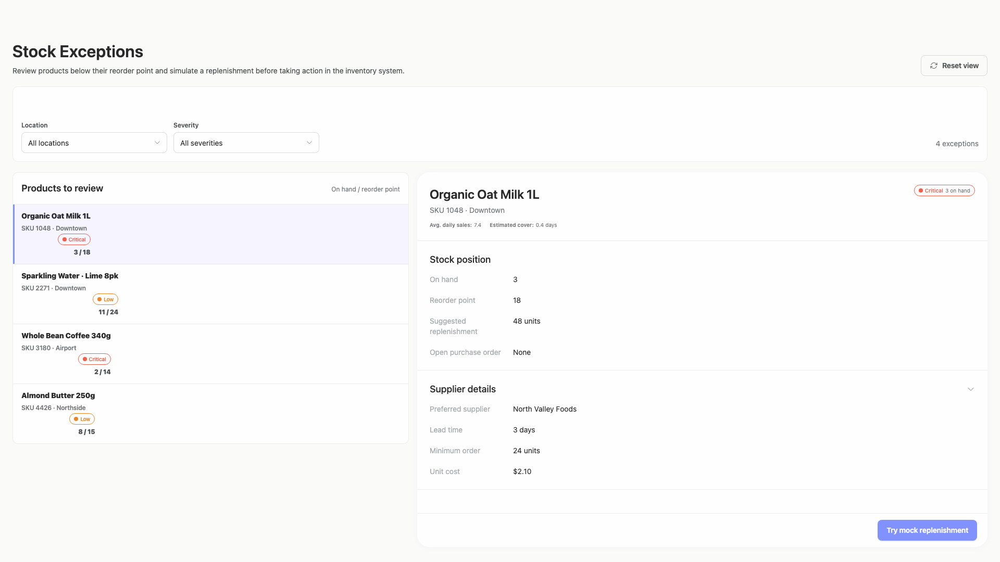

# stock-exceptions-attribution-repair — 2026-09-09T03:37:37.128Z

[All reports](../../README.md) · [Interactive HTML report](index.html) · [Full measurements and scoring](report.json)

GitHub renders this summary and the screenshots. Download or clone this folder to open the HTML report locally; GitHub does not serve it as a website.

**Subjective design score:** Not available. Model: not run. Rubric: not run.

**Arrusted adherence:** 100/100 (partial); evidence coverage 3.24%. Evaluator 3.

| Dimension | Conforming | Nonconforming | Unassessed | Adherence    |
| --------- | ---------- | ------------- | ---------- | ------------ |
| component | 15         | 0             | 3          | 100% (15/15) |
| api       | 34         | 0             | 17         | 100% (34/34) |
| styling   | 99         | 0             | 4405       | 100% (99/99) |

Scores from different evaluator versions or captured states are not directly comparable.

This report evaluates the captured preview; evaluation itself does not regenerate the app or prove a built backend. Scores are advisory and not human-calibrated.

## Ratings

| Dimension | Score | Reason |
| --------- | ----- | ------ |

## Strengths

## Improvements

## Token evidence

Percentages cover only assessed properties. Missing provenance and ambiguous CSS remain unassessed; matching literals are not proof of token usage.

| Viewport         | Category   | Token references / assessed | Coverage    |
| ---------------- | ---------- | --------------------------- | ----------- |
| desktop-0        | color      | 15/15                       | 6% (15/231) |
| desktop-0        | typography | 11/11                       | 2% (11/594) |
| desktop-0        | spacing    | 0/0                         | 0% (0/293)  |
| desktop-0        | radius     | 0/0                         | 0% (0/120)  |
| desktop-0        | border     | 0/0                         | 0% (0/135)  |
| desktop-0        | shadow     | 1/1                         | 1% (1/120)  |
| desktop-wide-0   | color      | 15/15                       | 6% (15/231) |
| desktop-wide-0   | typography | 11/11                       | 2% (11/594) |
| desktop-wide-0   | spacing    | 0/0                         | 0% (0/293)  |
| desktop-wide-0   | radius     | 0/0                         | 0% (0/120)  |
| desktop-wide-0   | border     | 0/0                         | 0% (0/135)  |
| desktop-wide-0   | shadow     | 1/1                         | 1% (1/120)  |
| desktop-window-0 | color      | 15/15                       | 6% (15/231) |
| desktop-window-0 | typography | 11/11                       | 2% (11/594) |
| desktop-window-0 | spacing    | 0/0                         | 0% (0/293)  |
| desktop-window-0 | radius     | 0/0                         | 0% (0/120)  |
| desktop-window-0 | border     | 0/0                         | 0% (0/135)  |
| desktop-window-0 | shadow     | 1/1                         | 1% (1/120)  |

## Latest-run screenshots

### desktop-0 — initial

Interaction: not-run.

### desktop-wide-0 — initial

Interaction: not-run.

### desktop-window-0 — initial

Interaction: not-run.

## Limitations
