# stock-exceptions-authored-provenance — 2026-09-09T05:44:00.198Z

[All reports](../../README.md) · [Interactive HTML report](index.html) · [Full measurements and scoring](report.json)

GitHub renders this summary and the screenshots. Download or clone this folder to open the HTML report locally; GitHub does not serve it as a website.

**Subjective design score:** 80/100. Model: openai/gpt-5.6-sol. Rubric: 2.

**Arrusted adherence:** 100/100 (partial); evidence coverage 1.16%. Evaluator 3.

| Dimension | Conforming | Nonconforming | Unassessed | Adherence    |
| --------- | ---------- | ------------- | ---------- | ------------ |
| component | 15         | 0             | 2          | 100% (15/15) |
| api       | 33         | 0             | 13         | 100% (33/33) |
| styling   | 13         | 0             | 5166       | 100% (13/13) |

Scores from different evaluator versions or captured states are not directly comparable.

This report evaluates the captured preview; evaluation itself does not regenerate the app or prove a built backend. Scores are advisory and not human-calibrated.

## Ratings

| Dimension      | Score | Reason                                                                                                                                                                                                                                                                                                                                                                                                                            |
| -------------- | ----- | --------------------------------------------------------------------------------------------------------------------------------------------------------------------------------------------------------------------------------------------------------------------------------------------------------------------------------------------------------------------------------------------------------------------------------- |
| hierarchy      | 3/4   | The page title, filter controls, exception list, selected-record header, evidence sections, and single replenishment action form a clear scan path in desktop-0. Selection is visible through the tinted row and rail, while desktop-1 gives modeled quantity and projected on-hand headline priority. Some secondary labels and severity pills are visually understated for operational scanning.                                |
| layout         | 3/4   | The two-column master-detail composition is consistently aligned at 1024, 1440, and 1920 widths, with orderly row spacing and stable action placement. The centered maximum-width treatment is comfortable, although desktop-wide-0 leaves substantial unused space and the modeled-result panel becomes vertically long at 1024.                                                                                                 |
| typography     | 3/4   | Titles, section headings, product names, and numeric values are consistent and readable across captures. Small muted field labels and compact status-pill text are less robust; automated checks repeatedly flag those text treatments as borderline or insufficient contrast. The Arrusted palette remains authoritative, so improvements should use supported typography or compositional variants rather than color overrides. |
| responsive     | 3/4   | The composition adapts well from a side-by-side view at 1024–1920 pixels to a focused detail view with Back navigation at 700 pixels. Controls remain usable and horizontal overflow is absent. Expanded and result states require modest vertical scrolling at smaller desktop windows, and the Reset mock action falls well below the initial 768-pixel viewport in desktop-window-1.                                           |
| productClarity | 4/4   | The task is immediately understandable: filter exceptions by location and severity, select an item, review stock and supplier evidence, and try a mock replenishment. The modeled state clearly reports quantities, assumptions, and the explicit assurance that no order was placed and stock is unchanged; reset and disclosure affordances are also clearly labeled.                                                           |

## Strengths

- Clear master-detail relationship between the exception list and selected product evidence.
- Location and severity filters are grouped directly above the exception list and use understandable defaults.
- Rows expose product identity, location, severity, and days of cover without forcing users into the detail panel.
- The modeled result emphasizes the two most important outcomes—replenishment quantity and projected on-hand—and explains its assumption.
- The “Simulation only” message strongly distinguishes the prototype action from a real inventory change.
- Responsive composition changes appropriately to a focused detail panel at 700 pixels instead of compressing both columns.
- Supplier facts are progressively disclosed, keeping the initial review state concise.
- Mock replenishment, reset, and supplier disclosure interactions have passed in the supplied captures.

## Improvements

- **medium — desktop-window-0:** Severity is communicated mainly through very small outlined pills in the narrow list column. Their labels are visually light, and the supplied accessibility evidence reports insufficient contrast for both Critical and Low pill text, which can slow rapid exception triage. Keep the Arrusted status treatment, but add the severity word as standard adjacent row metadata or use a supported status composition with larger text. Do not rely on the compact colored pill alone.
- **low — desktop-window-0:** Stock-evidence labels are small and muted relative to their values. They remain understandable, but repeated automated advisories place this text just below the expected contrast threshold, reducing readability for dense operational review. Use a supported Typography variant with a larger size or stronger weight for definition-list labels while retaining the existing semantic palette and field alignment.
- **medium — desktop-custom-700x900-0:** At 700 pixels the exception list and filters are replaced by the detail view, making “Back to exceptions” the essential route to selection and filtering. Its small, muted treatment gives this critical navigation less prominence than its role warrants. Present the back affordance with a supported secondary or standard small Button variant and align it more explicitly with the detail context, while keeping the replenishment action as the sole primary action.
- **medium — desktop-window-1:** In the modeled-result state at a 1024×768 window, both disclosure rows and the footer place Reset mock around y=842, well below the initial viewport. Scrolling is acceptable, but the state-reversal action is separated from the result and simulation notice that establish its context. Place the supported secondary Reset action near the modeled-result heading or “Simulation only” notice, or use the composition’s supported persistent action-footer behavior so it remains discoverable in shorter desktop panels.

## Token evidence

Percentages cover only assessed properties. Missing provenance and ambiguous CSS remain unassessed; matching literals are not proof of token usage.

| Viewport                 | Category   | Token references / assessed | Coverage   |
| ------------------------ | ---------- | --------------------------- | ---------- |
| desktop-0                | color      | 0/0                         | 0% (0/228) |
| desktop-0                | typography | 0/0                         | 0% (0/518) |
| desktop-0                | spacing    | 0/0                         | 0% (0/274) |
| desktop-0                | radius     | 0/0                         | 0% (0/116) |
| desktop-0                | border     | 0/0                         | 0% (0/130) |
| desktop-0                | shadow     | 0/0                         | 0% (0/120) |
| desktop-wide-0           | color      | 0/0                         | 0% (0/228) |
| desktop-wide-0           | typography | 0/0                         | 0% (0/518) |
| desktop-wide-0           | spacing    | 0/0                         | 0% (0/274) |
| desktop-wide-0           | radius     | 0/0                         | 0% (0/116) |
| desktop-wide-0           | border     | 0/0                         | 0% (0/130) |
| desktop-wide-0           | shadow     | 0/0                         | 0% (0/120) |
| desktop-window-0         | color      | 0/0                         | 0% (0/228) |
| desktop-window-0         | typography | 0/0                         | 0% (0/518) |
| desktop-window-0         | spacing    | 0/0                         | 0% (0/274) |
| desktop-window-0         | radius     | 0/0                         | 0% (0/116) |
| desktop-window-0         | border     | 0/0                         | 0% (0/130) |
| desktop-window-0         | shadow     | 0/0                         | 0% (0/120) |
| desktop-custom-700x900-0 | color      | 0/0                         | 0% (0/162) |
| desktop-custom-700x900-0 | typography | 0/0                         | 0% (0/410) |
| desktop-custom-700x900-0 | spacing    | 0/0                         | 0% (0/186) |
| desktop-custom-700x900-0 | radius     | 0/0                         | 0% (0/82)  |
| desktop-custom-700x900-0 | border     | 0/0                         | 0% (0/86)  |
| desktop-custom-700x900-0 | shadow     | 0/0                         | 0% (0/82)  |

## Latest-run screenshots

### desktop-0 — initial

Interaction: not-run.

### desktop-1 — Mock replenishment result

Interaction: passed.

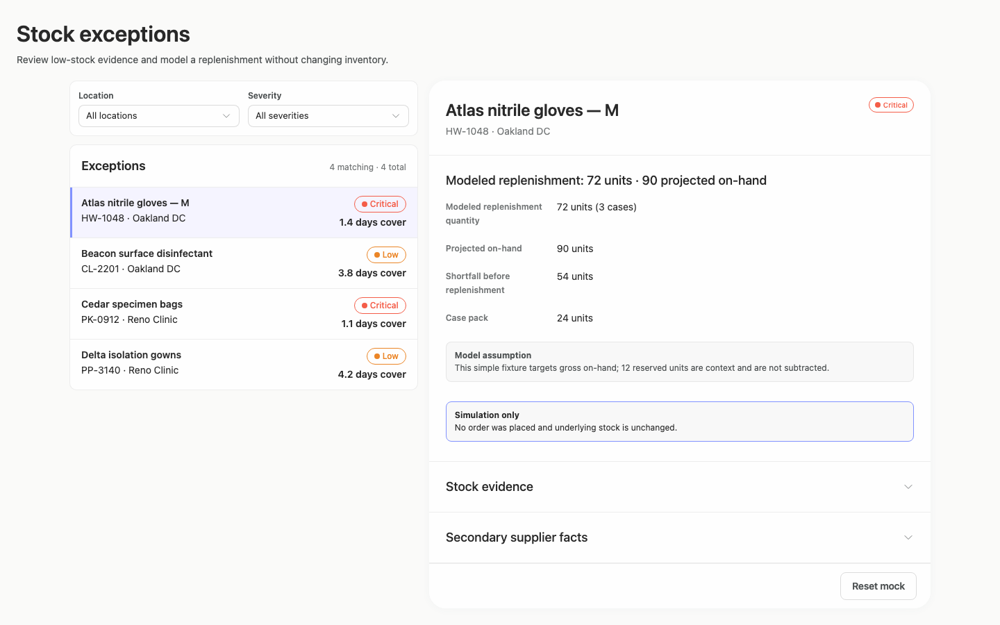

### desktop-2 — Reset from result footer

Interaction: passed.

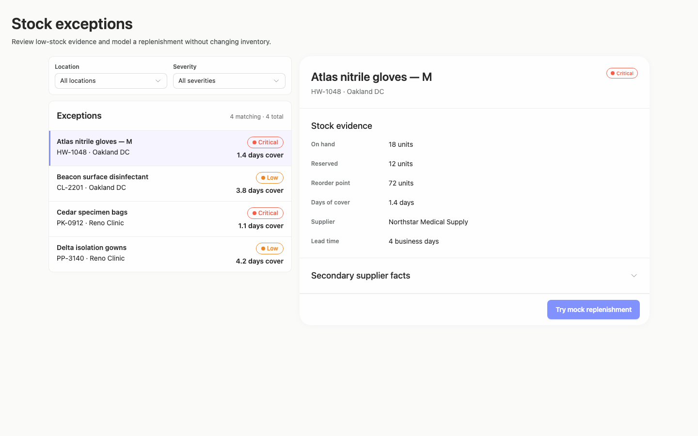

### desktop-3 — Expanded supplier facts

Interaction: passed.

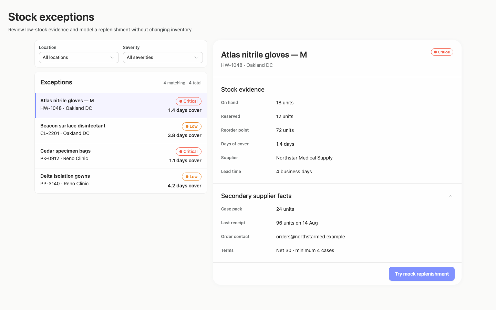

### desktop-wide-0 — initial

Interaction: not-run.

### desktop-wide-1 — Mock replenishment result

Interaction: passed.

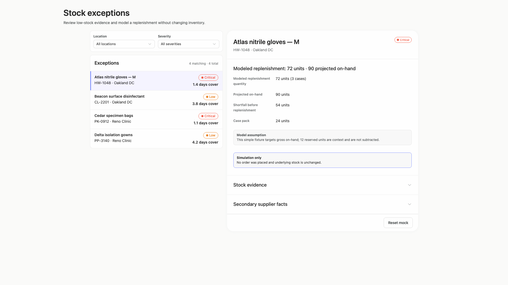

### desktop-wide-2 — Reset from result footer

Interaction: passed.

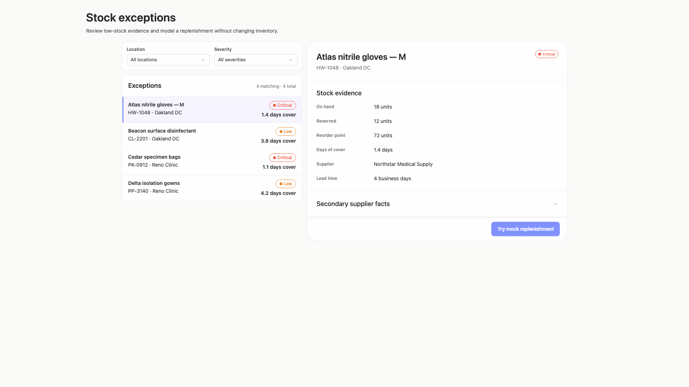

### desktop-wide-3 — Expanded supplier facts

Interaction: passed.

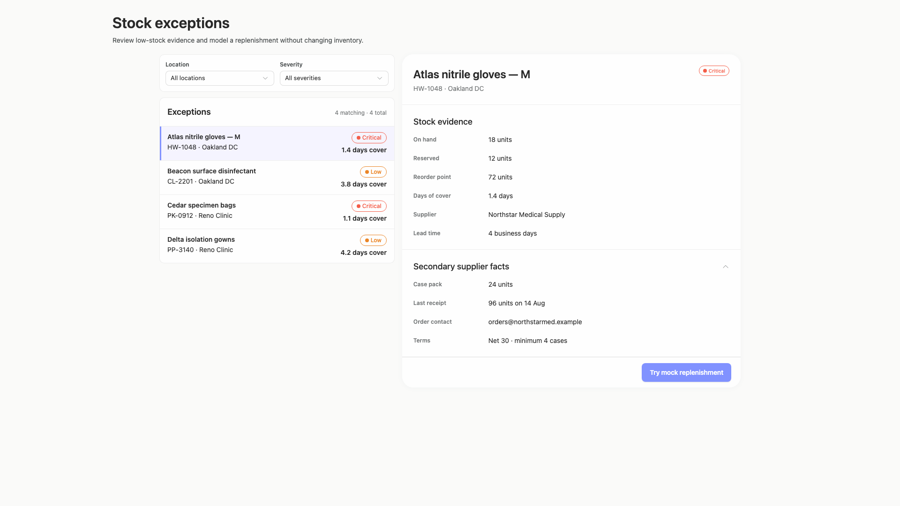

### desktop-window-0 — initial

Interaction: not-run.

### desktop-window-1 — Mock replenishment result

Interaction: passed.

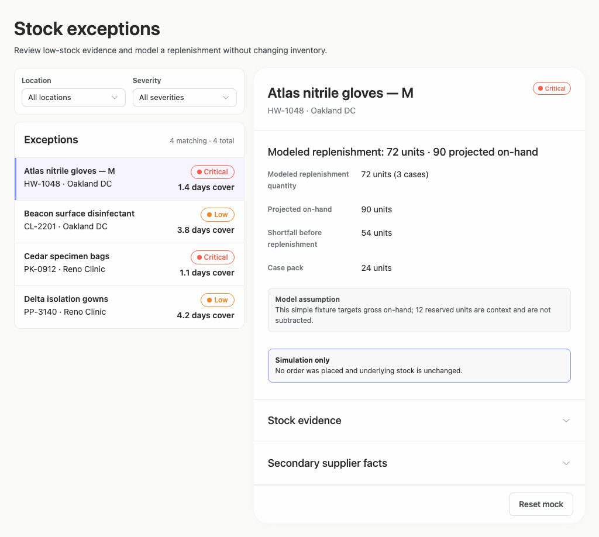

### desktop-window-2 — Reset from result footer

Interaction: passed.

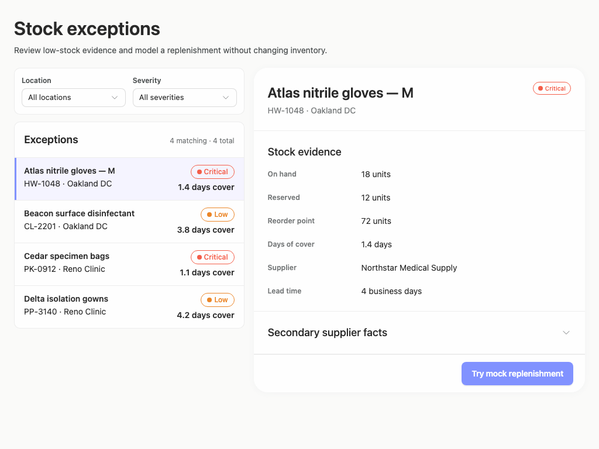

### desktop-window-3 — Expanded supplier facts

Interaction: passed.

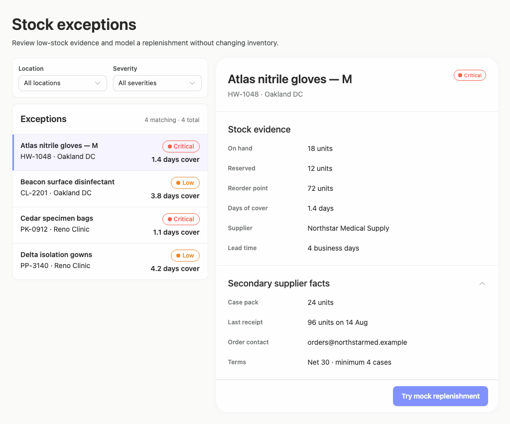

### desktop-custom-700x900-0 — initial

Interaction: not-run.

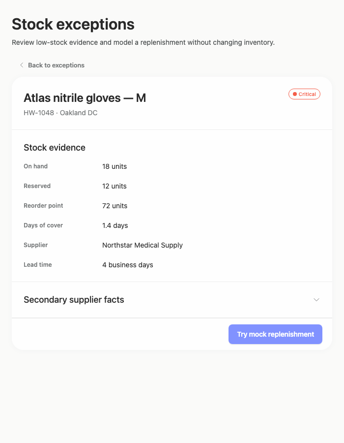

### desktop-custom-700x900-1 — Mock replenishment result

Interaction: passed.

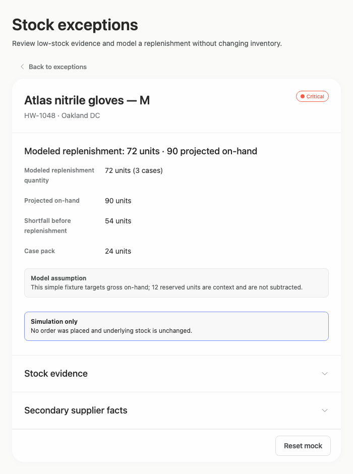

### desktop-custom-700x900-2 — Reset from result footer

Interaction: passed.

### desktop-custom-700x900-3 — Expanded supplier facts

Interaction: passed.

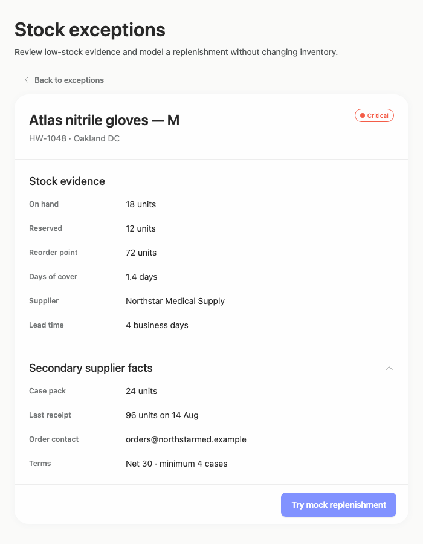

## Limitations

- No captured state shows the result of using Back to exceptions at 700 pixels, so restoration of the filters, list, and prior selection cannot be assessed.
- Filter changes, alternate item selections, zero-result states, and the “Portland Hub (0)” outcome were not visually demonstrated.
- Hover, focus, keyboard traversal, loading, disabled, and error states were not provided.
- The supplied screenshots do not show a separate implementation plan, so completion and quality of that requested deliverable cannot be evaluated.
- Screenshots and passed mock interactions do not establish backend persistence, authorization, or real inventory behavior.
- Automated contrast observations are advisory; they do not justify changing the authoritative Arrusted palette or overriding public component colors.
