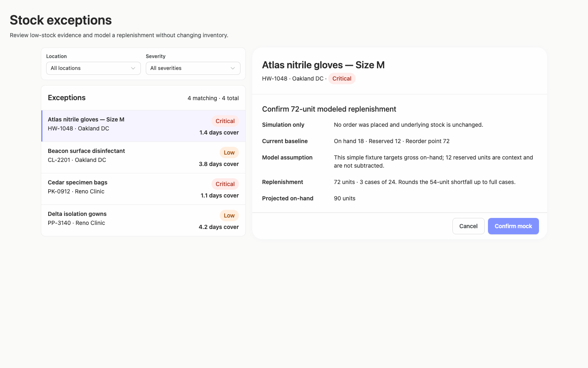
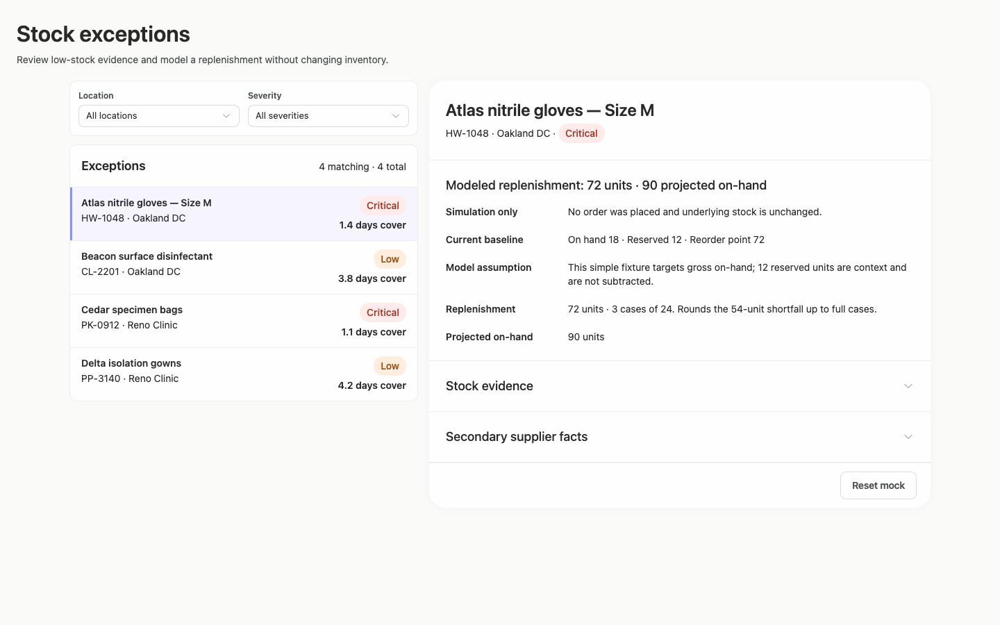
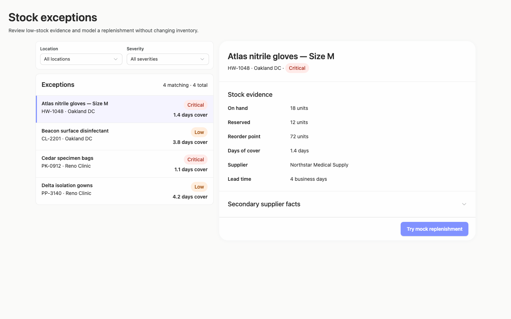
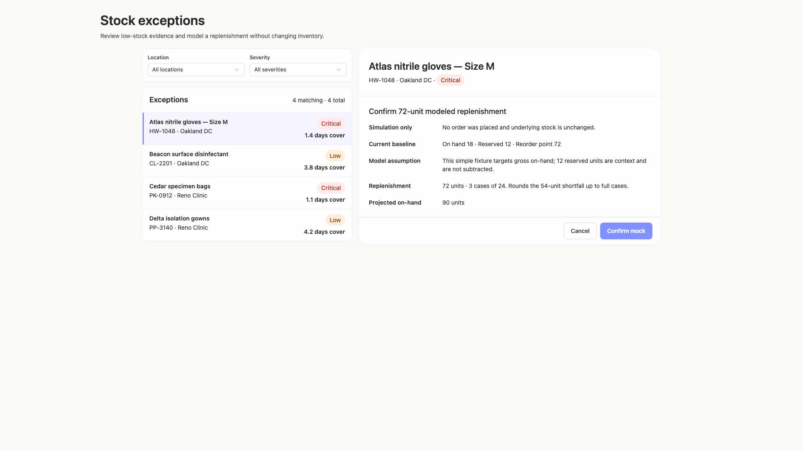
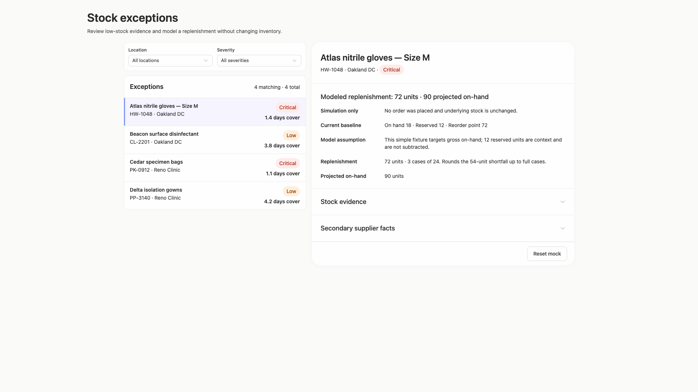
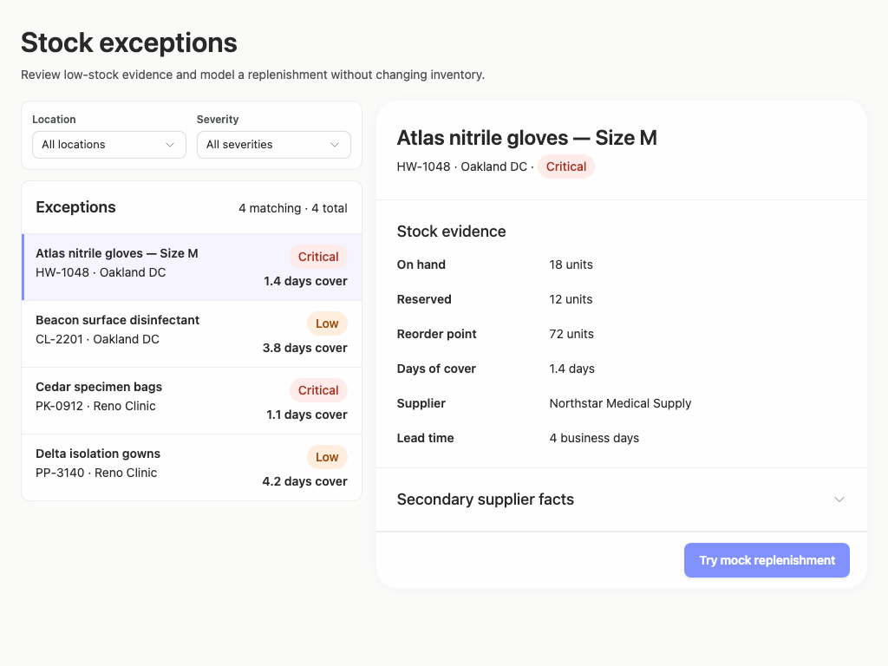
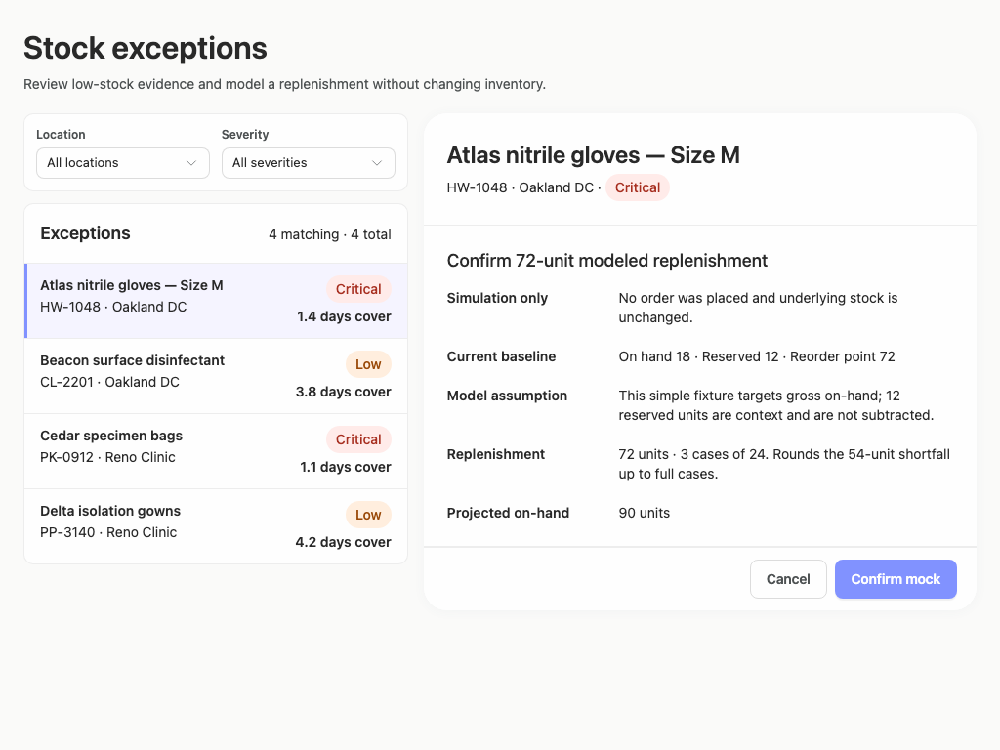
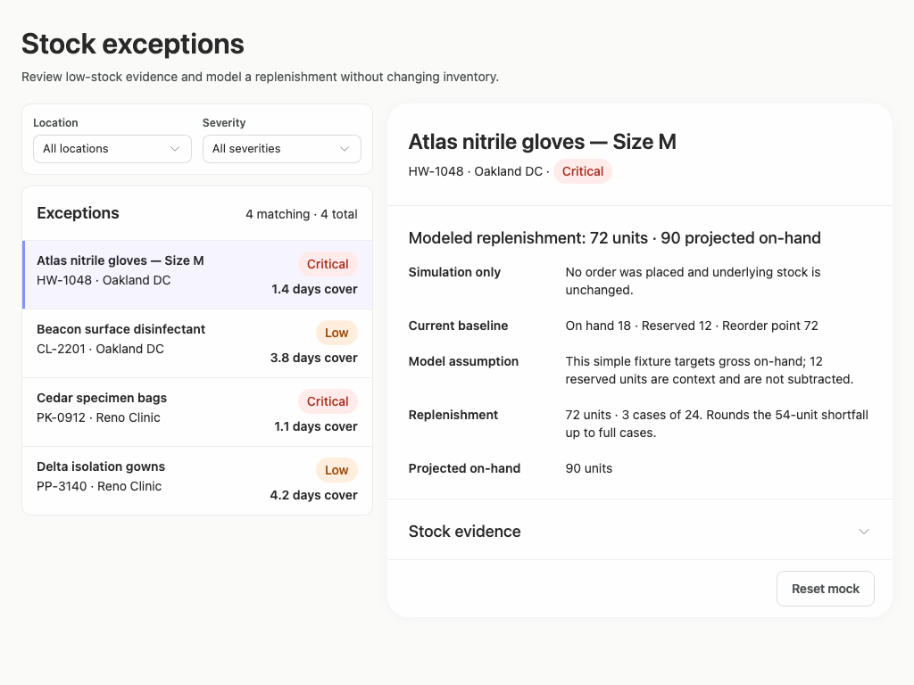
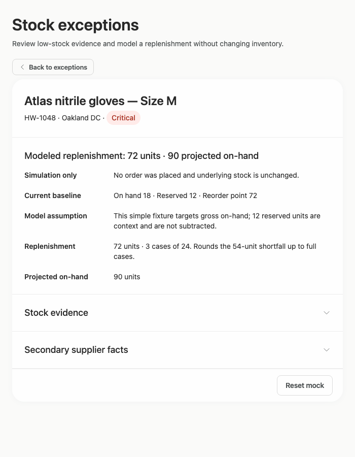
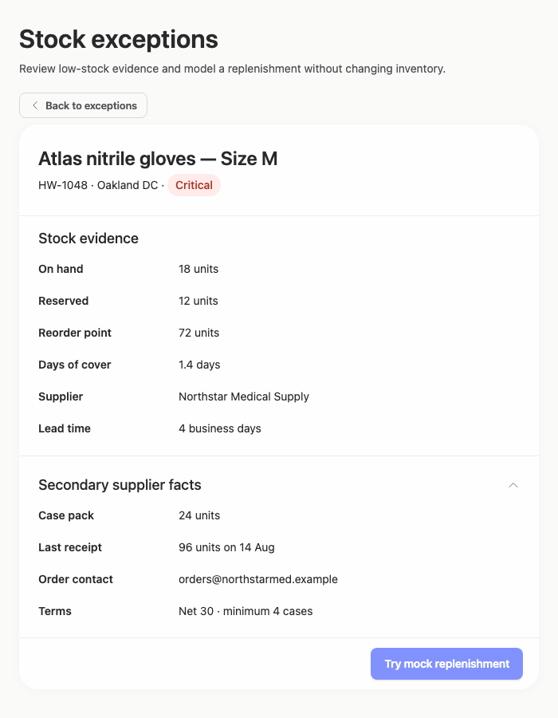

# stock-exceptions-compact-calculation — 2026-09-09T07:05:32.329Z

[All reports](../../README.md) · [Interactive HTML report](index.html) · [Full measurements and scoring](report.json)

GitHub renders this summary and the screenshots. Download or clone this folder to open the HTML report locally; GitHub does not serve it as a website.

**Subjective design score:** 90/100. Model: openai/gpt-5.6-sol. Rubric: 2.

**Arrusted adherence:** 100/100 (partial); evidence coverage 1.37%. Evaluator 3.

| Dimension | Conforming | Nonconforming | Unassessed | Adherence    |
| --------- | ---------- | ------------- | ---------- | ------------ |
| component | 18         | 0             | 2          | 100% (18/18) |
| api       | 41         | 0             | 13         | 100% (41/41) |
| styling   | 13         | 0             | 5181       | 100% (13/13) |

Scores from different evaluator versions or captured states are not directly comparable.

This report evaluates the captured preview; evaluation itself does not regenerate the app or prove a built backend. Scores are advisory and not human-calibrated.

## Ratings

| Dimension      | Score | Reason                                                                                                                                                                                                                                                                                                               |
| -------------- | ----- | -------------------------------------------------------------------------------------------------------------------------------------------------------------------------------------------------------------------------------------------------------------------------------------------------------------------- |
| hierarchy      | 3/4   | The page title, filters, exception list, selected item, evidence, and action form a clear progression. Selected-row treatment and severity pills aid scanning, but the mixed Critical/Low ordering and absence of a prominent calculated shortfall make urgency slightly slower to assess.                           |
| layout         | 3/4   | The list-detail alignment is orderly, field labels and values use consistent columns, and action footers remain well placed. At 1920×1080 the fixed-width composition leaves substantial unused space, while the 1024px layout becomes comparatively dense.                                                          |
| typography     | 4/4   | Headings, labels, values, metadata, and button text are consistently styled and readable across all captures. Bold weights distinguish product identity and field labels without creating visual noise, and long confirmation copy wraps cleanly.                                                                    |
| responsive     | 4/4   | The composition remains usable at 1920, 1440, 1024, and 700px desktop windows. It transitions from simultaneous list-detail to a focused detail view with a Back affordance, preserves visible actions, and uses bounded panel scrolling for expanded evidence without document overflow.                            |
| productClarity | 4/4   | The task is explicit: review low-stock evidence and model replenishment without changing inventory. Location and severity filters, selectable exceptions, supplier details, confirmation, result, reset, and repeated simulation-only messaging make the workflow and its non-destructive nature easy to understand. |

## Strengths

- Strong master-detail relationship with an unmistakable selected row and consistent product identity in the detail header.
- Useful exception-row evidence combines product, SKU, location, severity, and days of cover in a compact scan pattern.
- The mock action has a careful confirmation step showing baseline, assumptions, case rounding, quantity, and projected on-hand.
- Result states clearly state that no order was placed and provide a visible Reset mock action.
- Secondary supplier facts are progressively disclosed, keeping the initial review concise while retaining access to case pack, receipt, contact, and terms.
- The constrained 700px desktop composition appropriately prioritizes detail and provides a clear route back to exceptions.

## Improvements

- **low — desktop-0:** Critical and Low exceptions are interleaved, so the list does not visually prioritize the highest-severity records even though severity is a primary review dimension. Order matching exceptions by severity and then ascending days of cover, or add a supported sort control while retaining the current severity filter.
- **medium — desktop-0:** The evidence presents on-hand, reserved, and reorder-point values, but the reviewer must calculate the 54-unit gross shortfall and infer why the modeled action becomes 72 units. Add a concise evidence summary such as “Gross shortfall: 54 units” and “Modeled quantity: 72 units / 3 cases,” with the rounding rationale kept in the confirmation view.
- **low — desktop-wide-0:** The composition stays relatively narrow at 1920×1080, leaving a large amount of unused canvas while the detail value column remains compact. Allow the supported wide list-detail composition to expand modestly at large desktop widths, allocating extra width primarily to the detail panel and long supplier or modeling evidence.
- **low — desktop-custom-700x900-0:** The constrained view appropriately switches to detail-only, but location and severity context disappear entirely; users must navigate back before they can verify or adjust the active filtering context. Retain a compact filter-context summary near “Back to exceptions,” such as “All locations · All severities,” without attempting to place the full filter controls in the detail panel.

## Token evidence

Percentages cover only assessed properties. Missing provenance and ambiguous CSS remain unassessed; matching literals are not proof of token usage.

| Viewport                 | Category   | Token references / assessed | Coverage   |
| ------------------------ | ---------- | --------------------------- | ---------- |
| desktop-0                | color      | 0/0                         | 0% (0/233) |
| desktop-0                | typography | 0/0                         | 0% (0/526) |
| desktop-0                | spacing    | 0/0                         | 0% (0/275) |
| desktop-0                | radius     | 0/0                         | 0% (0/116) |
| desktop-0                | border     | 0/0                         | 0% (0/125) |
| desktop-0                | shadow     | 0/0                         | 0% (0/120) |
| desktop-wide-0           | color      | 0/0                         | 0% (0/233) |
| desktop-wide-0           | typography | 0/0                         | 0% (0/526) |
| desktop-wide-0           | spacing    | 0/0                         | 0% (0/275) |
| desktop-wide-0           | radius     | 0/0                         | 0% (0/116) |
| desktop-wide-0           | border     | 0/0                         | 0% (0/125) |
| desktop-wide-0           | shadow     | 0/0                         | 0% (0/120) |
| desktop-window-0         | color      | 0/0                         | 0% (0/233) |
| desktop-window-0         | typography | 0/0                         | 0% (0/526) |
| desktop-window-0         | spacing    | 0/0                         | 0% (0/275) |
| desktop-window-0         | radius     | 0/0                         | 0% (0/116) |
| desktop-window-0         | border     | 0/0                         | 0% (0/125) |
| desktop-window-0         | shadow     | 0/0                         | 0% (0/120) |
| desktop-custom-700x900-0 | color      | 0/0                         | 0% (0/161) |
| desktop-custom-700x900-0 | typography | 0/0                         | 0% (0/405) |
| desktop-custom-700x900-0 | spacing    | 0/0                         | 0% (0/184) |
| desktop-custom-700x900-0 | radius     | 0/0                         | 0% (0/81)  |
| desktop-custom-700x900-0 | border     | 0/0                         | 0% (0/84)  |
| desktop-custom-700x900-0 | shadow     | 0/0                         | 0% (0/81)  |

## Latest-run screenshots

### desktop-0 — initial

Interaction: not-run.

### desktop-1 — Review modeled quantity before confirming

Interaction: passed.

### desktop-2 — Mock replenishment result

Interaction: passed.

### desktop-3 — Result evidence at scroll boundary

Interaction: passed.

### desktop-4 — Reset from result footer

Interaction: passed.

### desktop-5 — Expanded supplier facts

Interaction: passed.

### desktop-wide-0 — initial

Interaction: not-run.

### desktop-wide-1 — Review modeled quantity before confirming

Interaction: passed.

### desktop-wide-2 — Mock replenishment result

Interaction: passed.

### desktop-wide-3 — Result evidence at scroll boundary

Interaction: passed.

### desktop-wide-4 — Reset from result footer

Interaction: passed.

### desktop-wide-5 — Expanded supplier facts

Interaction: passed.

### desktop-window-0 — initial

Interaction: not-run.

### desktop-window-1 — Review modeled quantity before confirming

Interaction: passed.

### desktop-window-2 — Mock replenishment result

Interaction: passed.

### desktop-window-3 — Result evidence at scroll boundary

Interaction: passed.

### desktop-window-4 — Reset from result footer

Interaction: passed.

### desktop-window-5 — Expanded supplier facts

Interaction: passed.

### desktop-custom-700x900-0 — initial

Interaction: not-run.

### desktop-custom-700x900-1 — Review modeled quantity before confirming

Interaction: passed.

### desktop-custom-700x900-2 — Mock replenishment result

Interaction: passed.

### desktop-custom-700x900-3 — Result evidence at scroll boundary

Interaction: passed.

### desktop-custom-700x900-4 — Reset from result footer

Interaction: passed.

### desktop-custom-700x900-5 — Expanded supplier facts

Interaction: passed.

## Limitations

- No visual implementation plan was supplied, so the brief’s planning deliverable cannot be evaluated.
- Closed select menus do not show option layout, filtered-result behavior, or empty states; only their presence and sizing are visible.
- Initial-state interactions were not run in the supplied measurements, although confirmation, result, reset, disclosure, and scroll-boundary states were exercised.
- Only one selected product’s detailed workflow is shown, so record-specific variation is unknown.
- Automated evidence reports contrast concerns on the primary action label in several states; the existing Arrusted palette is authoritative, and no palette or primary Button restyling is recommended here.
- Static adherence evidence cannot prove runtime component provenance or callback behavior, and styling coverage was highly limited.
