# stock-exceptions-compact-orientation — 2026-09-09T11:16:16.454Z

[All reports](../../README.md) · [Interactive HTML report](index.html) · [Full measurements and scoring](report.json)

GitHub renders this summary and the screenshots. Download or clone this folder to open the HTML report locally; GitHub does not serve it as a website.

**Subjective design score:** 95/100. Model: openai/gpt-5.6-sol. Rubric: 2.

**Arrusted adherence:** 100/100 (partial); evidence coverage 1.92%. Evaluator 3.

| Dimension | Conforming | Nonconforming | Unassessed | Adherence    |
| --------- | ---------- | ------------- | ---------- | ------------ |
| component | 24         | 0             | 5          | 100% (24/24) |
| api       | 61         | 0             | 11         | 100% (61/61) |
| styling   | 13         | 0             | 4991       | 100% (13/13) |

Scores from different evaluator versions or captured states are not directly comparable.

This report evaluates the captured preview; evaluation itself does not regenerate the app or prove a built backend. Scores are advisory and not human-calibrated.

## Ratings

| Dimension | Score | Reason |
| --- | --- | --- |
| hierarchy | 4/4 | The page title, filters, exception list, selected-record identity, evidence, and primary mock action form a clear progression. Selection highlighting and severity pills make priority easy to scan, while the confirmation view gives projected on-hand a full-width outcome card. |
| layout | 3/4 | Alignment and spacing are consistently strong across the two-pane and constrained-detail compositions. The main weakness is the confirmation state, where the same quantities recur in the heading, summary cards, and explanatory fields, creating avoidable vertical length at narrower desktop sizes. |
| typography | 4/4 | Headings, field labels, values, metadata, and status text use a consistent and readable scale. Bold product names and numeric outcomes are distinct without overwhelming supporting evidence, and no clipping or illegible text is visible in the supplied captures. |
| responsive | 4/4 | The composition adapts successfully from centered two-pane layouts at 1920 and 1440 pixels to a tighter 1024-pixel split, then switches to deferred list/detail navigation at 700 pixels with a clear Back control. Controls remain usable, and the small amount of document scrolling in detailed states does not obstruct actions. |
| productClarity | 4/4 | The task is explicit: filter exceptions, select a product, review stock and supplier facts, and model replenishment. The confirmation and completed states repeatedly clarify that no order is placed, while quantity, case rounding, supplier minimum, projected stock, and reset affordances make the mock workflow understandable. |

## Strengths

- Exception rows combine product identity, location, reorder gap, severity, and days of cover in a highly scannable format.
- The selected row is clearly distinguished while preserving the existing Arrusted palette.
- Location and severity filters are prominent without competing with the review task.
- Stock and supplier evidence is grouped logically, with secondary supplier facts available through progressive disclosure.
- The mock workflow has clear initial, confirmation, completed, and reset states, including explicit simulation-only language.
- The 700-pixel composition appropriately defers detail until selection and provides a visible route back to the exception list.
- Primary and secondary actions remain well ordered across all supplied desktop widths.

## Improvements

- **medium — desktop-0:** The initial evidence shows gross on-hand of 18, reserved stock of 12, a reorder point of 72, and a 54-unit gap. The gap therefore uses gross rather than available stock, but that modeling rule is only explained after entering the mock flow. Reviewers could initially interpret the gap as 66 units after reservations. Add a short supported helper line in the stock-evidence section stating that the reorder gap is based on gross on-hand and reserved units are shown separately.
- **low — desktop-custom-700x900-1:** The confirmation view repeats 96 units and 114 units in the heading, summary cards, and lower modeled-quantity explanation. Together with several vertically separated assumptions, this extends the document to 964 pixels and slows review of the primary decision. Keep the three summary quantities visible, but consolidate gap, rounding, minimum, and modeled-quantity details into a compact assumptions section or Disclosure beneath the simulation warning.

## Token evidence

Percentages cover only assessed properties. Missing provenance and ambiguous CSS remain unassessed; matching literals are not proof of token usage.

| Viewport | Category | Token references / assessed | Coverage |
| --- | --- | --- | --- |
| desktop-0 | color | 0/0 | 0% (0/233) |
| desktop-0 | typography | 0/0 | 0% (0/522) |
| desktop-0 | spacing | 0/0 | 0% (0/271) |
| desktop-0 | radius | 0/0 | 0% (0/116) |
| desktop-0 | border | 0/0 | 0% (0/125) |
| desktop-0 | shadow | 0/0 | 0% (0/120) |
| desktop-wide-0 | color | 0/0 | 0% (0/233) |
| desktop-wide-0 | typography | 0/0 | 0% (0/522) |
| desktop-wide-0 | spacing | 0/0 | 0% (0/271) |
| desktop-wide-0 | radius | 0/0 | 0% (0/116) |
| desktop-wide-0 | border | 0/0 | 0% (0/125) |
| desktop-wide-0 | shadow | 0/0 | 0% (0/120) |
| desktop-window-0 | color | 0/0 | 0% (0/233) |
| desktop-window-0 | typography | 0/0 | 0% (0/522) |
| desktop-window-0 | spacing | 0/0 | 0% (0/271) |
| desktop-window-0 | radius | 0/0 | 0% (0/116) |
| desktop-window-0 | border | 0/0 | 0% (0/125) |
| desktop-window-0 | shadow | 0/0 | 0% (0/120) |
| desktop-custom-700x900-0 | color | 0/0 | 0% (0/142) |
| desktop-custom-700x900-0 | typography | 0/0 | 0% (0/297) |
| desktop-custom-700x900-0 | spacing | 0/0 | 0% (0/166) |
| desktop-custom-700x900-0 | radius | 0/0 | 0% (0/71) |
| desktop-custom-700x900-0 | border | 0/0 | 0% (0/79) |
| desktop-custom-700x900-0 | shadow | 0/0 | 0% (0/75) |

## Latest-run screenshots

### desktop-0 — initial

Interaction: not-run.

### desktop-1 — Select record and review modeled quantity

Interaction: passed.

### desktop-2 — Confirm modeled replenishment

Interaction: passed.

### desktop-3 — Read projected quantity

Interaction: passed.

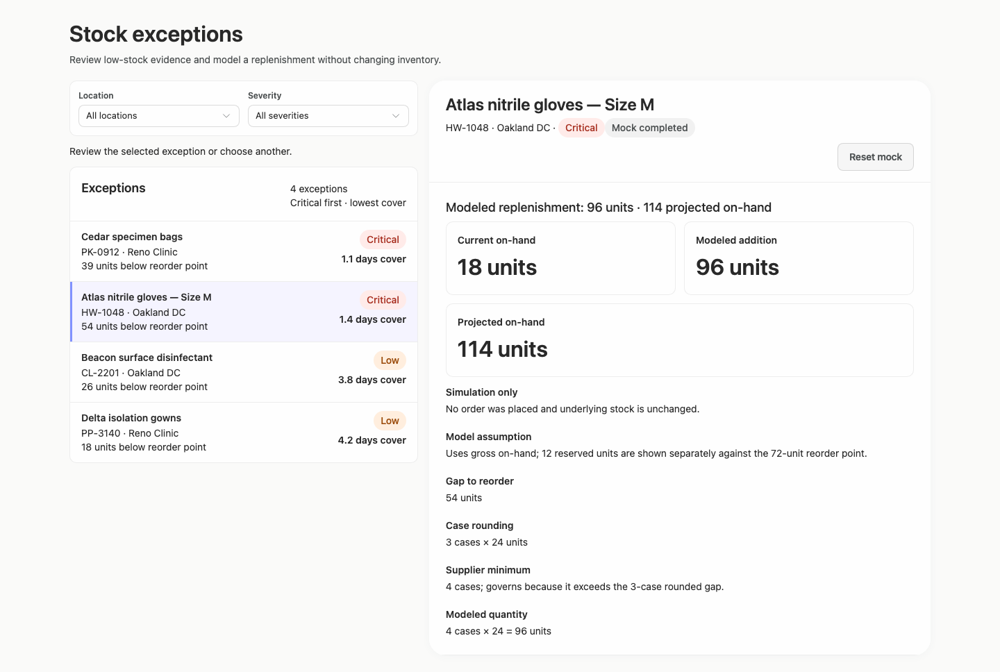

### desktop-4 — Reset fixture result

Interaction: passed.

### desktop-5 — Inspect supplier facts

Interaction: passed.

### desktop-wide-0 — initial

Interaction: not-run.

### desktop-wide-1 — Select record and review modeled quantity

Interaction: passed.

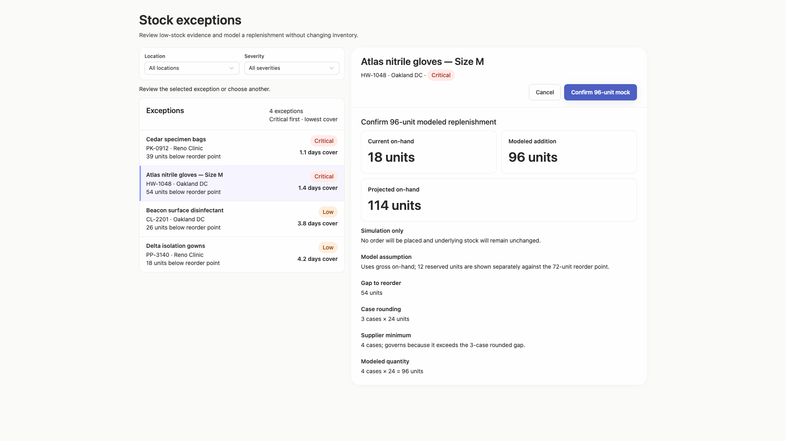

### desktop-wide-2 — Confirm modeled replenishment

Interaction: passed.

### desktop-wide-3 — Read projected quantity

Interaction: passed.

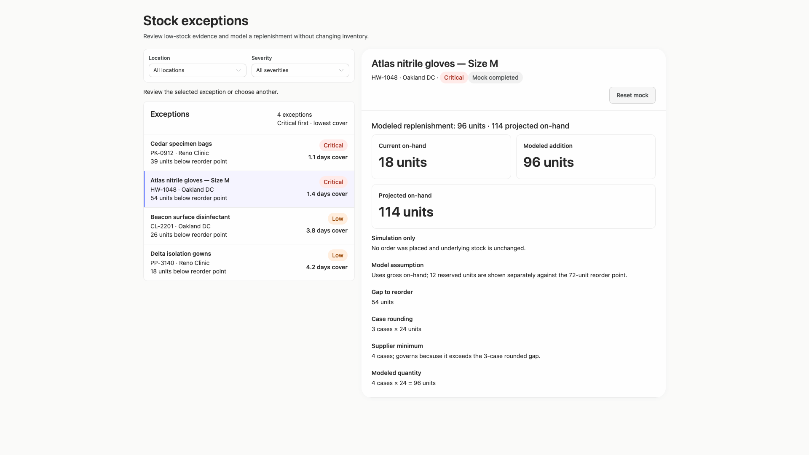

### desktop-wide-4 — Reset fixture result

Interaction: passed.

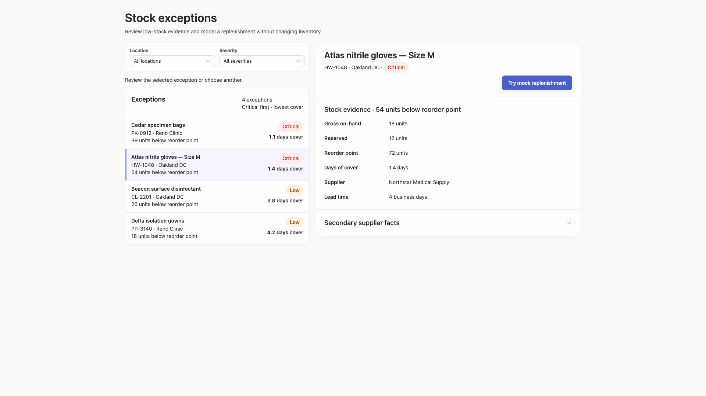

### desktop-wide-5 — Inspect supplier facts

Interaction: passed.

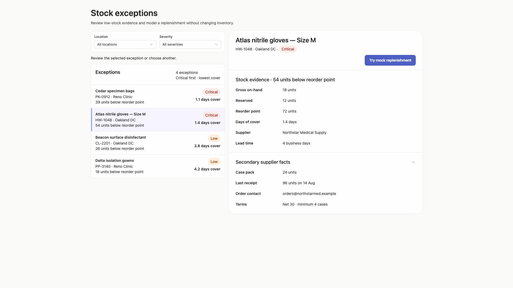

### desktop-window-0 — initial

Interaction: not-run.

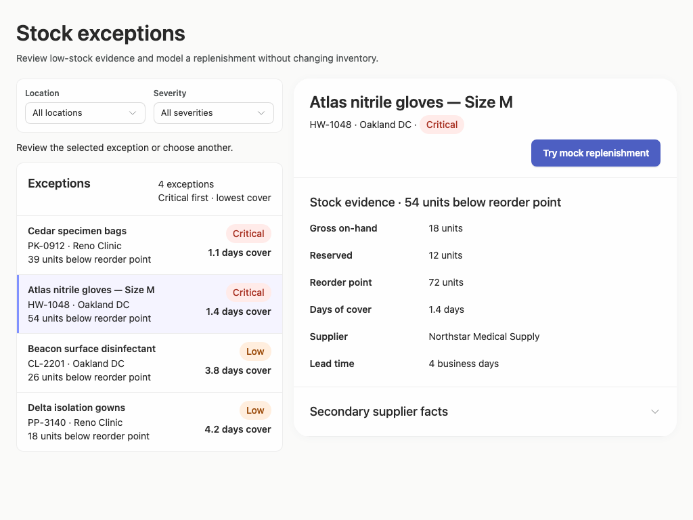

### desktop-window-1 — Select record and review modeled quantity

Interaction: passed.

### desktop-window-2 — Confirm modeled replenishment

Interaction: passed.

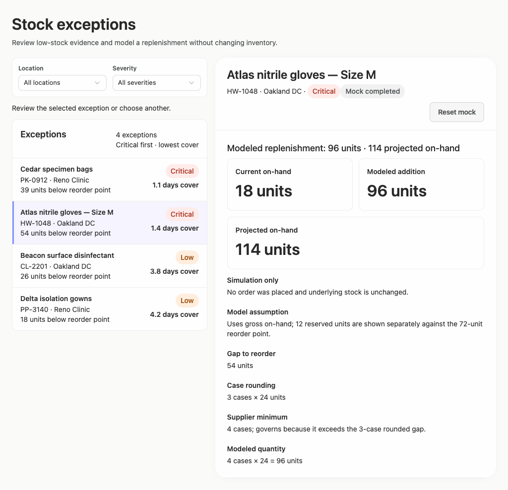

### desktop-window-3 — Read projected quantity

Interaction: passed.

### desktop-window-4 — Reset fixture result

Interaction: passed.

### desktop-window-5 — Inspect supplier facts

Interaction: passed.

### desktop-custom-700x900-0 — initial

Interaction: not-run.

### desktop-custom-700x900-1 — Select record and review modeled quantity

Interaction: passed.

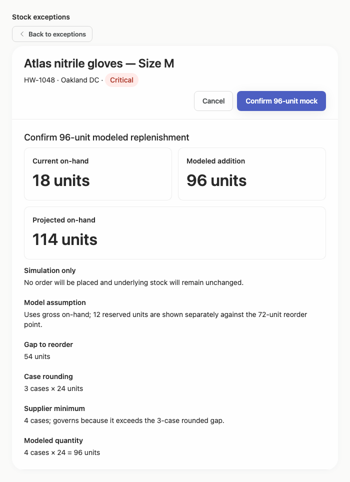

### desktop-custom-700x900-2 — Confirm modeled replenishment

Interaction: passed.

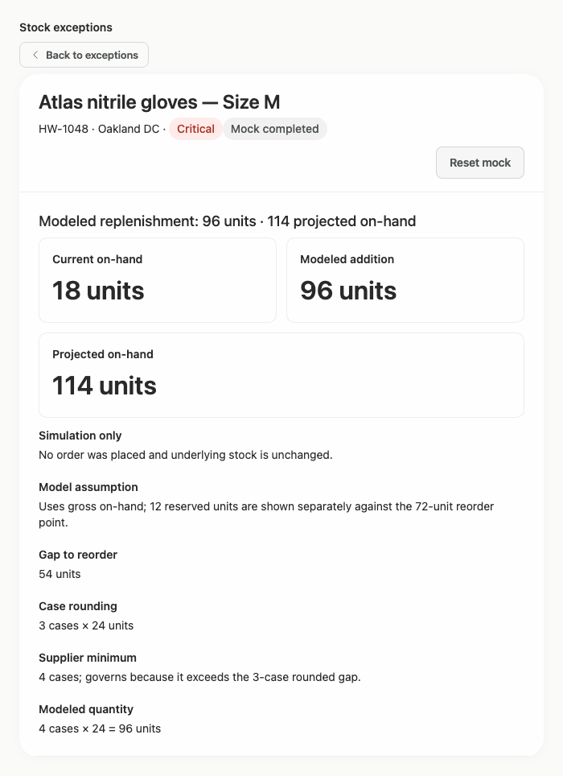

### desktop-custom-700x900-3 — Read projected quantity

Interaction: passed.

### desktop-custom-700x900-4 — Reset fixture result

Interaction: passed.

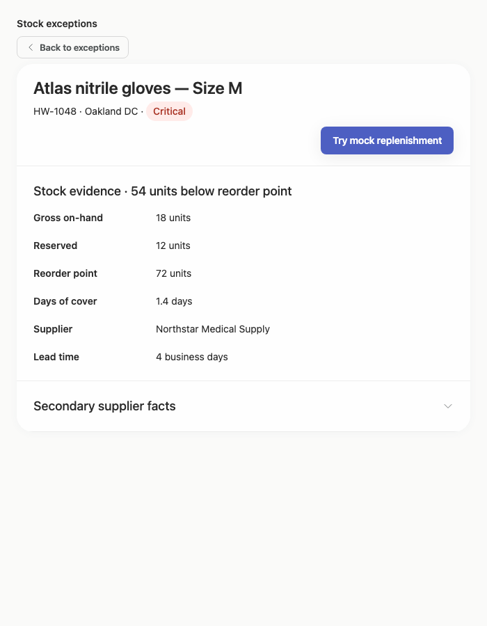

### desktop-custom-700x900-5 — Inspect supplier facts

Interaction: passed.

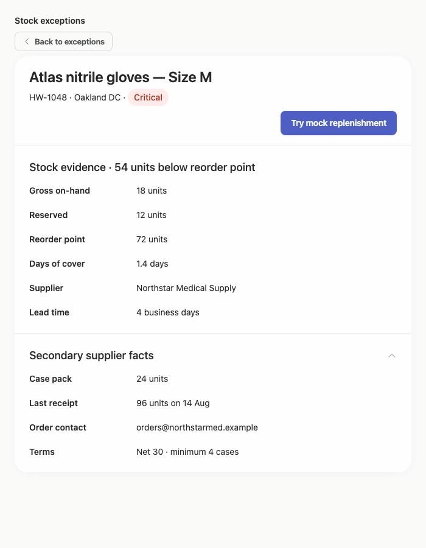

## Limitations

- No expanded filter menus, filtered result sets, empty states, or record-selection transitions are visible, so those states were not assessed.
- The supplied interaction checks demonstrate expected prototype text changes but do not establish production data behavior or persistence.
- No separate implementation-plan artifact was supplied, so the requested implementation plan could not be evaluated.
- Styling provenance is largely unassessed in the supplied measurements; the visual review only observes that the rendered palette and components appear consistent.
- Only the supplied desktop widths and states were evaluated; intermediate panel widths and unusually long fixture content remain uncertain.
