# stock-exceptions-concise-confirmation — 2026-09-09T07:55:11.473Z

[All reports](../../README.md) · [Interactive HTML report](index.html) · [Full measurements and scoring](report.json)

GitHub renders this summary and the screenshots. Download or clone this folder to open the HTML report locally; GitHub does not serve it as a website.

**Subjective design score:** 85/100. Model: openai/gpt-5.6-sol. Rubric: 2.

**Arrusted adherence:** 100/100 (partial); evidence coverage 1.54%. Evaluator 3.

| Dimension | Conforming | Nonconforming | Unassessed | Adherence    |
| --------- | ---------- | ------------- | ---------- | ------------ |
| component | 19         | 0             | 2          | 100% (19/19) |
| api       | 49         | 0             | 10         | 100% (49/49) |
| styling   | 13         | 0             | 5181       | 100% (13/13) |

Scores from different evaluator versions or captured states are not directly comparable.

This report evaluates the captured preview; evaluation itself does not regenerate the app or prove a built backend. Scores are advisory and not human-calibrated.

## Ratings

| Dimension      | Score | Reason                                                                                                                                                                                                                                                                                                                                                     |
| -------------- | ----- | ---------------------------------------------------------------------------------------------------------------------------------------------------------------------------------------------------------------------------------------------------------------------------------------------------------------------------------------------------------- |
| hierarchy      | 3/4   | The page title, selected product, stock-evidence heading, severity pills, and primary replenishment action establish a clear scan path. Selected-row highlighting is prominent, although exception rows show severity and days of cover without the unit shortfall used in the detail, limiting at-a-glance prioritization.                                |
| layout         | 4/4   | The filters, exception list, and detail panel use consistent edges, spacing, and section dividers. The 1024–1920 captures remain balanced and appropriately dense, while action footers stay separated from evidence content.                                                                                                                              |
| typography     | 3/4   | Heading levels, compact field labels, key-value rows, and numeric units are consistent and readable throughout. The supplied accessibility audit does flag insufficient contrast for text inside the authoritative primary Button in several states; this should be documented for Arrusted system-owner review rather than locally recolored.             |
| responsive     | 4/4   | The composition adapts well across 1920, 1440, 1024, and 700-pixel desktop windows. It preserves list-detail context at 1024, changes to a constrained detail view with a clear Back control at 700, and uses bounded vertical scrolling for longer evidence without horizontal overflow.                                                                  |
| productClarity | 3/4   | Location and severity filters, selection state, supplier facts, modeled quantity, projected on-hand, and reset behavior make the workflow understandable. Repeated simulation messaging clearly limits expectations, but the confirmation state says “No order was placed” before confirmation, which reads like a completed result rather than a preview. |

## Strengths

- Clear master-detail workflow connects each exception to stock and supplier evidence.
- Exception rows combine product identity, location, severity, and days of cover in a compact, scannable format.
- Selected-state treatment is visible without overwhelming the row content.
- The confirmation explains the 96-unit calculation, supplier minimum, baseline, and projected on-hand before the mock action.
- Result states prominently state that inventory is unchanged and provide an obvious reset action.
- Progressive disclosure keeps secondary supplier facts available without crowding the initial review.
- The constrained 700-pixel desktop composition provides a clear route back to the exception list instead of compressing both panels.

## Improvements

- **low — desktop-0:** Rows expose severity and days of cover but omit the size of each stock shortfall. Users comparing multiple exceptions within the same severity must open them individually to discover the gap that drives replenishment. Use the existing record evidence or secondary-text slot to add a concise measure such as “54 units below reorder point,” while retaining days of cover.
- **medium — desktop-1:** The confirmation view says “No order was placed and underlying stock is unchanged” before the user confirms. The past tense resembles completion feedback and weakens the distinction between preview and result. Use prospective wording in this state, such as “No order will be placed and underlying stock will remain unchanged,” reserving the current past-tense message for the result state.
- **low — desktop-window-5:** After secondary supplier facts are expanded in the shorter window, the internal panel starts midway through stock evidence at “Reorder point”; its heading, gross on-hand, and reserved values are no longer visible. The selected product remains pinned, but the relationship between the visible values and their section is less obvious. Avoid an unexpected internal scroll jump when expanding the disclosure, or keep the stock-evidence section heading visible while its rows are partially scrolled.
- **low — desktop-0:** The supplied audit reports insufficient text contrast for the authoritative primary Button treatment. The action remains legible in the screenshot, but this is a recurring advisory accessibility concern across initial and confirmation states. Keep the public Button and Arrusted palette unchanged in the prototype; record the issue in the implementation plan for review by the Arrusted component owner rather than applying a local color override.

## Token evidence

Percentages cover only assessed properties. Missing provenance and ambiguous CSS remain unassessed; matching literals are not proof of token usage.

| Viewport                 | Category   | Token references / assessed | Coverage   |
| ------------------------ | ---------- | --------------------------- | ---------- |
| desktop-0                | color      | 0/0                         | 0% (0/233) |
| desktop-0                | typography | 0/0                         | 0% (0/526) |
| desktop-0                | spacing    | 0/0                         | 0% (0/275) |
| desktop-0                | radius     | 0/0                         | 0% (0/116) |
| desktop-0                | border     | 0/0                         | 0% (0/125) |
| desktop-0                | shadow     | 0/0                         | 0% (0/120) |
| desktop-wide-0           | color      | 0/0                         | 0% (0/233) |
| desktop-wide-0           | typography | 0/0                         | 0% (0/526) |
| desktop-wide-0           | spacing    | 0/0                         | 0% (0/275) |
| desktop-wide-0           | radius     | 0/0                         | 0% (0/116) |
| desktop-wide-0           | border     | 0/0                         | 0% (0/125) |
| desktop-wide-0           | shadow     | 0/0                         | 0% (0/120) |
| desktop-window-0         | color      | 0/0                         | 0% (0/233) |
| desktop-window-0         | typography | 0/0                         | 0% (0/526) |
| desktop-window-0         | spacing    | 0/0                         | 0% (0/275) |
| desktop-window-0         | radius     | 0/0                         | 0% (0/116) |
| desktop-window-0         | border     | 0/0                         | 0% (0/125) |
| desktop-window-0         | shadow     | 0/0                         | 0% (0/120) |
| desktop-custom-700x900-0 | color      | 0/0                         | 0% (0/161) |
| desktop-custom-700x900-0 | typography | 0/0                         | 0% (0/405) |
| desktop-custom-700x900-0 | spacing    | 0/0                         | 0% (0/184) |
| desktop-custom-700x900-0 | radius     | 0/0                         | 0% (0/81)  |
| desktop-custom-700x900-0 | border     | 0/0                         | 0% (0/84)  |
| desktop-custom-700x900-0 | shadow     | 0/0                         | 0% (0/81)  |

## Latest-run screenshots

### desktop-0 — initial

Interaction: not-run.

### desktop-1 — Review modeled quantity before confirming

Interaction: passed.

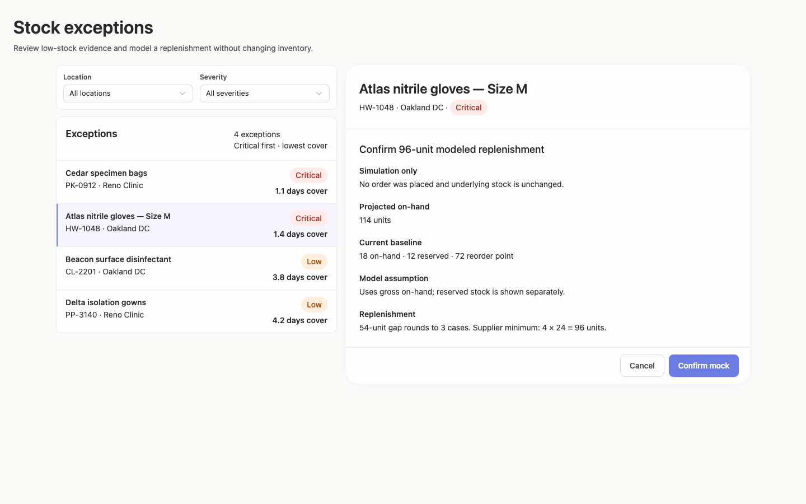

### desktop-2 — Mock replenishment result

Interaction: passed.

### desktop-3 — Result evidence at scroll boundary

Interaction: passed.

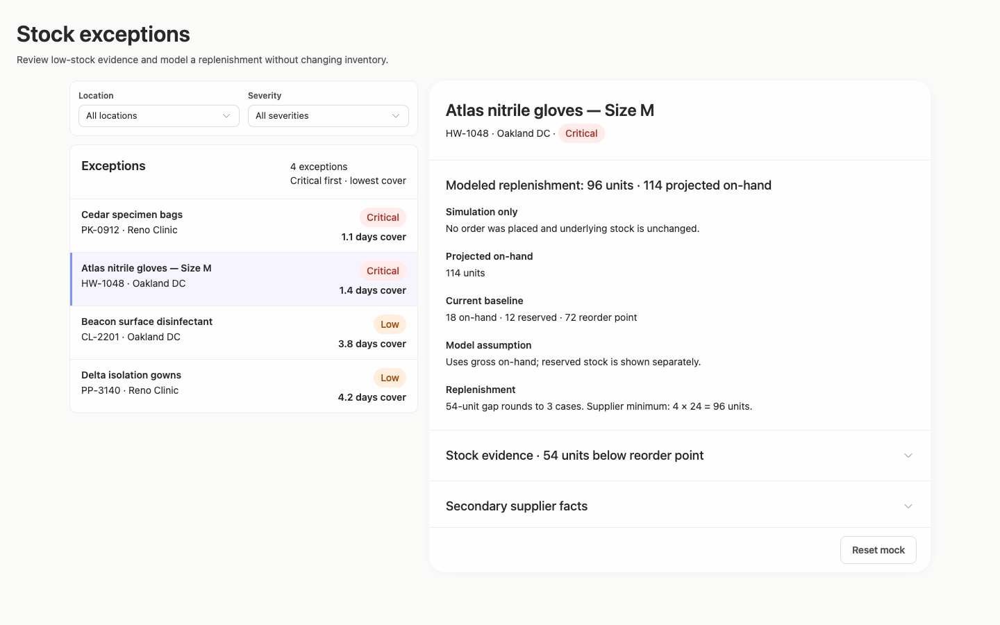

### desktop-4 — Reset from result footer

Interaction: passed.

### desktop-5 — Expanded supplier facts

Interaction: passed.

### desktop-wide-0 — initial

Interaction: not-run.

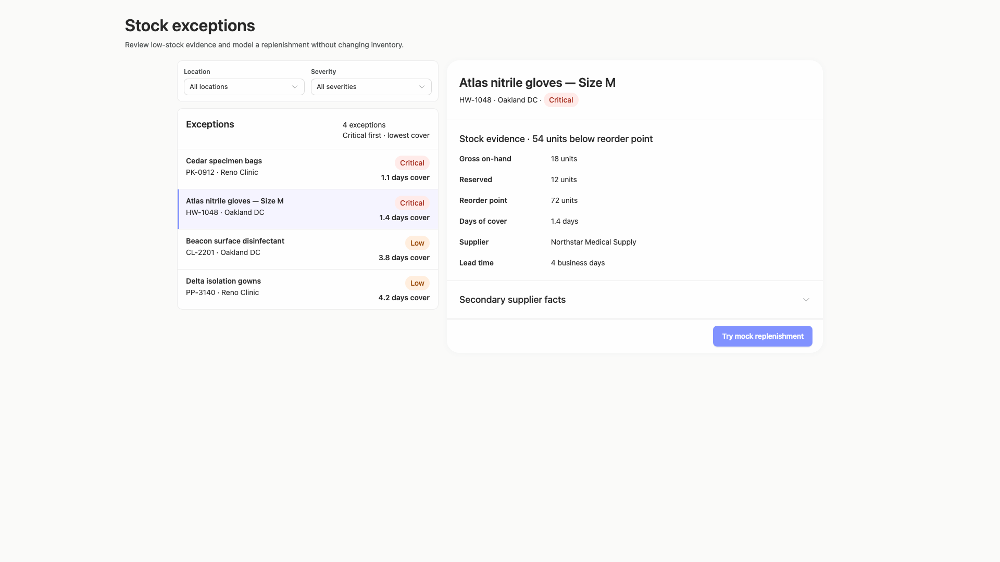

### desktop-wide-1 — Review modeled quantity before confirming

Interaction: passed.

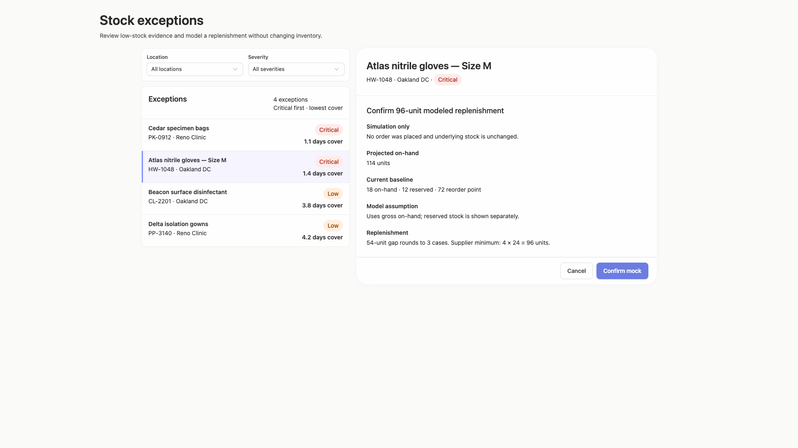

### desktop-wide-2 — Mock replenishment result

Interaction: passed.

### desktop-wide-3 — Result evidence at scroll boundary

Interaction: passed.

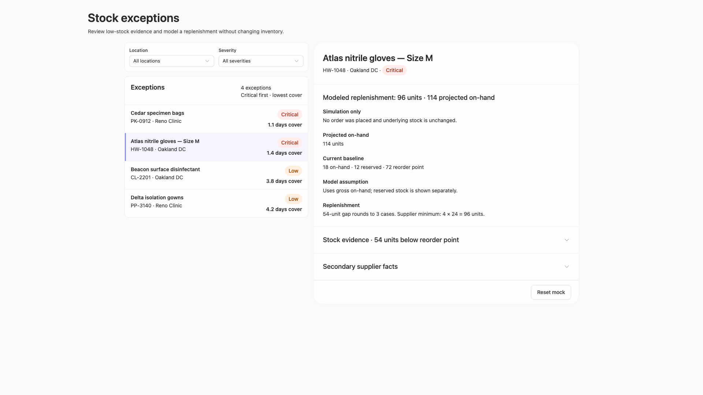

### desktop-wide-4 — Reset from result footer

Interaction: passed.

### desktop-wide-5 — Expanded supplier facts

Interaction: passed.

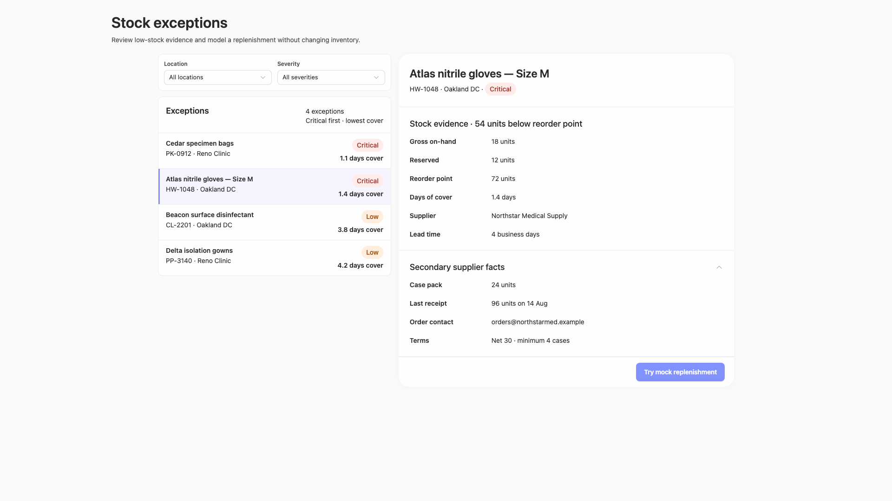

### desktop-window-0 — initial

Interaction: not-run.

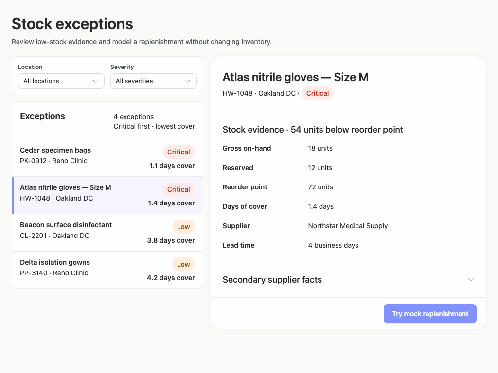

### desktop-window-1 — Review modeled quantity before confirming

Interaction: passed.

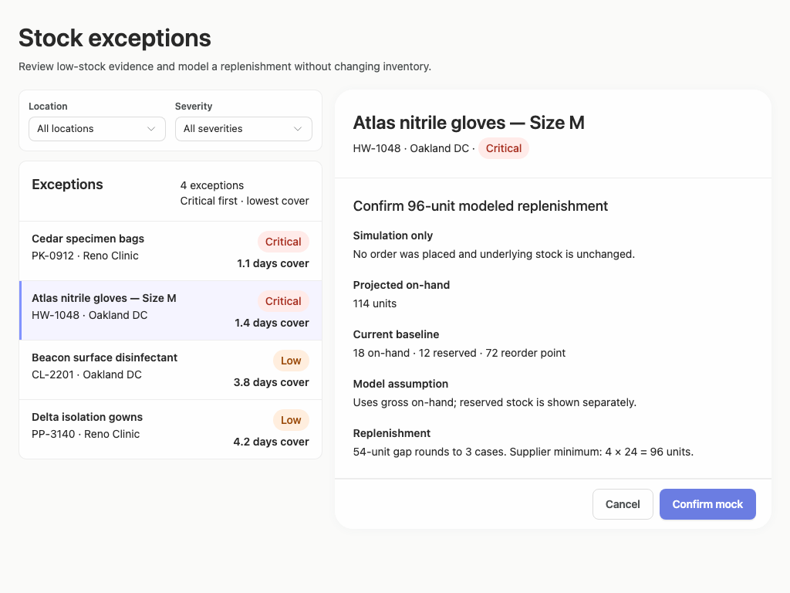

### desktop-window-2 — Mock replenishment result

Interaction: passed.

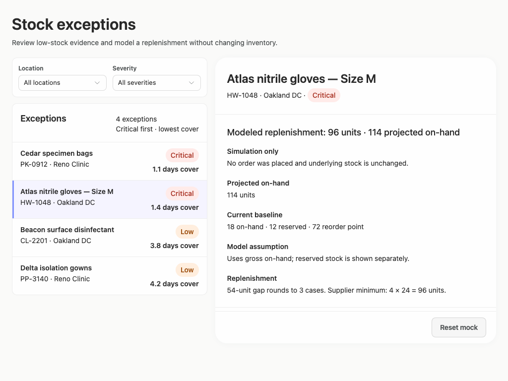

### desktop-window-3 — Result evidence at scroll boundary

Interaction: passed.

### desktop-window-4 — Reset from result footer

Interaction: passed.

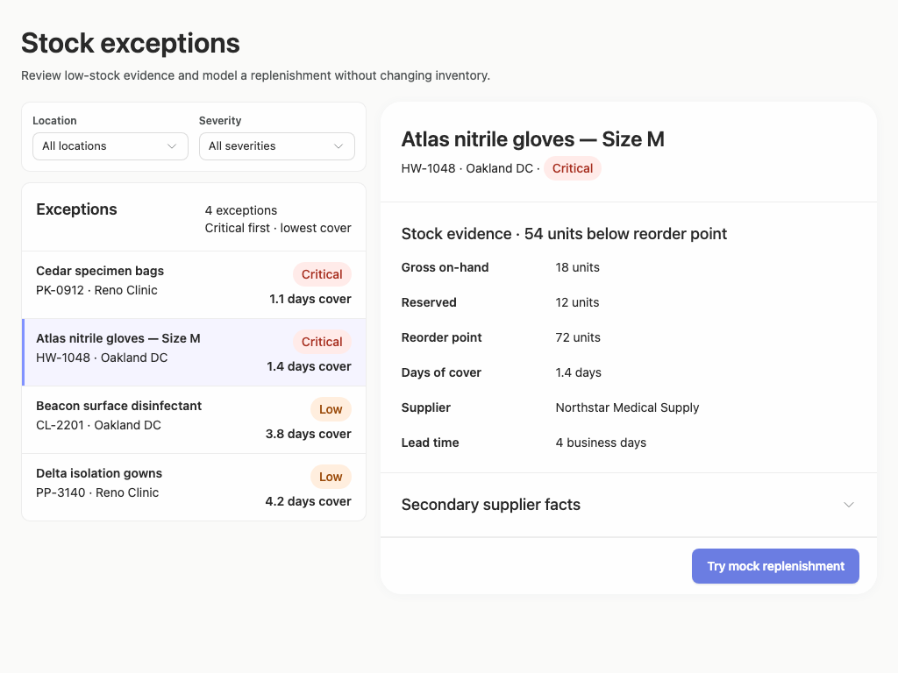

### desktop-window-5 — Expanded supplier facts

Interaction: passed.

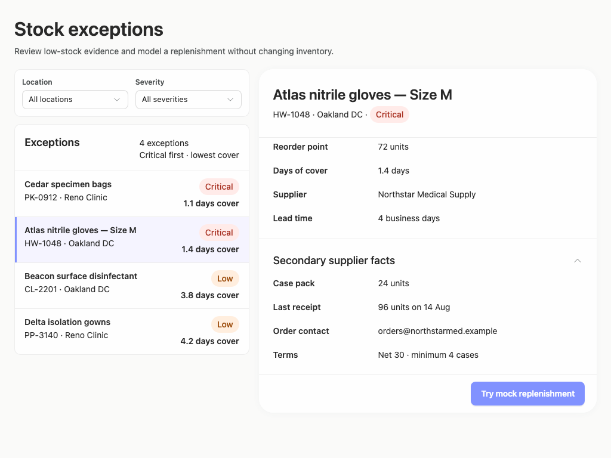

### desktop-custom-700x900-0 — initial

Interaction: not-run.

### desktop-custom-700x900-1 — Review modeled quantity before confirming

Interaction: passed.

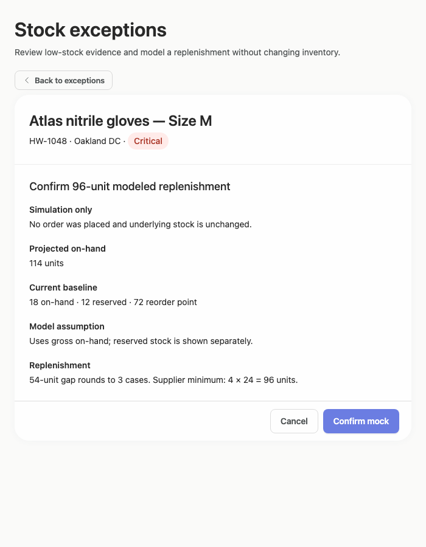

### desktop-custom-700x900-2 — Mock replenishment result

Interaction: passed.

### desktop-custom-700x900-3 — Result evidence at scroll boundary

Interaction: passed.

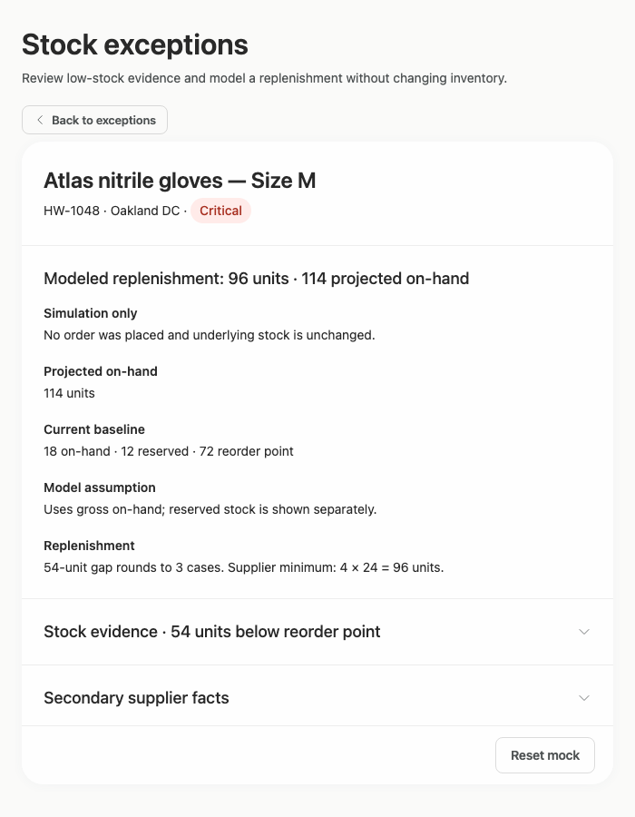

### desktop-custom-700x900-4 — Reset from result footer

Interaction: passed.

### desktop-custom-700x900-5 — Expanded supplier facts

Interaction: passed.

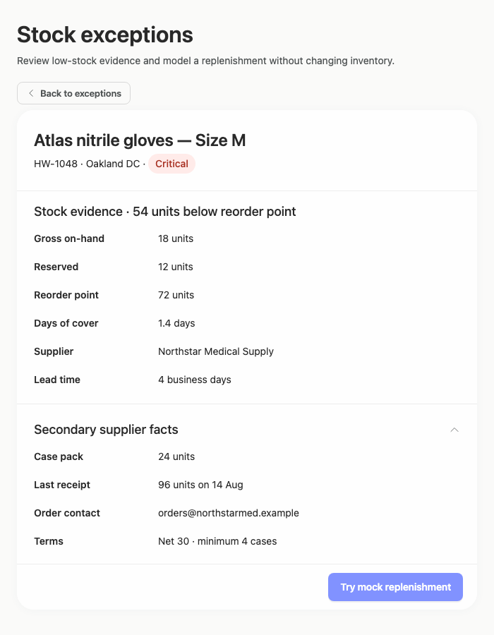

## Limitations

- No implementation-plan artifact was supplied, so the requested plan and stop-before-build/publication deliverable cannot be evaluated from these captures.
- The 700-pixel captures show only constrained detail states; the exception list and filters after using Back were not shown, so that narrow desktop state is unverified.
- Filter result states, empty results, and selection changes between products were not visually demonstrated.
- Initial interactions were not run in several captures; screenshots do not establish backend behavior or persistence.
- Static source findings and adherence measurements do not prove that every dynamic JSX branch rendered.
- The styling evidence has very low assessed coverage and is not a complete CSS-cascade or component-provenance review.
