# stock-exceptions-confirmation-evidence — 2026-09-09T07:00:15.211Z

[All reports](../../README.md) · [Interactive HTML report](index.html) · [Full measurements and scoring](report.json)

GitHub renders this summary and the screenshots. Download or clone this folder to open the HTML report locally; GitHub does not serve it as a website.

**Subjective design score:** 85/100. Model: openai/gpt-5.6-sol. Rubric: 2.

**Arrusted adherence:** 100/100 (partial); evidence coverage 1.37%. Evaluator 3.

| Dimension | Conforming | Nonconforming | Unassessed | Adherence    |
| --------- | ---------- | ------------- | ---------- | ------------ |
| component | 18         | 0             | 2          | 100% (18/18) |
| api       | 41         | 0             | 13         | 100% (41/41) |
| styling   | 13         | 0             | 5181       | 100% (13/13) |

Scores from different evaluator versions or captured states are not directly comparable.

This report evaluates the captured preview; evaluation itself does not regenerate the app or prove a built backend. Scores are advisory and not human-calibrated.

## Ratings

| Dimension      | Score | Reason                                                                                                                                                                                                                                                                                                                                                                |
| -------------- | ----- | --------------------------------------------------------------------------------------------------------------------------------------------------------------------------------------------------------------------------------------------------------------------------------------------------------------------------------------------------------------------- |
| hierarchy      | 4/4   | The page title and task summary establish context immediately, while the split list-detail composition in desktop-0 gives the selected exception, severity, stock evidence, and primary mock action clear priority. Confirmation and result states retain the product identity and elevate the modeled quantity without losing context.                               |
| layout         | 3/4   | Alignment and spacing are consistent across filters, exception rows, evidence labels, and action footers in desktop-0 and desktop-wide-0. The centered maximum-width composition remains readable on wide windows, though the confirmation body at 1024px becomes vertically constrained and allows the final case-pack row to sit beneath the fixed action footer.   |
| typography     | 3/4   | Headings, bold field labels, regular values, and status pills form a consistent and readable system across desktop-0 and desktop-custom-700x900-1. Longer confirmation labels wrap understandably, but the dense two-column evidence at 1024px produces several awkward multi-line labels and makes the final row easier to miss.                                     |
| responsive     | 3/4   | The composition adapts successfully from centered wide layouts to a compact 1024px split view and then to a detail-only panel with a clear Back control at 700px. Controls remain usable and action footers stay available, but desktop-window-1 relies on an internal scroll area that initially obscures confirmation evidence immediately above the action.        |
| productClarity | 4/4   | The interface clearly supports location and severity filtering, record selection, stock and supplier review, confirmation, a simulation-only result, and reset. Repeated text such as “No order was placed and underlying stock is unchanged” makes the mock nature explicit; the only notable ambiguity is why a 54-unit shortfall produces a 72-unit replenishment. |

## Strengths

- Clear master-detail workflow connects exception selection directly to stock and supplier evidence.
- Location and severity filters are prominent and labeled, with a matching-versus-total count providing useful filter feedback.
- Rows expose product identity, location, severity, and days of cover in a compact, highly scannable format.
- Selected-state treatment is visible without overwhelming the existing Arrusted palette.
- Confirmation and result states explicitly state that the action is a simulation and does not alter inventory.
- The 700px desktop-panel composition sensibly replaces the split view with a detail view and an obvious Back to exceptions control.
- Expandable secondary supplier facts keep the default view concise while preserving access to case pack, receipt, contact, and terms.
- Mock action, confirmation, result, reset, and expanded supplier states are visually represented across multiple desktop sizes.

## Improvements

- **medium — desktop-window-1:** The fixed confirmation footer overlaps the visual area where the “Case pack” row begins, so a user can reach Confirm mock before seeing an important constraint that determines the modeled quantity. At constrained desktop heights, use the compact detail density or reserve enough body space above the footer to show the complete case-pack row. Alternatively, repeat the case-pack constraint in the visible confirmation summary.
- **medium — desktop-1:** The confirmation shows a 54-unit shortfall, a 24-unit case pack, and a 72-unit modeled replenishment, but it does not directly state that the quantity was rounded to three full cases. Users must infer the calculation. Add a concise calculation beside the quantity, such as “54-unit shortfall, rounded up to 3 × 24-unit cases = 72 units.”
- **low — desktop-0:** Critical and Low exceptions are interleaved, and the items are not ordered by days of cover. With a larger result set, the most urgent record could be harder to identify despite the severity pills. Default to an urgency-oriented order—Critical first, then ascending days of cover—or expose a supported sort control while retaining the existing severity filter.
- **low — desktop-window-5:** Expanding supplier facts at the shorter desktop height leaves the detail panel scrolled past the opening stock fields, so on-hand and reserved context is no longer visible while reviewing supplier terms. When expanding the supplier section, preserve the section header and enough stock summary context, or use a compact read-detail layout so both the key stock metrics and supplier facts fit with less scrolling.

## Token evidence

Percentages cover only assessed properties. Missing provenance and ambiguous CSS remain unassessed; matching literals are not proof of token usage.

| Viewport                 | Category   | Token references / assessed | Coverage   |
| ------------------------ | ---------- | --------------------------- | ---------- |
| desktop-0                | color      | 0/0                         | 0% (0/233) |
| desktop-0                | typography | 0/0                         | 0% (0/526) |
| desktop-0                | spacing    | 0/0                         | 0% (0/275) |
| desktop-0                | radius     | 0/0                         | 0% (0/116) |
| desktop-0                | border     | 0/0                         | 0% (0/125) |
| desktop-0                | shadow     | 0/0                         | 0% (0/120) |
| desktop-wide-0           | color      | 0/0                         | 0% (0/233) |
| desktop-wide-0           | typography | 0/0                         | 0% (0/526) |
| desktop-wide-0           | spacing    | 0/0                         | 0% (0/275) |
| desktop-wide-0           | radius     | 0/0                         | 0% (0/116) |
| desktop-wide-0           | border     | 0/0                         | 0% (0/125) |
| desktop-wide-0           | shadow     | 0/0                         | 0% (0/120) |
| desktop-window-0         | color      | 0/0                         | 0% (0/233) |
| desktop-window-0         | typography | 0/0                         | 0% (0/526) |
| desktop-window-0         | spacing    | 0/0                         | 0% (0/275) |
| desktop-window-0         | radius     | 0/0                         | 0% (0/116) |
| desktop-window-0         | border     | 0/0                         | 0% (0/125) |
| desktop-window-0         | shadow     | 0/0                         | 0% (0/120) |
| desktop-custom-700x900-0 | color      | 0/0                         | 0% (0/161) |
| desktop-custom-700x900-0 | typography | 0/0                         | 0% (0/405) |
| desktop-custom-700x900-0 | spacing    | 0/0                         | 0% (0/184) |
| desktop-custom-700x900-0 | radius     | 0/0                         | 0% (0/81)  |
| desktop-custom-700x900-0 | border     | 0/0                         | 0% (0/84)  |
| desktop-custom-700x900-0 | shadow     | 0/0                         | 0% (0/81)  |

## Latest-run screenshots

### desktop-0 — initial

Interaction: not-run.

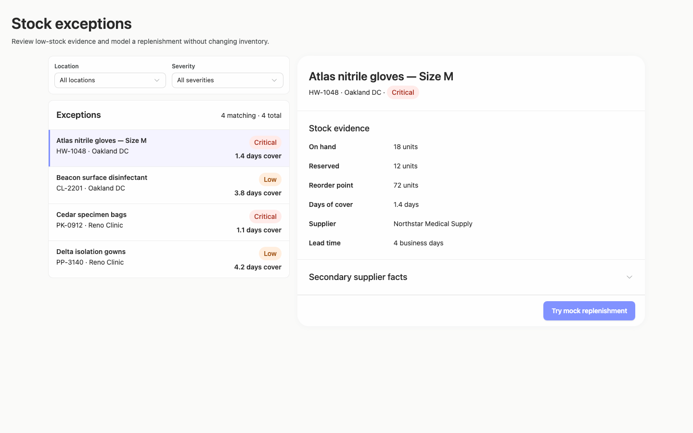

### desktop-1 — Review modeled quantity before confirming

Interaction: passed.

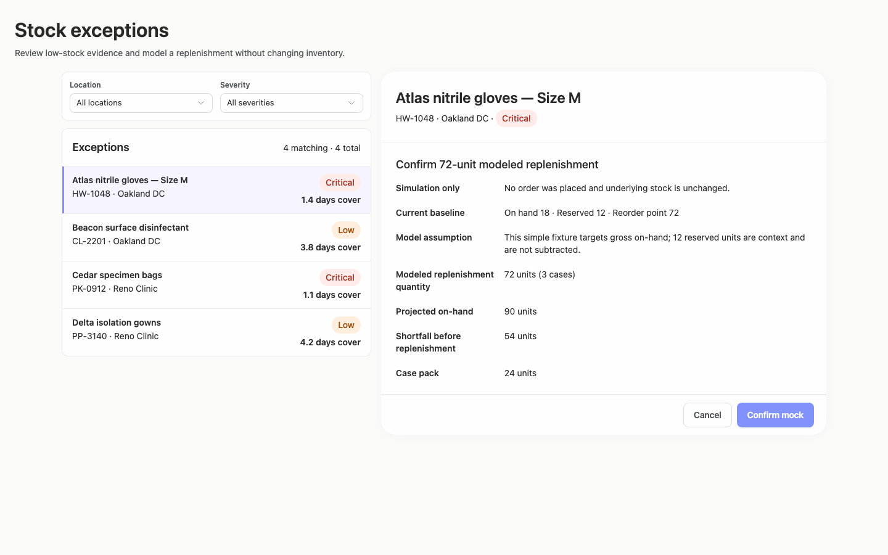

### desktop-2 — Mock replenishment result

Interaction: passed.

### desktop-3 — Result evidence at scroll boundary

Interaction: passed.

### desktop-4 — Reset from result footer

Interaction: passed.

### desktop-5 — Expanded supplier facts

Interaction: passed.

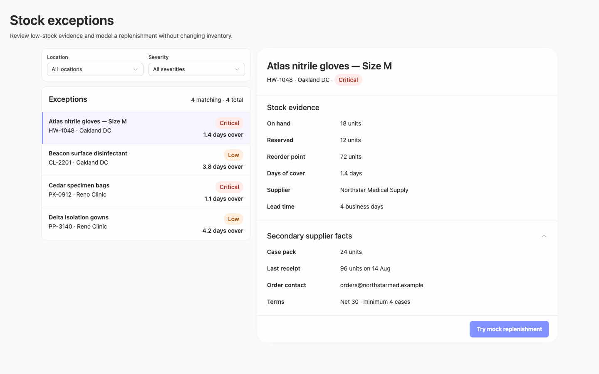

### desktop-wide-0 — initial

Interaction: not-run.

### desktop-wide-1 — Review modeled quantity before confirming

Interaction: passed.

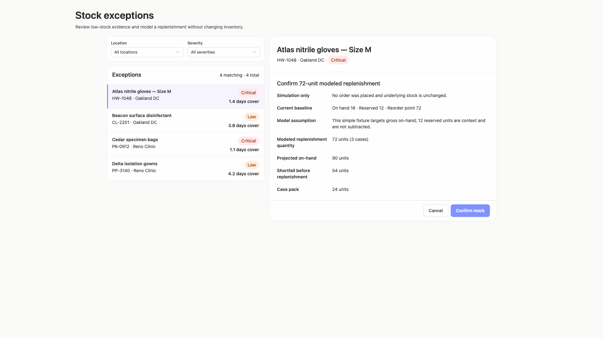

### desktop-wide-2 — Mock replenishment result

Interaction: passed.

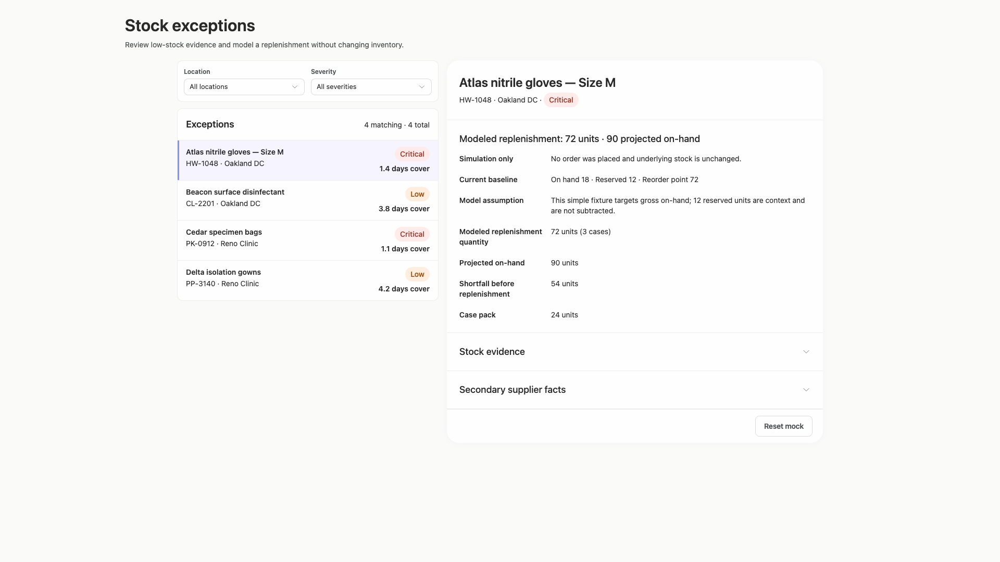

### desktop-wide-3 — Result evidence at scroll boundary

Interaction: passed.

### desktop-wide-4 — Reset from result footer

Interaction: passed.

### desktop-wide-5 — Expanded supplier facts

Interaction: passed.

### desktop-window-0 — initial

Interaction: not-run.

### desktop-window-1 — Review modeled quantity before confirming

Interaction: passed.

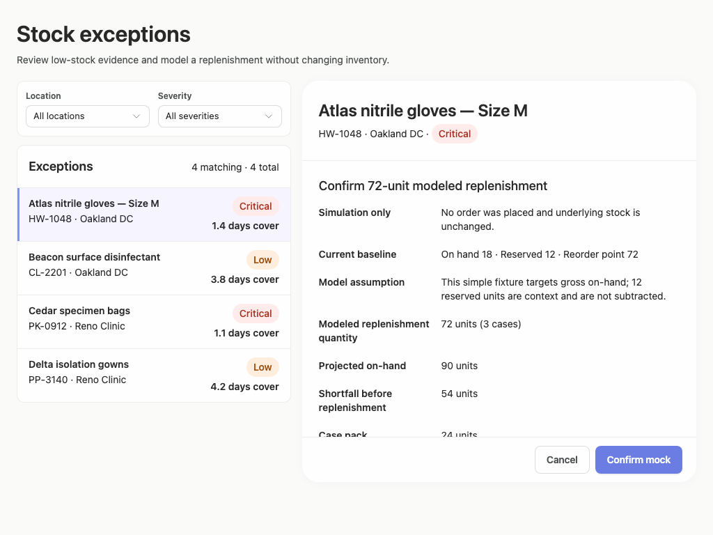

### desktop-window-2 — Mock replenishment result

Interaction: passed.

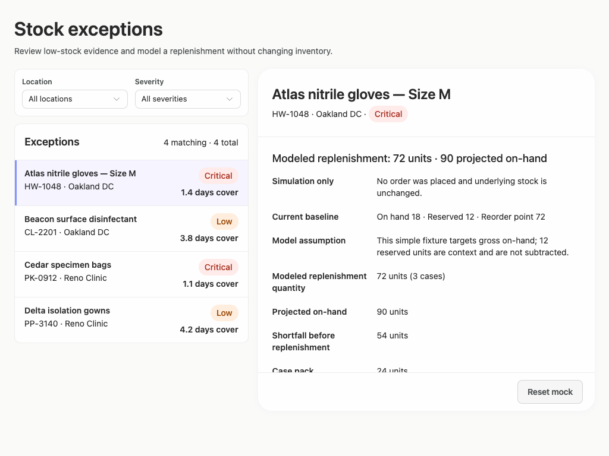

### desktop-window-3 — Result evidence at scroll boundary

Interaction: passed.

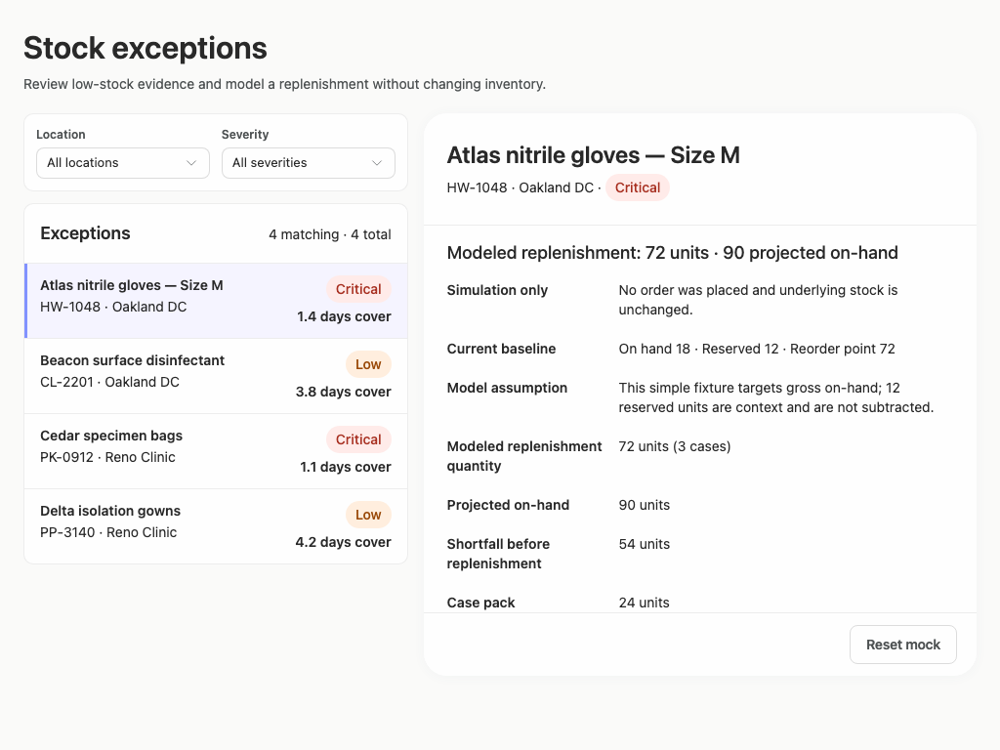

### desktop-window-4 — Reset from result footer

Interaction: passed.

### desktop-window-5 — Expanded supplier facts

Interaction: passed.

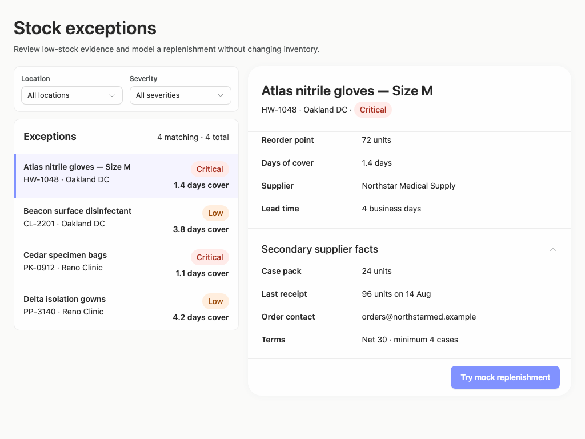

### desktop-custom-700x900-0 — initial

Interaction: not-run.

### desktop-custom-700x900-1 — Review modeled quantity before confirming

Interaction: passed.

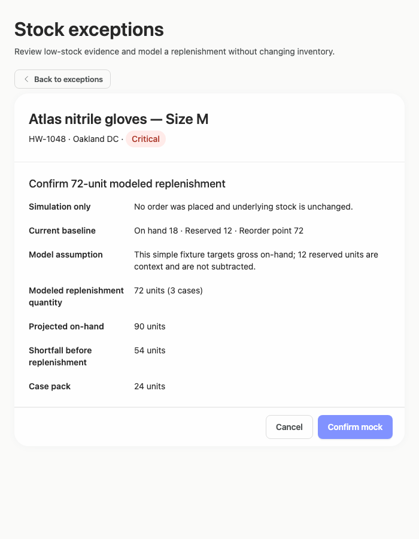

### desktop-custom-700x900-2 — Mock replenishment result

Interaction: passed.

### desktop-custom-700x900-3 — Result evidence at scroll boundary

Interaction: passed.

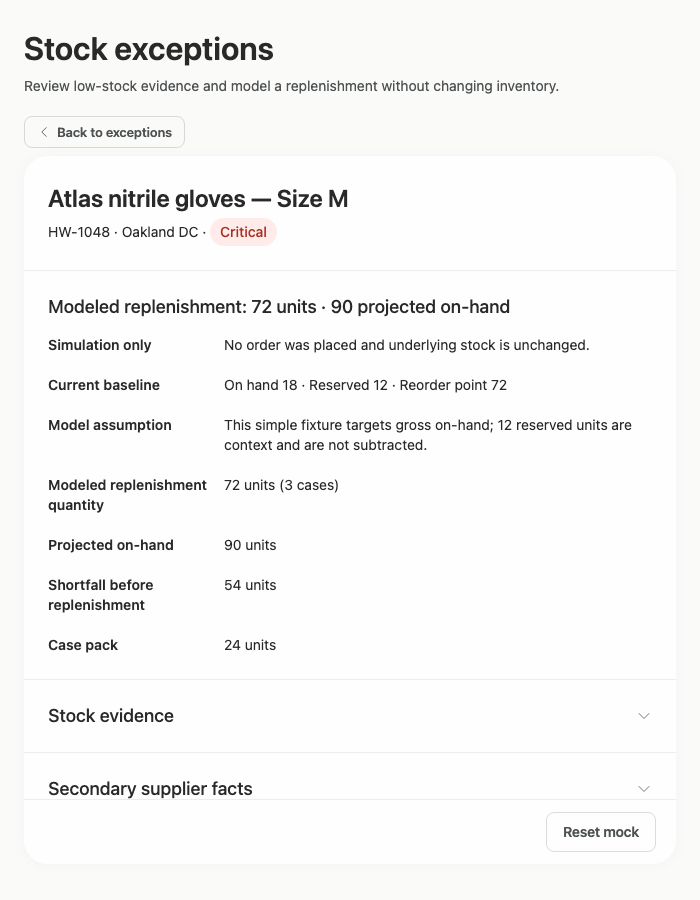

### desktop-custom-700x900-4 — Reset from result footer

Interaction: passed.

### desktop-custom-700x900-5 — Expanded supplier facts

Interaction: passed.

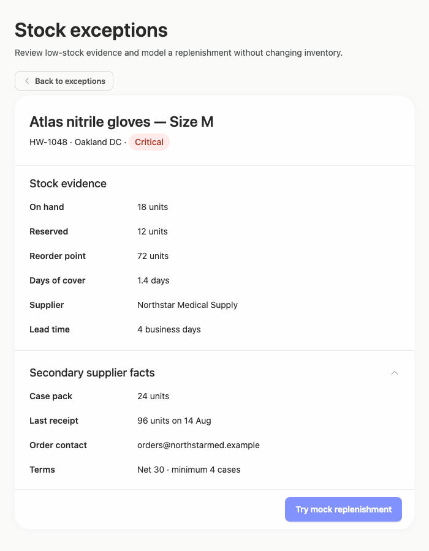

## Limitations

- No capture shows an opened filter menu, a filtered result set, an empty state, or selection of another exception; those states were not assessed.
- The 700px captures begin in a selected detail state, so the list and filtering experience at that panel width is not visible.
- The supplied evidence does not include the requested implementation plan, so its quality and completeness cannot be evaluated.
- Static screenshots and interaction summaries do not establish backend behavior, persistence, or authorization.
- Automated evidence flags primary-button text contrast in several states. This is advisory only; the existing Arrusted palette and supported component variants remain authoritative.
- Component and styling provenance are only partially assessable from the supplied static evidence; rendered appearance was judged independently of implementation compliance.
