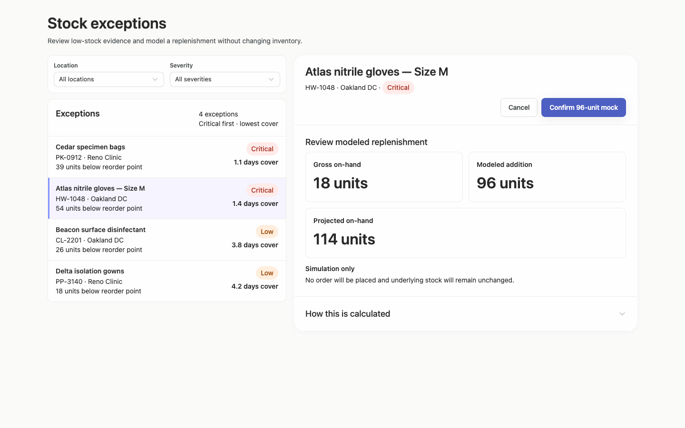
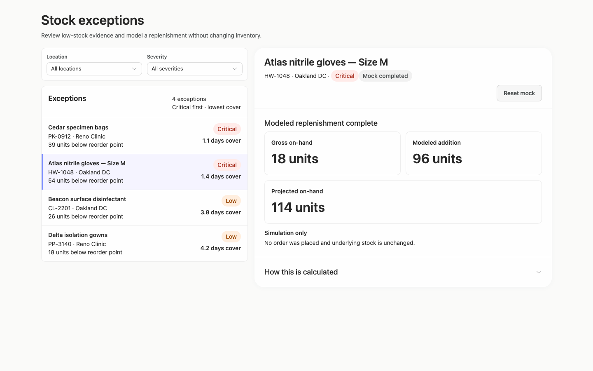
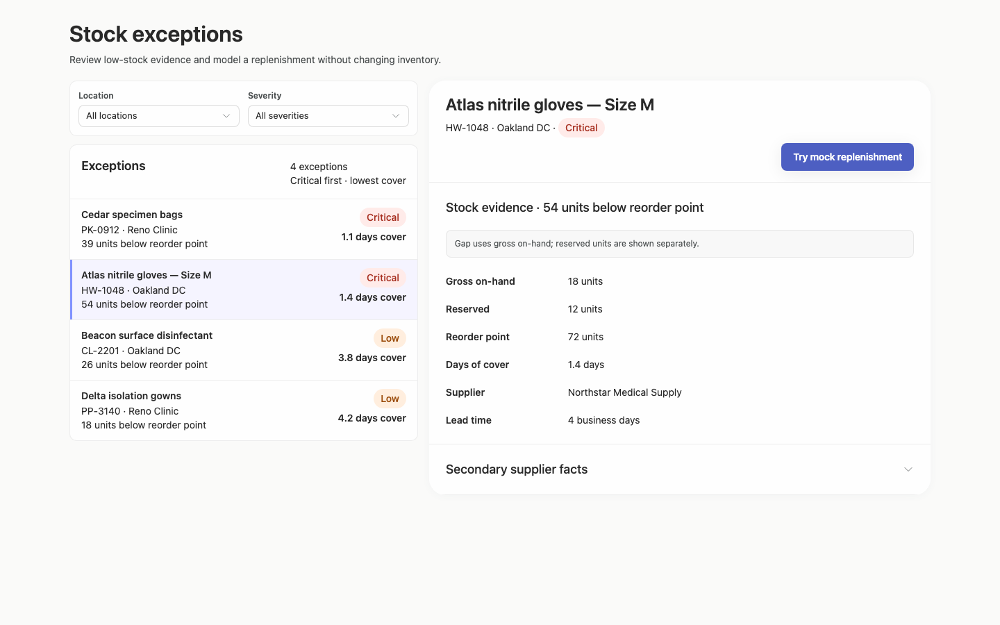
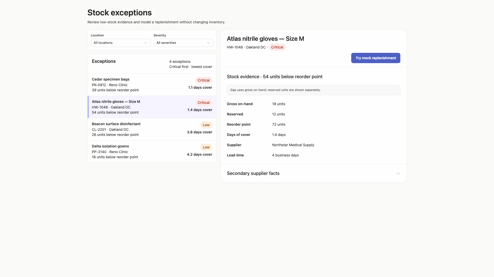
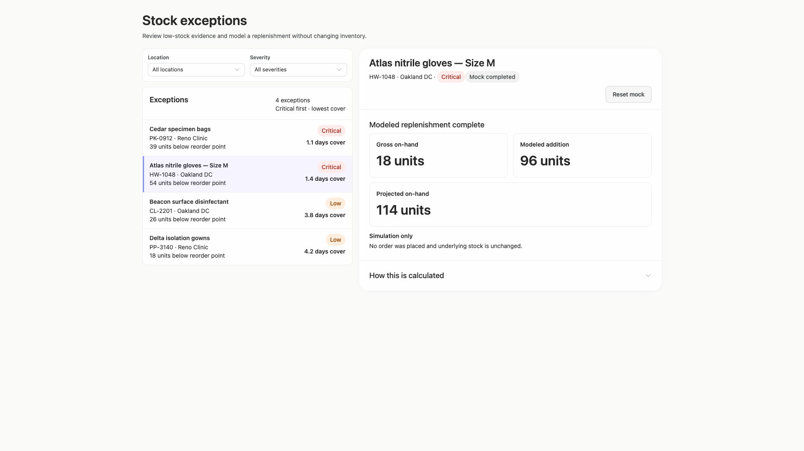
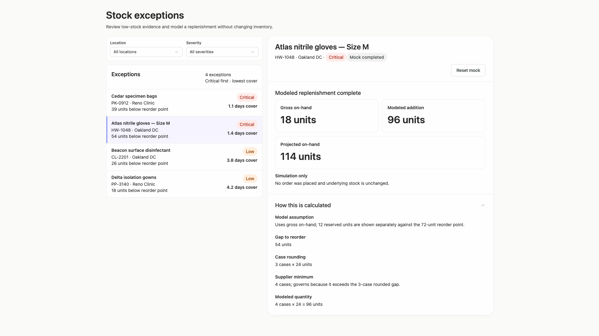
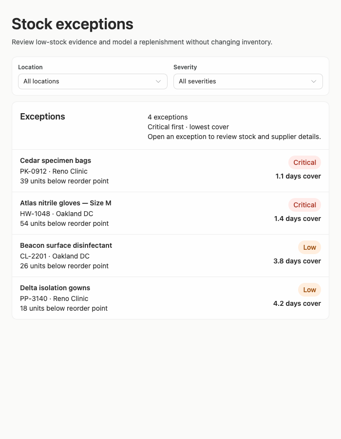

# stock-exceptions-consistent-basis — 2026-09-09T11:38:02.027Z

[All reports](../../README.md) · [Interactive HTML report](index.html) · [Full measurements and scoring](report.json)

GitHub renders this summary and the screenshots. Download or clone this folder to open the HTML report locally; GitHub does not serve it as a website.

**Subjective design score:** 95/100. Model: openai/gpt-5.6-sol. Rubric: 2.

**Arrusted adherence:** 100/100 (partial); evidence coverage 1.96%. Evaluator 3.

| Dimension | Conforming | Nonconforming | Unassessed | Adherence    |
| --------- | ---------- | ------------- | ---------- | ------------ |
| component | 24         | 0             | 6          | 100% (24/24) |
| api       | 63         | 0             | 11         | 100% (63/63) |
| styling   | 13         | 0             | 4982       | 100% (13/13) |

Scores from different evaluator versions or captured states are not directly comparable.

This report evaluates the captured preview; evaluation itself does not regenerate the app or prove a built backend. Scores are advisory and not human-calibrated.

## Ratings

| Dimension      | Score | Reason                                                                                                                                                                                                                                                                                                                                                                    |
| -------------- | ----- | ------------------------------------------------------------------------------------------------------------------------------------------------------------------------------------------------------------------------------------------------------------------------------------------------------------------------------------------------------------------------- |
| hierarchy      | 4/4   | The page title and purpose lead clearly, followed by filters, the prioritized exception list, and selected-record evidence. Selected-row treatment, severity pills, prominent projected quantity, and distinct review/completed headings make each workflow state easy to scan.                                                                                           |
| layout         | 3/4   | The two-pane composition is consistently aligned at 1024–1920 px, with balanced spacing, compact list rows, and well-structured detail cards. The 700 px list header becomes somewhat crowded, and the capped shell leaves substantial unused canvas on very wide windows, though neither prevents use.                                                                   |
| typography     | 4/4   | Type sizes and weights consistently distinguish page, record, section, field, and KPI levels. Product names, quantities, supporting metadata, and simulation warnings remain readable across all supplied desktop widths without visible clipping.                                                                                                                        |
| responsive     | 4/4   | The interface preserves a useful two-pane review layout at 1024 px and deliberately switches to a deferred list/detail flow at 700 px with a clear “Back to exceptions” control. Actions wrap without clipping, expanded disclosures use document scrolling, and all measured controls remain available in the shown states.                                              |
| productClarity | 4/4   | The task is explicit: filter low-stock exceptions, select a product, inspect stock and supplier facts, and model replenishment. Labels such as “Try mock replenishment,” “Simulation only,” “Mock completed,” and “No order was placed” clearly separate the prototype action from a real inventory change, while the calculation disclosure explains the 96-unit result. |

## Strengths

- The exception list exposes product identity, location, stock gap, severity, and days of cover in a compact, highly scannable row.
- Sorting context (“Critical first · lowest cover”) explains why the records appear in their current order.
- Selection remains visually connected to the detail pane through the highlighted Atlas row and repeated product identity.
- The replenishment review gives strong visual priority to gross on-hand, modeled addition, and projected on-hand before confirmation.
- Supplier details and calculation derivation are progressively disclosed, keeping the default view focused while retaining decision evidence.
- The constrained 700 px composition avoids squeezing both panes together and provides an explicit route back to the list.
- Completed-state messaging and reset affordance make the mock nature and reversibility of the prototype unusually clear.

## Improvements

- **low — desktop-custom-700x900-0:** At the constrained width, the exception count, sort description, and instructional sentence are packed into the right side of the list header. The helper wraps into a third line while the left side contains only the section title, producing an uneven and slightly busy header. Use a wrapping header composition that places the count and sort summary together, then moves the instructional sentence to a full-width line below the title row when space is constrained.
- **low — desktop-wide-0:** The centered shell remains about 1240 px wide on a 1920 px canvas, leaving a large amount of unused space around a data-review task that could benefit from slightly more room for the list or evidence pane. Allow the supported list-detail composition to grow modestly at wide desktop sizes, preferably allocating additional width to the detail pane while retaining a readable maximum line length.

## Token evidence

Percentages cover only assessed properties. Missing provenance and ambiguous CSS remain unassessed; matching literals are not proof of token usage.

| Viewport                 | Category   | Token references / assessed | Coverage   |
| ------------------------ | ---------- | --------------------------- | ---------- |
| desktop-0                | color      | 0/0                         | 0% (0/233) |
| desktop-0                | typography | 0/0                         | 0% (0/522) |
| desktop-0                | spacing    | 0/0                         | 0% (0/267) |
| desktop-0                | radius     | 0/0                         | 0% (0/116) |
| desktop-0                | border     | 0/0                         | 0% (0/126) |
| desktop-0                | shadow     | 0/0                         | 0% (0/120) |
| desktop-wide-0           | color      | 0/0                         | 0% (0/233) |
| desktop-wide-0           | typography | 0/0                         | 0% (0/522) |
| desktop-wide-0           | spacing    | 0/0                         | 0% (0/267) |
| desktop-wide-0           | radius     | 0/0                         | 0% (0/116) |
| desktop-wide-0           | border     | 0/0                         | 0% (0/126) |
| desktop-wide-0           | shadow     | 0/0                         | 0% (0/120) |
| desktop-window-0         | color      | 0/0                         | 0% (0/233) |
| desktop-window-0         | typography | 0/0                         | 0% (0/522) |
| desktop-window-0         | spacing    | 0/0                         | 0% (0/267) |
| desktop-window-0         | radius     | 0/0                         | 0% (0/116) |
| desktop-window-0         | border     | 0/0                         | 0% (0/126) |
| desktop-window-0         | shadow     | 0/0                         | 0% (0/120) |
| desktop-custom-700x900-0 | color      | 0/0                         | 0% (0/142) |
| desktop-custom-700x900-0 | typography | 0/0                         | 0% (0/297) |
| desktop-custom-700x900-0 | spacing    | 0/0                         | 0% (0/166) |
| desktop-custom-700x900-0 | radius     | 0/0                         | 0% (0/71)  |
| desktop-custom-700x900-0 | border     | 0/0                         | 0% (0/79)  |
| desktop-custom-700x900-0 | shadow     | 0/0                         | 0% (0/75)  |

## Latest-run screenshots

### desktop-0 — initial

Interaction: not-run.

### desktop-1 — Review modeled quantity

Interaction: passed.

### desktop-2 — Confirm modeled replenishment

Interaction: passed.

### desktop-3 — Read projected quantity

Interaction: passed.

### desktop-4 — Reset fixture result

Interaction: passed.

### desktop-5 — Inspect supplier facts

Interaction: passed.

### desktop-6 — Expand confirmation derivation

Interaction: passed.

### desktop-7 — Expand completed derivation

Interaction: passed.

### desktop-wide-0 — initial

Interaction: not-run.

### desktop-wide-1 — Review modeled quantity

Interaction: passed.

### desktop-wide-2 — Confirm modeled replenishment

Interaction: passed.

### desktop-wide-3 — Read projected quantity

Interaction: passed.

### desktop-wide-4 — Reset fixture result

Interaction: passed.

### desktop-wide-5 — Inspect supplier facts

Interaction: passed.

### desktop-wide-6 — Expand confirmation derivation

Interaction: passed.

### desktop-wide-7 — Expand completed derivation

Interaction: passed.

### desktop-window-0 — initial

Interaction: not-run.

### desktop-window-1 — Review modeled quantity

Interaction: passed.

### desktop-window-2 — Confirm modeled replenishment

Interaction: passed.

### desktop-window-3 — Read projected quantity

Interaction: passed.

### desktop-window-4 — Reset fixture result

Interaction: passed.

### desktop-window-5 — Inspect supplier facts

Interaction: passed.

### desktop-window-6 — Expand confirmation derivation

Interaction: passed.

### desktop-window-7 — Expand completed derivation

Interaction: passed.

### desktop-custom-700x900-0 — initial

Interaction: not-run.

### desktop-custom-700x900-1 — Review modeled quantity

Interaction: passed.

### desktop-custom-700x900-2 — Confirm modeled replenishment

Interaction: passed.

### desktop-custom-700x900-3 — Read projected quantity

Interaction: passed.

### desktop-custom-700x900-4 — Reset fixture result

Interaction: passed.

### desktop-custom-700x900-5 — Inspect supplier facts

Interaction: passed.

### desktop-custom-700x900-6 — Expand confirmation derivation

Interaction: passed.

### desktop-custom-700x900-7 — Expand completed derivation

Interaction: passed.

## Limitations

- Only rendered screenshots and measurements were supplied; actual filtering, record switching, empty results, keyboard behavior, loading states, and error states were not demonstrated.
- The interaction evidence verifies expected text for the mock workflow but does not prove persistence, authorization, or backend behavior.
- No screenshot or document showing the requested implementation plan was provided, so its quality and completeness cannot be assessed.
- Static source findings do not establish that every dynamic branch or callback rendered and worked in all states.
- Palette and public-component provenance cannot be fully verified visually; the supplied adherence evidence is conservative and has especially limited styling coverage.
