# stock-exceptions-consistent-confirmation — 2026-09-09T07:50:47.921Z

[All reports](../../README.md) · [Interactive HTML report](index.html) · [Full measurements and scoring](report.json)

GitHub renders this summary and the screenshots. Download or clone this folder to open the HTML report locally; GitHub does not serve it as a website.

**Subjective design score:** 85/100. Model: openai/gpt-5.6-sol. Rubric: 2.

**Arrusted adherence:** 100/100 (partial); evidence coverage 1.54%. Evaluator 3.

| Dimension | Conforming | Nonconforming | Unassessed | Adherence    |
| --------- | ---------- | ------------- | ---------- | ------------ |
| component | 19         | 0             | 2          | 100% (19/19) |
| api       | 49         | 0             | 10         | 100% (49/49) |
| styling   | 13         | 0             | 5181       | 100% (13/13) |

Scores from different evaluator versions or captured states are not directly comparable.

This report evaluates the captured preview; evaluation itself does not regenerate the app or prove a built backend. Scores are advisory and not human-calibrated.

## Ratings

| Dimension | Score | Reason |
| --- | --- | --- |
| hierarchy | 4/4 | The page title, filter controls, exception list, selected-product header, evidence, and action footer form a clear review sequence. Selected-row treatment, severity pills, days-of-cover values, and the prominent shortfall heading make urgent information easy to scan. |
| layout | 3/4 | The centered two-column workspace is consistently aligned from 1024px through 1920px, with balanced spacing and compact list density. At 1024×768, however, the fixed detail footer leaves the final projected-on-hand value partially obscured until the panel is scrolled. |
| typography | 3/4 | Heading levels, field labels, values, and supporting text are visually consistent and readable, including the denser confirmation explanation. Automated evidence flags insufficient contrast for white text on the authoritative primary-button color in several captures, so button-label legibility remains an advisory concern despite otherwise strong typography. |
| responsive | 3/4 | The design adapts effectively across desktop windows: wide and standard views retain list-detail context, while the 700px panel switches to a focused detail view with a clear Back to exceptions control. Internal scrolling prevents horizontal overflow, but the 1024px confirmation/result panels initially place the projected value against or behind the persistent footer. |
| productClarity | 4/4 | The task is explicit: filter exceptions, select a product, review stock and supplier evidence, and model replenishment. Confirmation and result states clearly state Simulation only, explain the 96-unit calculation and supplier minimum, show projected on-hand, and emphasize that no order or inventory change occurred. |

## Strengths

- Exception rows combine product identity, location, severity, and days of cover without becoming visually crowded.
- The selected record is unambiguous through both a tinted row and a leading accent line.
- Stock evidence uses a simple label-value structure that supports fast operational comparison.
- The replenishment confirmation explains baseline values, assumptions, case rounding, supplier minimums, and projected stock before confirmation.
- Disclosure sections keep secondary supplier information available without overwhelming the primary review task.
- The constrained 700px composition preserves the detail task and supplies a clear route back to exception selection.
- Mock-result and reset states communicate reversibility and avoid implying that a real purchase order was placed.

## Improvements

- **medium — desktop-window-1:** The Projected on-hand value reaches the boundary of the fixed action footer; “114 units” is partially clipped in the initial confirmation view. This makes a key decision value less immediately available at the 1024×768 desktop size. Reserve bottom space within the scrollable detail body equal to the footer height, or apply scroll padding so the complete projected value can sit above the persistent Cancel and Confirm mock actions.

## Token evidence

Percentages cover only assessed properties. Missing provenance and ambiguous CSS remain unassessed; matching literals are not proof of token usage.

| Viewport | Category | Token references / assessed | Coverage |
| --- | --- | --- | --- |
| desktop-0 | color | 0/0 | 0% (0/233) |
| desktop-0 | typography | 0/0 | 0% (0/526) |
| desktop-0 | spacing | 0/0 | 0% (0/275) |
| desktop-0 | radius | 0/0 | 0% (0/116) |
| desktop-0 | border | 0/0 | 0% (0/125) |
| desktop-0 | shadow | 0/0 | 0% (0/120) |
| desktop-wide-0 | color | 0/0 | 0% (0/233) |
| desktop-wide-0 | typography | 0/0 | 0% (0/526) |
| desktop-wide-0 | spacing | 0/0 | 0% (0/275) |
| desktop-wide-0 | radius | 0/0 | 0% (0/116) |
| desktop-wide-0 | border | 0/0 | 0% (0/125) |
| desktop-wide-0 | shadow | 0/0 | 0% (0/120) |
| desktop-window-0 | color | 0/0 | 0% (0/233) |
| desktop-window-0 | typography | 0/0 | 0% (0/526) |
| desktop-window-0 | spacing | 0/0 | 0% (0/275) |
| desktop-window-0 | radius | 0/0 | 0% (0/116) |
| desktop-window-0 | border | 0/0 | 0% (0/125) |
| desktop-window-0 | shadow | 0/0 | 0% (0/120) |
| desktop-custom-700x900-0 | color | 0/0 | 0% (0/161) |
| desktop-custom-700x900-0 | typography | 0/0 | 0% (0/405) |
| desktop-custom-700x900-0 | spacing | 0/0 | 0% (0/184) |
| desktop-custom-700x900-0 | radius | 0/0 | 0% (0/81) |
| desktop-custom-700x900-0 | border | 0/0 | 0% (0/84) |
| desktop-custom-700x900-0 | shadow | 0/0 | 0% (0/81) |

## Latest-run screenshots

### desktop-0 — initial

Interaction: not-run.

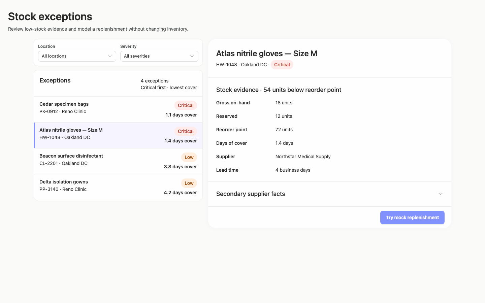

### desktop-1 — Review modeled quantity before confirming

Interaction: passed.

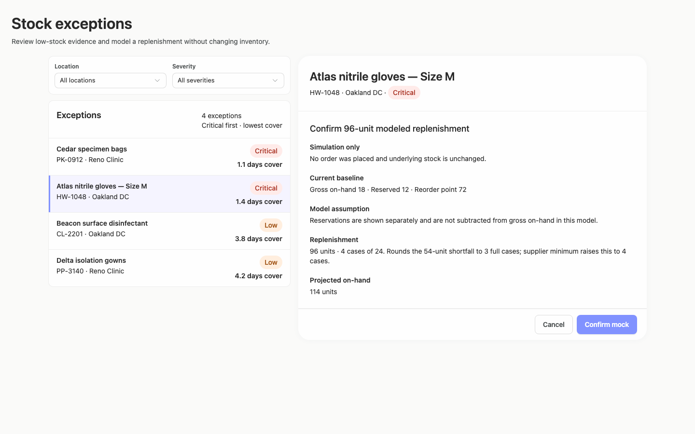

### desktop-2 — Mock replenishment result

Interaction: passed.

### desktop-3 — Result evidence at scroll boundary

Interaction: passed.

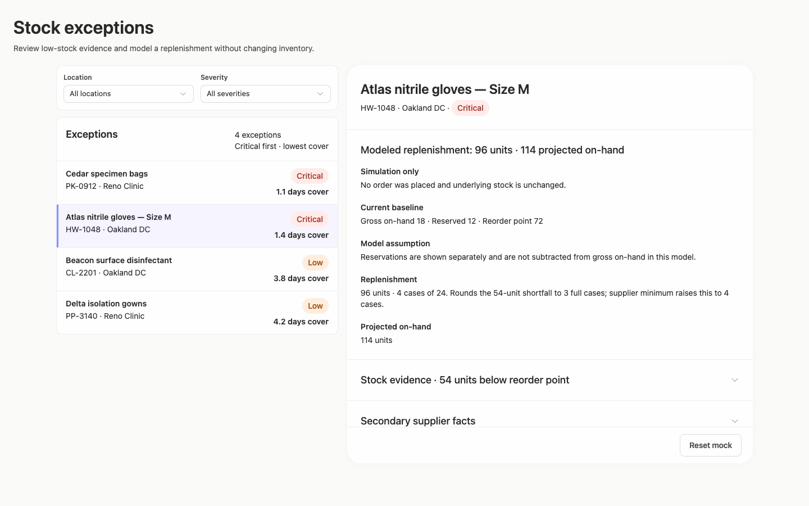

### desktop-4 — Reset from result footer

Interaction: passed.

### desktop-5 — Expanded supplier facts

Interaction: passed.

### desktop-wide-0 — initial

Interaction: not-run.

### desktop-wide-1 — Review modeled quantity before confirming

Interaction: passed.

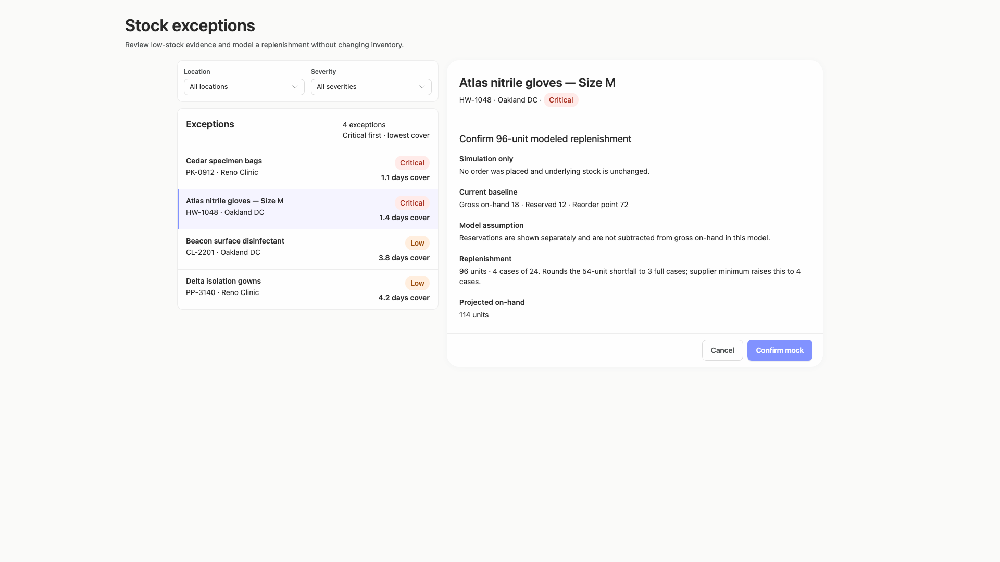

### desktop-wide-2 — Mock replenishment result

Interaction: passed.

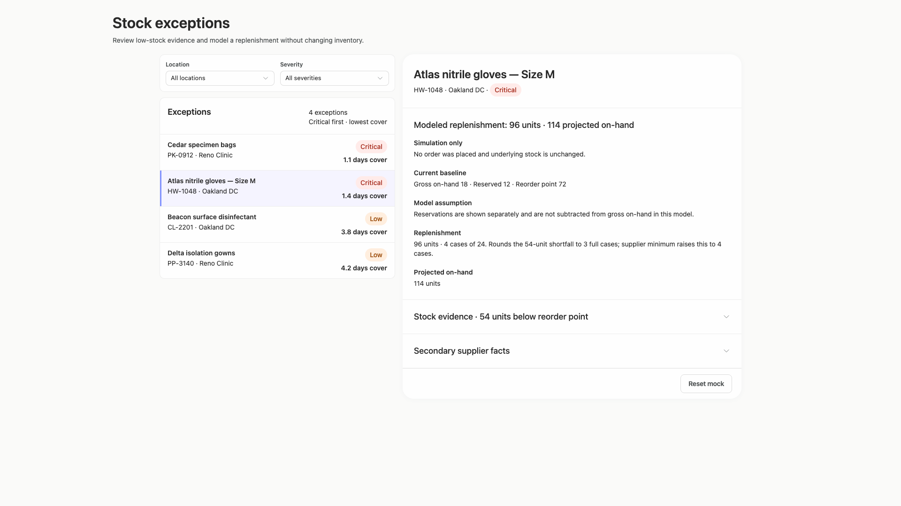

### desktop-wide-3 — Result evidence at scroll boundary

Interaction: passed.

### desktop-wide-4 — Reset from result footer

Interaction: passed.

### desktop-wide-5 — Expanded supplier facts

Interaction: passed.

### desktop-window-0 — initial

Interaction: not-run.

### desktop-window-1 — Review modeled quantity before confirming

Interaction: passed.

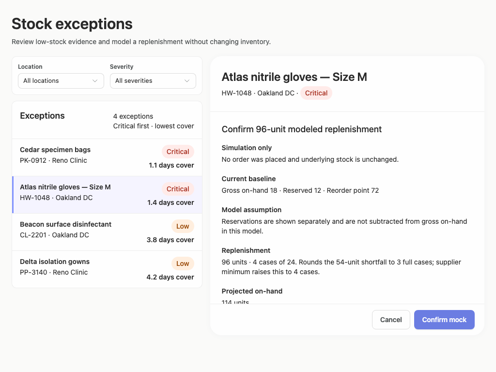

### desktop-window-2 — Mock replenishment result

Interaction: passed.

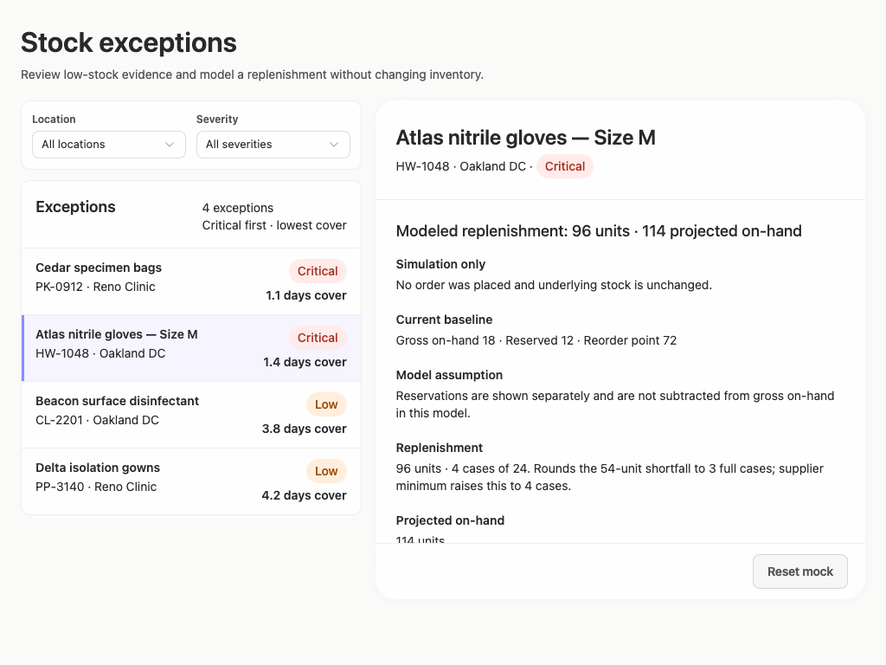

### desktop-window-3 — Result evidence at scroll boundary

Interaction: passed.

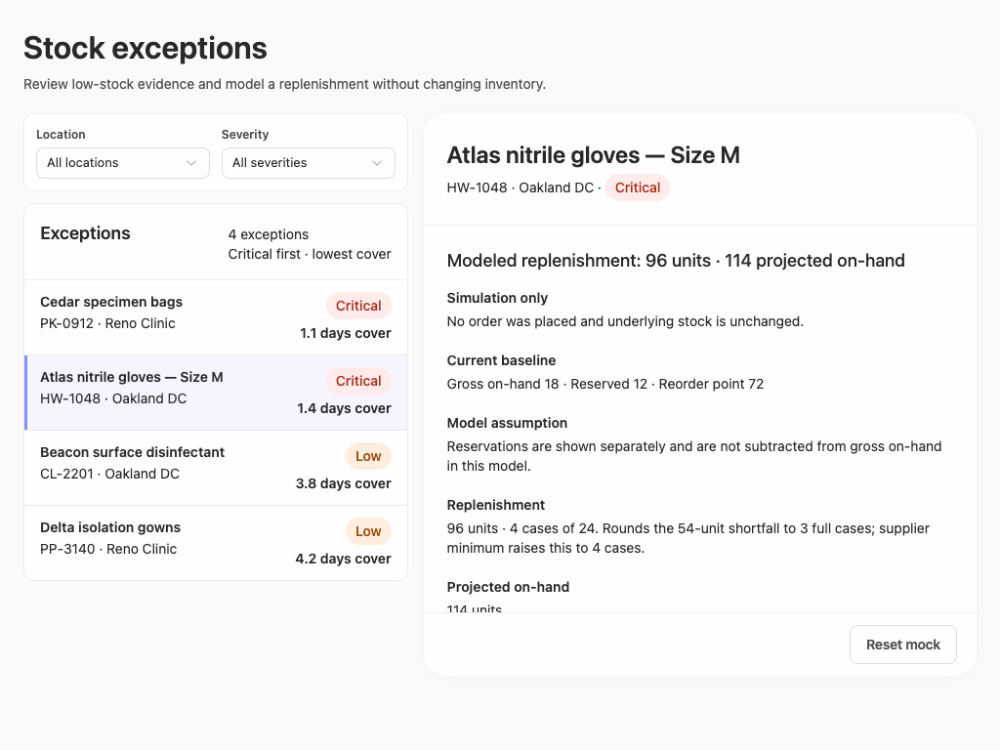

### desktop-window-4 — Reset from result footer

Interaction: passed.

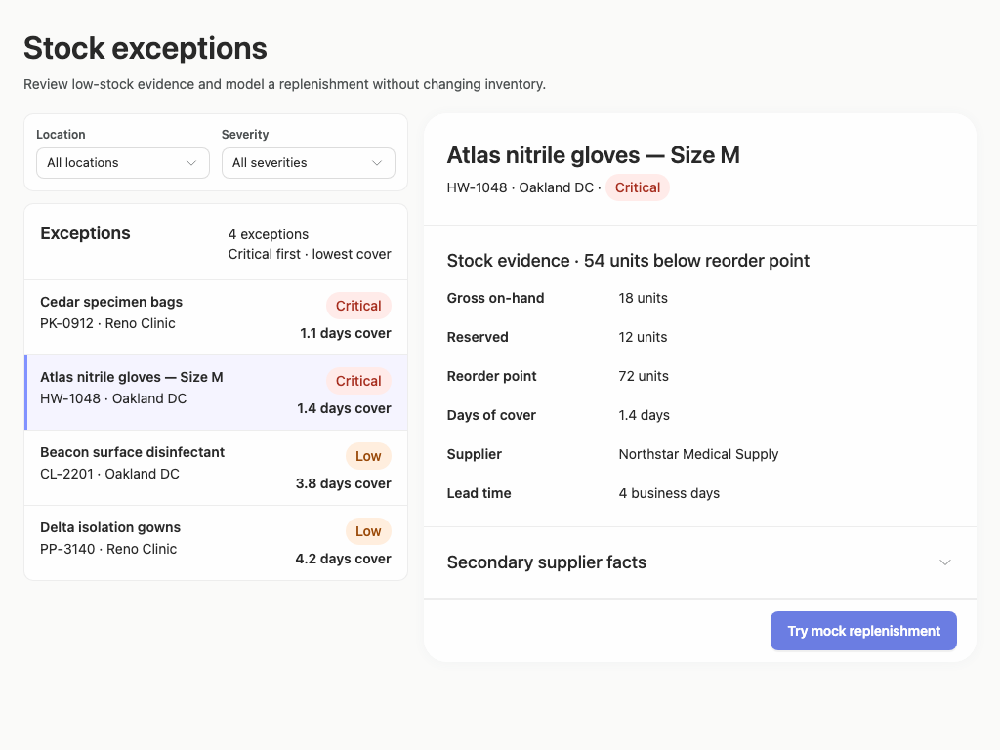

### desktop-window-5 — Expanded supplier facts

Interaction: passed.

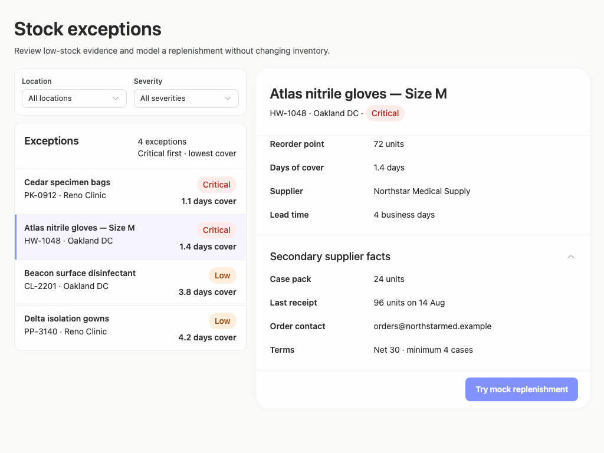

### desktop-custom-700x900-0 — initial

Interaction: not-run.

### desktop-custom-700x900-1 — Review modeled quantity before confirming

Interaction: passed.

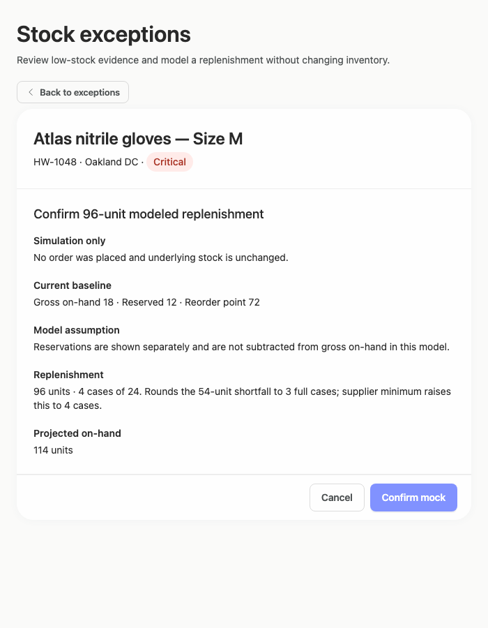

### desktop-custom-700x900-2 — Mock replenishment result

Interaction: passed.

### desktop-custom-700x900-3 — Result evidence at scroll boundary

Interaction: passed.

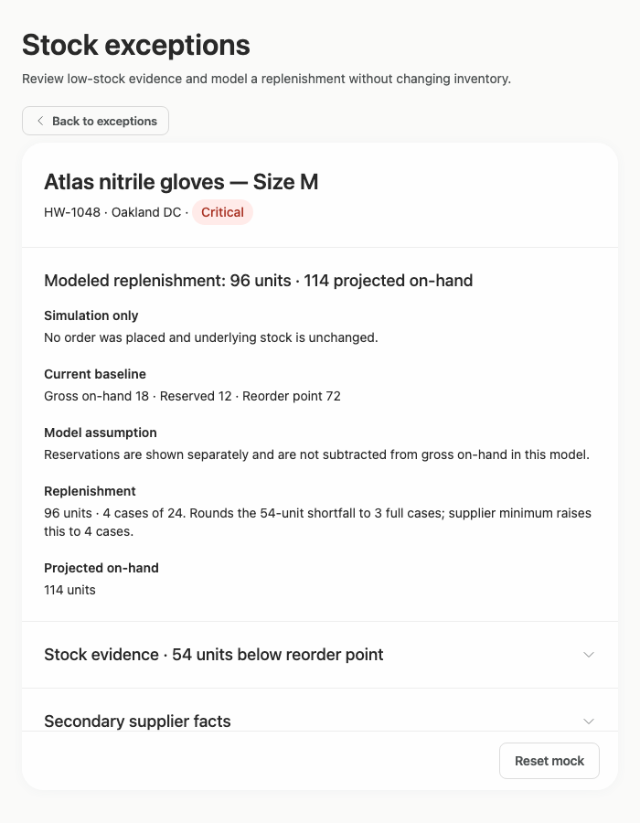

### desktop-custom-700x900-4 — Reset from result footer

Interaction: passed.

### desktop-custom-700x900-5 — Expanded supplier facts

Interaction: passed.

## Limitations

- No 700px capture shows the exception-list and filter view after activating Back to exceptions, so filtering and selection at that panel width cannot be visually assessed.
- Closed select controls are shown, but expanded location and severity menus, filtered empty states, and result counts were not captured.
- Initial interaction was not run in several viewport series; screenshots demonstrate visible states but do not establish all control behavior.
- The screenshots cannot establish backend behavior, persistence, authorization, or publication status.
- Static source evidence leaves several callbacks, data props, and dynamically reachable branches unassessed and does not prove that particular public components rendered.
- The requested implementation plan is not represented in the visual captures and therefore cannot be evaluated here.
- Contrast measurements are advisory because the existing Arrusted palette is authoritative; no palette override or primary-button restyling is recommended.
