# stock-exceptions-content-fit — 2026-09-09T06:19:07.936Z

[All reports](../../README.md) · [Interactive HTML report](index.html) · [Full measurements and scoring](report.json)

GitHub renders this summary and the screenshots. Download or clone this folder to open the HTML report locally; GitHub does not serve it as a website.

**Subjective design score:** 80/100. Model: openai/gpt-5.6-sol. Rubric: 2.

**Arrusted adherence:** 100/100 (partial); evidence coverage 1.2%. Evaluator 3.

| Dimension | Conforming | Nonconforming | Unassessed | Adherence    |
| --------- | ---------- | ------------- | ---------- | ------------ |
| component | 15         | 0             | 2          | 100% (15/15) |
| api       | 35         | 0             | 12         | 100% (35/35) |
| styling   | 13         | 0             | 5193       | 100% (13/13) |

Scores from different evaluator versions or captured states are not directly comparable.

This report evaluates the captured preview; evaluation itself does not regenerate the app or prove a built backend. Scores are advisory and not human-calibrated.

## Ratings

| Dimension | Score | Reason |
| --- | --- | --- |
| hierarchy | 3/4 | The page title, filter block, exception list, selected-record header, evidence, supplier disclosure, and replenishment action form a clear review sequence. Selection highlighting and bold days-of-cover values support scanning, although the very small Critical pill and abbreviated “— M” product descriptor weaken immediate identification. |
| layout | 3/4 | The two-column list-detail composition is consistently aligned at 1024, 1440, and 1920 widths, with compact filters and well-spaced evidence rows. The result state becomes vertically constrained at 1024×768, where explanatory content is partly hidden within the detail scroller behind the persistent action footer. |
| typography | 3/4 | Heading levels, row labels, values, and explanatory callouts are visually consistent and generally readable. Some 12px muted metadata and the approximately 10px severity pill are marginal; the supplied accessibility evidence also flags these text treatments, though the palette itself should remain unchanged. |
| responsive | 3/4 | The composition adapts effectively from a centered wide layout to a tighter 1024 split view and then to a 700px detail-only view with a clear Back to exceptions control. There is no horizontal overflow in the supplied captures, but the 1024 result and expanded states rely heavily on an internal 403px-tall scroller, and the 700px list/filter view after using Back was not shown. |
| productClarity | 4/4 | The interface directly supports location and severity filtering, low-stock selection, stock and supplier review, and a mock replenishment. The result clearly states the modeled quantity and projected stock, labels the action as simulation-only, confirms that inventory was unchanged, explains the model assumption, and offers a reset. |

## Strengths

- The master-detail structure keeps exception context visible while reviewing stock and supplier evidence at standard desktop widths.
- Selected rows combine product identity, location, severity, and days of cover in a compact, highly scannable format.
- The mock result communicates both the modeled outcome and its safety boundary: no order was placed and underlying stock remains unchanged.
- Secondary supplier facts are progressively disclosed, keeping the initial record view concise without removing procurement context.
- The 700px desktop-panel treatment appropriately replaces the split view with a focused detail view and an explicit route back to exceptions.
- Reset and supplier-expansion interaction captures show coherent visual states across 1024, 1440, and 1920 widths.

## Improvements

- **low — desktop-0:** The selected product is labeled “Atlas nitrile gloves — M” in both the list and detail heading. If “M” represents a size or variant, the abbreviation is ambiguous rather than visibly truncated with an ellipsis. Present the variant explicitly, such as “Atlas nitrile gloves” with “Size M” in the metadata line, or show the complete product name when space permits.
- **medium — desktop-0:** The Critical status is rendered as a very small caption-sized pill, making an important exception attribute visually weaker than the surrounding record metadata. The supplied accessibility scan also identifies this treatment as difficult to read. Use the regular supported StatusPill size or repeat “Critical” as ordinary header metadata while preserving the existing Arrusted palette and component styling.
- **low — desktop-window-1:** In the 1024×768 result state, the Model assumption sentence is visibly cut off at the bottom as the fixed footer begins. The panel is scrollable, so the content remains recoverable, but an important modeling caveat is not fully readable in the initial result view. Reserve footer clearance within the scroll content or compact the result spacing so the complete simulation notice and model assumption are visible before scrolling.

## Token evidence

Percentages cover only assessed properties. Missing provenance and ambiguous CSS remain unassessed; matching literals are not proof of token usage.

| Viewport | Category | Token references / assessed | Coverage |
| --- | --- | --- | --- |
| desktop-0 | color | 0/0 | 0% (0/232) |
| desktop-0 | typography | 0/0 | 0% (0/526) |
| desktop-0 | spacing | 0/0 | 0% (0/275) |
| desktop-0 | radius | 0/0 | 0% (0/116) |
| desktop-0 | border | 0/0 | 0% (0/126) |
| desktop-0 | shadow | 0/0 | 0% (0/120) |
| desktop-wide-0 | color | 0/0 | 0% (0/232) |
| desktop-wide-0 | typography | 0/0 | 0% (0/526) |
| desktop-wide-0 | spacing | 0/0 | 0% (0/275) |
| desktop-wide-0 | radius | 0/0 | 0% (0/116) |
| desktop-wide-0 | border | 0/0 | 0% (0/126) |
| desktop-wide-0 | shadow | 0/0 | 0% (0/120) |
| desktop-window-0 | color | 0/0 | 0% (0/232) |
| desktop-window-0 | typography | 0/0 | 0% (0/526) |
| desktop-window-0 | spacing | 0/0 | 0% (0/275) |
| desktop-window-0 | radius | 0/0 | 0% (0/116) |
| desktop-window-0 | border | 0/0 | 0% (0/126) |
| desktop-window-0 | shadow | 0/0 | 0% (0/120) |
| desktop-custom-700x900-0 | color | 0/0 | 0% (0/162) |
| desktop-custom-700x900-0 | typography | 0/0 | 0% (0/410) |
| desktop-custom-700x900-0 | spacing | 0/0 | 0% (0/186) |
| desktop-custom-700x900-0 | radius | 0/0 | 0% (0/82) |
| desktop-custom-700x900-0 | border | 0/0 | 0% (0/86) |
| desktop-custom-700x900-0 | shadow | 0/0 | 0% (0/82) |

## Latest-run screenshots

### desktop-0 — initial

Interaction: not-run.

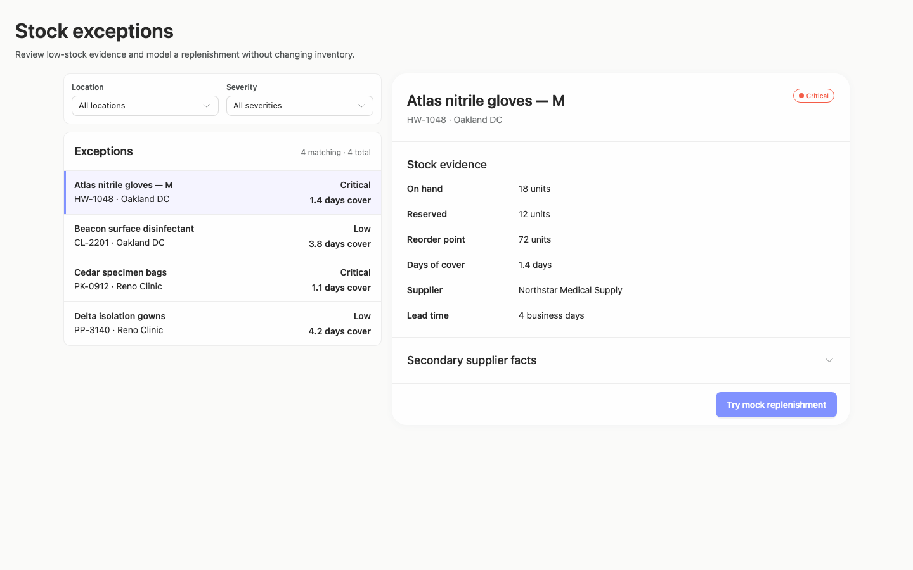

### desktop-1 — Mock replenishment result

Interaction: passed.

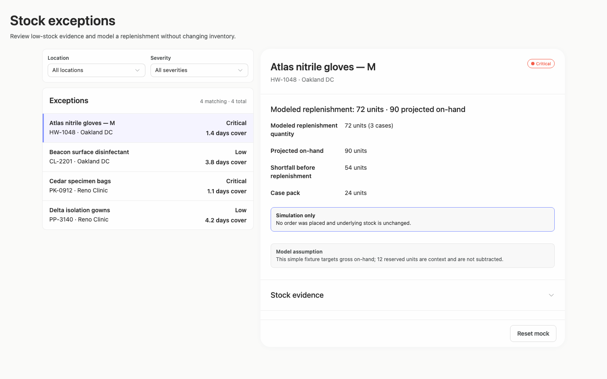

### desktop-2 — Reset from result footer

Interaction: passed.

### desktop-3 — Expanded supplier facts

Interaction: passed.

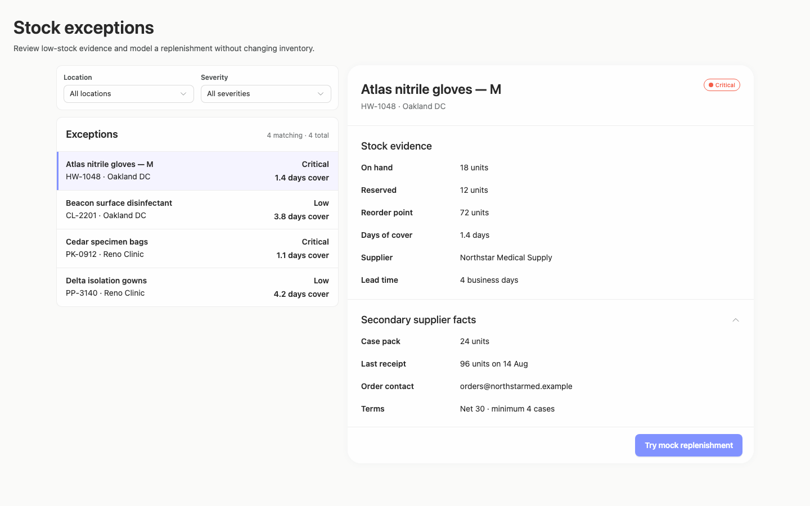

### desktop-wide-0 — initial

Interaction: not-run.

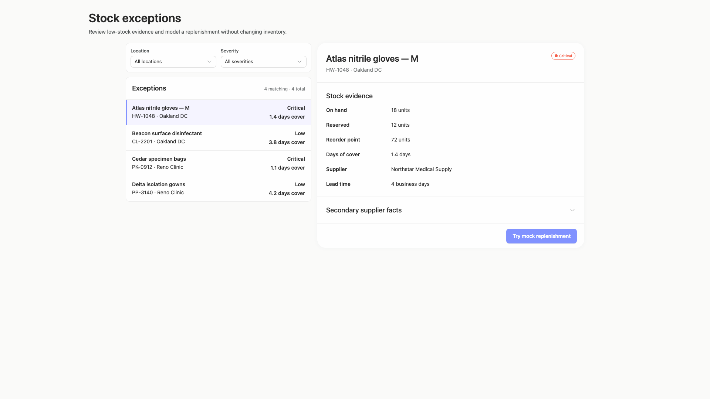

### desktop-wide-1 — Mock replenishment result

Interaction: passed.

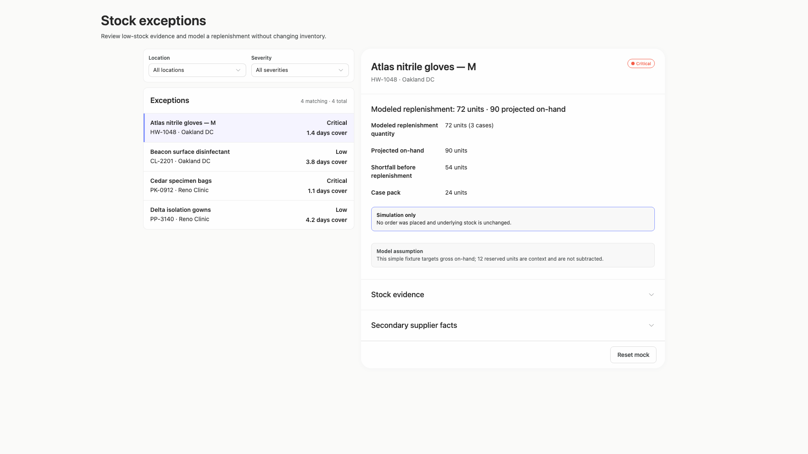

### desktop-wide-2 — Reset from result footer

Interaction: passed.

### desktop-wide-3 — Expanded supplier facts

Interaction: passed.

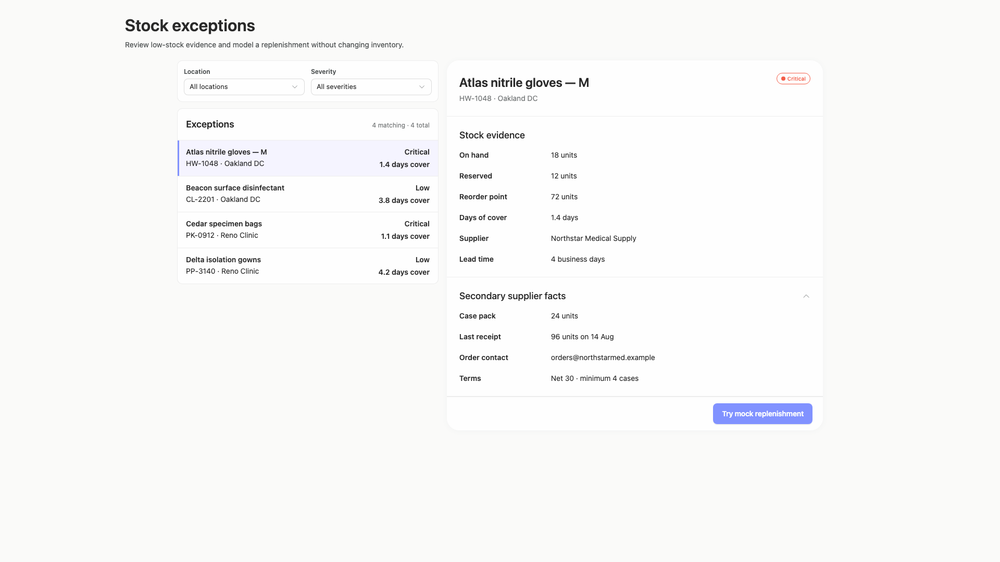

### desktop-window-0 — initial

Interaction: not-run.

### desktop-window-1 — Mock replenishment result

Interaction: passed.

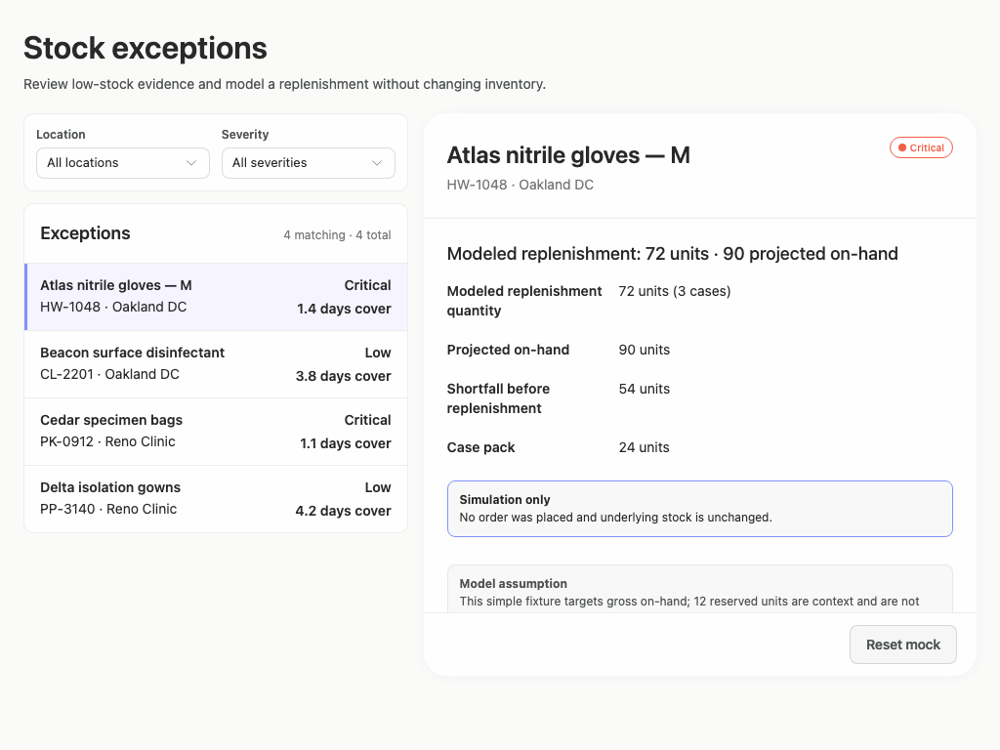

### desktop-window-2 — Reset from result footer

Interaction: passed.

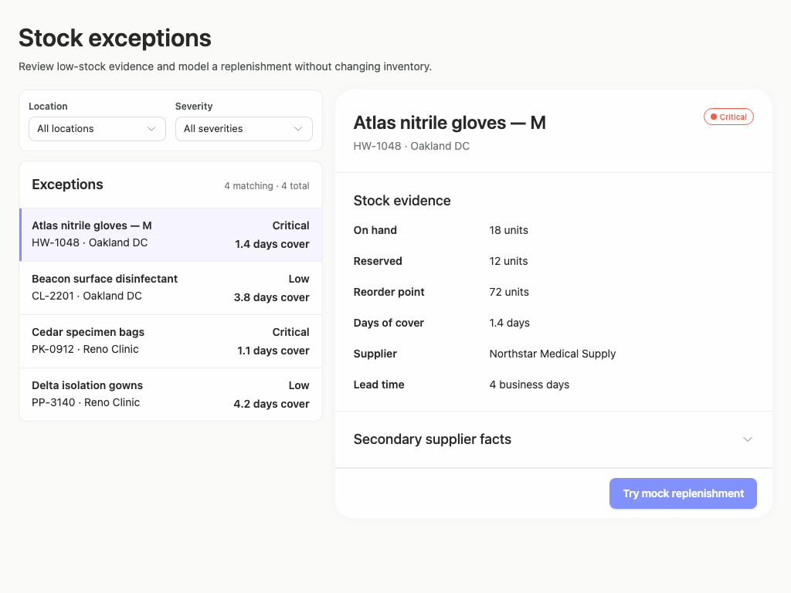

### desktop-window-3 — Expanded supplier facts

Interaction: passed.

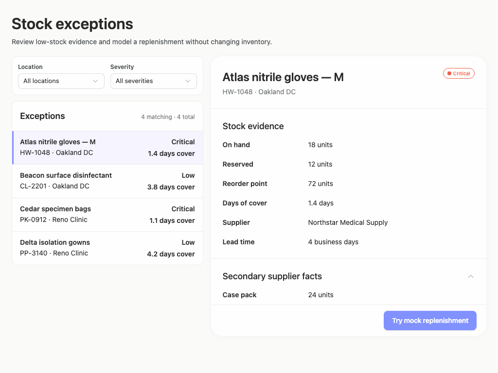

### desktop-custom-700x900-0 — initial

Interaction: not-run.

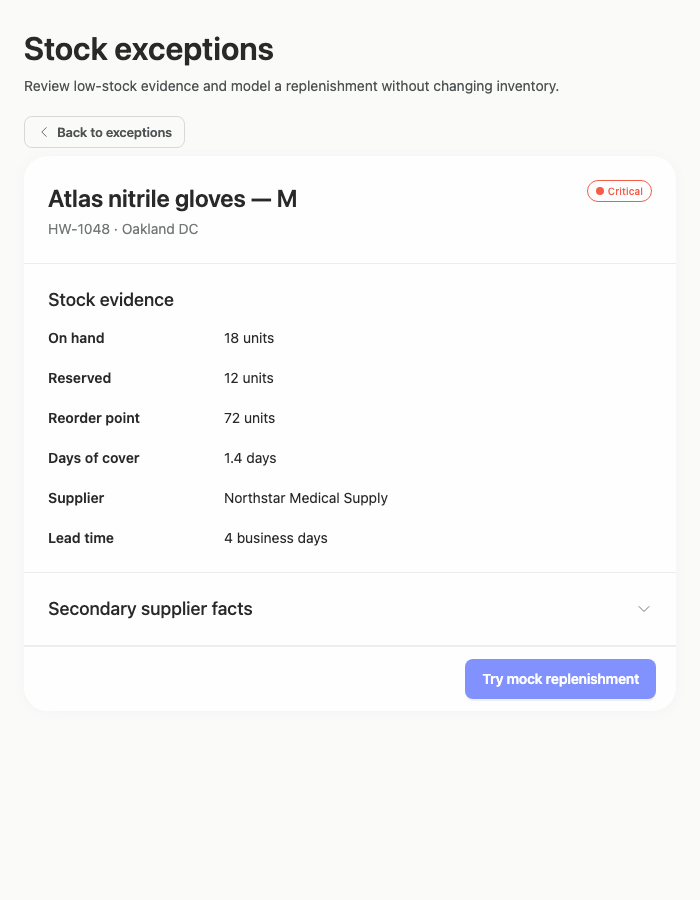

### desktop-custom-700x900-1 — Mock replenishment result

Interaction: passed.

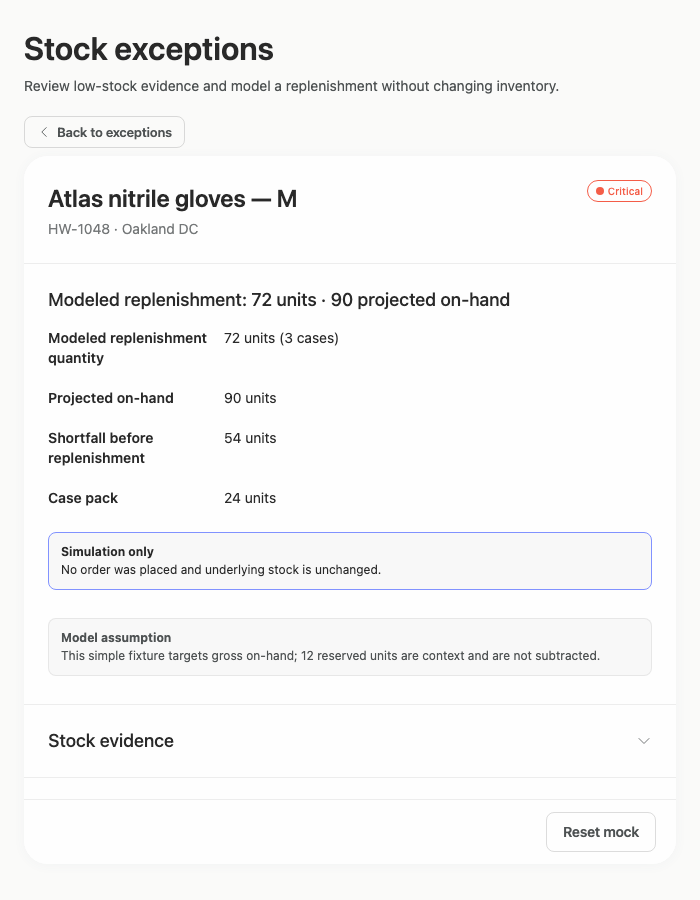

### desktop-custom-700x900-2 — Reset from result footer

Interaction: passed.

### desktop-custom-700x900-3 — Expanded supplier facts

Interaction: passed.

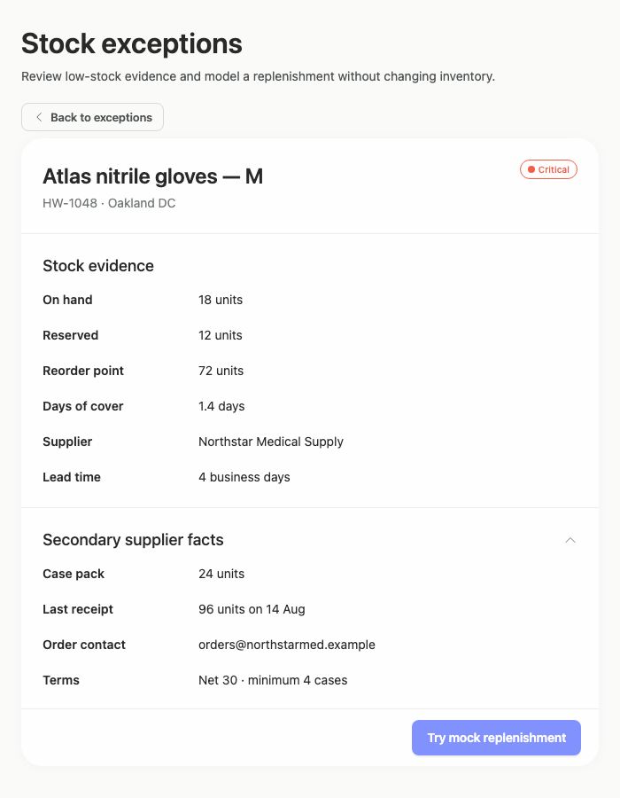

## Limitations

- The supplied captures do not show the exception-list and filter view at 700px after activating Back to exceptions, so that constrained state cannot be assessed.
- Filter changes, empty results, alternate product selection, keyboard behavior, and disclosure scrolling were not visually demonstrated.
- Screenshots cannot confirm backend behavior; the assessment only observes the displayed simulation messaging and recorded interaction results.
- No implementation-plan artifact or publication state was provided, so completion of the brief’s planning and stop-before-publication requirements cannot be judged visually.
- Static source evidence does not prove that particular public components rendered, and styling provenance coverage is too limited to make a separate Arrusted token-adherence judgment.
