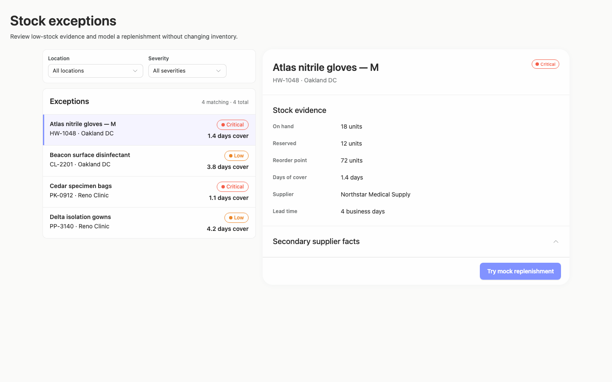
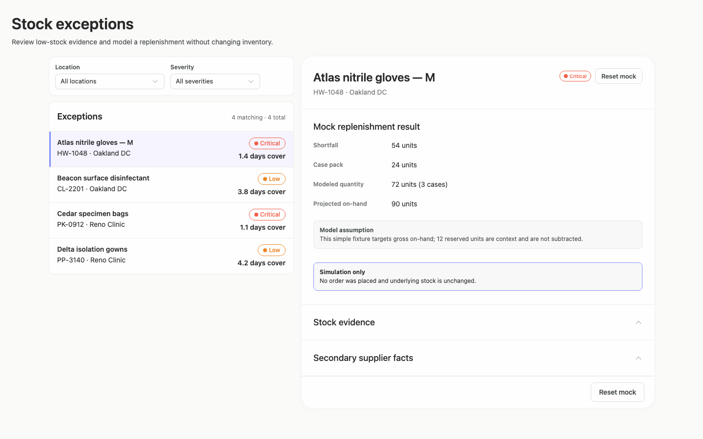
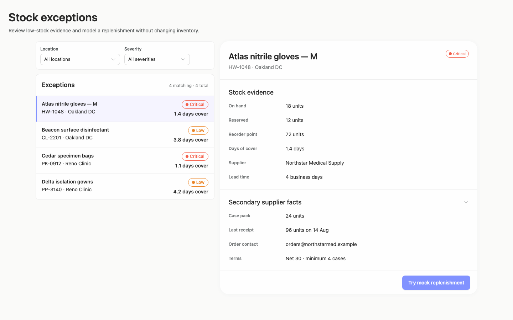
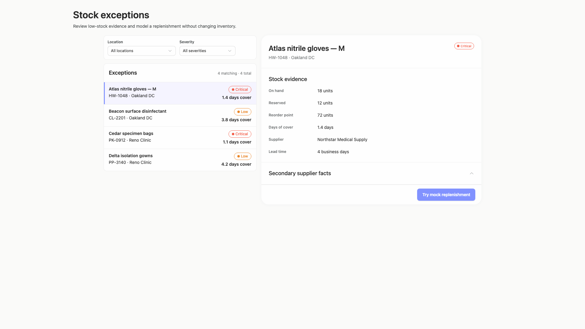
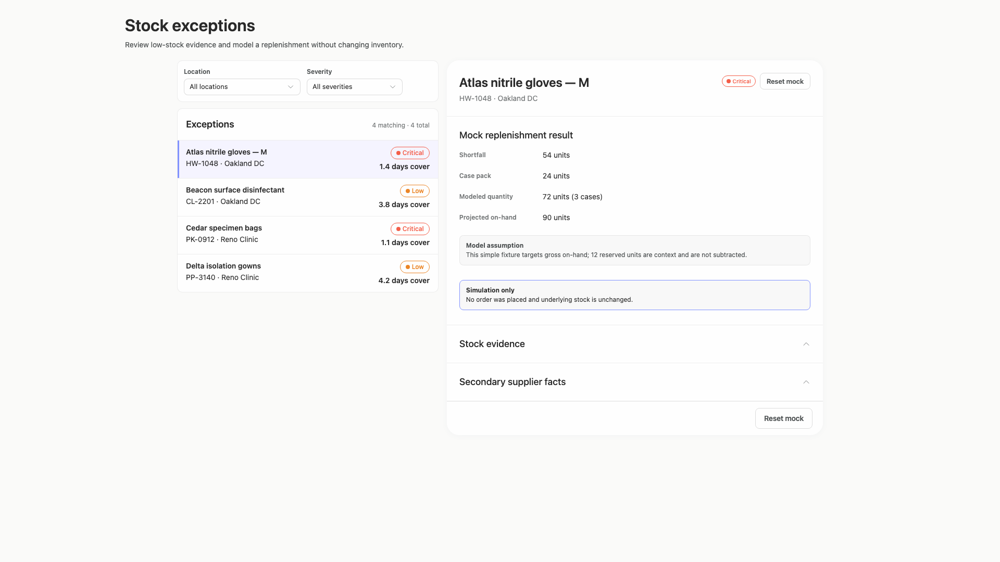
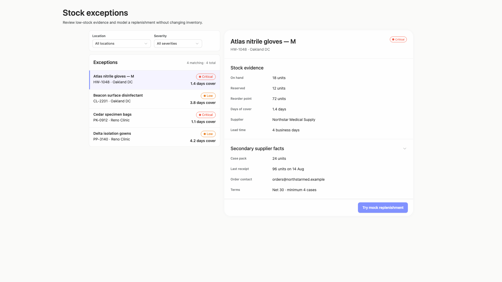
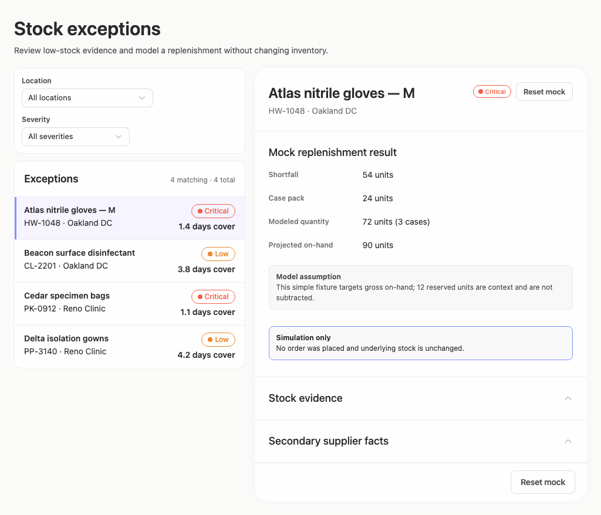
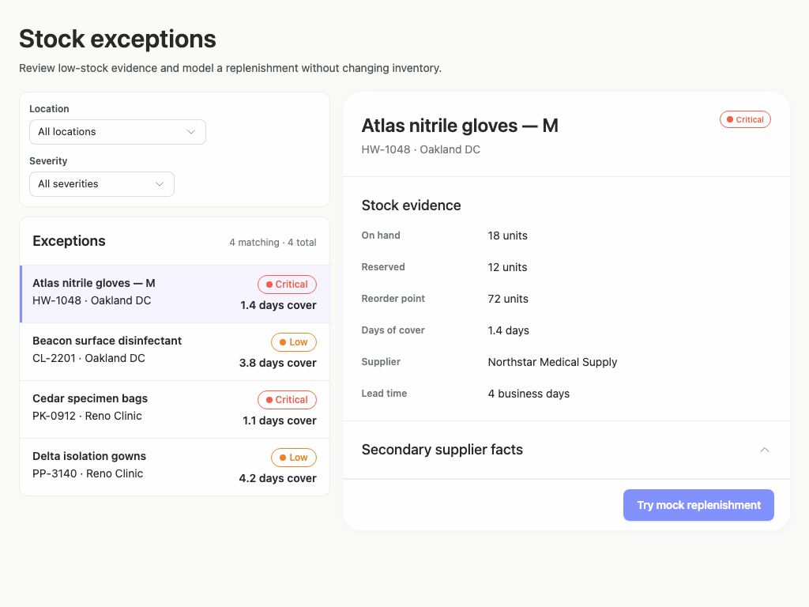
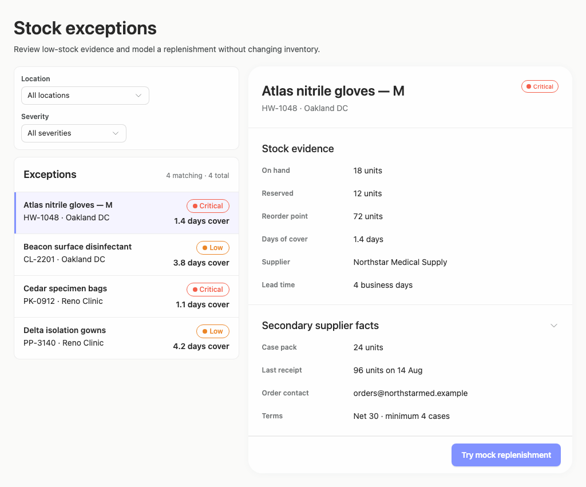

# stock-exceptions-context-actions — 2026-09-09T05:22:04.677Z

[All reports](../../README.md) · [Interactive HTML report](index.html) · [Full measurements and scoring](report.json)

GitHub renders this summary and the screenshots. Download or clone this folder to open the HTML report locally; GitHub does not serve it as a website.

**Subjective design score:** 80/100. Model: openai/gpt-5.6-sol. Rubric: 2.

**Arrusted adherence:** 100/100 (partial); evidence coverage 1.18%. Evaluator 3.

| Dimension | Conforming | Nonconforming | Unassessed | Adherence    |
| --------- | ---------- | ------------- | ---------- | ------------ |
| component | 15         | 0             | 2          | 100% (15/15) |
| api       | 34         | 0             | 14         | 100% (34/34) |
| styling   | 13         | 0             | 5166       | 100% (13/13) |

Scores from different evaluator versions or captured states are not directly comparable.

This report evaluates the captured preview; evaluation itself does not regenerate the app or prove a built backend. Scores are advisory and not human-calibrated.

## Ratings

| Dimension      | Score | Reason                                                                                                                                                                                                                                                                                                                                              |
| -------------- | ----- | --------------------------------------------------------------------------------------------------------------------------------------------------------------------------------------------------------------------------------------------------------------------------------------------------------------------------------------------------- |
| hierarchy      | 3/4   | The page title, exception list, selected-record header, evidence, supplier disclosure, and primary mock action form a clear review sequence. Selection highlighting and right-aligned severity/cover values support scanning, though duplicate reset actions in the result state slightly compete for attention.                                    |
| layout         | 3/4   | The list-detail composition is consistently aligned and comfortably dense at 1440px and 1920px, with coherent card boundaries and field columns. At 1024px, stacking the two filters inside a tall left card consumes extra vertical space, and the result state repeats the same reset action in two locations.                                    |
| typography     | 3/4   | Headings, product names, metadata, and numerical values use a consistent and readable hierarchy. Several 10–12px muted labels and outlined severity pills are visually faint; automated checks repeatedly flag these text treatments, especially the orange/red status text, even though the Arrusted palette itself should remain unchanged.       |
| responsive     | 3/4   | The composition adapts well from a centered wide layout to a narrower split view, then switches to a focused detail panel with a Back control at 700px. Controls remain visible and expanded content fits, but the 700px initial capture opens directly on the selected record, placing filtering and exception selection one navigation step away. |
| productClarity | 4/4   | The task is immediately understandable: filter exceptions, select a product, inspect stock and supplier facts, and try a clearly labeled mock replenishment. The result explicitly states its assumptions and that no order or inventory change occurred, while reset and supplier-disclosure affordances are clear.                                |

## Strengths

- Selected-state treatment, severity labels, days of cover, and matching counts make the exception list easy to scan.
- Stock and supplier facts are grouped into concise labeled sections without overwhelming the initial view.
- The mock result reports shortfall, case pack, modeled quantity, projected stock, assumptions, and simulation-only status clearly.
- The constrained desktop composition uses a focused detail view with a prominent “Back to exceptions” control rather than compressing both panes.
- The visual language remains consistent with the supplied Arrusted palette and public-component appearance across all captured states.

## Improvements

- **medium — desktop-custom-700x900-0:** The initial constrained-window state opens directly on one record. Location and severity filters, the matching count, and alternative exceptions are absent until the user goes back, so the brief’s filtering task is less discoverable at this size. For a fresh visit at constrained desktop widths, present the list-and-filter route first and open this detail view after selection. Preserve the current detail-first state only when a selected record is already part of navigation state.
- **low — desktop-1:** “Reset mock” appears both beside the record status and again in the panel footer. The duplicate controls add visual competition and make the intended primary reset location ambiguous. Keep one reset action in a consistent action area—preferably the footer for alignment with the initial mock action—or use a single compact header action if persistent visibility is more important.
- **medium — desktop-0:** Severity pills and some supporting labels use very small, faint text. Automated evidence repeatedly reports insufficient contrast for the red/orange pill text and muted labels, which can weaken rapid severity scanning even though the severity words are present. Retain the Arrusted palette, but use a supported status treatment with stronger non-color emphasis where available, such as a larger text size, stronger weight, icon-plus-label presentation, or another public StatusPill variant. Avoid relying on the colored outline alone.
- **low — desktop-window-0:** At 1024px the two filters stack vertically despite ample horizontal room within much of the left panel, making the filter card nearly as tall as two list rows and pushing the exception list down. Use a denser supported Select composition at this intermediate width, such as two flexible columns when labels fit, and reserve vertical stacking for narrower panel widths.

## Token evidence

Percentages cover only assessed properties. Missing provenance and ambiguous CSS remain unassessed; matching literals are not proof of token usage.

| Viewport                 | Category   | Token references / assessed | Coverage   |
| ------------------------ | ---------- | --------------------------- | ---------- |
| desktop-0                | color      | 0/0                         | 0% (0/228) |
| desktop-0                | typography | 0/0                         | 0% (0/518) |
| desktop-0                | spacing    | 0/0                         | 0% (0/274) |
| desktop-0                | radius     | 0/0                         | 0% (0/116) |
| desktop-0                | border     | 0/0                         | 0% (0/130) |
| desktop-0                | shadow     | 0/0                         | 0% (0/120) |
| desktop-wide-0           | color      | 0/0                         | 0% (0/228) |
| desktop-wide-0           | typography | 0/0                         | 0% (0/518) |
| desktop-wide-0           | spacing    | 0/0                         | 0% (0/274) |
| desktop-wide-0           | radius     | 0/0                         | 0% (0/116) |
| desktop-wide-0           | border     | 0/0                         | 0% (0/130) |
| desktop-wide-0           | shadow     | 0/0                         | 0% (0/120) |
| desktop-window-0         | color      | 0/0                         | 0% (0/228) |
| desktop-window-0         | typography | 0/0                         | 0% (0/518) |
| desktop-window-0         | spacing    | 0/0                         | 0% (0/274) |
| desktop-window-0         | radius     | 0/0                         | 0% (0/116) |
| desktop-window-0         | border     | 0/0                         | 0% (0/130) |
| desktop-window-0         | shadow     | 0/0                         | 0% (0/120) |
| desktop-custom-700x900-0 | color      | 0/0                         | 0% (0/162) |
| desktop-custom-700x900-0 | typography | 0/0                         | 0% (0/410) |
| desktop-custom-700x900-0 | spacing    | 0/0                         | 0% (0/186) |
| desktop-custom-700x900-0 | radius     | 0/0                         | 0% (0/82)  |
| desktop-custom-700x900-0 | border     | 0/0                         | 0% (0/86)  |
| desktop-custom-700x900-0 | shadow     | 0/0                         | 0% (0/82)  |

## Latest-run screenshots

### desktop-0 — initial

Interaction: not-run.

### desktop-1 — Mock replenishment result

Interaction: passed.

### desktop-2 — Reset from result footer

Interaction: passed.

### desktop-3 — Expanded supplier facts

Interaction: passed.

### desktop-wide-0 — initial

Interaction: not-run.

### desktop-wide-1 — Mock replenishment result

Interaction: passed.

### desktop-wide-2 — Reset from result footer

Interaction: passed.

### desktop-wide-3 — Expanded supplier facts

Interaction: passed.

### desktop-window-0 — initial

Interaction: not-run.

### desktop-window-1 — Mock replenishment result

Interaction: passed.

### desktop-window-2 — Reset from result footer

Interaction: passed.

### desktop-window-3 — Expanded supplier facts

Interaction: passed.

### desktop-custom-700x900-0 — initial

Interaction: not-run.

### desktop-custom-700x900-1 — Mock replenishment result

Interaction: passed.

### desktop-custom-700x900-2 — Reset from result footer

Interaction: passed.

### desktop-custom-700x900-3 — Expanded supplier facts

Interaction: passed.

## Limitations

- The captures demonstrate mock-result, reset, and supplier-disclosure states, but filter changes and selection of records other than Atlas were not shown as exercised interactions.
- Screenshots cannot establish backend behavior, persistence, authorization, or whether the mock action is isolated beyond the displayed messaging.
- No implementation-plan artifact was provided, so its completeness and the requested stop-before-build/publication boundary cannot be evaluated visually.
- Only the supplied desktop sizes and states were reviewed; intermediate panel widths, long localized strings, empty results, and unusually long product or supplier names remain untested.
- Static adherence evidence has limited styling coverage and cannot prove the full rendered cascade or component provenance.
