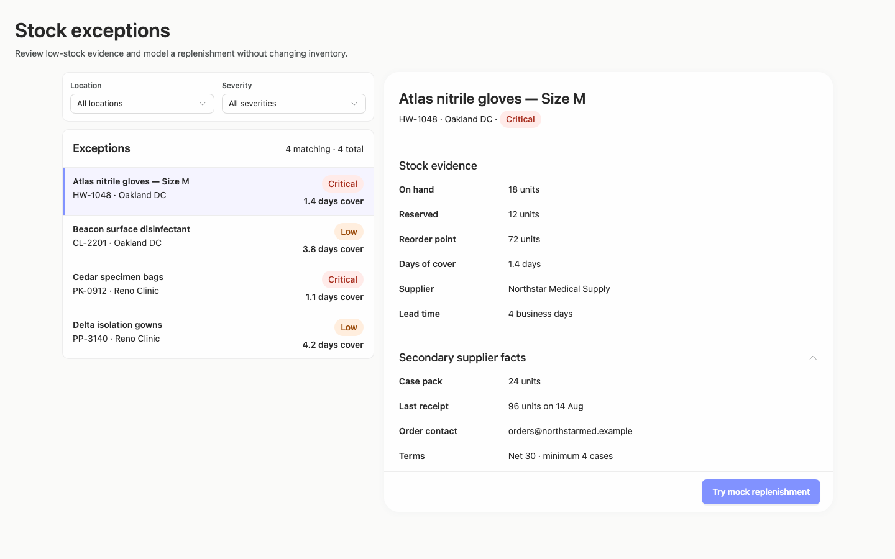
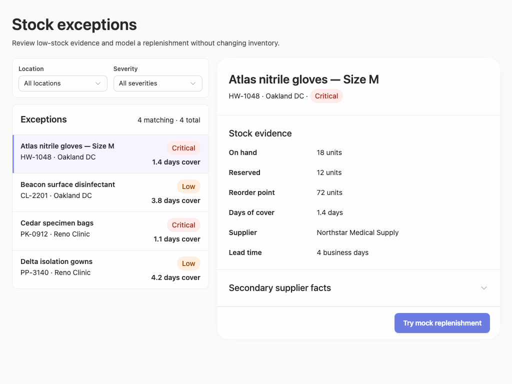
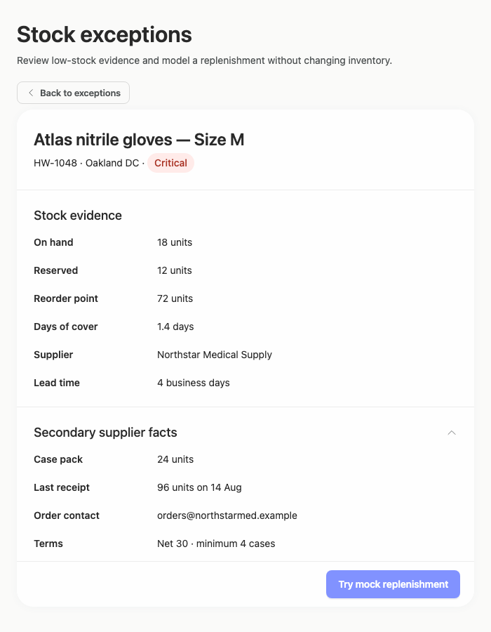

# stock-exceptions-context-comparison — 2026-09-09T06:37:15.000Z

[All reports](../../README.md) · [Interactive HTML report](index.html) · [Full measurements and scoring](report.json)

GitHub renders this summary and the screenshots. Download or clone this folder to open the HTML report locally; GitHub does not serve it as a website.

**Subjective design score:** 90/100. Model: openai/gpt-5.6-sol. Rubric: 2.

**Arrusted adherence:** 100/100 (partial); evidence coverage 1.37%. Evaluator 3.

| Dimension | Conforming | Nonconforming | Unassessed | Adherence    |
| --------- | ---------- | ------------- | ---------- | ------------ |
| component | 18         | 0             | 2          | 100% (18/18) |
| api       | 41         | 0             | 13         | 100% (41/41) |
| styling   | 13         | 0             | 5181       | 100% (13/13) |

Scores from different evaluator versions or captured states are not directly comparable.

This report evaluates the captured preview; evaluation itself does not regenerate the app or prove a built backend. Scores are advisory and not human-calibrated.

## Ratings

| Dimension | Score | Reason |
| --- | --- | --- |
| hierarchy | 4/4 | The page title and purpose lead cleanly into filters, an exception list, and the selected record. Selected-row treatment, severity pills, days-of-cover values, detail headings, and the replenishment result headline establish excellent scan priorities. |
| layout | 3/4 | The two-column composition is consistently aligned, with compact list rows and well-spaced label/value groups. The centered maximum-width layout remains coherent at 1920px, though expanded or result content becomes cramped against the fixed action footer at 1024×768. |
| typography | 4/4 | Heading levels, field labels, values, metadata, and status text are readable and visually consistent across all supplied sizes. Wrapping in the narrower result view remains understandable and does not create ambiguous associations. |
| responsive | 3/4 | The interface transitions effectively from a wide list-detail view to a constrained detail view with an explicit Back control at 700px. Controls remain usable without horizontal overflow, but the 1024px expanded and result states depend on a subtly indicated internal scroll area, with lower content close to the footer. |
| productClarity | 4/4 | Location and severity filters are explicit, exception rows expose product, location, severity, and urgency, and selection clearly updates the detail panel. The mock result prominently states that no order was placed and provides a clear Reset mock affordance. |

## Strengths

- Clear master-detail relationship with an unmistakable selected exception.
- Useful exception-row evidence supports quick prioritization without opening every item.
- Stock and supplier details are grouped into concise, scannable sections.
- The replenishment result explains its assumption, quantity, projected stock, and simulation-only status rather than implying a real order.
- The 700px constrained-desktop composition preserves context and provides a direct route back to filters and exceptions.
- Expanded supplier facts and mock/reset interactions are represented consistently across supplied window sizes.

## Improvements

- **medium — desktop-window-3:** After expanding Secondary supplier facts at 1024×768, only the first fact is visible before the action footer. Remaining supplier information requires internal scrolling, but the screenshot offers little visual indication that more expanded content is available. When a disclosure expands in the constrained panel, scroll its heading and initial content into a more useful position, add sufficient scroll-body clearance above the persistent footer, or use the supported compact detail spacing so more supplier facts remain visible.
- **low — desktop-window-1:** The final result row reaches the bottom edge of the scroll body and is visually crowded by the persistent Reset mock footer, weakening the end-of-content cue. Reserve additional bottom padding inside the scrollable result body or use compact vertical spacing for the result fields so the last row can clear the persistent action footer when scrolled into view.

## Token evidence

Percentages cover only assessed properties. Missing provenance and ambiguous CSS remain unassessed; matching literals are not proof of token usage.

| Viewport | Category | Token references / assessed | Coverage |
| --- | --- | --- | --- |
| desktop-0 | color | 0/0 | 0% (0/233) |
| desktop-0 | typography | 0/0 | 0% (0/526) |
| desktop-0 | spacing | 0/0 | 0% (0/275) |
| desktop-0 | radius | 0/0 | 0% (0/116) |
| desktop-0 | border | 0/0 | 0% (0/125) |
| desktop-0 | shadow | 0/0 | 0% (0/120) |
| desktop-wide-0 | color | 0/0 | 0% (0/233) |
| desktop-wide-0 | typography | 0/0 | 0% (0/526) |
| desktop-wide-0 | spacing | 0/0 | 0% (0/275) |
| desktop-wide-0 | radius | 0/0 | 0% (0/116) |
| desktop-wide-0 | border | 0/0 | 0% (0/125) |
| desktop-wide-0 | shadow | 0/0 | 0% (0/120) |
| desktop-window-0 | color | 0/0 | 0% (0/233) |
| desktop-window-0 | typography | 0/0 | 0% (0/526) |
| desktop-window-0 | spacing | 0/0 | 0% (0/275) |
| desktop-window-0 | radius | 0/0 | 0% (0/116) |
| desktop-window-0 | border | 0/0 | 0% (0/125) |
| desktop-window-0 | shadow | 0/0 | 0% (0/120) |
| desktop-custom-700x900-0 | color | 0/0 | 0% (0/161) |
| desktop-custom-700x900-0 | typography | 0/0 | 0% (0/405) |
| desktop-custom-700x900-0 | spacing | 0/0 | 0% (0/184) |
| desktop-custom-700x900-0 | radius | 0/0 | 0% (0/81) |
| desktop-custom-700x900-0 | border | 0/0 | 0% (0/84) |
| desktop-custom-700x900-0 | shadow | 0/0 | 0% (0/81) |

## Latest-run screenshots

### desktop-0 — initial

Interaction: not-run.

### desktop-1 — Mock replenishment result

Interaction: passed.

### desktop-2 — Reset from result footer

Interaction: passed.

### desktop-3 — Expanded supplier facts

Interaction: passed.

### desktop-wide-0 — initial

Interaction: not-run.

### desktop-wide-1 — Mock replenishment result

Interaction: passed.

### desktop-wide-2 — Reset from result footer

Interaction: passed.

### desktop-wide-3 — Expanded supplier facts

Interaction: passed.

### desktop-window-0 — initial

Interaction: not-run.

### desktop-window-1 — Mock replenishment result

Interaction: passed.

### desktop-window-2 — Reset from result footer

Interaction: passed.

### desktop-window-3 — Expanded supplier facts

Interaction: passed.

### desktop-custom-700x900-0 — initial

Interaction: not-run.

### desktop-custom-700x900-1 — Mock replenishment result

Interaction: passed.

### desktop-custom-700x900-2 — Reset from result footer

Interaction: passed.

### desktop-custom-700x900-3 — Expanded supplier facts

Interaction: passed.

## Limitations

- Only the supplied static states were assessed; filtering outcomes, alternate record selections, no-results states, keyboard behavior, and focus treatment were not shown.
- The mock and disclosure interactions passed only the reported checks; broader runtime behavior cannot be inferred from screenshots.
- An automated audit flagged primary-button text contrast in several captures. The existing Arrusted palette and Button styling are authoritative, so no palette or primary-button restyling is recommended here.
- The requested implementation plan is not visible in the supplied screenshots and therefore could not be evaluated.
- Static source evidence does not prove every dynamic branch or public component rendered, and styling provenance coverage was very limited.
