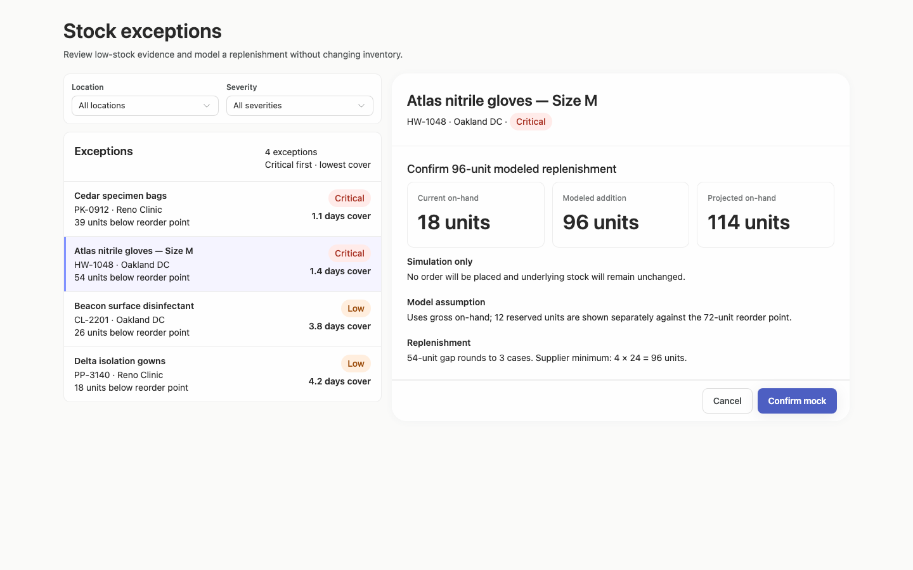
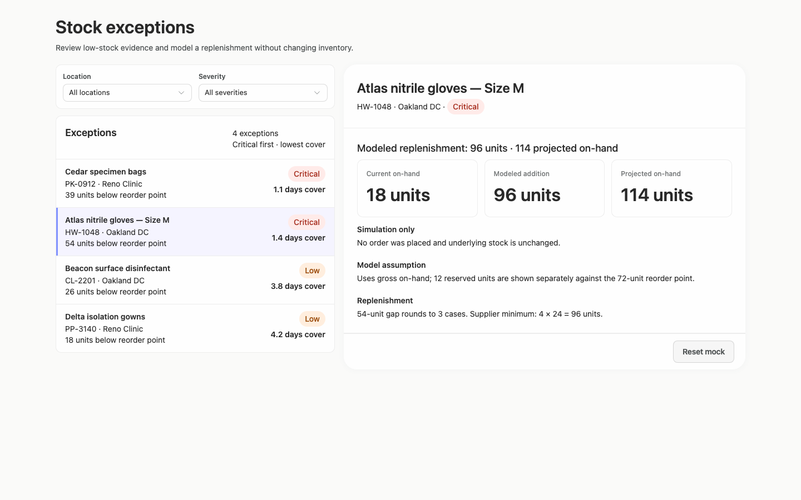
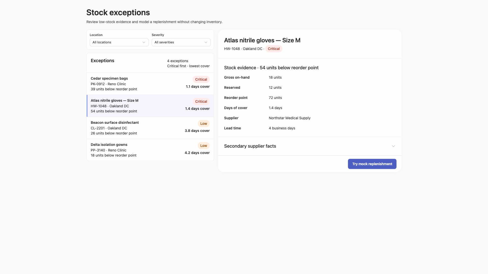
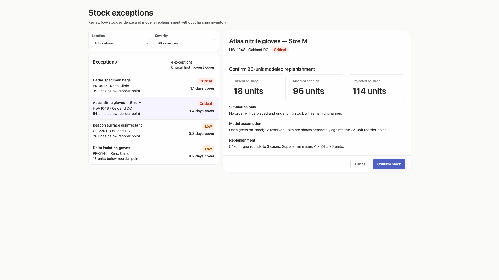
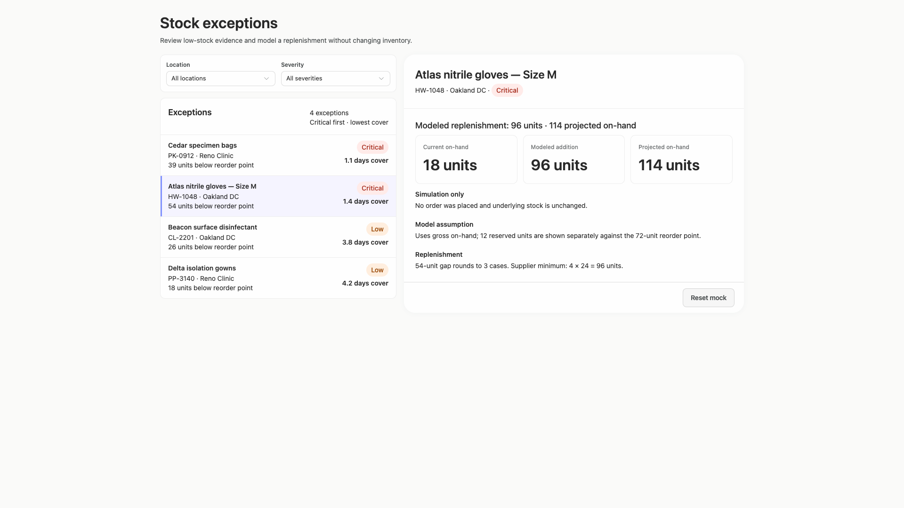
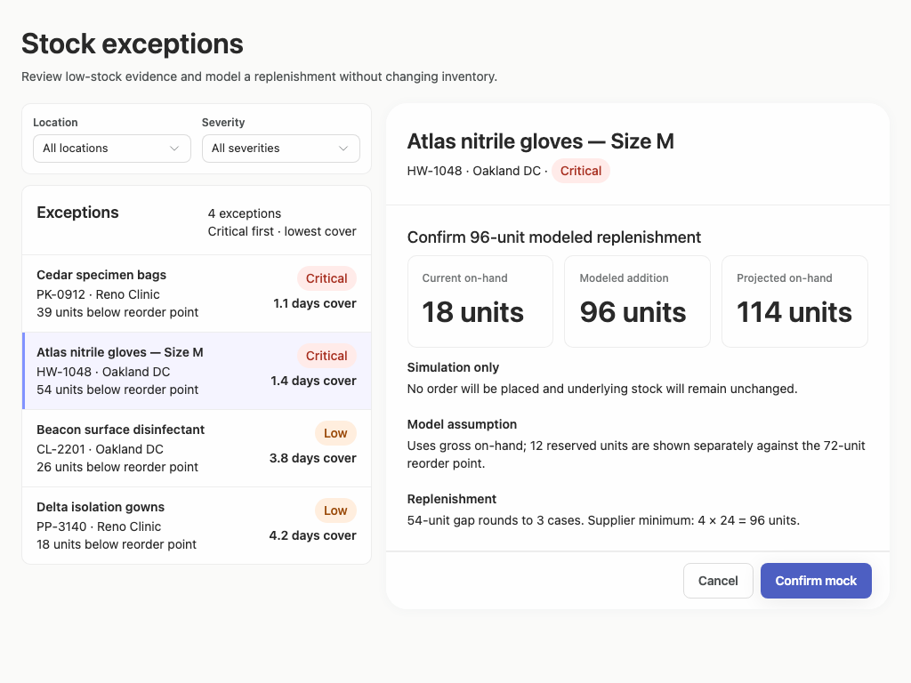
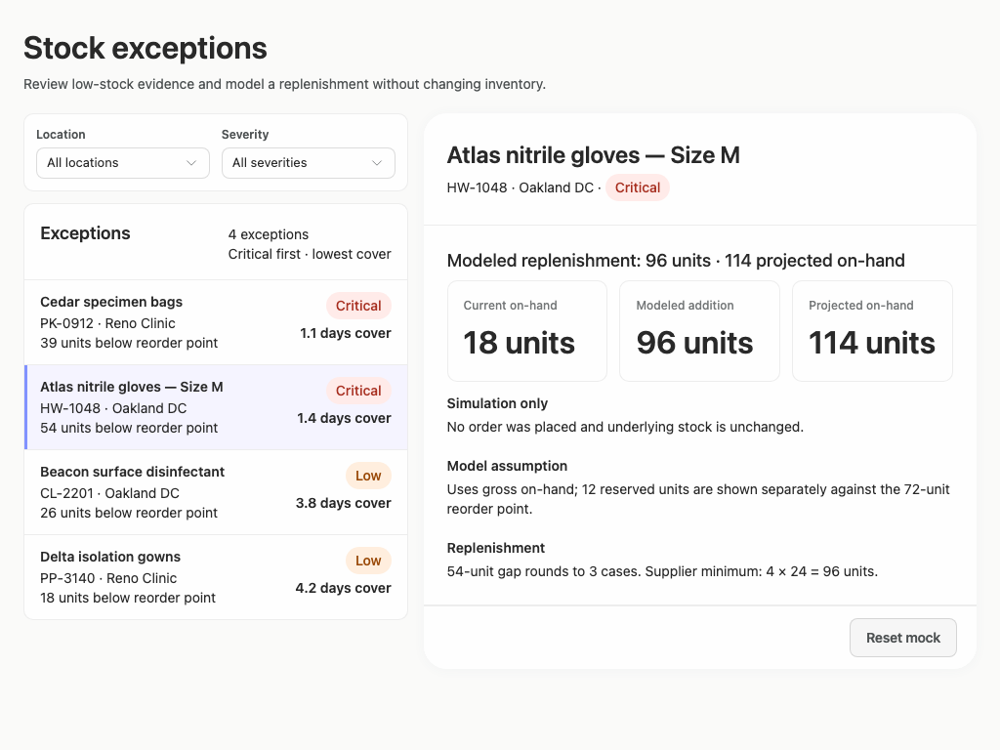
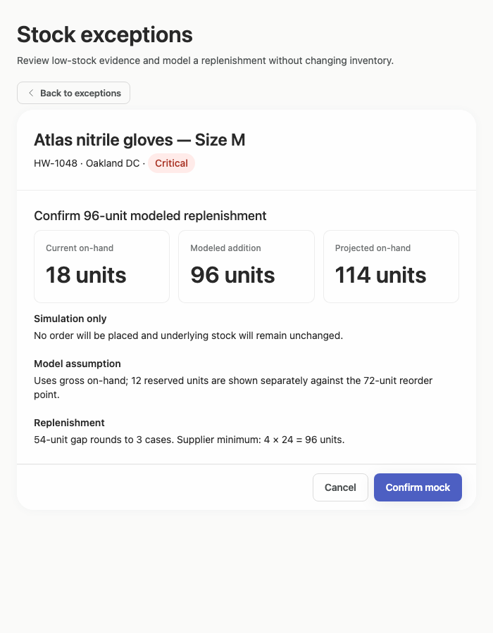
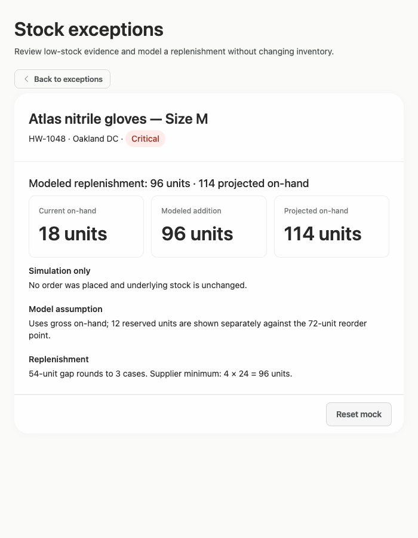
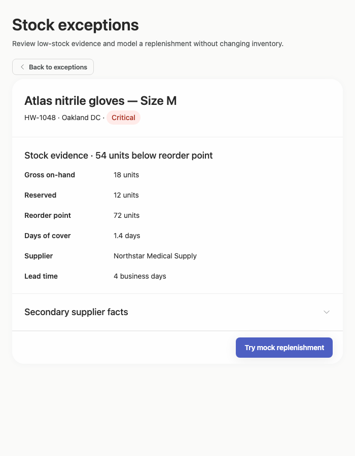

# stock-exceptions-decision-composition — 2026-09-09T09:17:03.978Z

[All reports](../../README.md) · [Interactive HTML report](index.html) · [Full measurements and scoring](report.json)

GitHub renders this summary and the screenshots. Download or clone this folder to open the HTML report locally; GitHub does not serve it as a website.

**Subjective design score:** 90/100. Model: openai/gpt-5.6-sol. Rubric: 2.

**Arrusted adherence:** 100/100 (partial); evidence coverage 1.77%. Evaluator 3.

| Dimension | Conforming | Nonconforming | Unassessed | Adherence    |
| --------- | ---------- | ------------- | ---------- | ------------ |
| component | 21         | 0             | 3          | 100% (21/21) |
| api       | 56         | 0             | 9          | 100% (56/56) |
| styling   | 13         | 0             | 4980       | 100% (13/13) |

Scores from different evaluator versions or captured states are not directly comparable.

This report evaluates the captured preview; evaluation itself does not regenerate the app or prove a built backend. Scores are advisory and not human-calibrated.

## Ratings

| Dimension      | Score | Reason                                                                                                                                                                                                                                                                                                                                                                                               |
| -------------- | ----- | ---------------------------------------------------------------------------------------------------------------------------------------------------------------------------------------------------------------------------------------------------------------------------------------------------------------------------------------------------------------------------------------------------- |
| hierarchy      | 4/4   | The page title and purpose lead clearly into filters, the exception list, and the selected record. Product name, severity, stock deficit, key quantities, and the replenishment action are consistently prioritized; the three large quantity cards make the modeled outcome especially easy to scan.                                                                                                |
| layout         | 3/4   | The two-column review layout is well aligned and comfortably dense at 1024–1920px, with consistent card boundaries, row spacing, and right-aligned actions. The constrained 700px composition appropriately switches to list or detail, though the initial list retains a selected-row treatment before its detail is visible, and the fixed-width wide composition leaves substantial unused space. |
| typography     | 3/4   | Heading levels, field labels, values, and explanatory copy are consistent and readable, with large modeled quantities providing useful emphasis. The 12px muted labels above those quantities are slightly marginal against the white cards—the supplied audit reports a 4.47:1 ratio—so they are less robust than the rest of the typography.                                                       |
| responsive     | 4/4   | The interface remains coherent at 1920, 1440, and 1024px, then changes to a focused list/detail flow at 700px with a visible Back to exceptions control. Controls fit without horizontal overflow, actions remain available, and the expanded supplier section uses ordinary vertical space rather than compressing content.                                                                         |
| productClarity | 4/4   | Location and severity filtering, record selection, stock and supplier review, and the mock replenishment are immediately understandable. Confirmation and result states explicitly say that no order is placed and inventory is unchanged, while current, added, and projected quantities make the modeled effect clear.                                                                             |

## Strengths

- Clear master-detail relationship between low-stock exceptions and supporting stock evidence.
- Exception rows expose location, deficit, severity, and days of cover without requiring record navigation.
- Selected-record styling and repeated identity in the detail header preserve context.
- The mock workflow distinguishes review, confirmation, completed simulation, and reset states.
- Supplier facts are progressively disclosed, keeping the default detail view concise.
- The 700px desktop-panel treatment provides focused navigation rather than squeezing both panes together.
- The existing Arrusted palette and component appearance remain visually consistent across the supplied states.

## Improvements

- **medium — desktop-1:** The three quantity-card captions use small muted text. The supplied audit identifies these 12px labels at 4.47:1 against the card background, just below its reported threshold, and their light treatment makes them less readable than surrounding labels. Use a supported Typography role or size with greater visual weight for the captions while preserving the existing Arrusted palette and card styling.
- **low — desktop-1:** The replenishment explanation presents two different case calculations—three cases for the stock gap and a four-case supplier minimum—without explicitly stating that the minimum overrides the rounded gap. The resulting 96 units are correct within the shown model, but the reasoning takes an extra moment to parse. Rewrite the line as a short progression, such as “54-unit gap → 3 cases; supplier minimum overrides to 4 cases × 24 = 96 units.”
- **low — desktop-custom-700x900-0:** The constrained list initially highlights Atlas as selected even though no detail is visible. A user may reasonably interpret the highlighted row as already activated and be uncertain that clicking it is still required to open the detail view. In the constrained list, defer the selected-row treatment until the user establishes a selection, or add a concise review affordance to the highlighted row.

## Token evidence

Percentages cover only assessed properties. Missing provenance and ambiguous CSS remain unassessed; matching literals are not proof of token usage.

| Viewport                 | Category   | Token references / assessed | Coverage   |
| ------------------------ | ---------- | --------------------------- | ---------- |
| desktop-0                | color      | 0/0                         | 0% (0/233) |
| desktop-0                | typography | 0/0                         | 0% (0/522) |
| desktop-0                | spacing    | 0/0                         | 0% (0/275) |
| desktop-0                | radius     | 0/0                         | 0% (0/116) |
| desktop-0                | border     | 0/0                         | 0% (0/125) |
| desktop-0                | shadow     | 0/0                         | 0% (0/120) |
| desktop-wide-0           | color      | 0/0                         | 0% (0/233) |
| desktop-wide-0           | typography | 0/0                         | 0% (0/522) |
| desktop-wide-0           | spacing    | 0/0                         | 0% (0/275) |
| desktop-wide-0           | radius     | 0/0                         | 0% (0/116) |
| desktop-wide-0           | border     | 0/0                         | 0% (0/125) |
| desktop-wide-0           | shadow     | 0/0                         | 0% (0/120) |
| desktop-window-0         | color      | 0/0                         | 0% (0/233) |
| desktop-window-0         | typography | 0/0                         | 0% (0/522) |
| desktop-window-0         | spacing    | 0/0                         | 0% (0/275) |
| desktop-window-0         | radius     | 0/0                         | 0% (0/116) |
| desktop-window-0         | border     | 0/0                         | 0% (0/125) |
| desktop-window-0         | shadow     | 0/0                         | 0% (0/120) |
| desktop-custom-700x900-0 | color      | 0/0                         | 0% (0/139) |
| desktop-custom-700x900-0 | typography | 0/0                         | 0% (0/287) |
| desktop-custom-700x900-0 | spacing    | 0/0                         | 0% (0/162) |
| desktop-custom-700x900-0 | radius     | 0/0                         | 0% (0/69)  |
| desktop-custom-700x900-0 | border     | 0/0                         | 0% (0/77)  |
| desktop-custom-700x900-0 | shadow     | 0/0                         | 0% (0/73)  |

## Latest-run screenshots

### desktop-0 — initial

Interaction: not-run.

### desktop-1 — Select record and review modeled quantity

Interaction: passed.

### desktop-2 — Confirm modeled replenishment

Interaction: passed.

### desktop-3 — Read projected quantity

Interaction: passed.

### desktop-4 — Reset fixture result

Interaction: passed.

### desktop-5 — Read expanded supplier facts

Interaction: passed.

### desktop-wide-0 — initial

Interaction: not-run.

### desktop-wide-1 — Select record and review modeled quantity

Interaction: passed.

### desktop-wide-2 — Confirm modeled replenishment

Interaction: passed.

### desktop-wide-3 — Read projected quantity

Interaction: passed.

### desktop-wide-4 — Reset fixture result

Interaction: passed.

### desktop-wide-5 — Read expanded supplier facts

Interaction: passed.

### desktop-window-0 — initial

Interaction: not-run.

### desktop-window-1 — Select record and review modeled quantity

Interaction: passed.

### desktop-window-2 — Confirm modeled replenishment

Interaction: passed.

### desktop-window-3 — Read projected quantity

Interaction: passed.

### desktop-window-4 — Reset fixture result

Interaction: passed.

### desktop-window-5 — Read expanded supplier facts

Interaction: passed.

### desktop-custom-700x900-0 — initial

Interaction: not-run.

### desktop-custom-700x900-1 — Select record and review modeled quantity

Interaction: passed.

### desktop-custom-700x900-2 — Confirm modeled replenishment

Interaction: passed.

### desktop-custom-700x900-3 — Read projected quantity

Interaction: passed.

### desktop-custom-700x900-4 — Reset fixture result

Interaction: passed.

### desktop-custom-700x900-5 — Read expanded supplier facts

Interaction: passed.

## Limitations

- Only the supplied screenshots and measurements were reviewed; filter-result, empty, loading, error, and long-data states were not shown.
- Interaction reports demonstrate the pictured mock-state transitions but do not establish backend behavior or persistence.
- No implementation-plan artifact is visible, so the brief’s requested implementation plan cannot be evaluated from this evidence.
- Most styling provenance was unassessed in the supplied adherence data; visual consistency does not prove complete token provenance or rendered component identity.
