# stock-exceptions-decision-evidence — 2026-09-09T04:47:23.140Z

[All reports](../../README.md) · [Interactive HTML report](index.html) · [Full measurements and scoring](report.json)

GitHub renders this summary and the screenshots. Download or clone this folder to open the HTML report locally; GitHub does not serve it as a website.

**Subjective design score:** 80/100. Model: openai/gpt-5.6-sol. Rubric: 2.

**Arrusted adherence:** 100/100 (partial); evidence coverage 1.03%. Evaluator 3.

| Dimension | Conforming | Nonconforming | Unassessed | Adherence    |
| --------- | ---------- | ------------- | ---------- | ------------ |
| component | 13         | 0             | 1          | 100% (13/13) |
| api       | 33         | 0             | 13         | 100% (33/33) |
| styling   | 10         | 0             | 5344       | 100% (10/10) |

Scores from different evaluator versions or captured states are not directly comparable.

This report evaluates the captured preview; evaluation itself does not regenerate the app or prove a built backend. Scores are advisory and not human-calibrated.

## Ratings

| Dimension | Score | Reason |
| --- | --- | --- |
| hierarchy | 3/4 | The page title, filters, exception list, selected record, evidence, and primary mock action form a clear review sequence. Selection is reinforced by a tinted row and matching detail title. Hierarchy is weakened slightly by the prominent but apparently contentless “Secondary supplier facts” disclosure and by the mock result not explaining why 72 units were modeled. |
| layout | 3/4 | List rows, evidence labels and values, card boundaries, and action placement are consistently aligned with comfortable desktop density. The list-detail split is balanced at 1024–1920px, though the filter container is materially wider than the work area at 1440px and the wide empty state leaves the entire detail region visually unresolved. |
| typography | 3/4 | Headings, product names, evidence values, and supporting metadata use a consistent, readable scale. Small muted metadata and 10px severity-pill text are visually delicate; automated evidence also flags these areas, so critical status depends on typography that is less robust than the main content even though the authoritative palette is preserved. |
| responsive | 4/4 | The composition remains usable across the supplied 700, 1024, 1440, and 1920px desktop captures. Wide and regular windows use list-detail, while the 700px panel switches to a focused detail view with a clear “Back to exceptions” control. Controls remain visible, content does not overlap, and intentional document scrolling accommodates the expanded mock result. |
| productClarity | 3/4 | The task is immediately understandable: filter exceptions, select a product, inspect stock and supplier evidence, and try a clearly labeled mock action. Filter synchronization, empty-state recovery, and the explicit statement that no order was placed reduce risk. Clarity is held back by the unexplained secondary-facts disclosure and limited rationale for the modeled replenishment quantity. |

## Strengths

- The page subtitle clearly frames the action as a non-destructive replenishment model.
- Location and severity filters are placed before the exception list and remain available in every supplied desktop composition.
- Rows expose product identity, location, severity, and days of cover, supporting rapid comparison without opening every record.
- Selected-row treatment and synchronized detail content make the active record unambiguous.
- Stock and supplier evidence is grouped into a compact, scannable label-value structure.
- The mock result explicitly states projected stock and confirms that inventory was not changed or ordered.
- The empty state explains why no records are shown and provides a direct reset action.
- The constrained 700px desktop panel uses the available list-detail Back pattern rather than compressing both panes into an unusable split.

## Improvements

- **medium — desktop-0:** “Secondary supplier facts” presents a disclosure affordance, but no secondary facts are visible and the upward chevron can suggest that an empty section is already expanded. This creates uncertainty about whether information is missing or hidden. Populate the Disclosure with meaningful secondary supplier fields, or keep it visibly collapsed until content exists. If there are no additional facts in the prototype, omit the section rather than presenting an empty affordance.
- **medium — desktop-1:** The result says “72 units modeled” and projects 90 units from 18 on hand, but it does not explain why 72 was chosen. Because 72 is also the displayed reorder point, users may confuse order quantity with the target threshold. Add a short calculation or rationale within the result, such as “18 on hand + 72 modeled = 90 projected,” and identify whether the quantity is a fixed mock amount, supplier pack quantity, or suggested replenishment.
- **low — desktop-wide-4:** In the wide empty state, recovery content remains confined to the 500px list column while the former detail region is entirely blank. The state is usable but feels compositionally unfinished and can imply that the detail panel failed to load. When no exceptions remain, span the empty-state composition across the list-detail work area, or retain a lightweight detail-side placeholder explaining that a record will appear after filters return results.
- **low — desktop-0:** The filter card spans almost the full window while the list-detail work area begins at x=100 and is substantially narrower. The differing outer edges weaken alignment between filtering and results. Place the filters and list-detail composition within the same centered content container, while allowing the Select controls themselves to retain their current supported sizing.
- **low — desktop-0:** Severity is conveyed in a very small pill while days of cover receives stronger body-weight emphasis. Automated evidence also identifies the pill text as a contrast-sensitive area, making the urgency cue less robust for quick scanning. Preserve the Arrusted palette and StatusPill, but reinforce severity with regular-sized text in the row’s evidence line or provide a less compressed row composition so the status label is not the smallest critical information.

## Token evidence

Percentages cover only assessed properties. Missing provenance and ambiguous CSS remain unassessed; matching literals are not proof of token usage.

| Viewport | Category | Token references / assessed | Coverage |
| --- | --- | --- | --- |
| desktop-0 | color | 0/0 | 0% (0/228) |
| desktop-0 | typography | 0/0 | 0% (0/522) |
| desktop-0 | spacing | 0/0 | 0% (0/276) |
| desktop-0 | radius | 0/0 | 0% (0/116) |
| desktop-0 | border | 0/0 | 0% (0/130) |
| desktop-0 | shadow | 0/0 | 0% (0/120) |
| desktop-wide-0 | color | 0/0 | 0% (0/228) |
| desktop-wide-0 | typography | 0/0 | 0% (0/522) |
| desktop-wide-0 | spacing | 0/0 | 0% (0/276) |
| desktop-wide-0 | radius | 0/0 | 0% (0/116) |
| desktop-wide-0 | border | 0/0 | 0% (0/130) |
| desktop-wide-0 | shadow | 0/0 | 0% (0/120) |
| desktop-window-0 | color | 0/0 | 0% (0/228) |
| desktop-window-0 | typography | 0/0 | 0% (0/522) |
| desktop-window-0 | spacing | 0/0 | 0% (0/276) |
| desktop-window-0 | radius | 0/0 | 0% (0/116) |
| desktop-window-0 | border | 0/0 | 0% (0/130) |
| desktop-window-0 | shadow | 0/0 | 0% (0/120) |
| desktop-custom-700x900-0 | color | 0/0 | 0% (0/188) |
| desktop-custom-700x900-0 | typography | 0/0 | 0% (0/469) |
| desktop-custom-700x900-0 | spacing | 0/0 | 0% (0/219) |
| desktop-custom-700x900-0 | radius | 0/0 | 0% (0/95) |
| desktop-custom-700x900-0 | border | 0/0 | 0% (0/102) |
| desktop-custom-700x900-0 | shadow | 0/0 | 0% (0/95) |

## Latest-run screenshots

### desktop-0 — initial

Interaction: not-run.

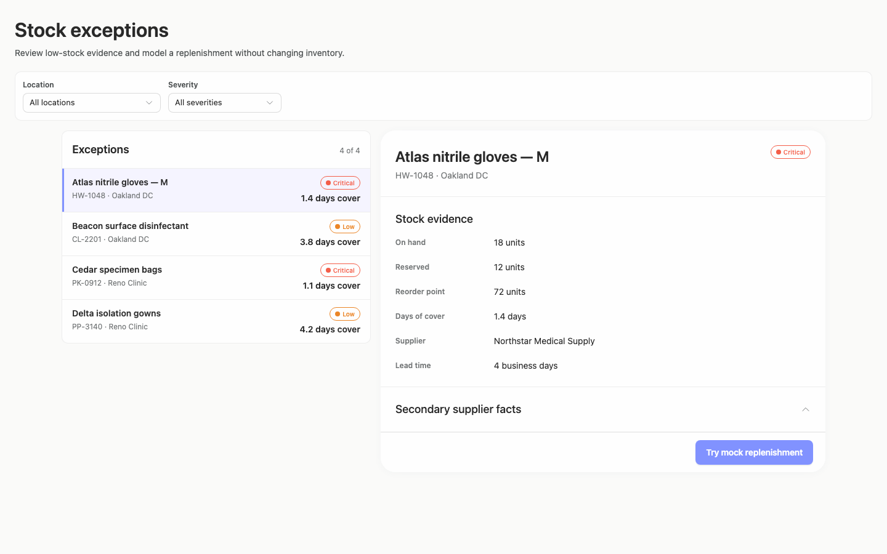

### desktop-1 — Mock replenishment result

Interaction: passed.

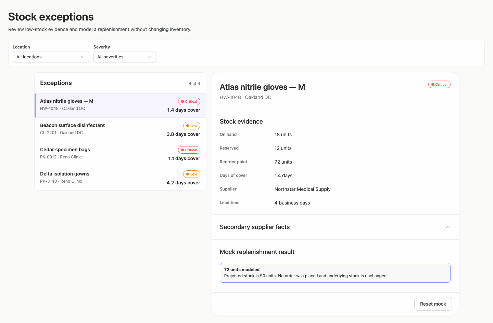

### desktop-2 — Reset mock result

Interaction: passed.

### desktop-3 — Filter and synchronize selection

Interaction: passed.

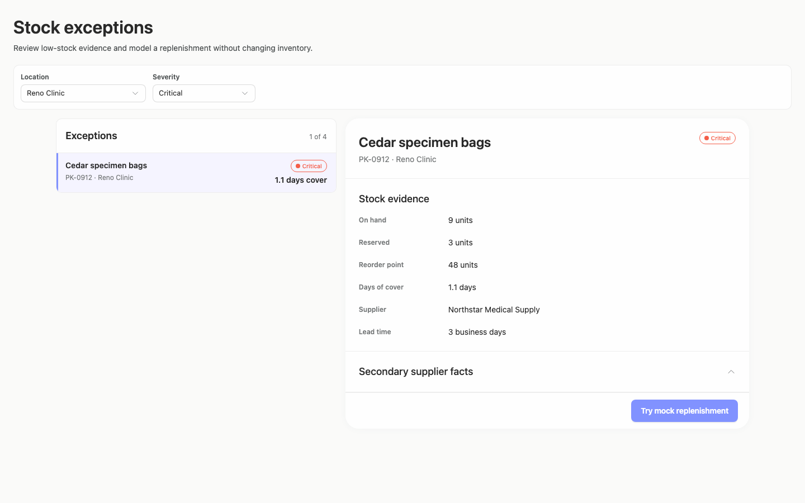

### desktop-4 — Empty filtered state

Interaction: passed.

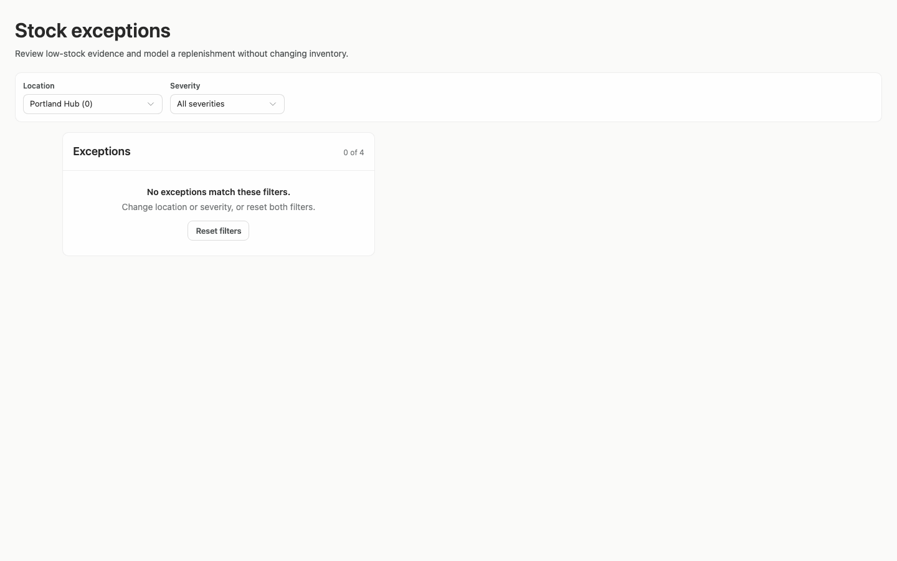

### desktop-wide-0 — initial

Interaction: not-run.

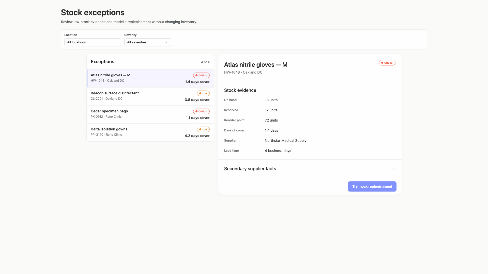

### desktop-wide-1 — Mock replenishment result

Interaction: passed.

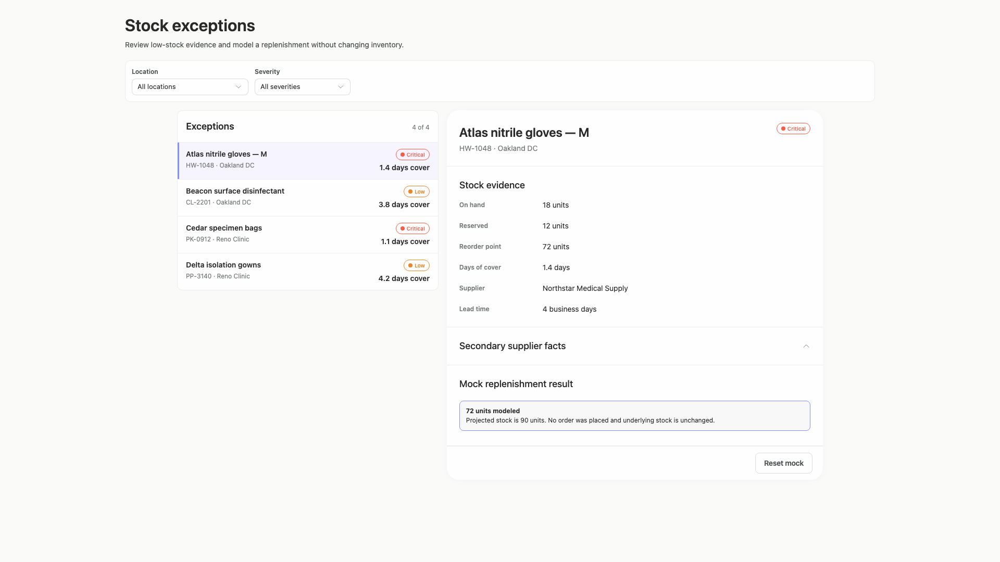

### desktop-wide-2 — Reset mock result

Interaction: passed.

### desktop-wide-3 — Filter and synchronize selection

Interaction: passed.

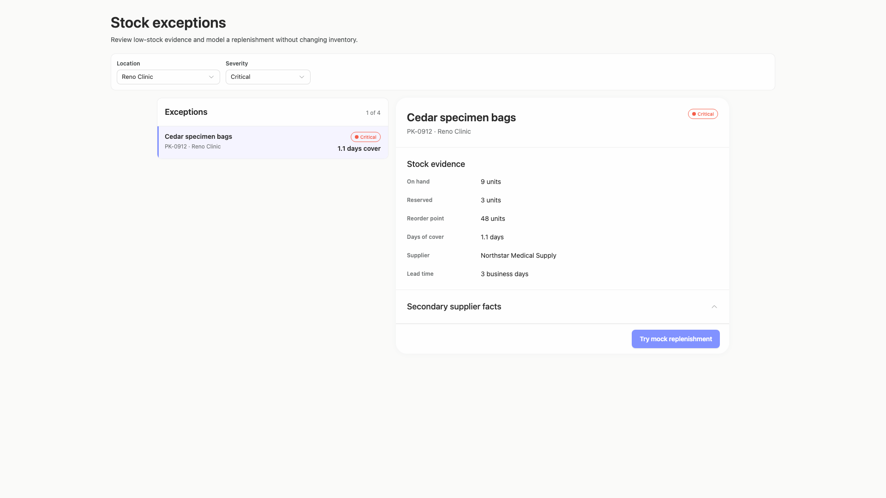

### desktop-wide-4 — Empty filtered state

Interaction: passed.

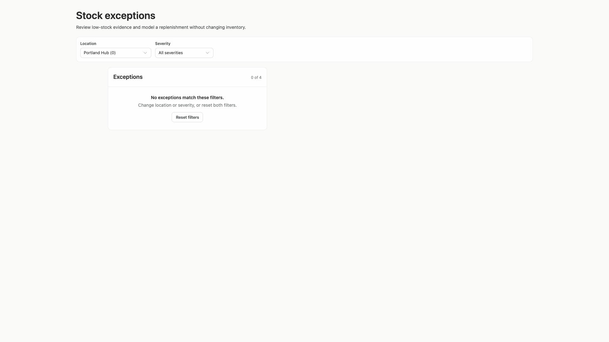

### desktop-window-0 — initial

Interaction: not-run.

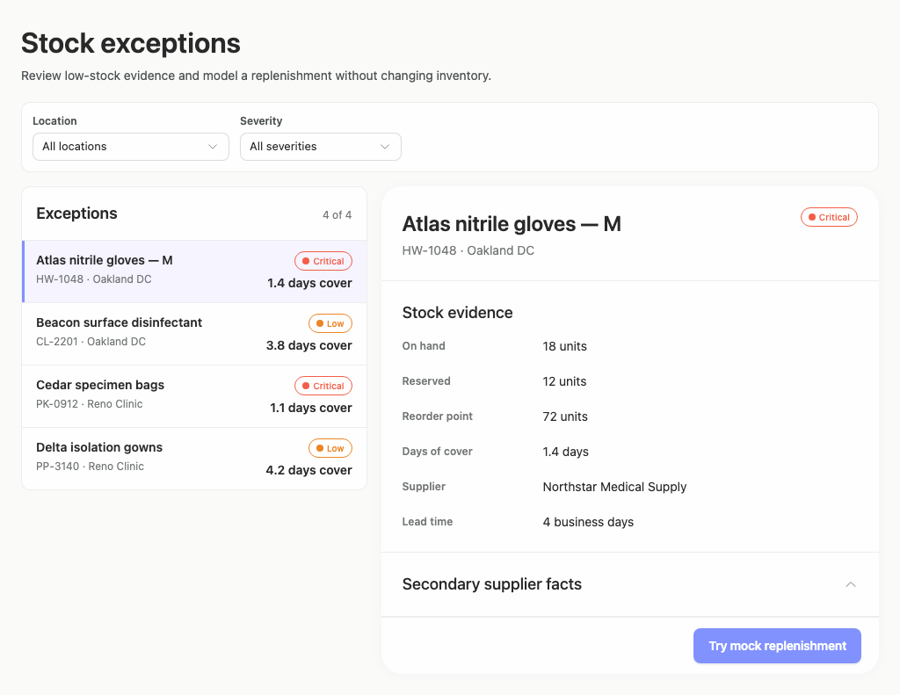

### desktop-window-1 — Mock replenishment result

Interaction: passed.

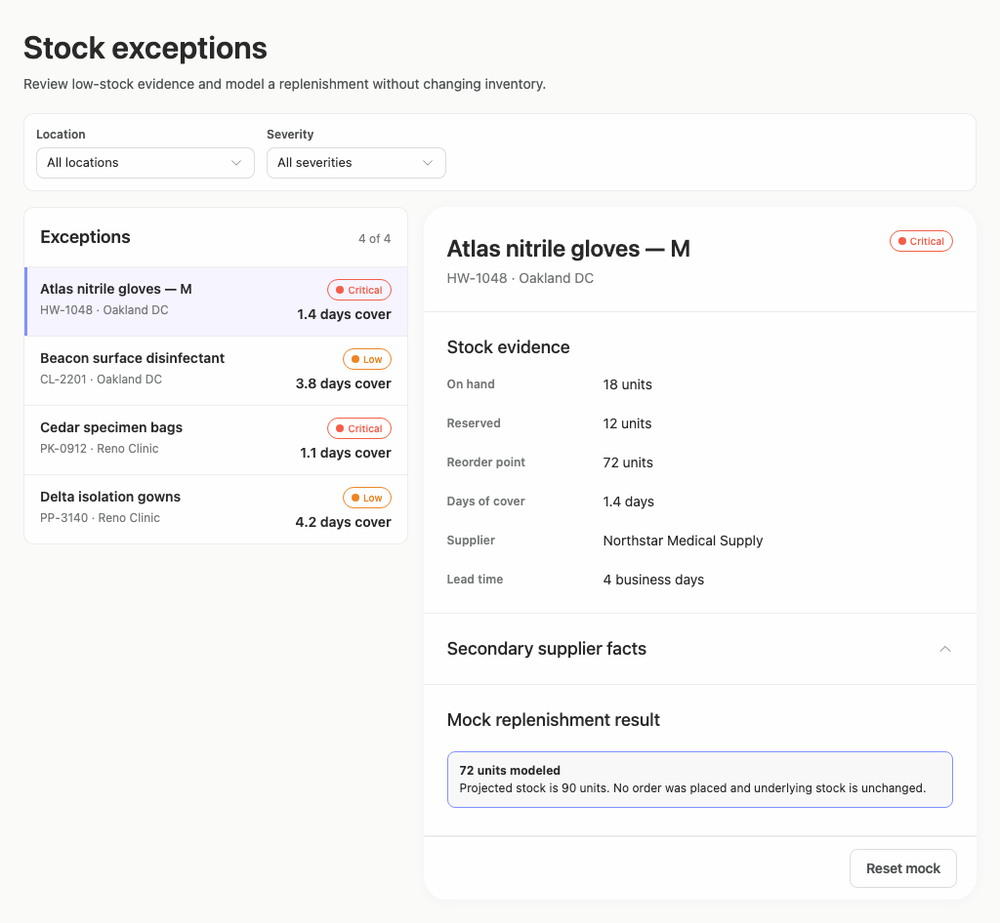

### desktop-window-2 — Reset mock result

Interaction: passed.

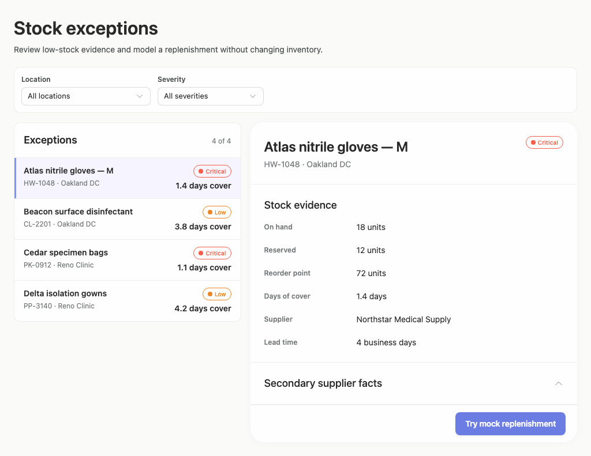

### desktop-window-3 — Filter and synchronize selection

Interaction: passed.

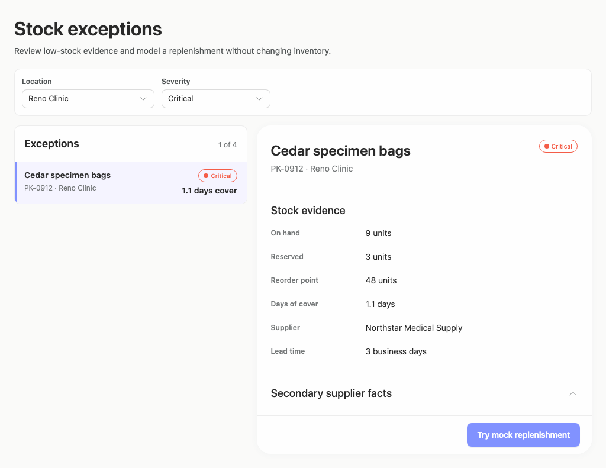

### desktop-window-4 — Empty filtered state

Interaction: passed.

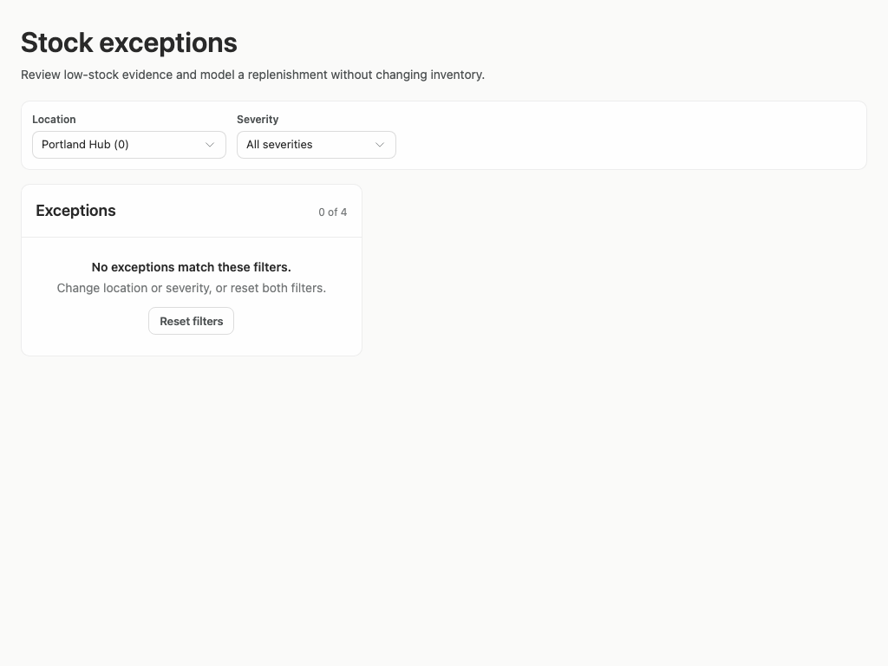

### desktop-custom-700x900-0 — initial

Interaction: not-run.

### desktop-custom-700x900-1 — Mock replenishment result

Interaction: passed.

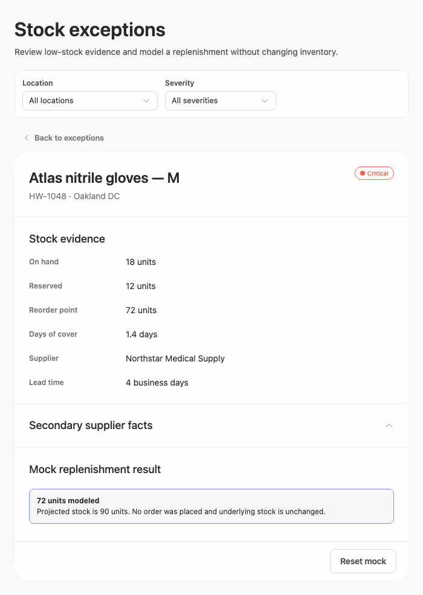

### desktop-custom-700x900-2 — Reset mock result

Interaction: passed.

### desktop-custom-700x900-3 — Filter and synchronize selection

Interaction: passed.

### desktop-custom-700x900-4 — Empty filtered state

Interaction: passed.

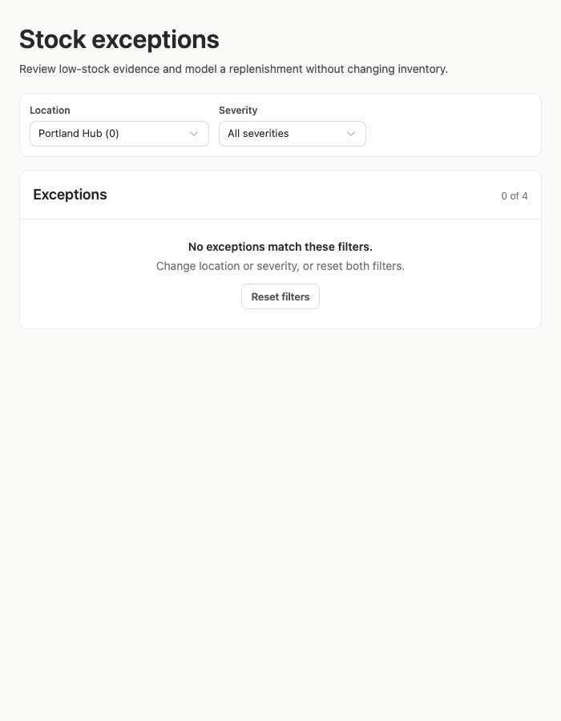

## Limitations

- Assessment is based on supplied screenshots and measurements; open Select menus, keyboard focus, disclosure contents, loading states, and error states were not shown.
- Interaction evidence confirms filtering, selection synchronization, mock-result reset, and empty-state text, but does not establish backend behavior or persistence.
- The narrowest supplied desktop panel is 700px and the next tested width is 1024px, so intermediate panel transitions were not directly observed.
- The evidence does not include a separate implementation-plan artifact, so its completeness cannot be assessed.
- Static source and adherence evidence does not prove every dynamic JSX branch rendered; styling provenance also has very low assessed coverage and is treated separately from the visual evaluation.
