# stock-exceptions-delivery-signal — 2026-09-09T00:19:13.264Z

[All reports](../../README.md) · [Interactive HTML report](index.html) · [Full measurements and scoring](report.json)

GitHub renders this summary and the screenshots. Download or clone this folder to open the HTML report locally; GitHub does not serve it as a website.

**Subjective design score:** 95/100. Model: openai/gpt-5.6-sol. Rubric: 2.

**Arrusted adherence:** 100/100 (partial); evidence coverage 1.83%. Evaluator 3.

| Dimension | Conforming | Nonconforming | Unassessed | Adherence    |
| --------- | ---------- | ------------- | ---------- | ------------ |
| component | 32         | 0             | 3          | 100% (32/32) |
| api       | 54         | 0             | 7          | 100% (54/54) |
| styling   | 19         | 0             | 5637       | 100% (19/19) |

Scores from different evaluator versions or captured states are not directly comparable.

This is the saved component-backed preview, not a new generation or a built backend. Scores are advisory and not human-calibrated.

## Ratings

| Dimension      | Score | Reason                                                                                                                                                                                                                                                                                                                                                                             |
| -------------- | ----- | ---------------------------------------------------------------------------------------------------------------------------------------------------------------------------------------------------------------------------------------------------------------------------------------------------------------------------------------------------------------------------------- |
| hierarchy      | 4/4   | The page establishes a clear sequence from title and review count to filters, severity-grouped exceptions, selected-item details, suggested quantity, risk message, and replenishment action. Selected rows, severity pills, bold cover values, and section dividers make priorities highly scannable.                                                                             |
| layout         | 3/4   | The two-pane composition is consistently aligned and comfortably dense at 1024–1920 px, while the 700 px state appropriately separates list and detail views. Spacing is disciplined, though the supplier-detail area is sparse and wide canvases leave substantial unused space below the relatively short workflow.                                                              |
| typography     | 4/4   | Product names, section headings, labels, quantities, and explanatory text use a consistent and readable scale. Bold values create useful contrast with labels, while concise status pills and restrained secondary text preserve readability without visual noise.                                                                                                                 |
| responsive     | 4/4   | The composition remains usable across all supplied desktop sizes: filters and cards resize cleanly, the 1024 px split view avoids horizontal overflow, and the 700 px window switches to a focused detail view with a prominent Back to exceptions control. The replenishment action remains visible in the supplied narrow states.                                                |
| productClarity | 4/4   | The workflow is immediately understandable: filter by location and severity, select a low-stock product, compare stock or supplier information, review the suggested pack-based order and delivery risk, then run an explicitly labeled simulation. Copy such as Preview only, No supplier contacted, and Stock unchanged clearly distinguishes the mock action from a real order. |

## Strengths

- Severity grouping and ascending days-of-cover ordering support rapid triage.
- Selected-item styling clearly connects the exception row with the detail panel.
- Stock position and supplier details are separated without hiding the suggested replenishment context.
- Delivery-risk messaging distinguishes an arrival gap from arrival within cover and explains the assumption in plain language.
- The 700 px master-detail transition is well handled, with a clear return affordance and no visible horizontal clipping.
- Filtered counts and group summaries update coherently in the supplied filtered states.

## Improvements

- **low — desktop-1:** The Supplier details tab provides only supplier name, lead time, and pack size. This is enough for the mock calculation but leaves the review view comparatively sparse for a retail inventory team deciding whether replenishment is practical. Add the most decision-relevant available supplier fields, such as minimum order, next cutoff or delivery day, supplier item code, and ordering/contact method. Keep them in the existing label/value pattern to avoid increasing visual complexity.
- **low — desktop-0:** Exception rows identify products by name and location but omit the SKU shown in the detail panel. Similar product names or pack variants could therefore be harder to distinguish before selection. Include the SKU as compact secondary metadata beside or below the location, especially when names may differ only by size or pack variant.
- **low — desktop-2:** After simulation, confirmation is split between Stock unchanged on the left and a muted, disabled-looking action label on the right. The wording is accurate, but the completion state can be visually mistaken for an unavailable control rather than successful mock feedback. Keep the completed action state, but reinforce it with a supported StatusPill or Toast near the action row stating that the simulation completed and no order was sent.

## Token evidence

Percentages cover only assessed properties. Missing provenance and ambiguous CSS remain unassessed; matching literals are not proof of token usage.

| Viewport                 | Category   | Token references / assessed | Coverage   |
| ------------------------ | ---------- | --------------------------- | ---------- |
| desktop-0                | color      | 0/0                         | 0% (0/227) |
| desktop-0                | typography | 0/0                         | 0% (0/557) |
| desktop-0                | spacing    | 0/0                         | 0% (0/299) |
| desktop-0                | radius     | 0/0                         | 0% (0/114) |
| desktop-0                | border     | 0/0                         | 0% (0/137) |
| desktop-0                | shadow     | 0/0                         | 0% (0/120) |
| desktop-wide-0           | color      | 0/0                         | 0% (0/227) |
| desktop-wide-0           | typography | 0/0                         | 0% (0/557) |
| desktop-wide-0           | spacing    | 0/0                         | 0% (0/299) |
| desktop-wide-0           | radius     | 0/0                         | 0% (0/114) |
| desktop-wide-0           | border     | 0/0                         | 0% (0/137) |
| desktop-wide-0           | shadow     | 0/0                         | 0% (0/120) |
| desktop-window-0         | color      | 0/0                         | 0% (0/227) |
| desktop-window-0         | typography | 0/0                         | 0% (0/557) |
| desktop-window-0         | spacing    | 0/0                         | 0% (0/299) |
| desktop-window-0         | radius     | 0/0                         | 0% (0/114) |
| desktop-window-0         | border     | 0/0                         | 0% (0/137) |
| desktop-window-0         | shadow     | 0/0                         | 0% (0/120) |
| desktop-custom-700x900-0 | color      | 0/0                         | 0% (0/198) |
| desktop-custom-700x900-0 | typography | 0/0                         | 0% (0/489) |
| desktop-custom-700x900-0 | spacing    | 0/0                         | 0% (0/265) |
| desktop-custom-700x900-0 | radius     | 0/0                         | 0% (0/99)  |
| desktop-custom-700x900-0 | border     | 0/0                         | 0% (0/119) |
| desktop-custom-700x900-0 | shadow     | 0/0                         | 0% (0/105) |

## Latest-run screenshots

### desktop-0 — initial

Interaction: not-run.

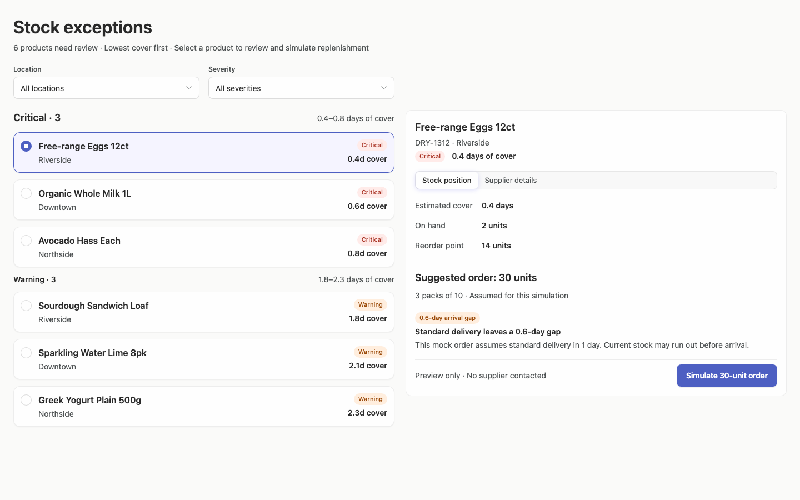

### desktop-1 — Select and inspect supplier

Interaction: passed.

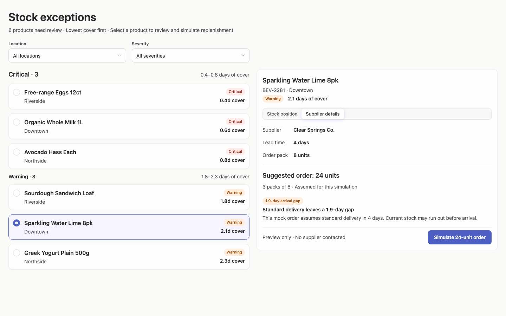

### desktop-2 — Simulate replenishment

Interaction: passed.

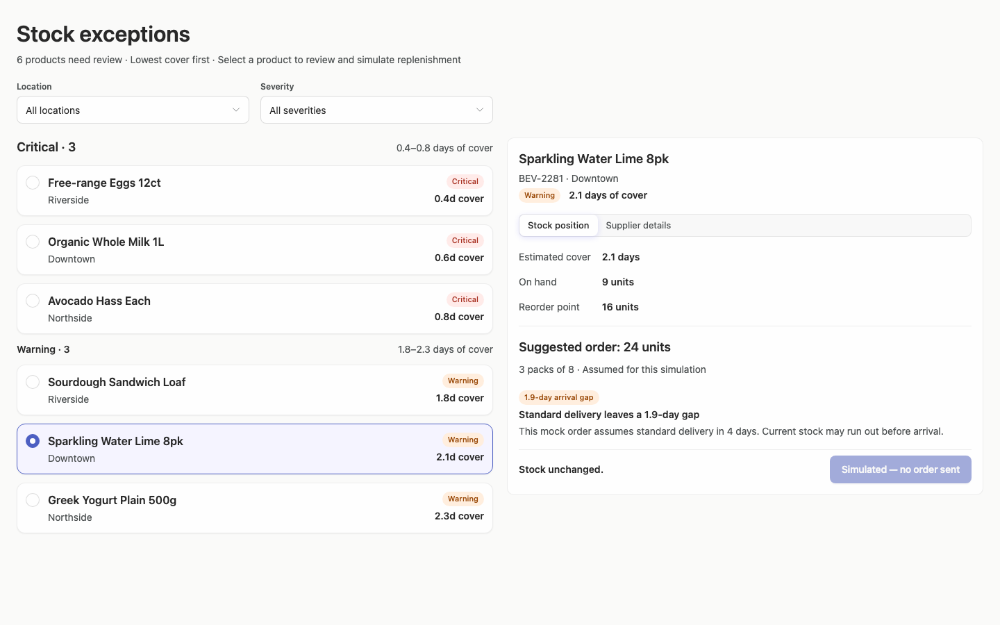

### desktop-3 — Filter records

Interaction: passed.

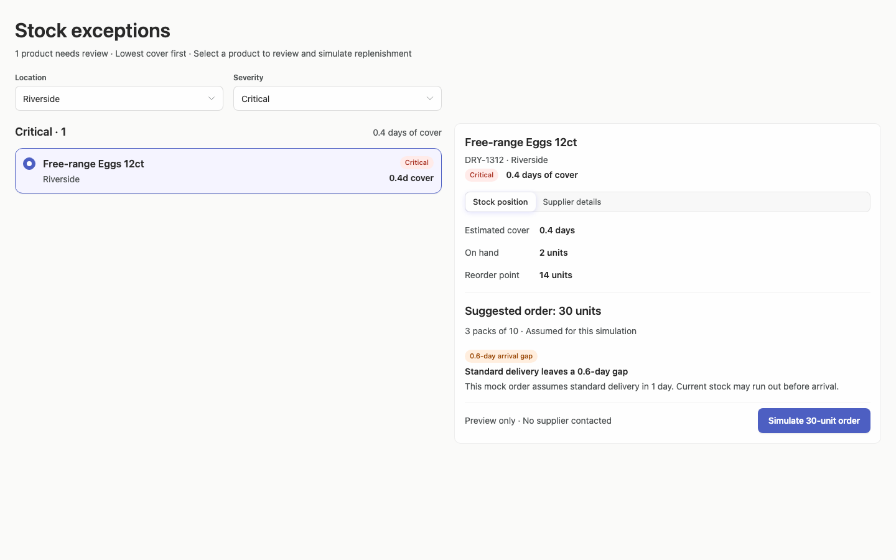

### desktop-4 — Review delivery within cover

Interaction: passed.

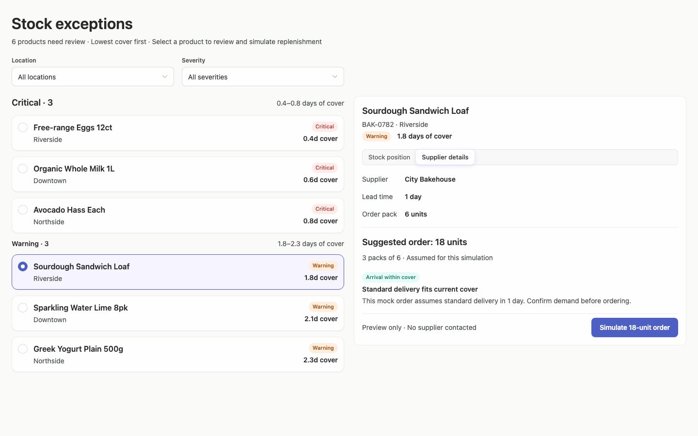

### desktop-5 — Read the stock-view delivery assumption

Interaction: passed.

### desktop-wide-0 — initial

Interaction: not-run.

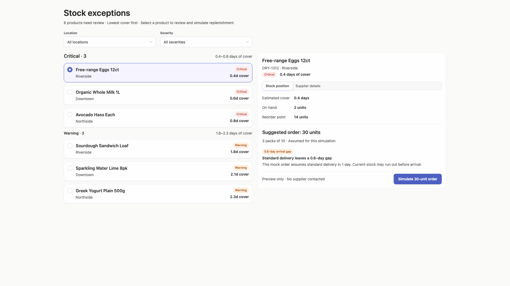

### desktop-wide-1 — Select and inspect supplier

Interaction: passed.

### desktop-wide-2 — Simulate replenishment

Interaction: passed.

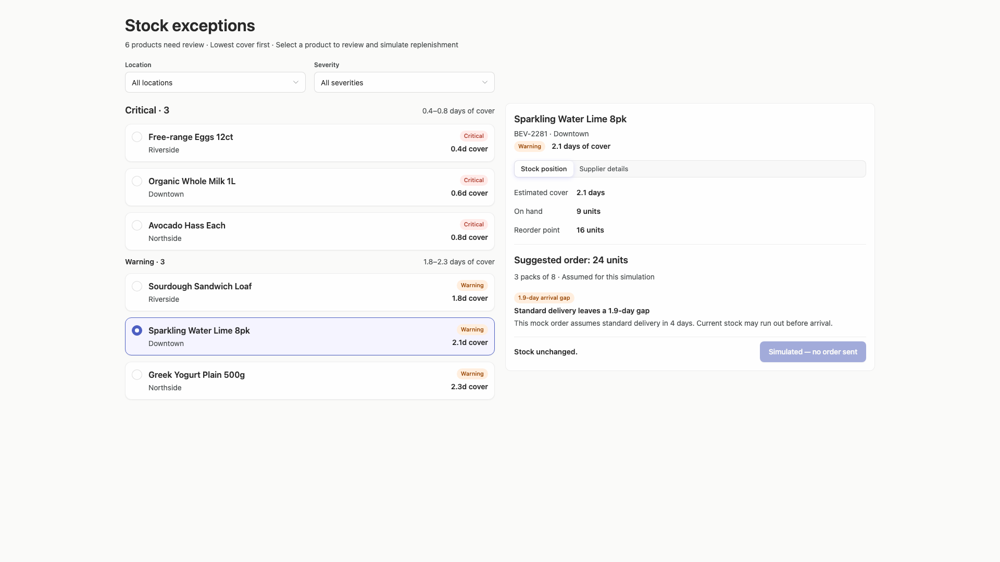

### desktop-wide-3 — Filter records

Interaction: passed.

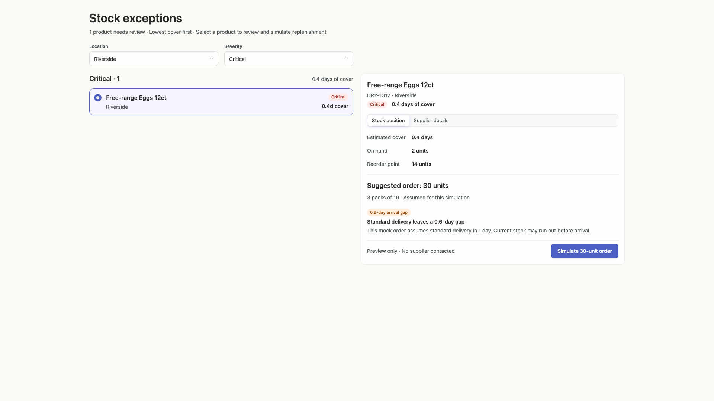

### desktop-wide-4 — Review delivery within cover

Interaction: passed.

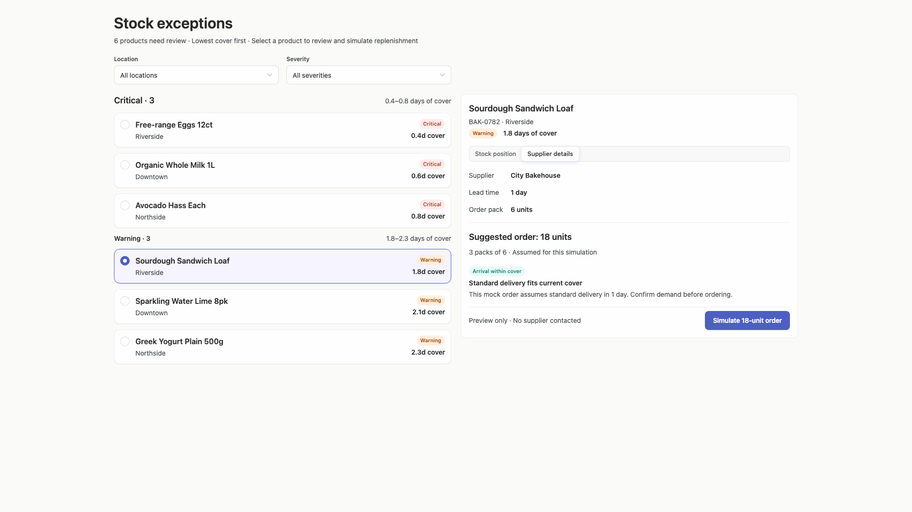

### desktop-wide-5 — Read the stock-view delivery assumption

Interaction: passed.

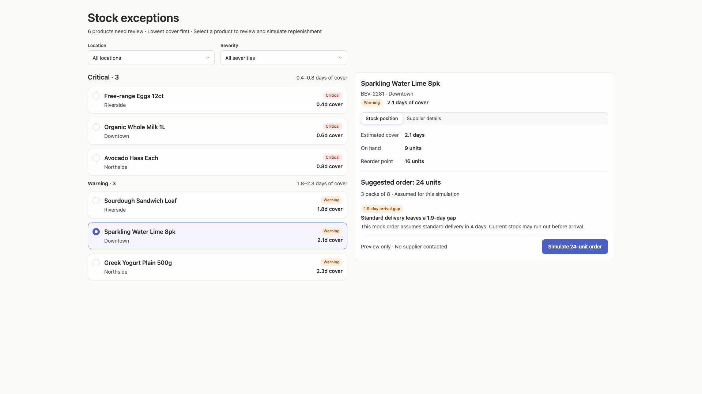

### desktop-window-0 — initial

Interaction: not-run.

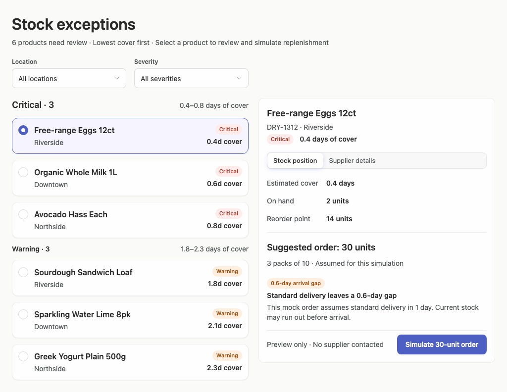

### desktop-window-1 — Select and inspect supplier

Interaction: passed.

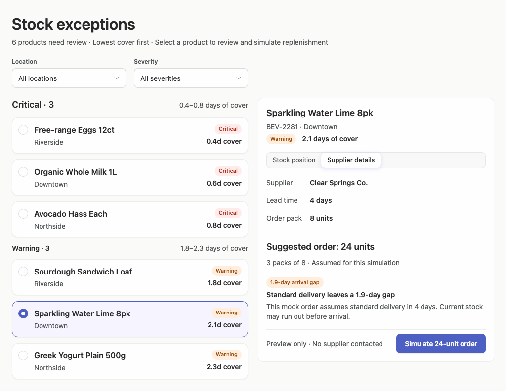

### desktop-window-2 — Simulate replenishment

Interaction: passed.

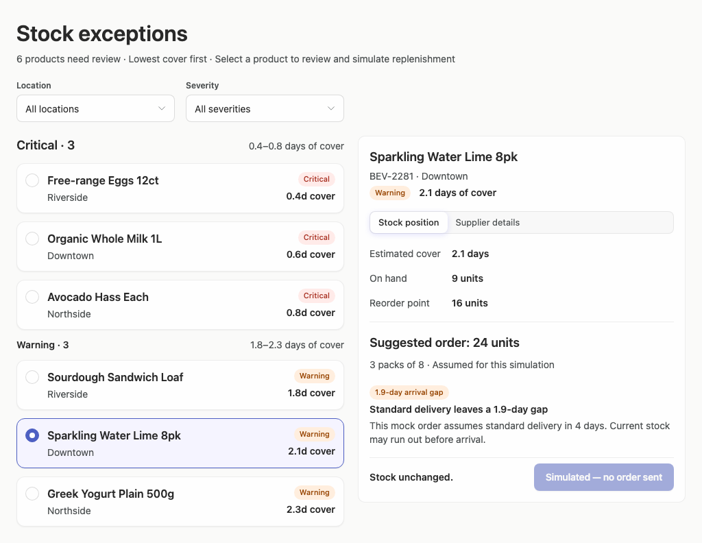

### desktop-window-3 — Filter records

Interaction: passed.

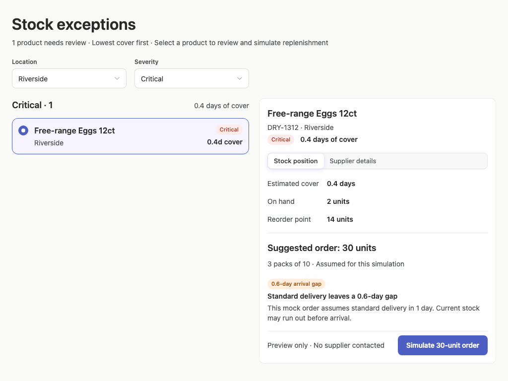

### desktop-window-4 — Review delivery within cover

Interaction: passed.

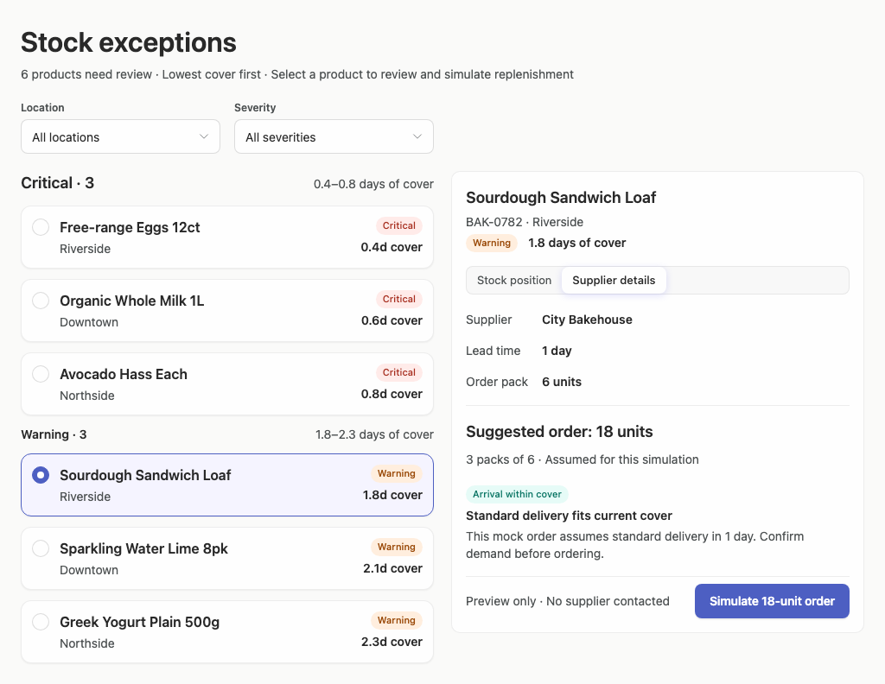

### desktop-window-5 — Read the stock-view delivery assumption

Interaction: passed.

### desktop-custom-700x900-0 — initial

Interaction: not-run.

### desktop-custom-700x900-1 — Select and inspect supplier

Interaction: passed.

### desktop-custom-700x900-2 — Simulate replenishment

Interaction: passed.

### desktop-custom-700x900-3 — Filter records

Interaction: passed.

### desktop-custom-700x900-4 — Review delivery within cover

Interaction: passed.

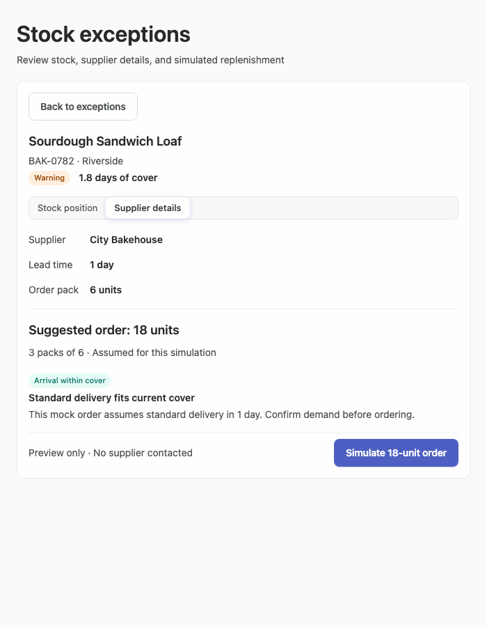

### desktop-custom-700x900-5 — Read the stock-view delivery assumption

Interaction: passed.

## Limitations

- Only the supplied rendered states were assessed; dropdown menus, focus states, keyboard navigation, loading, empty-result, and error states were not shown.
- Passed scripted text checks demonstrate the supplied mock transitions only and do not establish backend or production behavior.
- The requested implementation plan is not visible in the screenshots, so its quality and completeness could not be evaluated.
- Arrusted component and API evidence is strongly conforming where assessed, but most styling provenance remains unassessed; palette or token compliance cannot be fully verified from screenshots.
- The 700 px captures demonstrate a focused list/detail transition, but intermediate desktop panel widths between 700 and 1024 px were not shown.
