# stock-exceptions-disclosure-finding — 2026-09-09T04:54:02.841Z

[All reports](../../README.md) · [Interactive HTML report](index.html) · [Full measurements and scoring](report.json)

GitHub renders this summary and the screenshots. Download or clone this folder to open the HTML report locally; GitHub does not serve it as a website.

**Subjective design score:** 70/100. Model: openai/gpt-5.6-sol. Rubric: 2.

**Arrusted adherence:** 99/100 (partial); evidence coverage 1.05%. Evaluator 3.

| Dimension | Conforming | Nonconforming | Unassessed | Adherence    |
| --------- | ---------- | ------------- | ---------- | ------------ |
| component | 14         | 0             | 2          | 100% (14/14) |
| api       | 30         | 1             | 13         | 97% (30/31)  |
| styling   | 12         | 0             | 5356       | 100% (12/12) |

Scores from different evaluator versions or captured states are not directly comparable.

This report evaluates the captured preview; evaluation itself does not regenerate the app or prove a built backend. Scores are advisory and not human-calibrated.

## Ratings

| Dimension | Score | Reason |
| --- | --- | --- |
| hierarchy | 3/4 | The page title, filters, exception list, selected-product heading, evidence, supplier section, and primary mock action form a clear review sequence. Selection highlighting and repeated severity labels support scanning, though the apparently expanded but empty supplier section interrupts the information hierarchy. |
| layout | 3/4 | The two-pane composition is consistently aligned and comfortably dense at 1024–1920 px, with compact 72 px list rows and orderly label/value columns. At 700 px it appropriately switches to a detail view with Back navigation. Some wide-window space is underused, but it does not impair the task. |
| typography | 3/4 | Headings, product names, values, and controls use a consistent typographic system and remain readable across captures. Numerous 10–12 px muted labels and severity pills were flagged for marginal or insufficient contrast, making secondary information harder to read; this can be improved through supported typography size or weight variants while retaining the Arrusted palette. |
| responsive | 3/4 | The interface remains usable at 1920, 1440, 1024, and 700 px desktop widths. It moves from side-by-side list/detail to a constrained detail view with a clear Back control, and expanded mock results remain accessible through ordinary page scrolling. No captures demonstrate narrower panels or arbitrary intermediate resizing, so excellent coverage cannot be confirmed. |
| productClarity | 2/4 | Location and severity filters, selected-record state, stock fields, an explicit mock action, reversible result state, and empty-state recovery are understandable. However, the Secondary supplier facts disclosure appears expanded without showing the expected terms, and the mock calculation does not clarify how reserved stock affects the modeled quantity, leaving important replenishment evidence incomplete. |

## Strengths

- The title and subtitle immediately explain that the workflow reviews low-stock evidence and models replenishment without changing inventory.
- Exception rows expose product identity, location, severity, and days of cover in a compact, comparable format.
- Selection is synchronized with the detail pane and remains visually obvious through the highlighted row and matching record heading.
- The mock result explicitly states that no order was placed and underlying stock is unchanged, reducing the risk of mistaking the prototype action for a real order.
- The empty filtered state explains what happened and provides a direct Reset filters recovery action.
- The 700 px desktop-panel composition uses a supported list-to-detail transition rather than compressing both panes into an unusable split view.

## Improvements

- **high — desktop-5:** Secondary supplier facts shows an upward disclosure indicator, which visually implies an expanded section, but no supplier terms are visible. The supplied interaction for this state also failed to find “Net 30 · minimum 4 cases,” so users cannot review the expected secondary supplier details. Render the supplier-facts body directly below the disclosure heading when expanded, including payment terms, minimum order or case quantity, and other relevant constraints. If those facts are unavailable, show an explicit unavailable state or leave the disclosure collapsed.
- **medium — desktop-1:** The result explains that a 54-unit shortfall was rounded to 72 units, while the evidence above also shows 12 reserved units. It is unclear whether reserved stock was intentionally included or excluded from the replenishment calculation. Present the calculation as a short labeled breakdown—for example target stock, on hand, reserved-stock treatment, raw shortfall, case-pack rounding, and projected stock—before the no-order confirmation.
- **medium — desktop-0:** SKU/location metadata and Critical/Low labels are set in small secondary text. Automated evidence repeatedly flags these labels and pills for insufficient or marginal contrast, which can slow scanning of location and severity even though the labels are explicit. Preserve the Arrusted palette and status variants, but use a supported larger or stronger Typography treatment for essential metadata and severity text. Reduce reliance on caption-sized text for information needed to compare exceptions.

## Token evidence

Percentages cover only assessed properties. Missing provenance and ambiguous CSS remain unassessed; matching literals are not proof of token usage.

| Viewport | Category | Token references / assessed | Coverage |
| --- | --- | --- | --- |
| desktop-0 | color | 0/0 | 0% (0/228) |
| desktop-0 | typography | 0/0 | 0% (0/522) |
| desktop-0 | spacing | 0/0 | 0% (0/276) |
| desktop-0 | radius | 0/0 | 0% (0/116) |
| desktop-0 | border | 0/0 | 0% (0/130) |
| desktop-0 | shadow | 0/0 | 0% (0/120) |
| desktop-wide-0 | color | 0/0 | 0% (0/228) |
| desktop-wide-0 | typography | 0/0 | 0% (0/522) |
| desktop-wide-0 | spacing | 0/0 | 0% (0/276) |
| desktop-wide-0 | radius | 0/0 | 0% (0/116) |
| desktop-wide-0 | border | 0/0 | 0% (0/130) |
| desktop-wide-0 | shadow | 0/0 | 0% (0/120) |
| desktop-window-0 | color | 0/0 | 0% (0/228) |
| desktop-window-0 | typography | 0/0 | 0% (0/522) |
| desktop-window-0 | spacing | 0/0 | 0% (0/276) |
| desktop-window-0 | radius | 0/0 | 0% (0/116) |
| desktop-window-0 | border | 0/0 | 0% (0/130) |
| desktop-window-0 | shadow | 0/0 | 0% (0/120) |
| desktop-custom-700x900-0 | color | 0/0 | 0% (0/190) |
| desktop-custom-700x900-0 | typography | 0/0 | 0% (0/474) |
| desktop-custom-700x900-0 | spacing | 0/0 | 0% (0/221) |
| desktop-custom-700x900-0 | radius | 0/0 | 0% (0/96) |
| desktop-custom-700x900-0 | border | 0/0 | 0% (0/103) |
| desktop-custom-700x900-0 | shadow | 0/0 | 0% (0/96) |

## Latest-run screenshots

### desktop-0 — initial

Interaction: not-run.

### desktop-1 — Mock replenishment result

Interaction: passed.

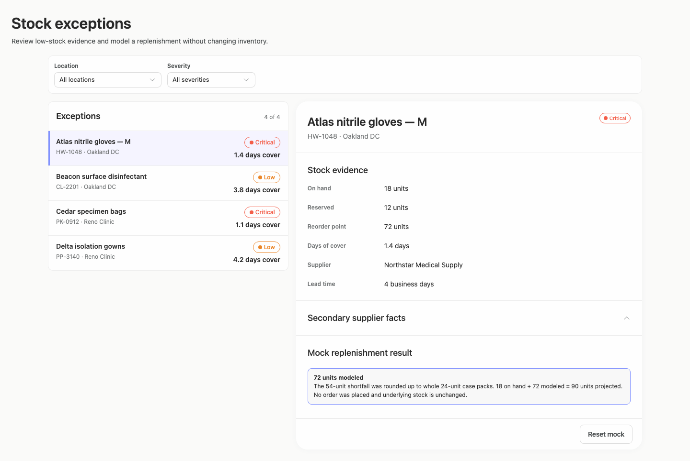

### desktop-2 — Reset mock result

Interaction: passed.

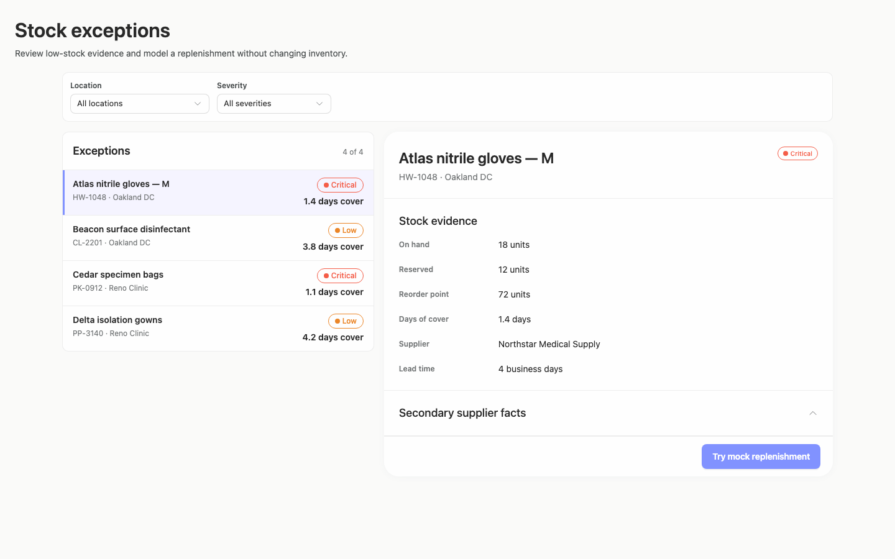

### desktop-3 — Filter and synchronize selection

Interaction: passed.

### desktop-4 — Empty filtered state

Interaction: passed.

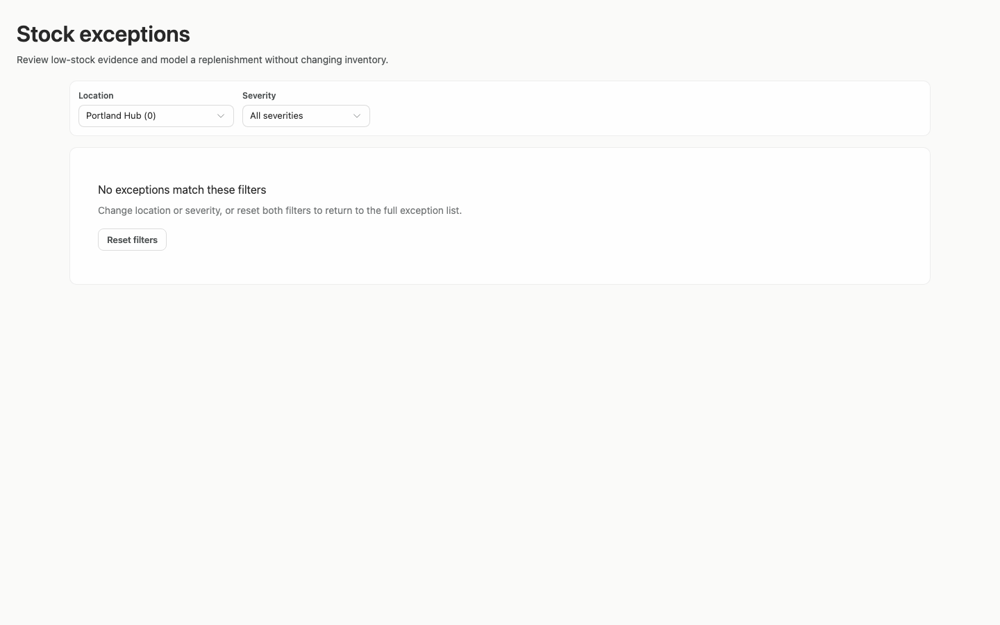

### desktop-5 — Expanded supplier facts

Interaction: failed.

### desktop-wide-0 — initial

Interaction: not-run.

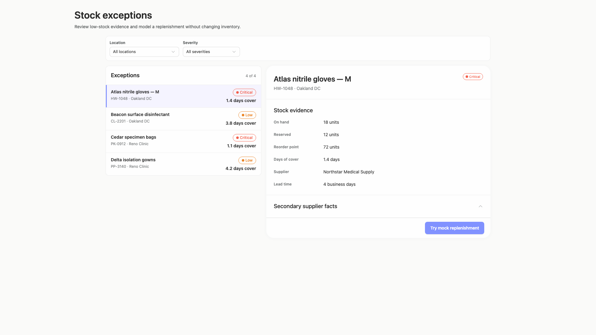

### desktop-wide-1 — Mock replenishment result

Interaction: passed.

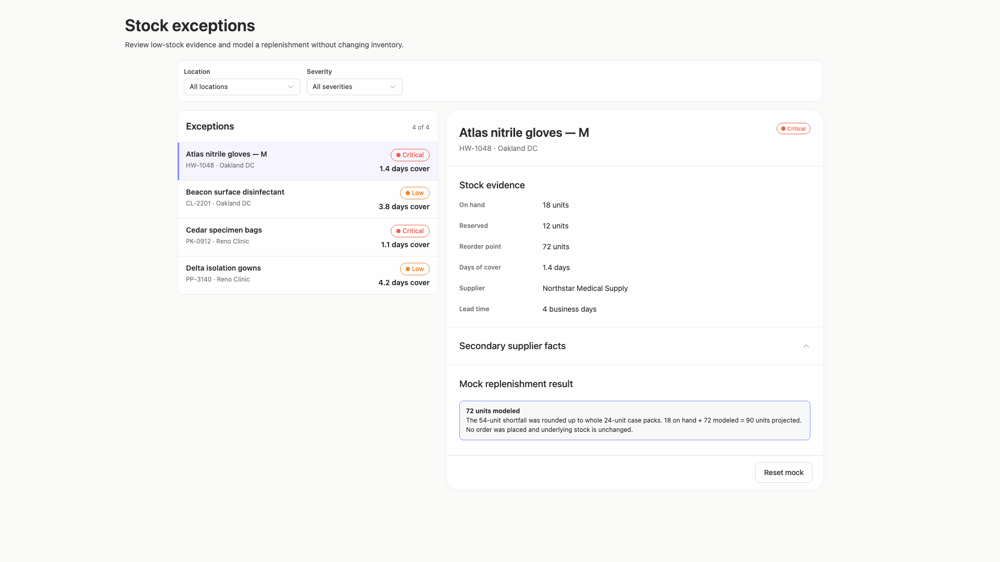

### desktop-wide-2 — Reset mock result

Interaction: passed.

### desktop-wide-3 — Filter and synchronize selection

Interaction: passed.

### desktop-wide-4 — Empty filtered state

Interaction: passed.

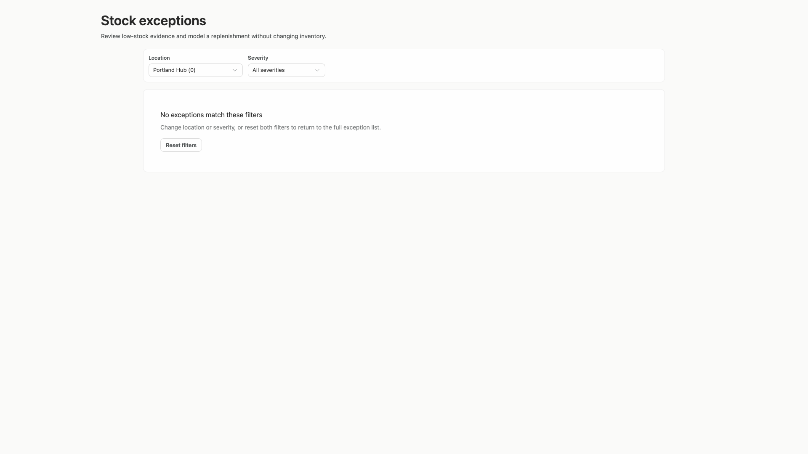

### desktop-wide-5 — Expanded supplier facts

Interaction: failed.

### desktop-window-0 — initial

Interaction: not-run.

### desktop-window-1 — Mock replenishment result

Interaction: passed.

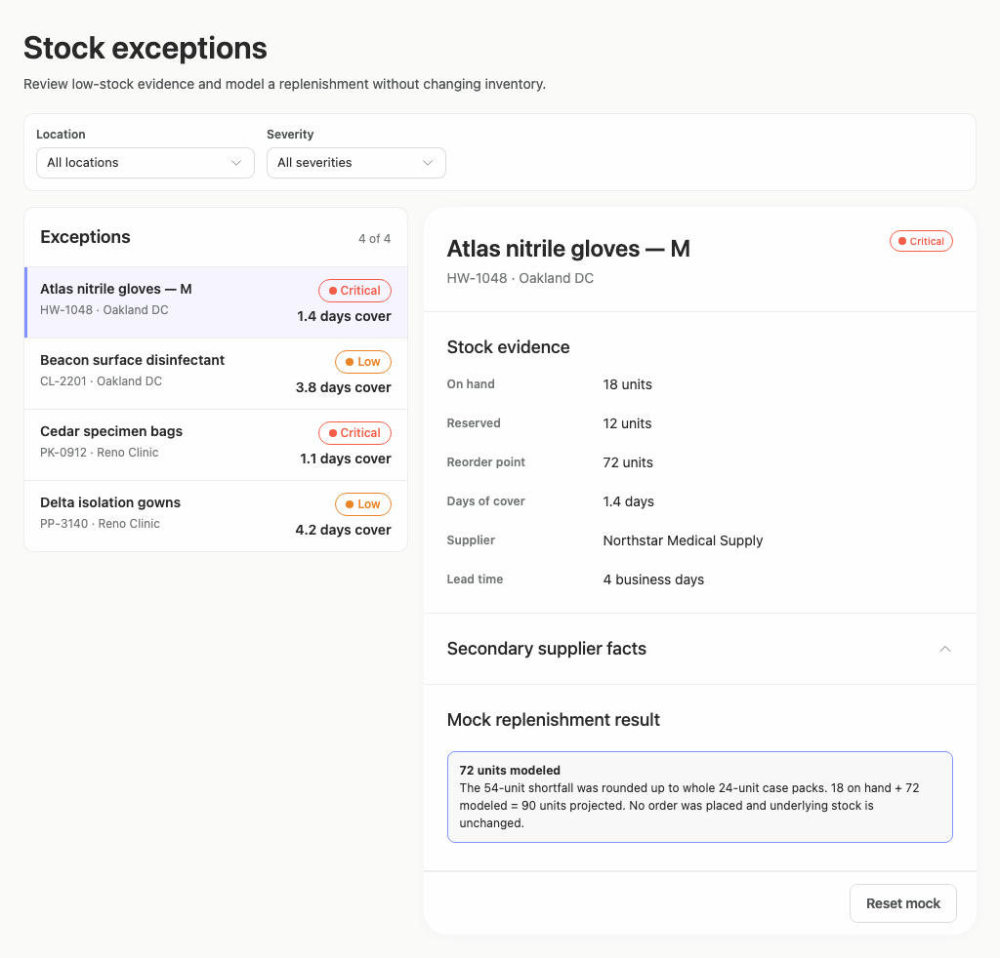

### desktop-window-2 — Reset mock result

Interaction: passed.

### desktop-window-3 — Filter and synchronize selection

Interaction: passed.

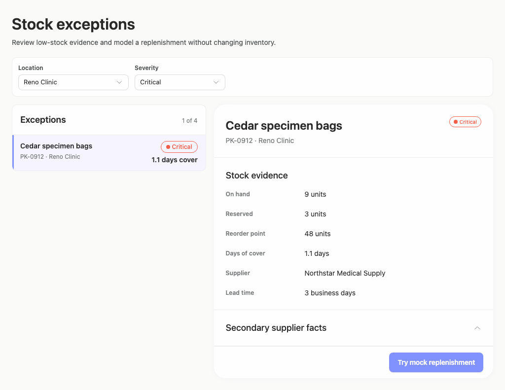

### desktop-window-4 — Empty filtered state

Interaction: passed.

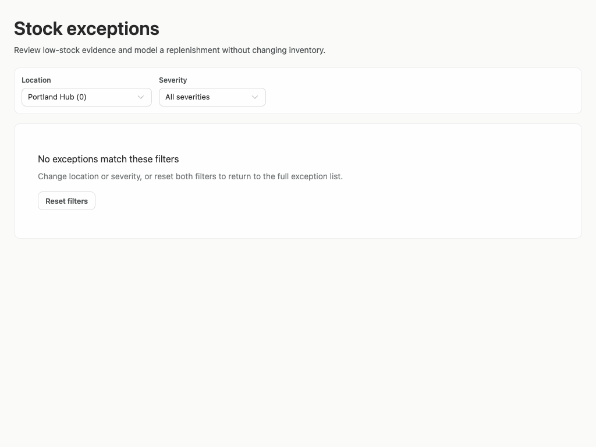

### desktop-window-5 — Expanded supplier facts

Interaction: failed.

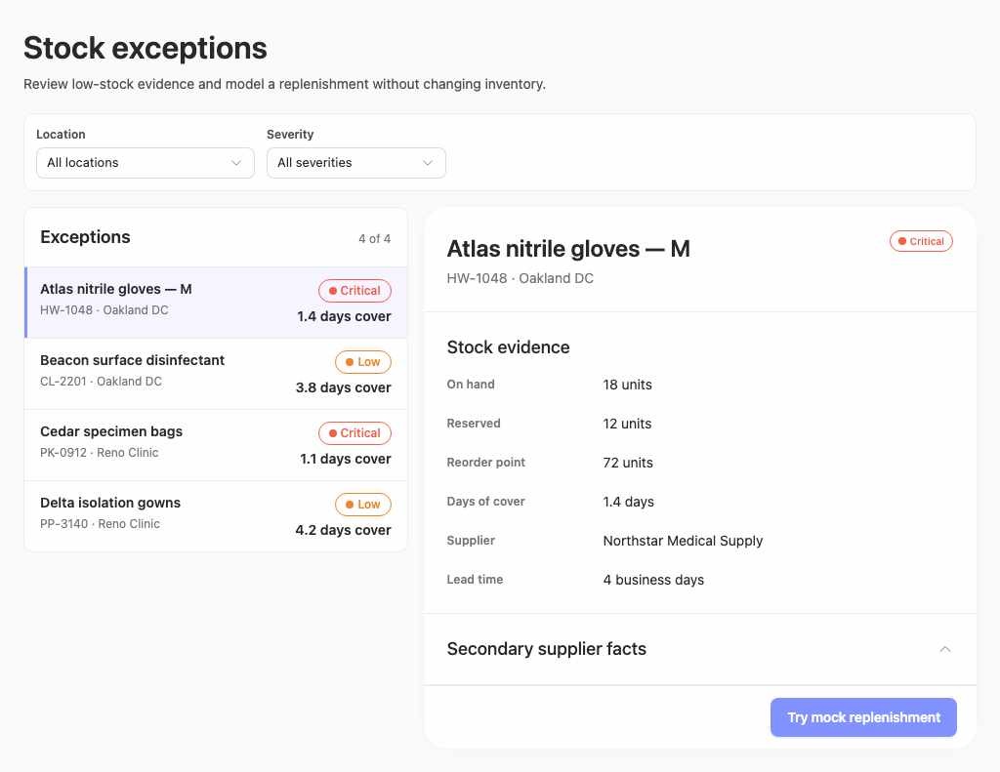

### desktop-custom-700x900-0 — initial

Interaction: not-run.

### desktop-custom-700x900-1 — Mock replenishment result

Interaction: passed.

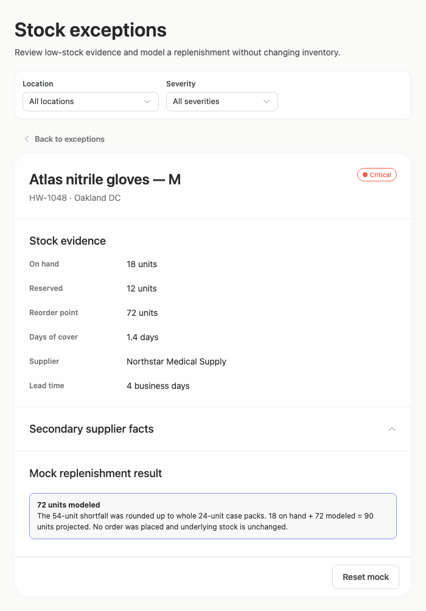

### desktop-custom-700x900-2 — Reset mock result

Interaction: passed.

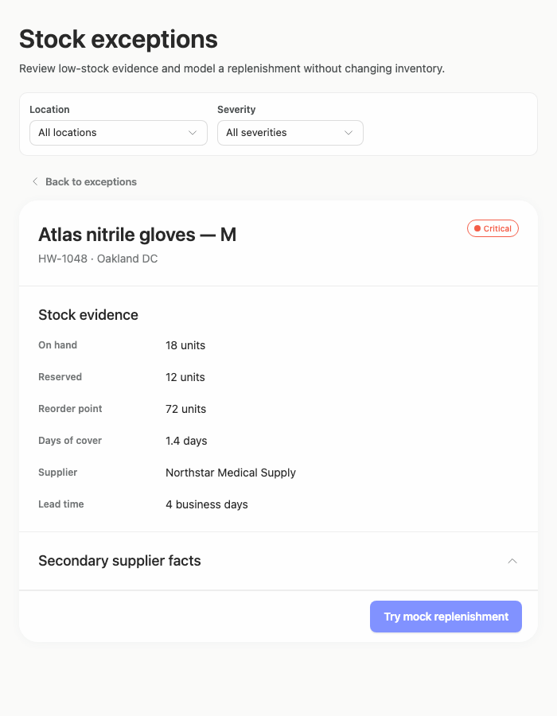

### desktop-custom-700x900-3 — Filter and synchronize selection

Interaction: passed.

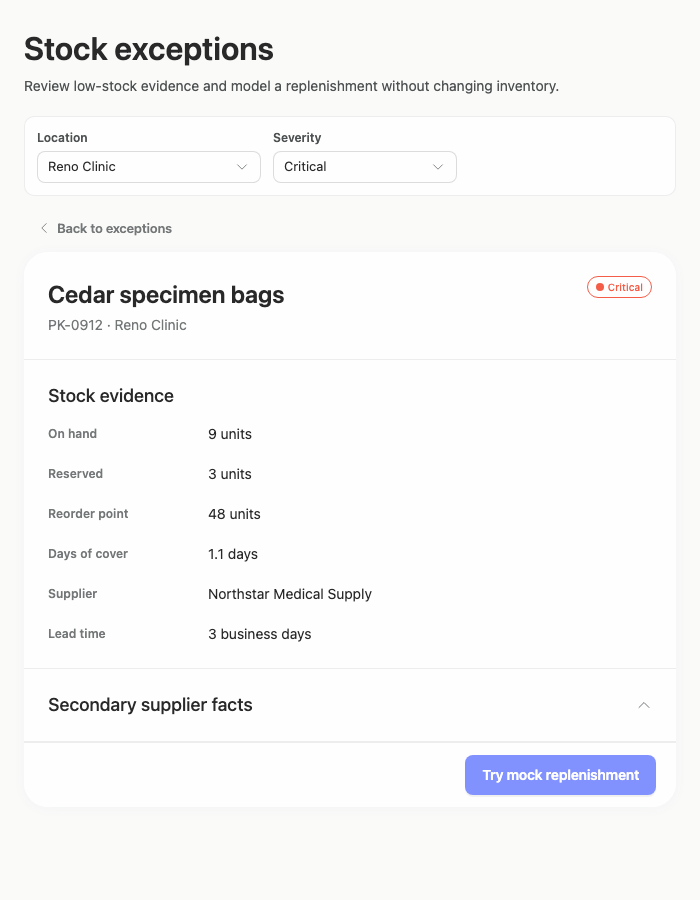

### desktop-custom-700x900-4 — Empty filtered state

Interaction: passed.

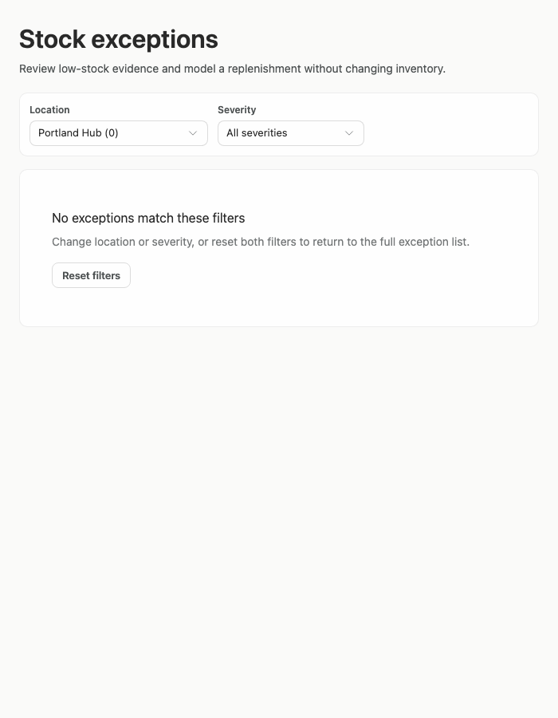

### desktop-custom-700x900-5 — Expanded supplier facts

Interaction: failed.

## Limitations

- Only supplied screenshots and named interaction results were assessed; keyboard behavior, focus states, dropdown menus, loading states, and additional data volumes were not observed.
- The supplier-facts interaction failed in every supplied width, but the underlying cause and any intended hidden content cannot be determined from screenshots.
- No implementation-plan artifact was supplied, so its completeness and suitability could not be evaluated.
- The narrowest supplied desktop panel is 700 px; behavior at other resized panel widths remains uncertain.
- Static source and adherence evidence do not prove that every dynamic branch or component rendered, and styling provenance coverage was very limited.
