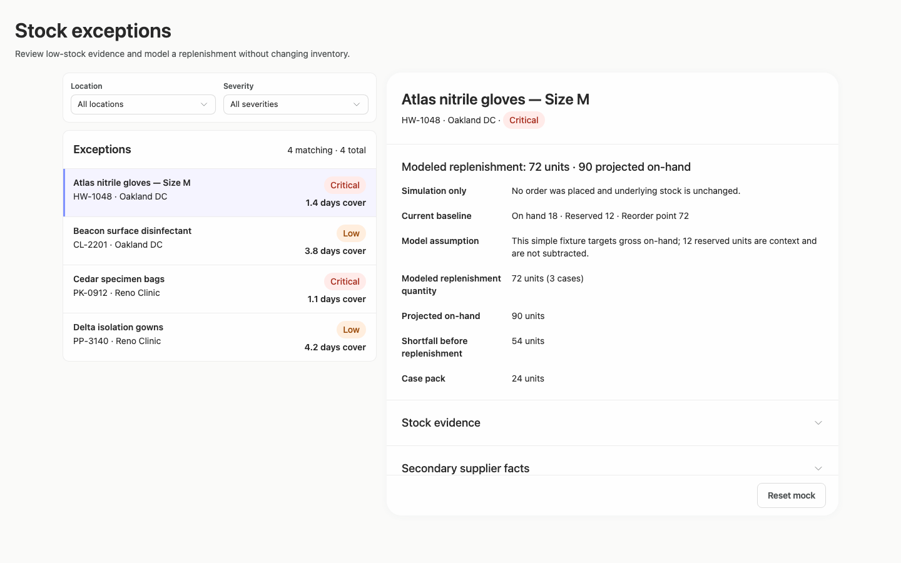
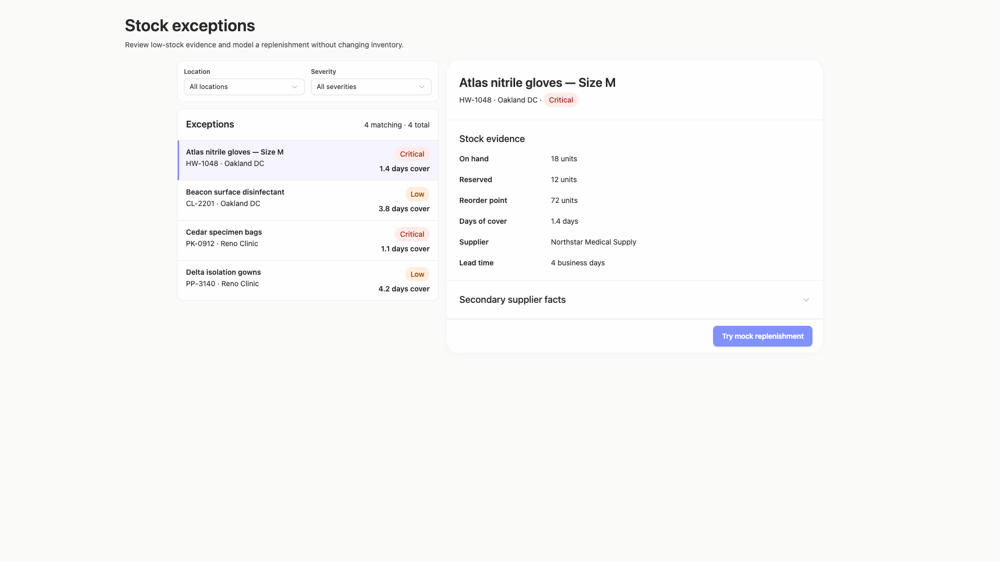

# stock-exceptions-disclosure-reveal — 2026-09-09T06:53:41.948Z

[All reports](../../README.md) · [Interactive HTML report](index.html) · [Full measurements and scoring](report.json)

GitHub renders this summary and the screenshots. Download or clone this folder to open the HTML report locally; GitHub does not serve it as a website.

**Subjective design score:** 85/100. Model: openai/gpt-5.6-sol. Rubric: 2.

**Arrusted adherence:** 100/100 (partial); evidence coverage 1.37%. Evaluator 3.

| Dimension | Conforming | Nonconforming | Unassessed | Adherence    |
| --------- | ---------- | ------------- | ---------- | ------------ |
| component | 18         | 0             | 2          | 100% (18/18) |
| api       | 41         | 0             | 13         | 100% (41/41) |
| styling   | 13         | 0             | 5181       | 100% (13/13) |

Scores from different evaluator versions or captured states are not directly comparable.

This report evaluates the captured preview; evaluation itself does not regenerate the app or prove a built backend. Scores are advisory and not human-calibrated.

## Ratings

| Dimension      | Score | Reason                                                                                                                                                                                                                                                                                                                                                                                                            |
| -------------- | ----- | ----------------------------------------------------------------------------------------------------------------------------------------------------------------------------------------------------------------------------------------------------------------------------------------------------------------------------------------------------------------------------------------------------------------- |
| hierarchy      | 4/4   | The page establishes a clear sequence from title and purpose, through location/severity filters and exception selection, to detailed evidence and the replenishment action. Selected-row treatment, severity pills, section headings, and the modeled-result heading make priorities easy to scan.                                                                                                                |
| layout         | 3/4   | The list-detail composition is consistently aligned with comfortable row density and useful label/value columns. It remains orderly from 1024 to 1920px, although the fixed-width workspace leaves substantial unused space on wide windows, and the 1024px modeled-result panel requires scrolling with its last row partly hidden behind the footer at the captured position.                                   |
| typography     | 3/4   | Heading levels, bold field labels, metadata, and numeric values are visually consistent and readable, including wrapped labels in the modeled result. The primary action label has a reported contrast advisory in several captures, but the surrounding dark text and established Arrusted hierarchy remain clear.                                                                                               |
| responsive     | 4/4   | The composition adapts effectively across the supplied desktop widths: wide and medium windows retain the two-panel review flow, while the 700px panel switches to a focused detail view with an explicit Back to exceptions control. No horizontal overflow is shown, actions remain available, and vertical scrolling is introduced only for taller detail states.                                              |
| productClarity | 3/4   | The task is immediately understandable from the subtitle, filters, selected exception, stock/supplier evidence, and clearly labeled mock action. The result explicitly states that no order was placed and shows baseline, assumptions, quantity, and projection. Before activation, however, the proposed 72-unit/3-case model is not disclosed, making the one-click outcome less predictable than it could be. |

## Strengths

- Location and severity filters are placed directly above the exception list and include a clear matching-result count.
- Each exception exposes product identity, location, severity, and days of cover in a compact, scannable row.
- The selected record is unmistakable through both background treatment and a leading accent.
- Stock evidence and supplier facts are grouped logically, with secondary details available through disclosure rather than competing with primary evidence.
- The modeled result clearly distinguishes simulation from a real order and confirms that underlying inventory is unchanged.
- The constrained 700px desktop-panel mode preserves context and navigation instead of compressing the list and detail into unusable columns.
- Reset interaction is visibly differentiated from the primary mock action, and the supplied tested result/reset states passed their expected text checks.

## Improvements

- **medium — desktop-custom-700x900-0:** The action communicates that replenishment is a mock, but it does not disclose the modeled quantity or case count until after activation. Users therefore cannot anticipate what scenario the button will run. Add concise supporting text in the action footer, such as “Models 72 units (3 cases); no order will be placed,” using the existing Typography component while retaining the standard primary Button.
- **low — desktop-window-1:** At 1024×768, the modeled-result body scrolls beneath a persistent footer, and the “Case pack” row is partly clipped at the captured position. The footer action remains available, but the transition between scrollable evidence and fixed action area is easy to miss. Provide sufficient bottom inset in the scrollable detail body so the final evidence row can move fully above the footer, and use the existing divider treatment to make the fixed footer boundary more apparent.
- **low — desktop-wide-0:** The centered, capped workspace maintains readable line lengths but uses only a modest portion of the 1920px window, leaving considerable surrounding space while both list and evidence columns remain relatively narrow. At wider desktop windows, allow a modest increase in the list-detail container and column widths while preserving readable text measures and the same Arrusted components.

## Token evidence

Percentages cover only assessed properties. Missing provenance and ambiguous CSS remain unassessed; matching literals are not proof of token usage.

| Viewport                 | Category   | Token references / assessed | Coverage   |
| ------------------------ | ---------- | --------------------------- | ---------- |
| desktop-0                | color      | 0/0                         | 0% (0/233) |
| desktop-0                | typography | 0/0                         | 0% (0/526) |
| desktop-0                | spacing    | 0/0                         | 0% (0/275) |
| desktop-0                | radius     | 0/0                         | 0% (0/116) |
| desktop-0                | border     | 0/0                         | 0% (0/125) |
| desktop-0                | shadow     | 0/0                         | 0% (0/120) |
| desktop-wide-0           | color      | 0/0                         | 0% (0/233) |
| desktop-wide-0           | typography | 0/0                         | 0% (0/526) |
| desktop-wide-0           | spacing    | 0/0                         | 0% (0/275) |
| desktop-wide-0           | radius     | 0/0                         | 0% (0/116) |
| desktop-wide-0           | border     | 0/0                         | 0% (0/125) |
| desktop-wide-0           | shadow     | 0/0                         | 0% (0/120) |
| desktop-window-0         | color      | 0/0                         | 0% (0/233) |
| desktop-window-0         | typography | 0/0                         | 0% (0/526) |
| desktop-window-0         | spacing    | 0/0                         | 0% (0/275) |
| desktop-window-0         | radius     | 0/0                         | 0% (0/116) |
| desktop-window-0         | border     | 0/0                         | 0% (0/125) |
| desktop-window-0         | shadow     | 0/0                         | 0% (0/120) |
| desktop-custom-700x900-0 | color      | 0/0                         | 0% (0/161) |
| desktop-custom-700x900-0 | typography | 0/0                         | 0% (0/405) |
| desktop-custom-700x900-0 | spacing    | 0/0                         | 0% (0/184) |
| desktop-custom-700x900-0 | radius     | 0/0                         | 0% (0/81)  |
| desktop-custom-700x900-0 | border     | 0/0                         | 0% (0/84)  |
| desktop-custom-700x900-0 | shadow     | 0/0                         | 0% (0/81)  |

## Latest-run screenshots

### desktop-0 — initial

Interaction: not-run.

### desktop-1 — Mock replenishment result

Interaction: passed.

### desktop-2 — Reset from result footer

Interaction: passed.

### desktop-3 — Expanded supplier facts

Interaction: passed.

### desktop-wide-0 — initial

Interaction: not-run.

### desktop-wide-1 — Mock replenishment result

Interaction: passed.

### desktop-wide-2 — Reset from result footer

Interaction: passed.

### desktop-wide-3 — Expanded supplier facts

Interaction: passed.

### desktop-window-0 — initial

Interaction: not-run.

### desktop-window-1 — Mock replenishment result

Interaction: passed.

### desktop-window-2 — Reset from result footer

Interaction: passed.

### desktop-window-3 — Expanded supplier facts

Interaction: passed.

### desktop-custom-700x900-0 — initial

Interaction: not-run.

### desktop-custom-700x900-1 — Mock replenishment result

Interaction: passed.

### desktop-custom-700x900-2 — Reset from result footer

Interaction: passed.

### desktop-custom-700x900-3 — Expanded supplier facts

Interaction: passed.

## Limitations

- No captures show open filter menus, filtered result sets, empty states, selection of another exception, or the destination reached by Back to exceptions, so those states were not evaluated.
- Initial-state interactions were not run in several captures; only the supplied mock-result, reset, and supplier-disclosure checks provide interaction evidence.
- The screenshots do not expose the requested implementation plan, so its completeness and suitability cannot be assessed.
- Rendered screenshots and static source findings do not establish backend behavior, persistence, action authorization, or complete component provenance.
- The styling-adherence evidence has very low assessed coverage and is conservative; no overall token-adherence conclusion is inferred from it.
