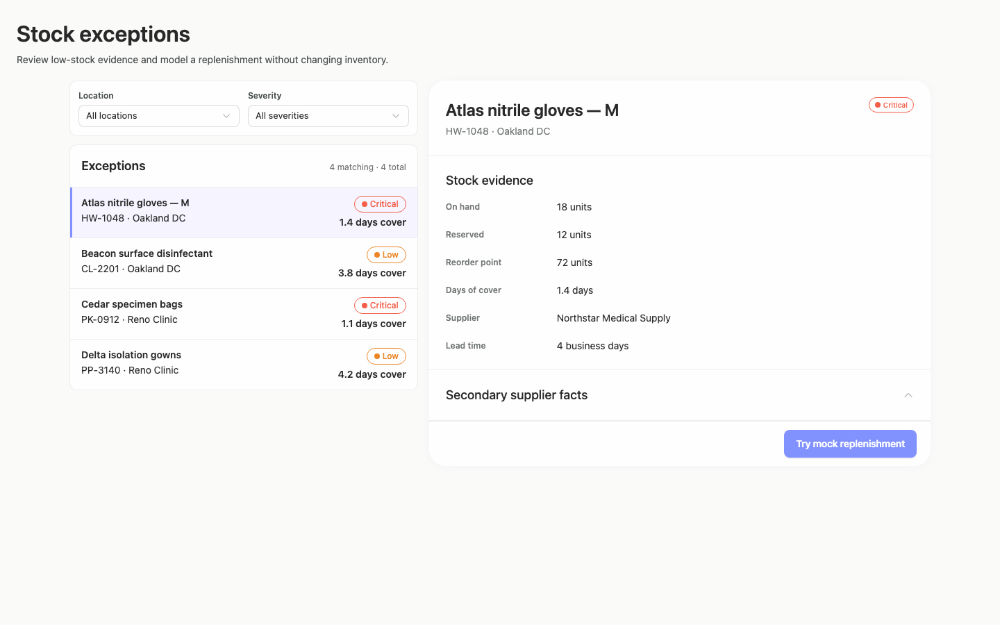
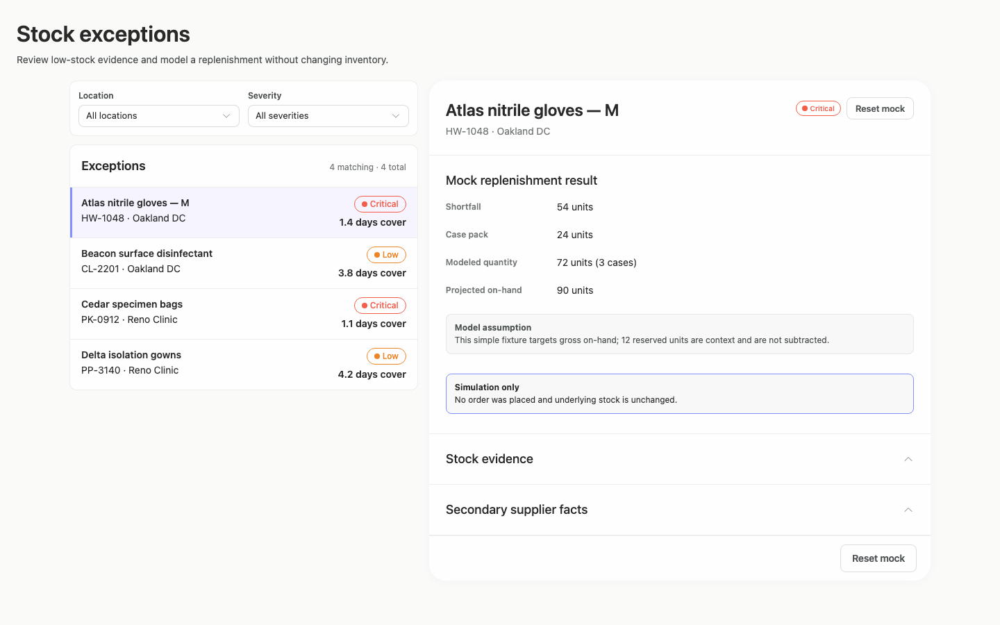
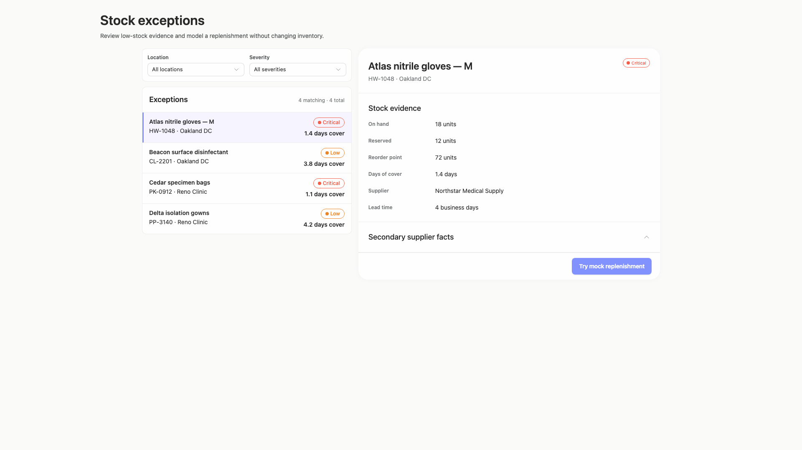
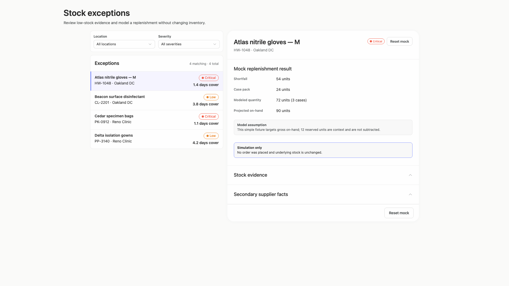
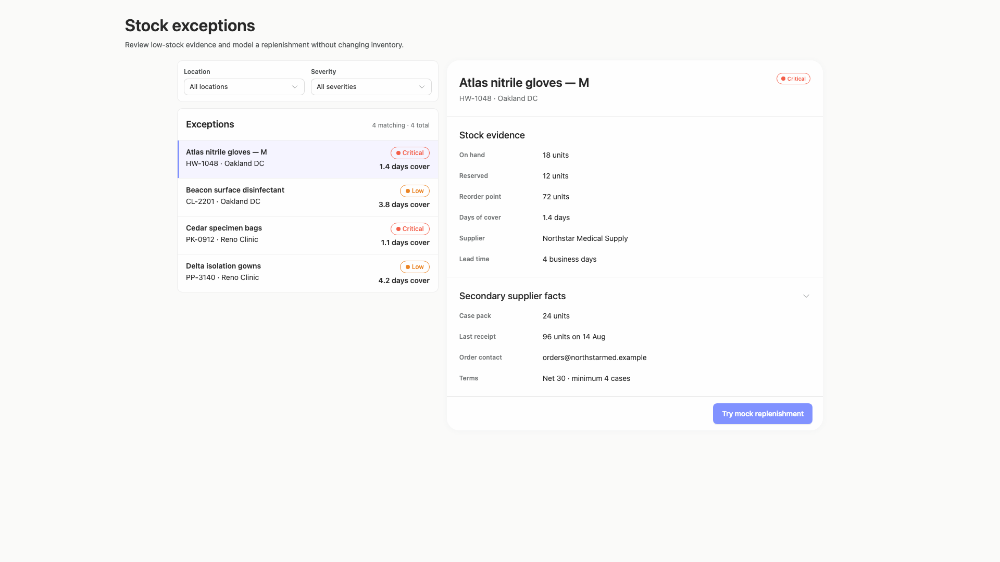
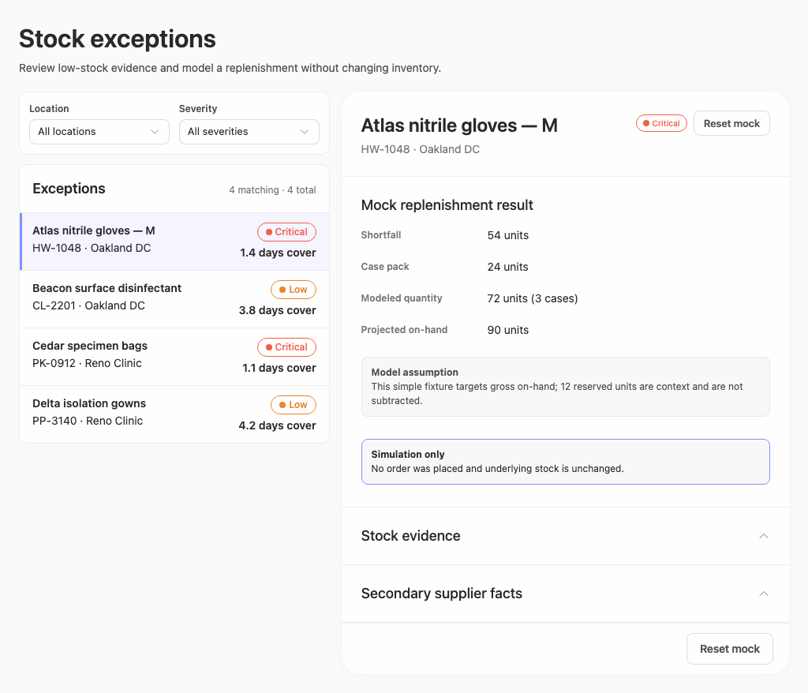
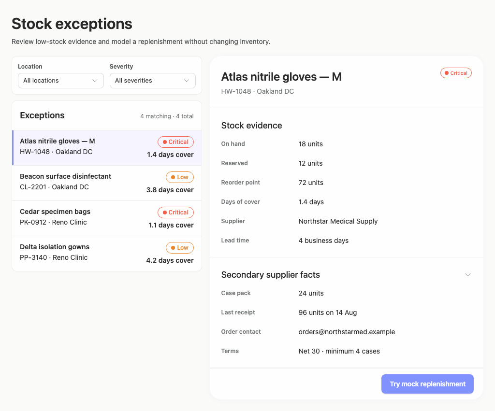
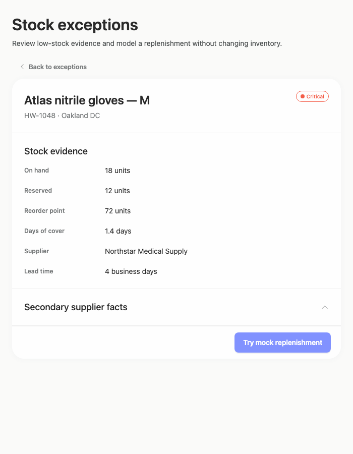
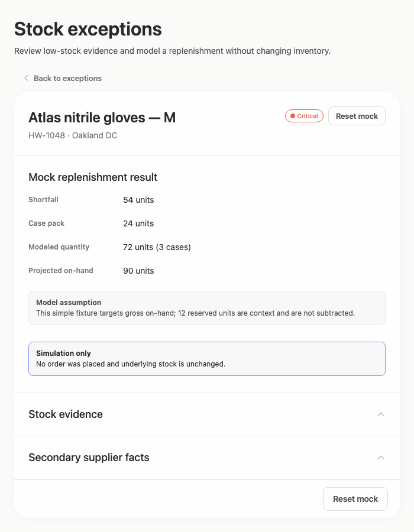
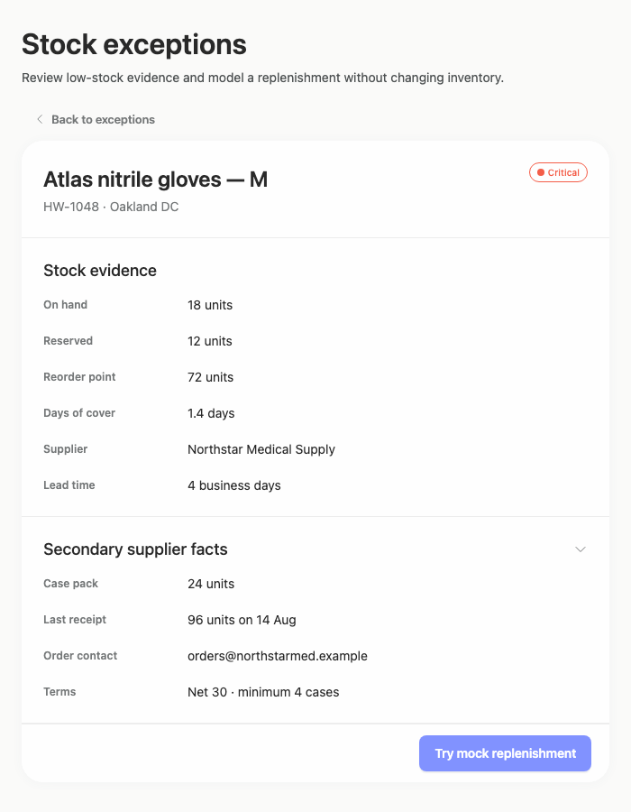

# stock-exceptions-filter-fit — 2026-09-09T05:28:22.104Z

[All reports](../../README.md) · [Interactive HTML report](index.html) · [Full measurements and scoring](report.json)

GitHub renders this summary and the screenshots. Download or clone this folder to open the HTML report locally; GitHub does not serve it as a website.

**Subjective design score:** 85/100. Model: openai/gpt-5.6-sol. Rubric: 2.

**Arrusted adherence:** 100/100 (partial); evidence coverage 1.18%. Evaluator 3.

| Dimension | Conforming | Nonconforming | Unassessed | Adherence    |
| --------- | ---------- | ------------- | ---------- | ------------ |
| component | 15         | 0             | 2          | 100% (15/15) |
| api       | 34         | 0             | 14         | 100% (34/34) |
| styling   | 13         | 0             | 5166       | 100% (13/13) |

Scores from different evaluator versions or captured states are not directly comparable.

This report evaluates the captured preview; evaluation itself does not regenerate the app or prove a built backend. Scores are advisory and not human-calibrated.

## Ratings

| Dimension | Score | Reason |
| --- | --- | --- |
| hierarchy | 3/4 | The page title, filters, exception list, selected-item header, evidence, supplier disclosure, and replenishment action form a clear review sequence. Selection highlighting and severity pills aid scanning, but the mock result presents its most important outputs with nearly equal emphasis, and duplicated Reset actions compete for priority. |
| layout | 3/4 | The two-column list-detail composition is consistently aligned and comfortably spaced at 1024, 1440, and 1920 widths. Detail fields use stable label/value columns, while expanded and result states remain orderly. The layout is somewhat sparse on wide screens and the duplicated header/footer reset placement adds unnecessary action density. |
| typography | 3/4 | Titles, section headings, product names, metadata, and field values use a consistent typographic hierarchy and remain readable across captures. Some 10–12 px status, caption, and field-label text is visually faint; automated evidence also reports marginal or insufficient contrast for these small labels and pills. |
| responsive | 4/4 | The composition adapts well across the supplied 700, 1024, 1440, and 1920 pixel desktop windows. It preserves the wide list-detail view where practical, switches to a focused detail view with a clear Back to exceptions control at 700 px, and allows natural document growth for expanded and result states without horizontal clipping. |
| productClarity | 4/4 | The task is explicit: filter stock exceptions, select a product, review stock and supplier evidence, and try a mock replenishment. Days of cover and severity support prioritization, while the result clearly states that no order was placed and stock remains unchanged. Reset and supplier disclosure affordances are understandable. |

## Strengths

- Strong master-detail workflow connects exception selection directly to stock and supplier evidence.
- Location and severity filters are placed before the exception list and accompanied by a visible matching count.
- Selected-row treatment, product identity, severity, and days of cover provide useful review context.
- The mock result explains its assumption and explicitly distinguishes simulation from a real inventory-changing action.
- Secondary supplier facts are progressively disclosed, keeping the initial detail panel focused.
- The constrained 700 px desktop composition replaces the split view with focused detail and a clear route back rather than compressing both panels.
- Expanded supplier and replenishment-result states remain coherent across all supplied window sizes.

## Improvements

- **medium — desktop-1:** Shortfall, case pack, modeled quantity, and projected on-hand receive nearly identical visual treatment, so the modeled outcome is slower to identify than it should be in the primary result state. Lead with modeled quantity and projected on-hand as the result summary, using a supported KPI composition or stronger Typography hierarchy, then place shortfall, case pack, and the assumption beneath as supporting evidence.
- **low — desktop-1:** Reset mock appears in both the record header and footer while both controls are visible on the same screen, creating redundant action emphasis and weakening the single primary path. Keep one Reset mock action in a consistent location—preferably the result footer—and omit the duplicate header action when the footer action is visible.
- **medium — desktop-0:** Severity pills and supporting row metadata are small, and automated evidence reports insufficient contrast for several 12 px status labels. This makes rapid severity comparison less reliable even though the words Critical and Low are present. Retain the authoritative palette and StatusPill components, but reinforce severity with supported Typography at a larger size or weight adjacent to days of cover; do not rely on the small pill treatment alone.
- **low — desktop-custom-700x900-1:** The constrained result view also shows Reset mock in both the header and footer, adding repetition to an otherwise focused single-panel composition. Use only the footer reset in this constrained composition, leaving the header dedicated to product identity and severity.

## Token evidence

Percentages cover only assessed properties. Missing provenance and ambiguous CSS remain unassessed; matching literals are not proof of token usage.

| Viewport | Category | Token references / assessed | Coverage |
| --- | --- | --- | --- |
| desktop-0 | color | 0/0 | 0% (0/228) |
| desktop-0 | typography | 0/0 | 0% (0/518) |
| desktop-0 | spacing | 0/0 | 0% (0/274) |
| desktop-0 | radius | 0/0 | 0% (0/116) |
| desktop-0 | border | 0/0 | 0% (0/130) |
| desktop-0 | shadow | 0/0 | 0% (0/120) |
| desktop-wide-0 | color | 0/0 | 0% (0/228) |
| desktop-wide-0 | typography | 0/0 | 0% (0/518) |
| desktop-wide-0 | spacing | 0/0 | 0% (0/274) |
| desktop-wide-0 | radius | 0/0 | 0% (0/116) |
| desktop-wide-0 | border | 0/0 | 0% (0/130) |
| desktop-wide-0 | shadow | 0/0 | 0% (0/120) |
| desktop-window-0 | color | 0/0 | 0% (0/228) |
| desktop-window-0 | typography | 0/0 | 0% (0/518) |
| desktop-window-0 | spacing | 0/0 | 0% (0/274) |
| desktop-window-0 | radius | 0/0 | 0% (0/116) |
| desktop-window-0 | border | 0/0 | 0% (0/130) |
| desktop-window-0 | shadow | 0/0 | 0% (0/120) |
| desktop-custom-700x900-0 | color | 0/0 | 0% (0/162) |
| desktop-custom-700x900-0 | typography | 0/0 | 0% (0/410) |
| desktop-custom-700x900-0 | spacing | 0/0 | 0% (0/186) |
| desktop-custom-700x900-0 | radius | 0/0 | 0% (0/82) |
| desktop-custom-700x900-0 | border | 0/0 | 0% (0/86) |
| desktop-custom-700x900-0 | shadow | 0/0 | 0% (0/82) |

## Latest-run screenshots

### desktop-0 — initial

Interaction: not-run.

### desktop-1 — Mock replenishment result

Interaction: passed.

### desktop-2 — Reset from result footer

Interaction: passed.

### desktop-3 — Expanded supplier facts

Interaction: passed.

### desktop-wide-0 — initial

Interaction: not-run.

### desktop-wide-1 — Mock replenishment result

Interaction: passed.

### desktop-wide-2 — Reset from result footer

Interaction: passed.

### desktop-wide-3 — Expanded supplier facts

Interaction: passed.

### desktop-window-0 — initial

Interaction: not-run.

### desktop-window-1 — Mock replenishment result

Interaction: passed.

### desktop-window-2 — Reset from result footer

Interaction: passed.

### desktop-window-3 — Expanded supplier facts

Interaction: passed.

### desktop-custom-700x900-0 — initial

Interaction: not-run.

### desktop-custom-700x900-1 — Mock replenishment result

Interaction: passed.

### desktop-custom-700x900-2 — Reset from result footer

Interaction: passed.

### desktop-custom-700x900-3 — Expanded supplier facts

Interaction: passed.

## Limitations

- No implementation-plan artifact was supplied, so its completeness, sequencing, and stop-before-build scope cannot be assessed.
- Filter changes and selection of products other than the initially selected Atlas item were not demonstrated in the supplied states.
- The 700 px captures show the detail route but not the resulting list/filter view after activating Back to exceptions.
- Screenshots and interaction evidence cannot establish persistence, authorization, backend behavior, or publication status.
- Styling provenance is largely unassessed in the supplied adherence evidence; palette and public-component implementation compliance are therefore not inferred from appearance alone.
