# stock-exceptions-focused-context — 2026-09-09T11:04:34.428Z

[All reports](../../README.md) · [Interactive HTML report](index.html) · [Full measurements and scoring](report.json)

GitHub renders this summary and the screenshots. Download or clone this folder to open the HTML report locally; GitHub does not serve it as a website.

**Subjective design score:** 90/100. Model: openai/gpt-5.6-sol. Rubric: 2.

**Arrusted adherence:** 100/100 (partial); evidence coverage 1.77%. Evaluator 3.

| Dimension | Conforming | Nonconforming | Unassessed | Adherence    |
| --------- | ---------- | ------------- | ---------- | ------------ |
| component | 22         | 0             | 3          | 100% (22/22) |
| api       | 56         | 0             | 11         | 100% (56/56) |
| styling   | 12         | 0             | 4991       | 100% (12/12) |

Scores from different evaluator versions or captured states are not directly comparable.

This report evaluates the captured preview; evaluation itself does not regenerate the app or prove a built backend. Scores are advisory and not human-calibrated.

## Ratings

| Dimension      | Score | Reason                                                                                                                                                                                                                                                                                                                                                                                     |
| -------------- | ----- | ------------------------------------------------------------------------------------------------------------------------------------------------------------------------------------------------------------------------------------------------------------------------------------------------------------------------------------------------------------------------------------------ |
| hierarchy      | 3/4   | The page title, filters, exception list, selected record, and primary mock action form a clear top-to-bottom hierarchy. Selected-row highlighting and prominent modeled quantities aid scanning, though the completed simulation state is visually close to its confirmation state and constrained detail views lose the persistent page-level task heading.                               |
| layout         | 4/4   | The master-detail composition is consistently aligned and comfortably spaced at 1024, 1440, and 1920 widths. The centered maximum-width treatment avoids overextending content on wide screens, while cards, dividers, definition rows, and action placement remain orderly.                                                                                                               |
| typography     | 4/4   | Headings, labels, values, metadata, and explanatory copy use a consistent and readable type hierarchy. Large quantity figures are especially effective in the replenishment review, while bold product names and days-of-cover values make list rows easy to compare.                                                                                                                      |
| responsive     | 3/4   | The interface transitions successfully from a two-pane workspace at 1024–1920 pixels to list-first and detail-only views at 700 pixels, with a visible Back control and usable wrapping action rows. Normal page scrolling accommodates the longer modeled state, but the narrow detail view no longer displays the broader Stock exceptions task heading, slightly weakening orientation. |
| productClarity | 4/4   | The workflow directly supports location and severity filtering, exception selection, stock and supplier review, and a reversible mock replenishment. Labels such as “Simulation only,” the case-rounding rationale, projected on-hand, and “No order was placed” clearly distinguish modeling from a real inventory change.                                                                |

## Strengths

- Exception rows combine product identity, location, shortage, severity, and days of cover in a compact, highly scannable format.
- The selected record is communicated through both a tinted row and a leading accent, while its identity is repeated in the detail panel.
- The modeled quantity is transparently explained through current stock, case rounding, supplier minimum, and projected stock rather than appearing as an unexplained recommendation.
- The constrained 700-pixel composition appropriately defers detail until a record is opened and provides a clear route back to the exception list.
- Supplier information is progressively disclosed, keeping primary stock evidence concise while still making terms and contact details available.
- The screenshots consistently preserve the supplied neutral, blue, red, and orange Arrusted visual palette without introducing competing visual treatments.

## Improvements

- **low — desktop-2:** After confirmation, the body remains nearly identical to the pre-confirmation review. The changed heading, past-tense sentence, and Reset button communicate the result, but the completed mock state is not especially prominent during a quick scan. Add a supported StatusPill or Tag such as “Mock completed” near the modeled-replenishment heading, while retaining the existing sentence that confirms no order or stock change occurred.
- **low — desktop-custom-700x900-1:** The constrained detail view replaces the page-level “Stock exceptions” context with only a Back control and the record title. Navigation remains understandable, but users arriving directly at this state have less immediate context about the broader task. Retain compact task context in the detail composition, for example a small “Stock exceptions” eyebrow above the record identity or a concise contextual label beside the Back action.
- **low — desktop-1:** The replenishment rationale is presented as a long single-column sequence despite ample panel width. It is readable, but slower to compare than the quantity cards above and contributes to a taller document. On roomy detail panels, arrange the short rationale facts in a two-column read-only definition layout, keeping “Simulation only” and the longer model assumption full width; preserve the current stacked treatment for constrained panels.

## Token evidence

Percentages cover only assessed properties. Missing provenance and ambiguous CSS remain unassessed; matching literals are not proof of token usage.

| Viewport                 | Category   | Token references / assessed | Coverage   |
| ------------------------ | ---------- | --------------------------- | ---------- |
| desktop-0                | color      | 0/0                         | 0% (0/233) |
| desktop-0                | typography | 0/0                         | 0% (0/522) |
| desktop-0                | spacing    | 0/0                         | 0% (0/271) |
| desktop-0                | radius     | 0/0                         | 0% (0/116) |
| desktop-0                | border     | 0/0                         | 0% (0/125) |
| desktop-0                | shadow     | 0/0                         | 0% (0/120) |
| desktop-wide-0           | color      | 0/0                         | 0% (0/233) |
| desktop-wide-0           | typography | 0/0                         | 0% (0/522) |
| desktop-wide-0           | spacing    | 0/0                         | 0% (0/271) |
| desktop-wide-0           | radius     | 0/0                         | 0% (0/116) |
| desktop-wide-0           | border     | 0/0                         | 0% (0/125) |
| desktop-wide-0           | shadow     | 0/0                         | 0% (0/120) |
| desktop-window-0         | color      | 0/0                         | 0% (0/233) |
| desktop-window-0         | typography | 0/0                         | 0% (0/522) |
| desktop-window-0         | spacing    | 0/0                         | 0% (0/271) |
| desktop-window-0         | radius     | 0/0                         | 0% (0/116) |
| desktop-window-0         | border     | 0/0                         | 0% (0/125) |
| desktop-window-0         | shadow     | 0/0                         | 0% (0/120) |
| desktop-custom-700x900-0 | color      | 0/0                         | 0% (0/142) |
| desktop-custom-700x900-0 | typography | 0/0                         | 0% (0/297) |
| desktop-custom-700x900-0 | spacing    | 0/0                         | 0% (0/166) |
| desktop-custom-700x900-0 | radius     | 0/0                         | 0% (0/71)  |
| desktop-custom-700x900-0 | border     | 0/0                         | 0% (0/79)  |
| desktop-custom-700x900-0 | shadow     | 0/0                         | 0% (0/75)  |

## Latest-run screenshots

### desktop-0 — initial

Interaction: not-run.

### desktop-1 — Select record and review modeled quantity

Interaction: passed.

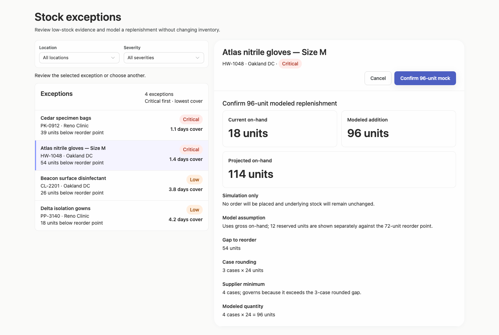

### desktop-2 — Confirm modeled replenishment

Interaction: passed.

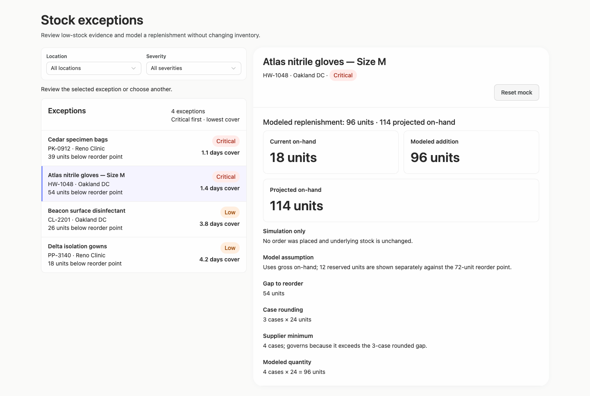

### desktop-3 — Read projected quantity

Interaction: passed.

### desktop-4 — Reset fixture result

Interaction: passed.

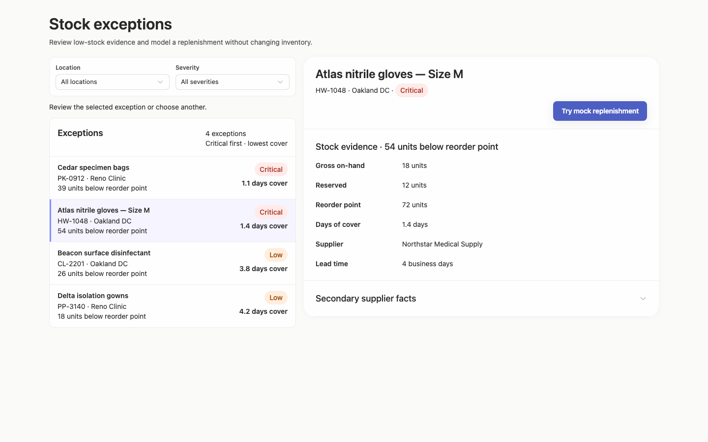

### desktop-5 — Inspect supplier facts

Interaction: passed.

### desktop-wide-0 — initial

Interaction: not-run.

### desktop-wide-1 — Select record and review modeled quantity

Interaction: passed.

### desktop-wide-2 — Confirm modeled replenishment

Interaction: passed.

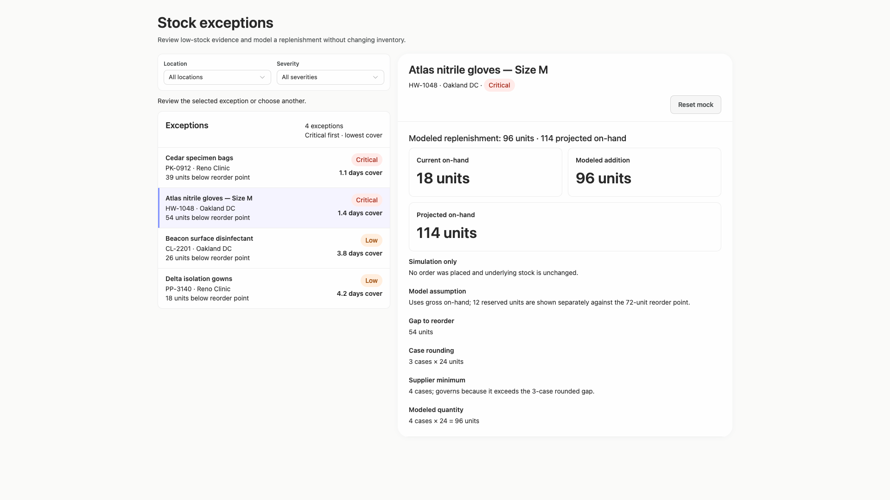

### desktop-wide-3 — Read projected quantity

Interaction: passed.

### desktop-wide-4 — Reset fixture result

Interaction: passed.

### desktop-wide-5 — Inspect supplier facts

Interaction: passed.

### desktop-window-0 — initial

Interaction: not-run.

### desktop-window-1 — Select record and review modeled quantity

Interaction: passed.

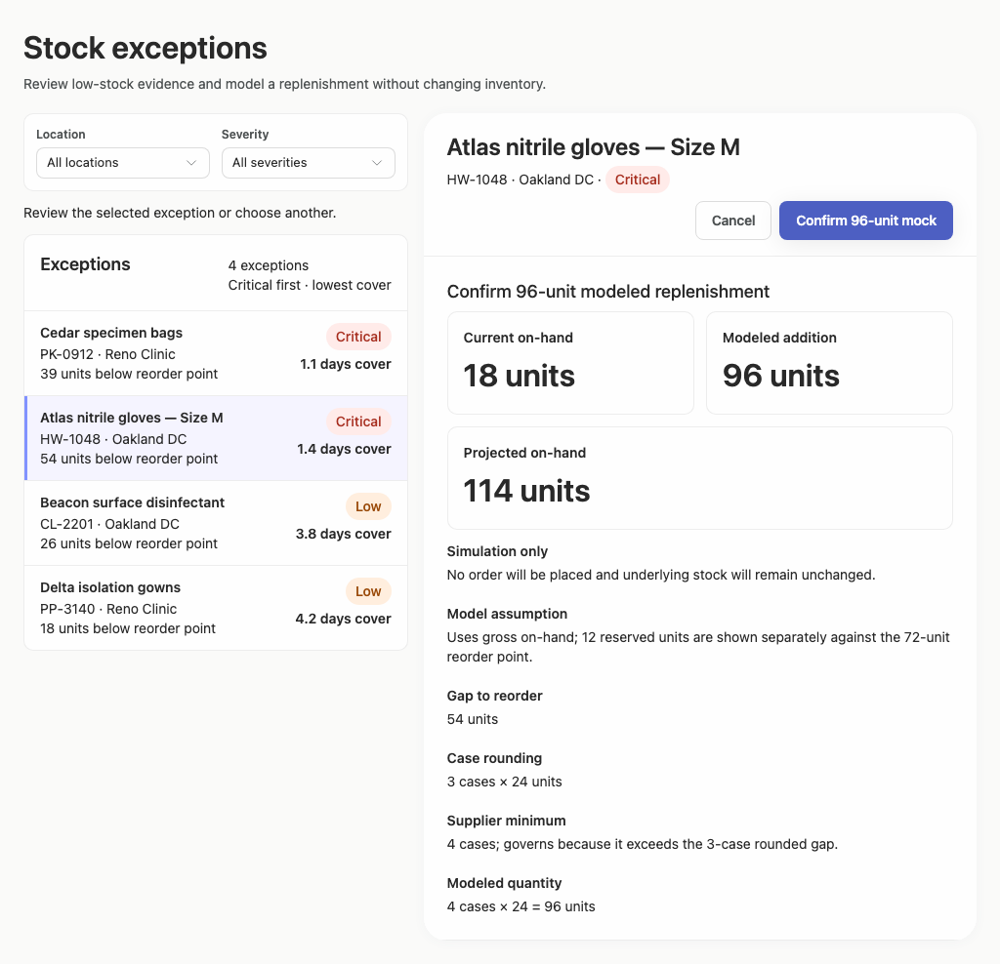

### desktop-window-2 — Confirm modeled replenishment

Interaction: passed.

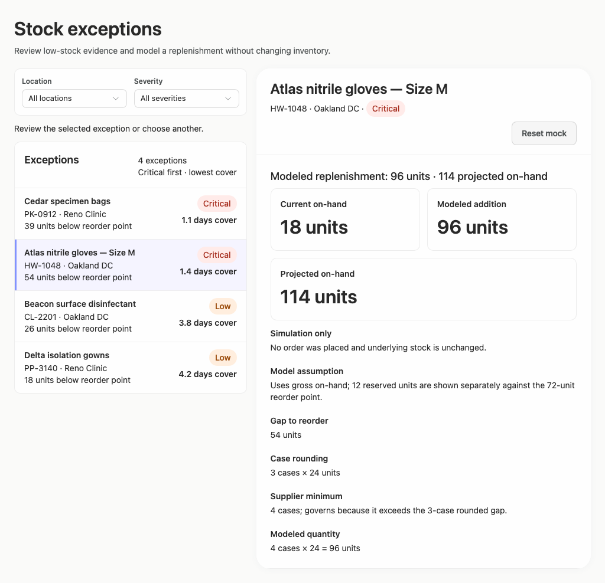

### desktop-window-3 — Read projected quantity

Interaction: passed.

### desktop-window-4 — Reset fixture result

Interaction: passed.

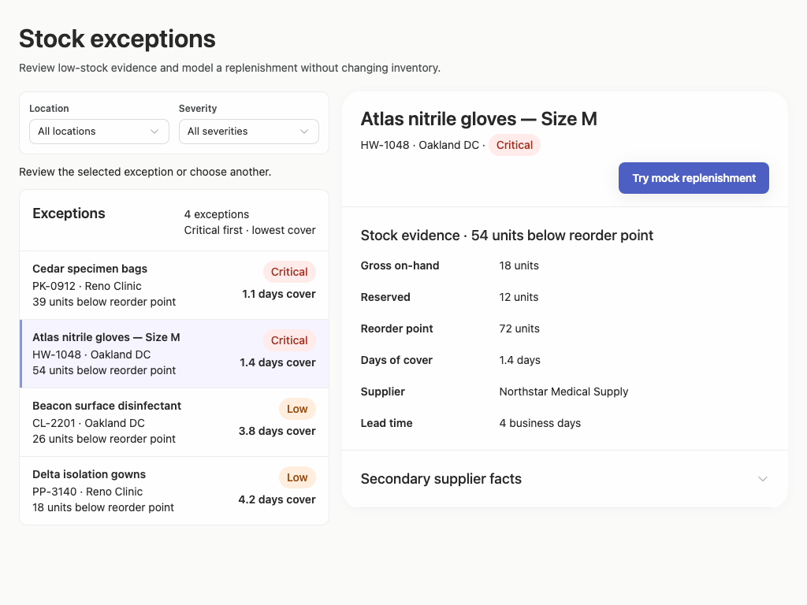

### desktop-window-5 — Inspect supplier facts

Interaction: passed.

### desktop-custom-700x900-0 — initial

Interaction: not-run.

### desktop-custom-700x900-1 — Select record and review modeled quantity

Interaction: passed.

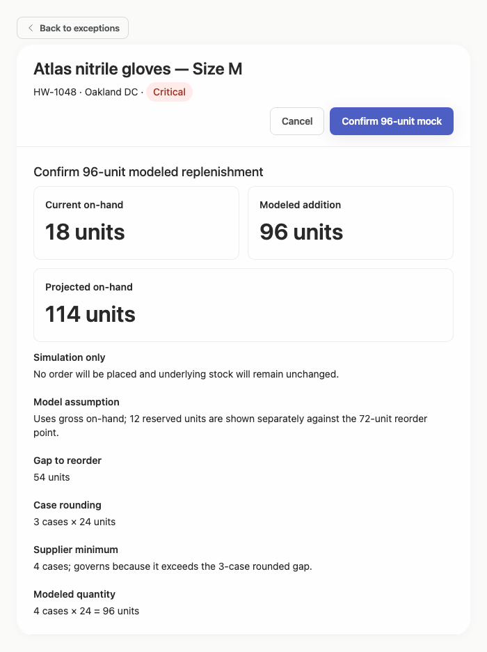

### desktop-custom-700x900-2 — Confirm modeled replenishment

Interaction: passed.

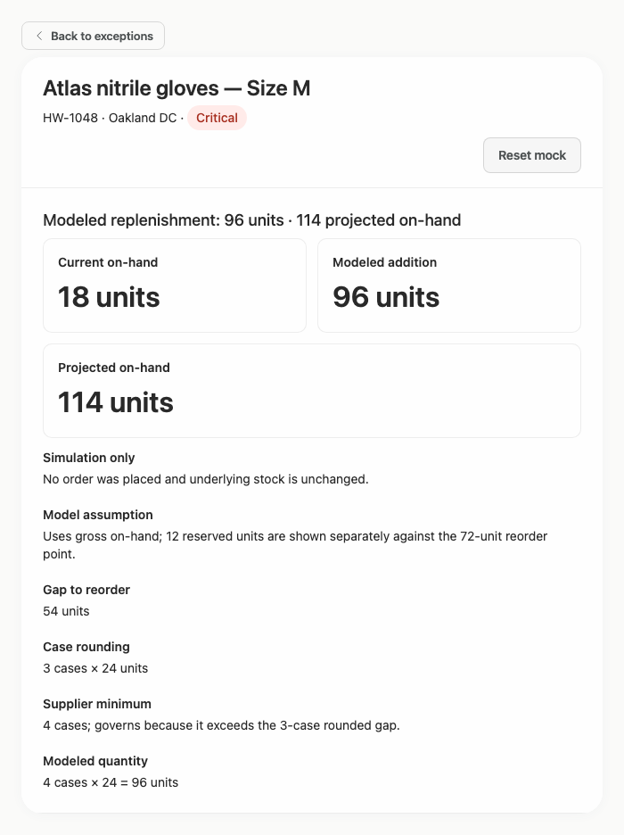

### desktop-custom-700x900-3 — Read projected quantity

Interaction: passed.

### desktop-custom-700x900-4 — Reset fixture result

Interaction: passed.

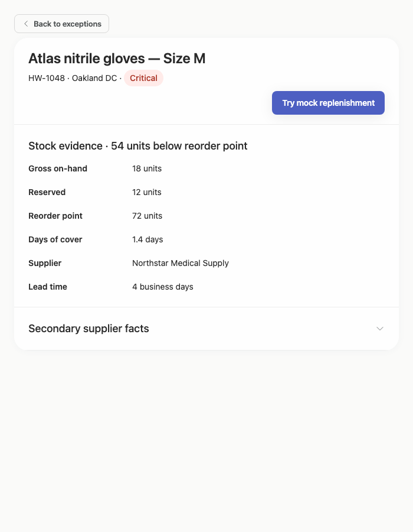

### desktop-custom-700x900-5 — Inspect supplier facts

Interaction: passed.

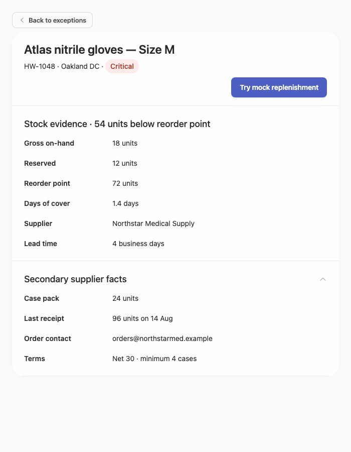

## Limitations

- Only static screenshots and supplied interaction summaries were available; filter-applied, empty-result, loading, error, keyboard-focus, and long-content states were not shown.
- The supplied evidence demonstrates the visual prototype but does not include an implementation-plan artifact, so that deliverable cannot be assessed.
- Normal document scrolling is indicated in some modeled and expanded states, but actual scrolling behavior was not directly observed.
- Static source and adherence measurements do not prove runtime component provenance or complete stylesheet/token usage.
