# stock-exceptions-header-description — 2026-09-09T12:02:36.378Z

[All reports](../../README.md) · [Interactive HTML report](index.html) · [Full measurements and scoring](report.json)

GitHub renders this summary and the screenshots. Download or clone this folder to open the HTML report locally; GitHub does not serve it as a website.

**Subjective design score:** 95/100. Model: openai/gpt-5.6-sol. Rubric: 2.

**Arrusted adherence:** 100/100 (partial); evidence coverage 1.88%. Evaluator 3.

| Dimension | Conforming | Nonconforming | Unassessed | Adherence    |
| --------- | ---------- | ------------- | ---------- | ------------ |
| component | 23         | 0             | 5          | 100% (23/23) |
| api       | 60         | 0             | 12         | 100% (60/60) |
| styling   | 13         | 0             | 4995       | 100% (13/13) |

Scores from different evaluator versions or captured states are not directly comparable.

This report evaluates the captured preview; evaluation itself does not regenerate the app or prove a built backend. Scores are advisory and not human-calibrated.

## Ratings

| Dimension      | Score | Reason                                                                                                                                                                                                                                                                                                                                                          |
| -------------- | ----- | --------------------------------------------------------------------------------------------------------------------------------------------------------------------------------------------------------------------------------------------------------------------------------------------------------------------------------------------------------------- |
| hierarchy      | 4/4   | The page establishes a clear sequence from title and purpose, to location/severity filters, exception selection, record evidence, and replenishment action. Selected-row treatment, severity pills, prominent quantity cards, and completed-state labeling make priorities easy to scan.                                                                        |
| layout         | 4/4   | The balanced list-detail composition is consistently aligned and appropriately dense at 1024, 1440, and 1920 widths. Filters align with the list, record actions remain associated with the detail header, and disclosure sections accommodate longer supplier and calculation content without disrupting the primary review area.                              |
| typography     | 3/4   | Headings, labels, values, and supporting copy use a consistent and readable scale, with large modeled quantities receiving suitable emphasis. The 700px exception-list helper is small and was measured at a marginal 4.47:1 contrast ratio, making that supporting line less readable than the rest of the interface.                                          |
| responsive     | 4/4   | The composition adapts strongly across the supplied desktop widths: wide and standard windows use list-detail, while the 700px panel defers detail until selection and provides a clear Back to exceptions action. Controls fit without horizontal overflow, action groups remain usable, and expanded disclosures use ordinary document scrolling when needed. |
| productClarity | 4/4   | The purpose is explicit, exception rows expose location, shortage, severity, and days of cover, and the detail explains stock and supplier facts before presenting the mock action. Review and completed states clearly show the 18 + 96 = 114 projection and repeatedly state that underlying inventory is unchanged.                                          |

## Strengths

- Exception ordering and row content support quick triage by severity, shortage, and days of cover.
- The selected record is evident through both a tinted row and a leading selection accent.
- Location and severity filters are visible before the exception list at every list-bearing width.
- Supplier information is progressively disclosed, keeping the initial evidence view concise while retaining useful procurement facts.
- The modeled replenishment flow has distinct review, completed, and reset states with prominent projected quantities.
- The constrained 700px panel replaces the split view with a focused detail screen and an explicit return control.
- The supplied interaction checks passed for review, confirmation, projected quantity, reset, supplier facts, and calculation disclosure states.

## Improvements

- **low — desktop-custom-700x900-0:** The helper text “Open an exception to review stock and supplier details” is rendered at a small secondary-text treatment; supplied accessibility evidence measured it at 4.47:1, narrowly below the expected threshold and less legible than surrounding content. Use a supported Typography variant with slightly greater size or emphasis, or omit this helper because the page title and list affordances already communicate the task. Preserve the existing palette rather than overriding its colors.
- **low — desktop-1:** The safety-critical “Simulation only” message is plain supporting text beneath the quantity cards, while the nearby confirmation action receives much stronger emphasis. Although the copy is clear, users scanning directly from quantities to the button may underweight the non-persistent nature of the action. Compose the message in a supported Card, StatusPill, or similarly emphasized existing variant within the review content, ideally before or adjacent to the confirmation actions, without changing the Arrusted palette or primary Button styling.

## Token evidence

Percentages cover only assessed properties. Missing provenance and ambiguous CSS remain unassessed; matching literals are not proof of token usage.

| Viewport                 | Category   | Token references / assessed | Coverage   |
| ------------------------ | ---------- | --------------------------- | ---------- |
| desktop-0                | color      | 0/0                         | 0% (0/233) |
| desktop-0                | typography | 0/0                         | 0% (0/522) |
| desktop-0                | spacing    | 0/0                         | 0% (0/267) |
| desktop-0                | radius     | 0/0                         | 0% (0/116) |
| desktop-0                | border     | 0/0                         | 0% (0/126) |
| desktop-0                | shadow     | 0/0                         | 0% (0/120) |
| desktop-wide-0           | color      | 0/0                         | 0% (0/233) |
| desktop-wide-0           | typography | 0/0                         | 0% (0/522) |
| desktop-wide-0           | spacing    | 0/0                         | 0% (0/267) |
| desktop-wide-0           | radius     | 0/0                         | 0% (0/116) |
| desktop-wide-0           | border     | 0/0                         | 0% (0/126) |
| desktop-wide-0           | shadow     | 0/0                         | 0% (0/120) |
| desktop-window-0         | color      | 0/0                         | 0% (0/233) |
| desktop-window-0         | typography | 0/0                         | 0% (0/522) |
| desktop-window-0         | spacing    | 0/0                         | 0% (0/267) |
| desktop-window-0         | radius     | 0/0                         | 0% (0/116) |
| desktop-window-0         | border     | 0/0                         | 0% (0/126) |
| desktop-window-0         | shadow     | 0/0                         | 0% (0/120) |
| desktop-custom-700x900-0 | color      | 0/0                         | 0% (0/144) |
| desktop-custom-700x900-0 | typography | 0/0                         | 0% (0/302) |
| desktop-custom-700x900-0 | spacing    | 0/0                         | 0% (0/169) |
| desktop-custom-700x900-0 | radius     | 0/0                         | 0% (0/72)  |
| desktop-custom-700x900-0 | border     | 0/0                         | 0% (0/80)  |
| desktop-custom-700x900-0 | shadow     | 0/0                         | 0% (0/76)  |

## Latest-run screenshots

### desktop-0 — initial

Interaction: not-run.

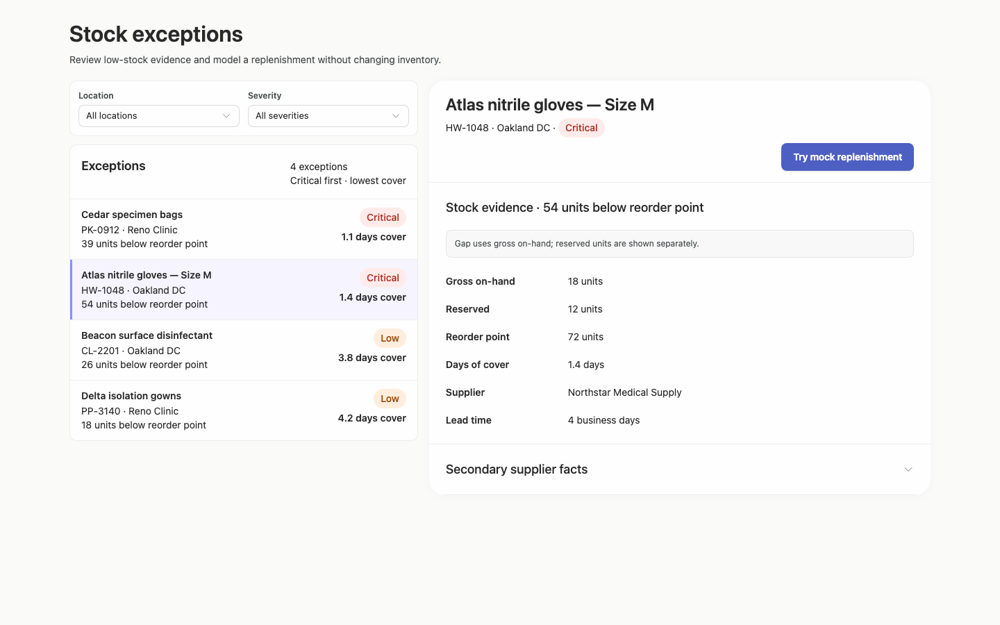

### desktop-1 — Review modeled quantity

Interaction: passed.

### desktop-2 — Confirm modeled replenishment

Interaction: passed.

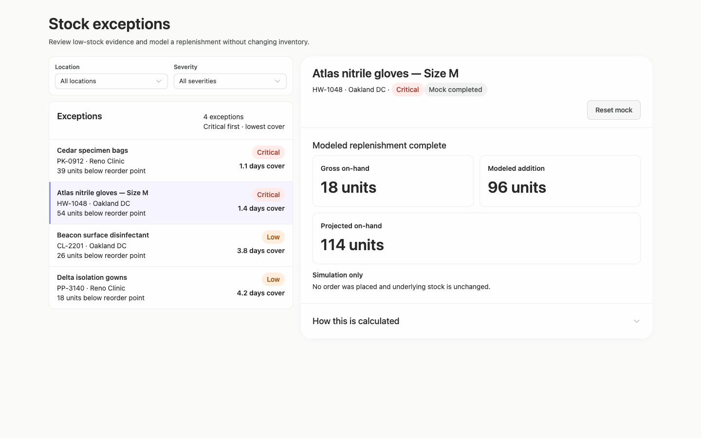

### desktop-3 — Read projected quantity

Interaction: passed.

### desktop-4 — Reset fixture result

Interaction: passed.

### desktop-5 — Inspect supplier facts

Interaction: passed.

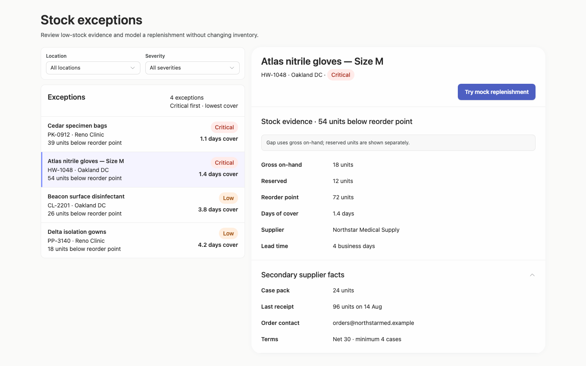

### desktop-6 — Expand confirmation derivation

Interaction: passed.

### desktop-7 — Expand completed derivation

Interaction: passed.

### desktop-wide-0 — initial

Interaction: not-run.

### desktop-wide-1 — Review modeled quantity

Interaction: passed.

### desktop-wide-2 — Confirm modeled replenishment

Interaction: passed.

### desktop-wide-3 — Read projected quantity

Interaction: passed.

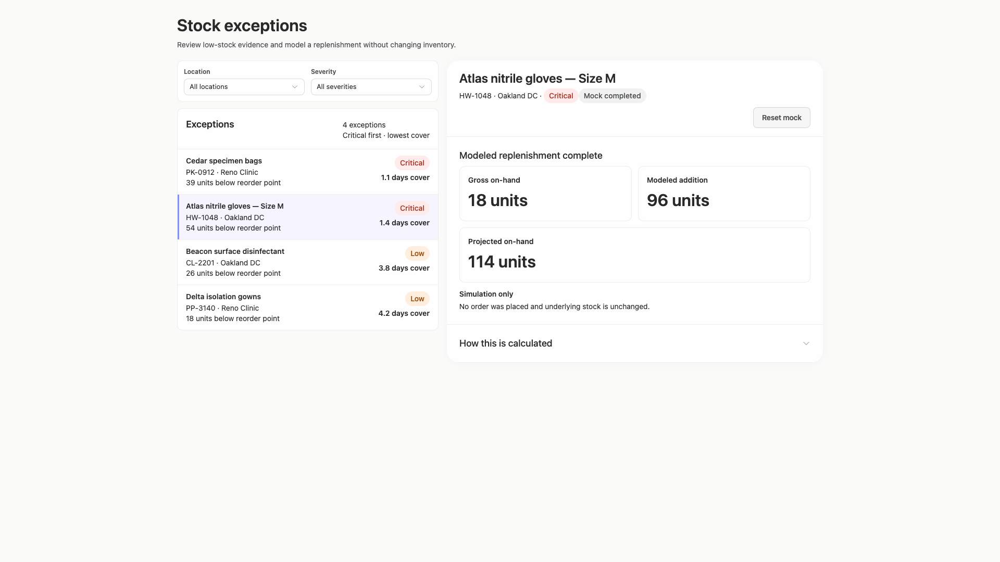

### desktop-wide-4 — Reset fixture result

Interaction: passed.

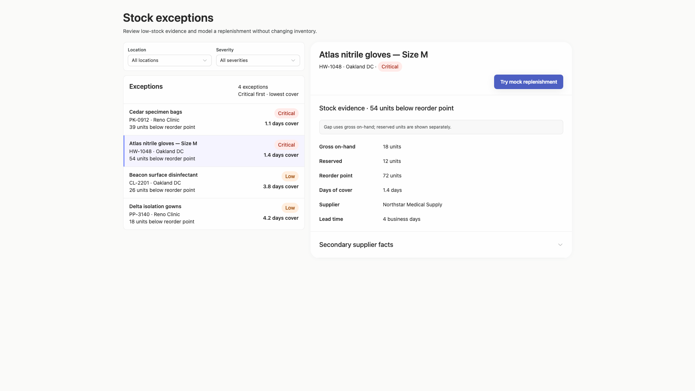

### desktop-wide-5 — Inspect supplier facts

Interaction: passed.

### desktop-wide-6 — Expand confirmation derivation

Interaction: passed.

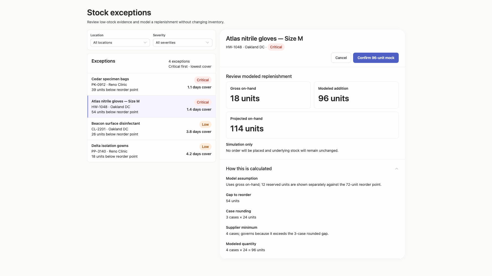

### desktop-wide-7 — Expand completed derivation

Interaction: passed.

### desktop-window-0 — initial

Interaction: not-run.

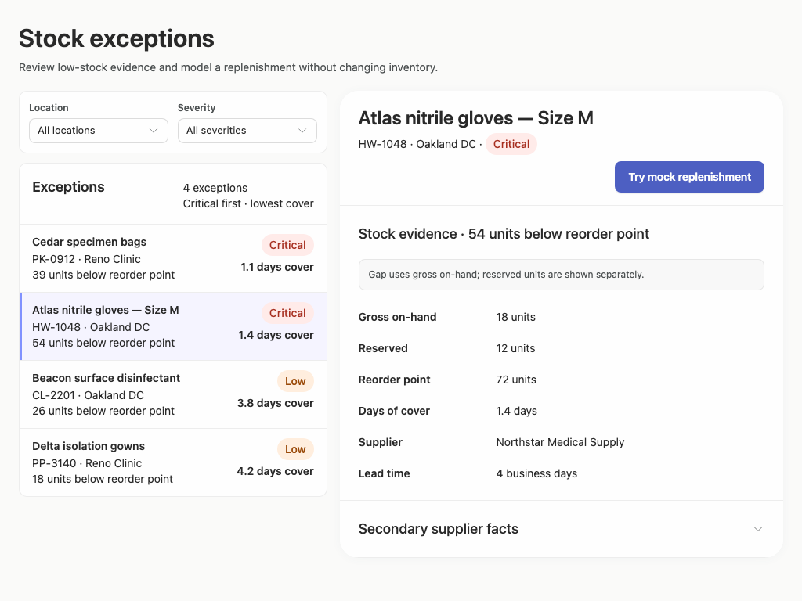

### desktop-window-1 — Review modeled quantity

Interaction: passed.

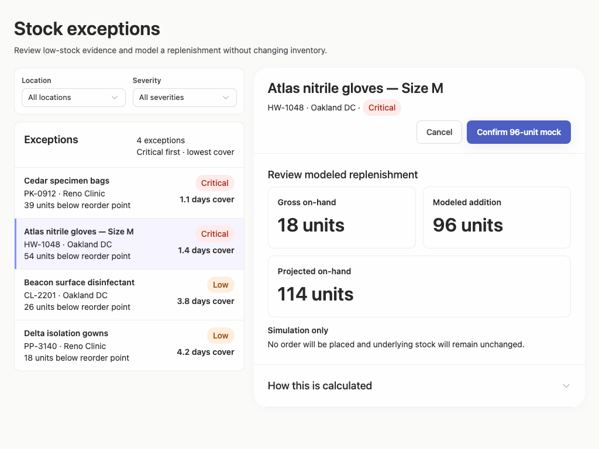

### desktop-window-2 — Confirm modeled replenishment

Interaction: passed.

### desktop-window-3 — Read projected quantity

Interaction: passed.

### desktop-window-4 — Reset fixture result

Interaction: passed.

### desktop-window-5 — Inspect supplier facts

Interaction: passed.

### desktop-window-6 — Expand confirmation derivation

Interaction: passed.

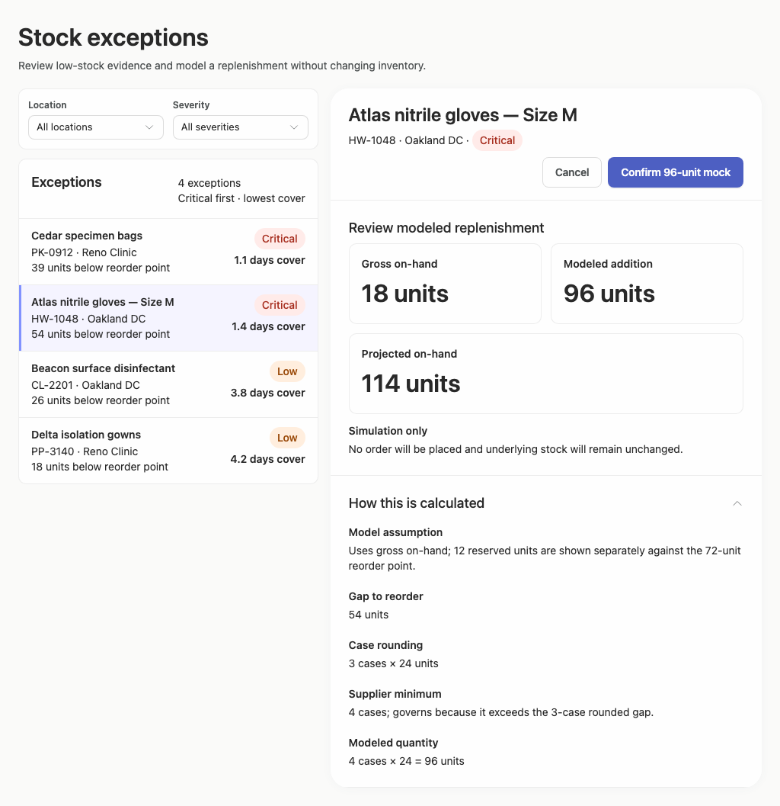

### desktop-window-7 — Expand completed derivation

Interaction: passed.

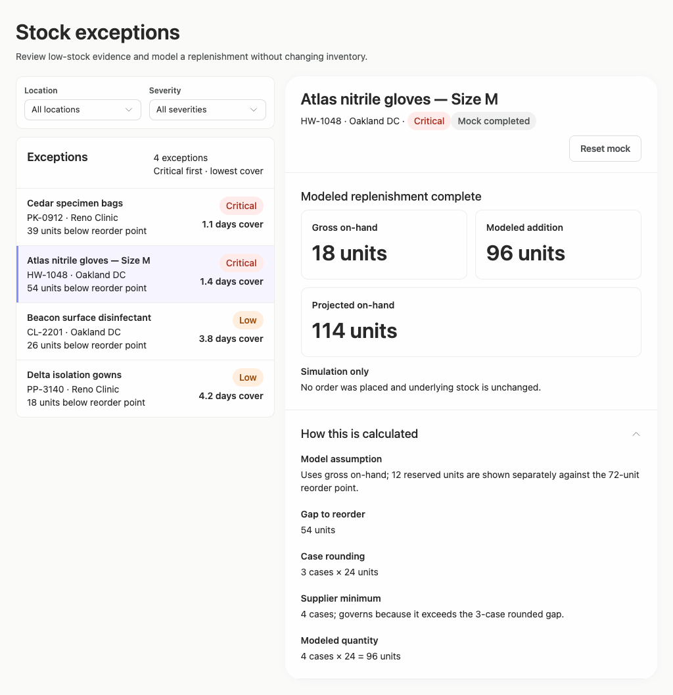

### desktop-custom-700x900-0 — initial

Interaction: not-run.

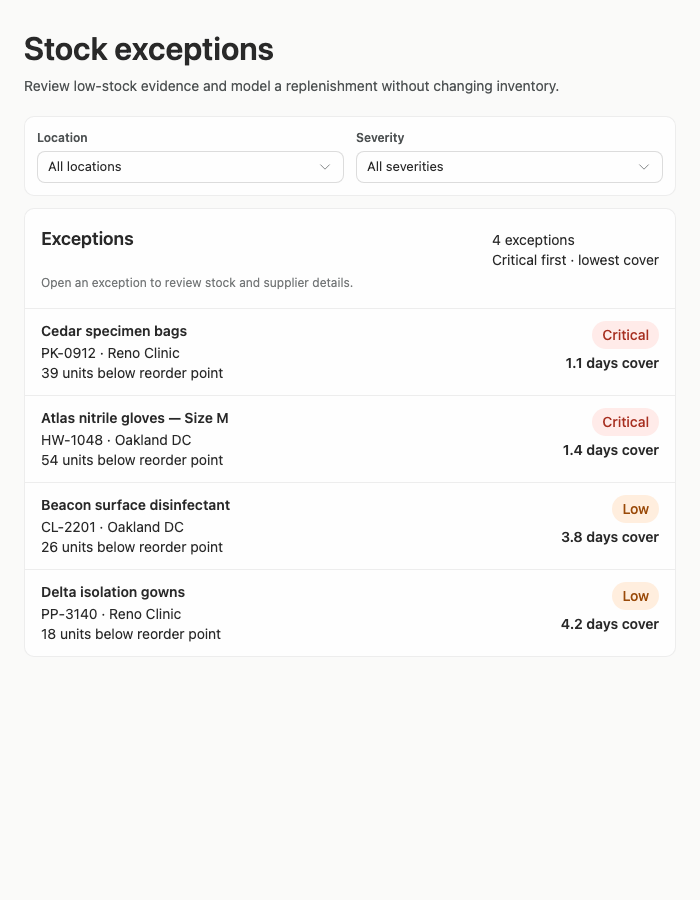

### desktop-custom-700x900-1 — Review modeled quantity

Interaction: passed.

### desktop-custom-700x900-2 — Confirm modeled replenishment

Interaction: passed.

### desktop-custom-700x900-3 — Read projected quantity

Interaction: passed.

### desktop-custom-700x900-4 — Reset fixture result

Interaction: passed.

### desktop-custom-700x900-5 — Inspect supplier facts

Interaction: passed.

### desktop-custom-700x900-6 — Expand confirmation derivation

Interaction: passed.

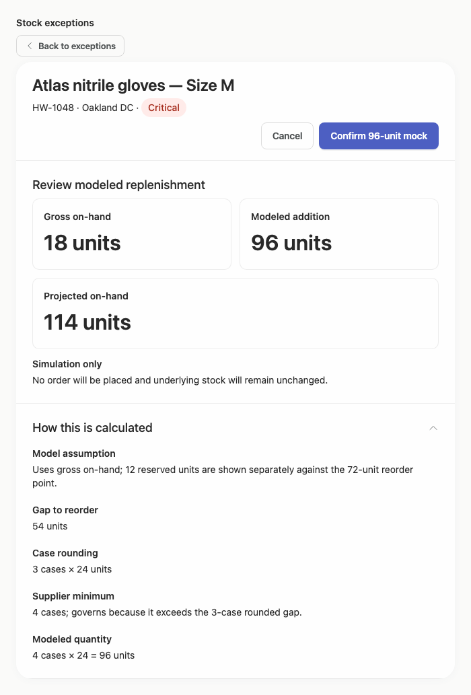

### desktop-custom-700x900-7 — Expand completed derivation

Interaction: passed.

## Limitations

- The evidence does not include visual states after changing either filter, so filtered, zero-result, and filter-reset compositions were not assessed.
- No screenshot demonstrates selecting each exception or handling unusually long product, supplier, or location names.
- Static screenshots and passed text checks do not establish backend behavior, persistence, authorization, focus management, or keyboard interaction.
- The requested implementation plan is not present in the supplied visual evidence and therefore could not be evaluated.
- Token and component provenance remain partially unassessed by the supplied adherence evidence; no visual score is treated as proof of implementation compliance.
