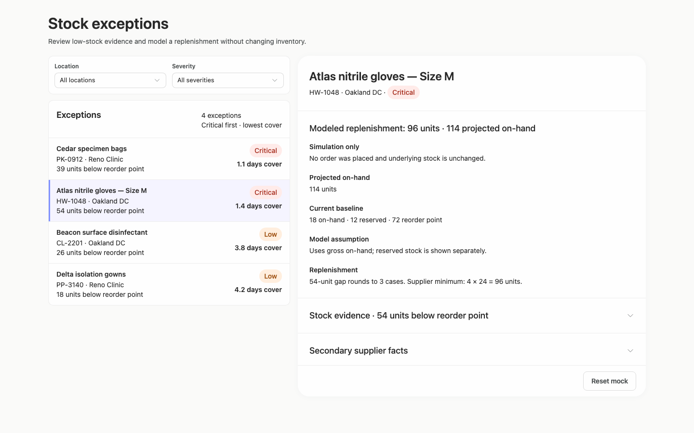
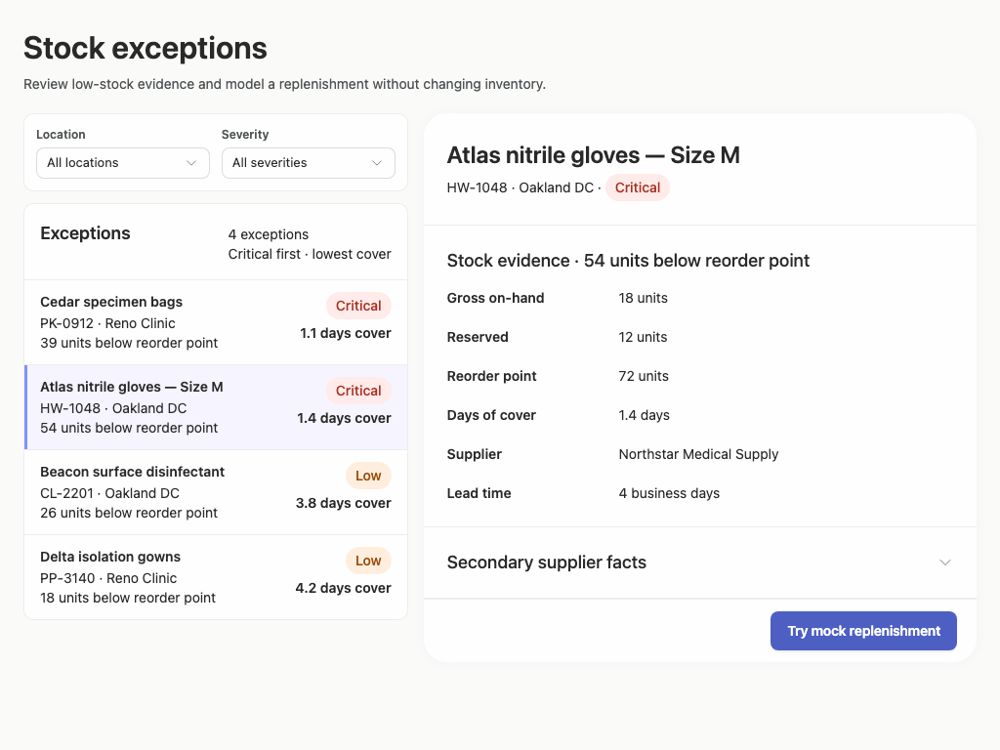
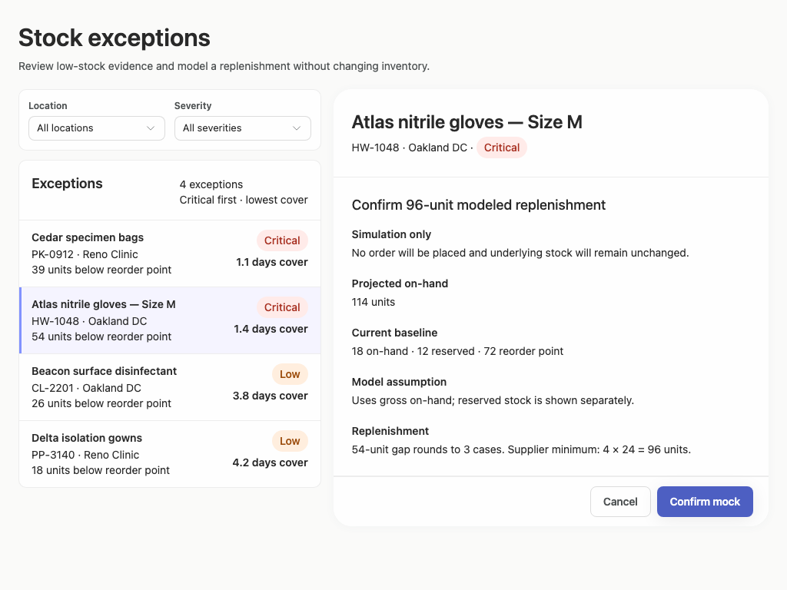
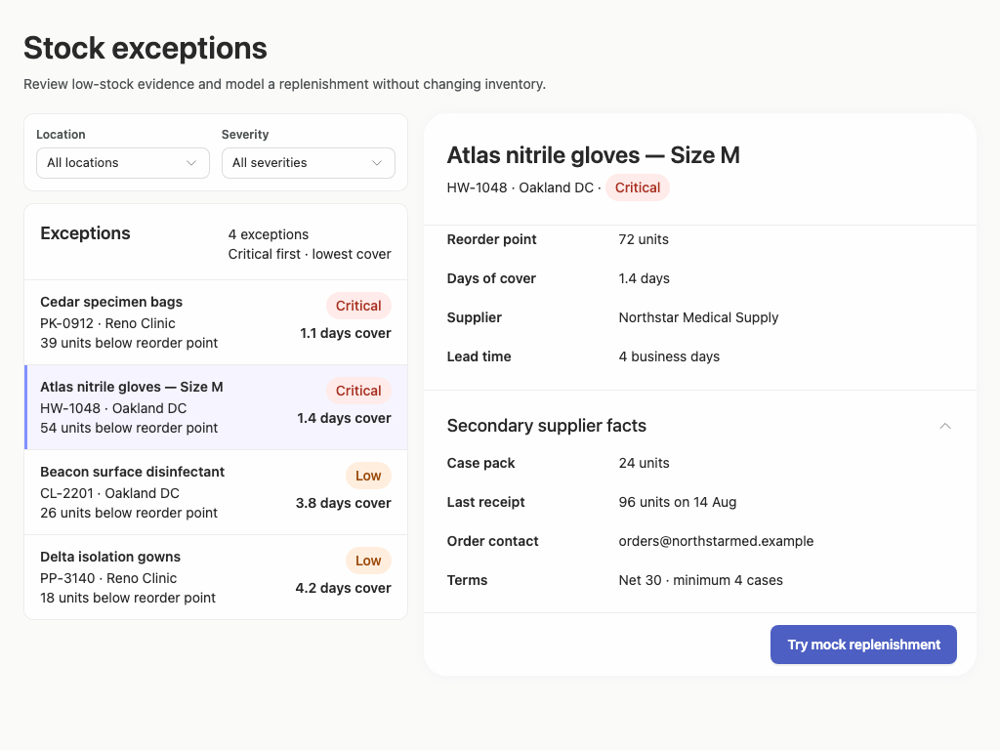
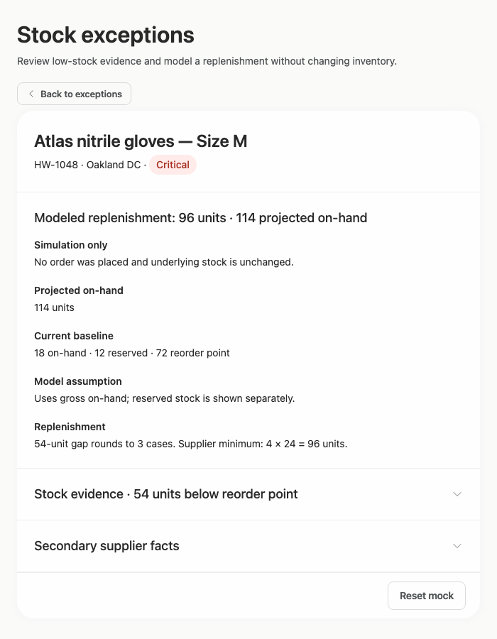
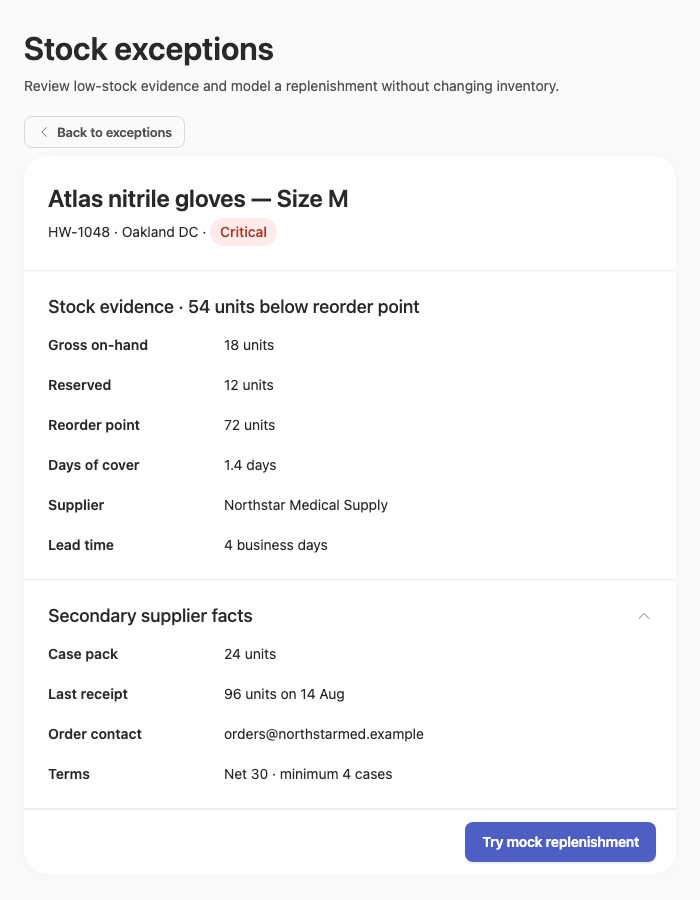

# stock-exceptions-minimal-scroll — 2026-09-09T08:40:18.759Z

[All reports](../../README.md) · [Interactive HTML report](index.html) · [Full measurements and scoring](report.json)

GitHub renders this summary and the screenshots. Download or clone this folder to open the HTML report locally; GitHub does not serve it as a website.

**Subjective design score:** 90/100. Model: openai/gpt-5.6-sol. Rubric: 2.

**Arrusted adherence:** 100/100 (partial); evidence coverage 1.63%. Evaluator 3.

| Dimension | Conforming | Nonconforming | Unassessed | Adherence    |
| --------- | ---------- | ------------- | ---------- | ------------ |
| component | 20         | 0             | 2          | 100% (20/20) |
| api       | 53         | 0             | 10         | 100% (53/53) |
| styling   | 13         | 0             | 5169       | 100% (13/13) |

Scores from different evaluator versions or captured states are not directly comparable.

This report evaluates the captured preview; evaluation itself does not regenerate the app or prove a built backend. Scores are advisory and not human-calibrated.

## Ratings

| Dimension | Score | Reason |
| --- | --- | --- |
| hierarchy | 4/4 | The page title, selected exception, stock-evidence heading, severity pill, and replenishment action form a clear priority sequence. Confirmation and result states replace the evidence body with prominent, state-specific headings while retaining item identity. |
| layout | 3/4 | The two-pane composition is consistently aligned, list rows use a compact and repeatable structure, and action footers are well separated. At 1024×768, however, expanding supplier facts scrolls the detail body past the beginning of stock evidence, weakening side-by-side review context. |
| typography | 4/4 | Heading levels, bold field labels, body values, metadata, and status text are visually consistent and readable across all supplied sizes. Repeated label/value treatment makes inventory and supplier facts easy to compare. |
| responsive | 3/4 | The composition remains usable at 1920, 1440, and 1024 pixels, then appropriately changes to a constrained detail view with a clear Back control at 700 pixels. Internal scrolling preserves controls at shorter desktop heights, though the expanded 1024-pixel state loses some preceding evidence context; the narrow list/filter state was not shown. |
| productClarity | 4/4 | Location and severity filters, selectable exception rows, stock and supplier evidence, and the mock replenishment path directly support the brief. Repeated “Simulation only” language and explicit statements that no order or stock change occurred make the action’s consequences unusually clear. |

## Strengths

- Selected-state treatment combines a subtle row background and edge marker without competing with severity indicators.
- Exception rows expose product, SKU, location, shortage, severity, and days of cover in a compact scan pattern.
- The confirmation explains the 96-unit recommendation through the stock gap, case pack, and supplier minimum rather than presenting an unexplained action.
- Supplier details are progressively disclosed, keeping the initial review focused while preserving access to purchasing facts.
- Action footers remain visually stable across initial, confirmation, result, reset, and expanded-supplier states.
- The constrained 700-pixel layout avoids squeezing two panes and provides an explicit route back to exceptions.
- The screenshots consistently preserve the supplied Arrusted visual palette and component appearance.

## Improvements

- **medium — desktop-window-5:** After Secondary supplier facts is expanded in the shorter two-pane window, the detail viewport begins at “Reorder point”; the Stock evidence heading, gross on-hand, and reserved values have scrolled out of view. This makes it harder to compare the newly revealed supplier terms with the complete stock baseline. When supplier facts expand, preserve the detail panel’s prior scroll position or explicitly collapse Stock evidence and anchor the expanded disclosure heading near the top. Keep the existing internal scroll region and supported Disclosure composition.
- **low — desktop-1:** The confirmation is clear, but its two decisive modeled numbers—96 replenishment units and 114 projected on-hand—are split between the heading and ordinary label/value content, so rapid quantitative comparison relies on reading several lines. Use a compact supported KPI strip, KPI pills, or a short aligned summary row for “Replenishment: 96 units” and “Projected on-hand: 114 units,” while retaining the explanatory assumptions below.

## Token evidence

Percentages cover only assessed properties. Missing provenance and ambiguous CSS remain unassessed; matching literals are not proof of token usage.

| Viewport | Category | Token references / assessed | Coverage |
| --- | --- | --- | --- |
| desktop-0 | color | 0/0 | 0% (0/233) |
| desktop-0 | typography | 0/0 | 0% (0/522) |
| desktop-0 | spacing | 0/0 | 0% (0/275) |
| desktop-0 | radius | 0/0 | 0% (0/116) |
| desktop-0 | border | 0/0 | 0% (0/125) |
| desktop-0 | shadow | 0/0 | 0% (0/120) |
| desktop-wide-0 | color | 0/0 | 0% (0/233) |
| desktop-wide-0 | typography | 0/0 | 0% (0/522) |
| desktop-wide-0 | spacing | 0/0 | 0% (0/275) |
| desktop-wide-0 | radius | 0/0 | 0% (0/116) |
| desktop-wide-0 | border | 0/0 | 0% (0/125) |
| desktop-wide-0 | shadow | 0/0 | 0% (0/120) |
| desktop-window-0 | color | 0/0 | 0% (0/233) |
| desktop-window-0 | typography | 0/0 | 0% (0/522) |
| desktop-window-0 | spacing | 0/0 | 0% (0/275) |
| desktop-window-0 | radius | 0/0 | 0% (0/116) |
| desktop-window-0 | border | 0/0 | 0% (0/125) |
| desktop-window-0 | shadow | 0/0 | 0% (0/120) |
| desktop-custom-700x900-0 | color | 0/0 | 0% (0/161) |
| desktop-custom-700x900-0 | typography | 0/0 | 0% (0/405) |
| desktop-custom-700x900-0 | spacing | 0/0 | 0% (0/184) |
| desktop-custom-700x900-0 | radius | 0/0 | 0% (0/81) |
| desktop-custom-700x900-0 | border | 0/0 | 0% (0/84) |
| desktop-custom-700x900-0 | shadow | 0/0 | 0% (0/81) |

## Latest-run screenshots

### desktop-0 — initial

Interaction: not-run.

### desktop-1 — Review modeled quantity before confirming

Interaction: passed.

### desktop-2 — Mock replenishment result

Interaction: passed.

### desktop-3 — Result evidence at scroll boundary

Interaction: passed.

### desktop-4 — Reset from result footer

Interaction: passed.

### desktop-5 — Expanded supplier facts

Interaction: passed.

### desktop-wide-0 — initial

Interaction: not-run.

### desktop-wide-1 — Review modeled quantity before confirming

Interaction: passed.

### desktop-wide-2 — Mock replenishment result

Interaction: passed.

### desktop-wide-3 — Result evidence at scroll boundary

Interaction: passed.

### desktop-wide-4 — Reset from result footer

Interaction: passed.

### desktop-wide-5 — Expanded supplier facts

Interaction: passed.

### desktop-window-0 — initial

Interaction: not-run.

### desktop-window-1 — Review modeled quantity before confirming

Interaction: passed.

### desktop-window-2 — Mock replenishment result

Interaction: passed.

### desktop-window-3 — Result evidence at scroll boundary

Interaction: passed.

### desktop-window-4 — Reset from result footer

Interaction: passed.

### desktop-window-5 — Expanded supplier facts

Interaction: passed.

### desktop-custom-700x900-0 — initial

Interaction: not-run.

### desktop-custom-700x900-1 — Review modeled quantity before confirming

Interaction: passed.

### desktop-custom-700x900-2 — Mock replenishment result

Interaction: passed.

### desktop-custom-700x900-3 — Result evidence at scroll boundary

Interaction: passed.

### desktop-custom-700x900-4 — Reset from result footer

Interaction: passed.

### desktop-custom-700x900-5 — Expanded supplier facts

Interaction: passed.

## Limitations

- No capture shows changed filter results, empty results, or selection of another product, so those visual states cannot be assessed.
- The 700-pixel captures show only the constrained detail view; the narrow exceptions list and filter composition after using Back is not visible.
- Screenshot interactions verify the replenishment, reset, and supplier-disclosure paths, but initial filter and row-selection interactions were not reported as run.
- No implementation-plan artifact was supplied, so the brief’s implementation-plan deliverable cannot be evaluated from these interface captures.
- Static screenshots cannot establish persistence, authorization, backend behavior, keyboard flow, or complete runtime component provenance.
