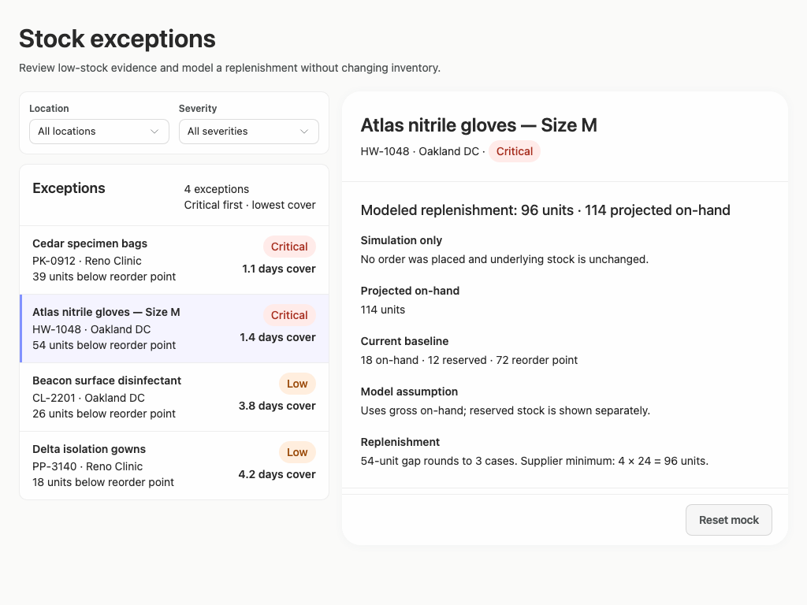
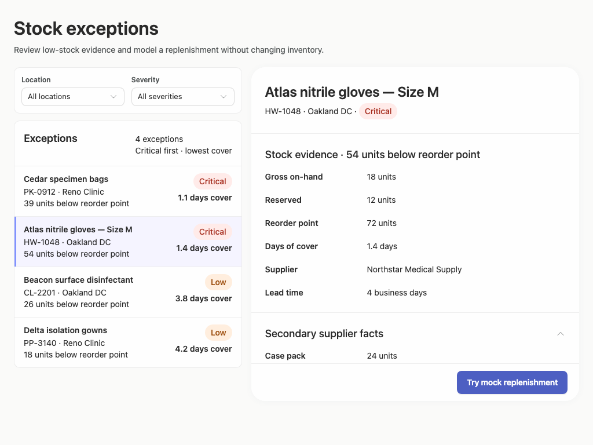

# stock-exceptions-native-scroll — 2026-09-09T08:46:08.340Z

[All reports](../../README.md) · [Interactive HTML report](index.html) · [Full measurements and scoring](report.json)

GitHub renders this summary and the screenshots. Download or clone this folder to open the HTML report locally; GitHub does not serve it as a website.

**Subjective design score:** 90/100. Model: openai/gpt-5.6-sol. Rubric: 2.

**Arrusted adherence:** 100/100 (partial); evidence coverage 1.63%. Evaluator 3.

| Dimension | Conforming | Nonconforming | Unassessed | Adherence    |
| --------- | ---------- | ------------- | ---------- | ------------ |
| component | 20         | 0             | 2          | 100% (20/20) |
| api       | 53         | 0             | 10         | 100% (53/53) |
| styling   | 13         | 0             | 5169       | 100% (13/13) |

Scores from different evaluator versions or captured states are not directly comparable.

This report evaluates the captured preview; evaluation itself does not regenerate the app or prove a built backend. Scores are advisory and not human-calibrated.

## Ratings

| Dimension      | Score | Reason                                                                                                                                                                                                                                                                                                                                                                                                                                   |
| -------------- | ----- | ---------------------------------------------------------------------------------------------------------------------------------------------------------------------------------------------------------------------------------------------------------------------------------------------------------------------------------------------------------------------------------------------------------------------------------------- |
| hierarchy      | 4/4   | The page title, filter controls, exception list, selected-product heading, evidence, and replenishment action form a clear task sequence. Selected-row treatment, severity pills, section headings, and distinct confirmation/result states make priorities immediately scannable.                                                                                                                                                       |
| layout         | 3/4   | The two-column list-detail composition is consistently aligned and comfortably dense at 1024–1920 px, with stable action footers and orderly label-value grids. The constrained maximum width leaves substantial unused space on wide screens, and expanded detail content becomes tightly clipped into an internal scroll region at 1024 px.                                                                                            |
| typography     | 4/4   | Heading levels, product names, metadata, labels, values, and explanatory copy use consistent sizing and weight. Quantities such as the 54-unit gap, 96-unit replenishment, and 114 projected on-hand remain readable and are phrased consistently across review and result states.                                                                                                                                                       |
| responsive     | 3/4   | The composition remains usable at all supplied desktop sizes: it preserves side-by-side review at 1024 px, centers the workspace at 1920 px, and switches to a constrained detail view with a Back control at 700 px. Controls stay within the viewport, although the 700 px initial capture hides filtering behind navigation and the 1024 px expanded supplier section reveals only part of its content without an obvious visual cue. |
| productClarity | 4/4   | The interface clearly supports filtering by location and severity, reviewing stock and supplier evidence, selecting an exception, and trying a mock replenishment. Confirmation and result copy explicitly states that the action is a simulation and does not alter inventory, while the calculation and supplier minimum explain why 96 units are modeled.                                                                             |

## Strengths

- Strong master-detail relationship: the highlighted Atlas row matches the detail title, SKU, location, severity, and stock gap.
- Exception rows expose useful triage information without requiring selection, including severity, units below reorder point, and days of cover.
- The mock workflow has well-differentiated initial, confirmation, completed, and reset states.
- The confirmation view explains projected stock, baseline values, modeling assumptions, case rounding, and supplier minimum before confirmation.
- Supplier facts are progressively disclosed, keeping the default evidence view focused.
- All measured controls remain within their supplied desktop viewports, and no accessibility violations were reported in the captures.

## Improvements

- **medium — desktop-window-5:** After “Secondary supplier facts” is expanded at 1024×768, only the first fact is visible before the fixed action area. The remaining facts require internal scrolling, but the capture provides little indication that more expanded content exists. When opening the disclosure, scroll its content into view and reserve more of the available detail height for the expanded section. If the action footer remains fixed, add a composition-level continuation cue or ensure the internal scroll position visibly exposes part of the next row.
- **low — desktop-custom-700x900-0:** The supplied initial state at the narrow desktop width opens directly on the selected record, so the exception list and both required filters are one navigation step away. The Back control makes the path recoverable, but the initial task entry is less direct for users arriving to triage or filter exceptions. Use the constrained list view as the default entry when no record was explicitly selected by route or prior state. Preserve this detail-first composition only when selection context exists, retaining the current Back control.

## Token evidence

Percentages cover only assessed properties. Missing provenance and ambiguous CSS remain unassessed; matching literals are not proof of token usage.

| Viewport                 | Category   | Token references / assessed | Coverage   |
| ------------------------ | ---------- | --------------------------- | ---------- |
| desktop-0                | color      | 0/0                         | 0% (0/233) |
| desktop-0                | typography | 0/0                         | 0% (0/522) |
| desktop-0                | spacing    | 0/0                         | 0% (0/275) |
| desktop-0                | radius     | 0/0                         | 0% (0/116) |
| desktop-0                | border     | 0/0                         | 0% (0/125) |
| desktop-0                | shadow     | 0/0                         | 0% (0/120) |
| desktop-wide-0           | color      | 0/0                         | 0% (0/233) |
| desktop-wide-0           | typography | 0/0                         | 0% (0/522) |
| desktop-wide-0           | spacing    | 0/0                         | 0% (0/275) |
| desktop-wide-0           | radius     | 0/0                         | 0% (0/116) |
| desktop-wide-0           | border     | 0/0                         | 0% (0/125) |
| desktop-wide-0           | shadow     | 0/0                         | 0% (0/120) |
| desktop-window-0         | color      | 0/0                         | 0% (0/233) |
| desktop-window-0         | typography | 0/0                         | 0% (0/522) |
| desktop-window-0         | spacing    | 0/0                         | 0% (0/275) |
| desktop-window-0         | radius     | 0/0                         | 0% (0/116) |
| desktop-window-0         | border     | 0/0                         | 0% (0/125) |
| desktop-window-0         | shadow     | 0/0                         | 0% (0/120) |
| desktop-custom-700x900-0 | color      | 0/0                         | 0% (0/161) |
| desktop-custom-700x900-0 | typography | 0/0                         | 0% (0/405) |
| desktop-custom-700x900-0 | spacing    | 0/0                         | 0% (0/184) |
| desktop-custom-700x900-0 | radius     | 0/0                         | 0% (0/81)  |
| desktop-custom-700x900-0 | border     | 0/0                         | 0% (0/84)  |
| desktop-custom-700x900-0 | shadow     | 0/0                         | 0% (0/81)  |

## Latest-run screenshots

### desktop-0 — initial

Interaction: not-run.

### desktop-1 — Review modeled quantity before confirming

Interaction: passed.

### desktop-2 — Mock replenishment result

Interaction: passed.

### desktop-3 — Result evidence at scroll boundary

Interaction: passed.

### desktop-4 — Reset from result footer

Interaction: passed.

### desktop-5 — Expanded supplier facts

Interaction: passed.

### desktop-wide-0 — initial

Interaction: not-run.

### desktop-wide-1 — Review modeled quantity before confirming

Interaction: passed.

### desktop-wide-2 — Mock replenishment result

Interaction: passed.

### desktop-wide-3 — Result evidence at scroll boundary

Interaction: passed.

### desktop-wide-4 — Reset from result footer

Interaction: passed.

### desktop-wide-5 — Expanded supplier facts

Interaction: passed.

### desktop-window-0 — initial

Interaction: not-run.

### desktop-window-1 — Review modeled quantity before confirming

Interaction: passed.

### desktop-window-2 — Mock replenishment result

Interaction: passed.

### desktop-window-3 — Result evidence at scroll boundary

Interaction: passed.

### desktop-window-4 — Reset from result footer

Interaction: passed.

### desktop-window-5 — Expanded supplier facts

Interaction: passed.

### desktop-custom-700x900-0 — initial

Interaction: not-run.

### desktop-custom-700x900-1 — Review modeled quantity before confirming

Interaction: passed.

### desktop-custom-700x900-2 — Mock replenishment result

Interaction: passed.

### desktop-custom-700x900-3 — Result evidence at scroll boundary

Interaction: passed.

### desktop-custom-700x900-4 — Reset from result footer

Interaction: passed.

### desktop-custom-700x900-5 — Expanded supplier facts

Interaction: passed.

## Limitations

- No captured post-filter, empty-result, no-selection, or filter-menu state was supplied, so those experiences were not evaluated.
- Interaction evidence covers the mock replenishment, reset, and supplier disclosure flows, but not changing filters or selecting each record.
- Screenshots and static source findings do not establish backend behavior, persistence, authorization, or that every dynamic JSX branch rendered.
- No implementation-plan artifact was supplied, so the brief’s requested implementation plan could not be assessed.
- Styling provenance was largely unassessed; visual observations do not establish full token or component implementation adherence.
