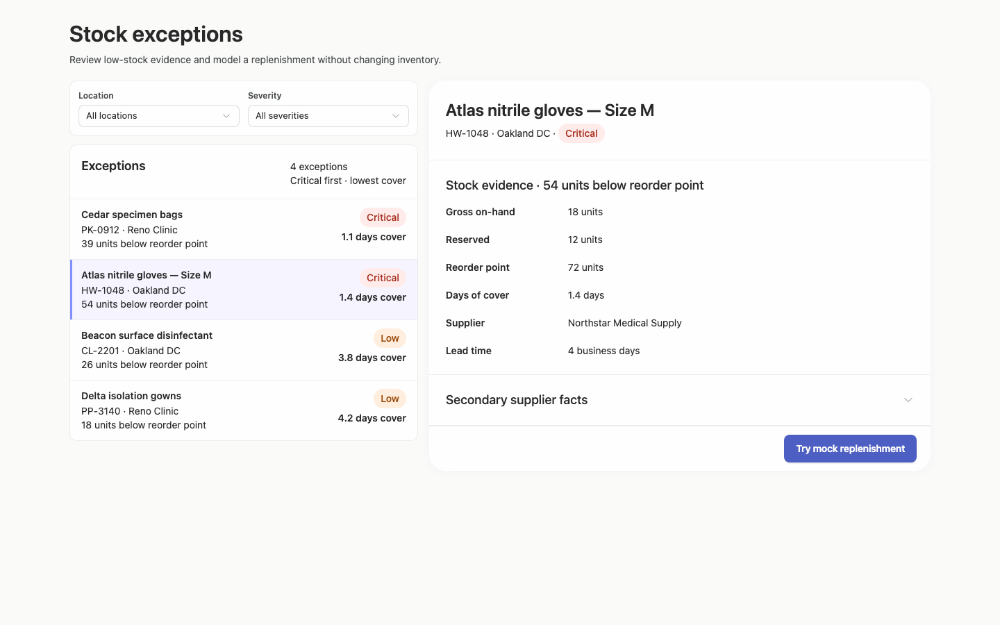
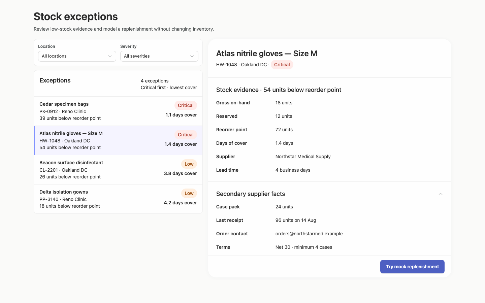
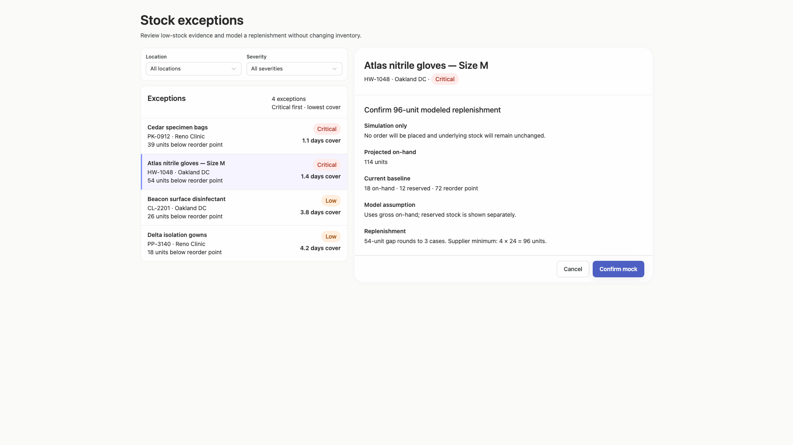
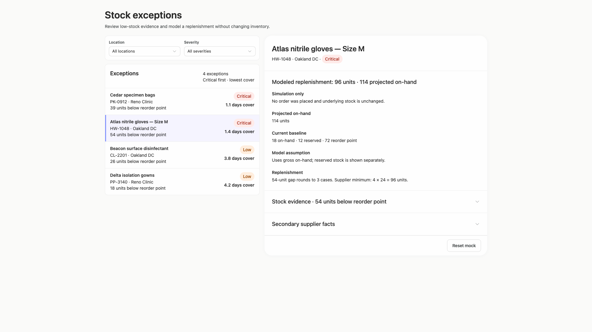
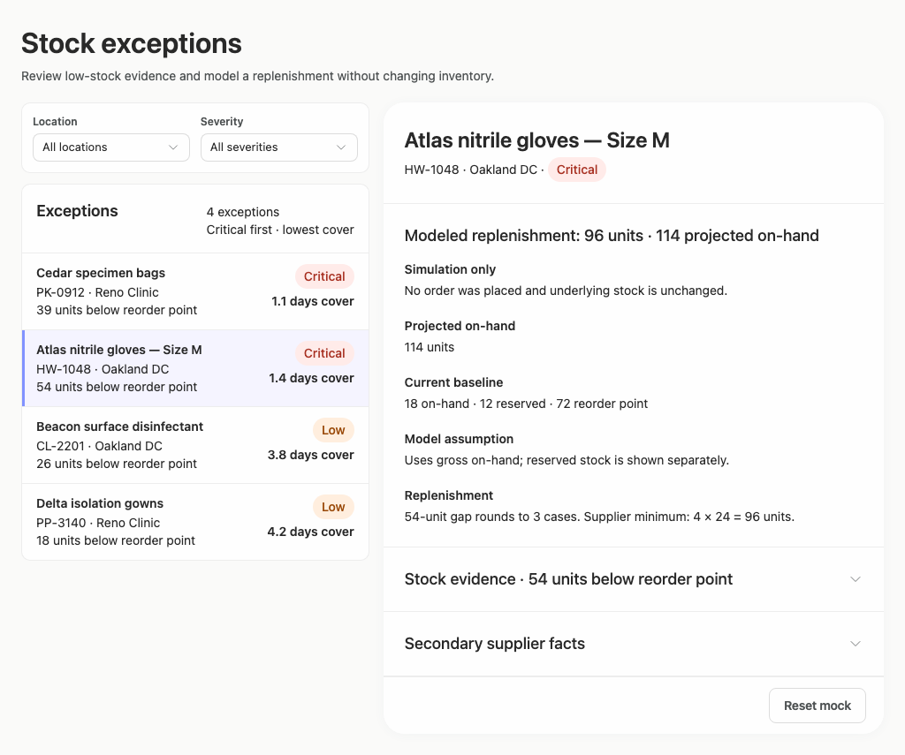
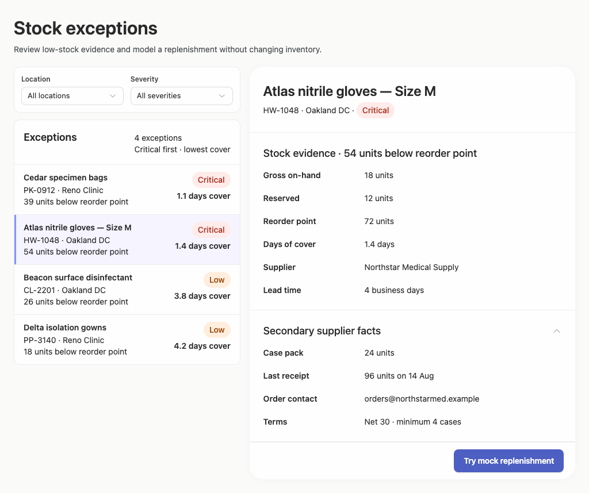
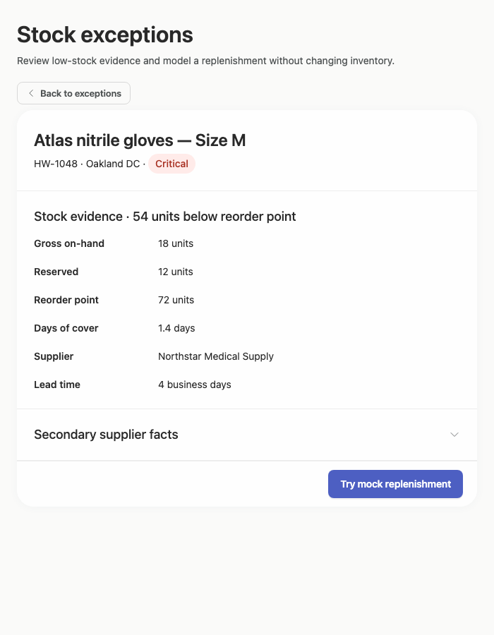

# stock-exceptions-natural-window — 2026-09-09T08:56:31.747Z

[All reports](../../README.md) · [Interactive HTML report](index.html) · [Full measurements and scoring](report.json)

GitHub renders this summary and the screenshots. Download or clone this folder to open the HTML report locally; GitHub does not serve it as a website.

**Subjective design score:** 90/100. Model: openai/gpt-5.6-sol. Rubric: 2.

**Arrusted adherence:** 100/100 (partial); evidence coverage 1.61%. Evaluator 3.

| Dimension | Conforming | Nonconforming | Unassessed | Adherence    |
| --------- | ---------- | ------------- | ---------- | ------------ |
| component | 20         | 0             | 2          | 100% (20/20) |
| api       | 52         | 0             | 11         | 100% (52/52) |
| styling   | 13         | 0             | 5169       | 100% (13/13) |

Scores from different evaluator versions or captured states are not directly comparable.

This report evaluates the captured preview; evaluation itself does not regenerate the app or prove a built backend. Scores are advisory and not human-calibrated.

## Ratings

| Dimension      | Score | Reason                                                                                                                                                                                                                                                                                                                                                                                                               |
| -------------- | ----- | -------------------------------------------------------------------------------------------------------------------------------------------------------------------------------------------------------------------------------------------------------------------------------------------------------------------------------------------------------------------------------------------------------------------- |
| hierarchy      | 4/4   | The page title, filter controls, exception list, selected-record header, evidence, and replenishment action form a clear progression. Selection is visibly distinguished, severity and days-of-cover values are easy to scan, and confirmation/result states replace the main evidence area with prominent state-specific headings.                                                                                  |
| layout         | 3/4   | The two-column composition is consistently aligned and comfortably dense from 1024 to 1920 pixels, with compact 86-pixel list rows and well-grouped detail sections. A minor weakness is vertical fit in the 1024-pixel result state, where the footer action falls below the 768-pixel viewport, while the 1440-pixel result uses a nearly unnecessary internal scroll region.                                      |
| typography     | 4/4   | Heading levels, field labels, values, metadata, and status pills are visually consistent and readable throughout. Bold labels support quick evidence review without overwhelming body text, and long product and supplier strings remain legible at the supplied desktop widths.                                                                                                                                     |
| responsive     | 3/4   | The interface adapts from a wide master-detail layout to a focused detail panel at 700 pixels, provides a clear Back to exceptions control, and keeps confirmation actions usable. However, the constrained initial capture opens directly on a preselected record rather than the filter/list task, and scroll ownership varies between internal detail scrolling at 1440 pixels and page scrolling at 1024 pixels. |
| productClarity | 4/4   | The task is explicit: review low-stock evidence and model replenishment without changing inventory. Location and severity filters are labeled, list rows expose location, deficit, severity, and cover, supplier facts are discoverable, and both confirmation and result states repeatedly clarify that the action is a simulation and no order is placed.                                                          |

## Strengths

- Strong master-detail scan path with a compact exception list and clearly associated stock and supplier evidence.
- Selection, severity, deficit, and days of cover are all visible without opening each record.
- The mock action has a well-defined review, confirm, result, and reset sequence.
- Replenishment reasoning is transparent: the 54-unit gap, case rounding, supplier minimum, modeled 96 units, and projected 114 units are explained.
- The constrained desktop-panel treatment avoids squeezing both columns and provides a clear route back to the exception list.
- The supplied palette is used coherently, with explicit text labels ensuring status does not depend on color alone.

## Improvements

- **medium — desktop-custom-700x900-0:** The constrained initial state opens directly on the preselected Atlas record, so the primary filtering and exception-selection task is not initially visible. The Back to exceptions control makes it recoverable, but users entering this window size must navigate backward before they can filter. In constrained desktop panels, begin on the exception list when there is no user-established selection; preserve the detail route only after an explicit selection or when restoring an existing review context.
- **low — desktop-window-2:** In the measured 1024×768 window, the result footer and Reset mock action extend to approximately y=831, requiring page scrolling even though the preceding confirmation state fits within the viewport. Reduce nonessential vertical gaps in the modeled summary or use the supported constrained detail composition with a single scrolling content region so the footer action remains readily reachable.
- **low — desktop-2:** The result detail body becomes an internal vertical scroller even though its measured content exceeds the client height by only about 7 pixels. This introduces a second scroll behavior for a very small overflow and differs from the page-scroll behavior at 1024 pixels. Establish one predictable scroll owner for the detail state and allow the body a small amount of additional height before introducing internal scrolling.
- **low — desktop-1:** The confirmation information is clear, but the decision-critical before-and-after quantities are distributed across several text blocks. The projected 114 units has the same visual weight as supporting assumptions, slowing comparison with the current 18 units and modeled addition of 96 units. Use existing inline detail fields or a compact KPI composition to juxtapose current on-hand, modeled addition, and projected on-hand, while retaining the explanatory formula below.

## Token evidence

Percentages cover only assessed properties. Missing provenance and ambiguous CSS remain unassessed; matching literals are not proof of token usage.

| Viewport                 | Category   | Token references / assessed | Coverage   |
| ------------------------ | ---------- | --------------------------- | ---------- |
| desktop-0                | color      | 0/0                         | 0% (0/233) |
| desktop-0                | typography | 0/0                         | 0% (0/522) |
| desktop-0                | spacing    | 0/0                         | 0% (0/275) |
| desktop-0                | radius     | 0/0                         | 0% (0/116) |
| desktop-0                | border     | 0/0                         | 0% (0/125) |
| desktop-0                | shadow     | 0/0                         | 0% (0/120) |
| desktop-wide-0           | color      | 0/0                         | 0% (0/233) |
| desktop-wide-0           | typography | 0/0                         | 0% (0/522) |
| desktop-wide-0           | spacing    | 0/0                         | 0% (0/275) |
| desktop-wide-0           | radius     | 0/0                         | 0% (0/116) |
| desktop-wide-0           | border     | 0/0                         | 0% (0/125) |
| desktop-wide-0           | shadow     | 0/0                         | 0% (0/120) |
| desktop-window-0         | color      | 0/0                         | 0% (0/233) |
| desktop-window-0         | typography | 0/0                         | 0% (0/522) |
| desktop-window-0         | spacing    | 0/0                         | 0% (0/275) |
| desktop-window-0         | radius     | 0/0                         | 0% (0/116) |
| desktop-window-0         | border     | 0/0                         | 0% (0/125) |
| desktop-window-0         | shadow     | 0/0                         | 0% (0/120) |
| desktop-custom-700x900-0 | color      | 0/0                         | 0% (0/161) |
| desktop-custom-700x900-0 | typography | 0/0                         | 0% (0/405) |
| desktop-custom-700x900-0 | spacing    | 0/0                         | 0% (0/184) |
| desktop-custom-700x900-0 | radius     | 0/0                         | 0% (0/81)  |
| desktop-custom-700x900-0 | border     | 0/0                         | 0% (0/84)  |
| desktop-custom-700x900-0 | shadow     | 0/0                         | 0% (0/81)  |

## Latest-run screenshots

### desktop-0 — initial

Interaction: not-run.

### desktop-1 — Review modeled quantity before confirming

Interaction: passed.

### desktop-2 — Mock replenishment result

Interaction: passed.

### desktop-3 — Result evidence at scroll boundary

Interaction: passed.

### desktop-4 — Reset from result footer

Interaction: passed.

### desktop-5 — Expanded supplier facts

Interaction: passed.

### desktop-wide-0 — initial

Interaction: not-run.

### desktop-wide-1 — Review modeled quantity before confirming

Interaction: passed.

### desktop-wide-2 — Mock replenishment result

Interaction: passed.

### desktop-wide-3 — Result evidence at scroll boundary

Interaction: passed.

### desktop-wide-4 — Reset from result footer

Interaction: passed.

### desktop-wide-5 — Expanded supplier facts

Interaction: passed.

### desktop-window-0 — initial

Interaction: not-run.

### desktop-window-1 — Review modeled quantity before confirming

Interaction: passed.

### desktop-window-2 — Mock replenishment result

Interaction: passed.

### desktop-window-3 — Result evidence at scroll boundary

Interaction: passed.

### desktop-window-4 — Reset from result footer

Interaction: passed.

### desktop-window-5 — Expanded supplier facts

Interaction: passed.

### desktop-custom-700x900-0 — initial

Interaction: not-run.

### desktop-custom-700x900-1 — Review modeled quantity before confirming

Interaction: passed.

### desktop-custom-700x900-2 — Mock replenishment result

Interaction: passed.

### desktop-custom-700x900-3 — Result evidence at scroll boundary

Interaction: passed.

### desktop-custom-700x900-4 — Reset from result footer

Interaction: passed.

### desktop-custom-700x900-5 — Expanded supplier facts

Interaction: passed.

## Limitations

- No screenshot shows the constrained Back to exceptions destination, so restoration of filters, list state, and selection cannot be assessed.
- Filter result states, empty results, and selection changes were not shown; no backend behavior is inferred from the controls.
- Keyboard focus, long localized labels, unusually long product names, and panel widths between the supplied captures were not visually tested.
- No implementation-plan artifact was supplied, so this evaluation covers the visual prototype rather than plan completeness or publication readiness.
- Static source evidence and interaction text checks do not prove that every dynamic branch or callback renders and behaves in all states.
