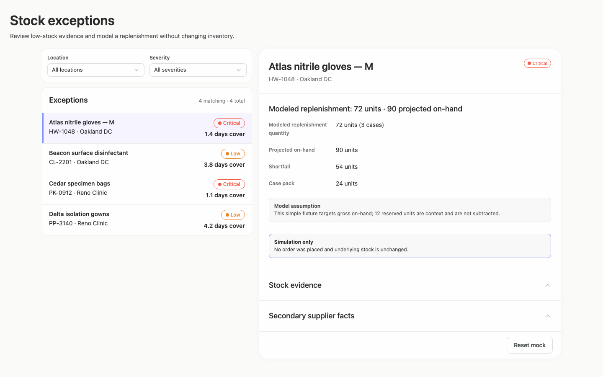
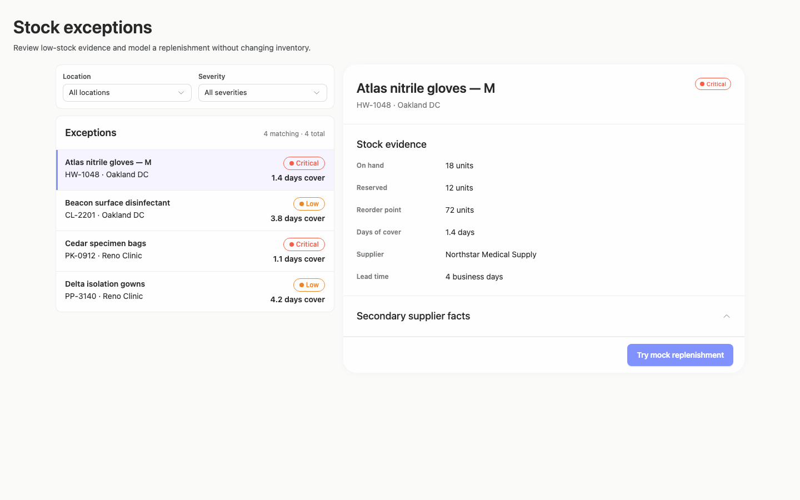
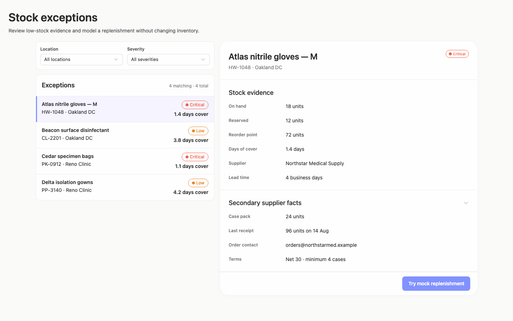
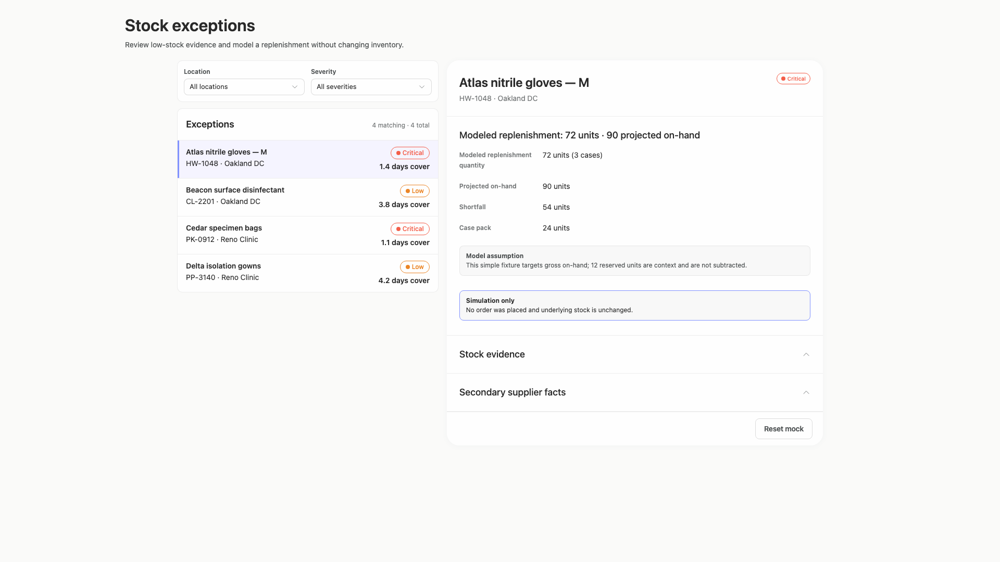
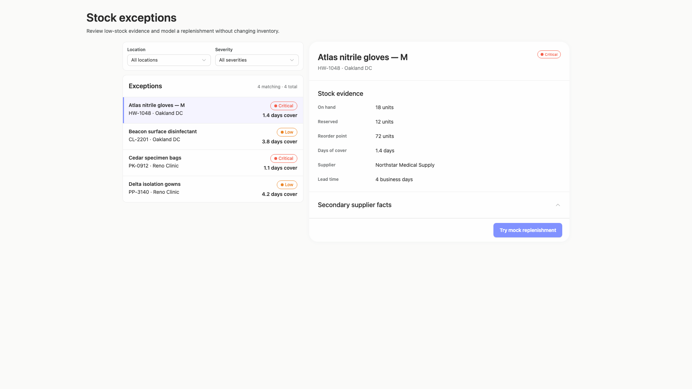
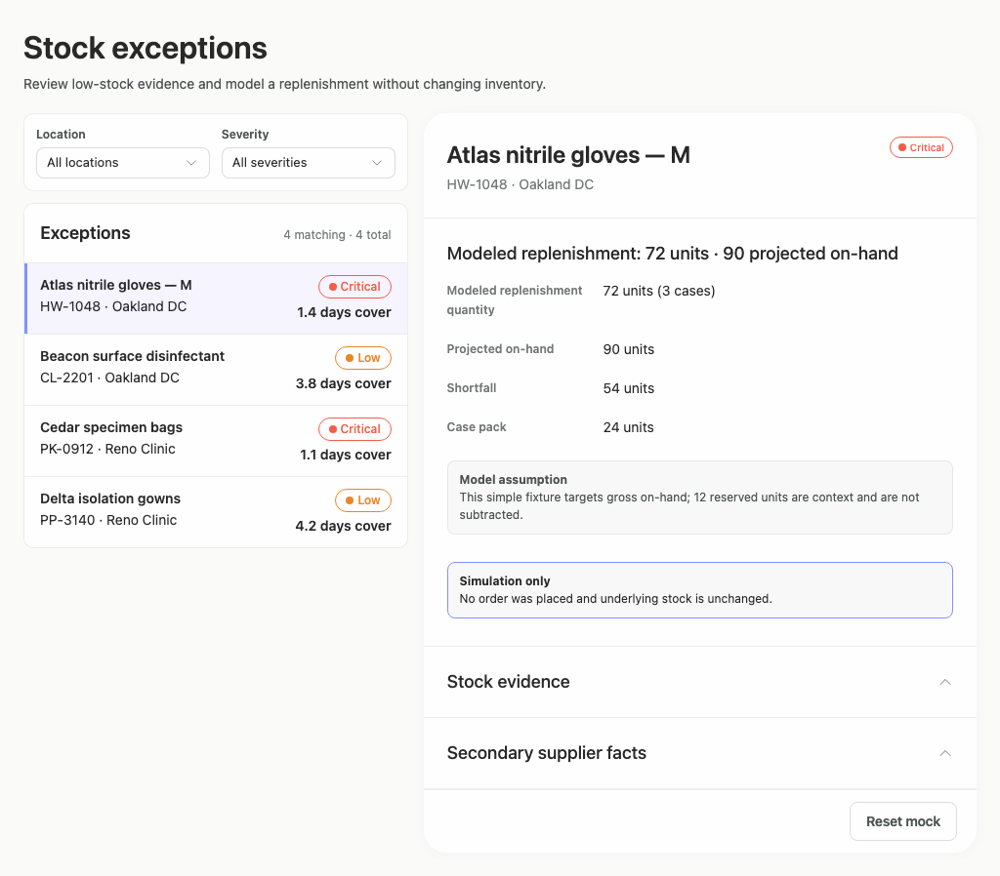
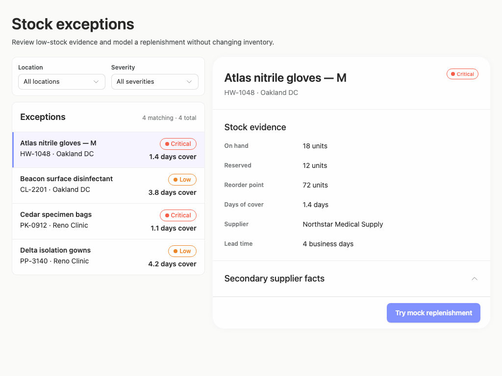
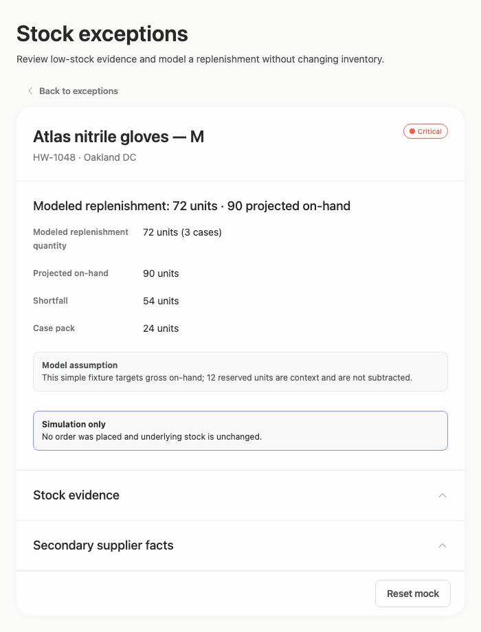

# stock-exceptions-outcome-summary — 2026-09-09T05:34:16.236Z

[All reports](../../README.md) · [Interactive HTML report](index.html) · [Full measurements and scoring](report.json)

GitHub renders this summary and the screenshots. Download or clone this folder to open the HTML report locally; GitHub does not serve it as a website.

**Subjective design score:** 85/100. Model: openai/gpt-5.6-sol. Rubric: 2.

**Arrusted adherence:** 100/100 (partial); evidence coverage 1.16%. Evaluator 3.

| Dimension | Conforming | Nonconforming | Unassessed | Adherence    |
| --------- | ---------- | ------------- | ---------- | ------------ |
| component | 15         | 0             | 2          | 100% (15/15) |
| api       | 33         | 0             | 13         | 100% (33/33) |
| styling   | 13         | 0             | 5166       | 100% (13/13) |

Scores from different evaluator versions or captured states are not directly comparable.

This report evaluates the captured preview; evaluation itself does not regenerate the app or prove a built backend. Scores are advisory and not human-calibrated.

## Ratings

| Dimension | Score | Reason |
| --- | --- | --- |
| hierarchy | 3/4 | The page title and task description establish context, filters precede the exception list, and selection clearly drives the larger detail panel. The modeled-result state appropriately promotes its outcome and simulation notice, though the similarly weighted detail fields make the ambiguous “Shortfall” value harder to interpret. |
| layout | 4/4 | Alignment, spacing, and density are consistently handled across the filter card, four-row exception list, and detail sections. The centered composition remains coherent from 1024px through 1920px, while the 700px constrained view uses the full available panel width without crowding. |
| typography | 3/4 | Product names, section headings, labels, and values use a consistent and readable hierarchy. Several 12px muted labels are near the measured contrast threshold, while the small red/orange status text has reported contrast between 2.63:1 and 3.2:1, weakening rapid severity scanning despite otherwise clear typography. |
| responsive | 4/4 | The composition adapts effectively across the supplied 700px, 1024px, 1440px, and 1920px desktop captures. Wide windows retain list and detail together, while the constrained 700px view switches to a focused detail panel with a visible “Back to exceptions” control; expanded and modeled states remain usable with ordinary document scrolling. |
| productClarity | 3/4 | Location and severity filters, selectable exception rows, stock and supplier evidence, and the mock action directly support the brief. The result explicitly says no order was placed and stock is unchanged. However, “Shortfall 54 units” is not identified as the pre-replenishment shortfall, and the disclosure chevron directions appear opposite to common collapsed/expanded expectations. |

## Strengths

- The list-detail relationship is immediately understandable, with a distinct selected-row treatment and matching product identity in the detail header.
- Exception rows expose the most decision-relevant data—location, severity, and days of cover—without excessive density.
- The mock replenishment result clearly distinguishes modeled quantity, projected stock, assumptions, and the fact that no real order was placed.
- Secondary supplier information is progressively disclosed, keeping the initial review concise while preserving access to case pack, receipt, contact, and terms.
- The constrained desktop composition provides a clear return path instead of compressing both list and detail into an unusably narrow split.

## Improvements

- **medium — desktop-1:** The modeled result labels “Shortfall” as 54 units after showing 72 replenishment units and 90 projected on-hand. The value appears to describe the current shortfall before replenishment, but its timing is not stated, making the result seem internally inconsistent. Rename the field to “Current shortfall before replenishment” or group it with explicit before-and-after values so the calculation sequence is unambiguous.
- **medium — desktop-0:** The repeated Critical and Low pills are central to prioritization, but their small status-colored text has reported contrast from 2.63:1 to 3.2:1. This makes severity harder to scan, especially because color and a small label carry most of the distinction. Keep the Arrusted palette and StatusPill component, but reinforce severity through composition—for example, include the severity as primary-weight row metadata or add a supported icon/text treatment so recognition does not depend on the pill color alone.
- **low — desktop-0:** “Secondary supplier facts” is collapsed, yet its chevron points upward; in desktop-3 the expanded section points downward. This reverses the common visual expectation and can make the disclosure state uncertain. Configure the public Disclosure component so the collapsed state indicates expansion and the expanded state indicates collapse consistently, without introducing a custom control.

## Token evidence

Percentages cover only assessed properties. Missing provenance and ambiguous CSS remain unassessed; matching literals are not proof of token usage.

| Viewport | Category | Token references / assessed | Coverage |
| --- | --- | --- | --- |
| desktop-0 | color | 0/0 | 0% (0/228) |
| desktop-0 | typography | 0/0 | 0% (0/518) |
| desktop-0 | spacing | 0/0 | 0% (0/274) |
| desktop-0 | radius | 0/0 | 0% (0/116) |
| desktop-0 | border | 0/0 | 0% (0/130) |
| desktop-0 | shadow | 0/0 | 0% (0/120) |
| desktop-wide-0 | color | 0/0 | 0% (0/228) |
| desktop-wide-0 | typography | 0/0 | 0% (0/518) |
| desktop-wide-0 | spacing | 0/0 | 0% (0/274) |
| desktop-wide-0 | radius | 0/0 | 0% (0/116) |
| desktop-wide-0 | border | 0/0 | 0% (0/130) |
| desktop-wide-0 | shadow | 0/0 | 0% (0/120) |
| desktop-window-0 | color | 0/0 | 0% (0/228) |
| desktop-window-0 | typography | 0/0 | 0% (0/518) |
| desktop-window-0 | spacing | 0/0 | 0% (0/274) |
| desktop-window-0 | radius | 0/0 | 0% (0/116) |
| desktop-window-0 | border | 0/0 | 0% (0/130) |
| desktop-window-0 | shadow | 0/0 | 0% (0/120) |
| desktop-custom-700x900-0 | color | 0/0 | 0% (0/162) |
| desktop-custom-700x900-0 | typography | 0/0 | 0% (0/410) |
| desktop-custom-700x900-0 | spacing | 0/0 | 0% (0/186) |
| desktop-custom-700x900-0 | radius | 0/0 | 0% (0/82) |
| desktop-custom-700x900-0 | border | 0/0 | 0% (0/86) |
| desktop-custom-700x900-0 | shadow | 0/0 | 0% (0/82) |

## Latest-run screenshots

### desktop-0 — initial

Interaction: not-run.

### desktop-1 — Mock replenishment result

Interaction: passed.

### desktop-2 — Reset from result footer

Interaction: passed.

### desktop-3 — Expanded supplier facts

Interaction: passed.

### desktop-wide-0 — initial

Interaction: not-run.

### desktop-wide-1 — Mock replenishment result

Interaction: passed.

### desktop-wide-2 — Reset from result footer

Interaction: passed.

### desktop-wide-3 — Expanded supplier facts

Interaction: passed.

### desktop-window-0 — initial

Interaction: not-run.

### desktop-window-1 — Mock replenishment result

Interaction: passed.

### desktop-window-2 — Reset from result footer

Interaction: passed.

### desktop-window-3 — Expanded supplier facts

Interaction: passed.

### desktop-custom-700x900-0 — initial

Interaction: not-run.

### desktop-custom-700x900-1 — Mock replenishment result

Interaction: passed.

### desktop-custom-700x900-2 — Reset from result footer

Interaction: passed.

### desktop-custom-700x900-3 — Expanded supplier facts

Interaction: passed.

## Limitations

- The screenshots do not demonstrate changed filter selections, empty results, alternate item selection, or keyboard interaction, so those states were not evaluated.
- The mock and reset interactions passed for the supplied states, but screenshots cannot establish persistence, authorization, or backend behavior.
- Only the supplied desktop widths and panel states were assessed; intermediate resized widths were not shown.
- A separate implementation-plan artifact is not visible in the evidence, so its completeness cannot be evaluated.
- Static source and adherence evidence do not prove that every dynamic component branch rendered or that every callback works.
